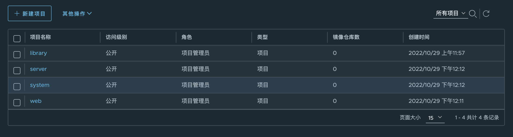
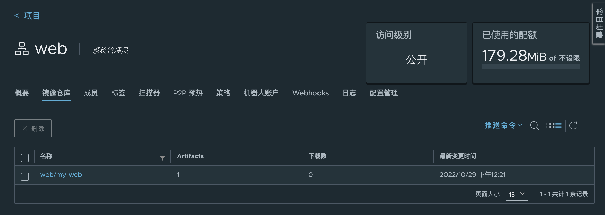
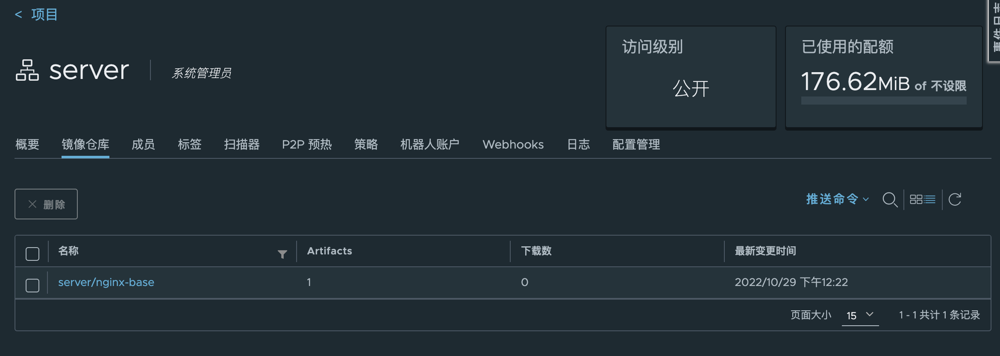
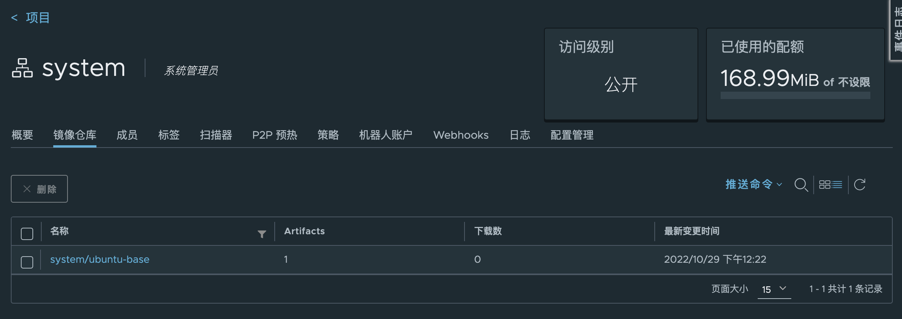

# 1. 基于dockerfile，实现分层构建的nginx业务镜像 
## 1.1 制作ubuntu系统基础镜像
选用ubuntu-22.10作为基础镜像，安装需要使用的基本软件
```
root@ubuntu:~# cd /opt/
root@ubuntu:/opt# mkdir -p nginx-img/system-base
root@ubuntu:/opt# cd nginx-img/system-base/
root@ubuntu:/opt/nginx-img/system-base# docker build -t harbor.yanggc.cn/system/ubuntu-base:22.10 .
root@ubuntu:/opt/nginx-img/nginx-base# docker image ls
REPOSITORY                            TAG       IMAGE ID       CREATED          SIZE
harbor.yanggc.cn/system/ubuntu-base   22.10     599eea9c5966   16 minutes ago   445MB
ubuntu                                22.10     0f175c10c2b4   2 days ago       70.2MB
```
制作镜像的Dockerfile:
[Dockerfile](dockerfiles/system-base)

## 1.2 制作nginx基础镜像
```bash
root@ubuntu:/opt/nginx-img/system-base# cd ..
root@ubuntu:/opt/nginx-img# mkdir nginx-base
root@ubuntu:/opt/nginx-img# cd nginx-base/
root@ubuntu:/opt/nginx-img/nginx-base# vi Dockerfile
root@ubuntu:/opt/nginx-img/nginx-base# wget https://nginx.org/download/nginx-1.22.1.tar.gz
root@ubuntu:/opt/nginx-img/nginx-base# docker build -t harbor.yanggc.cn/server/nginx-base:v1.22.1 .
root@ubuntu:/opt/nginx-img/nginx-base# docker image ls
REPOSITORY                            TAG       IMAGE ID       CREATED          SIZE
harbor.yanggc.cn/server/nginx-base    v1.22.1   3db80d4cd23f   2 minutes ago    469MB
harbor.yanggc.cn/system/ubuntu-base   22.10     599eea9c5966   16 minutes ago   445MB
ubuntu                                22.10     0f175c10c2b4   2 days ago       70.2MB
```
制作镜像的Dockerfile:
[Dockerfile](dockerfiles/nginx-base)

## 1.3 制作web服务镜像
```bash
root@ubuntu:/opt/nginx-img/nginx-base# cd ..
root@ubuntu:/opt/nginx-img# mkdir nginx-web1
root@ubuntu:/opt/nginx-img# cd nginx-web1/
root@ubuntu:/opt/nginx-img/nginx-web1# vi Dockerfile
root@ubuntu:/opt/nginx-img/nginx-web1# docker build -t harbor.yanggc.cn/web/my-web:v1.0.0 .
root@ubuntu:/opt/nginx-img/nginx-web1# docker image ls
REPOSITORY                            TAG       IMAGE ID       CREATED          SIZE
harbor.yanggc.cn/web/my-web           v1.0.0    9fafe271ad32   42 seconds ago   474MB
harbor.yanggc.cn/server/nginx-base    v1.22.1   3db80d4cd23f   22 minutes ago   469MB
harbor.yanggc.cn/system/ubuntu-base   22.10     599eea9c5966   36 minutes ago   445MB
ubuntu                                22.10     0f175c10c2b4   2 days ago       70.2MB
```
制作镜像的Dockerfile:
[Dockerfile](dockerfiles/my-web)

## 1.4 启动一个web服务
```bash
root@ubuntu:/opt/nginx-img/nginx-web1# docker run -d --name my-web1 -p 80:80 harbor.yanggc.cn/web/my-web:v1.0.0
c8518ef14a734b0adfa18fd8e19065007a480a08d9428b737eac201382ebfb04
root@ubuntu:/opt/nginx-img/nginx-web1# curl localhost
<!DOCTYPE html>
<html lang="en">
<head>
    <meta charset="UTF-8">
    <title>风飘吾独思欢迎您的访问</title>
</head>
<body>
<h2>风飘吾独思欢迎您的访问</h2>

<p>
    <a href="http://ygc.wiki" target="_blank">app跳转</a>
</p>
</body>
</html>
```
# 2. 基于 docker 实现对容器的 CPU 和内存的资源限制
* 对于Linux 主机，如果没有足够的内容来执行其他重要的系统任务，将会抛出 OOM (Out of Memory Exception,内存溢出、内存泄漏 内存异常), 随后系统会开始杀死进程以释放内存，凡是运行在宿主机的进程都有可能被 kill，包括Dockerd和其它的应用程序，如果重要 的系统进程被Kill,会导致和该进程相关的服务全部宕机。
* 默认情况下，容器没有资源限制，可以使用主机内核调度程序允许的尽可能多的给定资源，Docker提供了控制容器可以限制容器使用多少内存或CPU的 方法，运行docker run命令创建容器的时候可以进行资源限制。
* Docker早期使用cgroupfs进行容器的资源限制管理，然后再调用内核的cgroup进行资源限制，而kubernetes后来使用systemd直接调用cgroup对进程 实现资源限制，等于绕过了docker的cgroupfs的管理，对资源限制更严格、性能更好，因此在kubernetes环境推荐使用systemd进行资源限制。
  * "exec-opts": ["native.cgroupdriver=systemd"],
  * "exec-opts": ["native.cgroupdriver=cgroupfs"],
* 其中许多功能都要求宿主机的内核支持Linux功能，要检查支持，可以使用docker info命令，如果内核中禁用了某项功能，可能会在输出结尾处看到警 告，如下所示:
  * WARNING: No swap limit support
* 解决办法:
  * root@docker-server1:~# vim /etc/default/grub
    * GRUB_CMDLINE_LINUX="net.ifnames=0 biosdevname=0 cgroup_enable=memory swapaccount=1"
  * root@docker-server1:~# sudo update-grub
  * root@docker-server1:~# reboot

## 2.1 限制容器内存
* Docker 可以强制执行硬性内存限制，即只允许容器使用给定的内存大小。
* Docker 也可以执行非硬性内存限制，即容器可以使用尽可能多的内存，除非内核检测到主机上的内存不够用了。
* 大部分的选项取正整数，跟着一个后缀b，k， m，g，，表示字节，千字节，兆字节或千兆字节。
  * Most of these options take a positive integer, followed by a suffix of b, k, m, g, to indicate bytes, kilobytes, megabytes, or gigabytes.
* --oom-score-adj #宿主机kernel对进程使用的内存进行评分，评分最高的将被宿主机内核kill掉(越低越不容易被kill)，可以指定一个 容器的评分为较低的负数，但是不推荐手动指定。
* --oom-kill-disable #对某个容器关闭oom机制。
* 物理内存限制参数:
  * -m or --memory #限制容器可以使用的最大内存量，如果设置此选项，最小存值为4m(4兆字节)
  * --memory-swap #容器可以使用的交换分区大小，必须要在设置了物理内存限制的前提才能设置交换分区的限制
  * --memory-swappiness #设置容器使用交换分区的倾向性，值越高表示越倾向于使用swap分区，范围为0-100，0为能不用就不用，100为 能用就用
  * --kernel-memory #容器可以使用的最大内核内存量，最小为4m，由于内核内存与用户空间内存隔离，因此无法与用户空间内存直接交换， 因此内核内存不足的容器可能会阻塞宿主主机资源，这会对主机和其他容器或者其他服务进程产生影响，因此不要设置内核内存大小。
  * --memory-reservation #允许指定小于--memory的软限制，当Docker检测到主机上的争用或内存不足时会激活该限制，如果使用-- memory-reservation，则必须将其设置为低于--memory才能使其优先。 因为它是软限制，所以不能保证容器不超过限制。
  * --oom-kill-disable #默认情况下，发生OOM时，kernel会杀死容器内进程，但是可以使用--oom-kill-disable参数，可以禁止oom发生在指 定的容器上，即 仅在已设置-m / - memory选项的容器上禁用OOM，如果-m 参数未配置，产生OOM时，主机为了释放内存还会杀死系统进程。
### 2.1.1 物理内存限制验证
假如一个容器未做内存使用限制，则该容器可以利用到系统内存最大空间，默认创建的容器没有做内存资源限制。
```bash
root@ubuntu:~# docker pull lorel/docker-stress-ng
docker run -it --rm lorel/docker-stress-ng --help
```
### 2.1.2 不限制容器内存：
* 启动两个内存工作进程，每个内存工作进程最大允许使用内存256M，且宿主机不限制当前容器最大内存:
```bash
root@ubuntu:~# docker run -it --rm --name magedu-c1 lorel/docker-stress-ng --vm 2 --vm-bytes 256M
root@ubuntu:~# docker stats
CONTAINER ID   NAME        CPU %     MEM USAGE / LIMIT     MEM %     NET I/O     BLOCK I/O   PIDS
c9932bfc4b8e   magedu-c1   199.33%   515.8MiB / 3.832GiB   13.14%    876B / 0B   0B / 0B     5
CONTAINER ID   NAME        CPU %     MEM USAGE / LIMIT     MEM %     NET I/O     BLOCK I/O   PIDS
c9932bfc4b8e   magedu-c1   199.33%   515.8MiB / 3.832GiB   13.14%    876B / 0B   0B / 0B     5
CONTAINER ID   NAME        CPU %     MEM USAGE / LIMIT     MEM %     NET I/O     BLOCK I/O   PIDS
c9932bfc4b8e   magedu-c1   199.31%   515.8MiB / 3.832GiB   13.14%    876B / 0B   0B / 0B     5
CONTAINER ID   NAME        CPU %     MEM USAGE / LIMIT     MEM %     NET I/O     BLOCK I/O   PIDS
c9932bfc4b8e   magedu-c1   199.31%   515.8MiB / 3.832GiB   13.14%    876B / 0B   0B / 0B     5
CONTAINER ID   NAME        CPU %     MEM USAGE / LIMIT     MEM %     NET I/O     BLOCK I/O   PIDS
c9932bfc4b8e   magedu-c1   200.17%   515.8MiB / 3.832GiB   13.14%    946B / 0B   0B / 0B     5
CONTAINER ID   NAME        CPU %     MEM USAGE / LIMIT     MEM %     NET I/O     BLOCK I/O   PIDS
c9932bfc4b8e   magedu-c1   200.17%   515.8MiB / 3.832GiB   13.14%    946B / 0B   0B / 0B     5
```
通过观察可以看到容器内存维持在515MiB左右，和容器使用的内存512MiB比较接近

### 2.1.3 限制容器最大内存
```bash
root@ubuntu:~# docker run -it --rm -m 256m --name magedu-c1 lorel/docker-stress-ng --vm 2 --vm-bytes 256M
root@ubuntu:~# docker stats
CONTAINER ID   NAME        CPU %     MEM USAGE / LIMIT   MEM %     NET I/O     BLOCK I/O   PIDS
064e7447c3cc   magedu-c1   198.40%   90.02MiB / 256MiB   35.17%    876B / 0B   0B / 0B     5
CONTAINER ID   NAME        CPU %     MEM USAGE / LIMIT   MEM %     NET I/O     BLOCK I/O   PIDS
064e7447c3cc   magedu-c1   198.40%   90.02MiB / 256MiB   35.17%    876B / 0B   0B / 0B     5
CONTAINER ID   NAME        CPU %     MEM USAGE / LIMIT   MEM %     NET I/O     BLOCK I/O   PIDS
064e7447c3cc   magedu-c1   193.54%   228.5MiB / 256MiB   89.27%    876B / 0B   0B / 0B     5
CONTAINER ID   NAME        CPU %     MEM USAGE / LIMIT   MEM %     NET I/O     BLOCK I/O   PIDS
064e7447c3cc   magedu-c1   193.54%   228.5MiB / 256MiB   89.27%    876B / 0B   0B / 0B     5
CONTAINER ID   NAME        CPU %     MEM USAGE / LIMIT   MEM %     NET I/O     BLOCK I/O   PIDS
064e7447c3cc   magedu-c1   194.93%   163.1MiB / 256MiB   63.72%    876B / 0B   0B / 0B     5
CONTAINER ID   NAME        CPU %     MEM USAGE / LIMIT   MEM %     NET I/O     BLOCK I/O   PIDS
064e7447c3cc   magedu-c1   194.93%   163.1MiB / 256MiB   63.72%    876B / 0B   0B / 0B     5
CONTAINER ID   NAME        CPU %     MEM USAGE / LIMIT   MEM %     NET I/O     BLOCK I/O   PIDS
064e7447c3cc   magedu-c1   195.14%   127MiB / 256MiB     49.60%    876B / 0B   0B / 0B     5
CONTAINER ID   NAME        CPU %     MEM USAGE / LIMIT   MEM %     NET I/O     BLOCK I/O   PIDS
064e7447c3cc   magedu-c1   195.14%   127MiB / 256MiB     49.60%    876B / 0B   0B / 0B     5
CONTAINER ID   NAME        CPU %     MEM USAGE / LIMIT   MEM %     NET I/O     BLOCK I/O   PIDS
064e7447c3cc   magedu-c1   195.55%   254.7MiB / 256MiB   99.48%    876B / 0B   0B / 0B     5
CONTAINER ID   NAME        CPU %     MEM USAGE / LIMIT   MEM %     NET I/O     BLOCK I/O   PIDS
064e7447c3cc   magedu-c1   195.55%   254.7MiB / 256MiB   99.48%    876B / 0B   0B / 0B     5
CONTAINER ID   NAME        CPU %     MEM USAGE / LIMIT   MEM %     NET I/O     BLOCK I/O   PIDS
064e7447c3cc   magedu-c1   191.41%   174.2MiB / 256MiB   68.03%    876B / 0B   0B / 0B     5
CONTAINER ID   NAME        CPU %     MEM USAGE / LIMIT   MEM %     NET I/O     BLOCK I/O   PIDS
064e7447c3cc   magedu-c1   191.41%   174.2MiB / 256MiB   68.03%    876B / 0B   0B / 0B     5
CONTAINER ID   NAME        CPU %     MEM USAGE / LIMIT   MEM %     NET I/O     BLOCK I/O   PIDS
064e7447c3cc   magedu-c1   191.75%   120.1MiB / 256MiB   46.90%    946B / 0B   0B / 0B     5
CONTAINER ID   NAME        CPU %     MEM USAGE / LIMIT   MEM %     NET I/O     BLOCK I/O   PIDS
064e7447c3cc   magedu-c1   191.75%   120.1MiB / 256MiB   46.90%    946B / 0B   0B / 0B     5
```

# 3.部署http协议的harbor镜像仓库
## 3.1 下载harbor安装包
```bash
### 由于国内拉取海外镜像比较慢，使用离线安装包进行安装
root@ubuntu-harbor:~# wget https://github.com/goharbor/harbor/releases/download/v2.6.1/harbor-offline-installer-v2.6.1.tgz
```
## 3.2 安装harbor
```bash
root@ubuntu-harbor:~# tar -xzvf harbor-offline-installer-v2.6.1.tgz
root@ubuntu-harbor:~/harbor# cp harbor.yml.tmpl harbor.yml
root@ubuntu-harbor:~/harbor# vi harbor.yml
root@ubuntu-harbor:~/harbor# ./install.sh

[Step 0]: checking if docker is installed ...

Note: docker version: 20.10.18

[Step 1]: checking docker-compose is installed ...

Note: docker-compose version: 1.28.6

[Step 2]: loading Harbor images ...
19b3e561bd53: Loading layer [==================================================>]  37.69MB/37.69MB
b1c55ad746b8: Loading layer [==================================================>]  5.754MB/5.754MB
3fad059e5b96: Loading layer [==================================================>]  8.718MB/8.718MB
ac3d56834181: Loading layer [==================================================>]  15.88MB/15.88MB
ac64291e7095: Loading layer [==================================================>]  29.29MB/29.29MB
347c69d047c1: Loading layer [==================================================>]  22.02kB/22.02kB
2bc68bdd74b4: Loading layer [==================================================>]  15.88MB/15.88MB
Loaded image: goharbor/notary-server-photon:v2.6.1
a3f881ff8a8a: Loading layer [==================================================>]  5.759MB/5.759MB
bf4fe2665116: Loading layer [==================================================>]  90.88MB/90.88MB
1bbf13d3b736: Loading layer [==================================================>]  3.072kB/3.072kB
6864945044da: Loading layer [==================================================>]  4.096kB/4.096kB
e74206fce300: Loading layer [==================================================>]  91.67MB/91.67MB
Loaded image: goharbor/chartmuseum-photon:v2.6.1
d1cca5e33760: Loading layer [==================================================>]  126.9MB/126.9MB
f21ade3affb4: Loading layer [==================================================>]  3.584kB/3.584kB
2b10bb22d396: Loading layer [==================================================>]  3.072kB/3.072kB
cddb26029f4f: Loading layer [==================================================>]   2.56kB/2.56kB
120e581fca06: Loading layer [==================================================>]  3.072kB/3.072kB
b55ab4161be8: Loading layer [==================================================>]  3.584kB/3.584kB
708b88dc9728: Loading layer [==================================================>]  20.99kB/20.99kB
Loaded image: goharbor/harbor-log:v2.6.1
aa3c0eeab3fd: Loading layer [==================================================>]  5.759MB/5.759MB
08acd59679e5: Loading layer [==================================================>]  4.096kB/4.096kB
dbfa72b62e7c: Loading layer [==================================================>]   17.1MB/17.1MB
3db46c922bff: Loading layer [==================================================>]  3.072kB/3.072kB
db46f9ab20a1: Loading layer [==================================================>]  29.15MB/29.15MB
c28b264c5c77: Loading layer [==================================================>]  47.04MB/47.04MB
Loaded image: goharbor/harbor-registryctl:v2.6.1
46e1d8c22785: Loading layer [==================================================>]  119.1MB/119.1MB
Loaded image: goharbor/nginx-photon:v2.6.1
ebe1f7ed9475: Loading layer [==================================================>]  7.162MB/7.162MB
780db4ad3bef: Loading layer [==================================================>]  4.096kB/4.096kB
dc07146a4e90: Loading layer [==================================================>]  3.072kB/3.072kB
2cdc8f8be3a6: Loading layer [==================================================>]  91.21MB/91.21MB
d4efae655490: Loading layer [==================================================>]  12.86MB/12.86MB
c11badbab4ee: Loading layer [==================================================>]  104.9MB/104.9MB
Loaded image: goharbor/trivy-adapter-photon:v2.6.1
6ada5ff70437: Loading layer [==================================================>]  43.85MB/43.85MB
070561aa0752: Loading layer [==================================================>]   65.9MB/65.9MB
af13505c0fbc: Loading layer [==================================================>]  19.14MB/19.14MB
8eaa0fe4e73c: Loading layer [==================================================>]  65.54kB/65.54kB
9ffc621c4d1d: Loading layer [==================================================>]   2.56kB/2.56kB
4f311e4137a0: Loading layer [==================================================>]  1.536kB/1.536kB
d1ecbcc8c146: Loading layer [==================================================>]  12.29kB/12.29kB
313e339c685b: Loading layer [==================================================>]  2.613MB/2.613MB
6f748b2ed0dc: Loading layer [==================================================>]  379.9kB/379.9kB
Loaded image: goharbor/prepare:v2.6.1
59c6fef03969: Loading layer [==================================================>]  1.097MB/1.097MB
0b0d97fd8a80: Loading layer [==================================================>]  5.888MB/5.888MB
6f21e17052fb: Loading layer [==================================================>]    169MB/169MB
480717132aea: Loading layer [==================================================>]  16.96MB/16.96MB
817dc53a51cf: Loading layer [==================================================>]  4.096kB/4.096kB
beeda54c09df: Loading layer [==================================================>]  6.144kB/6.144kB
0de0c418dfa2: Loading layer [==================================================>]  3.072kB/3.072kB
394a42c14a01: Loading layer [==================================================>]  2.048kB/2.048kB
c53687716453: Loading layer [==================================================>]   2.56kB/2.56kB
46e9e5d728c4: Loading layer [==================================================>]   2.56kB/2.56kB
e05b0e58bb47: Loading layer [==================================================>]   2.56kB/2.56kB
85d4f51c325c: Loading layer [==================================================>]  8.704kB/8.704kB
Loaded image: goharbor/harbor-db:v2.6.1
0bfa75b1d074: Loading layer [==================================================>]  8.902MB/8.902MB
0dda41e1e1a6: Loading layer [==================================================>]  3.584kB/3.584kB
13be21b41d86: Loading layer [==================================================>]   2.56kB/2.56kB
f92838d6a967: Loading layer [==================================================>]  97.91MB/97.91MB
e97573477193: Loading layer [==================================================>]   98.7MB/98.7MB
Loaded image: goharbor/harbor-jobservice:v2.6.1
15fecb8d6c42: Loading layer [==================================================>]  119.1MB/119.1MB
098f54fce48f: Loading layer [==================================================>]  7.535MB/7.535MB
3dc6ef297f52: Loading layer [==================================================>]  1.185MB/1.185MB
Loaded image: goharbor/harbor-portal:v2.6.1
775b1ccf1721: Loading layer [==================================================>]  5.754MB/5.754MB
f4ef31b9659f: Loading layer [==================================================>]  8.718MB/8.718MB
7c9e733a4621: Loading layer [==================================================>]  14.47MB/14.47MB
148050e3b89d: Loading layer [==================================================>]  29.29MB/29.29MB
500fdc71742e: Loading layer [==================================================>]  22.02kB/22.02kB
d38ecdf0c794: Loading layer [==================================================>]  14.47MB/14.47MB
Loaded image: goharbor/notary-signer-photon:v2.6.1
0b6707dd33bc: Loading layer [==================================================>]  5.759MB/5.759MB
8107a2426b6d: Loading layer [==================================================>]  4.096kB/4.096kB
130b71e83c08: Loading layer [==================================================>]  3.072kB/3.072kB
3daa3b45e084: Loading layer [==================================================>]   17.1MB/17.1MB
e1f022373798: Loading layer [==================================================>]   17.9MB/17.9MB
Loaded image: goharbor/registry-photon:v2.6.1
b8ab82a27cb4: Loading layer [==================================================>]  8.902MB/8.902MB
031794af342e: Loading layer [==================================================>]  3.584kB/3.584kB
a6c93180465a: Loading layer [==================================================>]   2.56kB/2.56kB
1181f6dc3b6f: Loading layer [==================================================>]  80.74MB/80.74MB
6aea11036399: Loading layer [==================================================>]  5.632kB/5.632kB
84ea4b6c2a1f: Loading layer [==================================================>]  105.5kB/105.5kB
9da21a8aaea8: Loading layer [==================================================>]  44.03kB/44.03kB
3a6281e6c8dc: Loading layer [==================================================>]  81.68MB/81.68MB
57ba35dc2c40: Loading layer [==================================================>]   2.56kB/2.56kB
Loaded image: goharbor/harbor-core:v2.6.1
24243fc0136d: Loading layer [==================================================>]  8.902MB/8.902MB
9778bfbfaf4b: Loading layer [==================================================>]  24.64MB/24.64MB
c904704d3e3f: Loading layer [==================================================>]  4.608kB/4.608kB
0ee8cf6901bd: Loading layer [==================================================>]  25.43MB/25.43MB
Loaded image: goharbor/harbor-exporter:v2.6.1
5e3e5b804996: Loading layer [==================================================>]  119.9MB/119.9MB
c7323c3b23ff: Loading layer [==================================================>]  3.072kB/3.072kB
6ab347b42178: Loading layer [==================================================>]   59.9kB/59.9kB
4587d0666b27: Loading layer [==================================================>]  61.95kB/61.95kB
Loaded image: goharbor/redis-photon:v2.6.1


[Step 3]: preparing environment ...

[Step 4]: preparing harbor configs ...
prepare base dir is set to /root/harbor
WARNING:root:WARNING: HTTP protocol is insecure. Harbor will deprecate http protocol in the future. Please make sure to upgrade to https
Generated configuration file: /config/portal/nginx.conf
Generated configuration file: /config/log/logrotate.conf
Generated configuration file: /config/log/rsyslog_docker.conf
Generated configuration file: /config/nginx/nginx.conf
Generated configuration file: /config/core/env
Generated configuration file: /config/core/app.conf
Generated configuration file: /config/registry/config.yml
Generated configuration file: /config/registryctl/env
Generated configuration file: /config/registryctl/config.yml
Generated configuration file: /config/db/env
Generated configuration file: /config/jobservice/env
Generated configuration file: /config/jobservice/config.yml
Generated and saved secret to file: /data/secret/keys/secretkey
Successfully called func: create_root_cert
Generated configuration file: /compose_location/docker-compose.yml
Clean up the input dir


Note: stopping existing Harbor instance ...
Removing network harbor_harbor
WARNING: Network harbor_harbor not found.


[Step 5]: starting Harbor ...
Creating network "harbor_harbor" with the default driver
Creating harbor-log ... done
Creating registryctl   ... done
Creating harbor-db     ... done
Creating harbor-portal ... done
Creating registry      ... done
Creating redis         ... done
Creating harbor-core   ... done
Creating nginx             ... done
Creating harbor-jobservice ... done
✔ ----Harbor has been installed and started successfully.----
root@ubuntu-harbor:~/harbor# docker-compose ps
      Name                     Command                  State                      Ports
--------------------------------------------------------------------------------------------------------
harbor-core         /harbor/entrypoint.sh            Up (healthy)
harbor-db           /docker-entrypoint.sh 96 13      Up (healthy)
harbor-jobservice   /harbor/entrypoint.sh            Up (healthy)
harbor-log          /bin/sh -c /usr/local/bin/ ...   Up (healthy)   127.0.0.1:1514->10514/tcp
harbor-portal       nginx -g daemon off;             Up (healthy)
nginx               nginx -g daemon off;             Up (healthy)   0.0.0.0:80->8080/tcp,:::80->8080/tcp
redis               redis-server /etc/redis.conf     Up (healthy)
registry            /home/harbor/entrypoint.sh       Up (healthy)
registryctl         /home/harbor/start.sh            Up (healthy)
```
* harbor 模板文件 [harbor.yml](harbor/harbor.yml)

## 3.3 使用harbor
```bash
# 配置hosts域名解析
root@ubuntu:~# vi /etc/hosts
192.168.34.4 harbor.yanggc.cn
# 测试配置的解析是否可以正常访问
root@ubuntu:~# ping harbor.yanggc.cn
PING harbor.yanggc.cn (192.168.34.4) 56(84) bytes of data.
64 bytes from harbor.yanggc.cn (192.168.34.4): icmp_seq=1 ttl=64 time=0.593 ms
64 bytes from harbor.yanggc.cn (192.168.34.4): icmp_seq=2 ttl=64 time=0.409 ms
64 bytes from harbor.yanggc.cn (192.168.34.4): icmp_seq=3 ttl=64 time=0.572 ms
^C
--- harbor.yanggc.cn ping statistics ---
3 packets transmitted, 3 received, 0% packet loss, time 2034ms
rtt min/avg/max/mdev = 0.409/0.524/0.593/0.082 ms
#docker服务配置http仓库信任
root@ubuntu:~# vi /etc/docker/daemon.json
  "insecure-registries": ["harbor.magedu.com","harbor.myserver.com","172.31.7.105","harbor.yanggc.cn"],
# 重启docker服务
root@ubuntu:~# systemctl restart docker
# 登录docker root@ubuntu:~# docker login harbor.yanggc.cn
Username: admin
Password:
WARNING! Your password will be stored unencrypted in /root/.docker/config.json.
Configure a credential helper to remove this warning. See
https://docs.docker.com/engine/reference/commandline/login/#credentials-store

Login Succeeded
```
* 在harbor控制台新建3个projectweb、server、system

* 把做好的分层镜像推送到harbor
```bash
root@ubuntu:~# docker push harbor.yanggc.cn/web/my-web:v1.0.0
The push refers to repository [harbor.yanggc.cn/web/my-web]
56333b4a37e3: Pushed
8960e9f96224: Pushed
c6488730af65: Pushed
a713324178d3: Pushed
81a07a7dd808: Pushed
372fc39eb011: Pushed
cd1929199a9a: Pushed
v1.0.0: digest: sha256:067d6e576819f7bc11493b2bdb7db1ca9b527d2df74e598c8a7d6c965a86842c size: 1792
root@ubuntu:~# docker push harbor.yanggc.cn/server/nginx-base:v1.22.1
The push refers to repository [harbor.yanggc.cn/server/nginx-base]
a713324178d3: Mounted from web/my-web
81a07a7dd808: Mounted from web/my-web
372fc39eb011: Mounted from web/my-web
cd1929199a9a: Mounted from web/my-web
v1.22.1: digest: sha256:8ee8bab31c30d73e1f9ca087c13102aba424a365efadbb7e425f65a9c9c12397 size: 1164
root@ubuntu:~# docker push harbor.yanggc.cn/system/ubuntu-base:22.10
The push refers to repository [harbor.yanggc.cn/system/ubuntu-base]
372fc39eb011: Mounted from server/nginx-base
cd1929199a9a: Mounted from server/nginx-base
22.10: digest: sha256:6c17ff4de3d5f17a56b5d252454e53f7d1eb4226645a9c065b80612f6e0436ca size: 742
```
在harbor上可以看到推送的镜像如下图：  
web 
  
server

system

* 拉取镜像，启动一个服务
```bash
# 清空本地镜像
root@ubuntu:~# docker image rm $(docker image ls -a -q) -f
root@ubuntu:~# docker image ls
REPOSITORY   TAG       IMAGE ID   CREATED   SIZE
# 拉取my-wen镜像
root@ubuntu:~# docker pull harbor.yanggc.cn/web/my-web:v1.0.0
v1.0.0: Pulling from web/my-web
bcd446fbf8a1: Pull complete
b300885b56cd: Pull complete
ca8eeb62b927: Pull complete
ea84e6b9f0f7: Pull complete
05fd4fdb43b2: Pull complete
6b8bd1fb18d2: Pull complete
75609434b083: Pull complete
Digest: sha256:067d6e576819f7bc11493b2bdb7db1ca9b527d2df74e598c8a7d6c965a86842c
Status: Downloaded newer image for harbor.yanggc.cn/web/my-web:v1.0.0
harbor.yanggc.cn/web/my-web:v1.0.0
#启动一个容器
root@ubuntu:~# docker run -d --name my-web1 -p 80:80 harbor.yanggc.cn/web/my-web:v1.0.0
5a9e6c2cdc90d16560112813d1b6a71085ce7ca1291e084960ced95b67393312
#测试启动的容器服务
root@ubuntu:~# curl localhost
<!DOCTYPE html>
<html lang="en">
<head>
    <meta charset="UTF-8">
    <title>风飘吾独思欢迎您的访问</title>
</head>
<body>
<h2>风飘吾独思欢迎您的访问</h2>

<p>
    <a href="http://ygc.wiki" target="_blank">app跳转</a>
</p>
</body>
</html>
```
# 4.扩展作业
## 4.1 掌握containerd的安装
### 4.1.1 安装containerd
```bash
# step 1: 安装必要的一些系统工具
root@ubuntu:~# apt update
root@ubuntu:~# apt-get -y install apt-transport-https ca-certificates curl software-properties-common
# step 2: 安装GPG证书
root@ubuntu:~# curl -fsSL https://mirrors.aliyun.com/docker-ce/linux/ubuntu/gpg | sudo apt-key add -
# Step 3: 写入软件源信息
root@ubuntu:~# add-apt-repository "deb [arch=amd64] https://mirrors.aliyun.com/docker-ce/linux/ubuntu $(lsb_release -cs) stable"
# Step 4: 更新源
root@ubuntu:~# apt-get update
#Step 5: 查找containerd版本
root@ubuntu:~#  apt-cache madison containerd.io
containerd.io |    1.6.9-1 | https://mirrors.aliyun.com/docker-ce/linux/ubuntu jammy/stable amd64 Packages
containerd.io |    1.6.8-1 | https://mirrors.aliyun.com/docker-ce/linux/ubuntu jammy/stable amd64 Packages
containerd.io |    1.6.7-1 | https://mirrors.aliyun.com/docker-ce/linux/ubuntu jammy/stable amd64 Packages
containerd.io |    1.6.6-1 | https://mirrors.aliyun.com/docker-ce/linux/ubuntu jammy/stable amd64 Packages
containerd.io |    1.6.4-1 | https://mirrors.aliyun.com/docker-ce/linux/ubuntu jammy/stable amd64 Packages
containerd.io |   1.5.11-1 | https://mirrors.aliyun.com/docker-ce/linux/ubuntu jammy/stable amd64 Packages
containerd.io |   1.5.10-1 | https://mirrors.aliyun.com/docker-ce/linux/ubuntu jammy/stable amd64 Packages
#Step 6: 安装containerd
root@ubuntu:~# apt install containerd.io=1.6.9-1
#Step 7: 查看containerd默认配置
root@ubuntu:~#  containerd config default
#Step 8: 生成containerd默认配置模板
root@ubuntu:~# containerd config default > /etc/containerd/config.toml
#Step 9: 修改containerd配置模板
61     sandbox_image = "registry.aliyuncs.com/google_containers/pause:3.7"
153       [plugins."io.containerd.grpc.v1.cri".registry.mirrors]
154         [plugins."io.containerd.grpc.v1.cri".registry.mirrors."docker.io"]
155           endpoint=["https://9916w1ow.mirror.aliyuncs.com"]
#Step 10: 重启containerd并加入开机启动
root@ubuntu:~# systemctl restart containerd && systemctl enable containerd
```
### 4.1.2 更新runc
```bash
# Step 1: 下载安装包
root@ubuntu:~# wget https://github.com/opencontainers/runc/releases/download/v1.1.4/runc.amd64
# Step 2: 拷贝安装包
root@ubuntu:~# cp runc.amd64 /usr/bin/runc
# Step 3: 添加执行权限
root@ubuntu:~# chmod a+x /usr/bin/runc
# Step 4: 验证安装
root@ubuntu:~# runc -v
runc version 1.1.4
commit: v1.1.4-0-g5fd4c4d1
spec: 1.0.2-dev
go: go1.17.10
libseccomp: 2.5.4
```
### 4.1.3 ctr客户端使用
* containerd相比docker多了一个命名空间的逻辑概念，ctr命令默认是在default命名空间里，而在使用nerdctl命令的时候，却是在k8s.io命名空间里，所以 不指定namespace会发现看到的镜像、容器等内容不一样。
* ctr
```bahs
#拉取nginx镜像
root@ubuntu:~# ctr images pull docker.io/library/nginx:1.20.2
docker.io/library/nginx:1.20.2:                                                   resolved       |++++++++++++++++++++++++++++++++++++++|
index-sha256:38f8c1d9613f3f42e7969c3b1dd5c3277e635d4576713e6453c6193e66270a6d:    done           |++++++++++++++++++++++++++++++++++++++|
manifest-sha256:a76df3b4f1478766631c794de7ff466aca466f995fd5bb216bb9643a3dd2a6bb: done           |++++++++++++++++++++++++++++++++++++++|
layer-sha256:e8750203e98541223fb970b2b04058aae5ca11833a93b9f3df26bd835f66d223:    done           |++++++++++++++++++++++++++++++++++++++|
layer-sha256:50836501937ff210a4ee8eedcb17b49b3b7627c5b7104397b2a6198c569d9231:    done           |++++++++++++++++++++++++++++++++++++++|
config-sha256:0584b370e957bf9d09e10f424859a02ab0fda255103f75b3f8c7d410a4e96ed5:   done           |++++++++++++++++++++++++++++++++++++++|
layer-sha256:214ca5fb90323fe769c63a12af092f2572bf1c6b300263e09883909fc865d260:    done           |++++++++++++++++++++++++++++++++++++++|
layer-sha256:fcc7a415e354b2e1a2fcf80005278d0439a2f87556e683bb98891414339f9bee:    done           |++++++++++++++++++++++++++++++++++++++|
layer-sha256:d838e0361e8efc1fb3ec2b7aed16ba935ee9b62b6631c304256b0326c048a330:    done           |++++++++++++++++++++++++++++++++++++++|
layer-sha256:dc73b4533047ea21262e7d35b3b2598e3d2c00b6d63426f47698fe2adac5b1d6:    done           |++++++++++++++++++++++++++++++++++++++|
elapsed: 33.6s                                                                    total:  54.1 M (1.6 MiB/s)
unpacking linux/amd64 sha256:38f8c1d9613f3f42e7969c3b1dd5c3277e635d4576713e6453c6193e66270a6d...
done: 2.005404955s
#查看镜像
root@ubuntu:~# ctr images ls
REF                            TYPE                                                      DIGEST                                                                  SIZE     PLATFORMS                                                                                               LABELS
docker.io/library/nginx:1.20.2 application/vnd.docker.distribution.manifest.list.v2+json sha256:38f8c1d9613f3f42e7969c3b1dd5c3277e635d4576713e6453c6193e66270a6d 54.1 MiB linux/386,linux/amd64,linux/arm/v5,linux/arm/v7,linux/arm64/v8,linux/mips64le,linux/ppc64le,linux/s390x -
#运行容器并使用宿主机网络
root@ubuntu:~# ctr run -t --net-host docker.io/library/nginx:1.20.2 test-container1
/docker-entrypoint.sh: /docker-entrypoint.d/ is not empty, will attempt to perform configuration
/docker-entrypoint.sh: Looking for shell scripts in /docker-entrypoint.d/
/docker-entrypoint.sh: Launching /docker-entrypoint.d/10-listen-on-ipv6-by-default.sh
10-listen-on-ipv6-by-default.sh: info: Getting the checksum of /etc/nginx/conf.d/default.conf
10-listen-on-ipv6-by-default.sh: info: Enabled listen on IPv6 in /etc/nginx/conf.d/default.conf
/docker-entrypoint.sh: Launching /docker-entrypoint.d/20-envsubst-on-templates.sh
/docker-entrypoint.sh: Launching /docker-entrypoint.d/30-tune-worker-processes.sh
/docker-entrypoint.sh: Configuration complete; ready for start up
2022/10/29 05:43:48 [notice] 1#1: using the "epoll" event method
2022/10/29 05:43:48 [notice] 1#1: nginx/1.20.2
2022/10/29 05:43:48 [notice] 1#1: built by gcc 10.2.1 20210110 (Debian 10.2.1-6)
2022/10/29 05:43:48 [notice] 1#1: OS: Linux 5.15.0-50-generic
2022/10/29 05:43:48 [notice] 1#1: getrlimit(RLIMIT_NOFILE): 1024:1024
2022/10/29 05:43:48 [notice] 1#1: start worker processes
2022/10/29 05:43:48 [notice] 1#1: start worker process 32
2022/10/29 05:43:48 [notice] 1#1: start worker process 33
^C2022/10/29 05:43:56 [notice] 1#1: signal 2 (SIGINT) received, exiting
2022/10/29 05:43:56 [notice] 33#33: signal 2 (SIGINT) received, exiting
2022/10/29 05:43:56 [notice] 33#33: exiting
2022/10/29 05:43:56 [notice] 32#32: signal 2 (SIGINT) received, exiting
2022/10/29 05:43:56 [notice] 33#33: exit
2022/10/29 05:43:56 [notice] 32#32: exiting
2022/10/29 05:43:56 [notice] 32#32: exit
2022/10/29 05:43:56 [notice] 1#1: signal 17 (SIGCHLD) received from 32
2022/10/29 05:43:56 [notice] 1#1: worker process 32 exited with code 0
2022/10/29 05:43:56 [notice] 1#1: signal 29 (SIGIO) received
2022/10/29 05:43:56 [notice] 1#1: signal 17 (SIGCHLD) received from 33
2022/10/29 05:43:56 [notice] 1#1: worker process 33 exited with code 0
2022/10/29 05:43:56 [notice] 1#1: exit
# 访问测试
root@ubuntu:~# curl localhost
<!DOCTYPE html>
<html>
<head>
<title>Welcome to nginx!</title>
<style>
    body {
        width: 35em;
        margin: 0 auto;
        font-family: Tahoma, Verdana, Arial, sans-serif;
    }
</style>
</head>
<body>
<h1>Welcome to nginx!</h1>
<p>If you see this page, the nginx web server is successfully installed and
working. Further configuration is required.</p>

<p>For online documentation and support please refer to
<a href="http://nginx.org/">nginx.org</a>.<br/>
Commercial support is available at
<a href="http://nginx.com/">nginx.com</a>.</p>

<p><em>Thank you for using nginx.</em></p>
</body>
</html>
```
### 4.1.4 cni安装
```bash
# Step 1: 下载安装包
root@ubuntu:~# wget https://github.com/containernetworking/plugins/releases/download/v1.1.1/cni-plugins-linux-amd64-v1.1.1.tgz
# Step 2: 创建安装目录
root@ubuntu:~# mkdir /opt/cni/bin -pv
mkdir: created directory '/opt/cni'
mkdir: created directory '/opt/cni/bin'
# Step 3: 安装程序解压到安装目录
root@ubuntu:~# tar xvf cni-plugins-linux-amd64-v1.1.1.tgz -C /opt/cni/bin/
```
## 4.2 基于nerdctl拉取镜像和创建容器
### 4.2.1 安装nerdctl
* nerdctl-是一个兼容docker的containerd的客户端
```bash
# Step 1: 下载安装包
root@ubuntu:~# wget https://github.com/containerd/nerdctl/releases/download/v1.0.0/nerdctl-1.0.0-linux-amd64.tar.gz
# Step 2: 解压安装包
root@ubuntu:~# tar xvf nerdctl-1.0.0-linux-amd64.tar.gz -C /usr/bin/
# Step 3: 查看安装是否成功
root@ubuntu:~# nerdctl info
Client:
 Namespace:	default
 Debug Mode:	false

Server:
 Server Version: 1.6.9
 Storage Driver: overlayfs
 Logging Driver: json-file
 Cgroup Driver: systemd
 Cgroup Version: 2
 Plugins:
  Log: fluentd journald json-file syslog
  Storage: native overlayfs
 Security Options:
  apparmor
  seccomp
   Profile: default
  cgroupns
 Kernel Version: 5.15.0-50-generic
 Operating System: Ubuntu 22.04.1 LTS
 OSType: linux
 Architecture: x86_64
 CPUs: 2
 Total Memory: 3.832GiB
 Name: ubuntu
 ID: 4cd2e553-80ff-42b3-b64a-d553f5b8cb39
```
### 4.2.2 拉取镜像并启动容器
创建nginx容器
```bash
# Step 1: 拉取镜像
root@ubuntu:~# nerdctl pull nginx:1.22.0-alpine
# Step 2: 启动容器
root@ubuntu:~# nerdctl run -d -p 80:80 --name=nginx-web1 --restart=always nginx:1.22.0-alpine
# Step 3: 测试服务
root@ubuntu:~# curl localhost
<!DOCTYPE html>
<html>
<head>
<title>Welcome to nginx!</title>
<style>
html { color-scheme: light dark; }
body { width: 35em; margin: 0 auto;
font-family: Tahoma, Verdana, Arial, sans-serif; }
</style>
</head>
<body>
<h1>Welcome to nginx!</h1>
<p>If you see this page, the nginx web server is successfully installed and
working. Further configuration is required.</p>

<p>For online documentation and support please refer to
<a href="http://nginx.org/">nginx.org</a>.<br/>
Commercial support is available at
<a href="http://nginx.com/">nginx.com</a>.</p>

<p><em>Thank you for using nginx.</em></p>
</body>
</html>
# Step 4: 查看容器id
root@ubuntu:~# nerdctl ps
CONTAINER ID    IMAGE                                    COMMAND                   CREATED               STATUS    PORTS                 NAMES
d1ebcb44c6ce    docker.io/library/nginx:1.22.0-alpine    "/docker-entrypoint.…"    About a minute ago    Up        0.0.0.0:80->80/tcp    nginx-web1
# Step 5: 登录容器
root@ubuntu:~# nerdctl exec -it d1ebcb44c6ce sh
/ #
```
tomcat 容器
```bash
# Step 1: 拉取镜像
root@ubuntu:~# nerdctl pull tomcat:7.0.88-alpine
# Step 2: 启动一个容器
root@ubuntu:~# nerdctl run -d -p 8080:8080 --name=tomcat-web1 --restart=always tomcat:7.0.88-alpine
# Step 3: 测试服务
root@ubuntu:~# curl -I localhost:8080
HTTP/1.1 200 OK
Server: Apache-Coyote/1.1
Content-Type: text/html;charset=ISO-8859-1
Transfer-Encoding: chunked
Date: Sat, 29 Oct 2022 06:17:19 GMT
# Step 4: 测查看镜像
root@ubuntu:~# nerdctl image ls
REPOSITORY    TAG              IMAGE ID        CREATED          PLATFORM       SIZE         BLOB SIZE
nginx         1.22.1-alpine    d24e098389be    5 minutes ago    linux/amd64    26.4 MiB     9.8 MiB
tomcat        7.0.88-alpine    fbea9924c4e3    8 seconds ago    linux/amd64    154.3 MiB    73.8 MiB
```


