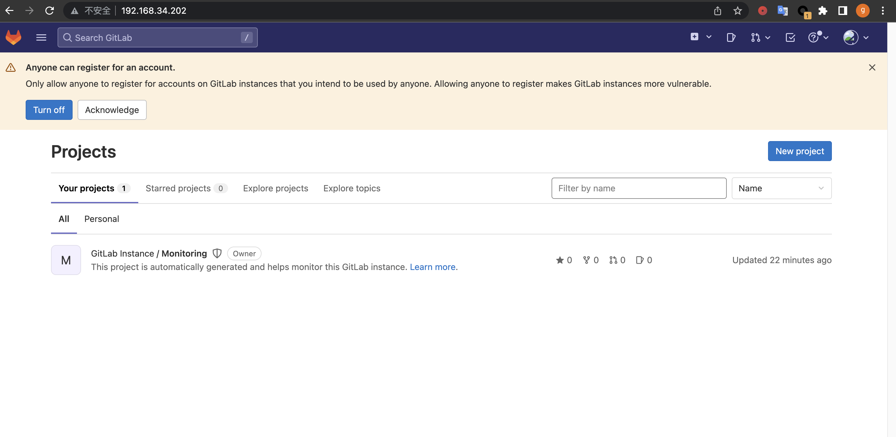
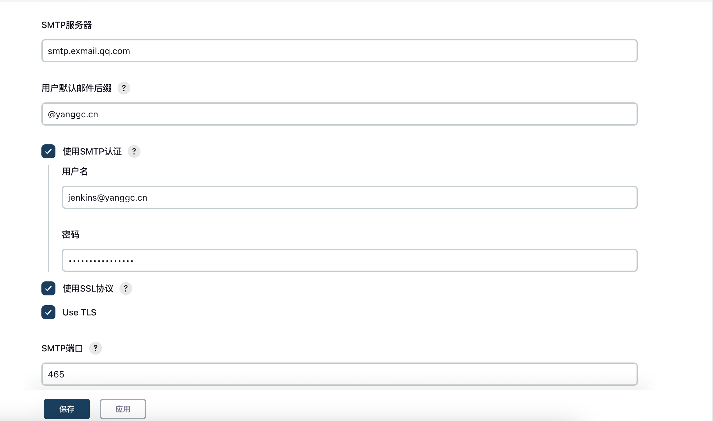

# 1. 基于 docker-compose 实现对 Nginx+Tomcat Web 服务的单机编排
## 1.1 编写docker-compose文件
[docker-compose.yaml](docker-composer-files/homework1/docker-compose.yaml)

## 1.2 启动编排的容器
```bash
root@docker1:~/test1# docker-compose up -d
root@docker1:~/test1# docker-compose ps
   Name                  Command               State                                   Ports
-----------------------------------------------------------------------------------------------------------------------------
nginx-web1    /docker-entrypoint.sh ngin ...   Up      0.0.0.0:443->443/tcp,:::443->443/tcp, 0.0.0.0:80->80/tcp,:::80->80/tcp
tomcat-app1   catalina.sh run                  Up      8080/tcp
```
## 1.3 修改nginx配置，代理到后端tomcat
```bash
root@docker1:~/test1# docker exec -it nginx-web1 sh
/ # cd /etc/nginx/conf.d/
#增加以下配置
    location /myweb {
        proxy_pass http://tomcat-app1:8080;
    }
/etc/nginx/conf.d # nginx -t
nginx: the configuration file /etc/nginx/nginx.conf syntax is ok
nginx: configuration file /etc/nginx/nginx.conf test is successful
/etc/nginx/conf.d # nginx -s reload
2022/11/09 14:47:03 [notice] 40#40: signal process started
## 

```
## 1.4 测试
```bash
root@docker1:~/test1# curl localhost
<!DOCTYPE html>
<html>
<head>
<title>Welcome to nginx!</title>
<style>
html { color-scheme: light dark; }
body { width: 35em; margin: 0 auto;
font-family: Tahoma, Verdana, Arial, sans-serif; }
</style>
</head>
<body>
<h1>Welcome to nginx!</h1>
<p>If you see this page, the nginx web server is successfully installed and
working. Further configuration is required.</p>

<p>For online documentation and support please refer to
<a href="http://nginx.org/">nginx.org</a>.<br/>
Commercial support is available at
<a href="http://nginx.com/">nginx.com</a>.</p>

<p><em>Thank you for using nginx.</em></p>
</body>
</html>
```
* tomcat 访问测试


## 1.5 增加健康检测
* 健康检测docker-compose文件
[docker-compose.yaml](docker-composer-files/homework1/docker-compose-health.yaml)
```bash
root@docker1:~/test1# docker-compose ps
   Name                  Command                  State                                       Ports
------------------------------------------------------------------------------------------------------------------------------------
nginx-web1    /docker-entrypoint.sh ngin ...   Up (healthy)   0.0.0.0:443->443/tcp,:::443->443/tcp, 0.0.0.0:80->80/tcp,:::80->80/tcp
tomcat-app1   catalina.sh run                  Up (healthy)   8080/tcp
```

# 2. 安装 GitLab、创建 group、user 和 project 并授权
## 2.1 使用deb安装包安装gitlab
```bash
root@gitlab1:/home/vagrant# apt install ./gitlab-ce_15.5.3-ce.0_amd64.deb
# 修改配置文件
external_url 'http://192.168.34.202'
gitlab_rails['smtp_enable'] = true
gitlab_rails['smtp_address'] = "smtp.exmail.qq.com"
gitlab_rails['smtp_port'] = 465
gitlab_rails['smtp_user_name'] = "git@yanggc.cn"
gitlab_rails['smtp_password'] = "******"
gitlab_rails['smtp_domain'] = "qq.com"
gitlab_rails['smtp_authentication'] = "login"
gitlab_rails['smtp_enable_starttls_auto'] = true
gitlab_rails['smtp_tls'] = true
gitlab_rails['gitlab_email_from'] = 'git@yanggc.cn'
user['git_user_email'] = "git@yanggc.cn"
alertmanager['admin_email'] = 'git@yanggc.cn'
# 查看默认密码
root@gitlab1:/home/vagrant# cat /etc/gitlab/initial_root_password
# WARNING: This value is valid only in the following conditions
#          1. If provided manually (either via `GITLAB_ROOT_PASSWORD` environment variable or via `gitlab_rails['initial_root_password']` setting in `gitlab.rb`, it was provided before database was seeded for the first time (usually, the first reconfigure run).
#          2. Password hasn't been changed manually, either via UI or via command line.
#
#          If the password shown here doesn't work, you must reset the admin password following https://docs.gitlab.com/ee/security/reset_user_password.html#reset-your-root-password.

Password: Ek/hH6n5WpauP/8d9071eDIxd4cthHt5OqSNQLBMBkE=

# NOTE: This file will be automatically deleted in the first reconfigure run after 24 hours.
```
## 2.2 登录gitlab
* 输入账户名root和获取的密码Ek/hH6n5WpauP/8d9071eDIxd4cthHt5OqSNQLBMBkE=，登录成功如下图


## 2.3 创建group


## 2.4 创建project


## 2.5 创建用户
* 创建用户test1  

  

* 创建用户test1


## 2.6 为用户授权
* test1用户授权test1项目权限

* test2用户授权group web权限


# 3. 熟练 Git 命令的基本使用，通过 Git 命令实现源代码的 clone、push 等基本操作
```bash
root@docker1:~/tmp# git clone http://192.168.34.202/web/test1.git
Cloning into 'test1'...
Username for 'http://192.168.34.202': test1
Password for 'http://test1@192.168.34.202':

remote: Enumerating objects: 3, done.
remote: Counting objects: 100% (3/3), done.
remote: Compressing objects: 100% (2/2), done.
remote: Total 3 (delta 0), reused 0 (delta 0), pack-reused 0
Receiving objects: 100% (3/3), done.
# 创建index.html文件
root@docker1:~/tmp/test1# vi index.html
<!DOCTYPE html>
<html>
<head>
<meta charset="utf-8">
<title>风飘吾独思(ygc.wiki)</title>
</head>
<body>
    <h1>
        <a href="http://ygc.wiki" target="_blank">欢迎来到风飘吾独思的家</a>
   </h1>
</body>
</html>
#查看变更的文件
root@docker1:~/tmp/test1# git status
On branch main
Your branch is up to date with 'origin/main'.

Untracked files:
  (use "git add <file>..." to include in what will be committed)
	index.html

nothing added to commit but untracked files present (use "git add" to track)
#添加到暂存区
root@docker1:~/tmp/test1# git add .
#提交到本地仓库
root@docker1:~/tmp/test1# git commit -m "创建站点首页文件"
[main 178ad41] 创建站点首页文件
 Committer: root <root@docker1>
#推送到远程仓库
root@docker1:~/tmp/test1# git push
Username for 'http://192.168.34.202': test1
Password for 'http://test1@192.168.34.202':
Enumerating objects: 4, done.
Counting objects: 100% (4/4), done.
Delta compression using up to 2 threads
Compressing objects: 100% (3/3), done.
Writing objects: 100% (3/3), 469 bytes | 469.00 KiB/s, done.
Total 3 (delta 0), reused 0 (delta 0), pack-reused 0
To http://192.168.34.202/web/test1.git
   7fcc4bd..178ad41  main -> main
```
3.1 dev分支代码提交和和合并
```bash
root@docker1:~/tmp/test1# git checkout -b dev
Switched to a new branch 'dev'
root@docker1:~/tmp/test1# git branch
* dev
  main
root@docker1:~/tmp/test1# vi index.html
<!DOCTYPE html>
<html>
<head>
<meta charset="utf-8">
<title>风飘吾独思(ygc.wiki)</title>
</head>
<body>
    <h1>
        <a href="http://ygc.wiki" target="_blank">欢迎来到风飘吾独思的家</a>
   </h1>
   <p>每一天都是新的一天</p>
</body>
</html>
root@docker1:~/tmp/test1# git add .
root@docker1:~/tmp/test1# git commit -m "添加一段文字"
[dev 63e723a] 添加一段文字
 Committer: root <root@docker1>
Your name and email address were configured automatically based
on your username and hostname. Please check that they are accurate.
You can suppress this message by setting them explicitly. Run the
following command and follow the instructions in your editor to edit
your configuration file:

    git config --global --edit

After doing this, you may fix the identity used for this commit with:

    git commit --amend --reset-author

 1 file changed, 1 insertion(+)
 root@docker1:~/tmp/test1# git push origin dev
Username for 'http://192.168.34.202': test1
Password for 'http://test1@192.168.34.202':
Enumerating objects: 5, done.
Counting objects: 100% (5/5), done.
Delta compression using up to 2 threads
Compressing objects: 100% (3/3), done.
Writing objects: 100% (3/3), 365 bytes | 365.00 KiB/s, done.
Total 3 (delta 1), reused 0 (delta 0), pack-reused 0
remote:
remote: To create a merge request for dev, visit:
remote:   http://192.168.34.202/web/test1/-/merge_requests/new?merge_request%5Bsource_branch%5D=dev
remote:
To http://192.168.34.202/web/test1.git
 * [new branch]      dev -> dev
```
* 提交merge request,由组管理test2用户合并到maste  


* 登录test2用户，点击merge ，不删除合并的分支


# 4. 熟练掌握对 GitLab 服务的数据备份与恢复
# 4.1 备份数据
```bash
#停止相关数据连接服务
root@gitlab1:~# gitlab-ctl stop unicorn sidekiq
#执行备份命令，会在/var/opt/gitlab/backups目录下生成一个1668065894_2022_11_10_15.5.3_gitlab_backup.tar的tar的压缩包。这个压缩包就是Gitlab整个的完整部分, 其中开头的1668065894是备份创建的时间戳。
root@gitlab1:~# gitlab-rake gitlab:backup:create
2022-11-10 07:38:14 +0000 -- Dumping main_database ...
Dumping PostgreSQL database gitlabhq_production ... [DONE]
2022-11-10 07:38:17 +0000 -- Dumping main_database ... done
2022-11-10 07:38:17 +0000 -- Dumping ci_database ... [DISABLED]
2022-11-10 07:38:17 +0000 -- Dumping repositories ...
{"command":"create","gl_project_path":"gitlab-instance-6c0f681c/Monitoring","level":"info","msg":"started create","relative_path":"@hashed/6b/86/6b86b273ff34fce19d6b804eff5a3f5747ada4eaa22f1d49c01e52ddb7875b4b.git","storage_name":"default","time":"2022-11-10T07:38:17.913Z"}
{"command":"create","error":"manager: repository empty: repository skipped","gl_project_path":"gitlab-instance-6c0f681c/Monitoring","level":"warning","msg":"skipped create","relative_path":"@hashed/6b/86/6b86b273ff34fce19d6b804eff5a3f5747ada4eaa22f1d49c01e52ddb7875b4b.git","storage_name":"default","time":"2022-11-10T07:38:17.928Z"}
{"command":"create","gl_project_path":"gitlab-instance-6c0f681c/Monitoring.wiki","level":"info","msg":"started create","relative_path":"@hashed/6b/86/6b86b273ff34fce19d6b804eff5a3f5747ada4eaa22f1d49c01e52ddb7875b4b.wiki.git","storage_name":"default","time":"2022-11-10T07:38:18.046Z"}
{"command":"create","gl_project_path":"gitlab-instance-6c0f681c/Monitoring","level":"info","msg":"started create","relative_path":"@hashed/6b/86/6b86b273ff34fce19d6b804eff5a3f5747ada4eaa22f1d49c01e52ddb7875b4b.design.git","storage_name":"default","time":"2022-11-10T07:38:18.049Z"}
{"command":"create","error":"manager: repository empty: repository skipped","gl_project_path":"gitlab-instance-6c0f681c/Monitoring","level":"warning","msg":"skipped create","relative_path":"@hashed/6b/86/6b86b273ff34fce19d6b804eff5a3f5747ada4eaa22f1d49c01e52ddb7875b4b.design.git","storage_name":"default","time":"2022-11-10T07:38:18.050Z"}
{"command":"create","gl_project_path":"web/test1","level":"info","msg":"started create","relative_path":"@hashed/d4/73/d4735e3a265e16eee03f59718b9b5d03019c07d8b6c51f90da3a666eec13ab35.git","storage_name":"default","time":"2022-11-10T07:38:18.050Z"}
{"command":"create","error":"manager: repository empty: repository skipped","gl_project_path":"gitlab-instance-6c0f681c/Monitoring.wiki","level":"warning","msg":"skipped create","relative_path":"@hashed/6b/86/6b86b273ff34fce19d6b804eff5a3f5747ada4eaa22f1d49c01e52ddb7875b4b.wiki.git","storage_name":"default","time":"2022-11-10T07:38:18.053Z"}
{"command":"create","gl_project_path":"web/test1.wiki","level":"info","msg":"started create","relative_path":"@hashed/d4/73/d4735e3a265e16eee03f59718b9b5d03019c07d8b6c51f90da3a666eec13ab35.wiki.git","storage_name":"default","time":"2022-11-10T07:38:18.059Z"}
{"command":"create","error":"manager: repository empty: repository skipped","gl_project_path":"web/test1.wiki","level":"warning","msg":"skipped create","relative_path":"@hashed/d4/73/d4735e3a265e16eee03f59718b9b5d03019c07d8b6c51f90da3a666eec13ab35.wiki.git","storage_name":"default","time":"2022-11-10T07:38:18.067Z"}
{"command":"create","gl_project_path":"web/test1","level":"info","msg":"started create","relative_path":"@hashed/d4/73/d4735e3a265e16eee03f59718b9b5d03019c07d8b6c51f90da3a666eec13ab35.design.git","storage_name":"default","time":"2022-11-10T07:38:18.068Z"}
{"command":"create","error":"manager: repository empty: repository skipped","gl_project_path":"web/test1","level":"warning","msg":"skipped create","relative_path":"@hashed/d4/73/d4735e3a265e16eee03f59718b9b5d03019c07d8b6c51f90da3a666eec13ab35.design.git","storage_name":"default","time":"2022-11-10T07:38:18.069Z"}
{"command":"create","gl_project_path":"web/test1","level":"info","msg":"completed create","relative_path":"@hashed/d4/73/d4735e3a265e16eee03f59718b9b5d03019c07d8b6c51f90da3a666eec13ab35.git","storage_name":"default","time":"2022-11-10T07:38:18.082Z"}
2022-11-10 07:38:18 +0000 -- Dumping repositories ... done
2022-11-10 07:38:18 +0000 -- Dumping uploads ...
2022-11-10 07:38:18 +0000 -- Dumping uploads ... done
2022-11-10 07:38:18 +0000 -- Dumping builds ...
2022-11-10 07:38:18 +0000 -- Dumping builds ... done
2022-11-10 07:38:18 +0000 -- Dumping artifacts ...
2022-11-10 07:38:18 +0000 -- Dumping artifacts ... done
2022-11-10 07:38:18 +0000 -- Dumping pages ...
2022-11-10 07:38:18 +0000 -- Dumping pages ... done
2022-11-10 07:38:18 +0000 -- Dumping lfs objects ...
2022-11-10 07:38:18 +0000 -- Dumping lfs objects ... done
2022-11-10 07:38:18 +0000 -- Dumping terraform states ...
2022-11-10 07:38:18 +0000 -- Dumping terraform states ... done
2022-11-10 07:38:18 +0000 -- Dumping container registry images ... [DISABLED]
2022-11-10 07:38:18 +0000 -- Dumping packages ...
2022-11-10 07:38:18 +0000 -- Dumping packages ... done
2022-11-10 07:38:18 +0000 -- Creating backup archive: 1668065894_2022_11_10_15.5.3_gitlab_backup.tar ...
2022-11-10 07:38:18 +0000 -- Creating backup archive: 1668065894_2022_11_10_15.5.3_gitlab_backup.tar ... done
2022-11-10 07:38:18 +0000 -- Uploading backup archive to remote storage  ... [SKIPPED]
2022-11-10 07:38:18 +0000 -- Deleting old backups ... [SKIPPED]
2022-11-10 07:38:18 +0000 -- Deleting tar staging files ...
2022-11-10 07:38:18 +0000 -- Cleaning up /var/opt/gitlab/backups/backup_information.yml
2022-11-10 07:38:18 +0000 -- Cleaning up /var/opt/gitlab/backups/db
2022-11-10 07:38:18 +0000 -- Cleaning up /var/opt/gitlab/backups/repositories
2022-11-10 07:38:18 +0000 -- Cleaning up /var/opt/gitlab/backups/uploads.tar.gz
2022-11-10 07:38:18 +0000 -- Cleaning up /var/opt/gitlab/backups/builds.tar.gz
2022-11-10 07:38:18 +0000 -- Cleaning up /var/opt/gitlab/backups/artifacts.tar.gz
2022-11-10 07:38:18 +0000 -- Cleaning up /var/opt/gitlab/backups/pages.tar.gz
2022-11-10 07:38:18 +0000 -- Cleaning up /var/opt/gitlab/backups/lfs.tar.gz
2022-11-10 07:38:18 +0000 -- Cleaning up /var/opt/gitlab/backups/terraform_state.tar.gz
2022-11-10 07:38:18 +0000 -- Cleaning up /var/opt/gitlab/backups/packages.tar.gz
2022-11-10 07:38:18 +0000 -- Deleting tar staging files ... done
2022-11-10 07:38:18 +0000 -- Deleting backups/tmp ...
2022-11-10 07:38:18 +0000 -- Deleting backups/tmp ... done
2022-11-10 07:38:18 +0000 -- Warning: Your gitlab.rb and gitlab-secrets.json files contain sensitive data
and are not included in this backup. You will need these files to restore a backup.
Please back them up manually.
2022-11-10 07:38:18 +0000 -- Backup 1668065894_2022_11_10_15.5.3 is done.
2022-11-10 07:38:18 +0000 -- Deleting backup and restore lock file
#查看备份文件
root@gitlab1:~# cd /var/opt/gitlab/backups
root@gitlab1:/var/opt/gitlab/backups# ls
1668065894_2022_11_10_15.5.3_gitlab_backup.tar
#启动相关数据连接服务
root@gitlab1:/var/opt/gitlab/backups# gitlab-ctl start unicorn sidekiq
```
## 4.2 数据恢复
### 4.2.1 模拟故障，管理误删除test1项目的dev分支和test1用户
* dev分支已删除

* test1用户已删除


### 4.2.2 数据恢复
```bash
#停止爱相关数据连接服务
root@gitlab1:/var/opt/gitlab/backups# gitlab-ctl stop unicorn sidekiq
#执行恢复命令
root@gitlab1:/var/opt/gitlab/backups# gitlab-rake gitlab:backup:restore BACKUP=1668065894_2022_11_10_15.5.3
```
### 4.2.3 误删分支和用户已恢复
* dev分支恢复

* test1用户恢复


# 5. 部署 Jenkins 服务器并安装 GitLab 插件、实现代码免秘钥代码 clone
## 5.1 安装jenkins
```bash
#安装openjdk
root@jenkins1:~# apt install openjdk-11-jdk
root@jenkins1:~# java -version
openjdk version "11.0.16" 2022-07-19
OpenJDK Runtime Environment (build 11.0.16+8-post-Ubuntu-0ubuntu122.04)
OpenJDK 64-Bit Server VM (build 11.0.16+8-post-Ubuntu-0ubuntu122.04, mixed mode, sharing)
#下载deb安装包
root@jenkins1:~# wget https://mirrors.ustc.edu.cn/jenkins/debian-stable/jenkins_2.361.3_all.deb
--2022-11-10 08:06:30--  https://mirrors.ustc.edu.cn/jenkins/debian-stable/jenkins_2.361.3_all.deb
Resolving mirrors.ustc.edu.cn (mirrors.ustc.edu.cn)... 202.141.176.110
Connecting to mirrors.ustc.edu.cn (mirrors.ustc.edu.cn)|202.141.176.110|:443... connected.
HTTP request sent, awaiting response... 200 OK
Length: 92842456 (89M) [application/octet-stream]
Saving to: ‘jenkins_2.361.3_all.deb’

jenkins_2.361.3_all.deb             100%[================================================================>]  88.54M  48.4MB/s    in 1.8s

2022-11-10 08:06:32 (48.4 MB/s) - ‘jenkins_2.361.3_all.deb’ saved [92842456/92842456]
# 安装jenkins
root@jenkins1:~# apt install ./jenkins_2.361.3_all.deb
# 修改jenkins用户和用户组
root@jenkins1:~# vim /etc/default/jenkins
JENKINS_USER=root
JENKINS_GROUP=root
# 关闭 跨站请求伪造保护(CSRF)保护
root@jenkins1:~# vim /lib/systemd/system/jenkins.service
User=root
Group=root
Environment="JAVA_OPTS=-Djava.awt.headless=true -Dhudson.security.csrf.GlobalCrumbIssuerConfiguration.DISABLE_CSRF_PROTECTION=true"
#重启jenkins
root@jenkins1:~# systemctl daemon-reload && systemctl restart jenkins.service
```

## 5.2 配置jenkins
### 5.2.1 登录界面

### 5.2.2 查看密码
```bash
root@jenkins1:~# cat /var/lib/jenkins/secrets/initialAdminPassword
0a3cfa7bf8af4285a605dad4f1e67a05
```
### 5.2.3 安装推荐的插件


### 5.2.4 设置管理员用户

### 5.2.5 设置管理员邮箱

### 5.2.6 设置邮件通知


## 5.3 配置部署公共密钥
### 5.3.1 生成ssh公钥和私钥
```bash
#生成ssh公钥
root@jenkins1:~# ssh-keygen
Generating public/private rsa key pair.
Enter file in which to save the key (/root/.ssh/id_rsa):
Enter passphrase (empty for no passphrase):
Enter same passphrase again:
Your identification has been saved in /root/.ssh/id_rsa
Your public key has been saved in /root/.ssh/id_rsa.pub
The key fingerprint is:
SHA256:ymafDofEA2AunIYpgkaTZ11Xmt6RmJ0m1E2tt36RPr4 root@jenkins1
The key's randomart image is:
+---[RSA 3072]----+
| o+ . .. oo.o..  |
|==o+ .  o *.o. . |
|B=+ .    * *  .  |
|=.   o  . + .. . |
|      + S. .  . o|
|     o +       + |
|      B .     o .|
|     o + .     +.|
|       .+     .E+|
+----[SHA256]-----+
```
### 5.3.2 创建公共部署密钥  

### 5.3.3 拉取代码
```bash
root@jenkins1:~# git clone git@192.168.34.202:web/test1.git
Cloning into 'test1'...
The authenticity of host '192.168.34.202 (192.168.34.202)' can't be established.
ED25519 key fingerprint is SHA256:RyrZ19/RjEO9XXXj1EKfexhWc5TUd8UweV6A1HSlAVo.
This key is not known by any other names
Are you sure you want to continue connecting (yes/no/[fingerprint])? yes
Warning: Permanently added '192.168.34.202' (ED25519) to the list of known hosts.
remote: Enumerating objects: 10, done.
remote: Counting objects: 100% (10/10), done.
remote: Compressing objects: 100% (8/8), done.
remote: Total 10 (delta 1), reused 10 (delta 1), pack-reused 0
Receiving objects: 100% (10/10), done.
Resolving deltas: 100% (1/1), done.
```
### 5.3.4 创建一个自由风格的软件项目web1，拉取代码


## 5.4 配置jenkins凭证拉取代码
### 5.4.1 配置root私钥凭据


### 5.4.2 配置项目使用凭据拉取代码

### 5.4.3 拉取成功


## 5.5 使用jenkins部署一个web项目
### 5.5.1 启动一个nginx容器nginx-web1
```bash
root@jenkins1:~# docker run -d -p 80:80 -v /var/lib/jenkins/workspace/web1:/usr/share/nginx/html --name=nginx-web1 nginx:1.22.1-alpine
3ccd27bf171f040827a4d9f0fc4dd7b0a3c920e3c5564faa89f035ba073063f5
```
### 5.5.2 访问页面
```bash
root@jenkins1:~# curl localhost
<!DOCTYPE html>
<html>
<head>
<meta charset="utf-8">
<title>风飘吾独思(ygc.wiki)</title>
</head>
<body>
    <h1>
        <a href="http://ygc.wiki" target="_blank">欢迎来到风飘吾独思的家</a>
   </h1>
   <p>每一天都是新的一天</p>
</body>
</html>
```
### 5.5.3 test1用户更新代码，提交merge request
```bash
root@jenkins1:~# git clone http://192.168.34.202/web/test1.git
Cloning into 'test1'...
Username for 'http://192.168.34.202': test1
Password for 'http://test1@192.168.34.202':
remote: Enumerating objects: 10, done.
remote: Counting objects: 100% (10/10), done.
remote: Compressing objects: 100% (8/8), done.
remote: Total 10 (delta 1), reused 10 (delta 1), pack-reused 0
Receiving objects: 100% (10/10), done.
Resolving deltas: 100% (1/1), done.
root@jenkins1:~# cd test1/
root@jenkins1:~/test1# git checkout dev
Branch 'dev' set up to track remote branch 'dev' from 'origin'.
Switched to a new branch 'dev'
root@jenkins1:~/test1# vi index.html
<!DOCTYPE html>
<html>
<head>
<meta charset="utf-8">
<title>风飘吾独思(ygc.wiki)</title>
</head>
<body>
    <h1>
        <a href="http://ygc.wiki" target="_blank">欢迎来到风飘吾独思的家</a>
   </h1>
   <p>每一天都是新的一天</p>
   <p>生活百般滋味，每一天需要笑对</p>
</body>
</html>
root@jenkins1:~/test1# git status
On branch dev
Your branch is up to date with 'origin/dev'.

Changes not staged for commit:
  (use "git add <file>..." to update what will be committed)
  (use "git restore <file>..." to discard changes in working directory)
	modified:   index.html

no changes added to commit (use "git add" and/or "git commit -a")
root@jenkins1:~/test1# git add .
root@jenkins1:~/test1# git commit -m "增加一段话2"
[dev ddceb4d] 增加一段话2
 Committer: root <root@jenkins1>
Your name and email address were configured automatically based
on your username and hostname. Please check that they are accurate.
You can suppress this message by setting them explicitly. Run the
following command and follow the instructions in your editor to edit
your configuration file:

    git config --global --edit

After doing this, you may fix the identity used for this commit with:

    git commit --amend --reset-author

 1 file changed, 1 insertion(+)
 root@jenkins1:~/test1# git push origin dev
Username for 'http://192.168.34.202': test1
Password for 'http://test1@192.168.34.202':
Enumerating objects: 5, done.
Counting objects: 100% (5/5), done.
Delta compression using up to 2 threads
Compressing objects: 100% (3/3), done.
Writing objects: 100% (3/3), 386 bytes | 386.00 KiB/s, done.
Total 3 (delta 1), reused 0 (delta 0), pack-reused 0
remote:
remote: To create a merge request for dev, visit:
remote:   http://192.168.34.202/web/test1/-/merge_requests/new?merge_request%5Bsource_branch%5D=dev
remote:
To http://192.168.34.202/web/test1.git
   63e723a..ddceb4d  dev -> dev
```
### 5.5.4 test1创建merge request

### 5.5.5 test2用户merge request

### 5.5.6 jenkins部署web1项目

### 5.5.7 测试更新后的内容
```bash
root@jenkins1:~# curl localhost
<!DOCTYPE html>
<html>
<head>
<meta charset="utf-8">
<title>风飘吾独思(ygc.wiki)</title>
</head>
<body>
    <h1>
        <a href="http://ygc.wiki" target="_blank">欢迎来到风飘吾独思的家</a>
   </h1>
   <p>每一天都是新的一天</p>
   <p>生活百般滋味，每一天需要笑对</p>
</body>
</html>
```
