# 1.部署jenkins master及多slave环境
## 1.1 通过ssh添加1台jenkins slave
* 上周搭建的jenkins服务器，不搭建新的jenkins服务器
* jenkins node一共2台，系统为ubuntu-22.04, node1 IP：192.168.34.101, node2 IP:192.168.34.102
* 两种方式添加slave节点，Launch agents via ssh 和 通过Java Web启动代理
```bash
## hosts绑定
root@jenkins1:~# vi /etc/hosts #添加如下信息
## jenkins slave node start
192.168.34.101  jenkins-node1
192.168.34.102  jenkins-node2
## jenkins slave node end

#添加jenkins1公钥到jenkins-node1上
root@jenkins1:~# ssh-copy-id jenkins-node1
/usr/bin/ssh-copy-id: INFO: Source of key(s) to be installed: "/root/.ssh/id_rsa.pub"
The authenticity of host 'jenkins-node1 (192.168.34.101)' can't be established.
ED25519 key fingerprint is SHA256:PwLMFbz9qoUiFcyzjyr1vDmW32+JNZZglToWmtg1vH8.
This key is not known by any other names
Are you sure you want to continue connecting (yes/no/[fingerprint])? yes
/usr/bin/ssh-copy-id: INFO: attempting to log in with the new key(s), to filter out any that are already installed
/usr/bin/ssh-copy-id: INFO: 1 key(s) remain to be installed -- if you are prompted now it is to install the new keys
root@jenkins-node1's password:

Number of key(s) added: 1

Now try logging into the machine, with:   "ssh 'jenkins-node1'"
and check to make sure that only the key(s) you wanted were added.

#测试是否添加成功
root@jenkins1:~# ssh jenkins-node1
Welcome to Ubuntu 22.04.1 LTS (GNU/Linux 5.15.0-52-generic x86_64)

 * Documentation:  https://help.ubuntu.com
 * Management:     https://landscape.canonical.com
 * Support:        https://ubuntu.com/advantage

  System information as of Mon Nov 14 10:45:04 UTC 2022

  System load:  0.0               Processes:               102
  Usage of /:   3.6% of 38.70GB   Users logged in:         1
  Memory usage: 10%               IPv4 address for enp0s3: 10.0.2.15
  Swap usage:   0%                IPv4 address for enp0s8: 192.168.34.101


0 updates can be applied immediately.


The list of available updates is more than a week old.
To check for new updates run: sudo apt update

Last login: Mon Nov 14 10:35:32 2022 from 192.168.34.201
root@jenkins-node1:~#
#通过秘钥认证登录jenkins-node1成功

# jenkins-node1安装openjdk-11
root@jenkins-node1:~#apt update
root@jenkins-node1:~# apt install openjdk-11-jdk
#验证jdk是否安装成功
root@jenkins-node1:~# java -version
openjdk version "11.0.17" 2022-10-18
OpenJDK Runtime Environment (build 11.0.17+8-post-Ubuntu-1ubuntu222.04)
OpenJDK 64-Bit Server VM (build 11.0.17+8-post-Ubuntu-1ubuntu222.04, mixed mode, sharing)
##jenkins-node1创建workspace目录
root@jenkins-node1:~# mkdir -p /var/lib/jenkins/workspace
```
* 添加jenkins-node1配置如图所示
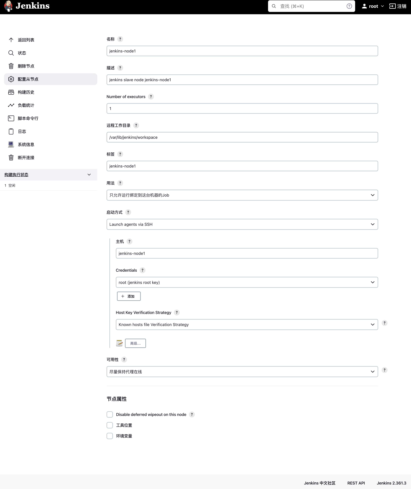  

* 添加成功后可以看到node的状态
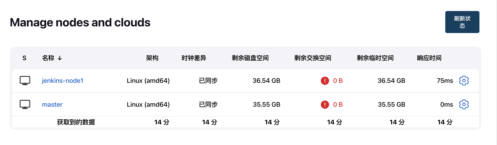

* 创建一个jenkins任务，指定在jenkins-node1上执行
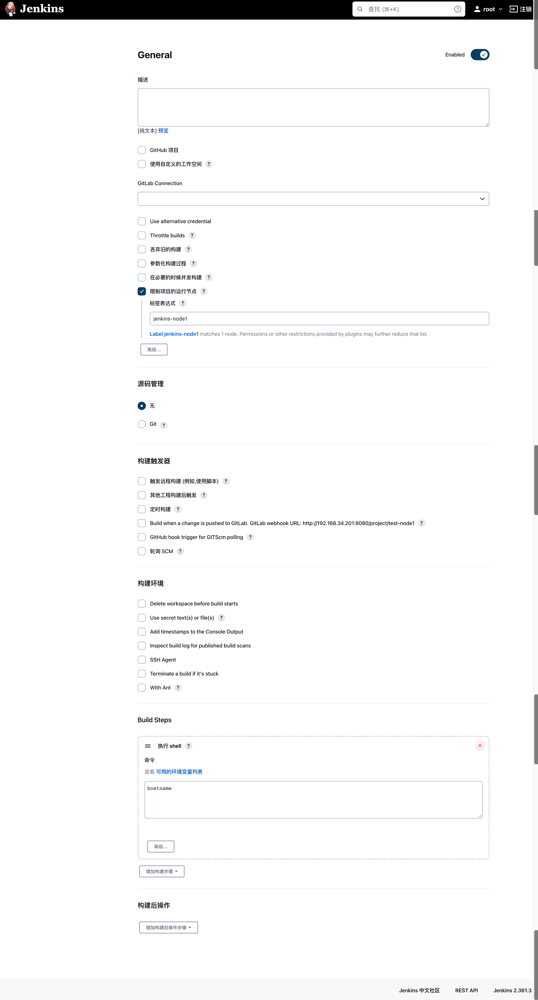   
    

任务执行结果如下图  
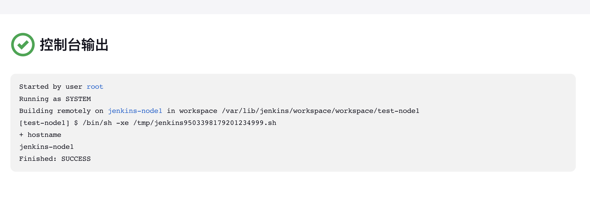

* ***tips***:
    * 生成公私钥需要用这个命令ssh-keygen -m PEM -t rsa -b 4096
    * 直接用ssh-keygen生成的会无法ssh连接，由于ubuntu 22.04 openssh版本较高，jenkins检验密钥时还不支持这种格式

## 1.2 通过Java Web启动代理
### 1.2.1 安装openjdk，创建工作目录
```bash
root@jenkins-node2:~# apt update
root@jenkins-node2:~# apt install openjdk-11-jdk
root@jenkins-node2:~# java -version
openjdk version "11.0.17" 2022-10-18
OpenJDK Runtime Environment (build 11.0.17+8-post-Ubuntu-1ubuntu222.04)
OpenJDK 64-Bit Server VM (build 11.0.17+8-post-Ubuntu-1ubuntu222.04, mixed mode, sharing)
root@jenkins-node2:~# mkdir -p /var/lib/jenkins/workspace
```
### 1.2.2 添加jenkins-node2节点
* 添加节点配置截图
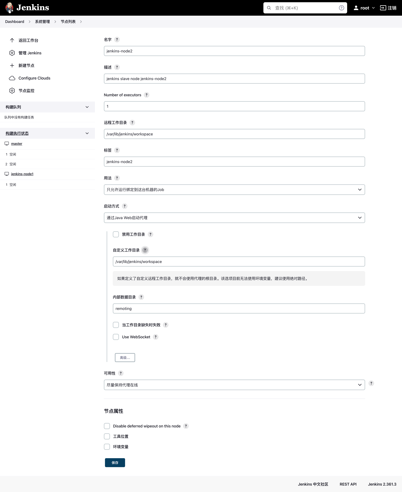
* 配置jenkins tcp代理端口
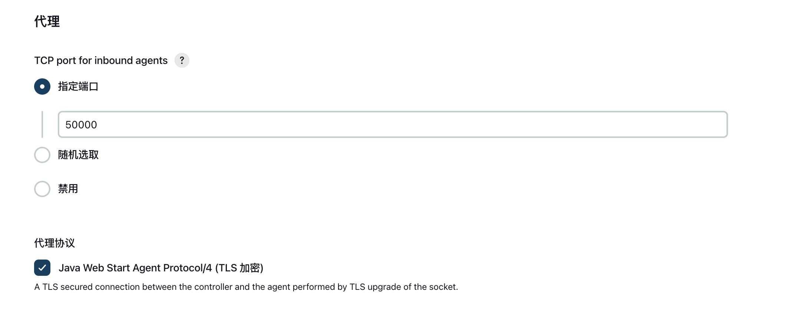
* 节点配置提示信息
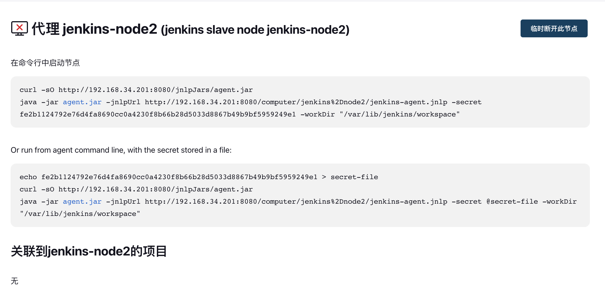

### 1.2.3 执行代理节点相关命令
```bash
root@jenkins-node2:~# curl -sO http://192.168.34.201:8080/jnlpJars/agent.jar
root@jenkins-node2:~# java -jar agent.jar -jnlpUrl http://192.168.34.201:8080/computer/jenkins%2Dnode2/jenkins-agent.jnlp -secret fe2b1124792e76d4fa8690cc0a4230f8b66b28d5033d8867b49b9bf5959249e1 -workDir "/var/lib/jenkins/workspace"
```
* 查看节点信息
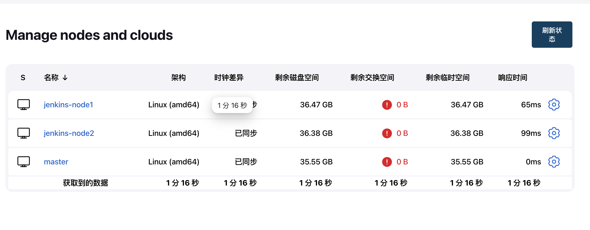
### 1.2.4 添加jenkins到systemctl中管理
```bahs
root@jenkins-node2:~# mkdir /apps/jenkins-agent -p
root@jenkins-node2:~# vi /apps/jenkins-agent/jenkins-agent-env.sh
JENKINS_URL=http://192.168.34.201:8080
JNLP_SECRET=fe2b1124792e76d4fa8690cc0a4230f8b66b28d5033d8867b49b9bf5959249e1
JENKINS_WORKDIR=/var/lib/jenkins/workspace
JENKINS_NODE=jenkins-node2
root@jenkins-node2:~# vi /lib/systemd/system/jenkins-agent.service
[Unit]
Description=Jenkins agent service
Documentation=https://www.jenkins.io/doc/
After=network.target

[Service]
Type=simple
EnvironmentFile=/apps/jenkins-agent/jenkins-agent-env.sh
User=root
Group=root
ExecStartPre=/usr/bin/curl --fail -s -o ${JENKINS_WORKDIR}/agent.jar ${JENKINS_URL}/jnlpJars/agent.jar
ExecStart=/usr/bin/java -jar ${JENKINS_WORKDIR}/agent.jar -jnlpUrl ${JENKINS_URL}/computer/${JENKINS_NODE}/jenkins-agent.jnlp -secret ${JNLP_SECRET} -workDir "${JENKINS_WORKDIR}"
ExecStop=/usr/bin/pkill -f 'java -jar ${JENKINS_WORKDIR}/agent.jar'
Restart=on-failure
RestartSec=30

[Install]
WantedBy=multi-user.target
root@jenkins-node2:~# systemctl start jenkins-agent
root@jenkins-node2:~# systemctl status jenkins-agent
● jenkins-agent.service - Jenkins agent service
     Loaded: loaded (/lib/systemd/system/jenkins-agent.service; disabled; vendor preset: enabled)
     Active: active (running) since Wed 2022-11-16 15:14:12 UTC; 5min ago
       Docs: https://www.jenkins.io/doc/
    Process: 4584 ExecStartPre=/usr/bin/curl --fail -s -o ${JENKINS_WORKDIR}/agent.jar ${JENKINS_URL}/jnlpJars/agent.jar (code=exited, status=>
   Main PID: 4585 (java)
      Tasks: 23 (limit: 2324)
     Memory: 76.9M
        CPU: 4.260s
     CGroup: /system.slice/jenkins-agent.service
             └─4585 /usr/bin/java -jar /var/lib/jenkins/workspace/agent.jar -jnlpUrl http://192.168.34.201:8080/computer/jenkins-node2/jenkins>

Nov 16 15:14:13 jenkins-node2 java[4585]: Nov 16, 2022 3:14:13 PM hudson.remoting.jnlp.Main$CuiListener status
Nov 16 15:14:13 jenkins-node2 java[4585]: INFO: Connecting to 192.168.34.201:50000
Nov 16 15:14:13 jenkins-node2 java[4585]: Nov 16, 2022 3:14:13 PM hudson.remoting.jnlp.Main$CuiListener status
Nov 16 15:14:13 jenkins-node2 java[4585]: INFO: Trying protocol: JNLP4-connect
Nov 16 15:14:13 jenkins-node2 java[4585]: Nov 16, 2022 3:14:13 PM org.jenkinsci.remoting.protocol.impl.BIONetworkLayer$Reader run
Nov 16 15:14:13 jenkins-node2 java[4585]: INFO: Waiting for ProtocolStack to start.
Nov 16 15:14:13 jenkins-node2 java[4585]: Nov 16, 2022 3:14:13 PM hudson.remoting.jnlp.Main$CuiListener status
Nov 16 15:14:13 jenkins-node2 java[4585]: INFO: Remote identity confirmed: fe:ee:e7:92:84:36:70:c9:cf:a6:e2:a1:4f:cb:39:82
Nov 16 15:14:13 jenkins-node2 java[4585]: Nov 16, 2022 3:14:13 PM hudson.remoting.jnlp.Main$CuiListener status
Nov 16 15:14:13 jenkins-node2 java[4585]: INFO: Connected
root@jenkins-node2:~# systemctl enable jenkins-agent
Created symlink /etc/systemd/system/multi-user.target.wants/jenkins-agent.service → /lib/systemd/system/jenkins-agent.service.
```
* 查看节点信息
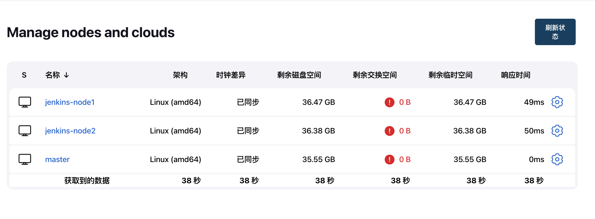
### 1.2.5 添加一个jenkins任务，指定在jenkins-node2运行
* test-node2任务配置
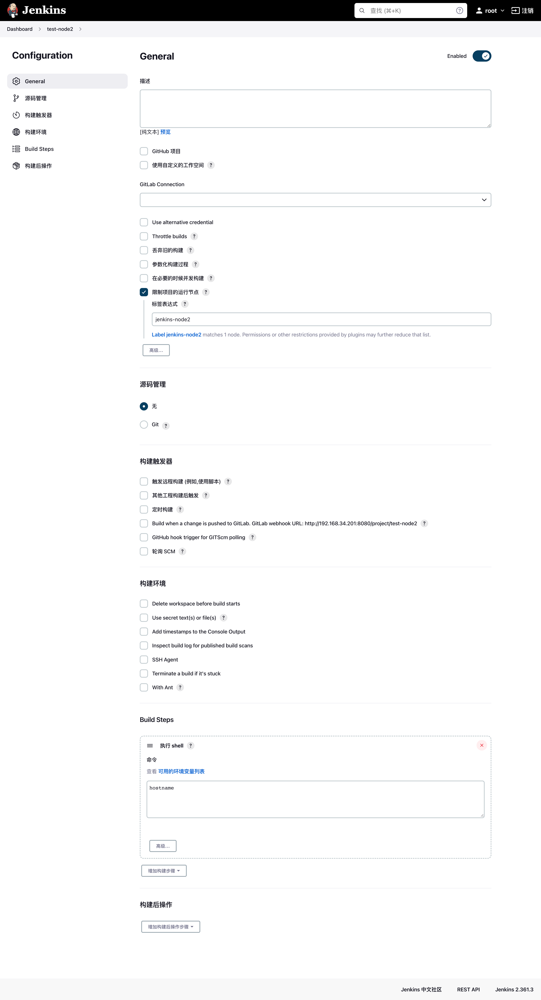
* 任务执行
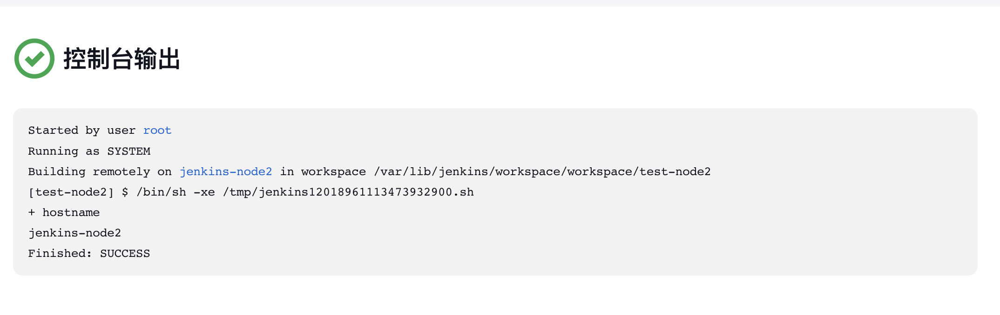  

# 2.基于jenkins视图对jenkins job进行分类
## 2.1 我的视图
* 创建我的视图test
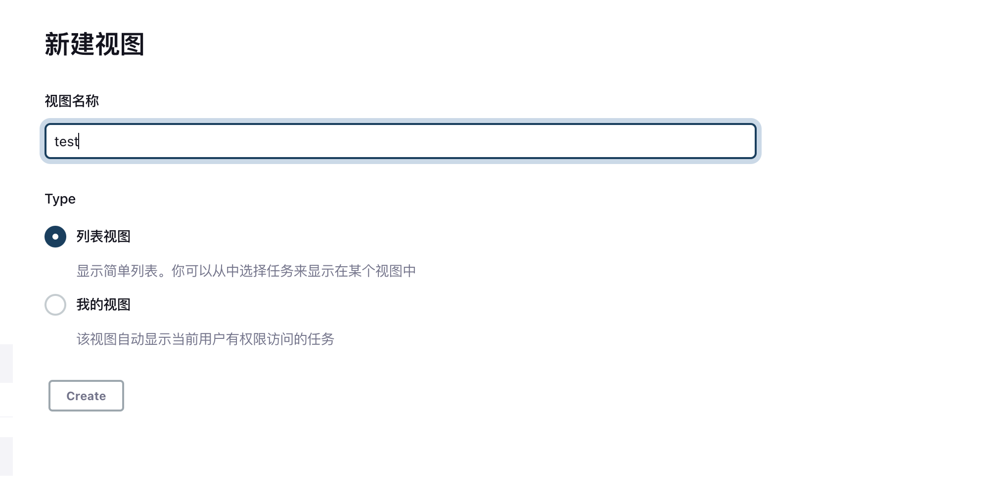  

* 查看test视图
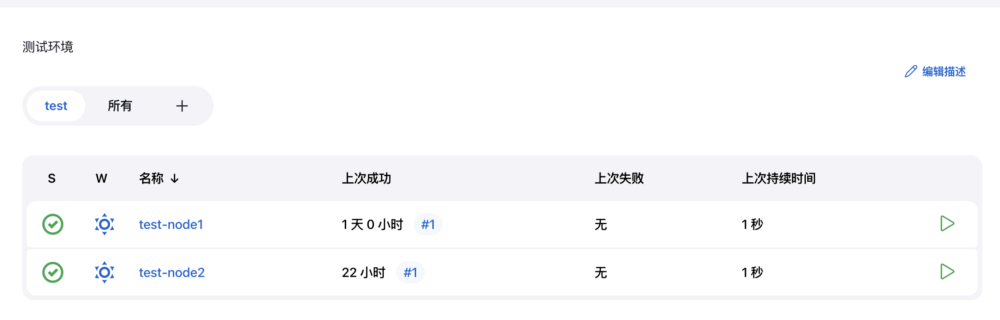  
* tips:
    * 我的视图可以看到当前用户所有权限的任务
    * 我的视图一般很少使用
## 2.2 列表视图
### 2.2.1 创建一个勾选任务的列表视图
* 创建列表视图test
  

* 勾选要在视图中显示的任务
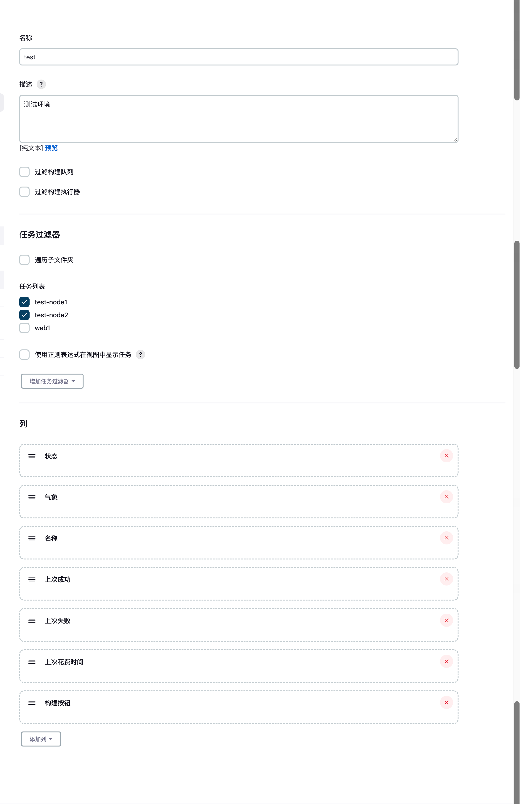  

* 查看创建的视图


### 2.2.2 创建一个正则匹配的试图
* 正则匹配列表视图可以根据正则规则匹配新创建的任务
* 创建online列表视图
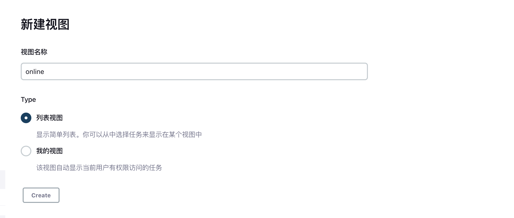
* 配置正则规则
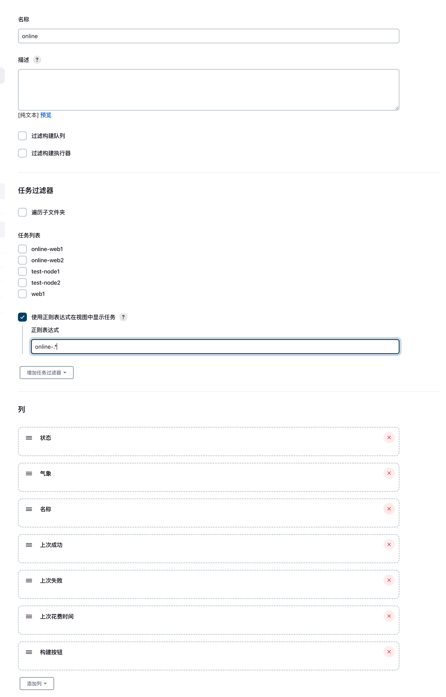
* 查看online列表视图
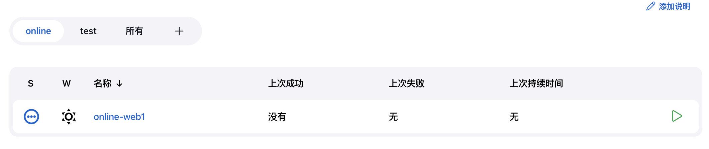
* 添加一个新的任务online-web2,查看视图
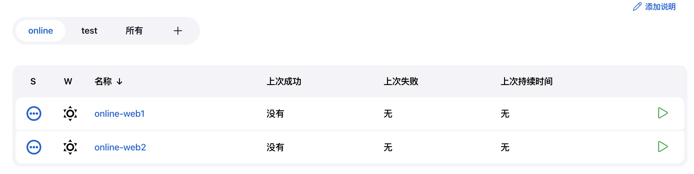
新创建的任务自动加入了online视图  

# 3.总结jenkins pipline基本语法
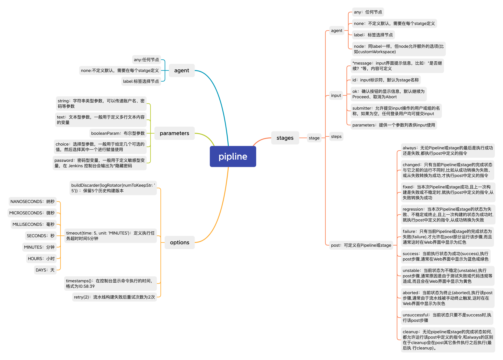  

# 4.部署代码质量检测服务sonarqube
## 4.1 安装配置PostgreSQL
### 4.1.1 安装PostgreSQL
```bash
root@jenkins1:~# apt update
root@jenkins1:~# apt-cache madison postgresql
postgresql |     14+238 | http://archive.ubuntu.com/ubuntu jammy/main amd64 Packages
root@jenkins1:~# apt install postgresql
```
### 4.1.2 PostgreSQL环境初始化
```bash
root@jenkins1:~# pg_createcluster --start 14 mycluster
root@jenkins1:~# vim /etc/postgresql/14/mycluster/pg_hba.conf
96 # IPv4 local connections:
97 host    all             all             0.0.0.0/0            scram-sha-256
root@jenkins1:~# vim /etc/postgresql/14/mycluster/postgresql.conf
60 listen_addresses = '*'          # what IP address(es) to listen on;
root@jenkins1:~# systemctl restart postgresql
```

### 4.1.3 端口验证
```bash
root@jenkins1:~# lsof -i:5432
COMMAND   PID     USER   FD   TYPE DEVICE SIZE/OFF NODE NAME
postgres 4971 postgres    5u  IPv4  35318      0t0  TCP *:postgresql (LISTEN)
postgres 4971 postgres    6u  IPv6  35319      0t0  TCP *:postgresql (LISTEN)
```
### 4.1.4 创建数据库及账户授权
```bash
root@jenkins1:~# su - postgres
postgres@jenkins1:~$ psql -U postgres
psql (14.5 (Ubuntu 14.5-0ubuntu0.22.04.1))
Type "help" for help.
postgres=# CREATE DATABASE sonar
postgres-# CREATE USER sonar WITH ENCRYPTED PASSWORD '123456'
postgres-# GRANT ALL PRIVILEGES ON DATABASE sonar TO sonar
postgres-# ALTER DATABASE sonar OWNER TO sonar
postgres-# \q
postgres@jenkins1:~$ exit
logout
```

## 4.2 安装部署SonarQube Server 8.9.10
### 4.2.1 安装jdk
```bash
root@jenkins1:~# apt install -y openjdk-11-jdk
root@jenkins1:~# java -version
openjdk version "11.0.16" 2022-07-19
OpenJDK Runtime Environment (build 11.0.16+8-post-Ubuntu-0ubuntu122.04)
OpenJDK 64-Bit Server VM (build 11.0.16+8-post-Ubuntu-0ubuntu122.04, mixed mode, sharing)
```
### 4.2.2 修改内核参数
```bash
root@jenkins1:~# vim /etc/sysctl.conf
vm.max_map_count=262144
fs.file-max=1000000
root@jenkins1:~# vim /etc/security/limits.conf
*             soft    core            unlimited
*             hard    core            unlimited
*             soft    nproc           1000000
*             hard    nproc           1000000
*             soft    nofile          1000000
*             hard    nofile          1000000
*             soft    memlock         32000
*             hard    memlock         32000
*             soft    msgqueue        8192000
*             hard    msgqueue        8192000
```
### 4.2.3 部署SonarQube 8.9.10
```bash
root@jenkins1:~# mkdir /apps && cd /apps/
root@jenkins1:/apps# unzip /home/vagrant/sonarqube-8.9.10.61524.zip
Command 'unzip' not found, but can be installed with:
apt install unzip
root@jenkins1:/apps# apt install unzip
root@jenkins1:/apps#  ln -sv /apps/sonarqube-8.9.10.61524 /apps/sonarqube
'/apps/sonarqube' -> '/apps/sonarqube-8.9.10.61524'
root@jenkins1:/apps# ls
sonarqube  sonarqube-8.9.10.6152
root@jenkins1:/apps# useradd -r -m -s /bin/bash sonarqube && chown sonarqube.sonarqube /apps/ -R && su - sonarqube
sonarqube@jenkins1:~$ vim /apps/sonarqube/conf/sonar.properties
sonar.jdbc.username=sonar
sonar.jdbc.password=123456
sonar.jdbc.url=jdbc:postgresql://localhost/sonar
sonarqube@jenkins1:~$ /apps/sonarqube/bin/linux-x86-64/sonar.sh --help
Usage: /apps/sonarqube/bin/linux-x86-64/sonar.sh { console | start | stop | force-stop | restart | status | dump }
```
### 4.2.4 验证SonarQube
```bash
sonarqube@jenkins1:~$ tail /apps/sonarqube/logs/*.log
2022.11.19 10:44:14 INFO  app[][o.s.a.SchedulerImpl] Process[ce] is up
2022.11.19 10:44:14 INFO  app[][o.s.a.SchedulerImpl] SonarQube is up
sonarqube@jenkins1:/apps/sonarqube/logs$ lsof -i:9000
COMMAND  PID      USER   FD   TYPE DEVICE SIZE/OFF NODE NAME
java    7100 sonarqube   14u  IPv6  45415      0t0  TCP *:9000 (LISTEN)
```
### 4.2.5 访问web界面
* 默认用户admin
* 默认密码admin  #首次登录需要修改密码
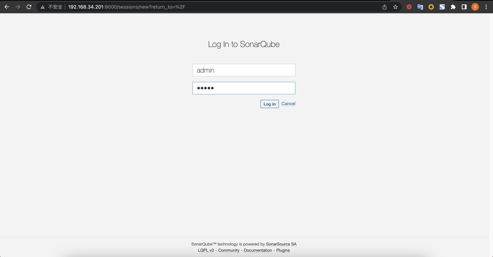  

### 4.2.6 插件管理
* Administration--> Marketplace--> I understand the risk(首次需要点击我理解风险)-->all
* Administration--> System--> Restart Server #新插件安装成功后需要重启SonarQube server
* 离线安装中文插件
```bash
root@jenkins1:~# wget https://ghproxy.com/https://github.com/xuhuisheng/sonar-l10n-zh/releases/download/sonar-l10n-zh-plugin-8.9/sonar-l10n-zh-plugin-8.9.jar
root@jenkins1:~# cd /apps/sonarqube/extensions/plugins
root@jenkins1:/apps/sonarqube/extensions/plugins# mv ~/sonar-l10n-zh-plugin-8.9.jar .
root@jenkins1:/apps/sonarqube/extensions/plugins# chown sonarqube. sonar-l10n-zh-plugin-8.9.jar
#在web界面重启服务
```

### 4.2.7 认证管理
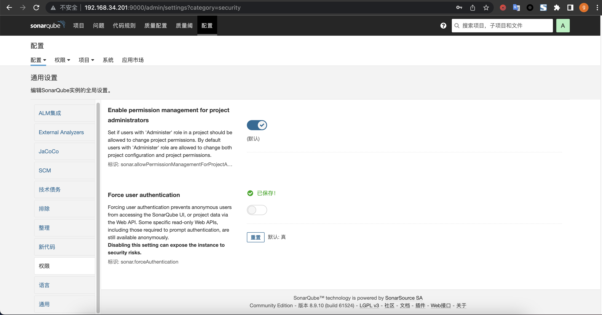

### 4.2.8 SonarQube加入systemctl管理
```bash
root@jenkins1:~# vim /etc/systemd/system/sonarqube.service
[Unit]
Description=SonarQube service After=syslog.target network.target

[Service]
Type=simple
User=sonarqube
Group=sonarqube
PermissionsStartOnly=true
ExecStart=/bin/nohup /usr/bin/java -Xms512m -Xmx512m -Djava.net.preferIPv4Stack=true -jar /apps/sonarqube/lib/sonar-application-8.9.10.61524.jar
StandardOutput=syslog
LimitNOFILE=131072
LimitNPROC=8192
TimeoutStartSec=5
Restart=always
SuccessExitStatus=143

[Install]
WantedBy=multi-user.target
root@jenkins1:~# /apps/sonarqube/bin/linux-x86-64/sonar.sh stop
Gracefully stopping SonarQube...
Stopped SonarQube.
root@jenkins1:~# systemctl daemon-reload
root@jenkins1:~# systemctl start sonarqube
root@jenkins1:~# systemctl status sonarqube
root@jenkins1:~# systemctl enable sonarqube
```

# 5.基于命令、shell脚本和pipline实现代码质量检测

## 5.1 部署和配置扫描器sonar-scanner
```bash
root@jenkins1:~# wget https://binaries.sonarsource.com/Distribution/sonar-scanner-cli/sonar-scanner-cli-4.7.0.2747.zip
root@jenkins1:~# cd /apps/
root@jenkins1:/apps# unzip ~/sonar-scanner-cli-4.7.0.2747.zip
root@jenkins1:/apps# ln -sv /apps/sonar-scanner-4.7.0.2747 /apps/sonar-scanner
root@jenkins1:/apps#  vim /apps/sonar-scanner/conf/sonar-scanner.properties
sonar.host.url=http://192.168.34.201:9000
sonar.sourceEncoding=UTF-8
root@jenkins1:~#vim /etc/profile
export SONAR_SCANNER_HOME=/apps/sonar-scanner
export PATH=$PATH:$SONAR_SCANNER_HOME/bin
root@jenkins1:~#source /etc/profile
root@jenkins1:~# sonar-scanner --help
```
## 5.2 测试代码质量扫描
### 5.2.1 基于配置文件执行扫描
```bash
root@jenkins1:/opt/python-test# tree
.
├── sonar-project.properties
└── src
    └── test.py

1 directory, 2 files
root@jenkins1:/opt/python-test# cat sonar-project.properties
# Required metadata
#项目key,项目唯一标识、通常使用项目名称
sonar.projectKey=my-python
#项目名称，当前的服务名称
sonar.projectName=my-python-app1
#项目版本号
sonar.projectVersion=1.0

# Comma-separated paths to directories with sources (required)
#代码目录
sonar.sources=src

# Language
#编程语音
sonar.language=py

# Encoding of the source files
#字符集
sonar.sourceEncoding=UTF-8
root@jenkins1:/opt/python-test# sonar-scanner
```
### 5.2.2 基于配置文件执行扫描
```bash
root@jenkins1:/opt/python-test# pwd
/opt/python-test
root@jenkins1:/opt/python-test# sonar-scanner -Dsonar.projectKey=my-python -Dsonar.projectName=my-python-app1 -Dsonar.projectVersion=1.0 -Dsonar.sources=./src -Dsonar.language=py -Dsonar.sourceEncoding=UTF-8
```
### 5.2.3 扫描结果  
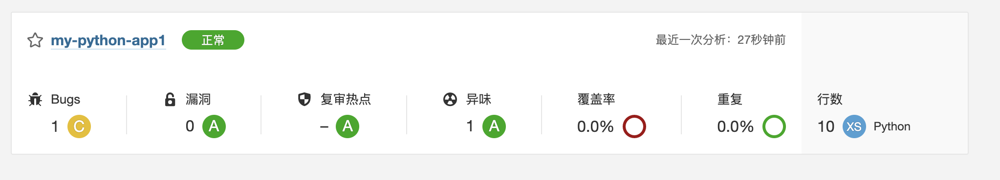

## 5.3 jenkins 基于命令扫描代码
* jenkins配置
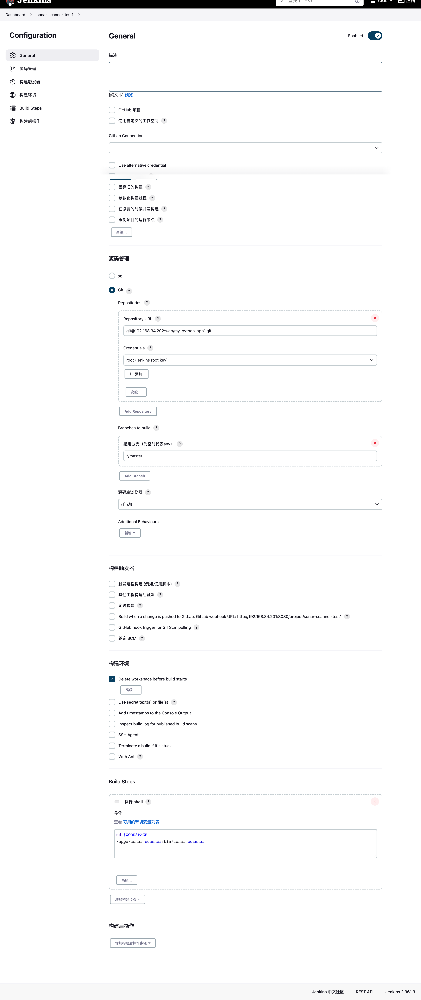
* 执行结果

* 扫描结果
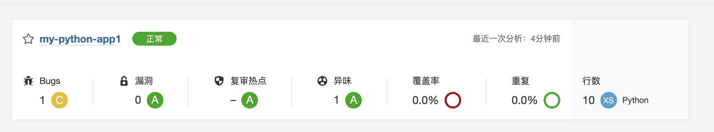

## 5.4 jenkins 基于脚本扫描代码
* jenkins配置
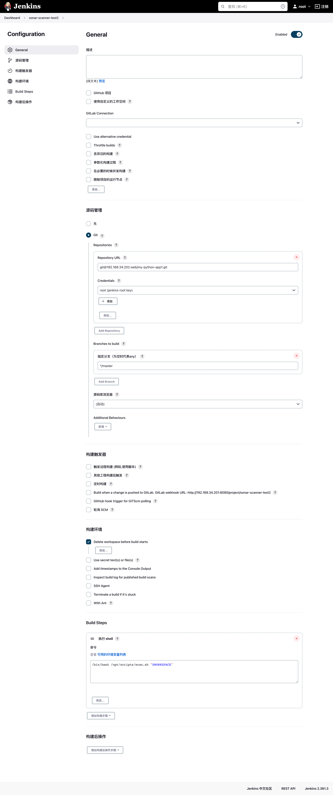
* 执行结果
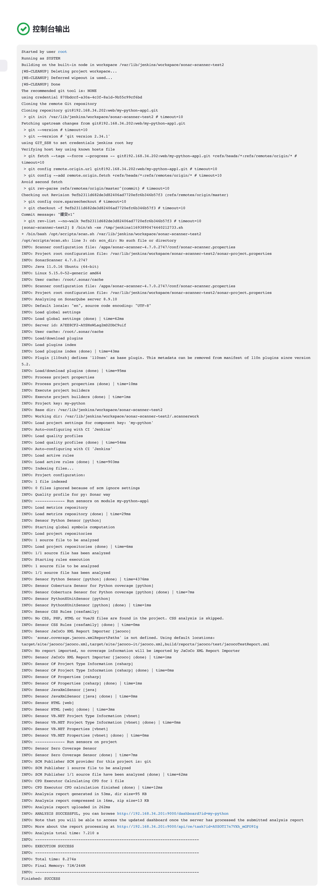
* 扫描结果
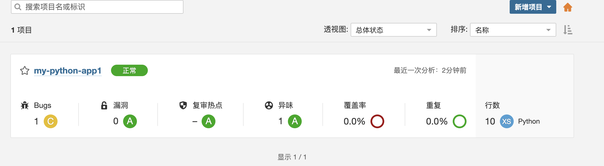
* 扫描脚本
```bash
#!/bin/bash
scn_dir=$1
cd scn_dir
/apps/sonar-scanner/bin/sonar-scanner
```
## 5.3 jenkins 基于pipeline扫描代码
* jenkins配置
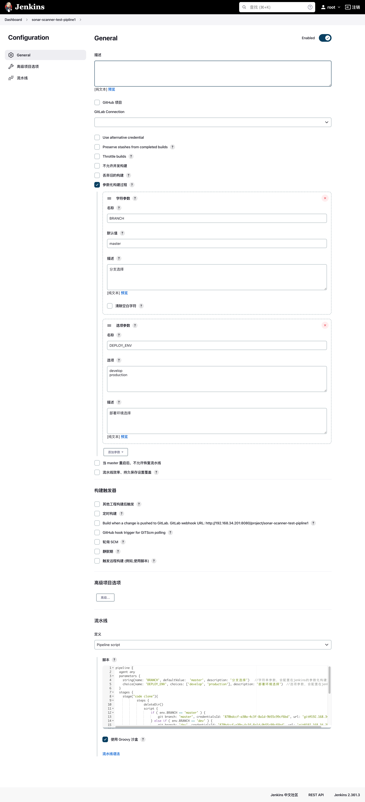
* jenkins运行参数
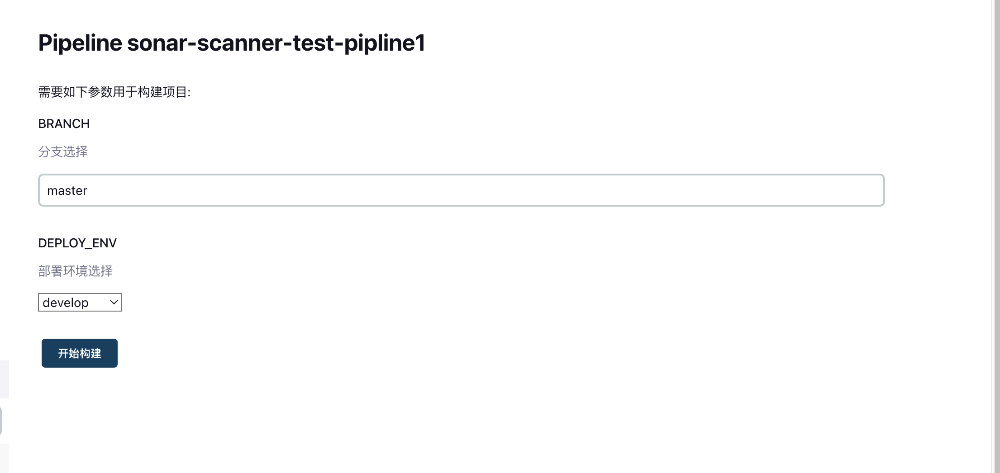
* 执行结果
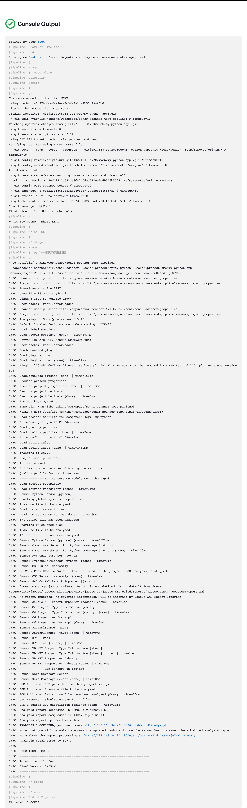
* 扫描结果

* piipline脚本
```bash
pipeline {
  agent any
  parameters {
    string(name: 'BRANCH', defaultValue:  'master', description: '分支选择')   //字符串参数，会配置在jenkins的参数化构建过程中
    choice(name: 'DEPLOY_ENV', choices: ['develop', 'production'], description: '部署环境选择')  //选项参数，会配置在jenkins的参数化构建过程中
  }
  stages {
    stage("code clone"){
			steps {
                deleteDir()
                script {
                    if ( env.BRANCH == 'master' ) {
                        git branch: 'master', credentialsId: '870bdccf-a30a-4c3f-8a1d-9b55c99cf6bd', url: 'git@192.168.34.202:web/my-python-app1.git'
                    } else if ( env.BRANCH == 'dev' ) {
                        git branch: 'dev', credentialsId: '870bdccf-a30a-4c3f-8a1d-9b55c99cf6bd', url: 'git@192.168.34.202:web/my-python-app1.git'
                    } else {
                        echo '您传递的分支参数BRANCH ERROR，请检查分支参数是否正确'
                    }
                    GIT_COMMIT_TAG = sh(returnStdout: true, script: 'git rev-parse --short HEAD').trim() //获取clone完成的分支tagId,用于做镜像做tag
		            }
			    }
		    } 

    stage('python源代码质量扫描') {
        steps {
            sh "cd $env.WORKSPACE && /apps/sonar-scanner/bin/sonar-scanner -Dsonar.projectKey=my-python -Dsonar.projectName=my-python-app1 -Dsonar.projectVersion=1.0  -Dsonar.sources=./src -Dsonar.language=py -Dsonar.sourceEncoding=UTF-8"
            }
        }
    }
}
```

# 6 扩展：
* jenkins安装Sonarqube Scanner插件、配置sonarqube server地址、基于jenkins配置代码扫描参数实现代码质量扫描
    Execute SonarQube Scanner
## 6.1 安装插件Sonarqube Scanner

## 6.2 Sonarqube Scanner
* Sonarqube server配置
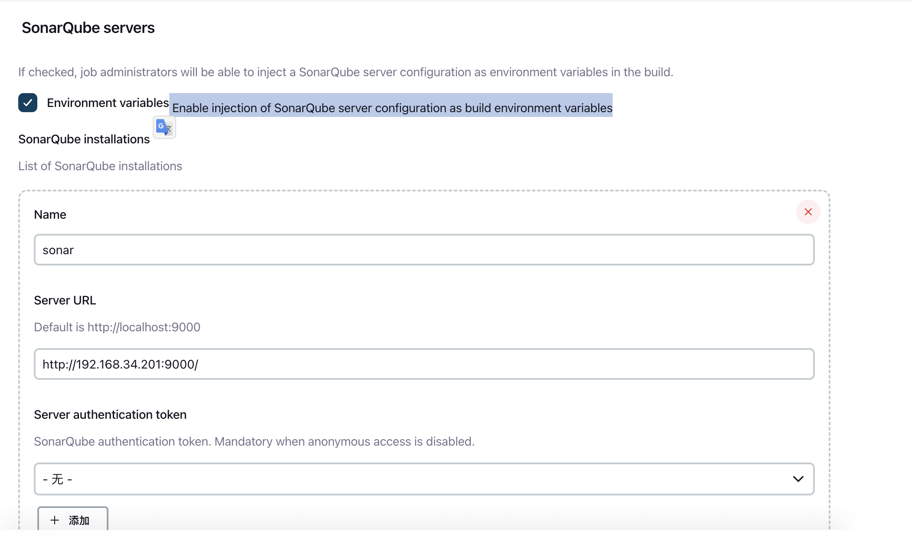
* Sonarqube Scanner配置
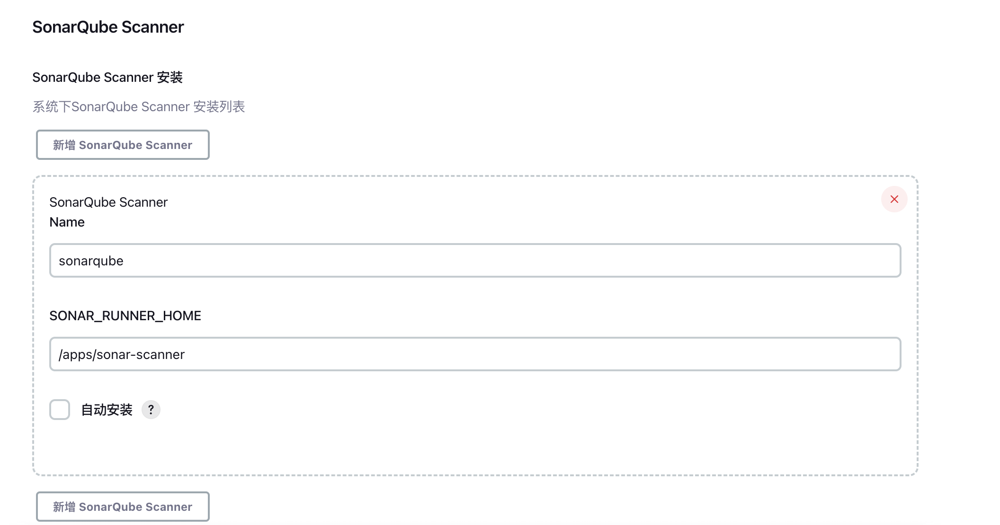
## 6.3 基于jenkins配置代码扫描参数实现代码质量扫描
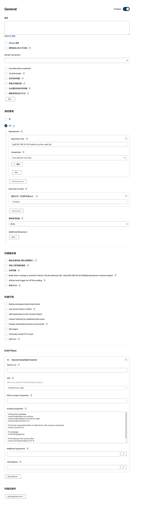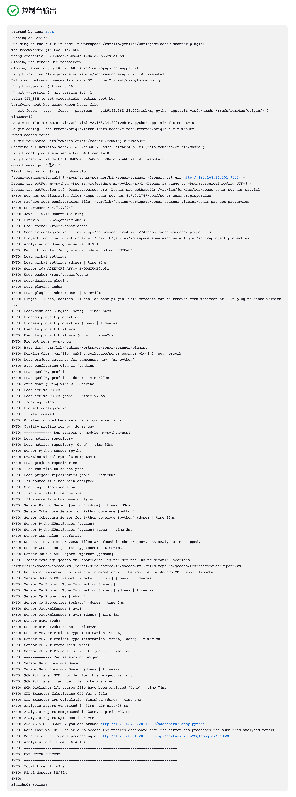

## 6.4 扫描结果
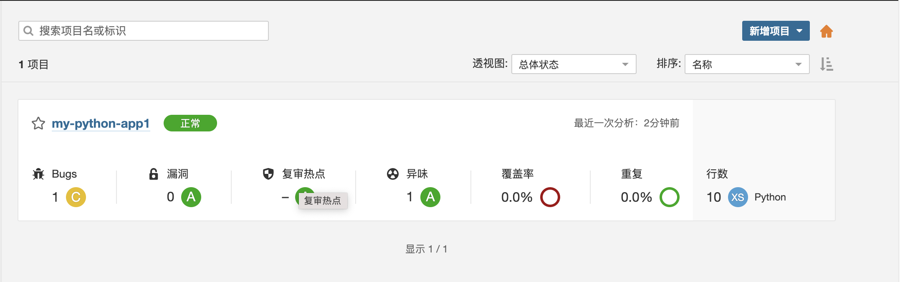