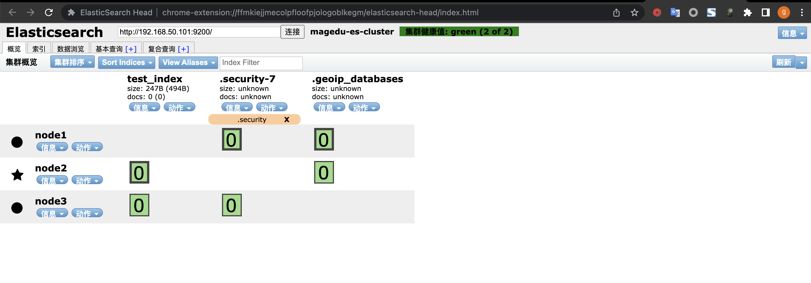
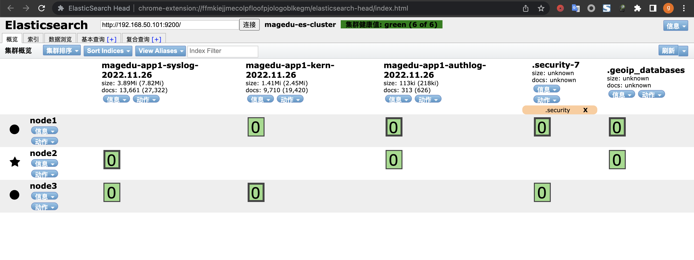
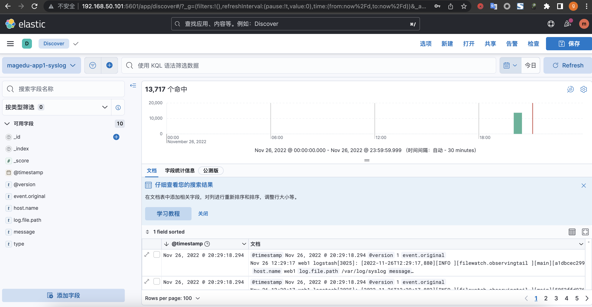
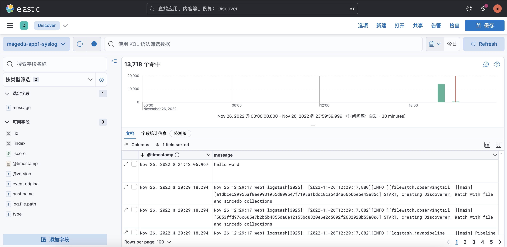
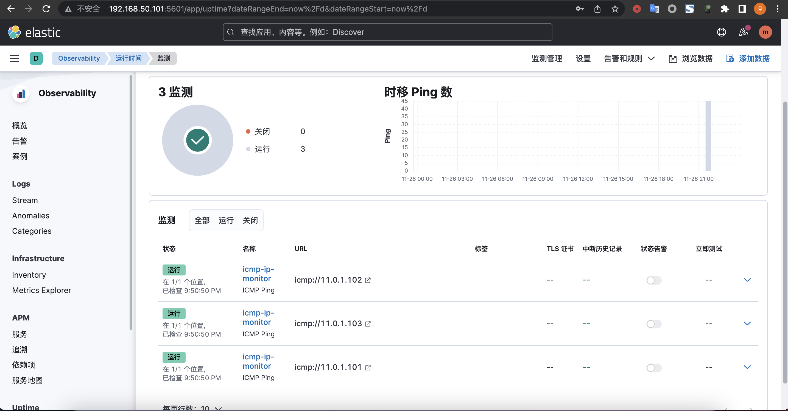
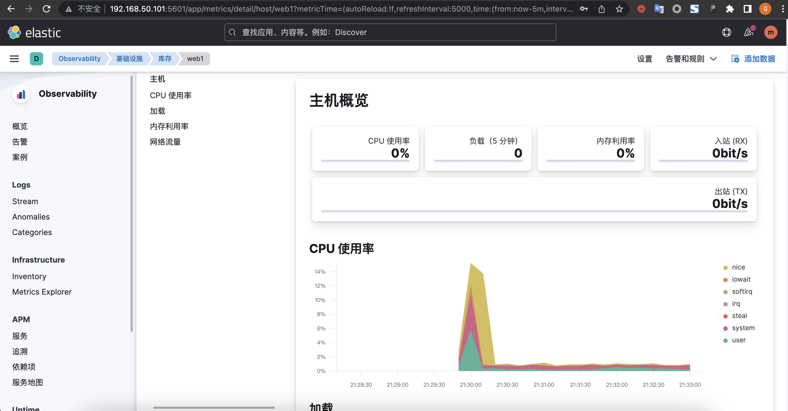

# 1. 完全基于 Pipeline 实现完整的代码部署流水线
## 1.1 jenkins部署流水线my-web
  
* 流水线测试完成的Jenkinsfile  
[Jenkinsfile](files/Jenkinsfile-1.1)  

* 流水线执行结果
  

* 代码扫描结果
  

* web站点部署成功


## 1.2 jenkins部署流水线代码回滚
* 改造后支持commit id回滚的Jenkinsfile
[Jenkinsfile](files/Jenkinsfile-1.2)   
* 执行回滚，输入回滚commit id
  
* 查看web站点


# 2. 熟悉 ELK 各组件的功能、Elasticsearch 的节点角色类型
## 2.1 ELK各组件的功能
### 2.1.1 Elasticsearch
* Elasticsearch是个开源分布式搜索引擎，提供搜集，分析，存储数据三大功能
* 特点：
    * 基于Apache Lucene之上的搜索引擎
    * 度可扩展的开源全文搜索和分析引擎，数据近实时(Near Real Time、NRT)全文检索
    * 支持分布式集群
    * 高性能，可以处理大规模业务数据
    * restfull风格接口
    * 索引自动分版，索引副本机制
    * 多数据源
    * 自动负载
### 2.1.2 Logstash
* Logstash是一个具有实时传输能力的数据收集与处理组件，可以通过插件实现各场景的日志收集、日志过滤、日志处理及日志输出，支持普通log、json格式等格式的日志解析，处理完成后把日志发送给elasticsearch cluster进行存储。
### 2.1.3 Kibana
* Kibana为elasticsearch提供一个查看数据的web界面，其主要是通过elasticsearch的API接口进行数据查找，并进行前端数据可 视化的展现，另外还可以针对特定格式的数据生成相应的表格、柱状图、饼图等。


## 2.2 Elasticsearch 的节点角色类型
* data node:数据节点，负责数据的存储，如分片的创建及删除、
数据的读写、数据的更新、数据的删除等操作。
* master node:主节点，负责index的创建、删除，分片的分配， node节点的添加、删除，node节点宕机时进行将状态通告至其它 可用node节点，一个ES集群只有一个活跃的master node节点， 其它非活跃的master备用节点将等待master宕机以后进行新的 master的竞选。
* client node/coordinating-node:客户端节点或协调节点，负责 将数据读写请求转发data node、将集群管理相关的操作转发到 master node，客户端节点只作为集群的访问入口、其不存储任何 数据，也不参与master角色的选举。
* Ingest节点:预处理节点，在检索数据之前可以先对数据做预处理 操作(Ingest pipelines,数据提取管道)，可以在管道对数据实现对 数据的字段删除、文本提取等操作。
    * 所有节点其实默认都是支持 Ingest 操作的，也可以专门将某个 节点配置为 Ingest 节点。

# 3. 熟悉索引、doc、分片与副本的概念
## 3.1 索引
* 索引文档的容器，是一类 文档的结合。索引体现了 逻辑空间的概念，它有自己的定义(mapping和setting)，mapping定义了包含文档的字段和字段类型。setting定义不同数据的分布，有多少分片，有多少副本，怎么分布。
## 3.2 doc
* 是ES 所有可搜索数据的最小单位，它会被序列化成JSON格式(可以包含 不同的类型的字段)，保存到ES中。每个文档都有一个UID，可以自己定义，也可以交给系统生成
### 3.2.1 文档的组成
* 元数据：用于标注文档的相关信息
* 字段： 类似于 关系型数据库的字段，支持数据/嵌套，类型可以自定义也可以交给系统自动推算
## 3.3 分片
* 分片，是对Index的逻辑拆分存储，分片可以是一个也可以是多个，多个分片合并起来就是Index的所有数据
* 分为主分片和副本。每个分片都是一个Lucene索引，它用于水平分割扩展数据
## 3.4 副本
* 用于数据高可用，是主分片的拷贝。副本数可以动态修改
* 一个分片的跨主机完整备份，分为主分片和副本分片，数据写入主分片时立即同步到副本分片，以实现数据高可用及主分片宕机的故障转 移，副本分片可以读，多副本分片可以提高ES集群的读性能，只有在主分片宕机以后才会给提升为主分片继续写入数据，并为其添加新的副本分片。

# 4. 掌握不同环境的 ELK 部署规划，基于 deb 或二进制部署 Elasticsearch 集群

## 4.1 内核参数优化
* 分别在3台服务器配置
```bash
root@es-node1:~# vi /etc/sysctl.conf
vm.max_map_count=262144
```
## 4.2 配置主机名解析
* 分别在3台服务器配置
```bash
root@es-node1:~# vi /etc/hosts
# es node config
11.0.1.101  es-node1 es1.example.com
11.0.1.102  es-node2 es2.example.com
11.0.1.103  es-node3 es3.example.com
```
## 4.3 资源limit优化
* 分别在3台服务器配置
```bash
root@es-node1:~# vi /etc/security/limits.conf
*             soft    core            unlimited
*             hard    core            unlimited
*             soft    nproc           1000000
*             hard    nproc           1000000
*             soft    nofile          1000000
*             hard    nofile          1000000
*             soft    memlock         32000
*             hard    memlock         32000
*             soft    msgqueue        8192000
*             hard    msgqueue        8192000
```
## 4.4 创建普通用户运行环境
* 分别在3台服务器配置
```bash
root@es-node1:~# groupadd  -g 2888 elasticsearch && useradd -u 2888  -g 2888 -r -m -s /bin/bash elasticsearch
root@es-node1:~# passwd elasticsearch
root@es-node1:~# mkdir  /data/esdata /data/eslogs /apps -pv

```
## 4.5 部署elasticsearch集群
* 分别在3台服务器配置
```bash
root@es-node1:~# cd /apps
root@es-node1:/apps# tar xvf ~/elasticsearch-8.5.1-linux-x86_64.tar.gz
root@es-node1:/apps# ln  -sv /apps/elasticsearch-8.5.1 /apps/elasticsearch
root@es-node1:~# chown  elasticsearch.elasticsearch /data /apps/ -R
root@es-node1:/apps# reboot
```
## 4.6 xpack认证签发环境
```bash
root@es-node1:~# su - elasticsearch
elasticsearch@es-node1:~$ cd /apps/elasticsearch
elasticsearch@es-node1:/apps/elasticsearch$ vim  instances.yml
instances:
  - name: "es1.example.com"
    ip:
      - "11.0.1.101"
  - name: "es2.example.com"
    ip:
      - "11.0.1.102"
  - name: "es3.example.com"
    ip:
      - "11.0.1.103"
#生成CA私钥，默认名字为elastic-stack-ca.p12
elasticsearch@es-node1:/apps/elasticsearch$ bin/elasticsearch-certutil ca
#生产CA公钥，默认名称为elastic-certificates.p12
elasticsearch@es-node1:/apps/elasticsearch$ bin/elasticsearch-certutil cert --ca elastic-stack-ca.p12
#签发elasticsearch集群主机证书:
elasticsearch@es-node1:/apps/elasticsearch$ bin/elasticsearch-certutil cert --silent --in instances.yml --out certs.zip --pass magedu123 --ca elastic-stack-ca.p12
#证书分发:
#本机(node1)证书:
elasticsearch@es-node1:/apps/elasticsearch$ unzip certs.zip
elasticsearch@es-node1:/apps/elasticsearch$ mkdir config/certs
elasticsearch@es-node1:/apps/elasticsearch$ cp -rp es1.example.com/es1.example.com.p12 config/certs/
#node2证书:
root@es-node2:~# su - elasticsearch
elasticsearch@es-node2:~$ cd /apps/elasticsearch
elasticsearch@es-node2:/apps/elasticsearch$ mkdir config/certs
elasticsearch@es-node1:/apps/elasticsearch$ scp -rp es2.example.com/es2.example.com.p12 es-node2:/apps/elasticsearch/config/certs/
#node2证书:
root@es-node3:~# su - elasticsearch
elasticsearch@es-node3:~$ cd /apps/elasticsearch
elasticsearch@es-node3:/apps/elasticsearch$ mkdir config/certs
elasticsearch@es-node1:/apps/elasticsearch$ scp -rp es3.example.com/es3.example.com.p12 es-node3:/apps/elasticsearch/config/certs/
##生成 keystore 文件(keystore是保存了证书密码的认证文件magedu123)
#创建 keystore文件
elasticsearch@es-node1:/apps/elasticsearch$ ./bin/elasticsearch-keystore create
Created elasticsearch keystore in /apps/elasticsearch/config/elasticsearch.keystor
elasticsearch@es-node1:/apps/elasticsearch$ ./bin/elasticsearch-keystore add xpack.security.transport.ssl.keystore.secure_password
Enter value for xpack.security.transport.ssl.keystore.secure_password: #magedu123
elasticsearch@es-node1:/apps/elasticsearch$ ./bin/elasticsearch-keystore add xpack.security.transport.ssl.truststore.secure_password
Enter value for xpack.security.transport.ssl.truststore.secure_password:#magedu123
#分发认证文件:
elasticsearch@es-node1:/apps/elasticsearch$ scp -rp /apps/elasticsearch/config/elasticsearch.keystore es-node2:/apps/elasticsearch/config/elasticsearch.keystore
elasticsearch@es-node1:/apps/elasticsearch$ scp -rp /apps/elasticsearch/config/elasticsearch.keystore es-node3:/apps/elasticsearch/config/elasticsearch.keystore
```
## 4.7 编辑配置文件
```bash
##node1
root@es-node1:~# cat /apps/elasticsearch/config/elasticsearch.yml
# ======================== Elasticsearch Configuration =========================
#
# NOTE: Elasticsearch comes with reasonable defaults for most settings.
#       Before you set out to tweak and tune the configuration, make sure you
#       understand what are you trying to accomplish and the consequences.
#
# The primary way of configuring a node is via this file. This template lists
# the most important settings you may want to configure for a production cluster.
#
# Please consult the documentation for further information on configuration options:
# https://www.elastic.co/guide/en/elasticsearch/reference/index.html
#
# ---------------------------------- Cluster -----------------------------------
#
# Use a descriptive name for your cluster:
#
cluster.name: magedu-es-cluster
#
# ------------------------------------ Node ------------------------------------
#
# Use a descriptive name for the node:
#
node.name: node1
#
# Add custom attributes to the node:
#
#node.attr.rack: r1
#
# ----------------------------------- Paths ------------------------------------
#
# Path to directory where to store the data (separate multiple locations by comma):
#
path.data: /data/esdata
#
# Path to log files:
#
path.logs: /data/eslogs
#
# ----------------------------------- Memory -----------------------------------
#
# Lock the memory on startup:
#
#bootstrap.memory_lock: true
#
# Make sure that the heap size is set to about half the memory available
# on the system and that the owner of the process is allowed to use this
# limit.
#
# Elasticsearch performs poorly when the system is swapping the memory.
#
# ---------------------------------- Network -----------------------------------
#
# By default Elasticsearch is only accessible on localhost. Set a different
# address here to expose this node on the network:
#
network.host: 0.0.0.0
#
# By default Elasticsearch listens for HTTP traffic on the first free port it
# finds starting at 9200. Set a specific HTTP port here:
#
http.port: 9200
#
# For more information, consult the network module documentation.
#
# --------------------------------- Discovery ----------------------------------
#
# Pass an initial list of hosts to perform discovery when this node is started:
# The default list of hosts is ["127.0.0.1", "[::1]"]
#
discovery.seed_hosts: ["11.0.1.101", "11.0.1.102", "11.0.1.103"]
#
# Bootstrap the cluster using an initial set of master-eligible nodes:
#
cluster.initial_master_nodes: ["11.0.1.101", "11.0.1.102", "11.0.1.103"]
#
# For more information, consult the discovery and cluster formation module documentation.
#
# --------------------------------- Readiness ----------------------------------
#
# Enable an unauthenticated TCP readiness endpoint on localhost
#
#readiness.port: 9399
#
# ---------------------------------- Various -----------------------------------
#
# Allow wildcard deletion of indices:
#
action.destructive_requires_name: true

xpack.security.enabled: true
xpack.security.transport.ssl.enabled: true
xpack.security.transport.ssl.keystore.path: /apps/elasticsearch/config/certs/es1.example.com.p12
xpack.security.transport.ssl.truststore.path: /apps/elasticsearch/config/certs/es1.example.com.p12


## node2
root@es-node2:~# cat /apps/elasticsearch/config/elasticsearch.yml
# ======================== Elasticsearch Configuration =========================
#
# NOTE: Elasticsearch comes with reasonable defaults for most settings.
#       Before you set out to tweak and tune the configuration, make sure you
#       understand what are you trying to accomplish and the consequences.
#
# The primary way of configuring a node is via this file. This template lists
# the most important settings you may want to configure for a production cluster.
#
# Please consult the documentation for further information on configuration options:
# https://www.elastic.co/guide/en/elasticsearch/reference/index.html
#
# ---------------------------------- Cluster -----------------------------------
#
# Use a descriptive name for your cluster:
#
cluster.name: magedu-es-cluster
#
# ------------------------------------ Node ------------------------------------
#
# Use a descriptive name for the node:
#
node.name: node2
#
# Add custom attributes to the node:
#
#node.attr.rack: r1
#
# ----------------------------------- Paths ------------------------------------
#
# Path to directory where to store the data (separate multiple locations by comma):
#
path.data: /data/esdata
#
# Path to log files:
#
path.logs: /data/eslogs
#
# ----------------------------------- Memory -----------------------------------
#
# Lock the memory on startup:
#
#bootstrap.memory_lock: true
#
# Make sure that the heap size is set to about half the memory available
# on the system and that the owner of the process is allowed to use this
# limit.
#
# Elasticsearch performs poorly when the system is swapping the memory.
#
# ---------------------------------- Network -----------------------------------
#
# By default Elasticsearch is only accessible on localhost. Set a different
# address here to expose this node on the network:
#
network.host: 0.0.0.0
#
# By default Elasticsearch listens for HTTP traffic on the first free port it
# finds starting at 9200. Set a specific HTTP port here:
#
http.port: 9200
#
# For more information, consult the network module documentation.
#
# --------------------------------- Discovery ----------------------------------
#
# Pass an initial list of hosts to perform discovery when this node is started:
# The default list of hosts is ["127.0.0.1", "[::1]"]
#
discovery.seed_hosts: ["11.0.1.101", "11.0.1.102", "11.0.1.103"]
#
# Bootstrap the cluster using an initial set of master-eligible nodes:
#
cluster.initial_master_nodes: ["11.0.1.101", "11.0.1.102", "11.0.1.103"]
#
# For more information, consult the discovery and cluster formation module documentation.
#
# --------------------------------- Readiness ----------------------------------
#
# Enable an unauthenticated TCP readiness endpoint on localhost
#
#readiness.port: 9399
#
# ---------------------------------- Various -----------------------------------
#
# Allow wildcard deletion of indices:
#
action.destructive_requires_name: true

xpack.security.enabled: true
xpack.security.transport.ssl.enabled: true
xpack.security.transport.ssl.keystore.path: /apps/elasticsearch/config/certs/es2.example.com.p12
xpack.security.transport.ssl.truststore.path: /apps/elasticsearch/config/certs/es2.example.com.p12


## node3
root@es-node3:~# cat /apps/elasticsearch/config/elasticsearch.yml
# ======================== Elasticsearch Configuration =========================
#
# NOTE: Elasticsearch comes with reasonable defaults for most settings.
#       Before you set out to tweak and tune the configuration, make sure you
#       understand what are you trying to accomplish and the consequences.
#
# The primary way of configuring a node is via this file. This template lists
# the most important settings you may want to configure for a production cluster.
#
# Please consult the documentation for further information on configuration options:
# https://www.elastic.co/guide/en/elasticsearch/reference/index.html
#
# ---------------------------------- Cluster -----------------------------------
#
# Use a descriptive name for your cluster:
#
cluster.name: magedu-es-cluster
#
# ------------------------------------ Node ------------------------------------
#
# Use a descriptive name for the node:
#
node.name: node3
#
# Add custom attributes to the node:
#
#node.attr.rack: r1
#
# ----------------------------------- Paths ------------------------------------
#
# Path to directory where to store the data (separate multiple locations by comma):
#
path.data: /data/esdata
#
# Path to log files:
#
path.logs: /data/eslogs
#
# ----------------------------------- Memory -----------------------------------
#
# Lock the memory on startup:
#
#bootstrap.memory_lock: true
#
# Make sure that the heap size is set to about half the memory available
# on the system and that the owner of the process is allowed to use this
# limit.
#
# Elasticsearch performs poorly when the system is swapping the memory.
#
# ---------------------------------- Network -----------------------------------
#
# By default Elasticsearch is only accessible on localhost. Set a different
# address here to expose this node on the network:
#
network.host: 0.0.0.0
#
# By default Elasticsearch listens for HTTP traffic on the first free port it
# finds starting at 9200. Set a specific HTTP port here:
#
http.port: 9200
#
# For more information, consult the network module documentation.
#
# --------------------------------- Discovery ----------------------------------
#
# Pass an initial list of hosts to perform discovery when this node is started:
# The default list of hosts is ["127.0.0.1", "[::1]"]
#
discovery.seed_hosts: ["11.0.1.101", "11.0.1.102", "11.0.1.103"]
#
# Bootstrap the cluster using an initial set of master-eligible nodes:
#
cluster.initial_master_nodes: ["11.0.1.101", "11.0.1.102", "11.0.1.103"]
#
# For more information, consult the discovery and cluster formation module documentation.
#
# --------------------------------- Readiness ----------------------------------
#
# Enable an unauthenticated TCP readiness endpoint on localhost
#
#readiness.port: 9399
#
# ---------------------------------- Various -----------------------------------
#
# Allow wildcard deletion of indices:
#
action.destructive_requires_name: true

xpack.security.enabled: true
xpack.security.transport.ssl.enabled: true
xpack.security.transport.ssl.keystore.path: /apps/elasticsearch/config/certs/es3.example.com.p12
xpack.security.transport.ssl.truststore.path: /apps/elasticsearch/config/certs/es3.example.com.p12
```
## 4.8 配置service文件
* 3台服务器都需要配置
```bash
root@es-node1:~# cat /lib/systemd/system/elasticsearch.service
[Unit]
Description=Elasticsearch
Documentation=http://www.elastic.co
Wants=network-online.target
After=network-online.target

[Service]
RuntimeDirectory=elasticsearch
Environment=ES_HOME=/apps/elasticsearch
Environment=ES_PATH_CONF=/apps/elasticsearch/config
Environment=PID_DIR=/apps/elasticsearch

WorkingDirectory=/apps/elasticsearch

User=elasticsearch
Group=elasticsearch

ExecStart=/apps/elasticsearch/bin/elasticsearch --quiet

# StandardOutput is configured to redirect to journalctl since
# some error messages may be logged in standard output before
# elasticsearch logging system is initialized. Elasticsearch
# stores its logs in /var/log/elasticsearch and does not use
# journalctl by default. If you also want to enable journalctl
# logging, you can simply remove the "quiet" option from ExecStart.
StandardOutput=journal
StandardError=inherit

# Specifies the maximum file descriptor number that can be opened by this process
LimitNOFILE=65536

# Specifies the maximum number of processes
LimitNPROC=4096

# Specifies the maximum size of virtual memory
LimitAS=infinity

# Specifies the maximum file size
LimitFSIZE=infinity

# Disable timeout logic and wait until process is stopped
TimeoutStopSec=0

# SIGTERM signal is used to stop the Java process
KillSignal=SIGTERM

# Send the signal only to the JVM rather than its control group
KillMode=process

# Java process is never killed
SendSIGKILL=no

# When a JVM receives a SIGTERM signal it exits with code 143
SuccessExitStatus=143

[Install]
WantedBy=multi-user.target
root@es-node1:~# systemctl  daemon-reload && systemctl  start  elasticsearch.service && systemctl  enable elasticsearch.service
root@es-node1:/apps/elasticsearch/config# cd
root@es-node1:~# systemctl status elasticsearch
● elasticsearch.service - Elasticsearch
     Loaded: loaded (/lib/systemd/system/elasticsearch.service; enabled; vendor preset: enabled)
     Active: active (running) since Sat 2022-11-26 08:33:11 UTC; 1min 53s ago
       Docs: http://www.elastic.co
   Main PID: 2747 (java)
      Tasks: 67 (limit: 4534)
     Memory: 2.4G
        CPU: 1min 12.979s
     CGroup: /system.slice/elasticsearch.service
             ├─2747 /apps/elasticsearch/jdk/bin/java -Xms4m -Xmx64m -XX:+UseSerialGC -Dcli.name=server -Dcli.script=/apps/elasticsearch/bin/>
             ├─2806 /apps/elasticsearch-8.5.1/jdk/bin/java -Des.networkaddress.cache.ttl=60 -Des.networkaddress.cache.negative.ttl=10 -Djava>
             └─2827 /apps/elasticsearch/modules/x-pack-ml/platform/linux-x86_64/bin/controller

Nov 26 08:33:11 es-node1 systemd[1]: Started Elasticsearch.
```
## 4.9 用户管理
```bash
elasticsearch@es-node1:/apps/elasticsearch$ bin/elasticsearch-setup-passwords interactive
******************************************************************************
Note: The 'elasticsearch-setup-passwords' tool has been deprecated. This       command will be removed in a future release.
******************************************************************************

Initiating the setup of passwords for reserved users elastic,apm_system,kibana,kibana_system,logstash_system,beats_system,remote_monitoring_user.
You will be prompted to enter passwords as the process progresses.
Please confirm that you would like to continue [y/N]y


Enter password for [elastic]:
Reenter password for [elastic]:
Enter password for [apm_system]:
Reenter password for [apm_system]:
Enter password for [kibana_system]:
Reenter password for [kibana_system]:
Enter password for [logstash_system]:
Reenter password for [logstash_system]:
Enter password for [beats_system]:
Reenter password for [beats_system]:
Enter password for [remote_monitoring_user]:
Reenter password for [remote_monitoring_user]:
Changed password for user [apm_system]
Changed password for user [kibana_system]
Changed password for user [kibana]
Changed password for user [logstash_system]
Changed password for user [beats_system]
Changed password for user [remote_monitoring_user]
Changed password for user [elastic]
```
## 4.10 创建超级管理员账户
* 3台服务器都需要执行
```bash
elasticsearch@es-node1:/apps/elasticsearch$ ./bin/elasticsearch-users useradd magedu -p 123456 -r superuser
elasticsearch@es-node1:/apps/elasticsearch$ curl -u magedu:123456 http://11.0.1.101:9200
{
  "name" : "node1",
  "cluster_name" : "magedu-es-cluster",
  "cluster_uuid" : "Baw0hyW9ROCS04kuUazA0A",
  "version" : {
    "number" : "8.5.1",
    "build_flavor" : "default",
    "build_type" : "tar",
    "build_hash" : "c1310c45fc534583afe2c1c03046491efba2bba2",
    "build_date" : "2022-11-09T21:02:20.169855900Z",
    "build_snapshot" : false,
    "lucene_version" : "9.4.1",
    "minimum_wire_compatibility_version" : "7.17.0",
    "minimum_index_compatibility_version" : "7.0.0"
  },
  "tagline" : "You Know, for Search"
}
```

# 5. 了解 Elasticsearch API 的简单使用，安装 head 插件管理 ES 的数据
```bash
## 获取集群状态
root@es-node1:~# curl -u magedu:123456 http://11.0.1.101:9200
{
  "name" : "node1",
  "cluster_name" : "magedu-es-cluster",
  "cluster_uuid" : "Baw0hyW9ROCS04kuUazA0A",
  "version" : {
    "number" : "8.5.1",
    "build_flavor" : "default",
    "build_type" : "tar",
    "build_hash" : "c1310c45fc534583afe2c1c03046491efba2bba2",
    "build_date" : "2022-11-09T21:02:20.169855900Z",
    "build_snapshot" : false,
    "lucene_version" : "9.4.1",
    "minimum_wire_compatibility_version" : "7.17.0",
    "minimum_index_compatibility_version" : "7.0.0"
  },
  "tagline" : "You Know, for Search"
}
## 集群支持的操作
root@es-node1:~# curl -u magedu:123456 http://11.0.1.101:9200/_cat
=^.^=
/_cat/allocation
/_cat/shards
/_cat/shards/{index}
/_cat/master
/_cat/nodes
/_cat/tasks
/_cat/indices
/_cat/indices/{index}
/_cat/segments
/_cat/segments/{index}
/_cat/count
/_cat/count/{index}
/_cat/recovery
/_cat/recovery/{index}
/_cat/health
/_cat/pending_tasks
/_cat/aliases
/_cat/aliases/{alias}
/_cat/thread_pool
/_cat/thread_pool/{thread_pools}
/_cat/plugins
/_cat/fielddata
/_cat/fielddata/{fields}
/_cat/nodeattrs
/_cat/repositories
/_cat/snapshots/{repository}
/_cat/templates
/_cat/component_templates/_cat/transforms
/_cat/transforms/{transform_id}
/_cat/ml/anomaly_detectors
/_cat/ml/anomaly_detectors/{job_id}
/_cat/ml/trained_models
/_cat/ml/trained_models/{model_id}
/_cat/ml/datafeeds
/_cat/ml/datafeeds/{datafeed_id}
/_cat/ml/data_frame/analytics
/_cat/ml/data_frame/analytics/{id}
## 获取master信息
root@es-node1:~# curl -u magedu:123456 http://11.0.1.101:9200/_cat/master?v
id                     host       ip         node
6goJ1CIyTdygd1OBBI3IQg 11.0.1.102 11.0.1.102 node2
## 获取node节点信息
root@es-node1:~# curl -u magedu:123456 http://11.0.1.101:9200/_cat/nodes?v
ip         heap.percent ram.percent cpu load_1m load_5m load_15m node.role   master name
11.0.1.102           28          86   1    0.27    0.13     0.10 cdfhilmrstw *      node2
11.0.1.103           28          83   2    0.21    0.17     0.10 cdfhilmrstw -      node3
11.0.1.101           17          88   2    0.06    0.09     0.09 cdfhilmrstw -      node1
## 获取集群心跳信息
root@es-node1:~# curl -u magedu:123456 http://11.0.1.101:9200/_cat/health?v
epoch      timestamp cluster           status node.total node.data shards pri relo init unassign pending_tasks max_task_wait_time active_shards_percent
1669457289 10:08:09  magedu-es-cluster green           3         3      4   2    0    0        0             0                  -                100.0%
## 创建索引test_index，pretty 为格式序列化
root@es-node1:~# curl -u magedu:123456 -X PUT http://11.0.1.101:9200/test_index?pretty
{
  "acknowledged" : true,
  "shards_acknowledged" : true,
  "index" : "test_index"
}
## 查看索引
root@es-node1:~# curl -u magedu:123456 http://11.0.1.101:9200/test_index?pretty
{
  "test_index" : {
    "aliases" : { },
    "mappings" : { },
    "settings" : {
      "index" : {
        "routing" : {
          "allocation" : {
            "include" : {
              "_tier_preference" : "data_content"
            }
          }
        },
        "number_of_shards" : "1",
        "provided_name" : "test_index",
        "creation_date" : "1669457376487",
        "number_of_replicas" : "1",
        "uuid" : "Xeo202dmSUmdOI2V0lImTQ",
        "version" : {
          "created" : "8050199"
        }
      }
    }
  }
}
## 上传数据
root@es-node1:~# curl -u magedu:123456 -X POST "http://11.0.1.101:9200/test_index/_doc/1?pretty" -H 'Content-Type: application/json' -d '{"name": "Jack","age": 19}'
{
  "_index" : "test_index",
  "_id" : "1",
  "_version" : 1,
  "result" : "created",
  "_shards" : {
    "total" : 2,
    "successful" : 2,
    "failed" : 0
  },
  "_seq_no" : 0,
  "_primary_term" : 1
}
## 查看文档
root@es-node1:~# curl -u magedu:123456 http://11.0.1.101:9200/test_index/_doc/1?pretty
{
  "_index" : "test_index",
  "_id" : "1",
  "_version" : 1,
  "_seq_no" : 0,
  "_primary_term" : 1,
  "found" : true,
  "_source" : {
    "name" : "Jack",
    "age" : 19
  }
}
## 修改副本数,副本数可动态调整
root@es-node1:~# curl -u magedu:123456 -X PUT http://11.0.1.101:9200/test_index/_settings -H 'content-Type:application/json' -d '{"number_of_replicas": 2}'
{"acknowledged":true}
## 查看索引设置
root@es-node1:~# curl -u magedu:123456 -X GET http://11.0.1.101:9200/test_index/_settings?pretty
{
  "test_index" : {
    "settings" : {
      "index" : {
        "routing" : {
          "allocation" : {
            "include" : {
              "_tier_preference" : "data_content"
            }
          }
        },
        "number_of_shards" : "1",
        "provided_name" : "test_index",
        "creation_date" : "1669457376487",
        "number_of_replicas" : "2",
        "uuid" : "Xeo202dmSUmdOI2V0lImTQ",
        "version" : {
          "created" : "8050199"
        }
      }
    }
  }
}
## 删除索引
root@es-node1:~# curl -u magedu:123456 -X DELETE "http://11.0.1.101:9200/test_index?pretty"
{
  "acknowledged" : true
}
## 关闭索引
root@es-node1:~# curl -u magedu:123456 -X POST "http://11.0.1.101:9200/test_index/_close"

{"acknowledged":true,"shards_acknowledged":true,"indices":{"test_index":{"closed":true}}}
## 打开索引
root@es-node1:~# curl -u magedu:123456 -X POST "http://11.0.1.101:9200/test_index/_open?pretty"
{
  "acknowledged" : true,
  "shards_acknowledged" : true
}
```
* 修改集群每个节点的最大可分配的分片数，es7默认为1000，用完后创建新的分片报错误状态码400
```bash
root@es-node1:~# curl -u magedu:123456 -X PUT http://11.0.1.101:9200/_cluster/settings -H 'Content-Type: application/json' -d' {"persistent" : { "cluster.max_shards_per_node" : "1000000"}}'
{"acknowledged":true,"persistent":{"cluster":{"max_shards_per_node":"1000000"}},"transient":{}}
```
* 磁盘最低和最高使用百分比95%，默认85%不会在当前节点创新新的分配副本、90%开始将副本移动至其它节点、95所有索引只读
```bash
root@es-node1:~# curl -u magedu:123456 -X PUT http://11.0.1.101:9200/_cluster/settings -H 'Content-Type: application/json' -d' {"persistent": { "cluster.routing.allocation.disk.watermark.low": "95%", "cluster.routing.allocation.disk.watermark.high": "95%"}}'
{"acknowledged":true,"persistent":{"cluster":{"routing":{"allocation":{"disk":{"watermark":{"low":"95%","high":"95%"}}}}}},"transient":{}}
```
* head插件访问elasticsearch 集群


# 6. 安装 Logstash 收集不同类型的系统日志并写入到 ES 的不同 index
## 6.1 安装Logstash
```bash
root@web1:~# dpkg -i logstash-8.5.1-amd64.deb
```
## 6.2 收集不同类型的系统日志并写入到 ES 的不同 index
```bash
root@web1:~# vi /etc/logstash/conf.d/syslog-to-es.conf
input {
  file {
    path => "/var/log/syslog"
    stat_interval => "1"
    start_position => "beginning"
    type => "syslog"
  }

  file {
    path => "/var/log/auth.log"
    stat_interval => "1"
    start_position => "beginning"
    type => "authlog"
  }

  file {
    path => "/var/log/kern.log"
    stat_interval => "1"
    start_position => "beginning"
    type => "kernlog"
  }
}


output {
  if [type] == "syslog" {
    elasticsearch {
      hosts => ["11.0.1.101:9200"]
      index => "magedu-app1-syslog-%{+yyyy.MM.dd}"
      user => "magedu"
      password => "123456"
  }}

  if [type] == "authlog" {
    elasticsearch {
      hosts => ["11.0.1.101:9200"]
      index => "magedu-app1-authlog-%{+yyyy.MM.dd}"
      user => "magedu"
      password => "123456"
  }}

  if [type] == "kernlog" {
    elasticsearch {
      hosts => ["11.0.1.101:9200"]
      index => "magedu-app1-kern-%{+yyyy.MM.dd}"
      user => "magedu"
      password => "123456"
  }}

}
## 修改启动用户和用户组，系统日志需要root权限才能读取
root@web1:~# vi /usr/lib/systemd/system/logstash.service
Unit]
Description=logstash

[Service]
Type=simple
User=root
Group=root
# Load env vars from /etc/default/ and /etc/sysconfig/ if they exist.
# Prefixing the path with '-' makes it try to load, but if the file doesn't
# exist, it continues onward.
EnvironmentFile=-/etc/default/logstash
EnvironmentFile=-/etc/sysconfig/logstash
ExecStart=/usr/share/logstash/bin/logstash "--path.settings" "/etc/logstash"
Restart=always
WorkingDirectory=/
Nice=19
LimitNOFILE=16384

# When stopping, how long to wait before giving up and sending SIGKILL?
# Keep in mind that SIGKILL on a process can cause data loss.
TimeoutStopSec=infinity

[Install]
WantedBy=multi-user.target

## 启动服务，加入到开启启动
root@web1:~# systemctl daemon-reload && systemctl start logstash && systemctl enable logstash
```
* elasticsearch 查看index

* 浏览 elasticsearch 数据


# 7. 安装 Kibana、查看 ES 集群的数据
## 7.1 基本概念
* Kibana 是一款开源的数据分析和可视化平台， 它是 Elastic Stack 成员之一，设计用于和 Elasticsearch 协作,可以使用 Kibana 对 Elasticsearch 索引中的数据进行搜索、查看、 交互操作,在kibana可以很方便的利用图表、表 格及地图对数据进行多元化的分析和呈现。
  * https://github.com/elastic/kibana
  * https://typescript.bootcss.com #目前基于TypeScript语言开发
* Kibana 可以使大数据通俗易懂，其使用很简 单，基于浏览器的界面便于快速创建和分享动态 数据仪表板来追踪 Elasticsearch 的实时数据变 化。
* 基于XPACK支持登录认证
## 7.2 安装和配置Kibana
```bash
root@es-node1:/usr/local/src# dpkg -i kibana-8.5.1-amd64.deb
root@es-node1:/usr/local/src# vi /etc/kibana/kibana.yml
server.port: 5601
server.host: "0.0.0.0"
elasticsearch.hosts: ["http://11.0.1.101:9200"]
elasticsearch.username: "kibana_system"
elasticsearch.password: "123456"
i18n.locale: "zh-CN"
root@es-node1:/usr/local/src# systemctl restart kibana.service
root@es-node1:/usr/local/src# systemctl enable kibana.service
Created symlink /etc/systemd/system/multi-user.target.wants/kibana.service → /lib/systemd/system/kibana.service.
root@es-node1:/usr/local/src# lsof -i:5601
COMMAND  PID   USER   FD   TYPE DEVICE SIZE/OFF NODE NAME
node    2841 kibana   18u  IPv4  64551      0t0  TCP *:5601 (LISTEN)
root@es-node1:/usr/local/src# tail -n 5 /var/log/kibana/kibana.log
{"service":{"node":{"roles":["background_tasks","ui"]}},"ecs":{"version":"8.4.0"},"@timestamp":"2022-11-26T12:54:53.141+00:00","message":"no endpoint installation found","log":{"level":"INFO","logger":"plugins.securitySolution.endpoint:metadata-check-transforms-task:0.0.1"},"process":{"pid":2841},"trace":{"id":"f33cfd758dbde152478168bd06063aff"},"transaction":{"id":"a5fe13a7e5977076"}}
{"service":{"node":{"roles":["background_tasks","ui"]}},"ecs":{"version":"8.4.0"},"@timestamp":"2022-11-26T12:54:54.107+00:00","message":"Task ML:saved-objects-sync-task: 1 ML saved object synced","log":{"level":"INFO","logger":"plugins.ml"},"process":{"pid":2841},"trace":{"id":"f33cfd758dbde152478168bd06063aff"},"transaction":{"id":"287009d5ed203e12"}}
{"service":{"node":{"roles":["background_tasks","ui"]}},"ecs":{"version":"8.4.0"},"@timestamp":"2022-11-26T12:54:54.803+00:00","message":"Kibana is now available (was degraded)","log":{"level":"INFO","logger":"status"},"process":{"pid":2841},"trace":{"id":"f33cfd758dbde152478168bd06063aff"},"transaction":{"id":"6bd459061c0f875e"}}
{"service":{"node":{"roles":["background_tasks","ui"]}},"ecs":{"version":"8.4.0"},"@timestamp":"2022-11-26T12:54:54.818+00:00","message":"Creating ILM policy for managing reporting indices: kibana-reporting","log":{"level":"INFO","logger":"plugins.reporting.store"},"process":{"pid":2841},"trace":{"id":"f33cfd758dbde152478168bd06063aff"},"transaction":{"id":"ce09e2f73ed9ac43"}}
{"service":{"node":{"roles":["background_tasks","ui"]}},"ecs":{"version":"8.4.0"},"@timestamp":"2022-11-26T12:55:00.390+00:00","message":"Installed synthetics index templates","log":{"level":"INFO","logger":"plugins.synthetics"},"process":{"pid":2841},"trace":{"id":"f33cfd758dbde152478168bd06063aff"},"transaction":{"id":"ce09e2f73ed9ac43"}}
```
## 7.3 查看 ES 集群的数据
### 7.3.1 登录kibana

### 7.3.2 创建索引
* Stack Management-->数据视图-->创建数据视图

### 7.3.3 验证数据
* discover-->选择自己的数据视图

### 7.4.4 手动写入数据吃
```bash
root@web1:/var/log# echo "hello word" >>syslog
```
* 查看手动写入的数据


# 8. 扩展题：
* 了解 heartbeat 和 metricbeat 的使用
## 8.1 heartbeat
* Heartbeat 能够通过 ICMP、TCP 和 HTTP 进行 ping 检测主机可用性、检测网站 可用性
## 8.1.1 安装和配置 heartbeat
```bash
root@web1:/usr/local/src# dpkg -i heartbeat-8.5.1-amd64.deb
root@web1:/usr/local/src#  grep -v "#" /etc/heartbeat/heartbeat.yml | grep -v "^$"
heartbeat.config.monitors:
  path: ${path.config}/monitors.d/*.yml
  reload.enabled: false
  reload.period: 5s
heartbeat.monitors:
- type: http
  enabled: false
  id: http-monitor
  name: http-domain-monitor
  urls: ["http://ygc.cn","http://ygc.wiki"]
  schedule: '@every 10s'
  timeout: 5s
- type: icmp
  enabled: true
  id: icmp-monitor
  name: icmp-ip-monitor
  schedule: '*/5 * * * * * *'
  hosts: ["11.0.1.101","11.0.1.102","11.0.1.103"]
setup.template.settings:
  index.number_of_shards: 1
  index.codec: best_compression
setup.kibana:
  host: "11.0.1.101:5601"
  setup_kibana_username: "magedu"
  setup_kibana_password: "123456"
output.elasticsearch:
  hosts: ["11.0.1.101:9200"]
  username: "magedu"
  password: "123456"
processors:
  - add_observer_metadata:
root@web1:/usr/local/src# systemctl restart heartbeat-elastic.service && systemctl enable heartbeat-elastic.service
```
### 8.1.2 kibana 查看数据


## 8.2 metricbeat
* 收集指标数据,包括系统运行状态、 CPU内存利用率，还可以收集nginx、redis、 haproxy等服务的指标数据
### 8.2.1 安装和配置 metricbeat
```bash
root@web1:/usr/local/src# dpkg -i metricbeat-8.5.1-amd64.deb
root@web1:/usr/local/src# grep -v "#" /etc/metricbeat/metricbeat.yml | grep -v "^$"
metricbeat.config.modules:
  path: ${path.config}/modules.d/*.yml
  reload.enabled: false
setup.template.settings:
  index.number_of_shards: 1
  index.codec: best_compression
setup.kibana:
  host: "11.0.1.101:5601"
  setup_kibana_username: "magedu"
  setup_kibana_password: "123456"
output.elasticsearch:
  hosts: ["11.0.1.101:9200"]
  username: "magedu"
  password: "123456"
processors:
  - add_host_metadata: ~
  - add_cloud_metadata: ~
  - add_docker_metadata: ~
  - add_kubernetes_metadata: ~
root@web1:/usr/local/src# systemctl start metricbeat.service
root@web1:/usr/local/src# systemctl enable metricbeat.service
```
### 8.2.2 kibana 查看数据
