# 1. 基于 logstash filter 功能将 nginx 默认的访问日志及 error log 转换为 json 格式并写入 elasticsearch
## 1.1 logstash配置
```bash
root@web1:~# cd  /etc/logstash/conf.d
root@web1:/etc/logstash/conf.d# cat nginxlog-to-es.conf
input {
  file {
    path => "/apps/nginx/logs/access.log"
    type => "nginx-accesslog"
    stat_interval => "1"
    start_position => "beginning"
  }

  file {
    path => "/apps/nginx/logs/error.log"
    type => "nginx-errorlog"
    stat_interval => "1"
    start_position => "beginning"
  }

}

filter {
  if [type] == "nginx-accesslog" {
  grok {
    match => { "message" => ["%{IPORHOST:clientip} - %{DATA:username} \[%{HTTPDATE:request-time}\] \"%{WORD:request-method} %{DATA:request-uri} HTTP/%{NUMBER:http_version}\" %{NUMBER:response_code} %{NUMBER:body_sent_bytes} \"%{DATA:referrer}\" \"%{DATA:useragent}\""] }
    remove_field => "message"
    add_field => { "project" => "magedu"}
  }
  mutate {
    convert => [ "[response_code]", "integer"]
    }
  }
  if [type] == "nginx-errorlog" {
    grok {
      match => { "message" => ["(?<timestamp>%{YEAR}[./]%{MONTHNUM}[./]%{MONTHDAY} %{TIME}) \[%{LOGLEVEL:loglevel}\] %{POSINT:pid}#%{NUMBER:threadid}\: \*%{NUMBER:connectionid} %{GREEDYDATA:message}, client: %{IPV4:clientip}, server: %{GREEDYDATA:server}, request: \"(?:%{WORD:request-method} %{NOTSPACE:request-uri}(?: HTTP/%{NUMBER:httpversion}))\", host: %{GREEDYDATA:domainname}"]}
      remove_field => "message"
    }
  }
}

output {
  if [type] == "nginx-accesslog" {
    elasticsearch {
      hosts => ["192.168.50.101:9200"]
      index => "magedu-nginx-accesslog-%{+yyyy.MM.dd}"
      user => "magedu"
      password => "123456"
  }}

  if [type] == "nginx-errorlog" {
    elasticsearch {
      hosts => ["192.168.50.101:9200"]
      index => "magedu-nginx-errorlog-%{+yyyy.MM.dd}"
      user => "magedu"
      password => "123456"
  }}

}
## 测试配置文件
root@web1:/etc/logstash/conf.d# /usr/share/logstash/bin/logstash -f /etc/logstash/conf.d/nginxlog-to-es.conf -t
Using bundled JDK: /usr/share/logstash/jdk
WARNING: Could not find logstash.yml which is typically located in $LS_HOME/config or /etc/logstash. You can specify the path using --path.settings. Continuing using the defaults
Could not find log4j2 configuration at path /usr/share/logstash/config/log4j2.properties. Using default config which logs errors to the console
[WARN ] 2022-12-02 08:30:29.972 [main] runner - NOTICE: Running Logstash as superuser is not recommended and won't be allowed in the future. Set 'allow_superuser' to 'false' to avoid startup errors in future releases.
[INFO ] 2022-12-02 08:30:29.984 [main] runner - Starting Logstash {"logstash.version"=>"8.5.1", "jruby.version"=>"jruby 9.3.8.0 (2.6.8) 2022-09-13 98d69c9461 OpenJDK 64-Bit Server VM 17.0.5+8 on 17.0.5+8 +indy +jit [x86_64-linux]"}
[INFO ] 2022-12-02 08:30:29.986 [main] runner - JVM bootstrap flags: [-Xms1g, -Xmx1g, -Djava.awt.headless=true, -Dfile.encoding=UTF-8, -Djruby.compile.invokedynamic=true, -Djruby.jit.threshold=0, -XX:+HeapDumpOnOutOfMemoryError, -Djava.security.egd=file:/dev/urandom, -Dlog4j2.isThreadContextMapInheritable=true, -Djruby.regexp.interruptible=true, -Djdk.io.File.enableADS=true, --add-exports=jdk.compiler/com.sun.tools.javac.api=ALL-UNNAMED, --add-exports=jdk.compiler/com.sun.tools.javac.file=ALL-UNNAMED, --add-exports=jdk.compiler/com.sun.tools.javac.parser=ALL-UNNAMED, --add-exports=jdk.compiler/com.sun.tools.javac.tree=ALL-UNNAMED, --add-exports=jdk.compiler/com.sun.tools.javac.util=ALL-UNNAMED, --add-opens=java.base/java.security=ALL-UNNAMED, --add-opens=java.base/java.io=ALL-UNNAMED, --add-opens=java.base/java.nio.channels=ALL-UNNAMED, --add-opens=java.base/sun.nio.ch=ALL-UNNAMED, --add-opens=java.management/sun.management=ALL-UNNAMED]
[WARN ] 2022-12-02 08:30:30.210 [LogStash::Runner] multilocal - Ignoring the 'pipelines.yml' file because modules or command line options are specified
[INFO ] 2022-12-02 08:30:31.328 [LogStash::Runner] Reflections - Reflections took 91 ms to scan 1 urls, producing 125 keys and 438 values
[INFO ] 2022-12-02 08:30:31.873 [LogStash::Runner] javapipeline - Pipeline `main` is configured with `pipeline.ecs_compatibility: v8` setting. All plugins in this pipeline will default to `ecs_compatibility => v8` unless explicitly configured otherwise.
Configuration OK
[INFO ] 2022-12-02 08:30:31.875 [LogStash::Runner] runner - Using config.test_and_exit mode. Config Validation Result: OK. Exiting Logstash
## 临时启动logstash
root@web1:/etc/logstash/conf.d# /usr/share/logstash/bin/logstash -f /etc/logstash/conf.d/nginxlog-to-es.conf
```
## 1.2 浏览器访问nginx
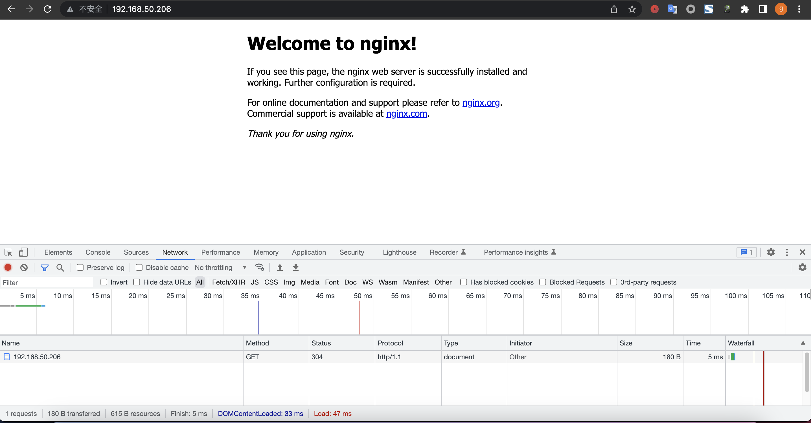
## 1.3 查看elasticsearch
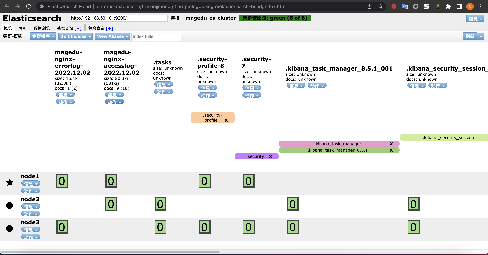
## 1.4 kibana 创建数据视图
* 创建视图

* 查看视图
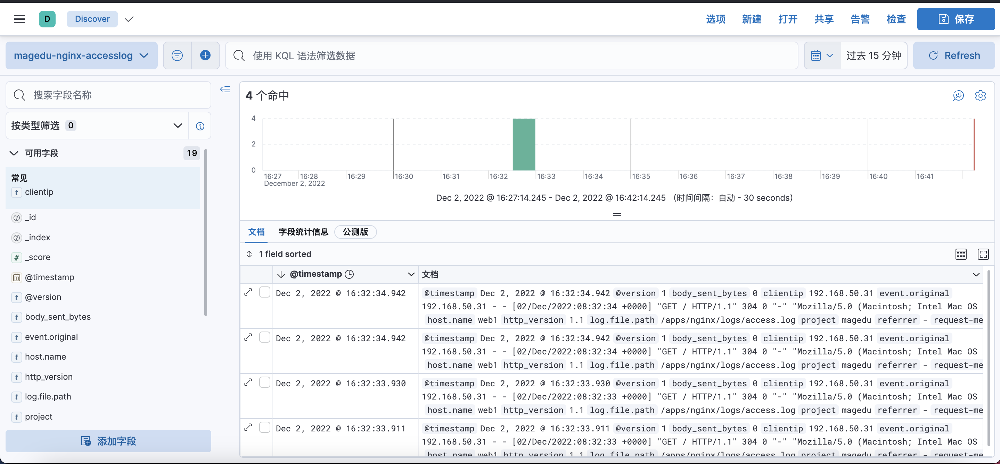
# 2. 基于 logstash 收集 json 格式的 nginx 访问日志
## 2.1 配置nginx json日志格式
```bash
root@web1:/apps/nginx/conf# vi nginx.conf
    log_format access_json '{"@timestamp":"$time_iso8601",'
        '"host":"$server_addr",'
        '"clientip":"$remote_addr",'
        '"size":$body_bytes_sent,'
        '"responsetime":$request_time,'
        '"upstreamtime":"$upstream_response_time",'
        '"upstreamhost":"$upstream_addr",'
        '"http_host":"$host",'
        '"uri":"$uri",'
        '"domain":"$host",'
        '"xff":"$http_x_forwarded_for",'
        '"referer":"$http_referer",'
        '"tcp_xff":"$proxy_protocol_addr",'
        '"http_user_agent":"$http_user_agent",'
        '"status":"$status"}';
    access_log  /var/log/nginx/access.log  access_json;
## 测试配置文件
root@web1:/apps/nginx/conf# /apps/nginx/sbin/nginx -t
nginx: the configuration file /apps/nginx/conf/nginx.conf syntax is ok
nginx: [emerg] open() "/var/log/nginx/access.log" failed (2: No such file or directory)
nginx: configuration file /apps/nginx/conf/nginx.conf test failed
## 提示没有日志目录，创建后再测试
root@web1:/apps/nginx/conf# mkdir /var/log/nginx
root@web1:/apps/nginx/conf# /apps/nginx/sbin/nginx -t
nginx: the configuration file /apps/nginx/conf/nginx.conf syntax is ok
nginx: configuration file /apps/nginx/conf/nginx.conf test is successful
## reload nginx配置
root@web1:/apps/nginx/conf# /apps/nginx/sbin/nginx -s reload
```
## 2.2 logstash配置
```bash
root@web1:~# cd /etc/logstash/conf.d/
input {
  file {
    path => "/var/log/nginx/access.log"
    start_position => "end"
    type => "nginx-json-accesslog"
    stat_interval => "1"
    codec => json
  }
}


output {
  if [type] == "nginx-json-accesslog" {
    elasticsearch {
      hosts => ["192.168.50.101:9200"]
      index => "nginx-accesslog-2.107-%{+YYYY.MM.dd}"
      user => "magedu"
      password => "123456"
  }}
}
## 测试配置文件
root@web1:/etc/logstash/conf.d# /usr/share/logstash/bin/logstash -f /etc/logstash/conf.d/nginx-json-log-to-es.conf -t
[INFO ] 2022-12-02 09:00:44.437 [LogStash::Runner] runner - Using config.test_and_exit mode. Config Validation Result: OK. Exiting Logstash
## 临时启动logsta
root@web1:/etc/logstash/conf.d# /usr/share/logstash/bin/logstash -f /etc/logstash/conf.d/nginx-json-log-to-es.conf
```
## 2.3 浏览器访问nginx
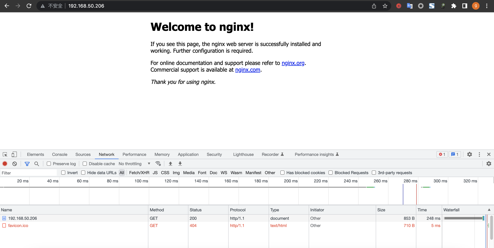

## 2.4 查看elasticsearch索引
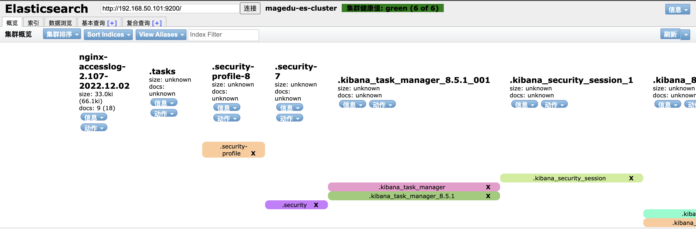
## 2.5 kibana创建视图

## 2.6 查看kibana视图
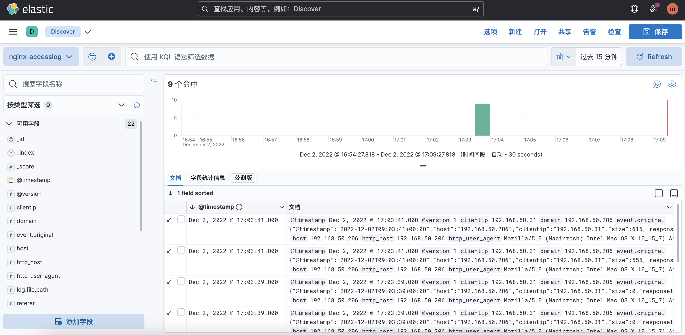
# 3. 基于 logstash 收集 java 日志并实现多行合并
## 3.1 logstash配置
```bash
root@web1:~# cd /etc/logstash/conf.d/
root@web1:/etc/logstash/conf.d# vi es-log-to-es.conf
input {
  file {
    path => "/data/eslogs/magedu-es-cluster1.log"
    type => "eslog"
    stat_interval => "1"
    start_position => "beginning"
    codec => multiline {
      #pattern => "^\["
      pattern => "^\[[0-9]{4}\-[0-9]{2}\-[0-9]{2}"
      negate => "true"
      what => "previous"
    }
  }
}

output {
  if [type] == "eslog" {
    elasticsearch {
      hosts =>  ["192.168.50.101:9200"]
      index => "magedu-eslog-%{+YYYY.ww}"
      user => "magedu"
      password => "123456"
    }}
}
```
## 3.2 测试配置和启动logstash
```bash
root@web1:/etc/logstash/conf.d# /usr/share/logstash/bin/logstash -f /etc/logstash/conf.d/es-log-to-es.conf -t
[INFO ] 2022-12-03 01:56:15.413 [LogStash::Runner] javapipeline - Pipeline `main` is configured with `pipeline.ecs_compatibility: v8` setting. All plugins in this pipeline will default to `ecs_compatibility => v8` unless explicitly configured otherwise.
Configuration OK
[INFO ] 2022-12-03 01:56:15.415 [LogStash::Runner] runner - Using config.test_and_exit mode. Config Validation Result: OK. Exiting Logstash
root@web1:/etc/logstash/conf.d# /usr/share/logstash/bin/logstash -f /etc/logstash/conf.d/es-log-to-es.conf
```
## 3.3 查看elasticsearch索引
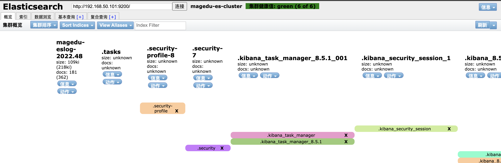
## 3.4 kibana创建视图

## 3.5 查看kibana视图
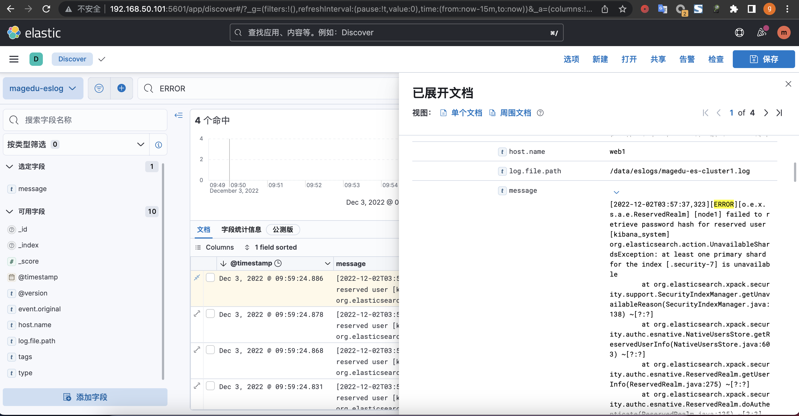  

# 4. 基于 logstash 收集 syslog 类型日志 (以 haproxy 替代网络设备)
## 4.1 配置logstash
```bash
root@web1:~# cd /etc/logstash/conf.d/
input{
  syslog {
    type => "rsyslog-haproxy"
    port => "514"  #监听一个本地的端口
}}

output{
  if [type] == "rsyslog-haproxy" {
    elasticsearch {
      hosts =>  ["192.168.50.101:9200"]
      index => "magedu-rsyslog-haproxy-%{+YYYY.ww}"
      user => "magedu"
      password => "123456"
    }}
}
```
## 测试并启动logstash
```bash
root@web1:/etc/logstash/conf.d# /usr/share/logstash/bin/logstash -f /etc/logstash/conf.d/rsyslog-haproxy-to-es.conf -t
[INFO ] 2022-12-03 02:57:16.038 [LogStash::Runner] javapipeline - Pipeline `main` is configured with `pipeline.ecs_compatibility: v8` setting. All plugins in this pipeline will default to `ecs_compatibility => v8` unless explicitly configured otherwise.
Configuration OK
[INFO ] 2022-12-03 02:57:16.039 [LogStash::Runner] runner - Using config.test_and_exit mode. Config Validation Result: OK. Exiting Logstash
root@web1:/etc/logstash/conf.d# /usr/share/logstash/bin/logstash -f /etc/logstash/conf.d/rsyslog-haproxy-to-es.con
```
## 4.2 安装并配置haproxy
```bash
root@web1:~# apt update && apt install -y haproxy
root@web1:~# vi /etc/haproxy/haproxy.cfg
listen kibana
        bind 0.0.0.0:5601
        log global
        server 192.168.50.101 192.168.50.101:5601 check inter 2s fall 3 rise 3
listen elasticsearch-9200
        bind 0.0.0.0:9200
        log global
        server 192.168.50.102 192.168.50.102:9200 check inter 2s fall 3 rise 3
        server 192.168.50.103 192.168.50.132:9200 check inter 2s fall 3 rise 3
root@web1:~# systemctl restart haproxy.service
root@web1:~# systemctl status haproxy.service
● haproxy.service - HAProxy Load Balancer
     Loaded: loaded (/lib/systemd/system/haproxy.service; enabled; vendor preset: enabled)
     Active: active (running) since Sat 2022-12-03 02:47:15 UTC; 7s ago
       Docs: man:haproxy(1)
             file:/usr/share/doc/haproxy/configuration.txt.gz
    Process: 10084 ExecStartPre=/usr/sbin/haproxy -Ws -f $CONFIG -c -q $EXTRAOPTS (code=exited, status=0/SUCCESS)
   Main PID: 10086 (haproxy)
      Tasks: 3 (limit: 4534)
     Memory: 69.5M
        CPU: 105ms
     CGroup: /system.slice/haproxy.service
             ├─10086 /usr/sbin/haproxy -Ws -f /etc/haproxy/haproxy.cfg -p /run/haproxy.pid -S /run/haproxy-master.sock
             └─10088 /usr/sbin/haproxy -Ws -f /etc/haproxy/haproxy.cfg -p /run/haproxy.pid -S /run/haproxy-master.sock
```
## 4.3 配置syslog
```bash
root@web1:~# vim /etc/rsyslog.d/49-haproxy.conf
# Send HAProxy messages to a dedicated logfile
:programname, startswith, "haproxy" {
#  /var/log/haproxy.log
  @@11.0.1.206:514
  stop
}
root@web1:~# systemctl restart rsyslog.service
root@web1:~# systemctl status rsyslog.service
```
## 4.4 查看elasticsearch索引
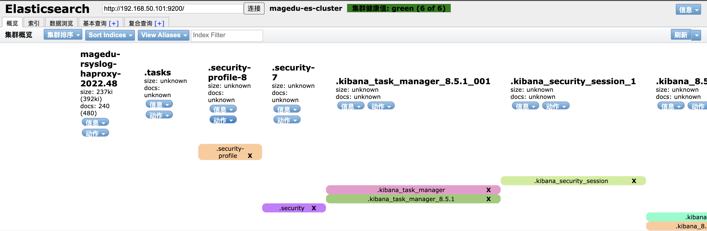
## 4.5 创建kibana视图

## 4.6 查看kibana视图
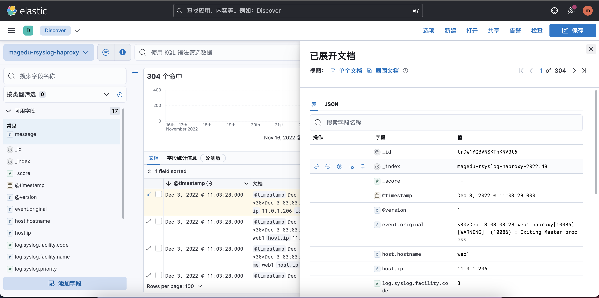
# 5. logstash 收集日志并写入 Redis、再通过其它 logstash 消费至 elasticsearch 并保持 json 格式日志的解析
## 5.1 安装redis
```bash
root@db1:~# apt update &&  apt install redis -y
root@db1:~# vi /etc/redis/redis.conf
bind 11.0.1.105
requirepass 123456
root@db1:~# systemctl restart redis-server.service
```
## 5.2 配置 logstash收集日志到redis
```bash
root@web1:~# vi /etc/logstash/conf.d/magedu-log-to-redis.conf
input {
  file {
    path => "/var/log/nginx/access.log"
    type => "magedu-nginx-accesslog"
    start_position => "beginning"
    stat_interval => "1"
    codec => "json" #对json格式日志进行json解析
  }

  file {
    path => "/apps/nginx/logs/error.log"
    type => "magedu-nginx-errorlog"
    start_position => "beginning"
    stat_interval => "1"
  }
}

filter {
  if [type] == "magedu-nginx-errorlog" {
    grok {
      match => { "message" => ["(?<timestamp>%{YEAR}[./]%{MONTHNUM}[./]%{MONTHDAY} %{TIME}) \[%{LOGLEVEL:loglevel}\] %{POSINT:pid}#%{NUMBER:threadid}\: \*%{NUMBER:connectionid} %{GREEDYDATA:message}, client: %{IPV4:clientip}, server: %{GREEDYDATA:server}, request: \"(?:%{WORD:request-method} %{NOTSPACE:request-uri}(?: HTTP/%{NUMBER:httpversion}))\", host: %{GREEDYDATA:domainname}"]}
      remove_field => "message" #删除源日志
    }
  }
}


output {
  if [type] == "magedu-nginx-accesslog" {
    redis {
      data_type => "list"
      key => "magedu-nginx-accesslog"
      host => "11.0.1.105"
      port => "6379"
      db => "0"
      password => "123456"
    }
  }
  if [type] == "magedu-nginx-errorlog" {
    redis {
      data_type => "list"
      key => "magedu-nginx-errorlog"
      host => "11.0.1.105"
      port => "6379"
      db => "0"
      password => "123456"
    }
  }
}
```
## 5.3 测试并启动logstash写入redis
```bash
root@web1:~# /usr/share/logstash/bin/logstash -f /etc/logstash/conf.d/magedu-log-to-redis.conf -t
[INFO ] 2022-12-03 03:38:18.776 [LogStash::Runner] javapipeline - Pipeline `main` is configured with `pipeline.ecs_compatibility: v8` setting. All plugins in this pipeline will default to `ecs_compatibility => v8` unless explicitly configured otherwise.
Configuration OK
[INFO ] 2022-12-03 03:38:18.777 [LogStash::Runner] runner - Using config.test_and_exit mode. Config Validation Result: OK. Exiting Logstash
root@web1:~# /usr/share/logstash/bin/logstash -f /etc/logstash/conf.d/magedu-log-to-redis.conf
```
## 5.4 redis验证写入
```bash
root@db1:~# redis-cli -h 11.0.1.105 -a 123456
Warning: Using a password with '-a' or '-u' option on the command line interface may not be safe.
11.0.1.105:6379> keys *
(empty array)
11.0.1.105:6379> keys *
1) "magedu-nginx-errorlog"
2) "magedu-nginx-accesslog"
11.0.1.105:6379> rpop magedu-nginx-accesslog
"{\"uri\":\"/favicon.ico\",\"upstreamhost\":\"-\",\"tcp_xff\":\"-\",\"@version\":\"1\",\"event\":{\"original\":\"{\\\"@timestamp\\\":\\\"2022-12-03T03:56:50+00:00\\\",\\\"host\\\":\\\"192.168.50.206\\\",\\\"clientip\\\":\\\"192.168.50.31\\\",\\\"size\\\":555,\\\"responsetime\\\":0.000,\\\"upstreamtime\\\":\\\"-\\\",\\\"upstreamhost\\\":\\\"-\\\",\\\"http_host\\\":\\\"192.168.50.206\\\",\\\"uri\\\":\\\"/favicon.ico\\\",\\\"domain\\\":\\\"192.168.50.206\\\",\\\"xff\\\":\\\"-\\\",\\\"referer\\\":\\\"http://192.168.50.206/\\\",\\\"tcp_xff\\\":\\\"-\\\",\\\"http_user_agent\\\":\\\"Mozilla/5.0 (Macintosh; Intel Mac OS X 10_15_7) AppleWebKit/537.36 (KHTML, like Gecko) Chrome/107.0.0.0 Safari/537.36\\\",\\\"status\\\":\\\"404\\\"}\"},\"clientip\":\"192.168.50.31\",\"host\":\"192.168.50.206\",\"xff\":\"-\",\"referer\":\"http://192.168.50.206/\",\"size\":555,\"responsetime\":0.0,\"domain\":\"192.168.50.206\",\"upstreamtime\":\"-\",\"http_user_agent\":\"Mozilla/5.0 (Macintosh; Intel Mac OS X 10_15_7) AppleWebKit/537.36 (KHTML, like Gecko) Chrome/107.0.0.0 Safari/537.36\",\"http_host\":\"192.168.50.206\",\"status\":\"404\",\"@timestamp\":\"2022-12-03T03:56:50.000Z\",\"log\":{\"file\":{\"path\":\"/var/log/nginx/access.log\"}},\"type\":\"magedu-nginx-accesslog\"}"
```

## 5.5 测试并启动logstash读取redis写入elasticsearch
```bash
root@web1:~# vi /etc/logstash/conf.d/magedu-redis-to-es.conf
input {
  redis {
    data_type => "list"
    key => "magedu-nginx-accesslog"
    host => "11.0.1.105"
    port => "6379"
    db => "0"
    password => "123456"
    codec => "json"  #json解析
  }

  redis {
    data_type => "list"
    key => "magedu-nginx-errorlog"
    host => "11.0.1.105"
    port => "6379"
    db => "0"
    password => "123456"
  }
}

output {
  if [type] == "magedu-nginx-accesslog" {
    elasticsearch {
      hosts => ["192.168.50.101:9200"]
      index => "magedu-redis-nginx-accesslog-%{+YYYY.MM.dd}"
      user => "magedu"
      password => "123456"
    }
  }

  if [type] == "magedu-nginx-errorlog" {
    elasticsearch {
      hosts => ["192.168.50.101:9200"]
      index => "magedu-redis-nginx-errorlog-%{+YYYY.MM.dd}"
      user => "magedu"
      password => "123456"
    }
  }
}
root@web1:~# /usr/share/logstash/bin/logstash -f /etc/logstash/conf.d/magedu-redis-to-es.conf -t
[INFO ] 2022-12-03 04:07:33.467 [LogStash::Runner] javapipeline - Pipeline `main` is configured with `pipeline.ecs_compatibility: v8` setting. All plugins in this pipeline will default to `ecs_compatibility => v8` unless explicitly configured otherwise.
Configuration OK
[INFO ] 2022-12-03 04:07:33.469 [LogStash::Runner] runner - Using config.test_and_exit mode. Config Validation Result: OK. Exiting Logstash
root@web1:~# /usr/share/logstash/bin/logstash -f /etc/logstash/conf.d/magedu-redis-to-es.conf
```
## 5.6 查看elasticsearch索引
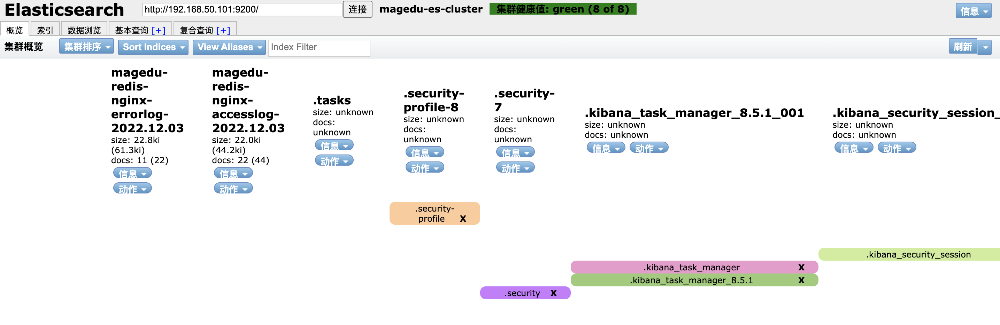
## 5.7 创建kibana视图

## 5.8 查看kibana视图
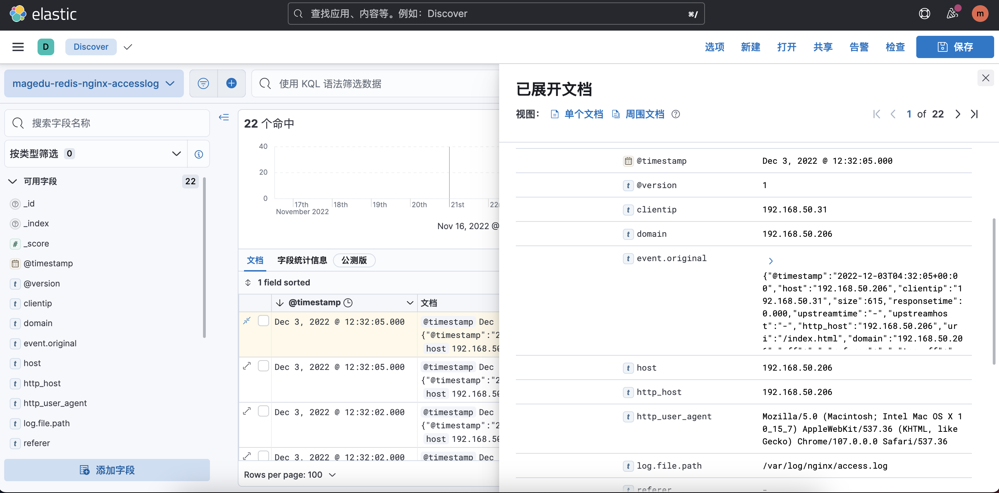
# 6. 基于 docker-compose 部署单机版本 ELK
## 6.1 部署单机版本 ELK
```bash
root@docker1:~# git clone https://gitee.com/jiege-gitee/elk-docker-compose.git
Cloning into 'elk-docker-compose'...
remote: Enumerating objects: 51, done.
remote: Counting objects: 100% (51/51), done.
remote: Compressing objects: 100% (44/44), done.
remote: Total 51 (delta 20), reused 0 (delta 0), pack-reused 0
Receiving objects: 100% (51/51), 576.90 KiB | 321.00 KiB/s, done.
Resolving deltas: 100% (20/20), done.
root@docker1:~# cd elk-docker-compose/
root@docker1:~/elk-docker-compose# docker-compose up -d elasticsearch
root@docker1:~/elk-docker-compose# docker exec -it elasticsearch /usr/share/elasticsearch/bin/elasticsearch-setup-passwords interactive
Initiating the setup of passwords for reserved users elastic,apm_system,kibana,kibana_system,logstash_system,beats_system,remote_monitoring_user.
You will be prompted to enter passwords as the process progresses.
Please confirm that you would like to continue [y/N]y


Enter password for [elastic]:
Reenter password for [elastic]:
Enter password for [apm_system]:
Reenter password for [apm_system]:
Enter password for [kibana_system]:
Reenter password for [kibana_system]:
Enter password for [logstash_system]:
Reenter password for [logstash_system]:
Enter password for [beats_system]:
Reenter password for [beats_system]:
Enter password for [remote_monitoring_user]:
Reenter password for [remote_monitoring_user]:
Changed password for user [apm_system]
Changed password for user [kibana_system]
Changed password for user [kibana]
Changed password for user [logstash_system]
Changed password for user [beats_system]
Changed password for user [remote_monitoring_user]
Changed password for user [elastic]
root@docker1:~/elk-docker-compose#  vi kibana/config/kibana.yml
server.name: kibana
server.host: "0"
elasticsearch.hosts: [ "http://elasticsearch:9200" ]
elasticsearch.username: "kibana_system"
elasticsearch.password: "magedu123"
xpack.monitoring.ui.container.elasticsearch.enabled: true
i18n.locale: "zh-CN"
root@docker1:~/elk-docker-compose# vi logstash/config/logstash.conf
input {
  beats {
    codec => "json"
    port => 5044
    type => "beats-log"
  }

  tcp {
    port => 9889
    type => "magedu-tcplog"
    mode => "server"
  }
}


output {
  if [type] == "beats-log" {
    elasticsearch {
      hosts => ["elasticsearch:9200"]
      index => "%{type}-%{+YYYY.MM.dd}"
      user => "elastic"
      password => "magedu123"
    }}
  if [type] == "magedu-tcplog" {
    elasticsearch {
      hosts => ["elasticsearch:9200"]
      index => "%{type}-%{+YYYY.MM.dd}"
      user => "elastic"
      password => "magedu123"
  }}
}
root@docker1:~/elk-docker-compose# vi logstash/config/logstash.conf
input {
  beats {
    codec => "json"
    port => 5044
    type => "beats-log"
  }

  tcp {
    port => 9889
    type => "magedu-tcplog"
    mode => "server"
  }
}


output {
  if [type] == "beats-log" {
    elasticsearch {
      hosts => ["elasticsearch:9200"]
      index => "%{type}-%{+YYYY.MM.dd}"
      user => "elastic"
      password => "magedu123"
    }}
  if [type] == "magedu-tcplog" {
    elasticsearch {
      hosts => ["elasticsearch:9200"]
      index => "%{type}-%{+YYYY.MM.dd}"
      user => "elastic"
      password => "magedu123"
  }}
}
root@docker1:~/elk-docker-compose# docker-compose up -d
```
## 6.2 查看elasticsearch索引
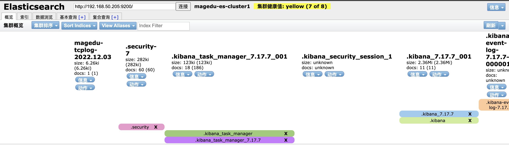
## 6.3 创建kibana视图
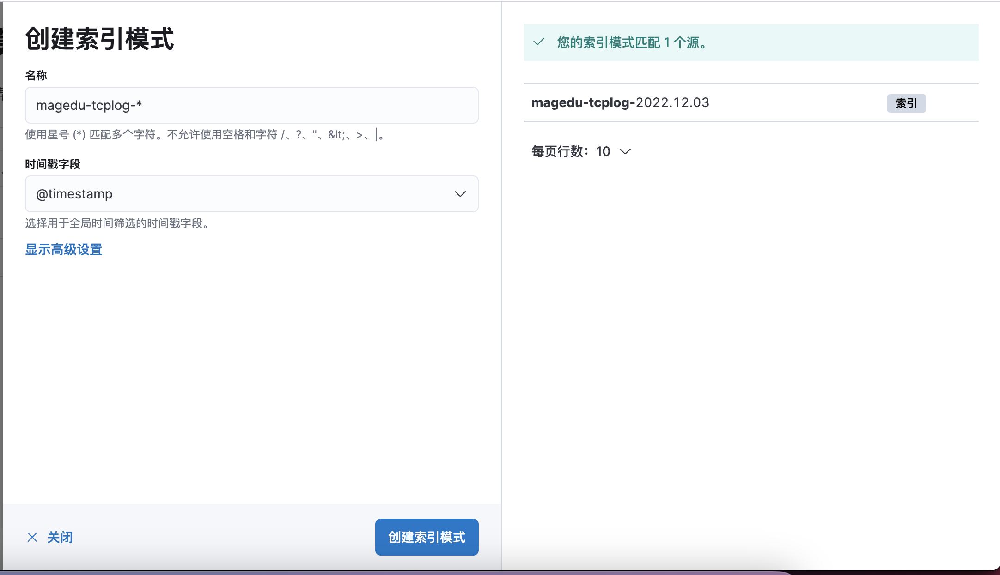
## 6.4 查看kibana视图
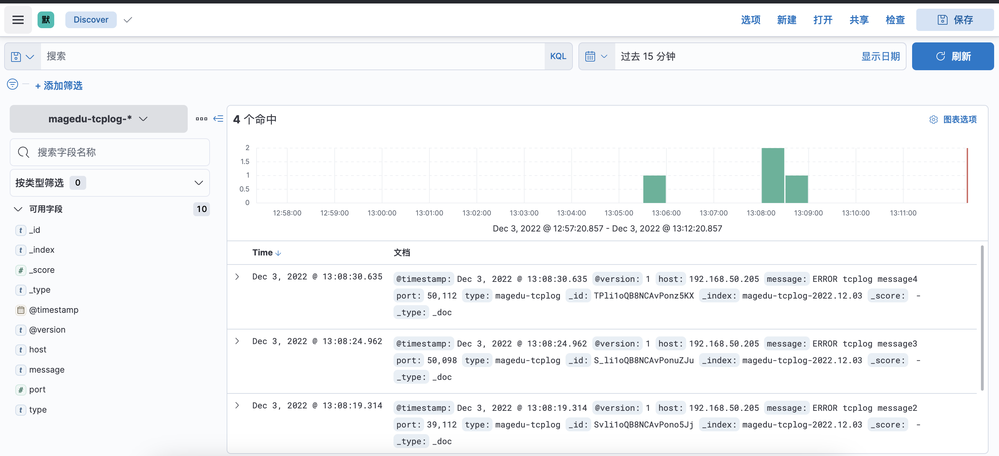

# 7. 扩展
## 7.1 大型的日志收集案例: filebeat–>logstash–>Redis<–logstash–>elasticsearch
### 7.1.1 部署并配置filebeat
```bash
root@web1:~# cd /usr/local/src
root@web1:/usr/local/src# dpkg -i filebeat-8.5.1-amd64.deb
root@web1:~# grep -v "#" /etc/filebeat/filebeat.yml
filebeat.inputs:

- type: filestream

  id: magedu-app1

  enabled: true

  paths:
    - /apps/nginx/logs/error.log

  fields:
    project: magedu
    type: magedu-app1-errorlog

- type: filestream
  id: magedu-app1
  enabled: true
  paths:
    - /var/log/nginx/access.log
  fields:
    project: magedu
    type: magedu-app1-accesslog
    
filebeat.config.modules:
  path: ${path.config}/modules.d/*.yml

  reload.enabled: false

setup.template.settings:
  index.number_of_shards: 1
  
setup.kibana:

output.logstash:
  enabled: true
  hosts: ["11.0.1.206:5044"]
  loadbalance: true
  worker: 1
  compression_level: 3

processors:
  - add_host_metadata:
      when.not.contains.tags: forwarded
  - add_cloud_metadata: ~
  - add_docker_metadata: ~
  - add_kubernetes_metadata: ~
root@web1:~# systemctl restart filebeat
root@web1:~# systemctl status filebeat
```
### 7.1.2 配置logstash
```bash
root@web1:~# vi /etc/logstash/conf.d/beats-magedu-to-redis.conf
input {
  beats {
    port => 5044
    codec => "json"
  }
}


output {
  if [fields][type] == "magedu-app1-accesslog" {
  redis {
    host => "11.0.1.105"
    password => "123456"
    port => "6379"
    db => "0"
    key => "magedu-app1-accesslog"
    data_type => "list"
   }
  }
  if [fields][type] == "magedu-app1-errorlog" {
  redis {
    host => "11.0.1.105"
    password => "123456"
    port => "6379"
    db => "0"
    key => "magedu-app1-errorlog"
    data_type => "list"
     }
  }
}
root@web1:~# /usr/share/logstash/bin/logstash -f /etc/logstash/conf.d/beats-magedu-to-redis.conf -t
[INFO ] 2022-12-03 05:53:28.562 [LogStash::Runner] javapipeline - Pipeline `main` is configured with `pipeline.ecs_compatibility: v8` setting. All plugins in this pipeline will default to `ecs_compatibility => v8` unless explicitly configured otherwise.
Configuration OK
[INFO ] 2022-12-03 05:53:28.563 [LogStash::Runner] runner - Using config.test_and_exit mode. Config Validation Result: OK. Exiting Logstash
```
### 7.1.3 验证写入redis是否成功
```bash
root@db1:~# redis-cli -h 11.0.1.105 -a 123456
Warning: Using a password with '-a' or '-u' option on the command line interface may not be safe.
11.0.1.105:6379> keys *
(empty array)
11.0.1.105:6379> keys *
1) "magedu-app1-errorlog"
2) "magedu-app1-accesslog"
11.0.1.105:6379> lpop magedu-app1-accesslog
"{\"upstreamhost\":\"-\",\"tags\":[\"beats_input_codec_json_applied\"],\"@timestamp\":\"2022-12-03T05:47:23.936Z\",\"@version\":\"1\",\"fields\":{\"type\":\"magedu-app1-accesslog\",\"project\":\"magedu\"},\"tcp_xff\":\"-\",\"clientip\":\"192.168.50.31\",\"referer\":\"-\",\"agent\":{\"version\":\"8.5.1\",\"type\":\"filebeat\",\"id\":\"5c090289-d20e-4bbe-92cb-a0bd6755e7f7\",\"ephemeral_id\":\"b18e9cc6-1911-4d5a-8da4-486aca106787\",\"name\":\"web1\"},\"upstreamtime\":\"-\",\"ecs\":{\"version\":\"8.0.0\"},\"uri\":\"/index.html\",\"xff\":\"-\",\"host\":{\"ip\":[\"11.0.1.206\",\"fe80::250:56ff:fe31:bc10\",\"192.168.50.206\",\"fe80::250:56ff:fe3b:bee8\",\"172.17.0.1\",\"172.18.0.1\"],\"architecture\":\"x86_64\",\"name\":\"web1\",\"os\":{\"version\":\"22.04.1 LTS (Jammy Jellyfish)\",\"platform\":\"ubuntu\",\"family\":\"debian\",\"name\":\"Ubuntu\",\"kernel\":\"5.15.0-53-generic\",\"codename\":\"jammy\",\"type\":\"linux\"},\"mac\":[\"00-50-56-31-BC-10\",\"00-50-56-3B-BE-E8\",\"02-42-04-38-6C-A8\",\"02-42-17-F7-CA-9E\"],\"id\":\"ed7240784df44345a1ffd537e309ff65\",\"hostname\":\"web1\",\"containerized\":false},\"event\":{\"original\":\"{\\\"@timestamp\\\":\\\"2022-12-03T03:56:30+00:00\\\",\\\"host\\\":\\\"192.168.50.206\\\",\\\"clientip\\\":\\\"192.168.50.31\\\",\\\"size\\\":0,\\\"responsetime\\\":0.000,\\\"upstreamtime\\\":\\\"-\\\",\\\"upstreamhost\\\":\\\"-\\\",\\\"http_host\\\":\\\"192.168.50.206\\\",\\\"uri\\\":\\\"/index.html\\\",\\\"domain\\\":\\\"192.168.50.206\\\",\\\"xff\\\":\\\"-\\\",\\\"referer\\\":\\\"-\\\",\\\"tcp_xff\\\":\\\"-\\\",\\\"http_user_agent\\\":\\\"Mozilla/5.0 (Macintosh; Intel Mac OS X 10_15_7) AppleWebKit/537.36 (KHTML, like Gecko) Chrome/107.0.0.0 Safari/537.36\\\",\\\"status\\\":\\\"304\\\"}\"},\"log\":{\"file\":{\"path\":\"/var/log/nginx/access.log\"},\"offset\":0},\"http_user_agent\":\"Mozilla/5.0 (Macintosh; Intel Mac OS X 10_15_7) AppleWebKit/537.36 (KHTML, like Gecko) Chrome/107.0.0.0 Safari/537.36\",\"size\":0,\"domain\":\"192.168.50.206\",\"input\":{\"type\":\"filestream\"},\"responsetime\":0.0,\"status\":\"304\",\"http_host\":\"192.168.50.206\"}"
```
### 7.1.4 配置logstash读取redis日志写入elasticsearch
```bash
root@logstash1:~# vi /etc/logstash/conf.d/magedu-filebeat-redis-to-es.conf
input {
  redis {
    data_type => "list"
    key => "magedu-app1-accesslog"
    host => "11.0.1.105"
    port => "6379"
    db => "0"
    password => "123456"
    codec => "json"  #json解析
  }

  redis {
    data_type => "list"
    key => "magedu-app1-errorlog"
    host => "11.0.1.105"
    port => "6379"
    db => "0"
    password => "123456"
  }
}

output {
  if [fields][type] == "magedu-app1-accesslog" {
    elasticsearch {
      hosts => ["192.168.50.101:9200"]
      index => "magedu-app1-accesslog-%{+YYYY.MM.dd}"
      user => "magedu"
      password => "123456"
    }
  }

  if [fields][type] == "magedu-app1-errorlog" {
    elasticsearch {
      hosts => ["192.168.50.101:9200"]
      index => "magedu-app1-errorlog-%{+YYYY.MM.dd}"
      user => "magedu"
      password => "123456"
    }
  }
}
root@logstash1:~# /usr/share/logstash/bin/logstash -f /etc/logstash/conf.d/magedu-filebeat-redis-to-es.conf -t
[INFO ] 2022-12-03 06:03:04.423 [LogStash::Runner] javapipeline - Pipeline `main` is configured with `pipeline.ecs_compatibility: v8` setting. All plugins in this pipeline will default to `ecs_compatibility => v8` unless explicitly configured otherwise.
Configuration OK
[INFO ] 2022-12-03 06:03:04.424 [LogStash::Runner] runner - Using config.test_and_exit mode. Config Validation Result: OK. Exiting Logstash
root@logstash1:~# /usr/share/logstash/bin/logstash -f /etc/logstash/conf.d/magedu-filebeat-redis-to-es.conf
```
### 7.1.5 查看elasticsearch索引
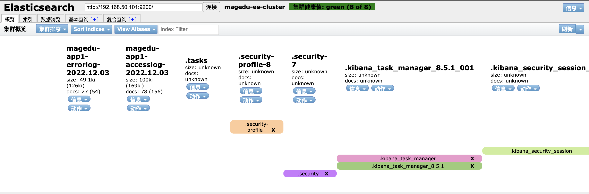
### 7.1.6 创建kibana视图

### 7.1.7 查看kibana视图

## 7.2 日志写入数据库
### 7.2.1 安装配置数据库
```bash
root@db1:~# apt install mariadb-server
root@db1:~# vi /etc/mysql/mariadb.conf.d/50-server.cnf
bind-address            = 0.0.0.0
root@db1:~# systemctl restart mariadb.service
root@db1:~# mysql
Welcome to the MariaDB monitor.  Commands end with ; or \g.
Your MariaDB connection id is 31
Server version: 10.6.11-MariaDB-0ubuntu0.22.04.1 Ubuntu 22.04

Copyright (c) 2000, 2018, Oracle, MariaDB Corporation Ab and others.

Type 'help;' or '\h' for help. Type '\c' to clear the current input statement.

MariaDB [(none)]> create database elk character set utf8 collate utf8_bin;
Query OK, 1 row affected (0.000 sec)

MariaDB [(none)]> grant all privileges on elk.* to elk@"%" identified by '123456';
Query OK, 0 rows affected (0.001 sec)

MariaDB [(none)]> flush privileges;
Query OK, 0 rows affected (0.001 sec)

MariaDB [(none)]> exit
Bye
root@db1:~# mysql -uelk -p123456 -h192.168.50.105
```
### 7.2.2 安装logstash-output-jdbc插件
```bash
root@logstash1:~# /usr/share/logstash/bin/logstash-plugin install logstash-output-jdbc
Using bundled JDK: /usr/share/logstash/jdk
Validating logstash-output-jdbc
Resolving mixin dependencies
Installing logstash-output-jdbc
Installation successful
root@logstash1:~# /usr/share/logstash/bin/logstash-plugin list | grep jdbc
logstash-integration-jdbc
 ├── logstash-input-jdbc
 ├── logstash-filter-jdbc_streaming
 └── logstash-filter-jdbc_static
logstash-output-jdbc
```
### 7.2.3 配置mysql-connector-java
```bash
root@logstash1:~# dpkg -i  mysql-connector-j_8.0.31-1ubuntu22.04_all.deb
Selecting previously unselected package mysql-connector-j.
(Reading database ... 123236 files and directories currently installed.)
Preparing to unpack mysql-connector-j_8.0.31-1ubuntu22.04_all.deb ...
Unpacking mysql-connector-j (8.0.31-1ubuntu22.04) ...
Setting up mysql-connector-j (8.0.31-1ubuntu22.04) ...
root@logstash1:~# mkdir -pv /usr/share/logstash/vendor/jar/jdbc
mkdir: created directory '/usr/share/logstash/vendor/jar'
mkdir: created directory '/usr/share/logstash/vendor/jar/jdbc'
root@logstash1:~# cp /usr/share/java/mysql-connector-j-8.0.31.jar /usr/share/logstash/vendor/jar/jdbc/
root@logstash1:~# chown logstash.logstash /usr/share/logstash/vendor/jar/ -R
root@logstash1:~# systemctl restart logstash
```
### 7.2.4 创建mysql elklog表
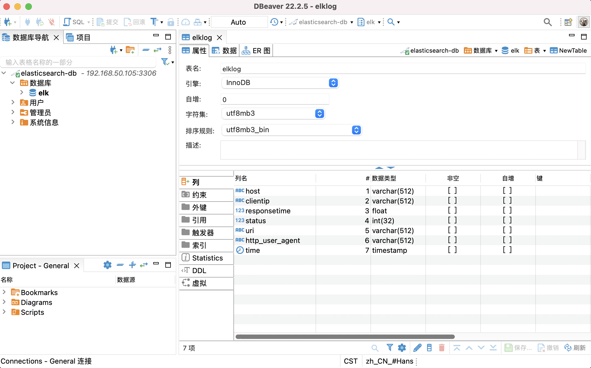
### 配置logstash写入mysql和elasticsearch
```bash
root@logstash1:~# vi /etc/logstash/conf.d/magedu-filebeat-redis-to-mysql-es.conf
input {
  redis {
    data_type => "list"
    key => "magedu-app1-accesslog"
    host => "11.0.1.105"
    port => "6379"
    db => "0"
    password => "123456"
    codec => "json"  #json解析
  }

  redis {
    data_type => "list"
    key => "magedu-app1-errorlog"
    host => "11.0.1.105"
    port => "6379"
    db => "0"
    password => "123456"
  }
}

output {
  if [fields][type] == "magedu-app1-accesslog" {
    elasticsearch {
      hosts => ["192.168.50.101:9200"]
      index => "magedu-app1-accesslog-%{+YYYY.MM.dd}"
      user => "magedu"
      password => "123456"
    }
    jdbc {
   connection_string => "jdbc:mysql://11.0.1.105/elk?user=elk&password=123456&useUnicode=true&characterEncoding=UTF8"
   statement => ["INSERT INTO elklog(host,clientip,responsetime,status,uri,http_user_agent) VALUES(?,?,?,?,?,?)", "host","clientip","responsetime","status","uri","http_user_agent"]
      }
    }

  if [fields][type] == "magedu-app1-errorlog" {
    elasticsearch {
      hosts => ["192.168.50.101:9200"]
      index => "magedu-app1-errorlog-%{+YYYY.MM.dd}"
      user => "magedu"
      password => "123456"
    }
  }
}
root@logstash1:~# /usr/share/logstash/bin/logstash -f /etc/logstash/conf.d/magedu-filebeat-redis-to-mysql-es.conf -t
[INFO ] 2022-12-03 08:53:33.102 [LogStash::Runner] javapipeline - Pipeline `main` is configured with `pipeline.ecs_compatibility: v8` setting. All plugins in this pipeline will default to `ecs_compatibility => v8` unless explicitly configured otherwise.
Configuration OK
[INFO ] 2022-12-03 08:53:33.108 [LogStash::Runner] runner - Using config.test_and_exit mode. Config Validation Result: OK. Exiting Logstash
```
### 7.2.5 查看elasticsearch索引
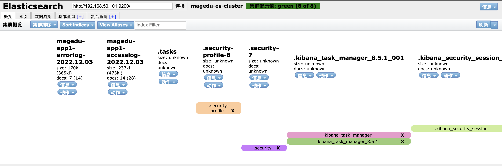
### 7.2.6 查看mysql elklog表的数据
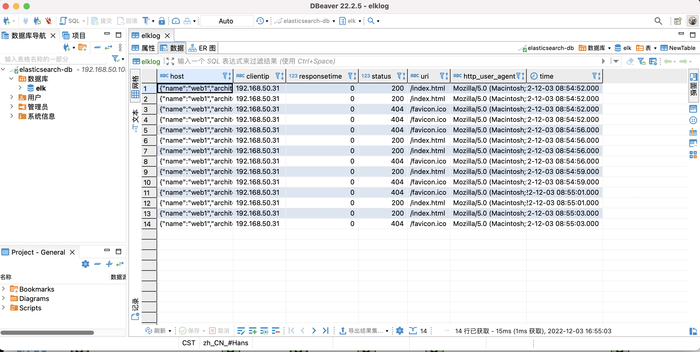
## 7.3 地图显示客户端 IP 城市
### 7.3.1 安装logstash 7.12.1
```bash
root@logstash2:~# cd /usr/local/src/
root@logstash2:/usr/local/src# ls
logstash-7.12.1-amd64.deb
root@logstash2:/usr/local/src# dpkg -i logstash-7.12.1-amd64.deb
```
### 7.3.2 配置logstash
```bash
root@logstash2:~# cd /etc/logstash/
root@logstash2:/etc/logstash# tar -xzvf GeoLite2-City_20221122.tar.gz
root@logstash2:~# vi /etc/logstash/conf.d/magedu-filebeat-redis-to-mysql-es.conf
input {
  redis {
    data_type => "list"
    key => "magedu-app1-accesslog"
    host => "11.0.1.105"
    port => "6379"
    db => "0"
    password => "123456"
    codec => "json"  #json解析
  }

  redis {
    data_type => "list"
    key => "magedu-app1-errorlog"
    host => "11.0.1.105"
    port => "6379"
    db => "0"
    password => "123456"
  }
}


filter {
  if [fields][type] == "magedu-app1-accesslog"   {
    geoip {
      source => "clientip"
      target => "geoip"
      database => "/etc/logstash/GeoLite2-City_20221122/GeoLite2-City.mmdb"
      add_field => [ "[geoip][coordinates]", "%{[geoip][longitude]}" ]
      add_field => [ "[geoip][coordinates]", "%{[geoip][latitude]}"  ]
    }
    mutate {
    convert => [ "[geoip][coordinates]", "float"]
   }
 }
}

output {
  if [fields][type] == "magedu-app1-accesslog" {
    elasticsearch {
      hosts => ["192.168.50.101:9200"]
      index => "logstash-magedu-accesslog-%{+YYYY.MM.dd}"
      user => "magedu"
      password => "123456"
    }
  }

  if [fields][type] == "magedu-app1-errorlog" {
    elasticsearch {
      hosts => ["192.168.50.101:9200"]
      index => "magedu-app1-errorlog-%{+YYYY.MM.dd}"
      user => "magedu"
      password => "123456"
    }
  }
}
root@logstash2:~# /usr/share/logstash/bin/logstash -f /etc/logstash/conf.d/magedu-filebeat-redis-to-mysql-es.conf -t
[WARN ] 2022-12-03 09:15:47.326 [LogStash::Runner] elasticsearch - Relying on default value of `pipeline.ecs_compatibility`, which may change in a future major release of Logstash. To avoid unexpected changes when upgrading Logstash, please explicitly declare your desired ECS Compatibility mode.
Configuration OK
[INFO ] 2022-12-03 09:15:47.334 [LogStash::Runner] runner - Using config.test_and_exit mode. Config Validation Result: OK. Exiting Logstash
root@logstash2:~# /usr/share/logstash/bin/logstash -f /etc/logstash/conf.d/magedu-filebeat-redis-to-mysql-es.conf
```
### 7.3.3 导入数据
```bash
root@web1:/var/log/nginx# unzip blog-nginx_access.log.zip
Archive:  blog-nginx_access.log.zip
  inflating: blog-nginx_access.log
root@web1:/var/log/nginx# cat blog-nginx_access.log >> access.log
```
### 7.3.4 查看elasticsearch索引
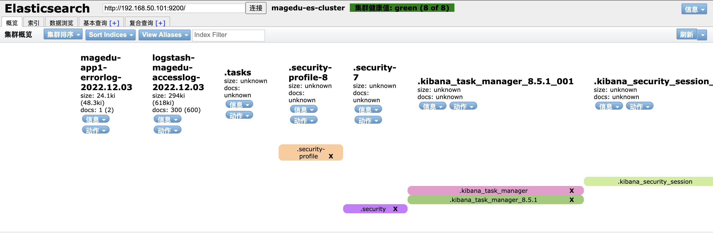
### 7.3.5 创建kibana视图

### 7.3.6 创建kibana map图形
* visualize library-->新建可视化-->Maps-->添加图层-->文档-->logstash-magedu-accesslog-->添加图层-->保存并关闭
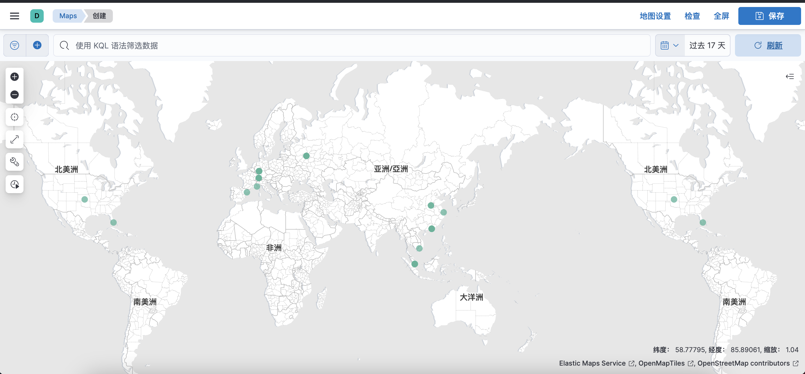
## 7.4 logstash 收集 TCP 日志
### 7.4.1 配置logstash
```bash
root@web1:~# vi /etc/logstash/conf.d/tcp-log-to-es.conf
input {
  tcp {
    port => 9889
    type => "magedu-tcplog"
    mode => "server"
  }
}


output {
  if [type] == "magedu-tcplog" {
    elasticsearch {
      hosts => ["192.168.50.101:9200"]
      index => "magedu-tcplog-%{+YYYY.MM.dd}"
      user => "magedu"
      password => "123456"
  }}
}
```
### 7.4.2 测试配置并启动
```bash
root@web1:~# /usr/share/logstash/bin/logstash -f /etc/logstash/conf.d/tcp-log-to-es.conf -t
[INFO ] 2022-12-03 09:30:56.270 [LogStash::Runner] javapipeline - Pipeline `main` is configured with `pipeline.ecs_compatibility: v8` setting. All plugins in this pipeline will default to `ecs_compatibility => v8` unless explicitly configured otherwise.
Configuration OK
[INFO ] 2022-12-03 09:30:56.272 [LogStash::Runner] runner - Using config.test_and_exit mode. Config Validation Result: OK. Exiting Logstash
root@web1:~# /usr/share/logstash/bin/logstash -f /etc/logstash/conf.d/tcp-log-to-es.conf
```
### 7.4.3 向logsatsh发送日志
```bash

root@web1:~# echo "ERROR tcplog message1" > /dev/tcp/192.168.50.206/9889
root@web1:~# echo "nc test" | nc 192.168.50.206 9889
root@web1:~#  nc 192.168.50.206 9889 < /etc/passwd
root@web1:~# nc 192.168.50.206 9889 < /var/log/nginx/access.log
```
### 7.4.4 查看elasticsearch索引
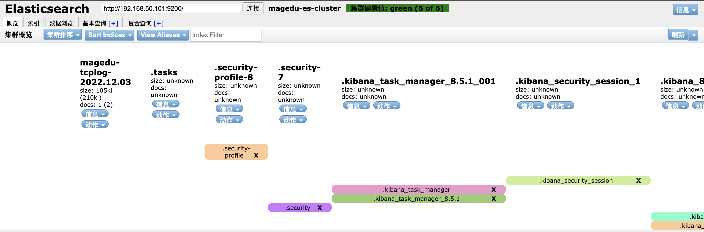
### 7.4.5 创建kibana视图

### 7.4.6 查看kibana视图
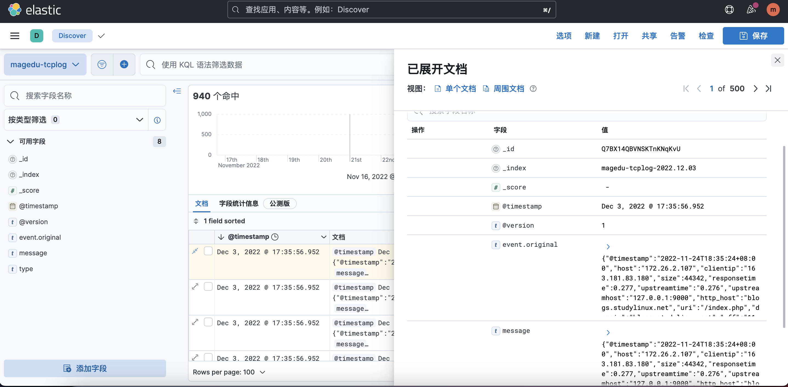