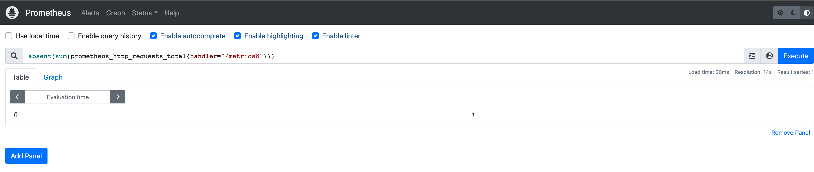
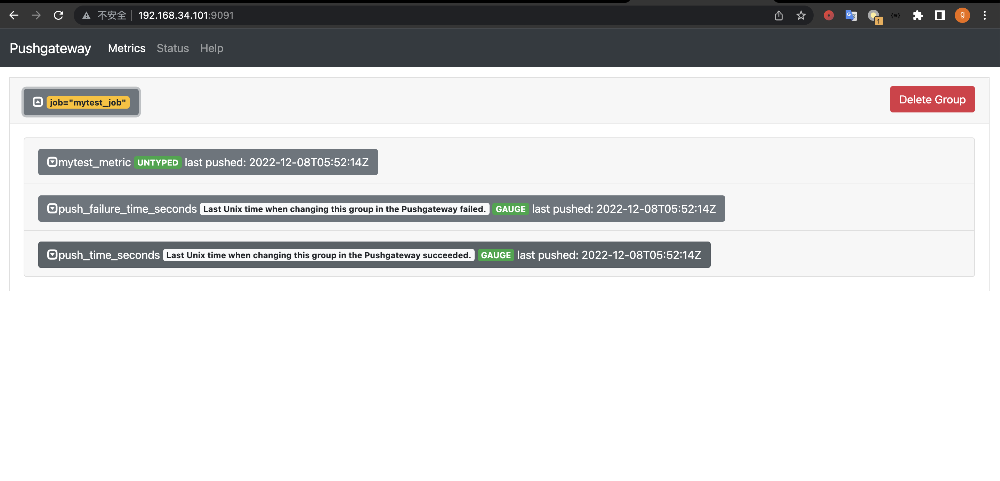

# 1. 了解prometheus各组件的功能，熟悉prometheus的数据采集流程

# 2. 基于docker或二进制部署prometheus server 
```bash
root@prometheus-server1:~# tar -xzvf prometheus-server-2.40.5-onekey-install.tar.gz
root@prometheus-server1:~# ./prometheus-install.sh
root@prometheus-server1:~# systemctl status prometheus
● prometheus.service - Prometheus Server
     Loaded: loaded (/etc/systemd/system/prometheus.service; enabled; vendor preset: enabled)
     Active: active (running) since Wed 2022-12-07 06:57:46 UTC; 5min ago
       Docs: https://prometheus.io/docs/introduction/overview/
   Main PID: 2328 (prometheus)
      Tasks: 9 (limit: 4662)
     Memory: 28.7M
        CPU: 284ms
     CGroup: /system.slice/prometheus.service
             └─2328 /apps/prometheus/prometheus --config.file=/apps/prometheus/prometheus.yml --web.enable-lifecycle

Dec 07 06:57:46 prometheus-server1 prometheus[2328]: ts=2022-12-07T06:57:46.495Z caller=head.go:606 level=info component=tsdb msg="On-disk memory mappable chunks replay completed" duration>
Dec 07 06:57:46 prometheus-server1 prometheus[2328]: ts=2022-12-07T06:57:46.495Z caller=head.go:612 level=info component=tsdb msg="Replaying WAL, this may take a while"
Dec 07 06:57:46 prometheus-server1 prometheus[2328]: ts=2022-12-07T06:57:46.495Z caller=head.go:683 level=info component=tsdb msg="WAL segment loaded" segment=0 maxSegment=0
Dec 07 06:57:46 prometheus-server1 prometheus[2328]: ts=2022-12-07T06:57:46.495Z caller=head.go:720 level=info component=tsdb msg="WAL replay completed" checkpoint_replay_duration=36.635µs>
Dec 07 06:57:46 prometheus-server1 prometheus[2328]: ts=2022-12-07T06:57:46.496Z caller=main.go:1014 level=info fs_type=EXT4_SUPER_MAGIC
Dec 07 06:57:46 prometheus-server1 prometheus[2328]: ts=2022-12-07T06:57:46.496Z caller=main.go:1017 level=info msg="TSDB started"
Dec 07 06:57:46 prometheus-server1 prometheus[2328]: ts=2022-12-07T06:57:46.497Z caller=main.go:1197 level=info msg="Loading configuration file" filename=/apps/prometheus/prometheus.yml
Dec 07 06:57:46 prometheus-server1 prometheus[2328]: ts=2022-12-07T06:57:46.497Z caller=main.go:1234 level=info msg="Completed loading of configuration file" filename=/apps/prometheus/prom>
Dec 07 06:57:46 prometheus-server1 prometheus[2328]: ts=2022-12-07T06:57:46.497Z caller=main.go:978 level=info msg="Server is ready to receive web requests."
Dec 07 06:57:46 prometheus-server1 prometheus[2328]: ts=2022-12-07T06:57:46.497Z caller=manager.go:944 level=info component="rule manager" msg="Starting rule manager..."
lines 1-21/21 (END)
root@prometheus-server1:~# netstat -tulnp | grep 9090
tcp6       0      0 :::9090                 :::*                    LISTEN      2328/prometheus
```
* 浏览器查看prometheus状态

# 3. 基于docker或二进制部署node-exporter，并通过prometheus收集node-exporter指标数据
## 3.1 安装和配置node-exporter
```bash
root@prometheus-node1:~# tar -xzvf node-exporter-1.5.0-onekey-install.tar.gz
root@prometheus-node1:~# bash node-exporter-1.5.0-onekey-install.sh
root@prometheus-node1:~# systemctl status node-exporter
● node-exporter.service - Prometheus Node Exporter
     Loaded: loaded (/etc/systemd/system/node-exporter.service; enabled; vendor preset: enabled)
     Active: active (running) since Wed 2022-12-07 07:22:40 UTC; 19s ago
   Main PID: 2339 (node_exporter)
      Tasks: 4 (limit: 2376)
     Memory: 2.6M
        CPU: 7ms
     CGroup: /system.slice/node-exporter.service
             └─2339 /apps/node_exporter/node_exporter

Dec 07 07:22:40 prometheus-node1 node_exporter[2339]: ts=2022-12-07T07:22:40.138Z caller=node_exporter.go:117 level=info collector=thermal_zone
Dec 07 07:22:40 prometheus-node1 node_exporter[2339]: ts=2022-12-07T07:22:40.138Z caller=node_exporter.go:117 level=info collector=time
Dec 07 07:22:40 prometheus-node1 node_exporter[2339]: ts=2022-12-07T07:22:40.138Z caller=node_exporter.go:117 level=info collector=timex
Dec 07 07:22:40 prometheus-node1 node_exporter[2339]: ts=2022-12-07T07:22:40.138Z caller=node_exporter.go:117 level=info collector=udp_queues
Dec 07 07:22:40 prometheus-node1 node_exporter[2339]: ts=2022-12-07T07:22:40.138Z caller=node_exporter.go:117 level=info collector=uname
Dec 07 07:22:40 prometheus-node1 node_exporter[2339]: ts=2022-12-07T07:22:40.138Z caller=node_exporter.go:117 level=info collector=vmstat
Dec 07 07:22:40 prometheus-node1 node_exporter[2339]: ts=2022-12-07T07:22:40.139Z caller=node_exporter.go:117 level=info collector=xfs
Dec 07 07:22:40 prometheus-node1 node_exporter[2339]: ts=2022-12-07T07:22:40.139Z caller=node_exporter.go:117 level=info collector=zfs
Dec 07 07:22:40 prometheus-node1 node_exporter[2339]: ts=2022-12-07T07:22:40.139Z caller=tls_config.go:232 level=info msg="Listening on" address=[::]:9100
Dec 07 07:22:40 prometheus-node1 node_exporter[2339]: ts=2022-12-07T07:22:40.139Z caller=tls_config.go:235 level=info msg="TLS is disabled." http2=false address=[::]:9100
root@prometheus-node1:~# netstat -tulnp | grep 9100
tcp6       0      0 :::9100                 :::*                    LISTEN      2339/node_exporter
```
* 登录浏览器查看metrics

## 3.2 prometheus 采集node-exporter监控数据
```bash
root@prometheus-server1:~# vi /apps/prometheus/prometheus.yml
  - job_name: "node-exporter"
    static_configs:
      - targets: ["192.168.34.101:9100"]
root@prometheus-server1:~# curl -lvs -X POST "http://localhost:9090/-/reload"
*   Trying 127.0.0.1:9090...
* Connected to localhost (127.0.0.1) port 9090 (#0)
> POST /-/reload HTTP/1.1
> Host: localhost:9090
> User-Agent: curl/7.81.0
> Accept: */*
>
* Mark bundle as not supporting multiuse
< HTTP/1.1 200 OK
< Date: Wed, 07 Dec 2022 08:44:03 GMT
< Content-Length: 0
<
* Connection #0 to host localhost left intact
```
* 查看prometheus target

# 4. 安装grafana并添加prometheus数据源，导入模板可以图形显示指标数据
## 4.1 安装和配置grafana
```bash
root@prometheus-server1:~# cd /apps/
root@prometheus-server1:/apps# ln -vs grafana-9.3.1 grafana
tar -xzvf ~/grafana-enterprise-9.3.1.linux-amd64.tar.gz
root@prometheus-server1:/apps# vi grafana/conf/defaults.ini
http_addr = 0.0.0.0
root@prometheus-server1:/apps/grafana# vi /etc/systemd/system/grafana-server.service
[Unit]
Description=Grafana Server
After=network.target

[Service]
ExecStart=/apps/grafana/bin/grafana-server -homepath=/apps/grafana
ExecReload=/bin/kill -HUP $MAINPID
KillMode=process
Restart=on-failure

[Install]
WantedBy=multi-user.target
root@prometheus-server1:/apps/grafana# systemctl daemon-reload
root@prometheus-server1:/apps/grafana# systemctl start grafana-server
root@prometheus-server1:/apps/grafana# systemctl status grafana-server
● grafana-server.service - Grafana Server
     Loaded: loaded (/etc/systemd/system/grafana-server.service; disabled; vendor preset: enabled)
     Active: active (running) since Wed 2022-12-07 08:33:22 UTC; 6s ago
   Main PID: 2643 (grafana-server)
      Tasks: 8 (limit: 4662)
     Memory: 48.2M
        CPU: 816ms
     CGroup: /system.slice/grafana-server.service
             └─2643 /apps/grafana/bin/grafana-server -homepath=/apps/grafana

Dec 07 08:33:23 prometheus-server1 grafana-server[2643]: logger=provisioning.alerting t=2022-12-07T08:33:23.94924704Z level=info msg="starting to provision alerting"
Dec 07 08:33:23 prometheus-server1 grafana-server[2643]: logger=provisioning.alerting t=2022-12-07T08:33:23.949270327Z level=info msg="finished to provision alerting"
Dec 07 08:33:23 prometheus-server1 grafana-server[2643]: logger=ngalert.state.manager t=2022-12-07T08:33:23.950317609Z level=info msg="Warming state cache for startup"
Dec 07 08:33:23 prometheus-server1 grafana-server[2643]: logger=http.server t=2022-12-07T08:33:23.953703364Z level=info msg="HTTP Server Listen" address=[::]:3000 protocol=http subUrl= soc>
Dec 07 08:33:23 prometheus-server1 grafana-server[2643]: logger=ngalert.state.manager t=2022-12-07T08:33:23.953881464Z level=info msg="State cache has been initialized" states=0 duration=3>
Dec 07 08:33:23 prometheus-server1 grafana-server[2643]: logger=ticker t=2022-12-07T08:33:23.9540013Z level=info msg=starting first_tick=2022-12-07T08:33:30Z
Dec 07 08:33:23 prometheus-server1 grafana-server[2643]: logger=ngalert.multiorg.alertmanager t=2022-12-07T08:33:23.954080633Z level=info msg="starting MultiOrg Alertmanager"
Dec 07 08:33:23 prometheus-server1 grafana-server[2643]: logger=report t=2022-12-07T08:33:23.957855101Z level=warn msg="Scheduling and sending of reports disabled, SMTP is not configured a>
Dec 07 08:33:23 prometheus-server1 grafana-server[2643]: logger=grafanaStorageLogger t=2022-12-07T08:33:23.961448737Z level=info msg="storage starting"
Dec 07 08:33:23 prometheus-server1 grafana-server[2643]: logger=serviceaccounts.background t=2022-12-07T08:33:23.961781055Z level=warn msg="secret scan interval is too low, increasing to 5>
lines 1-20/20 (END)
```
## 4.2 登录grafana

## 4.3 配置prometheus数据源

## 4.4 导入dashboard模板
* 输入导入模板id

* 修改dashboard名字和数据源

* 通过dashboard查看监控数据


# 5. 掌握prometheus的promQL语句的简单使用
* Prometheus提供一个函数式的表达式语言PromQL (Prometheus Query Language)，可以使用户实时地查找和聚合时间序列数据，表达式计算结果可 以在图表中展示，也可以在Prometheus表达式浏览器中以表格形式展示，或者作为数据源, 以HTTP API的方式提供给外部系统使用
## 5.1 PromQL查询数据类型
  * Instant Vector:瞬时向量/瞬时数据,是对目标实例查询到的同一个时间戳的一组时间序列数据(按照时间的推移对数据进存储和展示)，每个时间序 列包含单个数据样本，比如node_memory_MemFree_bytes查询的是当前剩余内存(可用内存)就是一个瞬时向量，该表达式的返回值中只会包含该 时间序列中的最新的一个样本值，而相应的这样的表达式称之为瞬时向量表达式，以下是查询node节点可用内存的瞬时向量表达式:
```bash
root@prometheus-server1:~# curl -s 'http://localhost:9090/api/v1/query' --data 'query=node_memory_MemFree_bytes' --data time=1670404537 |jq
{
  "status": "success",
  "data": {
    "resultType": "vector",
    "result": [
      {
        "metric": {
          "__name__": "node_memory_MemFree_bytes",
          "instance": "192.168.34.101:9100",
          "job": "node-exporter"
        },
        "value": [
          1670404537,
          "1553833984"
        ]
      }
    ]
  }
}
```
* Range Vector:范围向量/范围数据,是指在任何一个时间范围内，抓取的所有度量指标数据.比如最近一天的网卡流量趋势图、或最近5分钟的node 节点内容可用字节数等，以下是查询node节点可用内存的范围向量表达式:
```bash
root@prometheus-server1:~# curl -s 'http://localhost:9090/api/v1/query' --data 'query=node_memory_MemFree_bytes{instance="192.168.34.101:9100"}[5m]' --data time=1670404537 |jq
{
  "status": "success",
  "data": {
    "resultType": "matrix",
    "result": [
      {
        "metric": {
          "__name__": "node_memory_MemFree_bytes",
          "instance": "192.168.34.101:9100",
          "job": "node-exporter"
        },
        "values": [
          [
            1670404240.944,
            "1554063360"
          ],
          [
            1670404255.952,
            "1554063360"
          ],
          [
            1670404270.954,
            "1554063360"
          ],
          [
            1670404285.949,
            "1553833984"
          ],
          [
            1670404300.989,
            "1553833984"
          ],
          [
            1670404315.944,
            "1553833984"
          ],
          [
            1670404330.944,
            "1553833984"
          ],
          [
            1670404345.954,
            "1553833984"
          ],
          [
            1670404360.982,
            "1553833984"
          ],
          [
            1670404375.949,
            "1553833984"
          ],
          [
            1670404390.944,
            "1553833984"
          ],
          [
            1670404405.944,
            "1553833984"
          ],
          [
            1670404421.064,
            "1553833984"
          ],
          [
            1670404435.951,
            "1553833984"
          ],
          [
            1670404450.953,
            "1553833984"
          ],
          [
            1670404465.977,
            "1553833984"
          ],
          [
            1670404480.944,
            "1553833984"
          ],
          [
            1670404495.987,
            "1553833984"
          ],
          [
            1670404510.947,
            "1553833984"
          ],
          [
            1670404525.957,
            "1553833984"
          ]
        ]
      }
    ]
  }
}
```
* scalar:标量/纯量数据,是一个浮点数类型的数据值，使用node_load1获取到时一个瞬时向量后，在使用prometheus的内置函数scalar()将瞬时向
量转换为标量，例如:scalar(sum(node_load1))
```bash
root@prometheus-server1:~# curl -s 'http://localhost:9090/api/v1/query' --data 'query=scalar(sum(node_load1{instance="192.168.34.101:9100"}))' --data time=1670404530 |jq
{
  "status": "success",
  "data": {
    "resultType": "scalar",
    "result": [
      1670404530,
      "0"
    ]
  }
}
```
* string:简单的字符串类型的数据，目前未使用，(a simple string value; currently unused)

## 5.2 prometheus指标数据类型
* Counter:计数器
* Gauge:仪表盘
* Histogram:累积直方图 
* Summary:摘要
### 5.2.1 Counter
* Counter:计数器,Counter类型代表一个累积的指标数据，在没有被重启的前提下只增不减(生活中的电表、水表)，比如磁盘I/O总数、Nginx/API的请求 总数、网卡流经的报文总数等。

### 5.2.2 Gauge
* Gauge:仪表盘,Gauge类型代表一个可以任意变化的指标数据，值可以随时增高或减少，如带宽速率、CPU负载、内存利用率、nginx 活动连接数等。

### 5.2.3 Histogram
* Histogram:累积直方图，Histogram会在一段时间范围 内对数据进行采样(通常是请求持续时间或响应大小等),假如 每分钟产生一个当前的活跃连接数，那么一天24小时*60分钟 =1440分钟就会产生1440个数据，查看数据的每间隔的绘图 跨度为2小时，那么2点的柱状图(bucket)会包含0点到2点即 两个小时的数据，而4点的柱状图(bucket)则会包含0点到4点 的数据，而6点的柱状图(bucket)则会包含0点到6点的数据， 可用于统计从当天零点开始到当前时间的数据统计结果，如 http请求成功率、丢包率等，比如ELK的当天访问IP统计。

### 5.2.4 Summary
* 摘要图，也是一组数据，默认统计选中的指标的最近10分钟内的数据的分位数，可以指定数据统计时间范围，基于分位数(Quantile),亦称分 位点,是指用分割点(cut point)将随机数据统计并划分为几个具有相同概率的连续区间，常见的为四分位，四分位数是将数据样本统计后分成四个区间，将范 围内的数据进行百分比的占比统计,从0到1，表示是0%~100%，(0%~25%,%25~50%,50%~75%,75%~100%),利用四分位数，可以快速了解数据的大概统计 结果。

## 5.3 node-exporter指标数据格式
* #没有标签的
    * #metric_name metric_value
    * #TYPE node_load15 gauge
    * node_load15 0.1
* #一个标签的
    * #metric_name{label1_name="label1-value"} metric_value
    * #TYPE node_network_receive_bytes_total counter
    * node_network_receive_bytes_total{device="eth0"} 1.44096e+07
* #多个标签的
    * #metric_name{label1_name="label1-value","labelN_name="labelN-value} metric_value
    * #TYPE node_filesystem_files_free gauge
    * node_filesystem_avail_bytes{device="/dev/sda1",fstype="ext4",mountpoint="/"} 4.0002510848e+10
## 5.4 PromQL查询指标数据示例
* node_memory_MemTotal_bytes #查询node节点总内存大小
* node_memory_MemFree_bytes #查询node节点剩余可用内存 
* node_memory_MemTotal_bytes{instance="192.168.34.101:9100"} #基于标签查询指定节点的总内存 
* node_memory_MemFree_bytes{instance="192.168.34.101:9100"} #基于标签查询指定节点的可用内存
* node_disk_io_time_seconds_total{device="sda"} #查询指定磁盘的每秒磁盘io 
* node_filesystem_free_bytes{device="/dev/sda1", fstype="ext4", instance="192.168.34.101:9100", mountpoint="/"} #查看指定磁盘的磁盘剩余空间
## 5.5 PromQl基于标签对指标数据进行匹配
* = :选择与提供的字符串完全相同的标签，精确匹配。
* != :选择与提供的字符串不相同的标签，去反。
* =~ :选择正则表达式与提供的字符串(或子字符串)相匹配的标签。
* !~ :选择正则表达式与提供的字符串(或子字符串)不匹配的标签。
* #查询格式<metric name>{<label name>=<label value>, ...}
* node_load1{job="node-exporter"}
* node_load1{instance="192.168.34.101:9100"}
* node_load1{instance="192.168.34.101:9100",job="node-exporter"} #精确匹配
* node_load1{instance="192.168.34.101:9100",job!="node-exporter"} #取反
* node_load1{instance=~"192.168.34.1.*:9100$"} #包含正则且匹配
* node_load1{instance!~"192.168.34.1.*:9100"}

## 5.6 PromQL语句-时间范围、运算符、聚合运算及示例
### 5.6.1 对指标数据进行时间范围指定
  * s-秒 
  * m - 分钟 
  * h - 小时 
  * d-天 
  * w-周 
  * y-年
  * #瞬时向量表达式，选择当前最新的数据
    * node_memory_MemTotal_bytes{}
  * #区间向量表达式，选择以当前时间为基准，查询所有节点 node_memory_MemTotal_bytes指标5分钟内的数据
    * node_memory_MemTotal_bytes{}[5m]
  * #区间向量表达式，选择以当前时间为基准，查询指定节点
node_memory_MemTotal_bytes指标5分钟内的数据
    * node_memory_MemTotal_bytes{instance="192.168.34.101:9100"} [5m]
### 5.6.2 对指标数据进行数学运算
* \+ 加法
* \- 减法
* \* 乘法
* / 除法 %模
* ^ 幂(N次方)
* node_memory_MemFree_bytes/1024/1024 #将内存进行单位从字节转行为兆
* node_disk_read_bytes_total{device="sda"} + node_disk_written_bytes_total{device="sda"} #计算磁盘读写数据量
* (node_disk_read_bytes_total{device="sda"} + node_disk_written_bytes_total{device="sda"}) / 1024 / 1024 #单位转换
### 5.6.3 对指标数据进行进行聚合运算
* max() #最大值
* min() #最小值
* avg() #平均值
* 计算每个节点的最大的流量值
  * max(node_network_receive_bytes_total) by (instance)
* 计算每个节点最近五分钟每个device的最大流量
  * max(rate(node_network_receive_bytes_total[5m])) by (device)
### 5.6.4 对指标数据进行进行聚合运算
* sum() #求数据值相加的和(总数)
* sum(prometheus_http_requests_total)
  * {} 101 #最近总共请求数为101次，用于计算返回值的总数 (如http请求次数)
* count() #统计返回值的条数
* count(node_os_version)
  * {} 1 #一共一条返回的数据，可以用于统计节点数、pod数量等
* count_values() #对value的个数(行数)进行计数,并将value赋值给自
定义标签，从而成为新的label
* count_values("node_version",node_os_version) #统计不同的系 统版本节点有多少
  * {node_version="22.04"} 1
### 5.6.5 对指标数据进行进行聚合运算
* abs() #返回指标数据的值
* abs(sum(prometheus_http_requests_total{handler="/metrics"}))
* absent() #如果监指标有数据就返回空，如果监控项没有数据就返回1，可用于对监控项设置告警通知(如果返回值等于1就触发告警通知)
* absent(sum(prometheus_http_requests_total{handler="/metricsW"}))

### 5.6.6 对指标数据进行进行聚合运算
* stddev() #标准差
* stddev(prometheus_http_requests_total)  #5+5=10,1+9=10,1+9这一组的数据差异就大，在系统是数据波动较大，不稳定
* stdvar() #求方差
* stdvar(prometheus_http_requests_total)

### 5.6.7 对指标数据进行进行聚合运算
* topk() #样本值排名最大的N个数据
* #取从大到小的前6个
  * topk(6, prometheus_http_requests_total)

* bottomk() #样本值排名最小的N个数据
* #取从小到大的前6个
  * bottomk(6, prometheus_http_requests_total)

### 5.6.8 对指标数据进行进行聚合运算
* rate() #rate函数是专门搭配counter数据类型使用函数，rate会取指定时间范围内所有数据点，算出一组速率，然后取平均值作为结果,适合用于计 算数据相对平稳的数据
  * rate(prometheus_http_requests_total[5m])
  * rate(apiserver_request_total{code=~"^(?:2..)$"}[5m])
  * rate(node_network_receive_bytes_total[5m])
* irate() #函数也是专门搭配counter数据类型使用函数，irate取的是在指定时间范围内的最近两个数据点来算速率，适合计算数据变化比较大的数 据，显示的数据相对比较准确,所以官网文档说:irate适合快速变化的计数器(counter)，而rate适合缓慢变化的计数器(counter)
  * irate(prometheus_http_requests_total[5m])
  * irate(node_network_receive_bytes_total[5m])
  * irate(apiserver_request_total{code=~"^(?:2..)$"}[5m])  
  

* rate查询 

* irate查询

### 5.6.9 对指标数据进行进行聚合运算
* #by，在计算结果中，只保留by指定的标签的值，并移除其它所有的
  * sum(rate(node_network_receive_packets_total{instance=~".*"}[10m])) by (instance)
  * sum(rate(node_memory_MemFree_bytes[5m])) by (instance)
* #without，从计算结果中移除列举的instance,job标签，保留其它标签
  * sum(prometheus_http_requests_total) without (instance,job)

# 6. 部署prometheus联邦集群并实现指标数据收集
## 6.1 部署prometheus server
* Prometheus 主server和prometheus 联邦server分别部署prometheus服务端程序
```bash
root@prometheus-server2:~# tar xvf prometheus-server-2.40.5-onekey-install.tar.gz
./prometheus-server-2.40.5-onekey-install.tar.gz
root@prometheus-server2:~# bash prometheus-install.sh
root@prometheus-server3:~# tar xvf prometheus-server-2.40.5-onekey-install.tar.gz
root@prometheus-server3:~# bash prometheus-install.sh
```
* prometheus-server2

* prometheus-server3

## 6.2 部署prometheus node_exporter
* 被监控节点部署node_exporter
```bash
root@prometheus-node2:~# tar -xzvf node-exporter-1.5.0-onekey-install.tar.gz
./
./node_exporter-1.5.0.linux-amd64.tar.gz
./node-exporter.service
./node-exporter-1.5.0-onekey-install.sh
root@prometheus-node2:~# bash node-exporter-1.5.0-onekey-install.sh
```
* prometheus-node2


## 6.3 配置prometheus联邦节点收集node-exporter指标数据
* 联邦节点1-192.168.34.201
```bash
root@prometheus-server2:~# vi /apps/prometheus/prometheus.yml
  - job_name: "prometheus-idc1"
    static_configs:
      - targets: ["192.168.34.101:9090"]
root@prometheus-server2:~# curl -lvs -X POST "http://localhost:9090/-/reload"
```
* 联邦节点1-192.168.34.202
```bash
root@prometheus-server3:~# vi /apps/prometheus/prometheus.yml
  - job_name: "prometheus-idc2"
    static_configs:
      - targets: ["192.168.34.102:9090"]
root@prometheus-server3:~# curl -lvs -X POST "http://localhost:9090/-/reload"
```
## 6.4 验证prometheus targets状态
* 联邦节点1-192.168.34.201

* 联邦节点1-192.168.34.202


## 6.5  配置prometheus 通过联邦节点收集的node-exporter指标数据
```bash
root@prometheus-server1:~# vi /apps/prometheus/prometheus.yml
  - job_name: 'prometheus-federate-34.201'
    scrape_interval: 10s
    honor_labels: true
    metrics_path: '/federate'
    params:
      'match[]':
      - '{job="prometheus"}'
      - '{__name__=~"job:.*"}'
      - '{__name__=~"node.*"}'
    static_configs:
    - targets:
      - '192.168.34.201:9090'

  - job_name: 'prometheus-federate-34.202'
    scrape_interval: 10s
    honor_labels: true
    metrics_path: '/federate'
    params:
      'match[]':
      - '{job="prometheus"}'
      - '{__name__=~"job:.*"}'
      - '{__name__=~"node.*"}'
    static_configs:
    - targets:
      - '192.168.34.202:9090'
root@prometheus-server1:~# curl -lvs -X POST "http://localhost:9090/-/reload"
```
## 6.6 验证主prometheus targets

## 6.7 验证prometheus 通过联邦节点收集的node-exporter指标数据
* prometheus main

* grafana


# 7. 扩展
## 7.1 基于pushgateway实现指标数据收集
### 7.1.1 部署pushgateway
```bash
root@prometheus-node1:~# cd /apps/
root@prometheus-node1:/apps# tar -xzvf ~/pushgateway-1.5.1.linux-amd64.tar.gz
root@prometheus-node1:/apps# ln -sv /apps/pushgateway-1.5.1.linux-amd64 /apps/pushgateway
'/apps/pushgateway' -> '/apps/pushgateway-1.5.1.linux-amd64'
root@prometheus-node1:/apps# vi /etc/systemd/system/pushgateway.service
[Unit]
Description=Prometheus pushgateway
After=network.target

[Service]
ExecStart=/apps/pushgateway/pushgateway

[Install]
WantedBy=multi-user.target
root@prometheus-node1:/apps# systemctl daemon-reload
root@prometheus-node1:/apps# systemctl start pushgateway
root@prometheus-node1:/apps# systemctl status pushgateway
● pushgateway.service - Prometheus pushgateway
     Loaded: loaded (/etc/systemd/system/pushgateway.service; disabled; vendor preset: enabled)
     Active: active (running) since Thu 2022-12-08 05:44:11 UTC; 4s ago
   Main PID: 1633 (pushgateway)
      Tasks: 6 (limit: 2376)
     Memory: 4.7M
        CPU: 14ms
     CGroup: /system.slice/pushgateway.service
             └─1633 /apps/pushgateway/pushgateway

Dec 08 05:44:11 prometheus-node1 systemd[1]: Started Prometheus pushgateway.
Dec 08 05:44:11 prometheus-node1 pushgateway[1633]: ts=2022-12-08T05:44:11.432Z caller=main.go:100 level=info msg="starting pushgateway" version="(version=1.5.1, branch=HEAD, revision=7afc>
Dec 08 05:44:11 prometheus-node1 pushgateway[1633]: ts=2022-12-08T05:44:11.433Z caller=main.go:101 level=info build_context="(go=go1.19.3, user=root@fc81889ee1a6, date=20221129-16:30:38)"
Dec 08 05:44:11 prometheus-node1 pushgateway[1633]: ts=2022-12-08T05:44:11.435Z caller=tls_config.go:232 level=info msg="Listening on" address=[::]:9091
Dec 08 05:44:11 prometheus-node1 pushgateway[1633]: ts=2022-12-08T05:44:11.435Z caller=tls_config.go:235 level=info msg="TLS is disabled." http2=false address=[::]:9091
```
### 7.1.2 验证pushgateway
* 查看status

* 查看metric
  
  
### 7.1.3 客户端推送单条指标数据
* 要 Push 数据到 PushGateway 中，可以通过其提供的 API 标准接口来添加，默认 URL 地址为:http://<ip>:9091/metrics/job/<JOBNAME>{/<LABEL_NAME>/<LABEL_VALUE>}
* 其中<JOBNAME>是必填项，是job的名称，后边可以跟任意数量的标签对，一般我们会添加一个 instance/<INSTANCE_NAME>实例名称标签， 来方便区分各个指标是在哪个节点产生的。
* 如下推送一个job名称为mytest_job，key为mytest_metric值为2022
  * #echo "mytest_metric 2022" | curl --data-binary @- http://192.168.34.101:9091/metrics/job/mytest_job  

### 7.1.4 pushgateway验证指标数据
* 除了 mytest_metric 指标数据自身以外，pushgateway还为每一条指标数据附加了push_time_seconds 和 push_failure_time_seconds 两个指标 这两个是 PushGateway 自动生成的, 分别用于记录指标数据的成功上传时间和失败上传时间。
  

### 7.1.5 prometheus配置数据采集
```bash
root@prometheus-server1:~# vi /apps/prometheus/prometheus.yml
  - job_name: "pushgateway"
    scrape_interval: 3s
    static_configs:
      - targets: ["192.168.34.101:9091"]
root@prometheus-server1:~# curl -lvs -X POST "http://localhost:9090/-/reload"
```
### 7.1.6 prometheus 验证指标数据


### 7.1.7 客户端推送多条数据
#### 7.1.7.1 方式一
```bash
cat <<EOF | curl --data-binary @- http://192.168.34.101:9091/metrics/job/test_job/instance/192.168.34.101 #TYPE node_memory_usage gauge
node_memory_usage 4311744512
# TYPE memory_total gauge
node_memory_total 103481868288
EOF
```
* pushgateway验证数据

#### 7.1.7.2 方式二
* 基于自定义脚本实现数据的收集和推送:
```bash
root@prometheus-node1:~# vi memory_monitor.sh
#!/bin/bash
total_memory=$(free |awk '/Mem/{print $2}')
used_memory=$(free |awk '/Mem/{print $3}')
job_name="custom_memory_monitor"
instance_name=`ifconfig enp0s8 | grep -w inet | awk '{print $2}'`
pushgateway_server="http://192.168.34.101:9091/metrics/job"
cat <<EOF | curl --data-binary @- ${pushgateway_server}/${job_name}/instance/${instance_name}
#TYPE custom_memory_total gauge
custom_memory_total $total_memory
#TYPE custom_memory_used gauge
custom_memory_used $used_memory
EOF
root@prometheus-node1:~# bash memory_monitor.sh
root@prometheus-server1:~# bash memory_monitor.sh
```
### 7.1.8 pushgateway和prometheus验证数据
* pushgateway

* prometheus

### 7.1.9 pushgateway指标数的删除
* 通过API删除
```bash
root@prometheus-node1:~# curl -X DELETE http://192.168.34.101:9091/metrics/job/custom_memory_monitor/instance/192.168.34.101
```
* 在控制台删除
