# 1. 基于docker-compose或二进制部署skywalking
## 1.1 安装docker
```bash
root@docker1:~# tar -xzvf docker-20.10.19-binary-install.tar.gz
root@docker1:~# bash docker-install.sh
root@docker1:~# docker info
```
## 1.2 部署skywalking 9.3.0
```bash
root@docker1:~# mkdir -pv /data/elasticsearch/
mkdir: created directory '/data'
mkdir: created directory '/data/elasticsearch/'
root@docker1:~# chown 1000.1000 -R /data/elasticsearch
root@docker1:~# mkdir  /data/skywalking-9.3-docker-composefile -pv
mkdir: created directory '/data/skywalking-9.3-docker-composefile'
root@docker1:~# cd /data/skywalking-9.3-docker-composefile
root@docker1:/data/skywalking-9.3-docker-composefile# vi docker-compose.yml
version: "3"

services:
  elasticsearch:
    image: elasticsearch:8.4.2
    container_name: elasticsearch
    ports:
      - "9200:9200"
    healthcheck:
      test: ["CMD-SHELL", "curl -sf http://localhost:9200/_cluster/health || exit 1"] #⼼跳检测，成功之后不再执⾏后⾯的退出
      interval: 60s #⼼跳检测间隔周期
      timeout: 10s
      retries: 3
      start_period: 60s #⾸次检测延迟时间
    environment:
      discovery.type: single-node #单节点模式
      ingest.geoip.downloader.enabled: "false"
      bootstrap.memory_lock: "true"
      ES_JAVA_OPTS: "-Xms512m -Xmx512m"
      TZ: "Asia/Shanghai"
      xpack.security.enabled: "false" #单机模式
    ulimits:
      memlock:
        soft: -1
        hard: -1

  skywalking-oap:
    image: apache/skywalking-oap-server:9.3.0
    container_name: skywalking-oap
    depends_on:
      elasticsearch:
        condition: service_healthy
    links:
      - elasticsearch
    environment:
      SW_HEALTH_CHECKER: default
      SW_STORAGE: elasticsearch
      SW_STORAGE_ES_CLUSTER_NODES: elasticsearch:9200
      JAVA_OPTS: "-Xms2048m -Xmx2048m"
      TZ: Asia/Shanghai
      SW_TELEMETRY: prometheus
    healthcheck:
      test: ["CMD-SHELL", "/skywalking/bin/swctl ch"]
      interval: 30s
      timeout: 10s
      retries: 3
      start_period: 10s
    restart: on-failure
    ports:
      - "11800:11800"
      - "12800:12800"

  skywalking-ui:
    image: apache/skywalking-ui:9.3.0
    depends_on:
      skywalking-oap:
        condition: service_healthy
    links:
      - skywalking-oap
    ports:
      - "8080:8080"
    environment:
      SW_OAP_ADDRESS: http://skywalking-oap:12800
      SW_HEALTH_CHECKER: default
      TZ: Asia/Shanghai
    healthcheck:
      test: ["CMD-SHELL", "curl -sf http://localhost:8080 || exit 1"] #⼼跳检测，成功之后不再执⾏后⾯的退出
      interval: 60s #⼼跳检测间隔周期
      timeout: 10s
      retries: 3
      start_period: 60s #⾸次检测延迟时间
root@docker1:/data/skywalking-9.3-docker-composefile# docker-compose  up -d
root@docker1:/data/skywalking-9.3-docker-composefile# docker-compose ps
                    Name                                   Command                  State                           Ports
---------------------------------------------------------------------------------------------------------------------------------------------
elasticsearch                                   /bin/tini -- /usr/local/bi ...   Up (healthy)   0.0.0.0:9200->9200/tcp,:::9200->9200/tcp,
                                                                                                9300/tcp
skywalking-93-docker-composefile_skywalking-    bash docker-entrypoint.sh        Up (healthy)   0.0.0.0:8080->8080/tcp,:::8080->8080/tcp
ui_1
skywalking-oap                                  bash docker-entrypoint.sh        Up (healthy)   0.0.0.0:11800->11800/tcp,:::11800->11800/tcp,
                                                                                                1234/tcp,
                                                                                                0.0.0.0:12800->12800/tcp,:::12800->12800/tcp
```
## 1.3 验证skywalking web界面
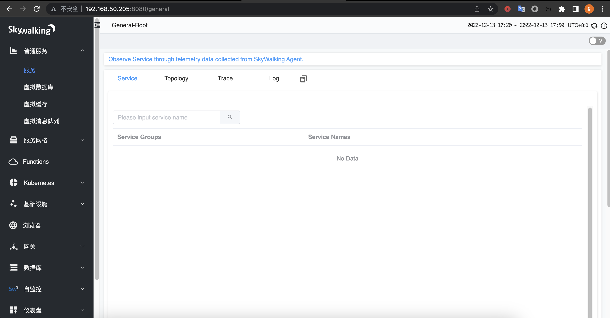
## 1.4 验证elasticsearch数据
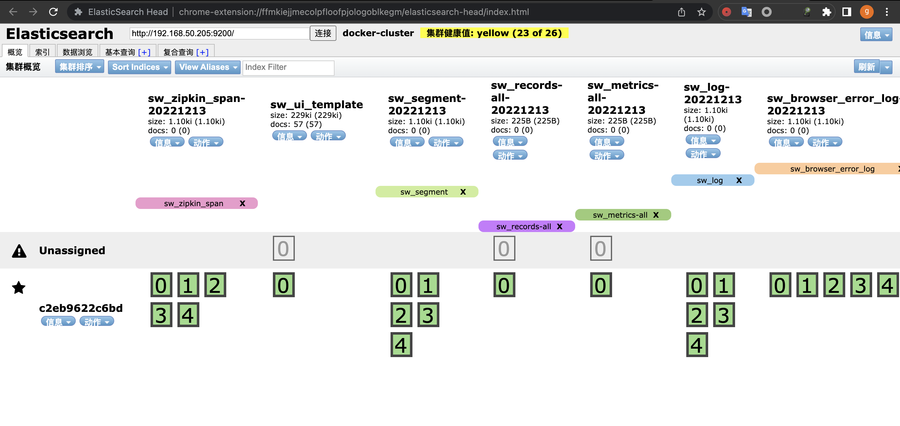

# 2. 实现单体服务halo博客和jenkins的请求链路跟踪
## 2.1 部署elasticsearch
```baash
root@es-server1:~#  vim /etc/sysctl.conf
net.ipv4.ip_forward=1
vm.max_map_count=262144
kernel.pid_max=4194303
fs.file-max=1000000
net.ipv4.tcp_max_tw_buckets=6000
net.netfilter.nf_conntrack_max=2097152

net.bridge.bridge-nf-call-ip6tables = 1
net.bridge.bridge-nf-call-iptables = 1
vm.swappiness=0
root@es-server1:~# dpkg -i elasticsearch-8.5.1-amd64.deb
root@es-server1:~#  grep -v "#" /etc/elasticsearch/elasticsearch.yml | grep -v "^$"
cluster.name: skywalking-es
node.name: node1
path.data: /var/lib/elasticsearch
path.logs: /var/log/elasticsearch
network.host: 192.168.50.101
http.port: 9200
discovery.seed_hosts: ["192.168.50.101"]
cluster.initial_master_nodes: ["192.168.50.101"]
xpack.security.enabled: false
xpack.security.enrollment.enabled: false
xpack.security.http.ssl:
  enabled: false
  keystore.path: certs/http.p12
xpack.security.transport.ssl:
  enabled: false
  verification_mode: certificate
  keystore.path: certs/transport.p12
  truststore.path: certs/transport.p12
http.host: 0.0.0.0
root@es-server1:~# systemctl daemon-reload
root@es-server1:~# systemctl start elasticsearch.service
root@es-server1:~# systemctl status elasticsearch.service
```
* 验证elasticsearch
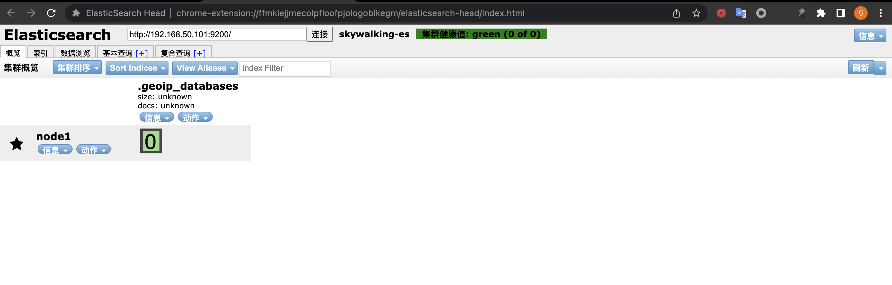
## 2.2 SkyWalking二进制安装
```bash
root@skywalking-server1:~#  apt install openjdk-11-jdk -y
root@skywalking-server1:/apps# tar -xzvf ~/apache-skywalking-apm-9.3.0.tar.gz
root@skywalking-server1:/apps# ln -sv /apps/apache-skywalking-apm-bin /apps/skywalking
'/apps/skywalking' -> '/apps/apache-skywalking-apm-bin'
root@skywalking-server1:/apps# vim /apps/skywalking/config/application.yml
storage:
  selector: ${SW_STORAGE:elasticsearch}
  elasticsearch:
    namespace: ${SW_NAMESPACE:""}
    clusterNodes: ${SW_STORAGE_ES_CLUSTER_NODES:192.168.50.101:9200}
root@skywalking-server1:/apps# vi /etc/systemd/system/skywalking.service
[Unit]
Description=Apache Skywalking
After=network.target

[Service]
Type=oneshot
User=root
WorkingDirectory=/apps/skywalking/bin/
ExecStart=/bin/bash /apps/skywalking/bin/startup.sh
RemainAfterExit=yes
RestartSec=5

[Install]
WantedBy=multi-user.target
root@skywalking-server1:/apps# systemctl daemon-reload
root@skywalking-server1:/apps# systemctl start skywalking
```
### 2.2.1 验证elasticsearch数据
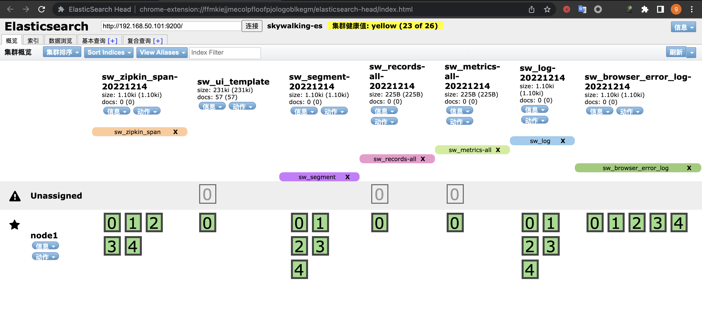
### 2.2.2 验证skywalking web界面

## 2.3 部署skywalking java agent
```bash
root@server1:~# mkdir /data && cd /data
root@server1:/data#
root@server1:/data# tar xvf ~/apache-skywalking-java-agent-8.13.0.tgz
root@server1:/data# vim /data/skywalking-agent/config/agent.config
agent.service_name=${SW_AGENT_NAME:halo}
agent.namespace=${SW_AGENT_NAMESPACE:java}
collector.backend_service=${SW_AGENT_COLLECTOR_BACKEND_SERVICES:192.168.50.102:11800}
```
## 2.4 部署halo并启用链路追踪
```bash
root@server1:/data# apt install openjdk-11-jdk
root@server1:/data#  wget https://dl.halo.run/release/halo-1.6.1.jar
root@server1:/data# java -javaagent:/data/skywalking-agent/skywalking-agent.jar -jar /apps/halo-1.6.1.jar
```
* 安装初始化
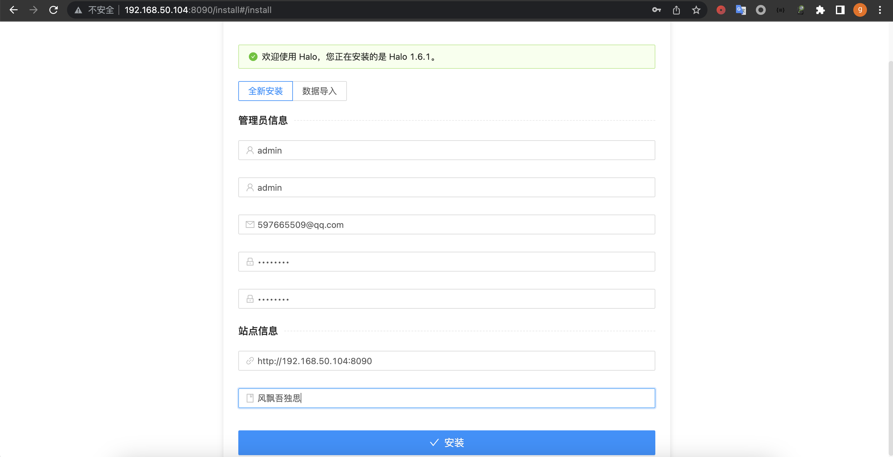
* 编写文章产生访问信息

* 验证skywalking
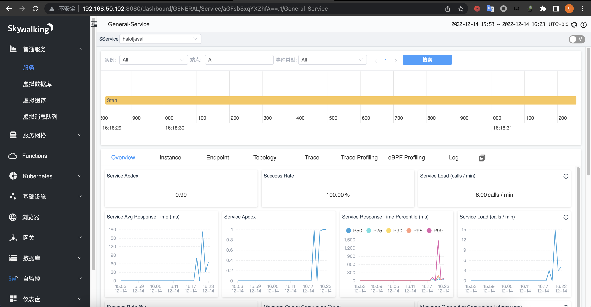
# 3. 实现dubbo微服务实现链路跟踪案例
## 3.1 部署注册中心zookeeper
```bash
root@skywalking-server2:~# apt install openjdk-8-jdk
root@skywalking-server2:~# java -version
openjdk version "1.8.0_352"
OpenJDK Runtime Environment (build 1.8.0_352-8u352-ga-1~22.04-b08)
OpenJDK 64-Bit Server VM (build 25.352-b08, mixed mode)
root@skywalking-server2:~# mkdir /apps && cd /apps
root@skywalking-server2:/apps# wget https://dlcdn.apache.org/zookeeper/zookeeper-3.7.1/apache-zookeeper-3.7.1-bin.tar.gz
root@skywalking-server2:/apps# tar xvf apache-zookeeper-3.7.1-bin.tar.gz
root@skywalking-server2:/apps# cp /apps/apache-zookeeper-3.7.1-bin/conf/zoo_sample.cfg /apps/apache-zookeeper-3.7.1-bin/conf/zoo.cfg
root@skywalking-server2:/apps# /apps/apache-zookeeper-3.7.1-bin/bin/zkServer.sh start
root@skywalking-server2:/apps# lsof -i:2181
COMMAND  PID USER   FD   TYPE DEVICE SIZE/OFF NODE NAME
java    4935 root   70u  IPv6  72410      0t0  TCP *:2181 (LISTEN)
```
## 3.2 部署provider
```bash
root@server1:~# apt install openjdk-8-jdk -y
root@server1:/data# java -version
openjdk version "1.8.0_352"
OpenJDK Runtime Environment (build 1.8.0_352-8u352-ga-1~22.04-b08)
OpenJDK 64-Bit Server VM (build 25.352-b08, mixed mode)
root@server1:~# mkdir /data && cd /data
tar xvf ~/apache-skywalking-java-agent-8.13.0.tgz
root@server1:/data# vi /data/skywalking-agent/config/agent.config
 20 agent.service_name=${SW_AGENT_NAME:dubbo-server1}
 23 agent.namespace=${SW_AGENT_NAMESPACE:myserver}
 101 collector.backend_service=${SW_AGENT_COLLECTOR_BACKEND_SERVICES:192.168.50.102:11800}
 root@server1:/data# vim /etc/profile
 export ZK_SERVER1=192.168.50.103
 root@server1:/data# source /etc/profile
root@server1:/data#  echo $ZK_SERVER1
192.168.50.103
root@server1:/data# mkdir -pv /apps/dubbo/provider
mkdir: created directory '/apps'
mkdir: created directory '/apps/dubbo'
mkdir: created directory '/apps/dubbo/provider'
root@server1:/data# cp ~/dubbo-server.jar /apps/dubbo/provider/
root@server1:/data# java -javaagent:/data/skywalking-agent/skywalking-agent.jar -jar /apps/dubbo/provider/dubbo-server.jar
Dubbo server started
Dubbo 服务端已经启动
```
## 3.3 部署consumer
```bash
root@server2:~# apt install openjdk-8-jdk -y
root@server2:/data# tar xvf ~/apache-skywalking-java-agent-8.13.0.tgz
root@server2:/data#  vim /data/skywalking-agent/config/agent.config
 20 agent.service_name=${SW_AGENT_NAME:dubbo-consumer1}
 23 agent.namespace=${SW_AGENT_NAMESPACE:myserver}
 101 collector.backend_service=${SW_AGENT_COLLECTOR_BACKEND_SERVICES:192.168.50.102:11800}
root@server2:/data# vim /etc/profile
export SW_SERVER="192.168.50.104"
export ZK_SERVER1="192.168.50.103"
root@server2:/data# source /etc/profile
root@server2:/data# mkdir -pv /apps/dubbo/consumer
mkdir: created directory '/apps'
mkdir: created directory '/apps/dubbo'
mkdir: created directory '/apps/dubbo/consumer'
root@server2:/data# cp ~/dubbo-client.jar /apps/dubbo/consumer
root@server2:/data# java -javaagent:/data/skywalking-agent/skywalking-agent.jar -jar /apps/dubbo/consumer/dubbo-client.jar
Dubbo client started
Dubbo 消费者端启动
```
* 访问consumer

* 验证skywalking数据
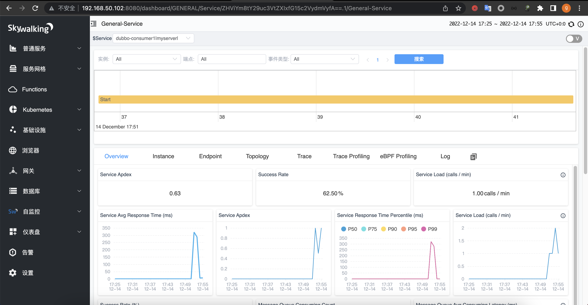
## 3.4 部署dubboadmin
```bash
root@skywalking-server2:/apps# java -version
openjdk version "1.8.0_352"
OpenJDK Runtime Environment (build 1.8.0_352-8u352-ga-1~22.04-b08)
OpenJDK 64-Bit Server VM (build 25.352-b08, mixed mode)
root@skywalking-server2:/apps#  tar xvf ~/apache-tomcat-8.5.84.tar.gz
root@skywalking-server2:/apps#  cd /apps/apache-tomcat-8.5.84/webapps/
root@skywalking-server2:/apps/apache-tomcat-8.5.84/webapps# rm -rf ./*
root@skywalking-server2:/apps/apache-tomcat-8.5.84/webapps# unzip ~/dubboadmin.war
root@skywalking-server2:/apps/apache-tomcat-8.5.84/webapps# vim dubboadmin/WEB-INF/dubbo.properties
dubbo.registry.address=zookeeper://192.168.50.103:2181
dubbo.admin.root.password=root
dubbo.admin.guest.password=guest
root@skywalking-server2:/apps/apache-tomcat-8.5.84/webapps# /apps/apache-tomcat-8.5.84/bin/startup.sh
```
* 验证dubboadmin web界面

# 4. 实现skywalking的钉钉告警
```bash
root@skywalking-server1:~# vim /apps/skywalking/config/alarm-settings.yml
rules:
  service_cpm_rule:
    metrics-name: service_cpm
    op: ">"
    threshold: 1
    period: 1
    count: 1
    silence-period: 0
    message: 服务 {name} 访问次数大于1


dingtalkHooks:
  textTemplate: |-
    {
      "msgtype": "text",
      "text": {
        "content": "Apache SkyWalking Alarm: \n %s."
      }
    }
  webhooks:
    - url: https://oapi.dingtalk.com/robot/send?access_token=***
root@skywalking-server1:~# systemctl restart skywalking.service
```
* skywalking 告警-验证告警:
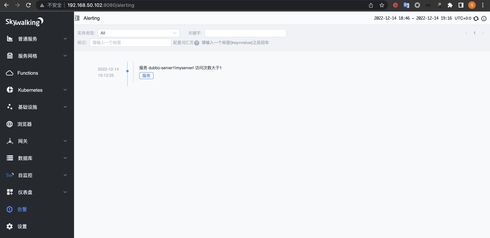
* 钉钉机器人告警信息
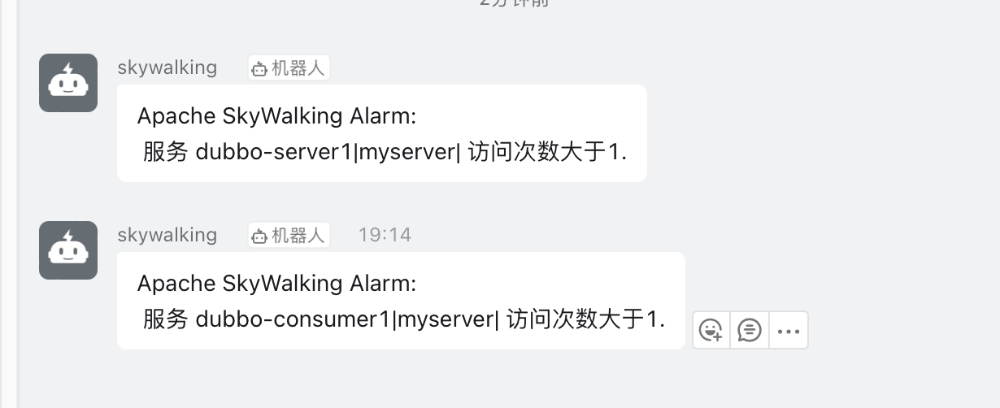

# 5. 扩展；
## 5.1. 实现python Django项目的请求链路跟踪
```bash
## 更新软件源
root@python-server1:~# apt update
## 安装pip
root@python-server1:~# apt install python3-pip
## 设置pip加速
root@python-server1:~# pip config set global.index-url https://pypi.tuna.tsinghua.edu.cn/simple
root@python-server1:~# mkdir /apps && cd /apps
root@python-server1:/apps# tar -xzvf /home/vagrant/django-test.tgz
root@python-server1:/apps# cd django-test/
## 安装依赖模块
root@python-server1:/apps/django-test# pip3 install -r requirements.txt
## 创建django项目mysite
root@python-server1:/apps/django-test# django-admin startproject mysite
## 创建应用
root@python-server1:/apps/django-test# cd mysite/
root@python-server1:/apps/django-test/mysite# python3 manage.py startapp myapp
## 需改数据库配置，使用sqllite
root@python-server1:/apps/django-test/mysite# vi mysite/settings.py
 77 DATABASES = {
 78      'default': {
 79          'ENGINE': 'django.db.backends.sqlite3',
 80          'NAME': BASE_DIR / 'db.sqlite3',
 81      }
 82 }
 83
 84 # DATABASE
 85 #DATABASES = {
 86 #    'default': {
 87 #        'ENGINE': 'django.db.backends.mysql',
 88 #        'HOST': '127.0.0.1',
 89 #        'USER': 'root',
 90 #        'PASSWORD': '1283218qq',
 91 #        'NAME': 'test_mysql',
 92 #        'PORT': 3306,
 93 #        'CONN_MAX_AGE': 60
 94 #    }
 95 #}
## 初始化数据库
root@python-server1:/apps/django-test/mysite# python3 manage.py makemigrations
##创建管理员，用于登录web控制台
root@python-server1:/apps/django-test/mysite# python3 manage.py createsuperuser
Username (leave blank to use 'root'): root
Email address: 597665509@qq.com
Password:
Password (again):
This password is too short. It must contain at least 8 characters.
This password is too common.
This password is entirely numeric.
Bypass password validation and create user anyway? [y/N]: y
Superuser created successfully.
## skywarking环境变量
root@python-server1:/apps/django-test/mysite# export SW_AGENT_NAME='python-app1'
root@python-server1:/apps/django-test/mysite# export SW_AGENT_NAMESPACE='python-project'
root@python-server1:/apps/django-test/mysite# export SW_AGENT_COLLECTOR_BACKEND_SERVICES='192.168.50.102:11800'
## 设置允许所有用户访问
root@python-server1:/apps/django-test/mysite# vi mysite/settings.py
ALLOWED_HOSTS = ["*",]
```
* 访问管理页面
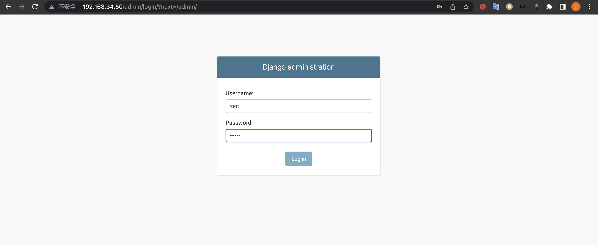
* 创建用户
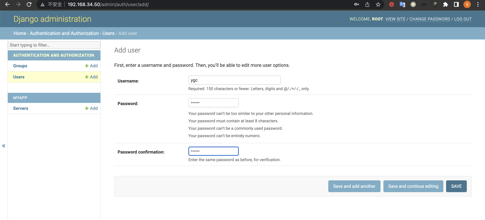
* 验证skywalking
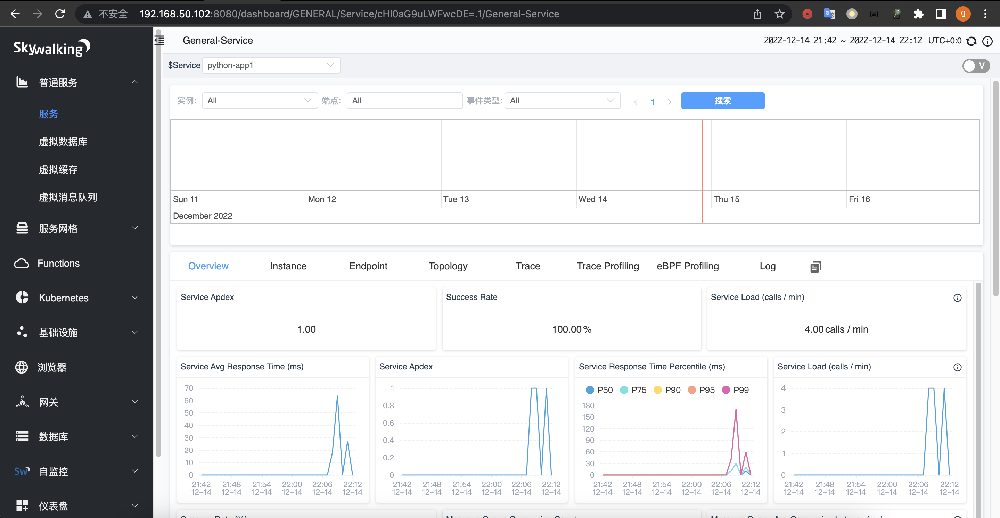

## 5.2. 实现OpenResty及后端java服务的全链路请求链路跟踪
## 5.2.1 编译和安装openresty
```bash
## 安装编译依赖软件
root@server3:~# apt  install iproute2  ntpdate  tcpdump telnet traceroute nfs-kernel-server nfs-common  lrzsz tree  openssl libssl-dev libpcre3 libpcre3-dev zlib1g-dev ntpdate tcpdump telnet traceroute  gcc openssh-server lrzsz tree  openssl libssl-dev libpcre3 libpcre3-dev zlib1g-dev ntpdate tcpdump telnet traceroute iotop unzip zip make
## 下载openresty源码
root@server3:~# wget https://openresty.org/download/openresty-1.21.4.1.tar.gz
## 解压
root@server3:~# tar -xzvf openresty-1.21.4.1.tar.gz
## 编译openresty
root@server3:~# cd openresty-1.21.4.1/
root@server3:~/openresty-1.21.4.1# ./configure --prefix=/apps/openresty  \
--with-luajit \
--with-pcre \
--with-http_iconv_module \
--with-http_realip_module \
--with-http_sub_module \
--with-http_stub_status_module \
--with-stream \
--with-stream_ssl_module
root@server3:~/openresty-1.21.4.1# make && make install
## 测试配置
root@server3:~/openresty-1.21.4.1# /apps/openresty/bin/openresty  -t
nginx: the configuration file /apps/openresty/nginx/conf/nginx.conf syntax is ok
nginx: configuration file /apps/openresty/nginx/conf/nginx.conf test is successful
## 启动服务
root@server3:~/openresty-1.21.4.1# /apps/openresty/bin/openresty
## 测试启动是否正常
root@server3:~/openresty-1.21.4.1# curl -s -I localhost
HTTP/1.1 200 OK
Server: openresty/1.21.4.1
Date: Thu, 15 Dec 2022 03:46:54 GMT
Content-Type: text/html
Content-Length: 1097
Last-Modified: Thu, 15 Dec 2022 03:43:42 GMT
Connection: keep-alive
ETag: "639a97ee-449"
Accept-Ranges: bytes
```
### 5.2.2 配置skywalking nginx agent
```bash
root@server3:~/openresty-1.21.4.1# mkdir /data && cd /data
root@server3:/data# mv v0.6.0.tar.gz  skywalking-nginx-lua-v0.6.0.tar.gz
root@server3:/data# tar -xzvf skywalking-nginx-lua-v0.6.0.tar.gz
root@server3:/data# cd /apps/openresty/nginx/conf/
root@server3:/apps/openresty/nginx/conf# vi nginx.conf
116     include /apps/openresty/nginx/conf/conf.d/*.conf;
root@server3:/apps/openresty/nginx/conf# mkdir  conf.d
root@server3:/apps/openresty/nginx/conf# cd conf.d/
root@server3:/apps/openresty/nginx/conf/conf.d# vi www.myserver.com.conf
    lua_package_path "/data/skywalking-nginx-lua-0.6.0/lib/?.lua;;";
    # Buffer represents the register inform and the queue of the finished segment
    lua_shared_dict tracing_buffer 100m;

    # Init is the timer setter and keeper
    # Setup an infinite loop timer to do register and trace report.
    init_worker_by_lua_block {
        local metadata_buffer = ngx.shared.tracing_buffer

        metadata_buffer:set('serviceName', 'myserver-nginx') ---#在skywalking 显示的当前server 名称，用于区分事件是有哪个服务产生的
        -- Instance means the number of Nginx deloyment, does not mean the worker instances
        metadata_buffer:set('serviceInstanceName', 'myserver-nginx-node1') ---#当前示例名称，用户事件是在那台服务器产生的
        -- type 'boolean', mark the entrySpan include host/domain
        metadata_buffer:set('includeHostInEntrySpan', false) ---#在span信息中包含主机信息

        -- set randomseed
        require("skywalking.util").set_randomseed()

        require("skywalking.client"):startBackendTimer("http://192.168.50.102:12800")

        -- Any time you want to stop reporting metrics, call `destroyBackendTimer`
        -- require("skywalking.client"):destroyBackendTimer()

        -- If there is a bug of this `tablepool` implementation, we can
        -- disable it in this way
        -- require("skywalking.util").disable_tablepool()

        skywalking_tracer = require("skywalking.tracer")
    }

    server {
        listen 80;
        server_name   www.myserver.com;
        location / {
            root   html;
            index  index.html index.htm;
            #手动配置的一个上游服务名称或DNS名称，在skywalking会显示此名称
            rewrite_by_lua_block {
                ------------------------------------------------------
                -- NOTICE, this should be changed manually
                -- This variable represents the upstream logic address
                -- Please set them as service logic name or DNS name
                --
                -- Currently, we can not have the upstream real network address
                ------------------------------------------------------
                skywalking_tracer:start("www.myserver.com")
                -- If you want correlation custom data to the downstream service
                -- skywalking_tracer:start("upstream service", {custom = "custom_value"})
            }
            #用于修改响应内容(注入JS)
            body_filter_by_lua_block {
                if ngx.arg[2] then
                    skywalking_tracer:finish()
                end
            }
            #记录日志
            log_by_lua_block {
                skywalking_tracer:prepareForReport()
            }

        }

        location /myserver {
            default_type text/html;

            rewrite_by_lua_block {
                ------------------------------------------------------
                -- NOTICE, this should be changed manually
                -- This variable represents the upstream logic address
                -- Please set them as service logic name or DNS name
                --
                -- Currently, we can not have the upstream real network address
                ------------------------------------------------------
                skywalking_tracer:start("www.myserver.com")
                -- If you want correlation custom data to the downstream service
                -- skywalking_tracer:start("upstream service", {custom = "custom_value"})
            }

            proxy_pass http://192.168.50.101;

            body_filter_by_lua_block {
                if ngx.arg[2] then
                    skywalking_tracer:finish()
                end
            }

            log_by_lua_block {
                skywalking_tracer:prepareForReport()
            }
        }

        location /hello {
            default_type text/html;

            rewrite_by_lua_block {
                ------------------------------------------------------
                -- NOTICE, this should be changed manually
                -- This variable represents the upstream logic address
                -- Please set them as service logic name or DNS name
                --
                -- Currently, we can not have the upstream real network address
                ------------------------------------------------------
                skywalking_tracer:start("www.myserver.com")
                -- If you want correlation custom data to the downstream service
                -- skywalking_tracer:start("upstream service", {custom = "custom_value"})
            }

            proxy_pass http://192.168.50.105:8080;

            body_filter_by_lua_block {
                if ngx.arg[2] then
                    skywalking_tracer:finish()
                end
            }

            log_by_lua_block {
                skywalking_tracer:prepareForReport()
            }
        }
}
root@server3:/apps/openresty/nginx/conf/conf.d# /apps/openresty/bin/openresty  -t
nginx: the configuration file /apps/openresty/nginx/conf/nginx.conf syntax is ok
nginx: configuration file /apps/openresty/nginx/conf/nginx.conf test is successful
root@server3:/apps/openresty/nginx/conf/conf.d# /apps/openresty/bin/openresty  -s reload
```
* 配置本机hosts
```bash
~ > sudo vi /etc/hosts
192.168.50.106 www.myserver.com
```
* 浏览器访问myserver页面

* 浏览器访问hello接口

* skywalking 验证1
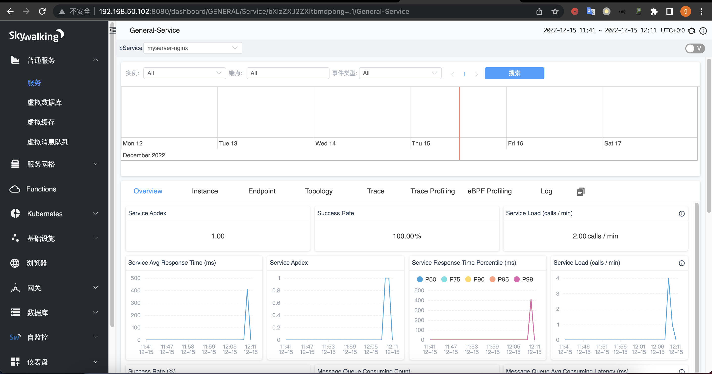
* skywalking 验证2
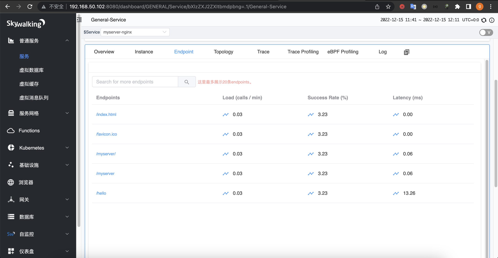

### 5.2.3 访问openresty静态资源
* 浏览器访问

* skywalking验证
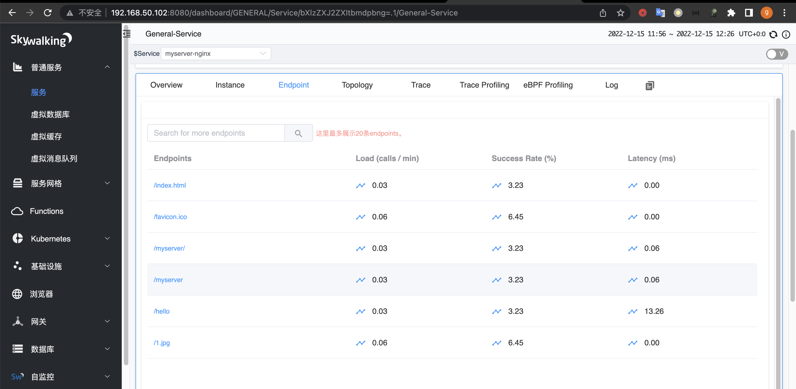