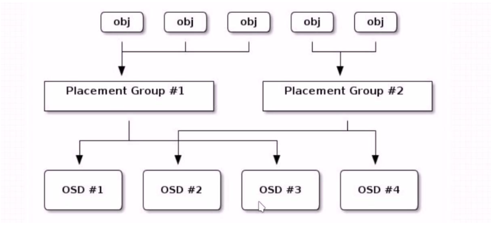
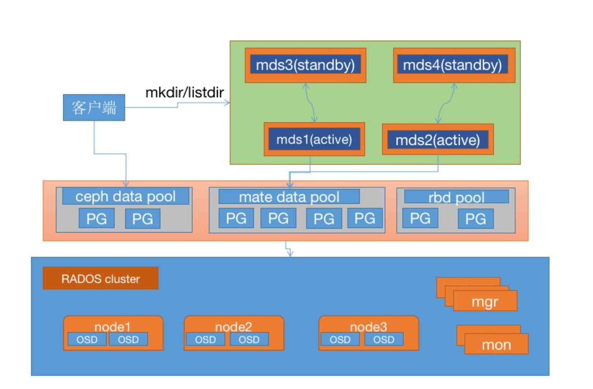

# 1. 熟练管理存储池(创建存储池、删除存储池)、掌握pg与pgp的基本分配方法
## 1.1 存储池基本命令
```bash
##列出存储池，不带pool ID
cephadmin@ceph-deploy:~/ceph-cluster$ ceph osd pool ls
device_health_metrics
myrbd1
cephfs-metadata
cephfs-data
##列出存储池，带pool ID
cephadmin@ceph-deploy:~/ceph-cluster$ ceph osd lspools
1 device_health_metrics
2 myrbd1
3 cephfs-metadata
4 cephfs-data
## 获取存储池的事件信息
cephadmin@ceph-deploy:~/ceph-cluster$ ceph osd pool stats myrbd1
pool myrbd1 id 2
  nothing is going on
## 重命名存储池
cephadmin@ceph-deploy:~/ceph-cluster$ ceph osd pool rename myrbd1 myrbd2
pool 'myrbd1' renamed to 'myrbd2'
## 显示存储池的用量信息
cephadmin@ceph-deploy:~/ceph-cluster$ rados df
POOL_NAME                 USED  OBJECTS  CLONES  COPIES  MISSING_ON_PRIMARY  UNFOUND  DEGRADED  RD_OPS       RD  WR_OPS       WR  USED COMPR  UNDER COMPR
cephfs-data             12 KiB        1       0       3                   0        0         0       1      0 B      51   96 MiB         0 B          0 B
cephfs-metadata        285 KiB       23       0      69                   0        0         0      50   85 KiB     110   87 KiB         0 B          0 B
device_health_metrics      0 B        0       0       0                   0        0         0       0      0 B       0      0 B         0 B          0 B
myrbd2                  31 MiB       20       0      60                   0        0         0     464  2.0 MiB     555  587 MiB         0 B          0 B

total_objects    44
total_used       152 MiB
total_avail      64 TiB

```
## 1.2 创建存储池
```bash
## 创建存储池
cephadmin@ceph-deploy:~/ceph-cluster$ ceph osd pool create mypool2 32 32
pool 'mypool2' created
```
## 1.3 删除存储池
* 如果把存储池删除会导致把存储池内的数据全部删除，因此 ceph 为了防止误删除存储池设 置了两个机制来防止误删除操作
  * 第一个机制是 NODELETE 标志，需要设置为 false 但是默认就是 false 了。
  * 第二个机制是集群范围的配置参数 mon allow pool delete，默认值为 false，即监视器不允 许删除存储池，可以在特定场合使用 tell 指令临时设置为(true)允许删除，在删除指定的 pool 之后再重新设置为 false。
```bash
## 默认nodelete标志false
cephadmin@ceph-deploy:~/ceph-cluster$ ceph osd pool get mypool2 nodelete
nodelete: false
## 如果设置为了 true 就表示不能删除，可以使用 set 指令重新设置为 fasle
cephadmin@ceph-deploy:~/ceph-cluster$ ceph osd pool set mypool2 nodelete true
set pool 5 nodelete to true
## 查看nodelete标志
cephadmin@ceph-deploy:~/ceph-cluster$ ceph osd pool get mypool2 nodelete
nodelete: true
## 恢复nodelete标志
cephadmin@ceph-deploy:~/ceph-cluster$ ceph osd pool set mypool2 nodelete false
set pool 5 nodelete to false
## 查看nodelete标志
cephadmin@ceph-deploy:~/ceph-cluster$ ceph osd pool get mypool2 nodelete
nodelete: false
## 配置参数 mon allow pool delete 为true
cephadmin@ceph-deploy:~/ceph-cluster$ ceph tell mon.* injectargs --mon-allow-pool-delete=true
mon.ceph-mon1: {}
mon.ceph-mon1: mon_allow_pool_delete = 'true' 
mon.ceph-mon2: {}
mon.ceph-mon2: mon_allow_pool_delete = 'true' 
mon.ceph-mon3: {}
mon.ceph-mon3: mon_allow_pool_delete = 'true' 
## 删除存储池mypool2
cephadmin@ceph-deploy:~/ceph-cluster$ ceph osd pool rm mypool2 mypool2 --yes-i-really-really-mean-it
pool 'mypool2' removed
## 还原配置参数 mon allow pool delete 为tfalse
cephadmin@ceph-deploy:~/ceph-cluster$ ceph tell mon.* injectargs --mon-allow-pool-delete=false
mon.ceph-mon1: {}
mon.ceph-mon1: mon_allow_pool_delete = 'false' 
mon.ceph-mon2: {}
mon.ceph-mon2: mon_allow_pool_delete = 'false' 
mon.ceph-mon3: {}
mon.ceph-mon3: mon_allow_pool_delete = 'false' 
```
## 1.4 PG 与 PGP
* PG = Placement Group #归置组，默认每个 PG 三个 OSD(数据三个副本)
* PGP = Placement Group for Placement purpose #归置组的组合，pgp 相当于是 pg 对应 osd 的一种逻辑排列组合关系(在不同的 PG 内使用不同组合关系的 OSD)。
* 加入 PG=32，PGP=32，那么:
  * 数据最多被拆分为 32 份(PG)，写入到有 32 种组合关系(PGP)的 OSD 上。
* 归置组(placement group)是用于跨越多 OSD 将数据存储在每个存储池中的内部数据结构。
* 归置组在 OSD 守护进程和 ceph 客户端之间生成了一个中间层，CRUSH 算法负责将每个 对象动态映射到一个归置组，然后再将每个归置组动态映射到一个或多个 OSD 守护进程， 从而能够支持在新的 OSD 设备上线时进行数据重新平衡。
* 与存储池的关系
  * 相对于存储池来说，PG 是一个虚拟组件，它是对象映射到存储池时使用的虚拟层。
  * 可以自定义存储池中的归置组数量
  * ceph 出于规模伸缩及性能方面的考虑，ceph 将存储池细分为多个归置组，把每个单独的对 象映射到归置组，并为归置组分配一个主 OSD。
  * 存储池由一系列的归置组组成，而 CRUSH 算法则根据集群运行图和集群状态，将个 PG 均 匀、伪随机(基于 hash 映射,每次的计算结果够一样)的分布到集群中的 OSD 之上。
  * 如果某个 OSD 失败或需要对集群进行重新平衡，ceph 则移动或复制整个归置组而不需要 单独对每个镜像进行寻址。
* PG与OSD的关系
  * ceph 基于 crush 算法将归置组 PG 分配至 OSD
  * 当一个客户端存储对象的时候，CRUSH 算法映射每一个对象至归置组(PG)
  * 
### 1.4.1 PG 分配计算
* 归置组(PG)的数量是由管理员在创建存储池的时候指定的，然后由 CRUSH 负责创建和使 用，PG的数量是2的N次方的倍数,每个OSD的PG不要超出250个PG，官方是每个OSD 100个左右
  * 确保设置了合适的归置组大小，我们建议每个 OSD 大约 100 个，例如，osd 总数乘以 100 除以副本数量(即 osd 池默认大小)，因此，对于 10 个 osd、存储池为 4 个，我们建议每 个存储池大约(100 * 10) / 4 = 256
* 1. 通常，PG 的数量应该是数据的合理力度的子集
  * 例如:一个包含 256 个 PG 的存储池，每个 PG 中包含大约 1/256 的存储池数据
* 2. 当需要将 PG 从一个 OSD 移动到另一个 OSD 的时候，PG 的数量会对性能产生影响
  * PG 的数量过少，一个 OSD 上保存的数据数据会相对加多，那么 ceph 同步数据的时候产 生的网络负载将对集群的性能输出产生一定影响。
  * PG 过多的时候，ceph 将会占用过多的 CPU 和内存资源用于记录 PG 的状态信息
* 3. PG 的数量在集群分发数据和重新平衡时扮演者重要的角色作用
  * 在所有 OSD 之间进行数据持久存储以及完成数据分布会需要较多的归置组，但是他们的ceph PG，以节省 CPU 和内存资源
  * 一般来说，对于有着超过 50 个 OSD 的 RADOS 集群，建议每个 OSD 大约有 50-100 个 PG 以平衡资源使用及取得更好的数据持久性和数据分布，而在更大的集群中，每个 OSD 可以有 100-200 个 PG
  * 至于一个 pool 应该使用多少个 PG，可以通过下面的公式计算后，将 pool 的 PG 值四舍 五入到最近的 2 的 N 次幂，如下先计算出 ceph 集群的总 PG 数:
    * Total OSDs * x Total PGs = factor => total PGs
    * 磁盘总数 * 每个磁盘PG数/副本数 => ceph集群总PG数(略大于2^n次方)
    * 官方的计算公式:
      * Total PGs = (Total_number_of_OSD * 100)/max_replication_count
  * 单个 pool 的 PG计算如下：
    * 有 100 个 osd，3副本，5个pool
    * Total PGs =100*100/3=3333	
    * 每个 pool 的 PG=3333/5=512，那么创建 pool 的时候就指定 pg 为 512
  * 需要结合数据数量、磁盘数量及磁盘空间计算出 PG 数量，8、16、32、64、128、256 等 2 的 N 次方。
  * 一个 RADOS 集群上会存在多个存储池，因此管理员还需要考虑所有存储池上的 PG 分布 后每个 OSD 需要映射的 PG 数量。
```bash
cephadmin@ceph-deploy:~/ceph-cluster$ ceph osd pool create testpoo2 60 60
pool 'testpoo2' created
cephadmin@ceph-deploy:~/ceph-cluster$ ceph osd pool create testpoo3 40 30
pool 'testpoo3' created
cephadmin@ceph-deploy:~/ceph-cluster$ ceph osd pool create testpoo4 45 45
pool 'testpoo4' created
## ceph 的 pg 数量推荐是 2 的整次幂，比如 2 的平方叫二次幂,立方叫三次幂,幂的大小是整数，如果不是 2 的整次方会有提示:
cephadmin@ceph-deploy:~/ceph-cluster$ ceph health detail
HEALTH_WARN 3 pool(s) have non-power-of-two pg_num; 1 pools have pg_num > pgp_num
[WRN] POOL_PG_NUM_NOT_POWER_OF_TWO: 3 pool(s) have non-power-of-two pg_num
    pool 'testpoo2' pg_num 60 is not a power of two
    pool 'testpoo3' pg_num 40 is not a power of two
    pool 'testpoo4' pg_num 45 is not a power of two
[WRN] SMALLER_PGP_NUM: 1 pools have pg_num > pgp_num
    pool testpoo3 pg_num 40 > pgp_num 30

```
### 1.4.2 验证 PG 与 PGP 组合
```bash
cephadmin@ceph-deploy:~/ceph-cluster$ ceph pg ls-by-pool mypool
PG    OBJECTS  DEGRADED  MISPLACED  UNFOUND  BYTES  OMAP_BYTES*  OMAP_KEYS*  LOG  STATE         SINCE  VERSION  REPORTED  UP            ACTING        SCRUB_STAMP                      DEEP_SCRUB_STAMP               
9.0         0         0          0        0      0            0           0    0  active+clean     9s      0'0    169:10   [1,13,11]p1   [1,13,11]p1  2022-12-27T14:19:02.317567+0800  2022-12-27T14:19:02.317567+0800
9.1         0         0          0        0      0            0           0    0  active+clean     9s      0'0    169:10   [15,3,9]p15   [15,3,9]p15  2022-12-27T14:19:02.317567+0800  2022-12-27T14:19:02.317567+0800
9.2         0         0          0        0      0            0           0    0  active+clean     9s      0'0    169:10   [14,1,9]p14   [14,1,9]p14  2022-12-27T14:19:02.317567+0800  2022-12-27T14:19:02.317567+0800
9.3         0         0          0        0      0            0           0    0  active+clean     9s      0'0    169:10    [9,15,5]p9    [9,15,5]p9  2022-12-27T14:19:02.317567+0800  2022-12-27T14:19:02.317567+0800
9.4         0         0          0        0      0            0           0    0  active+clean     9s      0'0    169:10    [1,4,12]p1    [1,4,12]p1  2022-12-27T14:19:02.317567+0800  2022-12-27T14:19:02.317567+0800
9.5         0         0          0        0      0            0           0    0  active+clean     9s      0'0    169:10  [11,12,7]p11  [11,12,7]p11  2022-12-27T14:19:02.317567+0800  2022-12-27T14:19:02.317567+0800
9.6         0         0          0        0      0            0           0    0  active+clean     9s      0'0    169:10   [12,1,9]p12   [12,1,9]p12  2022-12-27T14:19:02.317567+0800  2022-12-27T14:19:02.317567+0800
9.7         0         0          0        0      0            0           0    0  active+clean     8s      0'0    169:10  [10,12,2]p10  [10,12,2]p10  2022-12-27T14:19:02.317567+0800  2022-12-27T14:19:02.317567+0800
9.8         0         0          0        0      0            0           0    0  active+clean     9s      0'0    169:10   [12,1,5]p12   [12,1,5]p12  2022-12-27T14:19:02.317567+0800  2022-12-27T14:19:02.317567+0800
9.9         0         0          0        0      0            0           0    0  active+clean     9s      0'0    169:10  [10,5,12]p10  [10,5,12]p10  2022-12-27T14:19:02.317567+0800  2022-12-27T14:19:02.317567+0800
9.a         0         0          0        0      0            0           0    0  active+clean     9s      0'0    169:10    [5,14,3]p5    [5,14,3]p5  2022-12-27T14:19:02.317567+0800  2022-12-27T14:19:02.317567+0800
9.b         0         0          0        0      0            0           0    0  active+clean     9s      0'0    169:10    [8,5,15]p8    [8,5,15]p8  2022-12-27T14:19:02.317567+0800  2022-12-27T14:19:02.317567+0800
9.c         0         0          0        0      0            0           0    0  active+clean     9s      0'0    169:10   [3,12,10]p3   [3,12,10]p3  2022-12-27T14:19:02.317567+0800  2022-12-27T14:19:02.317567+0800
9.d         0         0          0        0      0            0           0    0  active+clean     9s      0'0    169:10    [7,14,8]p7    [7,14,8]p7  2022-12-27T14:19:02.317567+0800  2022-12-27T14:19:02.317567+0800
9.e         0         0          0        0      0            0           0    0  active+clean     9s      0'0    169:10    [7,10,1]p7    [7,10,1]p7  2022-12-27T14:19:02.317567+0800  2022-12-27T14:19:02.317567+0800
9.f         0         0          0        0      0            0           0    0  active+clean     9s      0'0    169:10    [5,12,9]p5    [5,12,9]p5  2022-12-27T14:19:02.317567+0800  2022-12-27T14:19:02.317567+0800
9.10        0         0          0        0      0            0           0    0  active+clean     8s      0'0    169:10    [4,15,2]p4    [4,15,2]p4  2022-12-27T14:19:02.317567+0800  2022-12-27T14:19:02.317567+0800
9.11        0         0          0        0      0            0           0    0  active+clean     9s      0'0    169:10    [7,3,13]p7    [7,3,13]p7  2022-12-27T14:19:02.317567+0800  2022-12-27T14:19:02.317567+0800
9.12        0         0          0        0      0            0           0    0  active+clean     8s      0'0    169:10  [13,11,6]p13  [13,11,6]p13  2022-12-27T14:19:02.317567+0800  2022-12-27T14:19:02.317567+0800
9.13        0         0          0        0      0            0           0    0  active+clean     9s      0'0    169:10  [11,13,5]p11  [11,13,5]p11  2022-12-27T14:19:02.317567+0800  2022-12-27T14:19:02.317567+0800
9.14        0         0          0        0      0            0           0    0  active+clean     9s      0'0    169:10   [1,15,10]p1   [1,15,10]p1  2022-12-27T14:19:02.317567+0800  2022-12-27T14:19:02.317567+0800
9.15        0         0          0        0      0            0           0    0  active+clean     9s      0'0    169:10    [7,8,12]p7    [7,8,12]p7  2022-12-27T14:19:02.317567+0800  2022-12-27T14:19:02.317567+0800
9.16        0         0          0        0      0            0           0    0  active+clean     8s      0'0    169:10  [11,2,15]p11  [11,2,15]p11  2022-12-27T14:19:02.317567+0800  2022-12-27T14:19:02.317567+0800
9.17        0         0          0        0      0            0           0    0  active+clean     9s      0'0    169:10    [8,15,0]p8    [8,15,0]p8  2022-12-27T14:19:02.317567+0800  2022-12-27T14:19:02.317567+0800
9.18        0         0          0        0      0            0           0    0  active+clean     9s      0'0    169:10  [14,7,10]p14  [14,7,10]p14  2022-12-27T14:19:02.317567+0800  2022-12-27T14:19:02.317567+0800
9.19        0         0          0        0      0            0           0    0  active+clean     8s      0'0    169:10    [3,6,12]p3    [3,6,12]p3  2022-12-27T14:19:02.317567+0800  2022-12-27T14:19:02.317567+0800
9.1a        0         0          0        0      0            0           0    0  active+clean     8s      0'0    169:10    [3,14,6]p3    [3,14,6]p3  2022-12-27T14:19:02.317567+0800  2022-12-27T14:19:02.317567+0800
9.1b        0         0          0        0      0            0           0    0  active+clean     9s      0'0    169:10   [13,0,5]p13   [13,0,5]p13  2022-12-27T14:19:02.317567+0800  2022-12-27T14:19:02.317567+0800
9.1c        0         0          0        0      0            0           0    0  active+clean     9s      0'0    169:10   [0,11,12]p0   [0,11,12]p0  2022-12-27T14:19:02.317567+0800  2022-12-27T14:19:02.317567+0800
9.1d        0         0          0        0      0            0           0    0  active+clean     9s      0'0    169:10    [9,13,5]p9    [9,13,5]p9  2022-12-27T14:19:02.317567+0800  2022-12-27T14:19:02.317567+0800
9.1e        0         0          0        0      0            0           0    0  active+clean     9s      0'0    169:10    [0,7,15]p0    [0,7,15]p0  2022-12-27T14:19:02.317567+0800  2022-12-27T14:19:02.317567+0800
9.1f        0         0          0        0      0            0           0    0  active+clean     8s      0'0    169:10    [1,10,6]p1    [1,10,6]p1  2022-12-27T14:19:02.317567+0800  2022-12-27T14:19:02.317567+0800

* NOTE: Omap statistics are gathered during deep scrub and may be inaccurate soon afterwards depending on utilization. See http://docs.ceph.com/en/latest/dev/placement-group/#omap-statistics for further details.
cephadmin@ceph-deploy:~/ceph-cluster$ ceph pg ls-by-pool mypool | awk '{print $1,$2,$15}'
PG OBJECTS ACTING
9.0 0 [1,13,11]p1
9.1 0 [15,3,9]p15
9.2 0 [14,1,9]p14
9.3 0 [9,15,5]p9
9.4 0 [1,4,12]p1
9.5 0 [11,12,7]p11
9.6 0 [12,1,9]p12
9.7 0 [10,12,2]p10
9.8 0 [12,1,5]p12
9.9 0 [10,5,12]p10
9.a 0 [5,14,3]p5
9.b 0 [8,5,15]p8
9.c 0 [3,12,10]p3
9.d 0 [7,14,8]p7
9.e 0 [7,10,1]p7
9.f 0 [5,12,9]p5
9.10 0 [4,15,2]p4
9.11 0 [7,3,13]p7
9.12 0 [13,11,6]p13
9.13 0 [11,13,5]p11
9.14 0 [1,15,10]p1
9.15 0 [7,8,12]p7
9.16 0 [11,2,15]p11
9.17 0 [8,15,0]p8
9.18 0 [14,7,10]p14
9.19 0 [3,6,12]p3
9.1a 0 [3,14,6]p3
9.1b 0 [13,0,5]p13
9.1c 0 [0,11,12]p0
9.1d 0 [9,13,5]p9
9.1e 0 [0,7,15]p0
9.1f 0 [1,10,6]p1
  
* NOTE: afterwards
```
### 1.4.3 PG 的状态
PG 的常见在状态如下：
* Peering
  * 正在同步状态，同一个 PG 中的 OSD 需要将准备数据同步一致，而 Peering(对等)就是 OSD 同步过程中的状态
* Activating
  * Peering 已经完成，PG 正在等待所有 PG 实例同步 Peering 的结果(Info、Log 等)
* Clean
  * 干净态,PG 当前不存在待修复的对象，并且大小等于存储池的副本数，即 PG 的活动集 (Acting Set)和上行集(Up Set)为同一组 OSD 且内容一致。
  * 活动集(Acting Set):由 PG 当前主的 OSD 和其余处于活动状态的备用 OSD 组成，当前 PG 内的 OSD 负责处理用户的读写请求。
  * 上行集(Up Set):在某一个 OSD 故障时，需要将故障的 OSD 更换为可用的 OSD，并 PG 内 部的主 OSD 同步数据到新的 OSD 上，例如 PG 内有 OSD1、OSD2、OSD3，当 OSD3 故 障后需要用 OSD4 替换 OSD3，那么 OSD1、OSD2、OSD3 就是上行集，替换后 OSD1、 OSD2、OSD4 就是活动集，OSD 替换完成后活动集最终要替换上行集。
* Active
  * 就绪状态或活跃状态，Active 表示主 OSD 和备 OSD 处于正常工作状态，此时的 PG 可以 正常处理来自客户端的读写请求，正常的 PG 默认就是 Active+Clean 状态
```bash
cephadmin@ceph-deploy:~/ceph-cluster$ ceph pg stat
193 pgs: 193 active+clean; 10 MiB data, 184 MiB used, 64 TiB / 64 TiB avail
```
* Degraded:降级状态
  * 降级状态出现于 OSD 被标记为 down 以后，那么其他映射到此 OSD 的 PG 都会转换到降 级状态。
  * 如果此 OSD 还能重新启动完成并完成 Peering 操作后，那么使用此 OSD 的 PG 将重新恢复 为 clean 状态。
  * 如果此 OSD 被标记为 down 的时间超过 5 分钟还没有修复，那么此 OSD 将会被 ceph 踢出 集群，然后 ceph 会对被降级的 PG 启动恢复操作，直到所有由于此 OSD 而被降级的 PG 重新恢复为 clean 状态。
  * 恢复数据会从 PG 内的主 OSD 恢复，如果是主 OSD 故障，那么会在剩下的两个备用 OSD 重新选择一个作为主 OSD。
* Stale:过期状态
  * 正常状态下，每个主 OSD 都要周期性的向 RADOS 集群中的监视器(Mon)报告其作为主 OSD 所持有的所有 PG 的最新统计数据，因任何原因导致某个 OSD 无法正常向监视器发送汇报 信息的、或者由其他 OSD 报告某个 OSD 已经 down 的时候，则所有以此 OSD 为主 PG 则 会立即被标记为 stale 状态，即他们的主 OSD 已经不是最新的数据了，如果是备份的 OSD
 cephadmin@ceph-deploy:/home/ceph/ceph-cluster$ ceph pg stat
129 pgs: 129 active+clean; 319 KiB data, 1.1 GiB used, 2.0 TiB / 2.0 TiB avail
发送 down 的时候，则 ceph 会执行修复而不会触发 PG 状态转换为 stale 状态
* undersized
  * PG 当前副本数小于其存储池定义的值的时候，PG 会转换为 undersized 状态，比如两个 备份 OSD 都 down 了，那么此时 PG 中就只有一个主 OSD 了，不符合 ceph 最少要求一个 主 OSD 加一个备 OSD 的要求，那么就会导致使用此 OSD 的 PG 转换为 undersized 状态， 直到添加备份 OSD 添加完成，或者修复完成。
* Scrubbing
  * scrub 是 ceph 对数据的清洗状态，用来保证数据完整性的机制，Ceph 的 OSD 定期启 动 scrub 线程来扫描部分对象，通过与其他副本比对来发现是否一致，如果存在不一致，抛 出异常提示用户手动解决，scrub 以 PG 为单位，对于每一个 pg，ceph 分析该 pg 下所有 的 object, 产生一个类似于元数据信息摘要的数据结构，如对象大小，属性等，叫 scrubmap, 比较主与副 scrubmap，来保证是不是有 object 丢失或者不匹配，扫描分为轻量级扫描和 深度扫描，轻量级扫描也叫做 light scrubs 或者 shallow scrubs 或者 simply scrubs 即轻量 级扫描.
  * Light scrub(daily)比较 object size 和属性，deep scrub (weekly)读取数据部分并通过 checksum(CRC32 算法)对比和数据的一致性,深度扫描过程中的 PG 会处于 scrubbing+deep 状态。
* Recovering
  * 正在恢复态，集群正在执行迁移或同步对象和他们的副本，这可能是由于添加了一个新的 OSD 到集群中或者某个 OSD 宕掉后，PG 可能会被 CRUSH 算法重新分配不同的 OSD，而 由于 OSD 更换导致 PG 发生内部数据同步的过程中的 PG 会被标记为 Recovering
* Backfilling
  * 正在后台填充态,backfill 是 recovery 的一种特殊场景，指 peering 完成后，如果基于当前 权威日志无法对 Up Set(上行集)当中的某些 PG 实例实施增量同步(例如承载这些 PG 实 例的 OSD 离线太久，或者是新的 OSD 加入集群导致的 PG 实例整体迁移) 则通过完全拷贝 当前 Primary 所有对象的方式进行全量同步，此过程中的 PG 会处于 backfilling。
* Backfill-toofull
  * 某个需要被 Backfill 的 PG 实例，其所在的 OSD 可用空间不足，Backfill 流程当前被挂起时 PG 给的状态。
# 2. 熟练ceph的用户管理及授权
```bash
## 创建普通用户
cephadmin@ceph-deploy:~/ceph-cluster$ ceph auth add client.ygc mon 'allow r' osd 'allow rwx pool=rbd-data1'
added key for client.ygc
## 验证用户信息
cephadmin@ceph-deploy:~/ceph-cluster$ ceph auth get client.ygc
[client.ygc]
	key = AQCimapj3qk/DxAAqZNjWI3SW9yXnH/KomPkNA==
	caps mon = "allow r"
	caps osd = "allow rwx pool=rbd-data1"
exported keyring for client.ygc
## 创建用 keyring 文件
cephadmin@ceph-deploy:~/ceph-cluster$ ceph-authtool --create-keyring ceph.client.ygc.keyring
creating ceph.client.ygc.keyring
## 导出用户keyring
cephadmin@ceph-deploy:~/ceph-cluster$ ceph auth get client.ygc -o ceph.client.ygc.keyring
exported keyring for client.ygc
## 验证指定用户的 keyring 文件
cephadmin@ceph-deploy:~/ceph-cluster$ cat ceph.client.ygc.keyring 
[client.ygc]
	key = AQCimapj3qk/DxAAqZNjWI3SW9yXnH/KomPkNA==
	caps mon = "allow r"
	caps osd = "allow rwx pool=rbd-data1"
```
# 3. 使用普通客户挂载块存储
## 3.1 创建存储池和镜像
```bash
## 创建存储池
cephadmin@ceph-deploy:~/ceph-cluster$ ceph osd pool create rbd-data1 32 32
pool 'rbd-data1' created
## 查看存储池
cephadmin@ceph-deploy:~/ceph-cluster$ ceph osd pool ls
device_health_metrics
cephfs-metadata
cephfs-data
mypool
rbd-data1
## 存储池启用rbd
cephadmin@ceph-deploy:~/ceph-cluster$ ceph osd pool application enable rbd-data1 rbd
enabled application 'rbd' on pool 'rbd-data1'
## 初始化rbd
cephadmin@ceph-deploy:~/ceph-cluster$ rbd pool init -p rbd-data1
## 创建镜像
cephadmin@ceph-deploy:~/ceph-cluster$ rbd create data-img1 --size 3G --pool rbd-data1 --image-format 2  --image-feature layering
cephadmin@ceph-deploy:~/ceph-cluster$ rbd create data-img2 --size 5G --pool rbd-data1 --image-format 2  --image-feature layering
## 验证镜像
cephadmin@ceph-deploy:~/ceph-cluster$ rbd ls --pool rbd-data1
data-img1
data-img2
## 查看镜像更多信息
cephadmin@ceph-deploy:~/ceph-cluster$ rbd ls --pool rbd-data1 -l
NAME       SIZE   PARENT  FMT  PROT  LOCK
data-img1  3 GiB            2            
data-img2  5 GiB            2
## 查看镜像详细信息
cephadmin@ceph-deploy:~/ceph-cluster$ rbd --image data-img2 --pool rbd-data1 info
rbd image 'data-img2':
	size 5 GiB in 1280 objects
	order 22 (4 MiB objects)
	snapshot_count: 0
	id: 20d15a6364fea
	block_name_prefix: rbd_data.20d15a6364fea
	format: 2
	features: layering
	op_features: 
	flags: 
	create_timestamp: Tue Dec 27 15:02:23 2022
	access_timestamp: Tue Dec 27 15:02:23 2022
	modify_timestamp: Tue Dec 27 15:02:23 2022
cephadmin@ceph-deploy:~/ceph-cluster$ rbd --image data-img1 --pool rbd-data1 info
rbd image 'data-img1':
	size 3 GiB in 768 objects
	order 22 (4 MiB objects)
	snapshot_count: 0
	id: 20d0ceed58ed6
	block_name_prefix: rbd_data.20d0ceed58ed6
	format: 2
	features: layering
	op_features: 
	flags: 
	create_timestamp: Tue Dec 27 15:01:43 2022
	access_timestamp: Tue Dec 27 15:01:43 2022
	modify_timestamp: Tue Dec 27 15:01:43 2022
```
## 3.2 安装客户端
```bash
root@ceph-client1:~# apt update
Hit:1 https://mirrors.tuna.tsinghua.edu.cn/ubuntu bionic InRelease
Hit:2 https://mirrors.tuna.tsinghua.edu.cn/ubuntu bionic-updates InRelease
Hit:3 https://mirrors.tuna.tsinghua.edu.cn/ubuntu bionic-backports InRelease
Hit:4 https://mirrors.tuna.tsinghua.edu.cn/ubuntu bionic-security InRelease
Get:5 https://mirrors.tuna.tsinghua.edu.cn/ceph/debian-pacific bionic InRelease [8,572 B]
Get:6 https://mirrors.tuna.tsinghua.edu.cn/ceph/debian-pacific bionic/main amd64 Packages [17.0 kB]
Get:7 https://mirrors.tuna.tsinghua.edu.cn/ceph/debian-pacific bionic/main i386 Packages [3,083 B]
Fetched 28.6 kB in 1s (55.2 kB/s)     
Reading package lists... Done
Building dependency tree       
Reading state information... Done
146 packages can be upgraded. Run 'apt list --upgradable' to see them.
root@ceph-client1:~# apt install -y apt-transport-https ca-certificates curl software-properties-common
root@ceph-client1:~# wget -q -O- 'https://mirrors.tuna.tsinghua.edu.cn/ceph/keys/release.asc' | sudo apt-key add -
OK
root@ceph-client1:~# echo "deb https://mirrors.tuna.tsinghua.edu.cn/ceph/debian-pacific bionic main" >> /etc/apt/sources.list
root@ceph-client1:~# cat /etc/apt/sources.list | grep -v "#"


deb https://mirrors.tuna.tsinghua.edu.cn/ubuntu/ bionic main restricted

deb https://mirrors.tuna.tsinghua.edu.cn/ubuntu/ bionic-updates main restricted

deb https://mirrors.tuna.tsinghua.edu.cn/ubuntu/ bionic universe
deb https://mirrors.tuna.tsinghua.edu.cn/ubuntu/ bionic-updates universe

deb https://mirrors.tuna.tsinghua.edu.cn/ubuntu/ bionic multiverse
deb https://mirrors.tuna.tsinghua.edu.cn/ubuntu/ bionic-updates multiverse

deb https://mirrors.tuna.tsinghua.edu.cn/ubuntu/ bionic-backports main restricted universe multiverse


deb https://mirrors.tuna.tsinghua.edu.cn/ubuntu bionic-security main restricted
deb https://mirrors.tuna.tsinghua.edu.cn/ubuntu bionic-security universe
deb https://mirrors.tuna.tsinghua.edu.cn/ubuntu bionic-security multiverse
deb https://mirrors.tuna.tsinghua.edu.cn/ceph/debian-pacific bionic main
root@ceph-client1:~#  apt install ceph-common -y
```
## 3.3 同步普通用户认证文件
```bash
cephadmin@ceph-deploy:~/ceph-cluster$ scp ceph.conf ceph.client.ygc.keyring root@192.168.50.151:/etc/ceph/
root@192.168.50.151's password: 
ceph.conf                                                                                                                                100%  377   405.8KB/s   00:00    
ceph.client.ygc.keyring  
```
## 3.4 在客户端验证权限
```bash
root@ceph-client1:/etc/ceph# ceph --user ygc -s
  cluster:
    id:     97a6b32d-4af8-4dde-b3f5-f5ae5db0824f
    health: HEALTH_OK
 
  services:
    mon: 3 daemons, quorum ceph-mon1,ceph-mon2,ceph-mon3 (age 4h)
    mgr: ceph-mgr1(active, since 5h), standbys: ceph-mgr2
    mds: 1/1 daemons up
    osd: 16 osds: 16 up (since 5h), 16 in (since 7d)
 
  data:
    volumes: 1/1 healthy
    pools:   5 pools, 161 pgs
    objects: 30 objects, 42 KiB
    usage:   164 MiB used, 64 TiB / 64 TiB avail
    pgs:     161 active+clean

```
## 3.5 映射rbd
* 使用普通用户权限映射 rbd
```bash
## 映射rbd
root@ceph-client1:/etc/ceph# rbd --user ygc -p rbd-data1 map data-img2
/dev/rbd0
rbd: --user is deprecated, use --id
root@ceph-client1:/etc/ceph# fdisk -l /dev/rbd0
Disk /dev/rbd0: 5 GiB, 5368709120 bytes, 10485760 sectors
Units: sectors of 1 * 512 = 512 bytes
Sector size (logical/physical): 512 bytes / 512 bytes
I/O size (minimum/optimal): 4194304 bytes / 4194304 byte
```
## 3.6 格式化并使用 rbd 镜像
```bash
root@ceph-client1:/etc/ceph# mkdir /data
root@ceph-client1:/etc/ceph# mount /dev/rbd0 /data/
root@ceph-client1:/etc/ceph# cp /var/log/syslog /data/
root@ceph-client1:/etc/ceph#  ll /data/
total 948
drwxr-xr-x  3 root root   4096 Dec 27 15:30 ./
drwxr-xr-x 24 root root   4096 Dec 27 15:29 ../
drwx------  2 root root  16384 Dec 27 15:29 lost+found/
-rw-r-----  1 root root 943892 Dec 27 15:30 syslog
root@ceph-client1:/etc/ceph# df -TH
Filesystem     Type      Size  Used Avail Use% Mounted on
udev           devtmpfs  1.0G     0  1.0G   0% /dev
tmpfs          tmpfs     207M  9.5M  198M   5% /run
/dev/sda1      ext4       64G  4.5G   56G   8% /
tmpfs          tmpfs     1.1G     0  1.1G   0% /dev/shm
tmpfs          tmpfs     5.3M     0  5.3M   0% /run/lock
tmpfs          tmpfs     1.1G     0  1.1G   0% /sys/fs/cgroup
tmpfs          tmpfs     207M     0  207M   0% /run/user/0
/dev/rbd0      ext4      5.3G   22M  5.0G   1% /data
## 管理端验证镜像状态
cephadmin@ceph-deploy:~/ceph-cluster$ rbd ls -p rbd-data1 -l
NAME       SIZE   PARENT  FMT  PROT  LOCK
data-img1  3 GiB            2            
data-img2  5 GiB            2 
```
## 3.7 rbd 镜像空间拉伸
```bash
## 拉伸 rbd 镜像空间
cephadmin@ceph-deploy:~/ceph-cluster$ rbd ls -p rbd-data1 -l
NAME       SIZE   PARENT  FMT  PROT  LOCK
data-img1  3 GiB            2            
data-img2  5 GiB            2   
cephadmin@ceph-deploy:~/ceph-cluster$ rbd resize --pool rbd-data1 --image data-img2 --size 50G
Resizing image: 100% complete...done.
cephadmin@ceph-deploy:~/ceph-cluster$ rbd ls -p rbd-data1 -l
NAME       SIZE    PARENT  FMT  PROT  LOCK
data-img1   3 GiB            2            
data-img2  50 GiB            2 

```
## 3.8 客户端验证镜像空间
```bash
root@ceph-client1:/etc/ceph# fdisk -l /dev/rbd0
Disk /dev/rbd0: 50 GiB, 53687091200 bytes, 104857600 sectors
Units: sectors of 1 * 512 = 512 bytes
Sector size (logical/physical): 512 bytes / 512 bytes
I/O size (minimum/optimal): 4194304 bytes / 4194304 bytes
root@ceph-client1:/etc/ceph# resize2fs /dev/rbd0 
resize2fs 1.44.1 (24-Mar-2018)
Filesystem at /dev/rbd0 is mounted on /data; on-line resizing required
old_desc_blocks = 1, new_desc_blocks = 7
The filesystem on /dev/rbd0 is now 13107200 (4k) blocks long.

root@ceph-client1:/etc/ceph# df -h
Filesystem      Size  Used Avail Use% Mounted on
udev            954M     0  954M   0% /dev
tmpfs           198M  9.1M  188M   5% /run
/dev/sda1        59G  4.2G   52G   8% /
tmpfs           986M     0  986M   0% /dev/shm
tmpfs           5.0M     0  5.0M   0% /run/lock
tmpfs           986M     0  986M   0% /sys/fs/cgroup
tmpfs           198M     0  198M   0% /run/user/0
/dev/rbd0        50G   34M   48G   1% /data
```
# 4. 使用普通用户挂载cephfs（可以通过secret或者secretfile的形式多主机同时挂载）
## 4.1 验证 cepfFS 服务状态
```bash
cephadmin@ceph-deploy:~/ceph-cluster$  ceph mds stat
mycephfs:1 {0=ceph-mgr1=up:active}
```
## 4.2 创建客户端账户
```bash
## 创建账户
cephadmin@ceph-deploy:~/ceph-cluster$ ceph auth add client.chao mon 'allow r' mds 'allow rw' osd 'allow rwx pool=cephfs-data'
added key for client.chao
## 验证账户
cephadmin@ceph-deploy:~/ceph-cluster$ ceph auth get client.chao
[client.chao]
	key = AQBvoapjA63OFhAAjRkU9+bN1tKPoxZl+kfzUw==
	caps mds = "allow rw"
	caps mon = "allow r"
	caps osd = "allow rwx pool=cephfs-data"
exported keyring for client.chao
## 创建用 keyring 文件
cephadmin@ceph-deploy:~/ceph-cluster$ ceph auth get client.chao -o ceph.client.chao.keyring
exported keyring for client.chao
## 创建 key 文件
cephadmin@ceph-deploy:~/ceph-cluster$ ceph auth print-key client.chao > chao.key
## 验证用户的 keyring 文件
cephadmin@ceph-deploy:~/ceph-cluster$ cat ceph.client.chao.keyring 
[client.chao]
	key = AQBvoapjA63OFhAAjRkU9+bN1tKPoxZl+kfzUw==
	caps mds = "allow rw"
	caps mon = "allow r"
	caps osd = "allow rwx pool=cephfs-data"
```
## 4.3 安装客户端
```bash
root@ceph-client2:~# apt update
root@ceph-client2:~# apt install -y apt-transport-https ca-certificates curl software-properties-common
root@ceph-client2:~#  echo "deb https://mirrors.tuna.tsinghua.edu.cn/ceph/debian-pacific bionic main" >> /etc/apt/sources.list
root@ceph-client2:~# wget -q -O- 'https://mirrors.tuna.tsinghua.edu.cn/ceph/keys/release.asc' | sudo apt-key add -
OK
root@ceph-client2:~# apt update
root@ceph-client2:~# apt install ceph-common -y
```
## 4.4 同步客户端认证文件
```bash
cephadmin@ceph-deploy:~/ceph-cluster$ scp ceph.conf chao.key root@192.168.50.152:/etc/ceph/
root@192.168.50.152's password: 
ceph.conf                                                                                                                                100%  377   564.4KB/s   00:00    
chao.key
```
## 4.5 客户端验证权限
```bash
root@ceph-client2:~# ceph --id chao -s
  cluster:
    id:     97a6b32d-4af8-4dde-b3f5-f5ae5db0824f
    health: HEALTH_OK
 
  services:
    mon: 3 daemons, quorum ceph-mon1,ceph-mon2,ceph-mon3 (age 5h)
    mgr: ceph-mgr1(active, since 5h), standbys: ceph-mgr2
    mds: 1/1 daemons up
    osd: 16 osds: 16 up (since 5h), 16 in (since 7d)
 
  data:
    volumes: 1/1 healthy
    pools:   5 pools, 161 pgs
    objects: 86 objects, 130 MiB
    usage:   428 MiB used, 64 TiB / 64 TiB avail
    pgs:     161 active+clean
```
## 4.6 挂载ceph-fs
```bash
root@ceph-client2:~# mount -t ceph 192.168.50.105:6789,192.168.50.106:6789,192.168.50.107:6789:/ /data -o name=chao,secretfile=/etc/ceph/chao.key
root@ceph-client2:~# df -Th
Filesystem                                                    Type      Size  Used Avail Use% Mounted on
udev                                                          devtmpfs  954M     0  954M   0% /dev
tmpfs                                                         tmpfs     198M  9.0M  189M   5% /run
/dev/sda1                                                     ext4       59G  4.2G   52G   8% /
tmpfs                                                         tmpfs     986M     0  986M   0% /dev/shm
tmpfs                                                         tmpfs     5.0M     0  5.0M   0% /run/lock
tmpfs                                                         tmpfs     986M     0  986M   0% /sys/fs/cgroup
tmpfs                                                         tmpfs     198M     0  198M   0% /run/user/0
192.168.50.105:6789,192.168.50.106:6789,192.168.50.107:6789:/ ceph       21T     0   21T   0% /data
root@ceph-client2:~# cp /etc/issue /data/
root@ceph-client2:~# dd if=/dev/zero of=/data/testfile bs=10M count=10
10+0 records in
10+0 records out
104857600 bytes (105 MB, 100 MiB) copied, 0.0781072 s, 1.3 GB/s
root@ceph-client2:~#  stat -f /data/
  File: "/data/"
    ID: 8346532491cf4817 Namelen: 255     Type: ceph
Block size: 4194304    Fundamental block size: 4194304
Blocks: Total: 5312725    Free: 5312700    Available: 5312700
Inodes: Total: 27         Free: -1
```
## 4.7 开机挂载
```bash
root@ceph-client2:~# vi /etc/fstab 
192.168.50.105:6789,192.168.50.106:6789,192.168.50.107:6789:/ /data ceph defaults,name=chao,secretfile=/etc/ceph/chao.key,_netdev 0 0
root@ceph-client2:~# umount /data 
root@ceph-client2:~# df -h
Filesystem      Size  Used Avail Use% Mounted on
udev            954M     0  954M   0% /dev
tmpfs           198M  9.0M  189M   5% /run
/dev/sda1        59G  4.2G   52G   8% /
tmpfs           986M     0  986M   0% /dev/shm
tmpfs           5.0M     0  5.0M   0% /run/lock
tmpfs           986M     0  986M   0% /sys/fs/cgroup
tmpfs           198M     0  198M   0% /run/user/0
root@ceph-client2:~# mount -a
root@ceph-client2:~# df -h
Filesystem                                                     Size  Used Avail Use% Mounted on
udev                                                           954M     0  954M   0% /dev
tmpfs                                                          198M  9.0M  189M   5% /run
/dev/sda1                                                       59G  4.2G   52G   8% /
tmpfs                                                          986M     0  986M   0% /dev/shm
tmpfs                                                          5.0M     0  5.0M   0% /run/lock
tmpfs                                                          986M     0  986M   0% /sys/fs/cgroup
tmpfs                                                          198M     0  198M   0% /run/user/0
192.168.50.105:6789,192.168.50.106:6789,192.168.50.107:6789:/   21T  100M   21T   1% /data
```
# 5. 实现MDS服务的多主一备高可用架构
## 5.1 ceph MDS 高可用
* Ceph mds(metadata service)作为 ceph 的访问入口，需要实现高性能及数据备份,而 MDS 支持多 MDS 结构，甚至还能实现类似于 redis cluster 的多主从结构，以实现 MDS 服务 的高性能和高可用，假设启动 4 个 MDS 进程，设置最大 max_mds 为 2，这时候有 2 个 MDS 成为主节点，另外的两个 2 个 MDS 作为备份节点。

* 设置每个主节点专用的备份 MDS，也就是如果此主节点出现问题马上切换到另个 MDS 接 管主 MDS 并继续对外提供元数据读写，设置备份 MDS 的常用选项如下
  * mds_standby_replay:值为 true 或 false，true 表示开启 replay 模式，这种模式下主 MDS 内的数量将实时与从 MDS 同步，如果主宕机，从可以快速的切换。如果为 false 只有宕机 的时候才去同步数据，这样会有一段时间的中断。
  * mds_standby_for_name:设置当前 MDS 进程只用于备份于指定名称的 MDS。
  * mds_standby_for_rank:设置当前 MDS 进程只用于备份于哪个 Rank((上级节点)，通常为 Rank 编号。另外在存在多个 CephFS 文件系统中，还可以使用 mds_standby_for_fscid 参 数来为指定不同的文件系统。
  * mds_standby_for_fscid:指定 CephFS 文件系统 ID，需要联合 mds_standby_for_rank 生 效，如果设置 mds_standby_for_rank，那么就是用于指定文件系统的指定 Rank，如果没有 设置，就是指定文件系统的所有 Rank。
## 5.2 当前 mds 服务器状态
```bash
cephadmin@ceph-deploy:~/ceph-cluster$ ceph mds stat
mycephfs:1 {0=ceph-mgr1=up:active}
```
## 5.3 添加 MDS 服务器
* 将 ceph-mgr2 和 ceph-mon2 和 ceph-mon3 作为 mds 服务角色添加至 ceph 集群，最后实 两主两备的 mds 高可用和高性能结构
```bash
##  mds 服务器安装 ceph-mds 服务
root@ceph-mon2:~# apt install ceph-mds -y
root@ceph-mon3:~# apt install ceph-mds -y
root@ceph-mgr2:~# apt install ceph-mds -y
## #添加 mds 服务器
cephadmin@ceph-deploy:~/ceph-cluster$ ceph-deploy mds create ceph-mon2
cephadmin@ceph-deploy:~/ceph-cluster$ ceph-deploy mds create ceph-mon3
cephadmin@ceph-deploy:~/ceph-cluster$ ceph-deploy mds create ceph-mgr2
## 验证 mds 服务器当前状态
cephadmin@ceph-deploy:~/ceph-cluster$ ceph mds stat
mycephfs:1 {0=ceph-mgr1=up:active} 3 up:standby
```
## 5.4 验证 ceph 集群当前状态
* 当前处于激活状态的 mds 服务器有一台，处于备份状态的 mds 服务器有三台。
```bash
cephadmin@ceph-deploy:~/ceph-cluster$ ceph fs status
mycephfs - 1 clients
========
RANK  STATE      MDS        ACTIVITY     DNS    INOS   DIRS   CAPS  
 0    active  ceph-mgr1  Reqs:    0 /s    17     16     12      1   
      POOL         TYPE     USED  AVAIL  
cephfs-metadata  metadata   333k  20.2T  
  cephfs-data      data     300M  20.2T  
STANDBY MDS  
 ceph-mon2   
 ceph-mgr2   
 ceph-mon3   
MDS version: ceph version 16.2.10 (45fa1a083152e41a408d15505f594ec5f1b4fe17) pacific (stable)
```
## 5.5 当前的文件系统状态
```bash
cephadmin@ceph-deploy:~/ceph-cluster$ ceph fs get mycephfs
Filesystem 'mycephfs' (1)
fs_name	mycephfs
epoch	10
flags	12
created	2022-12-20T11:30:21.096831+0800
modified	2022-12-27T10:18:43.436910+0800
tableserver	0
root	0
session_timeout	60
session_autoclose	300
max_file_size	1099511627776
required_client_features	{}
last_failure	0
last_failure_osd_epoch	112
compat	compat={},rocompat={},incompat={1=base v0.20,2=client writeable ranges,3=default file layouts on dirs,4=dir inode in separate object,5=mds uses versioned encoding,6=dirfrag is stored in omap,7=mds uses inline data,8=no anchor table,9=file layout v2,10=snaprealm v2}
max_mds	1
in	0
up	{0=14166}
failed	
damaged	
stopped	
data_pools	[4]
metadata_pool	3
inline_data	disabled
balancer	
standby_count_wanted	1
[mds.ceph-mgr1{0:14166} state up:active seq 18 addr [v2:192.168.50.108:6800/539856288,v1:192.168.50.108:6801/539856288] compat {c=[1],r=[1],i=[7ff]}]
```
## 5.6 设置处于激活状态 mds 的数量，设置为三主一备
* 目前有四个 mds 服务器，但是有一个主三个备，可以优化一下部署架构，设置为为三主一备。
```bash
cephadmin@ceph-deploy:~/ceph-cluster$ ceph fs set mycephfs max_mds 3
cephadmin@ceph-deploy:~/ceph-cluster$ ceph fs status
mycephfs - 1 clients
========
RANK  STATE      MDS        ACTIVITY     DNS    INOS   DIRS   CAPS  
 0    active  ceph-mgr1  Reqs:    0 /s    17     16     12      1   
 1    active  ceph-mon3  Reqs:    0 /s    10     13     11      0   
 2    active  ceph-mgr2  Reqs:    0 /s    10     13     11      0   
      POOL         TYPE     USED  AVAIL  
cephfs-metadata  metadata   477k  20.2T  
  cephfs-data      data     300M  20.2T  
STANDBY MDS  
 ceph-mon2   
MDS version: ceph version 16.2.10 (45fa1a083152e41a408d15505f594ec5f1b4fe17) pacific (stable)
```
## 5.7 MDS 高可用优化
* 目前的状态是 ceph-mgr1 和 ceph-mon2 分别是 active 状态，ceph-mon3 和 ceph-mgr2 分别处于 standby 状态，现在可以将 ceph-mgr2 设置为 ceph-mgr1 的 standby，将 ceph-mon3 设置为 ceph-mon2 的 standby，以实现每个主都有一个固定备份角色的结构， 则修改配置文件如下
```bash
cephadmin@ceph-deploy:~/ceph-cluster$ cat ceph.conf 
[global]
fsid = 97a6b32d-4af8-4dde-b3f5-f5ae5db0824f
public_network = 192.168.50.0/24
cluster_network = 11.0.1.0/24
mon_initial_members = ceph-mon1, ceph-mon2, ceph-mon3
mon_host = 192.168.50.105,192.168.50.106,192.168.50.107
auth_cluster_required = cephx
auth_service_required = cephx
auth_client_required = cephx
mon clock drift allowed = 2
mon clock drift warn backoff = 30

[mds.ceph-mgr2] 
mds_standby_for_name = ceph-mgr1 
mds_standby_replay = true

[mds.ceph-mgr1] 
mds_standby_for_name = ceph-mgr2 
mds_standby_replay = true

[mds.ceph-mon3] 
mds_standby_for_name = ceph-mon2 
mds_standby_replay = true

[mds.ceph-mon2] 
mds_standby_for_name = ceph-mon3 
mds_standby_replay = true

```
## 5.8 分发配置文件并重启 mds 服
```bash
## 分发配置文件保证各 mds 服务重启有效
cephadmin@ceph-deploy:~/ceph-cluster$ ceph-deploy --overwrite-conf config push ceph-mon2
cephadmin@ceph-deploy:~/ceph-cluster$ ceph-deploy --overwrite-conf config push ceph-mgr3
cephadmin@ceph-deploy:~/ceph-cluster$ ceph-deploy --overwrite-conf config push ceph-mgr1
cephadmin@ceph-deploy:~/ceph-cluster$ ceph-deploy --overwrite-conf config push ceph-mgr2
## 重启mds服务
root@ceph-mon2:~# systemctl restart ceph-mds@ceph-mon2
root@ceph-mon3:~# systemctl restart ceph-mds@ceph-mon3
root@ceph-mgr1:~# systemctl restart ceph-mds@ceph-mgr1
root@ceph-mgr2:~# systemctl restart ceph-mds@ceph-mgr2
```
## 5.9 ceph 集群 mds 高可用状态
```bash
cephadmin@ceph-deploy:~/ceph-cluster$ ceph fs status
mycephfs - 1 clients
========
RANK  STATE      MDS        ACTIVITY     DNS    INOS   DIRS   CAPS  
 0    active  ceph-mon3  Reqs:    0 /s    17     16     12      1   
 1    active  ceph-mgr2  Reqs:    0 /s    10     13     11      0   
      POOL         TYPE     USED  AVAIL  
cephfs-metadata  metadata   549k  20.2T  
  cephfs-data      data     300M  20.2T  
STANDBY MDS  
 ceph-mgr1   
 ceph-mon2   
MDS version: ceph version 16.2.10 (45fa1a083152e41a408d15505f594ec5f1b4fe17) pacific (stable)
## 查看 active 和 standby 对应关系
cephadmin@ceph-deploy:~/ceph-cluster$ ceph fs get mycephfs
Filesystem 'mycephfs' (1)
fs_name	mycephfs
epoch	146
flags	12
created	2022-12-20T11:30:21.096831+0800
modified	2022-12-27T17:06:26.749710+0800
tableserver	0
root	0
session_timeout	60
session_autoclose	300
max_file_size	1099511627776
required_client_features	{}
last_failure	0
last_failure_osd_epoch	199
compat	compat={},rocompat={},incompat={1=base v0.20,2=client writeable ranges,3=default file layouts on dirs,4=dir inode in separate object,5=mds uses versioned encoding,6=dirfrag is stored in omap,7=mds uses inline data,8=no anchor table,9=file layout v2,10=snaprealm v2}
max_mds	2
in	0,1
up	{0=164113,1=154307}
failed	
damaged	
stopped	2
data_pools	[4]
metadata_pool	3
inline_data	disabled
balancer	
standby_count_wanted	1
[mds.ceph-mon3{0:164113} state up:active seq 10 addr [v2:192.168.50.107:6800/3566969970,v1:192.168.50.107:6801/3566969970] compat {c=[1],r=[1],i=[7ff]}]
[mds.ceph-mgr2{1:154307} state up:active seq 5 addr [v2:192.168.50.109:6800/1477850399,v1:192.168.50.109:6801/1477850399] compat {c=[1],r=[1],i=[7ff]}]
```