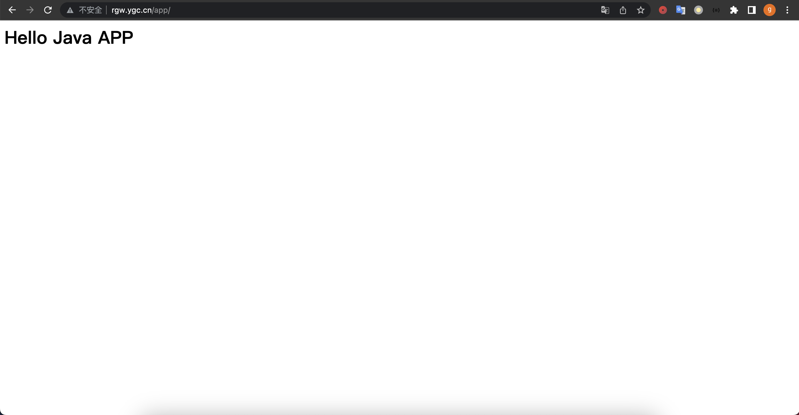
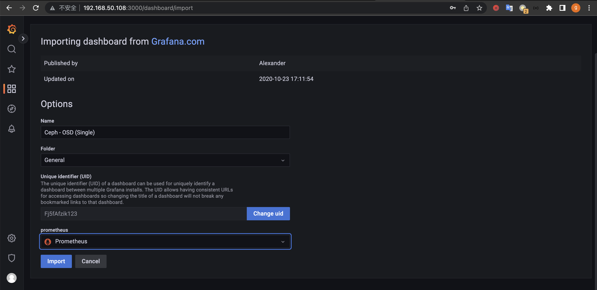

# 1. 掌握对象存储的特点及使用场景
## 1.1 RadosGW 对象存储网关简介
* RadosGW 是对象存储(OSS,Object Storage Service)的一种访问实现方式，RADOS 网关也 称为 Ceph 对象网关、RadosGW、RGW，是一种服务，使客户端能够利用标准对象存储 API 来访问 Ceph 集群，它支持 AWS S3 和 Swift API，在 ceph 0.8 版本之后使用 Civetweb (https://github.com/civetweb/civetweb) 的 web 服务器来响应 api 请求，客户端使用 http/https 协议通过 RESTful API 与 RGW 通信，而 RGW 则通过 librados 与 ceph 集群通 信，RGW 客户端通过 s3 或者 swift api 使用 RGW 用户进行身份验证，然后 RGW 网关代 表用户利用 cephx 与 ceph 存储进行身份验证。
* S3 由 Amazon 于 2006 年推出，全称为 Simple Storage Service,S3 定义了对象存储，是对 象存储事实上的标准，从某种意义上说，S3 就是对象存储，对象存储就是 S3,它是对象存 储市场的霸主，后续的对象存储都是对 S3 的模仿
## 1.2 RadosGW 存储特点
* 通过对象存储网关将数据存储为对象，每个对象除了包含数据，还包含数据自身的元数据。
* 对象通过 Object ID 来检索，无法通过普通文件系统的挂载方式通过文件路径加文件名称操 作来直接访问对象，只能通过 API 来访问，或者第三方客户端(实际上也是对 API 的封装)
* 对象的存储不是垂直的目录树结构，而是存储在扁平的命名空间中，Amazon S3 将这个扁 平命名空间称为 bucket，而 swift 则将其称为容器。
* 无论是 bucket 还是容器，都不能再嵌套(在 bucket 不能再包含 bucket)。
* bucket 需要被授权才能访问到，一个帐户可以对多个 bucket 授权，而权限可以不同。
* 方便横向扩展、快速检索数据。
* 不支持客户端挂载,且需要客户端在访问的时候指定文件名称。
* 不是很适用于文件过于频繁修改及删除的场景。
* ceph 使用 bucket 作为存储桶(存储空间)，实现对象数据的存储和多用户隔离，数据存储在 bucket 中，用户的权限也是针对 bucket 进行授权，可以设置用户对不同的 bucket 拥有不同的权限，以实现权限管理。
## 1.3 bucket 特性
* 存储空间(bucket)是用于存储对象(Object)的容器，所有的对象都必须隶属于某个存储空 间，可以设置和修改存储空间属性用来控制地域、访问权限、生命周期等，这些属性设置直 接作用于该存储空间内所有对象，因此可以通过灵活创建不同的存储空间来完成不同的管理 功能。
* 同一个存储空间的内部是扁平的，没有文件系统的目录等概念，所有的对象都直接隶属于其 对应的存储空间。
* 每个用户可以拥有多个存储空间
* 存储空间的名称在 OSS 范围内必须是全局唯一的，一旦创建之后无法修改名称。
* 存储空间内部的对象数目没有限制。
## 1.4 对应存储使用场景
* 边缘存储
  * 在大规模边缘节点和用户侧部署服务，加速数据存储至边缘，并最终将持久化数据保存至中心，有效解决数据上传链路差，带宽利用率低等行业痛点，降低本地存储成本。
* 内容加速分发
  * 面对文件、游戏等热点资源分发的业务场景，您可以使用对象存储作为源站，搭配 CDN 进行加速分发，方便您通过 CDN 节点就近访问资源，提升用户体验。
* 多媒体数据处理
  * 针对有海量用户生成内容的场景，对象存储服务的高并发能力可以灵活应对大流量的业务场景。对存储在云端的图片、音视频等文件进行数据处理。
* 静态资源托管
  * 结合CDN加速、云服务器等产品，可实现对静态网站的托管，对大多数企业来说，可减轻管理上的负担
* 在线视频点播
  * 结合媒体处理、CDN等云产品，可快速搭建一个安全、高可用的在线点播平台。
* 备份归档
  * 对象存储可用于各种企业应用、数据库和非结构化数据的备份和归档。在需要使用时，可直接将存储的数据恢复到灾备主机或测试主机中。
* 智能视频监控
    * 监控视频数据量大，企业可通过使用对象存储产品，降低存储成本。监控设备将视频上传至云服务提供商平台后，平台对视频切片处理后存入对象存储。如需观看，再从对象存储传输到观看视频的终端设备即可。
# 2. 在两台主机部署radowsgw存储网关以实现高可用环境
* 将 ceph-mgr1、ceph-mgr2 服务器部署为高可用的 radosGW 服务
## 2.1 radosgw安装和验证
### 2.1.1 安装 radosgw 服务并初始化
```bash
root@ceph-mgr1:~# apt install radosgw
root@ceph-mgr2:~# apt install radosgw
cephadmin@ceph-deploy:~/ceph-cluster$ ceph-deploy rgw create ceph-mgr1
cephadmin@ceph-deploy:~/ceph-cluster$ ceph-deploy rgw create ceph-mgr2
```
### 2.1.2 验证 radosgw 服务状态
```bash
cephadmin@ceph-deploy:~/ceph-cluster$ ceph -s
  cluster:
    id:     97a6b32d-4af8-4dde-b3f5-f5ae5db0824f
    health: HEALTH_OK

  services:
    mon: 3 daemons, quorum ceph-mon1,ceph-mon2,ceph-mon3 (age 15m)
    mgr: ceph-mgr1(active, since 15m), standbys: ceph-mgr2
    mds: 2/2 daemons up, 2 standby
    osd: 16 osds: 16 up (since 15m), 16 in (since 13d)
    rgw: 2 daemons active (2 hosts, 1 zones)

  data:
    volumes: 1/1 healthy
    pools:   9 pools, 289 pgs
    objects: 339 objects, 230 MiB
    usage:   741 MiB used, 64 TiB / 64 TiB avail
    pgs:     0.346% pgs not active
             288 active+clean
             1   peering

  progress:
```
### 2.1.3 验证 radosgw 服务进程
```bash
root@ceph-mgr1:~# ps aux | grep radosgw
ceph       19242  0.6  2.8 6276464 56712 ?       Ssl  14:29   0:00 /usr/bin/radosgw -f --cluster ceph --name client.rgw.ceph-mgr1 --setuser ceph --setgroup ceph
root       19910  0.0  0.0  14436  1092 pts/0    S+   14:31   0:00 grep --color=auto radosgw
root@ceph-mgr2:~# ps aux | grep radosgw
ceph       19261  0.6  2.8 6276488 57124 ?       Ssl  14:29   0:00 /usr/bin/radosgw -f --cluster ceph --name client.rgw.ceph-mgr2 --setuser ceph --setgroup ceph
root       19949  0.0  0.0  14436  1116 pts/0    S+   14:31   0:00 grep --color=auto radosgw
```
### 2.1.4 radosgw 的存储池类型
```bash
cephadmin@ceph-deploy:~/ceph-cluster$  ceph osd pool ls
device_health_metrics
cephfs-metadata
cephfs-data
mypool
rbd-data1
.rgw.root
default.rgw.log
default.rgw.control
default.rgw.meta
## 查看默认 radosgw 的存储池信息
cephadmin@ceph-deploy:~/ceph-cluster$ radosgw-admin zone get --rgw-zone=default --rgw-zonegroup=default
{
    "id": "b961bbbb-a90b-4b7e-b810-4a59fed5f107",
    "name": "default",
    "domain_root": "default.rgw.meta:root",
    "control_pool": "default.rgw.control",
    "gc_pool": "default.rgw.log:gc",
    "lc_pool": "default.rgw.log:lc",
    "log_pool": "default.rgw.log",
    "intent_log_pool": "default.rgw.log:intent",
    "usage_log_pool": "default.rgw.log:usage",
    "roles_pool": "default.rgw.meta:roles",
    "reshard_pool": "default.rgw.log:reshard",
    "user_keys_pool": "default.rgw.meta:users.keys",
    "user_email_pool": "default.rgw.meta:users.email",
    "user_swift_pool": "default.rgw.meta:users.swift",
    "user_uid_pool": "default.rgw.meta:users.uid",
    "otp_pool": "default.rgw.otp",
    "system_key": {
        "access_key": "",
        "secret_key": ""
    },
    "placement_pools": [
        {
            "key": "default-placement",
            "val": {
                "index_pool": "default.rgw.buckets.index",
                "storage_classes": {
                    "STANDARD": {
                        "data_pool": "default.rgw.buckets.data"
                    }
                },
                "data_extra_pool": "default.rgw.buckets.non-ec",
                "index_type": 0
            }
        }
    ],
    "realm_id": "",
    "notif_pool": "default.rgw.log:notif"
}
##rgw pool 信息:
.rgw.root: 包含 realm(领域信息)，比如 zone 和 zonegroup。
default.rgw.log: 存储日志信息，用于记录各种 log 信息。
default.rgw.control: 系统控制池，在有数据更新时，通知其它 RGW 更新缓存。 default.rgw.meta: 元数据存储池，通过不同的名称空间分别存储不同的 rados 对象，这 些名称空间包括用戶UID 及其 bucket 映射信息的名称空间 users.uid、用戶的密钥名称空间 users.keys、用戶的 email 名称空间 users.email、用戶的 subuser 的名称空间 users.swift， 以及 bucket 的名称空间 root 等。
default.rgw.buckets.index: 存放 bucket 到 object 的索引信息。 default.rgw.buckets.data: 存放对象的数据。
default.rgw.buckets.non-ec #数据的额外信息存储池
default.rgw.users.uid: 存放用户信息的存储池。
default.rgw.data.root: 存放 bucket 的元数据，结构体对应 RGWBucketInfo，比如存放桶 名、桶 ID、data_pool 等。
## 默认是副本池
cephadmin@ceph-deploy:~/ceph-cluster$ ceph osd pool get default.rgw.log crush_rule
crush_rule: replicated_rule
## 默认3副本
cephadmin@ceph-deploy:~/ceph-cluster$ ceph osd pool get default.rgw.log size
size: 3
##默认的 pg 数量
cephadmin@ceph-deploy:~/ceph-cluster$ ceph osd pool get default.rgw.log pgp_num
pgp_num: 32
#默认放置组数量
cephadmin@ceph-deploy:~/ceph-cluster$ ceph osd pool get default.rgw.log pg_num
pg_num: 32
```
### 2.1.5 RGW 存储池功能
```bash
cephadmin@ceph-deploy:~/ceph-cluster$ ceph osd lspools
1 device_health_metrics
3 cephfs-metadata
4 cephfs-data
9 mypool
10 rbd-data1
11 .rgw.root
12 default.rgw.log
13 default.rgw.control
14 default.rgw.meta
```
### 2.1.6 验证 RGW zone 信息
```bash
cephadmin@ceph-deploy:~/ceph-cluster$ radosgw-admin zone get --rgw-zone=default
{
    "id": "b961bbbb-a90b-4b7e-b810-4a59fed5f107",
    "name": "default",
    "domain_root": "default.rgw.meta:root",
    "control_pool": "default.rgw.control",
    "gc_pool": "default.rgw.log:gc",
    "lc_pool": "default.rgw.log:lc",
    "log_pool": "default.rgw.log",
    "intent_log_pool": "default.rgw.log:intent",
    "usage_log_pool": "default.rgw.log:usage",
    "roles_pool": "default.rgw.meta:roles",
    "reshard_pool": "default.rgw.log:reshard",
    "user_keys_pool": "default.rgw.meta:users.keys",
    "user_email_pool": "default.rgw.meta:users.email",
    "user_swift_pool": "default.rgw.meta:users.swift",
    "user_uid_pool": "default.rgw.meta:users.uid",
    "otp_pool": "default.rgw.otp",
    "system_key": {
        "access_key": "",
        "secret_key": ""
    },
    "placement_pools": [
        {
            "key": "default-placement",
            "val": {
                "index_pool": "default.rgw.buckets.index",
                "storage_classes": {
                    "STANDARD": {
                        "data_pool": "default.rgw.buckets.data"
                    }
                },
                "data_extra_pool": "default.rgw.buckets.non-ec",
                "index_type": 0
            }
        }
    ],
    "realm_id": "",
    "notif_pool": "default.rgw.log:notif"
}
```
### 2.1.7 访问 radosgw 服务

## 2.2 radosgw 服务高可用配置
### 2.2.1 radosgw http 高可用
### 2.2.2 自定义 http 端口
* 配置文件可以在 ceph deploy 服务器修改然后统一推送，或者单独修改每个 radosgw 服务 器的配置为统一配置，然后重启 RGW 服务。
```bash
cephadmin@ceph-deploy:~/ceph-cluster$ vi ceph.conf
[global]
fsid = 97a6b32d-4af8-4dde-b3f5-f5ae5db0824f
public_network = 192.168.50.0/24
cluster_network = 11.0.1.0/24
mon_initial_members = ceph-mon1, ceph-mon2, ceph-mon3
mon_host = 192.168.50.105,192.168.50.106,192.168.50.107
auth_cluster_required = cephx
auth_service_required = cephx
auth_client_required = cephx
mon clock drift allowed = 2
mon clock drift warn backoff = 30

[mds.ceph-mgr2]
mds_standby_for_name = ceph-mgr1
mds_standby_replay = true

[mds.ceph-mgr1]
mds_standby_for_name = ceph-mgr2
mds_standby_replay = true

[mds.ceph-mon3]
mds_standby_for_name = ceph-mon2
mds_standby_replay = true

[mds.ceph-mon2]
mds_standby_for_name = ceph-mon3
mds_standby_replay = true

##添加ceph-mgr1 rgw自定义端口配置
[client.rgw.ceph-mgr1]
rgw_host = ceph-mgr1
rgw_frontends = civetweb port=9900

##添加ceph-mgr2 rgw自定义端口配置
[client.rgw.ceph-mgr2]
rgw_host = ceph-mgr2
rgw_frontends = civetweb port=9900
## 分发配置
cephadmin@ceph-deploy:~/ceph-cluster$ ceph-deploy --overwrite-conf config push ceph-mgr1
cephadmin@ceph-deploy:~/ceph-cluster$ ceph-deploy --overwrite-conf config push ceph-mgr2
## 重启服务
root@ceph-mgr1:~# systemctl restart ceph-radosgw@rgw.ceph-mgr1.service
root@ceph-mgr2:~# systemctl restart ceph-radosgw@rgw.ceph-mgr2.service
```
* 验证

### 2.2.3 实现高可用
```bash
## ceph-client1安装和配置haproxy
root@ceph-client1:~# apt install haproxy -y
root@ceph-client1:~# cat /etc/haproxy/haproxy.cfg  | grep -v "#"
global
	log /dev/log	local0
	log /dev/log	local1 notice
	chroot /var/lib/haproxy
	stats socket /run/haproxy/admin.sock mode 660 level admin expose-fd listeners
	stats timeout 30s
	user haproxy
	group haproxy
	daemon

	ca-base /etc/ssl/certs
	crt-base /etc/ssl/private

	ssl-default-bind-ciphers ECDH+AESGCM:DH+AESGCM:ECDH+AES256:DH+AES256:ECDH+AES128:DH+AES:RSA+AESGCM:RSA+AES:!aNULL:!MD5:!DSS
	ssl-default-bind-options no-sslv3

defaults
	log	global
	mode	http
	option	httplog
	option	dontlognull
        timeout connect 500s
        timeout client  500s
        timeout server  500s
	errorfile 400 /etc/haproxy/errors/400.http
	errorfile 403 /etc/haproxy/errors/403.http
	errorfile 408 /etc/haproxy/errors/408.http
	errorfile 500 /etc/haproxy/errors/500.http
	errorfile 502 /etc/haproxy/errors/502.http
	errorfile 503 /etc/haproxy/errors/503.http
	errorfile 504 /etc/haproxy/errors/504.http

listen ceph-rgw-9900
  bind *:9900
  mode tcp
  server ceph-mgr1 192.168.50.108:9900 check inter 3s fall 3 rise 5
  server ceph-mgr2 192.168.50.109:9900 check inter 3s fall 3 rise 5
root@ceph-client1:~# systemctl restart haproxy
root@ceph-client1:~# systemctl status haproxy
● haproxy.service - HAProxy Load Balancer
   Loaded: loaded (/lib/systemd/system/haproxy.service; enabled; vendor preset: enabled)
   Active: active (running) since Mon 2023-01-02 15:34:25 CST; 8s ago
     Docs: man:haproxy(1)
           file:/usr/share/doc/haproxy/configuration.txt.gz
  Process: 15096 ExecStartPre=/usr/sbin/haproxy -f $CONFIG -c -q $EXTRAOPTS (code=exited, status=0/SUCCESS)
 Main PID: 15104 (haproxy)
    Tasks: 2 (limit: 2287)
   CGroup: /system.slice/haproxy.service
           ├─15104 /usr/sbin/haproxy -Ws -f /etc/haproxy/haproxy.cfg -p /run/haproxy.pid
           └─15105 /usr/sbin/haproxy -Ws -f /etc/haproxy/haproxy.cfg -p /run/haproxy.pid

Jan 02 15:34:25 ceph-client1 systemd[1]: Starting HAProxy Load Balancer...
Jan 02 15:34:25 ceph-client1 haproxy[15104]: [WARNING] 001/153425 (15104) : parsing [/etc/haproxy/haproxy.cfg:26] : 'option httplog' not usab
Jan 02 15:34:25 ceph-client1 haproxy[15104]: Proxy ceph-rgw-9900 started.
Jan 02 15:34:25 ceph-client1 haproxy[15104]: Proxy ceph-rgw-9900 started.
Jan 02 15:34:25 ceph-client1 systemd[1]: Started HAProxy Load Balancer.
root@ceph-client1:~# ss -tnlp
State      Recv-Q      Send-Q            Local Address:Port           Peer Address:Port
LISTEN     0           128                     0.0.0.0:9900                0.0.0.0:*          users:(("haproxy",pid=15105,fd=7))
LISTEN     0           128               127.0.0.53%lo:53                  0.0.0.0:*          users:(("systemd-resolve",pid=590,fd=13))
LISTEN     0           128                     0.0.0.0:22                  0.0.0.0:*          users:(("sshd",pid=756,fd=3))
LISTEN     0           128                        [::]:22                     [::]:*          users:(("sshd",pid=756,fd=4))

## ceph-client2安装和配置haproxy
root@ceph-client2:~# apt install haproxy -y
root@ceph-client2:~#  cat /etc/haproxy/haproxy.cfg  | grep -v "#"
global
	log /dev/log	local0
	log /dev/log	local1 notice
	chroot /var/lib/haproxy
	stats socket /run/haproxy/admin.sock mode 660 level admin expose-fd listeners
	stats timeout 30s
	user haproxy
	group haproxy
	daemon

	ca-base /etc/ssl/certs
	crt-base /etc/ssl/private

	ssl-default-bind-ciphers ECDH+AESGCM:DH+AESGCM:ECDH+AES256:DH+AES256:ECDH+AES128:DH+AES:RSA+AESGCM:RSA+AES:!aNULL:!MD5:!DSS
	ssl-default-bind-options no-sslv3

defaults
	log	global
	mode	http
	option	httplog
	option	dontlognull
        timeout connect 500s
        timeout client  500s
        timeout server  500s
	errorfile 400 /etc/haproxy/errors/400.http
	errorfile 403 /etc/haproxy/errors/403.http
	errorfile 408 /etc/haproxy/errors/408.http
	errorfile 500 /etc/haproxy/errors/500.http
	errorfile 502 /etc/haproxy/errors/502.http
	errorfile 503 /etc/haproxy/errors/503.http
	errorfile 504 /etc/haproxy/errors/504.http

listen ceph-rgw-9900
  bind *:9900
  mode tcp
  server ceph-mgr1 192.168.50.108:9900 check inter 3s fall 3 rise 5
  server ceph-mgr2 192.168.50.109:9900 check inter 3s fall 3 rise 5
root@ceph-client2:~# systemctl restart haproxy
root@ceph-client2:~# systemctl status haproxy
● haproxy.service - HAProxy Load Balancer
   Loaded: loaded (/lib/systemd/system/haproxy.service; enabled; vendor preset: enabled)
   Active: active (running) since Mon 2023-01-02 15:36:25 CST; 7s ago
     Docs: man:haproxy(1)
           file:/usr/share/doc/haproxy/configuration.txt.gz
  Process: 14968 ExecStartPre=/usr/sbin/haproxy -f $CONFIG -c -q $EXTRAOPTS (code=exited, status=0/SUCCESS)
 Main PID: 14978 (haproxy)
    Tasks: 2 (limit: 2287)
   CGroup: /system.slice/haproxy.service
           ├─14978 /usr/sbin/haproxy -Ws -f /etc/haproxy/haproxy.cfg -p /run/haproxy.pid
           └─14982 /usr/sbin/haproxy -Ws -f /etc/haproxy/haproxy.cfg -p /run/haproxy.pid

Jan 02 15:36:25 ceph-client2 systemd[1]: Starting HAProxy Load Balancer...
Jan 02 15:36:25 ceph-client2 haproxy[14978]: [WARNING] 001/153625 (14978) : parsing [/etc/haproxy/haproxy.cfg:26] : 'option httplog' not usab
Jan 02 15:36:25 ceph-client2 haproxy[14978]: Proxy ceph-rgw-9900 started.
Jan 02 15:36:25 ceph-client2 haproxy[14978]: Proxy ceph-rgw-9900 started.
Jan 02 15:36:25 ceph-client2 systemd[1]: Started HAProxy Load Balancer.
root@ceph-client2:~# ss -tnlp
State      Recv-Q      Send-Q            Local Address:Port           Peer Address:Port
LISTEN     0           128               127.0.0.53%lo:53                  0.0.0.0:*          users:(("systemd-resolve",pid=606,fd=13))
LISTEN     0           128                     0.0.0.0:22                  0.0.0.0:*          users:(("sshd",pid=722,fd=3))
LISTEN     0           128                     0.0.0.0:9900                0.0.0.0:*          users:(("haproxy",pid=14982,fd=7))
LISTEN     0           128                        [::]:22                     [::]:*          users:(("sshd",pid=722,fd=4))

## ceph-client1安装keepalived
root@ceph-client1:~# apt install keepalived -y
root@ceph-client1:~# cp /usr/share/doc/keepalived/samples/keepalived.conf.vrrp /etc/keepalived/keepalived.conf
root@ceph-client1:~# vi /etc/keepalived/keepalived.conf
root@ceph-client1:~# systemctl restart keepalived
root@ceph-client1:~# ifconfig
eth0: flags=4163<UP,BROADCAST,RUNNING,MULTICAST>  mtu 1500
        inet 11.0.1.151  netmask 255.255.255.0  broadcast 11.0.1.255
        inet6 fe80::250:56ff:fe33:50c  prefixlen 64  scopeid 0x20<link>
        ether 00:50:56:33:05:0c  txqueuelen 1000  (Ethernet)
        RX packets 2485  bytes 3454539 (3.4 MB)
        RX errors 0  dropped 0  overruns 0  frame 0
        TX packets 432  bytes 33409 (33.4 KB)
        TX errors 0  dropped 0 overruns 0  carrier 0  collisions 0

eth1: flags=4163<UP,BROADCAST,RUNNING,MULTICAST>  mtu 1500
        inet 192.168.50.151  netmask 255.255.255.0  broadcast 192.168.50.255
        inet6 fe80::250:56ff:fe2b:172b  prefixlen 64  scopeid 0x20<link>
        ether 00:50:56:2b:17:2b  txqueuelen 1000  (Ethernet)
        RX packets 2505  bytes 271244 (271.2 KB)
        RX errors 0  dropped 0  overruns 0  frame 0
        TX packets 1486  bytes 238019 (238.0 KB)
        TX errors 0  dropped 0 overruns 0  carrier 0  collisions 0

eth1:0: flags=4163<UP,BROADCAST,RUNNING,MULTICAST>  mtu 1500
        inet 192.168.50.168  netmask 255.255.255.255  broadcast 0.0.0.0
        ether 00:50:56:2b:17:2b  txqueuelen 1000  (Ethernet)

lo: flags=73<UP,LOOPBACK,RUNNING>  mtu 65536
        inet 127.0.0.1  netmask 255.0.0.0
        inet6 ::1  prefixlen 128  scopeid 0x10<host>
        loop  txqueuelen 1000  (Local Loopback)
        RX packets 142  bytes 12019 (12.0 KB)
        RX errors 0  dropped 0  overruns 0  frame 0
        TX packets 142  bytes 12019 (12.0 KB)
        TX errors 0  dropped 0 overruns 0  carrier 0  collisions 0
## ceph-client2安装keepalived
root@ceph-client2:~# apt install keepalived -y
root@ceph-client2:~# cp /usr/share/doc/keepalived/samples/keepalived.conf.vrrp /etc/keepalived/keepalived.conf
root@ceph-client2:~# vi /etc/keepalived/keepalived.conf
root@ceph-client2:~# systemctl restart keepalived
root@ceph-client2:~# ifconfig
eth0: flags=4163<UP,BROADCAST,RUNNING,MULTICAST>  mtu 1500
        inet 11.0.1.152  netmask 255.255.255.0  broadcast 11.0.1.255
        inet6 fe80::250:56ff:fe26:40fc  prefixlen 64  scopeid 0x20<link>
        ether 00:50:56:26:40:fc  txqueuelen 1000  (Ethernet)
        RX packets 1707  bytes 2191952 (2.1 MB)
        RX errors 0  dropped 0  overruns 0  frame 0
        TX packets 258  bytes 22117 (22.1 KB)
        TX errors 0  dropped 0 overruns 0  carrier 0  collisions 0

eth1: flags=4163<UP,BROADCAST,RUNNING,MULTICAST>  mtu 1500
        inet 192.168.50.152  netmask 255.255.255.0  broadcast 192.168.50.255
        inet6 fe80::250:56ff:fe25:8f07  prefixlen 64  scopeid 0x20<link>
        ether 00:50:56:25:8f:07  txqueuelen 1000  (Ethernet)
        RX packets 1026  bytes 148436 (148.4 KB)
        RX errors 0  dropped 0  overruns 0  frame 0
        TX packets 506  bytes 92769 (92.7 KB)
        TX errors 0  dropped 0 overruns 0  carrier 0  collisions 0

lo: flags=73<UP,LOOPBACK,RUNNING>  mtu 65536
        inet 127.0.0.1  netmask 255.0.0.0
        inet6 ::1  prefixlen 128  scopeid 0x10<host>
        loop  txqueuelen 1000  (Local Loopback)
        RX packets 60  bytes 5668 (5.6 KB)
        RX errors 0  dropped 0  overruns 0  frame 0
        TX packets 60  bytes 5668 (5.6 KB)
        TX errors 0  dropped 0 overruns 0  carrier 0  collisions 0

```
### 2.2.4 测试 http 反向代理

### 2.2.5 测试高可用
```bash
## ceph-client1关闭haproxy
root@ceph-client1:~# systemctl stop haproxy
root@ceph-client1:~# ifconfig
eth0: flags=4163<UP,BROADCAST,RUNNING,MULTICAST>  mtu 1500
        inet 11.0.1.151  netmask 255.255.255.0  broadcast 11.0.1.255
        inet6 fe80::250:56ff:fe33:50c  prefixlen 64  scopeid 0x20<link>
        ether 00:50:56:33:05:0c  txqueuelen 1000  (Ethernet)
        RX packets 2500  bytes 3455835 (3.4 MB)
        RX errors 0  dropped 0  overruns 0  frame 0
        TX packets 435  bytes 33619 (33.6 KB)
        TX errors 0  dropped 0 overruns 0  carrier 0  collisions 0

eth1: flags=4163<UP,BROADCAST,RUNNING,MULTICAST>  mtu 1500
        inet 192.168.50.151  netmask 255.255.255.0  broadcast 192.168.50.255
        inet6 fe80::250:56ff:fe2b:172b  prefixlen 64  scopeid 0x20<link>
        ether 00:50:56:2b:17:2b  txqueuelen 1000  (Ethernet)
        RX packets 4864  bytes 481560 (481.5 KB)
        RX errors 0  dropped 0  overruns 0  frame 0
        TX packets 5095  bytes 548069 (548.0 KB)
        TX errors 0  dropped 0 overruns 0  carrier 0  collisions 0

lo: flags=73<UP,LOOPBACK,RUNNING>  mtu 65536
        inet 127.0.0.1  netmask 255.0.0.0
        inet6 ::1  prefixlen 128  scopeid 0x10<host>
        loop  txqueuelen 1000  (Local Loopback)
        RX packets 150  bytes 12747 (12.7 KB)
        RX errors 0  dropped 0  overruns 0  frame 0
        TX packets 150  bytes 12747 (12.7 KB)
        TX errors 0  dropped 0 overruns 0  carrier 0  collisions 0
##VIP已经漂移到 ceph-client1
root@ceph-client2:~# ifconfig
eth0: flags=4163<UP,BROADCAST,RUNNING,MULTICAST>  mtu 1500
        inet 11.0.1.152  netmask 255.255.255.0  broadcast 11.0.1.255
        inet6 fe80::250:56ff:fe26:40fc  prefixlen 64  scopeid 0x20<link>
        ether 00:50:56:26:40:fc  txqueuelen 1000  (Ethernet)
        RX packets 2599  bytes 3479972 (3.4 MB)
        RX errors 0  dropped 0  overruns 0  frame 0
        TX packets 339  bytes 27925 (27.9 KB)
        TX errors 0  dropped 0 overruns 0  carrier 0  collisions 0

eth1: flags=4163<UP,BROADCAST,RUNNING,MULTICAST>  mtu 1500
        inet 192.168.50.152  netmask 255.255.255.0  broadcast 192.168.50.255
        inet6 fe80::250:56ff:fe25:8f07  prefixlen 64  scopeid 0x20<link>
        ether 00:50:56:25:8f:07  txqueuelen 1000  (Ethernet)
        RX packets 3747  bytes 355498 (355.4 KB)
        RX errors 0  dropped 0  overruns 0  frame 0
        TX packets 2340  bytes 272959 (272.9 KB)
        TX errors 0  dropped 0 overruns 0  carrier 0  collisions 0

eth1:0: flags=4163<UP,BROADCAST,RUNNING,MULTICAST>  mtu 1500
        inet 192.168.50.168  netmask 255.255.255.255  broadcast 0.0.0.0
        ether 00:50:56:25:8f:07  txqueuelen 1000  (Ethernet)

lo: flags=73<UP,LOOPBACK,RUNNING>  mtu 65536
        inet 127.0.0.1  netmask 255.0.0.0
        inet6 ::1  prefixlen 128  scopeid 0x10<host>
        loop  txqueuelen 1000  (Local Loopback)
        RX packets 78  bytes 7392 (7.3 KB)
        RX errors 0  dropped 0  overruns 0  frame 0
        TX packets 78  bytes 7392 (7.3 KB)
        TX errors 0  dropped 0 overruns 0  carrier 0  collisions 0
```
* 测试ceph-clinet1 haproxy rgw服务访问

* ceph-clinet1 haproxy恢复
```bash
## ceph-clinet1启动haproxy,vip漂移到ceph-clinet1
root@ceph-client1:~# systemctl start haproxy
root@ceph-client1:~# ifconfig
eth0: flags=4163<UP,BROADCAST,RUNNING,MULTICAST>  mtu 1500
        inet 11.0.1.151  netmask 255.255.255.0  broadcast 11.0.1.255
        inet6 fe80::250:56ff:fe33:50c  prefixlen 64  scopeid 0x20<link>
        ether 00:50:56:33:05:0c  txqueuelen 1000  (Ethernet)
        RX packets 2501  bytes 3455895 (3.4 MB)
        RX errors 0  dropped 0  overruns 0  frame 0
        TX packets 435  bytes 33619 (33.6 KB)
        TX errors 0  dropped 0 overruns 0  carrier 0  collisions 0

eth1: flags=4163<UP,BROADCAST,RUNNING,MULTICAST>  mtu 1500
        inet 192.168.50.151  netmask 255.255.255.0  broadcast 192.168.50.255
        inet6 fe80::250:56ff:fe2b:172b  prefixlen 64  scopeid 0x20<link>
        ether 00:50:56:2b:17:2b  txqueuelen 1000  (Ethernet)
        RX packets 5243  bytes 509452 (509.4 KB)
        RX errors 0  dropped 0  overruns 0  frame 0
        TX packets 5149  bytes 555635 (555.6 KB)
        TX errors 0  dropped 0 overruns 0  carrier 0  collisions 0

eth1:0: flags=4163<UP,BROADCAST,RUNNING,MULTICAST>  mtu 1500
        inet 192.168.50.168  netmask 255.255.255.255  broadcast 0.0.0.0
        ether 00:50:56:2b:17:2b  txqueuelen 1000  (Ethernet)

lo: flags=73<UP,LOOPBACK,RUNNING>  mtu 65536
        inet 127.0.0.1  netmask 255.0.0.0
        inet6 ::1  prefixlen 128  scopeid 0x10<host>
        loop  txqueuelen 1000  (Local Loopback)
        RX packets 150  bytes 12747 (12.7 KB)
        RX errors 0  dropped 0  overruns 0  frame 0
        TX packets 150  bytes 12747 (12.7 KB)
        TX errors 0  dropped 0 overruns 0  carrier 0  collisions 0
## ceph-client2 网卡信息
root@ceph-client2:~# ifconfig
eth0: flags=4163<UP,BROADCAST,RUNNING,MULTICAST>  mtu 1500
        inet 11.0.1.152  netmask 255.255.255.0  broadcast 11.0.1.255
        inet6 fe80::250:56ff:fe26:40fc  prefixlen 64  scopeid 0x20<link>
        ether 00:50:56:26:40:fc  txqueuelen 1000  (Ethernet)
        RX packets 2600  bytes 3480032 (3.4 MB)
        RX errors 0  dropped 0  overruns 0  frame 0
        TX packets 339  bytes 27925 (27.9 KB)
        TX errors 0  dropped 0 overruns 0  carrier 0  collisions 0

eth1: flags=4163<UP,BROADCAST,RUNNING,MULTICAST>  mtu 1500
        inet 192.168.50.152  netmask 255.255.255.0  broadcast 192.168.50.255
        inet6 fe80::250:56ff:fe25:8f07  prefixlen 64  scopeid 0x20<link>
        ether 00:50:56:25:8f:07  txqueuelen 1000  (Ethernet)
        RX packets 4231  bytes 395424 (395.4 KB)
        RX errors 0  dropped 0  overruns 0  frame 0
        TX packets 3124  bytes 329349 (329.3 KB)
        TX errors 0  dropped 0 overruns 0  carrier 0  collisions 0

lo: flags=73<UP,LOOPBACK,RUNNING>  mtu 65536
        inet 127.0.0.1  netmask 255.0.0.0
        inet6 ::1  prefixlen 128  scopeid 0x10<host>
        loop  txqueuelen 1000  (Local Loopback)
        RX packets 78  bytes 7392 (7.3 KB)
        RX errors 0  dropped 0  overruns 0  frame 0
        TX packets 78  bytes 7392 (7.3 KB)
        TX errors 0  dropped 0 overruns 0  carrier 0  collisions 0
```
### 2.2.6 radosgw https
* 在 ceph-deploy 节点生成签名证书,分发证书，配置 radosgw 启用 SSL，重新分发配置文件
```bash
## 自签名证书
root@ceph-deploy:~# cd /etc/ceph/
root@ceph-deploy:/etc/ceph# mkdir certs
root@ceph-deploy:/etc/ceph# cd certs/
root@ceph-deploy:/etc/ceph/certs# openssl genrsa -out civetweb.key 2048
Generating RSA private key, 2048 bit long modulus (2 primes)
..............................................................+++++
.................................+++++
e is 65537 (0x010001)
root@ceph-deploy:/etc/ceph/certs# openssl req -new -x509 -key civetweb.key -out civetweb.crt -subj "/CN=rgw.ygc.cn"
root@ceph-deploy:/etc/ceph/certs# cat civetweb.key civetweb.crt > civetweb.pem
root@ceph-deploy:/etc/ceph/certs# tree
.
├── civetweb.crt
├── civetweb.key
└── civetweb.pem

0 directories, 3 files
## mgr1、mgr2创建证书目录
root@ceph-mgr1:~# mkdir /etc/ceph/certs/
root@ceph-mgr2:~# mkdir /etc/ceph/certs/
## 同步证书
root@ceph-deploy:/etc/ceph/certs# scp civetweb.pem ceph-mgr1:/etc/ceph/certs/
The authenticity of host 'ceph-mgr1 (11.0.1.108)' can't be established.
ECDSA key fingerprint is SHA256:qW05ZuB6zoP0WiOSVa/KNK8W3LKJwLEf93Lj847HpUo.
Are you sure you want to continue connecting (yes/no)? yes
Warning: Permanently added 'ceph-mgr1,11.0.1.108' (ECDSA) to the list of known hosts.
root@ceph-mgr1's password:
civetweb.pem                                                                                               100% 2790     6.3MB/s   00:00
root@ceph-deploy:/etc/ceph/certs# scp civetweb.pem ceph-mgr2:/etc/ceph/certs/
The authenticity of host 'ceph-mgr2 (11.0.1.109)' can't be established.
ECDSA key fingerprint is SHA256:qW05ZuB6zoP0WiOSVa/KNK8W3LKJwLEf93Lj847HpUo.
Are you sure you want to continue connecting (yes/no)? yes
Warning: Permanently added 'ceph-mgr2,11.0.1.109' (ECDSA) to the list of known hosts.
root@ceph-mgr2's password:
civetweb.pem
## 重新分发配置文件
root@ceph-deploy:/etc/ceph/certs# su - cephadmin
cephadmin@ceph-deploy:~$ cd ceph-cluster/
cephadmin@ceph-deploy:~/ceph-cluster$ vi ceph.conf
[global]
fsid = 97a6b32d-4af8-4dde-b3f5-f5ae5db0824f
public_network = 192.168.50.0/24
cluster_network = 11.0.1.0/24
mon_initial_members = ceph-mon1, ceph-mon2, ceph-mon3
mon_host = 192.168.50.105,192.168.50.106,192.168.50.107
auth_cluster_required = cephx
auth_service_required = cephx
auth_client_required = cephx
mon clock drift allowed = 2
mon clock drift warn backoff = 30

[mds.ceph-mgr2]
mds_standby_for_name = ceph-mgr1
mds_standby_replay = true

[mds.ceph-mgr1]
mds_standby_for_name = ceph-mgr2
mds_standby_replay = true

[mds.ceph-mon3]
mds_standby_for_name = ceph-mon2
mds_standby_replay = true

[mds.ceph-mon2]
mds_standby_for_name = ceph-mon3
mds_standby_replay = true

[client.rgw.ceph-mgr1]
rgw_host = ceph-mgr1
rgw_frontends = "civetweb port=9900+9443s ssl_certificate=/etc/ceph/certs/civetweb.pem"

[client.rgw.ceph-mgr2]
rgw_host = ceph-mgr2
rgw_frontends = "civetweb port=9900+9443s ssl_certificate=/etc/ceph/certs/civetweb.pem"
cephadmin@ceph-deploy:~/ceph-cluster$ ceph-deploy --overwrite-conf config push ceph-mgr1
cephadmin@ceph-deploy:~/ceph-cluster$ ceph-deploy --overwrite-conf config push ceph-mgr2
## 重启radosgw，并验证端口监听
root@ceph-mgr1:~# systemctl restart ceph-radosgw@rgw.ceph-mgr1.service
root@ceph-mgr1:~# ss -tnlp
State      Recv-Q      Send-Q             Local Address:Port            Peer Address:Port
LISTEN     0           128               192.168.50.108:6802                 0.0.0.0:*         users:(("ceph-mgr",pid=721,fd=20))
LISTEN     0           128               192.168.50.108:6803                 0.0.0.0:*         users:(("ceph-mgr",pid=721,fd=26))
LISTEN     0           128                127.0.0.53%lo:53                   0.0.0.0:*         users:(("systemd-resolve",pid=607,fd=13))
LISTEN     0           128                      0.0.0.0:22                   0.0.0.0:*         users:(("sshd",pid=792,fd=3))
LISTEN     0           100                      0.0.0.0:25                   0.0.0.0:*         users:(("master",pid=1389,fd=13))
LISTEN     0           128                      0.0.0.0:9443                 0.0.0.0:*         users:(("radosgw",pid=21240,fd=74))
LISTEN     0           128                    127.0.0.1:39275                0.0.0.0:*         users:(("containerd",pid=733,fd=12))
LISTEN     0           128                      0.0.0.0:9900                 0.0.0.0:*         users:(("radosgw",pid=21240,fd=73))
LISTEN     0           128               192.168.50.108:6800                 0.0.0.0:*         users:(("ceph-mds",pid=719,fd=16))
LISTEN     0           128               192.168.50.108:6801                 0.0.0.0:*         users:(("ceph-mds",pid=719,fd=17))
LISTEN     0           128                         [::]:22                      [::]:*         users:(("sshd",pid=792,fd=4))
LISTEN     0           100                         [::]:25                      [::]:*         users:(("master",pid=1389,fd=14))
root@ceph-mgr2:~# systemctl restart ceph-radosgw@rgw.ceph-mgr2.service
You have new mail in /var/mail/root
root@ceph-mgr2:~# ss -tnlp
State      Recv-Q      Send-Q             Local Address:Port            Peer Address:Port
LISTEN     0           128                127.0.0.53%lo:53                   0.0.0.0:*         users:(("systemd-resolve",pid=564,fd=13))
LISTEN     0           128                      0.0.0.0:22                   0.0.0.0:*         users:(("sshd",pid=868,fd=3))
LISTEN     0           100                      0.0.0.0:25                   0.0.0.0:*         users:(("master",pid=1501,fd=13))
LISTEN     0           128                      0.0.0.0:9443                 0.0.0.0:*         users:(("radosgw",pid=21275,fd=74))
LISTEN     0           128                    127.0.0.1:45575                0.0.0.0:*         users:(("containerd",pid=849,fd=12))
LISTEN     0           128                      0.0.0.0:9900                 0.0.0.0:*         users:(("radosgw",pid=21275,fd=73))
LISTEN     0           128               192.168.50.109:6800                 0.0.0.0:*         users:(("ceph-mds",pid=831,fd=16))
LISTEN     0           128               192.168.50.109:6801                 0.0.0.0:*         users:(("ceph-mds",pid=831,fd=17))
LISTEN     0           128                         [::]:22                      [::]:*         users:(("sshd",pid=868,fd=4))
LISTEN     0           100                         [::]:25                      [::]:*         users:(("master",pid=1501,fd=14))
```
* 验证访问

### 2.2.7 radosgw https 高可用
* 通过负载均衡对 radosgw 进行反向代理，实现高可用
#### 2.2.7.1 域名解析至 VIP
* 先将域名解析至负载均衡的 IP
```bash
192.168.50.168  rgw.ygc.cn
```
#### 2.2.7.2 负载均衡配置
```bash
##ceph-client1和ceph-client2负载均衡配置监听及 realserver
root@ceph-client1:~# vi /etc/haproxy/haproxy.cfg
## ceph http proxy
listen ceph-rgw-9900
  bind *:9900
  mode tcp
  server ceph-mgr1 192.168.50.108:9900 check inter 3s fall 3 rise 5
  server ceph-mgr2 192.168.50.109:9900 check inter 3s fall 3 rise 5

## ceph https proxy
listen ceph-rgw-9443
  bind *:9443
  mode tcp
  server ceph-mgr1 192.168.50.108:9443 check inter 3s fall 3 rise 5
  server ceph-mgr2 192.168.50.109:9443 check inter 3s fall 3 rise 5
root@ceph-client1:~# systemctl restart haproxy

root@ceph-client2:~# vi /etc/haproxy/haproxy.cfg
## ceph http proxy
listen ceph-rgw-9900
  bind *:9900
  mode tcp
  server ceph-mgr1 192.168.50.108:9900 check inter 3s fall 3 rise 5
  server ceph-mgr2 192.168.50.109:9900 check inter 3s fall 3 rise 5

## ceph https proxy
listen ceph-rgw-9443
  bind *:9443
  mode tcp
  server ceph-mgr1 192.168.50.108:9443 check inter 3s fall 3 rise 5
  server ceph-mgr2 192.168.50.109:9443 check inter 3s fall 3 rise 5
root@ceph-client2:~# systemctl restart haproxy
```
* 测试访问


# 3. 基于s3cmd实现bucket的管理及数据的上传和下载
## 3.1 RGW Server 配置
```bash
## 修改配置文件
cephadmin@ceph-deploy:~/ceph-cluster$ vi ceph.conf
[client.rgw.ceph-mgr1]
rgw_host = ceph-mgr1
rgw_frontends = "civetweb port=9900+9443s ssl_certificate=/etc/ceph/certs/civetweb.pem"
rgw_dns_name = rgw.ygc.cn

[client.rgw.ceph-mgr2]
rgw_host = ceph-mgr2
rgw_frontends = "civetweb port=9900+9443s ssl_certificate=/etc/ceph/certs/civetweb.pem"
rgw_dns_name = rgw.ygc.cn
## 推送配置文件
cephadmin@ceph-deploy:~/ceph-cluster$ ceph-deploy --overwrite-conf config push ceph-mgr1
cephadmin@ceph-deploy:~/ceph-cluster$ ceph-deploy --overwrite-conf config push ceph-mgr2
## 重启radosgw服务
root@ceph-mgr1:~# systemctl status ceph-radosgw@rgw.ceph-mgr1.service
● ceph-radosgw@rgw.ceph-mgr1.service - Ceph rados gateway
   Loaded: loaded (/lib/systemd/system/ceph-radosgw@.service; indirect; vendor preset: enabled)
   Active: active (running) since Mon 2023-01-02 16:37:23 CST; 18s ago
 Main PID: 22081 (radosgw)
    Tasks: 603
   CGroup: /system.slice/system-ceph\x2dradosgw.slice/ceph-radosgw@rgw.ceph-mgr1.service
           └─22081 /usr/bin/radosgw -f --cluster ceph --name client.rgw.ceph-mgr1 --setuser ceph --setgroup ceph

Jan 02 16:37:23 ceph-mgr1 systemd[1]: Started Ceph rados gateway.
Jan 02 16:37:23 ceph-mgr1 radosgw[22081]: 2023-01-02T16:37:23.870+0800 7f48faffc3c0 -1 IMPORTANT: the civetweb frontend is now deprecated and
root@ceph-mgr2:~# systemctl restart ceph-radosgw@rgw.ceph-mgr2.service
You have new mail in /var/mail/root
root@ceph-mgr2:~# systemctl status ceph-radosgw@rgw.ceph-mgr2.service
● ceph-radosgw@rgw.ceph-mgr2.service - Ceph rados gateway
   Loaded: loaded (/lib/systemd/system/ceph-radosgw@.service; indirect; vendor preset: enabled)
   Active: active (running) since Mon 2023-01-02 16:37:29 CST; 25s ago
 Main PID: 22120 (radosgw)
    Tasks: 603
   CGroup: /system.slice/system-ceph\x2dradosgw.slice/ceph-radosgw@rgw.ceph-mgr2.service
           └─22120 /usr/bin/radosgw -f --cluster ceph --name client.rgw.ceph-mgr2 --setuser ceph --setgroup ceph

Jan 02 16:37:29 ceph-mgr2 systemd[1]: Started Ceph rados gateway.
Jan 02 16:37:30 ceph-mgr2 radosgw[22120]: 2023-01-02T16:37:30.042+0800 7fa6a03013c0 -1 IMPORTANT: the civetweb frontend is now deprecated an
```
## 3.2 创建 RGW 账户
```bash
cephadmin@ceph-deploy:~/ceph-cluster$ radosgw-admin user create --uid="user1" --display-name="user1"
{
    "user_id": "user1",
    "display_name": "user1",
    "email": "",
    "suspended": 0,
    "max_buckets": 1000,
    "subusers": [],
    "keys": [
        {
            "user": "user1",
            "access_key": "36RDFH45S2137TKH2L5U",
            "secret_key": "89gYitgB40CGBrhXkrkINLPoOgOh5I0im0zfcRiA"
        }
    ],
    "swift_keys": [],
    "caps": [],
    "op_mask": "read, write, delete",
    "default_placement": "",
    "default_storage_class": "",
    "placement_tags": [],
    "bucket_quota": {
        "enabled": false,
        "check_on_raw": false,
        "max_size": -1,
        "max_size_kb": 0,
        "max_objects": -1
    },
    "user_quota": {
        "enabled": false,
        "check_on_raw": false,
        "max_size": -1,
        "max_size_kb": 0,
        "max_objects": -1
    },
    "temp_url_keys": [],
    "type": "rgw",
    "mfa_ids": []
}
```
## 3.3 安装 s3cmd 客户端
```bash
cephadmin@ceph-deploy:~/ceph-cluster$ sudo apt-cache madison s3cmd
cephadmin@ceph-deploy:~/ceph-cluster$ sudo apt install s3cmd
```
## 3.4 配置 s3cmd 客户端执行环境
```bash
## s3cmd 客户端添加域名解析
cephadmin@ceph-deploy:~/ceph-cluster$ cat /etc/hosts
127.0.0.1	localhost
127.0.1.1	ubuntu

# The following lines are desirable for IPv6 capable hosts
::1     localhost ip6-localhost ip6-loopback
ff02::1 ip6-allnodes
ff02::2 ip6-allrouters

11.0.1.100	ceph-deploy.example.local	ceph-deploy
11.0.1.101	ceph-node1.example.local	ceph-node1
11.0.1.102	ceph-node2.example.local	ceph-node2
11.0.1.103	ceph-node3.example.local	ceph-node3
11.0.1.104	ceph-node4.example.local	ceph-node4
11.0.1.105	ceph-mon1.example.local		ceph-mon1
11.0.1.106	ceph-mon2.example.local		ceph-mon2
11.0.1.107	ceph-mon3.example.local		ceph-mon3
11.0.1.108	ceph-mgr1.example.local		ceph-mgr1
11.0.1.109	ceph-mgr2.example.local		ceph-mgr2

## 将域名解析到负载均衡
192.168.50.168 rgw.ygc.cn
## 配置命令执行环境
root@ceph-deploy:~# s3cmd --configure

Enter new values or accept defaults in brackets with Enter.
Refer to user manual for detailed description of all options.

Access key and Secret key are your identifiers for Amazon S3. Leave them empty for using the env variables.
Access Key: 36RDFH45S2137TKH2L5U #输入用户 access key
Secret Key: 89gYitgB40CGBrhXkrkINLPoOgOh5I0im0zfcRiA #输入用户 secret key
Default Region [US]: #region 选项,直接回车

Use "s3.amazonaws.com" for S3 Endpoint and not modify it to the target Amazon S3.
S3 Endpoint [s3.amazonaws.com]: rgw.ygc.cn:9900 #RGW 域名

Use "%(bucket)s.s3.amazonaws.com" to the target Amazon S3. "%(bucket)s" and "%(location)s" vars can be used
if the target S3 system supports dns based buckets.
DNS-style bucket+hostname:port template for accessing a bucket [%(bucket)s.s3.amazonaws.com]: rgw.ygc.cn:9900/%(bucket) #bucket 域名格式

Encryption password is used to protect your files from reading
by unauthorized persons while in transfer to S3
Encryption password: #密码,直接回车
Path to GPG program [/usr/bin/gpg]: #gpg 命令路径，用于认证管理,直接回车

When using secure HTTPS protocol all communication with Amazon S3
servers is protected from 3rd party eavesdropping. This method is
slower than plain HTTP, and can only be proxied with Python 2.7 or newer
Use HTTPS protocol [Yes]: No #是否使用 https,No

On some networks all internet access must go through a HTTP proxy.
Try setting it here if you can't connect to S3 directly
HTTP Proxy server name: #代理,直接回车

New settings: #最终配置
  Access Key: 36RDFH45S2137TKH2L5U
  Secret Key: 89gYitgB40CGBrhXkrkINLPoOgOh5I0im0zfcRiA 
  Default Region: US 
  S3 Endpoint: rgw.ygc.cn:9900
  DNS-style bucket+hostname:port template for accessing a bucket: rgw.ygc.cn:9900/%(bucket)
  Encryption password: 
  Path to GPG program: /usr/bin/gpg 
  Use HTTPS protocol: False
  HTTP Proxy server name:
  HTTP Proxy server port: 0

Test access with supplied credentials? [Y/n] Y
Please wait, attempting to list all buckets...
Success. Your access key and secret key worked fine :-)

Now verifying that encryption works...
Not configured. Never mind.

Save settings? [y/N] y  #是否保存以上配置
Configuration saved to '/root/.s3cfg' #配置文件保存路径
```
## 3.5 验证认证文件
```bash
[default]
access_key = 36RDFH45S2137TKH2L5U
host_base = rgw.ygc.cn:9900
host_bucket = rgw.ygc.cn:9900/%(bucket)
secret_key = 89gYitgB40CGBrhXkrkINLPoOgOh5I0im0zfcRiA
```
## 3.6 命令行客户端 s3cmd 验证数据上传
```bash
## 查看帮助信息
root@ceph-deploy:~# s3cmd --help
Usage: s3cmd [options] COMMAND [parameters]

S3cmd is a tool for managing objects in Amazon S3 storage. It allows for
making and removing "buckets" and uploading, downloading and removing
"objects" from these buckets.

Options:
  -h, --help            show this help message and exit
  --configure           Invoke interactive (re)configuration tool. Optionally
                        use as '--configure s3://some-bucket' to test access
                        to a specific bucket instead of attempting to list
                        them all.
  -c FILE, --config=FILE
                        Config file name. Defaults to $HOME/.s3cfg
  --dump-config         Dump current configuration after parsing config files
                        and command line options and exit.
  --access_key=ACCESS_KEY
                        AWS Access Key
  --secret_key=SECRET_KEY
                        AWS Secret Key
  --access_token=ACCESS_TOKEN
                        AWS Access Token
  -n, --dry-run         Only show what should be uploaded or downloaded but
                        don't actually do it. May still perform S3 requests to
                        get bucket listings and other information though (only
                        for file transfer commands)
  -s, --ssl             Use HTTPS connection when communicating with S3.
                        (default)
  --no-ssl              Don't use HTTPS.
  -e, --encrypt         Encrypt files before uploading to S3.
  --no-encrypt          Don't encrypt files.
  -f, --force           Force overwrite and other dangerous operations.
  --continue            Continue getting a partially downloaded file (only for
                        [get] command).
  --continue-put        Continue uploading partially uploaded files or
                        multipart upload parts.  Restarts/parts files that
                        don't have matching size and md5.  Skips files/parts
                        that do.  Note: md5sum checks are not always
                        sufficient to check (part) file equality.  Enable this
                        at your own risk.
  --upload-id=UPLOAD_ID
                        UploadId for Multipart Upload, in case you want
                        continue an existing upload (equivalent to --continue-
                        put) and there are multiple partial uploads.  Use
                        s3cmd multipart [URI] to see what UploadIds are
                        associated with the given URI.
  --skip-existing       Skip over files that exist at the destination (only
                        for [get] and [sync] commands).
  -r, --recursive       Recursive upload, download or removal.
  --check-md5           Check MD5 sums when comparing files for [sync].
                        (default)
  --no-check-md5        Do not check MD5 sums when comparing files for [sync].
                        Only size will be compared. May significantly speed up
                        transfer but may also miss some changed files.
  -P, --acl-public      Store objects with ACL allowing read for anyone.
  --acl-private         Store objects with default ACL allowing access for you
                        only.
  --acl-grant=PERMISSION:EMAIL or USER_CANONICAL_ID
                        Grant stated permission to a given amazon user.
                        Permission is one of: read, write, read_acp,
                        write_acp, full_control, all
  --acl-revoke=PERMISSION:USER_CANONICAL_ID
                        Revoke stated permission for a given amazon user.
                        Permission is one of: read, write, read_acp,
                        write_acp, full_control, all
  -D NUM, --restore-days=NUM
                        Number of days to keep restored file available (only
                        for 'restore' command).
  --restore-priority=RESTORE_PRIORITY
                        Priority for restoring files from S3 Glacier (only for
                        'restore' command). Choices available: bulk, standard,
                        expedited
  --delete-removed      Delete destination objects with no corresponding
                        source file [sync]
  --no-delete-removed   Don't delete destination objects.
  --delete-after        Perform deletes after new uploads [sync]
  --delay-updates       *OBSOLETE* Put all updated files into place at end
                        [sync]
  --max-delete=NUM      Do not delete more than NUM files. [del] and [sync]
  --limit=NUM           Limit number of objects returned in the response body
                        (only for [ls] and [la] commands)
  --add-destination=ADDITIONAL_DESTINATIONS
                        Additional destination for parallel uploads, in
                        addition to last arg.  May be repeated.
  --delete-after-fetch  Delete remote objects after fetching to local file
                        (only for [get] and [sync] commands).
  -p, --preserve        Preserve filesystem attributes (mode, ownership,
                        timestamps). Default for [sync] command.
  --no-preserve         Don't store FS attributes
  --exclude=GLOB        Filenames and paths matching GLOB will be excluded
                        from sync
  --exclude-from=FILE   Read --exclude GLOBs from FILE
  --rexclude=REGEXP     Filenames and paths matching REGEXP (regular
                        expression) will be excluded from sync
  --rexclude-from=FILE  Read --rexclude REGEXPs from FILE
  --include=GLOB        Filenames and paths matching GLOB will be included
                        even if previously excluded by one of
                        --(r)exclude(-from) patterns
  --include-from=FILE   Read --include GLOBs from FILE
  --rinclude=REGEXP     Same as --include but uses REGEXP (regular expression)
                        instead of GLOB
  --rinclude-from=FILE  Read --rinclude REGEXPs from FILE
  --files-from=FILE     Read list of source-file names from FILE. Use - to
                        read from stdin.
  --region=REGION, --bucket-location=REGION
                        Region to create bucket in. As of now the regions are:
                        us-east-1, us-west-1, us-west-2, eu-west-1, eu-
                        central-1, ap-northeast-1, ap-southeast-1, ap-
                        southeast-2, sa-east-1
  --host=HOSTNAME       HOSTNAME:PORT for S3 endpoint (default:
                        s3.amazonaws.com, alternatives such as s3-eu-
                        west-1.amazonaws.com). You should also set --host-
                        bucket.
  --host-bucket=HOST_BUCKET
                        DNS-style bucket+hostname:port template for accessing
                        a bucket (default: %(bucket)s.s3.amazonaws.com)
  --reduced-redundancy, --rr
                        Store object with 'Reduced redundancy'. Lower per-GB
                        price. [put, cp, mv]
  --no-reduced-redundancy, --no-rr
                        Store object without 'Reduced redundancy'. Higher per-
                        GB price. [put, cp, mv]
  --storage-class=CLASS
                        Store object with specified CLASS (STANDARD,
                        STANDARD_IA, or REDUCED_REDUNDANCY). Lower per-GB
                        price. [put, cp, mv]
  --access-logging-target-prefix=LOG_TARGET_PREFIX
                        Target prefix for access logs (S3 URI) (for [cfmodify]
                        and [accesslog] commands)
  --no-access-logging   Disable access logging (for [cfmodify] and [accesslog]
                        commands)
  --default-mime-type=DEFAULT_MIME_TYPE
                        Default MIME-type for stored objects. Application
                        default is binary/octet-stream.
  -M, --guess-mime-type
                        Guess MIME-type of files by their extension or mime
                        magic. Fall back to default MIME-Type as specified by
                        --default-mime-type option
  --no-guess-mime-type  Don't guess MIME-type and use the default type
                        instead.
  --no-mime-magic       Don't use mime magic when guessing MIME-type.
  -m MIME/TYPE, --mime-type=MIME/TYPE
                        Force MIME-type. Override both --default-mime-type and
                        --guess-mime-type.
  --add-header=NAME:VALUE
                        Add a given HTTP header to the upload request. Can be
                        used multiple times. For instance set 'Expires' or
                        'Cache-Control' headers (or both) using this option.
  --remove-header=NAME  Remove a given HTTP header.  Can be used multiple
                        times.  For instance, remove 'Expires' or 'Cache-
                        Control' headers (or both) using this option. [modify]
  --server-side-encryption
                        Specifies that server-side encryption will be used
                        when putting objects. [put, sync, cp, modify]
  --server-side-encryption-kms-id=KMS_KEY
                        Specifies the key id used for server-side encryption
                        with AWS KMS-Managed Keys (SSE-KMS) when putting
                        objects. [put, sync, cp, modify]
  --encoding=ENCODING   Override autodetected terminal and filesystem encoding
                        (character set). Autodetected: UTF-8
  --add-encoding-exts=EXTENSIONs
                        Add encoding to these comma delimited extensions i.e.
                        (css,js,html) when uploading to S3 )
  --verbatim            Use the S3 name as given on the command line. No pre-
                        processing, encoding, etc. Use with caution!
  --disable-multipart   Disable multipart upload on files bigger than
                        --multipart-chunk-size-mb
  --multipart-chunk-size-mb=SIZE
                        Size of each chunk of a multipart upload. Files bigger
                        than SIZE are automatically uploaded as multithreaded-
                        multipart, smaller files are uploaded using the
                        traditional method. SIZE is in Mega-Bytes, default
                        chunk size is 15MB, minimum allowed chunk size is 5MB,
                        maximum is 5GB.
  --list-md5            Include MD5 sums in bucket listings (only for 'ls'
                        command).
  -H, --human-readable-sizes
                        Print sizes in human readable form (eg 1kB instead of
                        1234).
  --ws-index=WEBSITE_INDEX
                        Name of index-document (only for [ws-create] command)
  --ws-error=WEBSITE_ERROR
                        Name of error-document (only for [ws-create] command)
  --expiry-date=EXPIRY_DATE
                        Indicates when the expiration rule takes effect. (only
                        for [expire] command)
  --expiry-days=EXPIRY_DAYS
                        Indicates the number of days after object creation the
                        expiration rule takes effect. (only for [expire]
                        command)
  --expiry-prefix=EXPIRY_PREFIX
                        Identifying one or more objects with the prefix to
                        which the expiration rule applies. (only for [expire]
                        command)
  --progress            Display progress meter (default on TTY).
  --no-progress         Don't display progress meter (default on non-TTY).
  --stats               Give some file-transfer stats.
  --enable              Enable given CloudFront distribution (only for
                        [cfmodify] command)
  --disable             Disable given CloudFront distribution (only for
                        [cfmodify] command)
  --cf-invalidate       Invalidate the uploaded filed in CloudFront. Also see
                        [cfinval] command.
  --cf-invalidate-default-index
                        When using Custom Origin and S3 static website,
                        invalidate the default index file.
  --cf-no-invalidate-default-index-root
                        When using Custom Origin and S3 static website, don't
                        invalidate the path to the default index file.
  --cf-add-cname=CNAME  Add given CNAME to a CloudFront distribution (only for
                        [cfcreate] and [cfmodify] commands)
  --cf-remove-cname=CNAME
                        Remove given CNAME from a CloudFront distribution
                        (only for [cfmodify] command)
  --cf-comment=COMMENT  Set COMMENT for a given CloudFront distribution (only
                        for [cfcreate] and [cfmodify] commands)
  --cf-default-root-object=DEFAULT_ROOT_OBJECT
                        Set the default root object to return when no object
                        is specified in the URL. Use a relative path, i.e.
                        default/index.html instead of /default/index.html or
                        s3://bucket/default/index.html (only for [cfcreate]
                        and [cfmodify] commands)
  -v, --verbose         Enable verbose output.
  -d, --debug           Enable debug output.
  --version             Show s3cmd version (2.0.1) and exit.
  -F, --follow-symlinks
                        Follow symbolic links as if they are regular files
  --cache-file=FILE     Cache FILE containing local source MD5 values
  -q, --quiet           Silence output on stdout
  --ca-certs=CA_CERTS_FILE
                        Path to SSL CA certificate FILE (instead of system
                        default)
  --check-certificate   Check SSL certificate validity
  --no-check-certificate
                        Do not check SSL certificate validity
  --check-hostname      Check SSL certificate hostname validity
  --no-check-hostname   Do not check SSL certificate hostname validity
  --signature-v2        Use AWS Signature version 2 instead of newer signature
                        methods. Helpful for S3-like systems that don't have
                        AWS Signature v4 yet.
  --limit-rate=LIMITRATE
                        Limit the upload or download speed to amount bytes per
                        second.  Amount may be expressed in bytes, kilobytes
                        with the k suffix, or megabytes with the m suffix
  --requester-pays      Set the REQUESTER PAYS flag for operations
  -l, --long-listing    Produce long listing [ls]
  --stop-on-error       stop if error in transfer
  --content-disposition=CONTENT_DISPOSITION
                        Provide a Content-Disposition for signed URLs, e.g.,
                        "inline; filename=myvideo.mp4"
  --content-type=CONTENT_TYPE
                        Provide a Content-Type for signed URLs, e.g.,
                        "video/mp4"

Commands:
  Make bucket
      s3cmd mb s3://BUCKET
  Remove bucket
      s3cmd rb s3://BUCKET
  List objects or buckets
      s3cmd ls [s3://BUCKET[/PREFIX]]
  List all object in all buckets
      s3cmd la
  Put file into bucket
      s3cmd put FILE [FILE...] s3://BUCKET[/PREFIX]
  Get file from bucket
      s3cmd get s3://BUCKET/OBJECT LOCAL_FILE
  Delete file from bucket
      s3cmd del s3://BUCKET/OBJECT
  Delete file from bucket (alias for del)
      s3cmd rm s3://BUCKET/OBJECT
  Restore file from Glacier storage
      s3cmd restore s3://BUCKET/OBJECT
  Synchronize a directory tree to S3 (checks files freshness using size and md5 checksum, unless overridden by options, see below)
      s3cmd sync LOCAL_DIR s3://BUCKET[/PREFIX] or s3://BUCKET[/PREFIX] LOCAL_DIR
  Disk usage by buckets
      s3cmd du [s3://BUCKET[/PREFIX]]
  Get various information about Buckets or Files
      s3cmd info s3://BUCKET[/OBJECT]
  Copy object
      s3cmd cp s3://BUCKET1/OBJECT1 s3://BUCKET2[/OBJECT2]
  Modify object metadata
      s3cmd modify s3://BUCKET1/OBJECT
  Move object
      s3cmd mv s3://BUCKET1/OBJECT1 s3://BUCKET2[/OBJECT2]
  Modify Access control list for Bucket or Files
      s3cmd setacl s3://BUCKET[/OBJECT]
  Modify Bucket Policy
      s3cmd setpolicy FILE s3://BUCKET
  Delete Bucket Policy
      s3cmd delpolicy s3://BUCKET
  Modify Bucket CORS
      s3cmd setcors FILE s3://BUCKET
  Delete Bucket CORS
      s3cmd delcors s3://BUCKET
  Modify Bucket Requester Pays policy
      s3cmd payer s3://BUCKET
  Show multipart uploads
      s3cmd multipart s3://BUCKET [Id]
  Abort a multipart upload
      s3cmd abortmp s3://BUCKET/OBJECT Id
  List parts of a multipart upload
      s3cmd listmp s3://BUCKET/OBJECT Id
  Enable/disable bucket access logging
      s3cmd accesslog s3://BUCKET
  Sign arbitrary string using the secret key
      s3cmd sign STRING-TO-SIGN
  Sign an S3 URL to provide limited public access with expiry
      s3cmd signurl s3://BUCKET/OBJECT <expiry_epoch|+expiry_offset>
  Fix invalid file names in a bucket
      s3cmd fixbucket s3://BUCKET[/PREFIX]
  Create Website from bucket
      s3cmd ws-create s3://BUCKET
  Delete Website
      s3cmd ws-delete s3://BUCKET
  Info about Website
      s3cmd ws-info s3://BUCKET
  Set or delete expiration rule for the bucket
      s3cmd expire s3://BUCKET
  Upload a lifecycle policy for the bucket
      s3cmd setlifecycle FILE s3://BUCKET
  Get a lifecycle policy for the bucket
      s3cmd getlifecycle s3://BUCKET
  Remove a lifecycle policy for the bucket
      s3cmd dellifecycle s3://BUCKET
  List CloudFront distribution points
      s3cmd cflist
  Display CloudFront distribution point parameters
      s3cmd cfinfo [cf://DIST_ID]
  Create CloudFront distribution point
      s3cmd cfcreate s3://BUCKET
  Delete CloudFront distribution point
      s3cmd cfdelete cf://DIST_ID
  Change CloudFront distribution point parameters
      s3cmd cfmodify cf://DIST_ID
  Display CloudFront invalidation request(s) status
      s3cmd cfinvalinfo cf://DIST_ID[/INVAL_ID]

For more information, updates and news, visit the s3cmd website:
http://s3tools.org
## 创建 bucket 以验证权限
root@ceph-deploy:~# s3cmd mb s3://mybucket
Bucket 's3://mybucket/' created
root@ceph-deploy:~#  s3cmd mb s3://css
Bucket 's3://css/' created
root@ceph-deploy:~# s3cmd mb s3://images
Bucket 's3://images/' created
## 上传数据
root@ceph-deploy:~# wget "https://ygc.wiki/img/logo.png"
root@ceph-deploy:~# s3cmd put logo.png s3://mybucket/
upload: 'logo.png' -> 's3://mybucket/logo.png'  [1 of 1]
 909652 of 909652   100% in    1s   457.90 kB/s  done
## 验证数据
root@ceph-deploy:~# s3cmd ls s3://mybucket/
2023-01-02 09:00    909652   s3://mybucket/logo.png
## 验证下载文件
root@ceph-deploy:~# s3cmd get s3://mybucket/logo.png /opt/
download: 's3://mybucket/logo.png' -> '/opt/logo.png'  [1 of 1]
 909652 of 909652   100% in    0s    52.82 MB/s  done
root@ceph-deploy:~# ls /opt
logo.png
## 删除文件
root@ceph-deploy:~# s3cmd rm s3://mybucket/logo.png
delete: 's3://mybucket/logo.png'
## 验证是否被删除
root@ceph-deploy:~# s3cmd ls s3://mybucket/
root@ceph-deploy:~#
```

# 4. 基于Nginx+RGW的动静分离及短视频案例
## 4.1 对象存储创建bucket，并上传视频
```bash
## 创建bucket
root@ceph-deploy:~# s3cmd  mb s3://video
Bucket 's3://video/' created
root@ceph-deploy:~# vi video-bucket_policy
{
  "Version": "2012-10-17",
  "Statement": [{
    "Effect": "Allow",
    "Principal": "*",
    "Action": "s3:GetObject",
    "Resource": [
      "arn:aws:s3:::video/*"
    ]
  }]
}
## 应用授权
root@ceph-deploy:~# s3cmd setpolicy video-bucket_policy s3://video
s3://video/: Policy updated
## 查看bucket信息
root@ceph-deploy:~# s3cmd info s3://video
s3://video/ (bucket):
   Location:  default
   Payer:     BucketOwner
   Expiration Rule: none
   Policy:    b'{\n  "Version": "2012-10-17",\n  "Statement": [{\n    "Effect": "Allow",\n    "Principal": "*",\n    "Action": "s3:GetObject",\n    "Resource": [\n      "arn:aws:s3:::video/*"\n    ]\n  }]\n}\n'
   CORS:      none
   ACL:       user1: FULL_CONTROL
## 上传视频
root@ceph-deploy:~# cd video/
root@ceph-deploy:~/video# s3cmd put * s3://video
upload: '1.mp4' -> 's3://video/1.mp4'  [1 of 3]
 2514411 of 2514411   100% in    0s    17.58 MB/s  done
upload: '2.mp4' -> 's3://video/2.mp4'  [2 of 3]
 3267131 of 3267131   100% in    0s    19.66 MB/s  done
upload: '3.mp4' -> 's3://video/3.mp4'  [3 of 3]
 7368703 of 7368703   100% in    0s    22.02 MB/s  done
## 查看bucket内的视频
root@ceph-deploy:~/video# s3cmd ls s3://video
2023-01-03 12:27   2514411   s3://video/1.mp4
2023-01-03 12:27   3267131   s3://video/2.mp4
2023-01-03 12:27   7368703   s3://video/3.mp4
```
* 播放视频验证

## 4.2 配置nginx反向代理
```bash
## 安装编译依赖包
root@ceph-client1:~# apt  install iproute2  ntpdate  tcpdump telnet traceroute nfs-kernel-server nfs-common  lrzsz tree  openssl libssl-dev libpcre3 libpcre3-dev zlib1g-dev ntpdate tcpdump telnet traceroute  gcc openssh-server lrzsz tree  openssl libssl-dev libpcre3 libpcre3-dev zlib1g-dev ntpdate tcpdump telnet traceroute iotop unzip zip
root@ceph-client1:~# cd /usr/local/src/
## 下载nginx源码
root@ceph-client1:/usr/local/src# wget https://nginx.org/download/nginx-1.22.0.tar.gz
## 解压压缩包
root@ceph-client1:/usr/local/src# tar -xzvf nginx-1.22.0.tar.gz
root@ceph-client1:/usr/local/src# cd nginx-1.22.0/
## 生成makefile文件
root@ceph-client1:/usr/local/src/nginx-1.22.0# ./configure --prefix=/apps/nginx \
> --user=nginx  \
> --group=nginx \
> --with-http_ssl_module \
> --with-http_v2_module \
> --with-http_realip_module \
> --with-http_stub_status_module  \
> --with-http_gzip_static_module \
> --with-pcre \
> --with-stream \
> --with-stream_ssl_module \
> --with-stream_realip_module
## 编译与安装
root@ceph-client1:/usr/local/src/nginx-1.22.0# make && make install
root@ceph-client1:/usr/local/src/nginx-1.22.0# cd /apps/nginx/conf/
## 修改nginx配置
root@ceph-client1:/apps/nginx/conf# vi nginx.conf
user  root;
worker_processes  1;

events {
    worker_connections  1024;
}

http {
    include       mime.types;
    default_type  application/octet-stream;

    sendfile        on;

    keepalive_timeout  65;
    
    server {
        listen       80;
        server_name  rgw.ygc.cn;

        location / {
            root   html;
            index  index.html index.htm;
        }

        location ~* \.(mp4|avi)$ {
            proxy_pass http://192.168.50.168:9900;
        }
        
        error_page   500 502 503 504  /50x.html;
        location = /50x.html {
            root   html;
        }

    }

}
root@ceph-client1:/apps/nginx/conf# /apps/nginx/sbin/nginx -t
nginx: the configuration file /apps/nginx/conf/nginx.conf syntax is ok
nginx: configuration file /apps/nginx/conf/nginx.conf test is successful
root@ceph-client1:/apps/nginx/conf# /apps/nginx/sbin/nginx
```
* 测试nginx代理

## 4.3 代理动态java应用，测试用tomcat代替
```bash
## 安装tomcat9
root@ceph-client2:~# apt install tomcat9
root@ceph-client2:/etc/tomcat9# cd /var/lib/tomcat9/webapps/ROOT
root@ceph-client2:/var/lib/tomcat9/webapps/ROOT# mkdir app
root@ceph-client2:/var/lib/tomcat9/webapps/ROOT# cd app/
root@ceph-client2:/var/lib/tomcat9/webapps/ROOT/app# echo "<h1>Hello Java APP </h1>" >index.html
## 访问配置的测试页面
root@ceph-client2:/var/lib/tomcat9/webapps/ROOT/app# curl -lvs "localhost:8080/app/"
*   Trying ::1...
* TCP_NODELAY set
* Connected to localhost (::1) port 8080 (#0)
> GET /app/ HTTP/1.1
> Host: localhost:8080
> User-Agent: curl/7.58.0
> Accept: */*
>
< HTTP/1.1 200
< Accept-Ranges: bytes
< ETag: W/"25-1672750649630"
< Last-Modified: Tue, 03 Jan 2023 12:57:29 GMT
< Content-Type: text/html
< Content-Length: 25
< Date: Tue, 03 Jan 2023 12:58:40 GMT
<
<h1>Hello Java APP </h1>
* Connection #0 to host localhost left intact
## nginx 代理配置
root@ceph-client1:/apps/nginx/conf# vi nginx.conf
       location /app {
            proxy_pass http://192.168.50.152:8080;
        }
## 测试配置文件
root@ceph-client1:/apps/nginx/conf# /apps/nginx/sbin/nginx -t
nginx: the configuration file /apps/nginx/conf/nginx.conf syntax is ok
nginx: configuration file /apps/nginx/conf/nginx.conf test is successful
## 重新加载配置文件
root@ceph-client1:/apps/nginx/conf# /apps/nginx/sbin/nginx -s reload
```
* nginx 访问动态java app测试

* * nginx 访问静态视频测试

# 5. 启用ceph dashboard并基于prometheus监控ceph集群运行状态
## 5.1 启用 dashboard 插件
### 5.1.1 安装和配置dashboard 插件
* Ceph mgr 是一个多插件(模块化)的组件，其组件可以单独的启用或关闭,以下为在 ceph-deploy 服务器操作:
* 新版本需要安装 dashboard，而且必须安装在 mgr 节点，否则报错如下
```bash
The following packages have unmet dependencies:
ceph-mgr-dashboard : Depends: ceph-mgr (= 15.2.13-1~bpo10+1) but it is not going to
be installed
E: Unable to correct problems, you have held broken packages.
```
```bash
## 安装 dashboard
root@ceph-mgr1:~# apt-cache madison ceph-mgr-dashboard
ceph-mgr-dashboard | 16.2.10-1bionic | https://mirrors.tuna.tsinghua.edu.cn/ceph/debian-pacific bionic/main amd64 Packages
ceph-mgr-dashboard | 16.2.10-1bionic | https://mirrors.tuna.tsinghua.edu.cn/ceph/debian-pacific bionic/main i386 Packages
root@ceph-mgr1:~# apt install ceph-mgr-dashboard
## 查看帮助
cephadmin@ceph-deploy:~/ceph-cluster$ ceph mgr module -h
## 列出所有模块
cephadmin@ceph-deploy:~/ceph-cluster$ ceph mgr module ls
{
    "always_on_modules": [
        "balancer",
        "crash",
        "devicehealth",
        "orchestrator",
        "pg_autoscaler",
        "progress",
        "rbd_support",
        "status",
        "telemetry",
        "volumes"
    ],
    "enabled_modules": [  #已开启的模块
        "iostat",
        "nfs",
        "prometheus",
        "restful"
    ],
    "disabled_modules": [ #已关闭的模块
        {
            "name": "alerts",
            "can_run": true, #是否可以启用
            "error_string": "",
            "module_options": {
                "interval": {
                    "name": "interval",
                    "type": "secs",
                    "level": "advanced",
                    "flags": 1,
                    "default_value": "60",
                    "min": "",
                    "max": "",
                    "enum_allowed": [],
## 启用dashboard模块
cephadmin@ceph-deploy:~/ceph-cluster$ ceph mgr module enable dashboard
```
### 5.1.2 启用 dashboard 模块
```bash
## 关闭ssl
cephadmin@ceph-deploy:~/ceph-cluster$ ceph config set mgr mgr/dashboard/ssl false
## 指定 dashboard 监听地址
cephadmin@ceph-deploy:~/ceph-cluster$ ceph config set mgr mgr/dashboard/ceph-mgr1/server_addr 192.168.50.108
## 指定 dashboard 监听端口
cephadmin@ceph-deploy:~/ceph-cluster$ ceph config set mgr mgr/dashboard/ceph-mgr1/server_port 9009
## 验证 ceph 集群状态
cephadmin@ceph-deploy:~/ceph-cluster$ ceph -s
  cluster:
    id:     97a6b32d-4af8-4dde-b3f5-f5ae5db0824f
    health: HEALTH_OK

  services:
    mon: 3 daemons, quorum ceph-mon1,ceph-mon2,ceph-mon3 (age 32h)
    mgr: ceph-mgr1(active, since 4m), standbys: ceph-mgr2
    mds: 2/2 daemons up, 2 standby
    osd: 16 osds: 16 up (since 32h), 16 in (since 2w)
    rgw: 2 daemons active (2 hosts, 1 zones)

  data:
    volumes: 1/1 healthy
    pools:   11 pools, 305 pgs
    objects: 430 objects, 243 MiB
    usage:   1.3 GiB used, 64 TiB / 64 TiB avail
    pgs:     305 active+clean
```
* 第一次启用 dashboard 插件需要等一段时间(几分钟)，再去被启用的节点验证
```bash
如果有以下报错:
Module 'dashboard' has failed: error('No socket could be created',) 需要检查 mgr 服务是否正常运行，可以重启一遍 mgr 服务
```
### 5.1.3 在 mgr 节点验证端口与进程
```bash
## 重启mgr服务
root@ceph-mgr1:~# systemctl restart ceph-mgr@ceph-mgr1.service
## 验证端口
root@ceph-mgr1:~# lsof -i:9009
COMMAND    PID USER   FD   TYPE DEVICE SIZE/OFF NODE NAME
ceph-mgr 30608 ceph   40u  IPv4 308752      0t0  TCP ceph-mgr1:9009 (LISTEN)
```
### 5.1.4 dashboard 验证

### 5.1.5 设置 dashboard 账户及密码
```bash
cephadmin@ceph-deploy:~/ceph-cluster$ touch pass.txt
cephadmin@ceph-deploy:~/ceph-cluster$ echo "12345678" > pass.txt
cephadmin@ceph-deploy:~/ceph-cluster$ ceph dashboard
cephadmin@ceph-deploy:~/ceph-cluster$ ceph dashboard set-login-credentials ygc -i pass.txt

******************************************************************
***          WARNING: this command is deprecated.              ***
*** Please use the ac-user-* related commands to manage users. ***
******************************************************************
Username and password updated
cephadmin@ceph-deploy:~/ceph-cluster$ ceph dashboard set-login-credentials -h
Monitor commands:
 =================
dashboard set-login-credentials <username>                             Set the login credentials. Password read from -i <file>
```
### 5.1.5 dashboard 登录验证
* 登录界面

* 登录成功

### 5.1.6 dashboard集群信息
* 主机信息

* Monitor 节点信息

* OSD 状态

* 存储池信息

* Ceph 块存储镜像状态

* cephfs 状态

* 对象存储网关服务状态

* 用户信息

* 存储桶状态


## 5.2 部署prometheud
```bash
root@ceph-mgr2:~# mkdir /apps && cd /apps
root@ceph-mgr1:~# cd /usr/local/src/
root@ceph-mgr1:/usr/local/src# tar -xzvf prometheus-server-2.40.5-onekey-install.tar.gz
root@ceph-mgr1:/usr/local/src# bash prometheus-install.sh
root@ceph-mgr1:/usr/local/src# systemctl status prometheus
```
* 访问prometheus

## 5.3 部署 node_exporter
* 各 node 节点安装 node_exporter
```bash
root@ceph-node1:~# cd /usr/local/src/
root@ceph-node1:/usr/local/src# tar -xzvf node-exporter-1.5.0-onekey-install.tar.gz
root@ceph-node1:/usr/local/src# bash node-exporter-1.5.0-onekey-install.sh
root@ceph-node1:/usr/local/src# systemctl status node-exporter
root@ceph-node2:~# cd /usr/local/src/
root@ceph-node2:/usr/local/src# tar -xzvf node-exporter-1.5.0-onekey-install.tar.gz
root@ceph-node2:/usr/local/src# bash node-exporter-1.5.0-onekey-install.sh
root@ceph-node2:/usr/local/src# systemctl status node-exporter
root@ceph-node3:~# cd /usr/local/src/
root@ceph-node3:/usr/local/src# tar -xzvf node-exporter-1.5.0-onekey-install.tar.gz
root@ceph-node3:/usr/local/src# bash node-exporter-1.5.0-onekey-install.sh
root@ceph-node3:/usr/local/src# systemctl status node-exporter
root@ceph-node4:~# cd /usr/local/src/
root@ceph-node4:/usr/local/src# tar -xzvf node-exporter-1.5.0-onekey-install.tar.gz
root@ceph-node4:/usr/local/src# bash node-exporter-1.5.0-onekey-install.sh
root@ceph-node4:/usr/local/src# systemctl status node-exporter
```
* 验证各 node 节点的 node_exporter 数据
  * ceph-node1
  
  * ceph-node2
  
  * ceph-node3
  
  * ceph-node4
  
## 5.4 配置 prometheus server 数据并验证
```bash
root@ceph-mgr1:/usr/local/src# cd /apps/prometheus/
root@ceph-mgr1:/apps/prometheus# vi prometheus.yml
  - job_name: 'ceph-node-exporter'
    static_configs:
      - targets: ['192.168.50.101:9100','192.168.50.102:9100','192.168.50.103:9100','192.168.50.104:9100']
root@ceph-mgr1:~# curl -X POST http://localhost:9090/-/reload
root@ceph-mgr1:~# systemctl status prometheus
```
* 查看prometheus target


## 5.5 通过 prometheus 监控 ceph 服务
```bash
## 启用 prometheus 监控模块
root@ceph-deploy:~/video# su - cephadmin
cephadmin@ceph-deploy:~$ cd ceph-cluster/
cephadmin@ceph-deploy:~/ceph-cluster$  ceph mgr module enable prometheus
## manager 节点验证端口:
root@ceph-mgr1:/apps/prometheus# ss -tnlp
State      Recv-Q      Send-Q             Local Address:Port            Peer Address:Port
LISTEN     0           128               192.168.50.108:6802                 0.0.0.0:*         users:(("ceph-mgr",pid=721,fd=21))
LISTEN     0           128               192.168.50.108:6803                 0.0.0.0:*         users:(("ceph-mgr",pid=721,fd=26))
LISTEN     0           128                127.0.0.53%lo:53                   0.0.0.0:*         users:(("systemd-resolve",pid=607,fd=13))
LISTEN     0           128                      0.0.0.0:22                   0.0.0.0:*         users:(("sshd",pid=792,fd=3))
LISTEN     0           100                      0.0.0.0:25                   0.0.0.0:*         users:(("master",pid=1389,fd=13))
LISTEN     0           128                      0.0.0.0:9443                 0.0.0.0:*         users:(("radosgw",pid=22081,fd=74))
LISTEN     0           128                    127.0.0.1:39275                0.0.0.0:*         users:(("containerd",pid=733,fd=12))
LISTEN     0           128                      0.0.0.0:9900                 0.0.0.0:*         users:(("radosgw",pid=22081,fd=73))
LISTEN     0           128               192.168.50.108:6800                 0.0.0.0:*         users:(("ceph-mds",pid=719,fd=16))
LISTEN     0           128               192.168.50.108:6801                 0.0.0.0:*         users:(("ceph-mds",pid=719,fd=17))
LISTEN     0           128                         [::]:22                      [::]:*         users:(("sshd",pid=792,fd=4))
LISTEN     0           100                         [::]:25                      [::]:*         users:(("master",pid=1389,fd=14))
LISTEN     0           128                            *:9090                       *:*         users:(("prometheus",pid=27965,fd=7))
LISTEN     0           5                              *:9283                       *:*         users:(("ceph-mgr",pid=721,fd=28))
root@ceph-mgr2:~# ss -tnlp
State      Recv-Q      Send-Q             Local Address:Port            Peer Address:Port
LISTEN     0           128                127.0.0.53%lo:53                   0.0.0.0:*         users:(("systemd-resolve",pid=564,fd=13))
LISTEN     0           128                      0.0.0.0:22                   0.0.0.0:*         users:(("sshd",pid=868,fd=3))
LISTEN     0           100                      0.0.0.0:25                   0.0.0.0:*         users:(("master",pid=1501,fd=13))
LISTEN     0           128                      0.0.0.0:9443                 0.0.0.0:*         users:(("radosgw",pid=22120,fd=74))
LISTEN     0           128                    127.0.0.1:45575                0.0.0.0:*         users:(("containerd",pid=849,fd=12))
LISTEN     0           128                      0.0.0.0:9900                 0.0.0.0:*         users:(("radosgw",pid=22120,fd=73))
LISTEN     0           128               192.168.50.109:6800                 0.0.0.0:*         users:(("ceph-mds",pid=831,fd=16))
LISTEN     0           128               192.168.50.109:6801                 0.0.0.0:*         users:(("ceph-mds",pid=831,fd=17))
LISTEN     0           128                         [::]:22                      [::]:*         users:(("sshd",pid=868,fd=4))
LISTEN     0           100                         [::]:25                      [::]:*         users:(("master",pid=1501,fd=14))
LISTEN     0           5                              *:9283                       *:*         users:(("ceph-mgr",pid=829,fd=20))
```
* 验证 manager 数据

## 5.6 配置 prometheus 采集mgr数据
```bash
## 监控mgr高可用,haproxy ceph-client1配置
root@ceph-client1:~# vi /etc/haproxy/haproxy.cfg
## ceph mgr proxy
listen ceph-rgw-9283
  bind *:9283
  mode tcp
  server ceph-mgr1 192.168.50.108:9283 check inter 3s fall 3 rise 5
  server ceph-mgr2 192.168.50.109:9283 check inter 3s fall 3 rise 5
## 监控mgr高可用,haproxy ceph-client2配置
root@ceph-client2:~# vi /etc/haproxy/haproxy.cfg
## ceph mgr proxy
listen ceph-rgw-9283
  bind *:9283
  mode tcp
  server ceph-mgr1 192.168.50.108:9283 check inter 3s fall 3 rise 5
  server ceph-mgr2 192.168.50.109:9283 check inter 3s fall 3 rise 5
## 重启haproxy服务
root@ceph-client1:~# systemctl restart haproxy
root@ceph-client1:~# systemctl status haproxy
root@ceph-client2:~# systemctl restart haproxy
root@ceph-client2:~# systemctl status haproxy
root@ceph-mgr1:/apps/prometheus# vi prometheus.yml
  - job_name: 'ceph-node-exporter'
    static_configs:
      - targets: ['192.168.50.101:9100','192.168.50.102:9100','192.168.50.103:9100','192.168.50.104:9100']

  - job_name: 'ceph-cluster'
    static_configs:
      - targets: ['192.168.50.168:9283']
root@ceph-mgr1:~# curl -X POST http://localhost:9090/-/reload
root@ceph-mgr1:/apps/prometheus# systemctl status prometheus
```
* 验证数据


## 5.7 通过 grafana 显示监控数据
### 5.7.1 安装 grafana
```bash
## 安装 grafana
root@ceph-mgr1:/apps/prometheus# cd /usr/local/src/
root@ceph-mgr1:/usr/local/src# dpkg -i grafana-enterprise_9.3.1_amd64.deb
root@ceph-mgr1:/usr/local/src#  systemctl restart grafana-server
```
### 5.7.2 登录 grafana

### 5.7.3 配置数据源
* 在 grafana 添加 prometheus 数据源

### 5.7.4 导入模板
* ceph OSD
  * https://grafana.com/grafana/dashboards/5336-ceph-osd-single/
  
  
* ceph pools
  * https://grafana.com/grafana/dashboards/5342-ceph-pools/
  
  
* ceph cluser
  * https://grafana.com/grafana/dashboards/2842-ceph-cluster/
  
  
* ceph node
  * https://grafana.com/grafana/dashboards/11074-node-exporter-for-prometheus-dashboard-en-v20201010/
  
   
# 6. 扩展：
# 6.1 自定义ceph crush运行图实现基于HDD和SSD磁盘实现数据冷热数据分类存储
### 6.1.1 擦除ssd磁盘
```bash
## 列出节点磁盘信息
cephadmin@ceph-deploy:~/ceph-cluster$ ceph-deploy  disk   list  ceph-node1
cephadmin@ceph-deploy:~/ceph-cluster$ ceph-deploy disk zap ceph-node1 /dev/nvme0n1
cephadmin@ceph-deploy:~/ceph-cluster$ ceph-deploy disk zap ceph-node2 /dev/nvme0n1
cephadmin@ceph-deploy:~/ceph-cluster$ ceph-deploy disk zap ceph-node3 /dev/nvme0n1
cephadmin@ceph-deploy:~/ceph-cluster$ ceph-deploy disk zap ceph-node4 /dev/nvme0n1
cephadmin@ceph-deploy:~/ceph-cluster$ ceph-deploy --overwrite-conf osd create ceph-node1  --data /dev/nvme0n1
cephadmin@ceph-deploy:~/ceph-cluster$ ceph-deploy --overwrite-conf osd create ceph-node2  --data /dev/nvme0n1
cephadmin@ceph-deploy:~/ceph-cluster$ ceph-deploy --overwrite-conf osd create ceph-node3  --data /dev/nvme0n1
cephadmin@ceph-deploy:~/ceph-cluster$ ceph-deploy --overwrite-conf osd create ceph-node4  --data /dev/nvme0n1
```
## 6.1.2 添加固态硬盘 osd
```bash
## 添加osd
cephadmin@ceph-deploy:~/ceph-cluster$ ceph-deploy --overwrite-conf osd create ceph-node1  --data /dev/nvme0n1
cephadmin@ceph-deploy:~/ceph-cluster$ ceph-deploy --overwrite-conf osd create ceph-node2  --data /dev/nvme0n1
cephadmin@ceph-deploy:~/ceph-cluster$ ceph-deploy --overwrite-conf osd create ceph-node3  --data /dev/nvme0n1
cephadmin@ceph-deploy:~/ceph-cluster$ ceph-deploy --overwrite-conf osd create ceph-node4  --data /dev/nvme0n1
```
## 6.1.3 crush 数据分类管理
```bash
## 安装ceph基础包
cephadmin@ceph-deploy:~/ceph-cluster$ apt install ceph-base
## 导出 cursh 运行图
cephadmin@ceph-deploy:~/ceph-cluster$ ceph osd getcrushmap -o crushmap-v1
## 将运行图转换为文本
cephadmin@ceph-deploy:~/ceph-cluster$ crushtool -d crushmap-v1 > crushmap-v1.txt
## 添加自定义配置
cephadmin@ceph-deploy:~/ceph-cluster$ vi crushmap-v1.txt
# begin crush map
tunable choose_local_tries 0
tunable choose_local_fallback_tries 0
tunable choose_total_tries 50
tunable chooseleaf_descend_once 1
tunable chooseleaf_vary_r 1
tunable chooseleaf_stable 1
tunable straw_calc_version 1
tunable allowed_bucket_algs 54

# devices
device 0 osd.0 class hdd
device 1 osd.1 class hdd
device 2 osd.2 class hdd
device 3 osd.3 class hdd
device 4 osd.4 class hdd
device 5 osd.5 class hdd
device 6 osd.6 class hdd
device 7 osd.7 class hdd
device 8 osd.8 class hdd
device 9 osd.9 class hdd
device 10 osd.10 class hdd
device 11 osd.11 class hdd
device 12 osd.12 class hdd
device 13 osd.13 class hdd
device 14 osd.14 class hdd
device 15 osd.15 class hdd
device 16 osd.16 class ssd
device 17 osd.17 class ssd
device 18 osd.18 class ssd
device 19 osd.19 class ssd

# types
type 0 osd
type 1 host
type 2 chassis
type 3 rack
type 4 row
type 5 pdu
type 6 pod
type 7 room
type 8 datacenter
type 9 zone
type 10 region
type 11 root

# buckets
host ceph-node1 {
	id -3		# do not change unnecessarily
	id -4 class hdd		# do not change unnecessarily
	id -11 class ssd		# do not change unnecessarily
	# weight 18.047
	alg straw2
	hash 0	# rjenkins1
	item osd.0 weight 4.000
	item osd.1 weight 4.000
	item osd.2 weight 4.000
	item osd.3 weight 4.000
	item osd.16 weight 2.047
}
host ceph-node2 {
	id -5		# do not change unnecessarily
	id -6 class hdd		# do not change unnecessarily
	id -12 class ssd		# do not change unnecessarily
	# weight 18.047
	alg straw2
	hash 0	# rjenkins1
	item osd.4 weight 4.000
	item osd.5 weight 4.000
	item osd.6 weight 4.000
	item osd.7 weight 4.000
	item osd.17 weight 2.047
}
host ceph-node3 {
	id -7		# do not change unnecessarily
	id -8 class hdd		# do not change unnecessarily
	id -13 class ssd		# do not change unnecessarily
	# weight 18.047
	alg straw2
	hash 0	# rjenkins1
	item osd.8 weight 4.000
	item osd.9 weight 4.000
	item osd.10 weight 4.000
	item osd.11 weight 4.000
	item osd.18 weight 2.047
}
host ceph-node4 {
	id -9		# do not change unnecessarily
	id -10 class hdd		# do not change unnecessarily
	id -14 class ssd		# do not change unnecessarily
	# weight 18.047
	alg straw2
	hash 0	# rjenkins1
	item osd.12 weight 4.000
	item osd.13 weight 4.000
	item osd.14 weight 4.000
	item osd.15 weight 4.000
	item osd.19 weight 2.047
}
root default {
	id -1		# do not change unnecessarily
	id -2 class hdd		# do not change unnecessarily
	id -15 class ssd		# do not change unnecessarily
	# weight 72.188
	alg straw2
	hash 0	# rjenkins1
	item ceph-node1 weight 18.047
	item ceph-node2 weight 18.047
	item ceph-node3 weight 18.047
	item ceph-node4 weight 18.047
}

#my hdd node
host ceph-hddnode1 {
        id -103           # do not change unnecessarily
        id -104 class hdd         # do not change unnecessarily
        id -105 class ssd                # do not change unnecessarily
        # weight 16.465
        alg straw2
        hash 0  # rjenkins1
        item osd.0 weight 3.750
        item osd.1 weight 3.750
        item osd.2 weight 3.750
        item osd.3 weight 3.750
}

host ceph-hddnode2 {
        id -106           # do not change unnecessarily
        id -107 class hdd         # do not change unnecessarily
        id -108 class ssd                # do not change unnecessarily
        # weight 16.465
        alg straw2
        hash 0  # rjenkins1
        item osd.4 weight 3.750
        item osd.5 weight 3.750
        item osd.6 weight 3.750
        item osd.7 weight 3.750
}

host ceph-hddnode3 {
        id -109           # do not change unnecessarily
        id -110 class hdd         # do not change unnecessarily
        id -111 class ssd                # do not change unnecessarily
        # weight 16.465
        alg straw2
        hash 0  # rjenkins1
        item osd.8 weight 3.750
        item osd.9 weight 3.750
        item osd.10 weight 3.750
        item osd.11 weight 3.750
}

host ceph-hddnode4 {
        id -112           # do not change unnecessarily
        id -113 class hdd                # do not change unnecessarily
        id -114 class ssd                # do not change unnecessarily
        # weight 15.965
        alg straw2
        hash 0  # rjenkins1
        item osd.12 weight 3.750
        item osd.13 weight 3.750
        item osd.14 weight 3.750
        item osd.15 weight 3.250
}

#my ssd node
host ceph-ssdnode1 {
        id -201           # do not change unnecessarily
        id -202 class hdd         # do not change unnecessarily
        id -203 class ssd                # do not change unnecessarily
        # weight 16.465
        alg straw2
        hash 0  # rjenkins1
        item osd.16 weight 1.465
}

host ceph-ssdnode2 {
        id -204           # do not change unnecessarily
        id -205 class hdd         # do not change unnecessarily
        id -206 class ssd                # do not change unnecessarily
        # weight 16.465
        alg straw2
        hash 0  # rjenkins1
        item osd.17 weight 1.465
}

host ceph-ssdnode3 {
        id -207           # do not change unnecessarily
        id -208 class hdd         # do not change unnecessarily
        id -209 class ssd                # do not change unnecessarily
        # weight 16.465
        alg straw2
        hash 0  # rjenkins1
        item osd.18 weight 1.465
}

host ceph-ssdnode4 {
        id -210           # do not change unnecessarily
        id -211 class hdd         # do not change unnecessarily
        id -212 class ssd                # do not change unnecessarily
        # weight 16.465
        alg straw2
        hash 0  # rjenkins1
        item osd.19 weight 1.465
}

#my hdd bucket
root hdd {
        id -213           # do not change unnecessarily
        id -214 class hdd         # do not change unnecessarily
        id -215 class ssd                # do not change unnecessarily
        # weight 65.360
        alg straw2
        hash 0  # rjenkins1
        item ceph-hddnode1 weight 16.465
        item ceph-hddnode2 weight 16.465
        item ceph-hddnode3 weight 16.465
        item ceph-hddnode4 weight 15.965
}

#my ssd bucket
root ssd {
        id -216           # do not change unnecessarily
        id -217 class hdd         # do not change unnecessarily
        id -218 class ssd                # do not change unnecessarily
        # weight 65.360
        alg straw2
        hash 0  # rjenkins1
        item ceph-ssdnode1 weight 16.465
        item ceph-ssdnode2 weight 16.465
        item ceph-ssdnode3 weight 16.465
        item ceph-ssdnode4 weight 15.965
}

#my hdd rules
rule my_hdd_rule {
        id 88
        type replicated
        min_size 1
        max_size 10
        step take hdd
        step chooseleaf firstn 0 type host
        step emit
}

#my ssd rules
rule my_ssd_rule {
        id 89
        type replicated
        min_size 1
        max_size 10
        step take ssd
        step chooseleaf firstn 0 type host
        step emit
}

# rules
rule replicated_rule {
	id 0
	type replicated
	min_size 1
	max_size 10
	step take default
	step chooseleaf firstn 0 type host
	step emit
}

# end crush map
## 转换为 crush 二进制格式
cephadmin@ceph-deploy:~/ceph-cluster$ crushtool -c crushmap-v1.txt -o crushmap-v2
## 导入新的 crush 运行图
cephadmin@ceph-deploy:~/ceph-cluster$ ceph osd setcrushmap -i crushmap-v2
```
* 验证 crush 运行图是否生效
```bash
cephadmin@ceph-deploy:~/ceph-cluster$ ceph osd crush rule dump
```


* 测试创建存储池
```bash
## 指定rule 为ssd
cephadmin@ceph-deploy:~/ceph-cluster$ ceph osd pool create my-ssdpool 32 32 my_ssd_rule
pool 'my-ssdpool' created
## 指定rule 为hdd
cephadmin@ceph-deploy:~/ceph-cluster$ ceph osd pool create my-hddpool 32 32 my_hdd_rule
pool 'my-hddpool' created
## 未指定rule
cephadmin@ceph-deploy:~/ceph-cluster$ ceph osd pool create my-pool 32 32
pool 'my-pool' created
```
* 验证 pgp 状态
```bash
## 指定rule ssd ，pgp 状态
cephadmin@ceph-deploy:~/ceph-cluster$ ceph pg ls-by-pool my-ssdpool | awk '{print $1,$2,$15}'
PG OBJECTS ACTING
17.0 0 [18,16,19]p18
17.1 0 [17,19,18]p17
17.2 0 [17,18,16]p17
17.3 0 [18,19,17]p18
17.4 0 [16,19,18]p16
17.5 0 [18,17,19]p18
17.6 0 [17,16,19]p17
17.7 0 [18,17,16]p18
17.8 0 [18,17,16]p18
17.9 0 [16,17,18]p16
17.a 0 [17,19,18]p17
17.b 0 [19,17,18]p19
17.c 0 [19,18,17]p19
17.d 0 [18,16,19]p18
17.e 0 [17,16,18]p17
17.f 0 [16,19,17]p16
17.10 0 [19,17,18]p19
17.11 0 [16,17,19]p16
17.12 0 [18,19,17]p18
17.13 0 [16,18,17]p16
17.14 0 [17,18,19]p17
17.15 0 [19,16,18]p19
17.16 0 [16,19,17]p16
17.17 0 [16,17,18]p16
17.18 0 [16,19,17]p16
17.19 0 [17,19,18]p17
17.1a 0 [18,17,19]p18
17.1b 0 [16,17,19]p16
17.1c 0 [18,16,17]p18
17.1d 0 [18,19,17]p18
17.1e 0 [17,18,19]p17
17.1f 0 [17,19,16]p17

* NOTE: afterwards

## 指定rule hdd ，pgp 状态
cephadmin@ceph-deploy:~/ceph-cluster$ ceph pg ls-by-pool my-hddpool | awk '{print $1,$2,$15}'
PG OBJECTS ACTING
18.0 0 [13,8,6]p13
18.1 0 [3,13,9]p3
18.2 0 [0,10,7]p0
18.3 0 [13,7,8]p13
18.4 0 [0,14,8]p0
18.5 0 [14,6,10]p14
18.6 0 [13,10,3]p13
18.7 0 [2,5,11]p2
18.8 0 [11,6,12]p11
18.9 0 [15,0,4]p15
18.a 0 [3,11,14]p3
18.b 0 [5,14,9]p5
18.c 0 [5,0,8]p5
18.d 0 [4,3,8]p4
18.e 0 [13,1,11]p13
18.f 0 [14,0,4]p14
18.10 0 [10,3,6]p10
18.11 0 [12,7,8]p12
18.12 0 [2,4,13]p2
18.13 0 [0,5,15]p0
18.14 0 [11,0,7]p11
18.15 0 [2,13,5]p2
18.16 0 [7,1,14]p7
18.17 0 [10,5,3]p10
18.18 0 [14,6,8]p14
18.19 0 [4,15,8]p4
18.1a 0 [13,1,9]p13
18.1b 0 [9,15,5]p9
18.1c 0 [1,9,7]p1
18.1d 0 [8,7,15]p8
18.1e 0 [5,9,1]p5
18.1f 0 [7,11,0]p7

* NOTE: afterwards

## 未指定rule ，pgp 状态
cephadmin@ceph-deploy:~/ceph-cluster$ ceph pg ls-by-pool my-pool | awk '{print $1,$2,$15}'
PG OBJECTS ACTING
19.0 0 [13,17,2]p13
19.1 0 [1,7,13]p1
19.2 0 [7,15,2]p7
19.3 0 [18,13,2]p18
19.4 0 [14,18,7]p14
19.5 0 [13,8,1]p13
19.6 0 [4,13,8]p4
19.7 0 [2,6,11]p2
19.8 0 [1,8,13]p1
19.9 0 [7,13,16]p7
19.a 0 [11,2,14]p11
19.b 0 [4,12,8]p4
19.c 0 [16,11,13]p16
19.d 0 [12,9,16]p12
19.e 0 [14,0,11]p14
19.f 0 [5,0,13]p5
19.10 0 [12,6,10]p12
19.11 0 [14,6,1]p14
19.12 0 [17,2,19]p17
19.13 0 [2,11,13]p2
19.14 0 [8,7,19]p8
19.15 0 [14,10,17]p14
19.16 0 [2,11,12]p2
19.17 0 [5,19,1]p5
19.18 0 [8,3,4]p8
19.19 0 [10,19,0]p10
19.1a 0 [8,12,6]p8
19.1b 0 [4,16,8]p4
19.1c 0 [7,3,13]p7
19.1d 0 [7,1,15]p7
19.1e 0 [3,5,15]p3
19.1f 0 [6,2,15]p6

* NOTE: afterwards
```