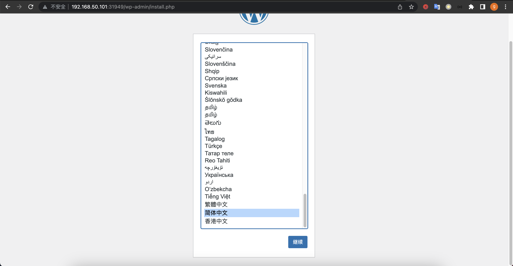
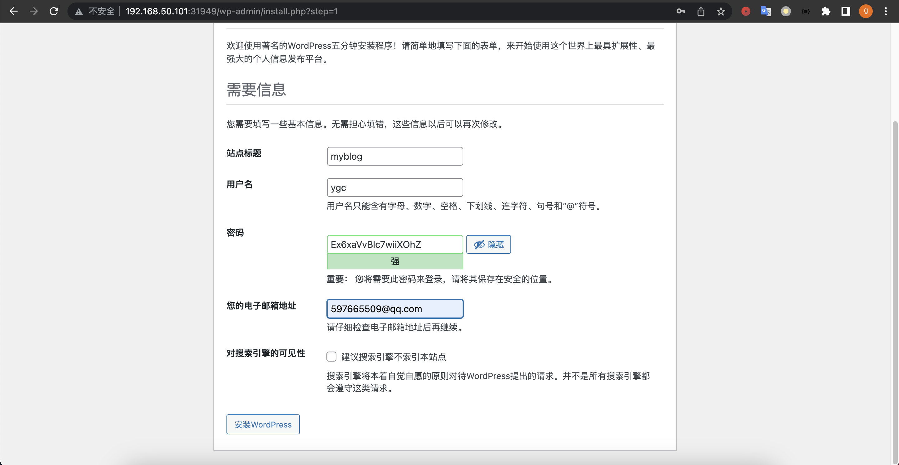
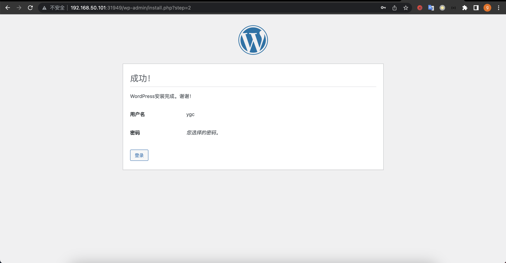
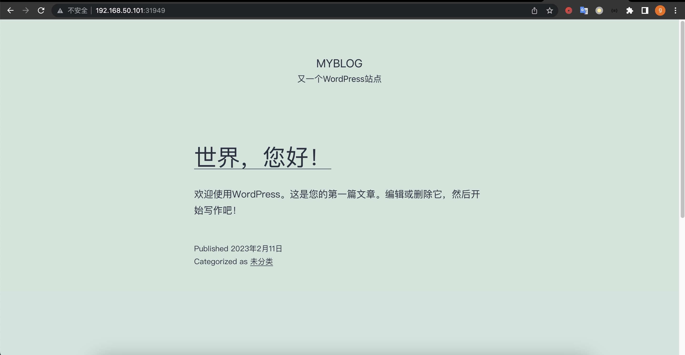
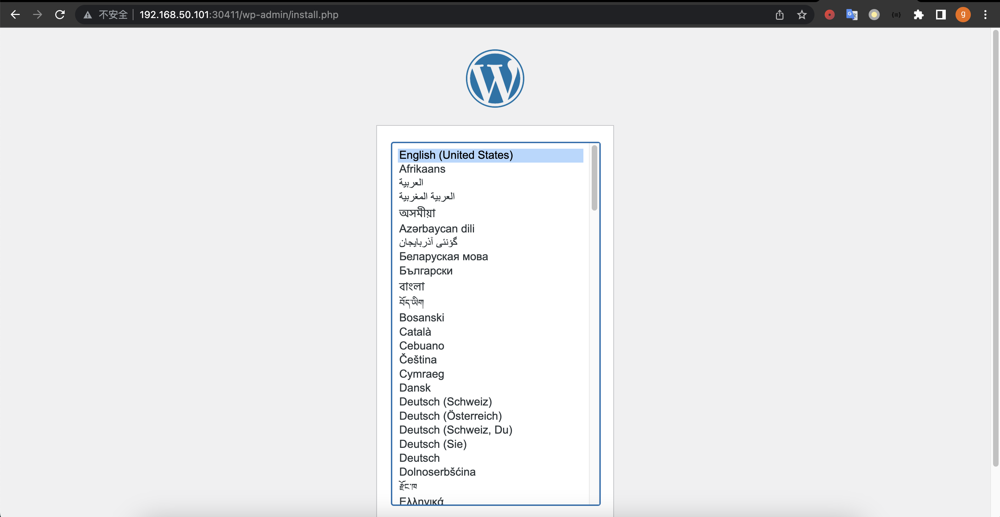
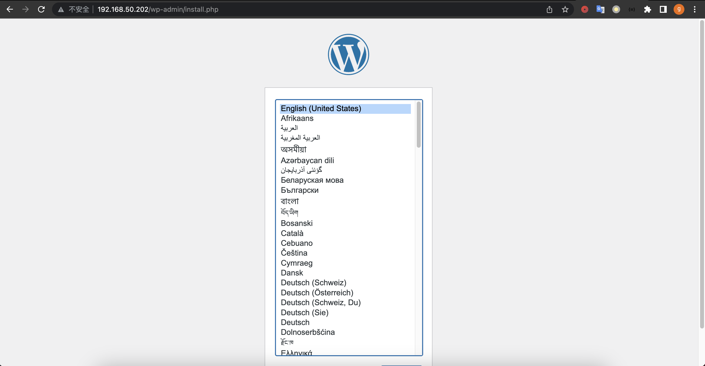
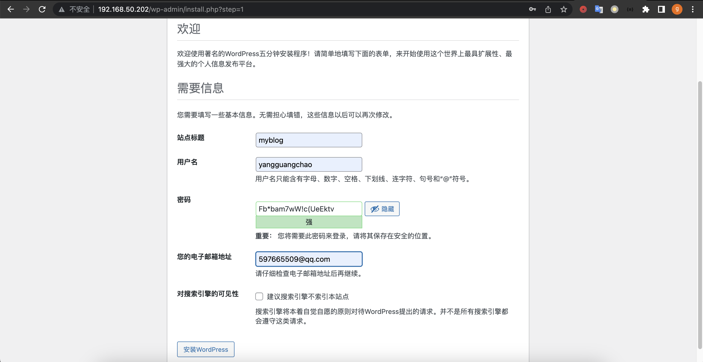
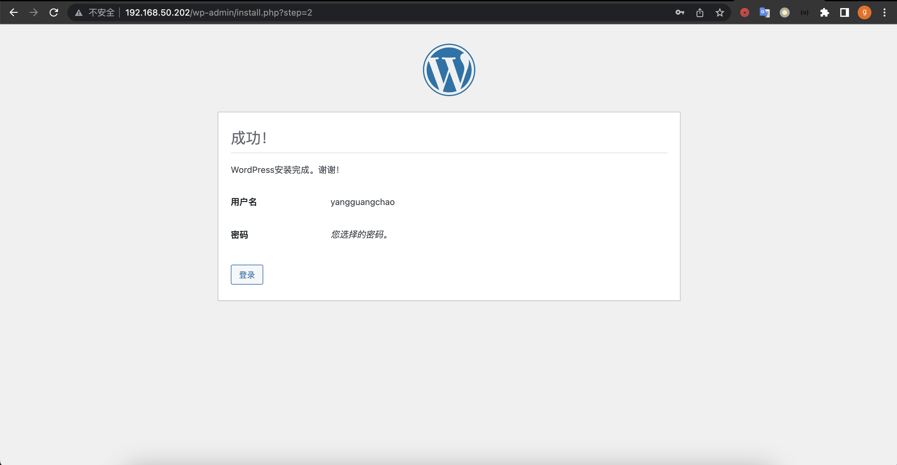
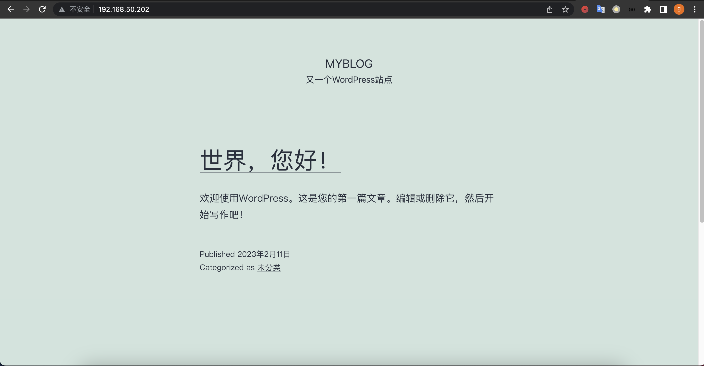

# 1. 在集群上使用资源配置文件编排运行demoapp，并使用Service完成Pod发现和服务发布
```shell
## 生成demoapp编排yaml文件 
root@k8s-master1:~# k create deployment demoapp --image=ikubernetes/demoapp:v1.0 --replicas=2 --dry-run=client -o yaml > deploy-demoapp.yaml
## 编辑yaml文件
root@k8s-master1:~# vi deploy-demoapp.yaml
apiVersion: apps/v1
kind: Deployment
metadata:
  labels:
    app: demoapp
  name: demoapp
spec:
  replicas: 2
  selector:
    matchLabels:
      app: demoapp
  template:
    metadata:
      labels:
        app: demoapp
    spec:
      containers:
      - image: ikubernetes/demoapp:v1.0
        name: demoapp
        imagePullPolicy: IfNotPresent
        startupProbe:
          exec:
            command: ['/bin/sh','-c','test "$(curl -s 127.0.0.1/livez)"=="OK"']
          initialDelaySeconds: 0
          failureThreshold: 3
          periodSeconds: 5
          timeoutSeconds: 10
        livenessProbe:
          httpGet:
            path: '/livez'
            port: 80
          initialDelaySeconds: 5
          periodSeconds: 10
          timeoutSeconds: 30
        readinessProbe:
          httpGet:
            path: '/readyz'
            port: 80
          initialDelaySeconds: 15
          periodSeconds: 20
          timeoutSeconds: 15
## 应用yaml文件
root@k8s-master1:~# k apply -f deploy-demoapp.yaml
deployment.apps/demoapp created
## 查看pod
root@k8s-master1:~# k get pod
NAME                      READY   STATUS    RESTARTS   AGE
demoapp-b848596bf-cqdk5   1/1     Running   0          49s
demoapp-b848596bf-dmlqv   1/1     Running   0          49s
## 生成demoapp service yaml文件
root@k8s-master1:~# k create service clusterip demoapp --tcp=80:80 --dry-run=client -o yaml > svc-demoapp.yaml
## 编辑yaml 文件
root@k8s-master1:~# vi svc-demoapp.yaml
apiVersion: v1
kind: Service
metadata:
  labels:
    app: demoapp
  name: demoapp
spec:
  ports:
  - name: 80-80
    port: 80
    protocol: TCP
    targetPort: 80
  selector:
    app: demoapp
  type: ClusterIP
## 应用yaml文件
root@k8s-master1:~# k apply -f svc-demoapp.yaml
service/demoapp created
## 查看service 信息
root@k8s-master1:~# k get svc
NAME         TYPE        CLUSTER-IP       EXTERNAL-IP   PORT(S)   AGE
demoapp      ClusterIP   10.106.174.192   <none>        80/TCP    34s
kubernetes   ClusterIP   10.96.0.1        <none>        443/TCP   17d
## 查看endpooint信息
root@k8s-master1:~# k get endpoints
NAME         ENDPOINTS                     AGE
demoapp      10.244.2.6:80,10.244.3.6:80   45s
kubernetes   192.168.50.201:6443           17d
##  访问cluster IP 测试
root@k8s-master1:~# curl 10.106.174.192
iKubernetes demoapp v1.0 !! ClientIP: 10.244.0.0, ServerName: demoapp-75f59c894-2x8bc, ServerIP: 10.244.3.6!
```
# 2. 要求以配置文件的方式，在集群上编排运行nginx、wordpress和mysql，并使用Service完成Pod发现和服务发布；
* 提示：
  * 使用Secret的方式的为wordpress指定要使用mysql服务器地址、数据库名称、用户名称和用户密码
  * nginx Service：定义为NodePort类型 
  * nginx的配置文件：要通过ConfigMap提供
  * wordpress和mysql的数据要保存于PVC上
## 2.1 部署mysql
```bash
## 创建mysql secret yaml文件
root@k8s-master1:~/mysql# vi mysql-secret.yaml
apiVersion: v1
kind: Secret
metadata:
  name: mysql-secret
data:
  database.name: d29yZHByZXNz
  database.host: bXlzcWwuZGVmYXVsdC5zdmM6MzMwNg==
  root.password: WWdjMjAyMzAyMTFA
  user.name: d29yZHByZXNz
  user.password: d29yZHByZXNz
## 应用yaml文件
root@k8s-master1:~/mysql# k apply -f mysql-secret.yaml
secret/mysql-secret created
## 查看secret
root@k8s-master1:~/mysql# k get secrets
NAME           TYPE     DATA   AGE
mysql-secret   Opaque   5      6s
## 创建mysql的编排资源目录
root@k8s-master1:~# mkdir mysql
root@k8s-master1:~# cd mysql/
## 编辑mysql pv yaml文件
root@k8s-master1:~/mysql# vi mysql-pv.yaml
apiVersion: v1
kind: PersistentVolume
metadata:
  name: mysql-pv
spec:
  storageClassName: nfs-pv-mysql
  capacity:
    storage: 10Gi
  accessModes:
    - ReadWriteMany
  nfs:
    path: /data/mysql
    server: 11.0.1.202

## 创建pv
root@k8s-master1:~# k apply -f mysql-pv.yaml
persistentvolume/mysql-local-pv created
## 查看pv
root@k8s-master1:~/mysql# k get pv
NAME       CAPACITY   ACCESS MODES   RECLAIM POLICY   STATUS      CLAIM   STORAGECLASS   REASON   AGE
mysql-pv   10Gi       RWX            Retain           Available           nfs-pv-mysql            7s
## 编辑pvc yaml文件
apiVersion: v1
kind: PersistentVolumeClaim
metadata:
  name: mysql-pvc
spec:
  storageClassName: nfs-pv-mysql
  accessModes:
    - ReadWriteMany
  resources:
    requests:
      storage: 10Gi
## 创建pvc
root@k8s-master1:~/mysql# k apply -f mysql-pvc.yaml
persistentvolumeclaim/mysql-pvc created
## 查看pvc
root@k8s-master1:~/mysql# k get pvc
NAME        STATUS   VOLUME     CAPACITY   ACCESS MODES   STORAGECLASS   AGE
mysql-pvc   Bound    mysql-pv   10Gi       RWX            nfs-pv-mysql   16s
## 查看pv，已绑定到mysql-pvc
root@k8s-master1:~/mysql# k get pv
NAME       CAPACITY   ACCESS MODES   RECLAIM POLICY   STATUS   CLAIM               STORAGECLASS   REASON   AGE
mysql-pv   10Gi       RWX            Retain           Bound    default/mysql-pvc   nfs-pv-mysql            82s
## 编辑 mysql deploy和service db yaml文件
root@k8s-master1:~/mysql# vi mysql.yaml
apiVersion: apps/v1
kind: Deployment
metadata:
  labels:
    app: mysql
  name: mysql
spec:
  replicas: 1
  selector:
    matchLabels:
      app: mysql
  template:
    metadata:
      labels:
        app: mysql
    spec:
      containers:
      - image: mysql:5.7
        name: mysql
        imagePullPolicy: IfNotPresent
        args:
        - --default_authentication_plugin=mysql_native_password
        - --character-set-server=utf8mb4
        - --collation-server=utf8mb4_unicode_ci
        ports:
        - containerPort: 3306
          name: dbport
        env:
        - name: MYSQL_ROOT_PASSWORD
          valueFrom:
            secretKeyRef:
              name: mysql-secret
              key: root.password
        - name: MYSQL_USER
          valueFrom:
            secretKeyRef:
              name: mysql-secret
              key: user.name
        - name: MYSQL_PASSWORD
          valueFrom:
            secretKeyRef:
              name: mysql-secret
              key: user.password
        - name: MYSQL_DATABASE
          valueFrom:
            secretKeyRef:
              name: mysql-secret
              key: database.name
        volumeMounts:
        - name: mysql-data
          mountPath: /var/lib/mysql/
      volumes:
      - name: mysql-data
        persistentVolumeClaim:
          claimName: mysql-pvc

---
apiVersion: v1
kind: Service
metadata:
  name: mysql
spec:
  selector:
    app: mysql
  ports:
  - name: mysqlport
    protocol: TCP
    port: 3306
    targetPort: dbport
## 应用yaml文件
root@k8s-master1:~/mysql# k apply -f mysql.yaml
deployment.apps/mysql created
service/mysql created
## 查看pod
root@k8s-master1:~/mysql# k get pod
NAME                     READY   STATUS    RESTARTS   AGE
mysql-6c69474bc7-nnn69   1/1     Running   0          16s
## 查看service
root@k8s-master1:~/mysql# k get svc
NAME         TYPE        CLUSTER-IP       EXTERNAL-IP   PORT(S)    AGE
kubernetes   ClusterIP   10.96.0.1        <none>        443/TCP    18d
mysql        ClusterIP   10.102.178.208   <none>        3306/TCP   32s
## 查看endpoint
root@k8s-master1:~/mysql# k get ep
NAME         ENDPOINTS             AGE
kubernetes   192.168.50.201:6443   18d
mysql        10.244.1.8:3306       45s
```
## 2.2 部署wordpress
```bash
##创建wordpress目录
root@k8s-master1:~/mysql# cd ..
root@k8s-master1:~# mkdir wordpress
root@k8s-master1:~# cd wordpress/
## 编辑pv pvc yaml文件
root@k8s-master1:~/wordpress# vi wordpress-data.yaml
apiVersion: v1
kind: PersistentVolume
metadata:
  name: wordpress-pv
spec:
  storageClassName: wp-pv
  capacity:
    storage: 10Gi
  accessModes:
    - ReadWriteMany
  nfs:
    path: /data/wordpress
    server: 11.0.1.202

---
apiVersion: v1
kind: PersistentVolumeClaim
metadata:
  name: wordpress-pvc
spec:
  storageClassName: wp-pv
  accessModes:
    - ReadWriteMany
  resources:
    requests:
      storage: 10Gi
## 应用yaml 文件
root@k8s-master1:~/wordpress# k apply -f wordpress-data.yaml
persistentvolume/wordpress-local-pv created
persistentvolumeclaim/wordpress-local-pvc created
## 查看pv
root@k8s-master1:~/wordpress# k get pv
NAME           CAPACITY   ACCESS MODES   RECLAIM POLICY   STATUS   CLAIM                   STORAGECLASS   REASON   AGE
mysql-pv       10Gi       RWX            Retain           Bound    default/mysql-pvc       nfs-pv-mysql            6m58s
wordpress-pv   10Gi       RWX            Retain           Bound    default/wordpress-pvc   wp-pv                   7s
## 查看pvc
root@k8s-master1:~/wordpress# k get pvc
NAME            STATUS   VOLUME         CAPACITY   ACCESS MODES   STORAGECLASS   AGE
mysql-pvc       Bound    mysql-pv       10Gi       RWX            nfs-pv-mysql   6m7s
wordpress-pvc   Bound    wordpress-pv   10Gi       RWX            wp-pv          5s
## 编辑wordpress deploy和service编排资源yaml文件
root@k8s-master1:~/wordpress# vi wordpress.yaml
apiVersion: apps/v1
kind: Deployment
metadata:
  labels:
    app: wordpress
  name: wordpress
spec:
  replicas: 1
  selector:
    matchLabels:
      app: wordpress
  template:
    metadata:
      labels:
        app: wordpress
    spec:
      containers:
      - image: wordpress:5.8-fpm
        name: wordpress
        env:
        - name: WORDPRESS_DB_HOST
          valueFrom:
            secretKeyRef:
              name: mysql-secret
              key: database.host
        - name: WORDPRESS_DB_USER
          valueFrom:
            secretKeyRef:
              name: mysql-secret
              key: user.name
        - name: WORDPRESS_DB_PASSWORD
          valueFrom:
            secretKeyRef:
              name: mysql-secret
              key: user.password
        - name: WORDPRESS_DB_NAME
          valueFrom:
            secretKeyRef:
              name: mysql-secret
              key: database.name
        volumeMounts:
        - name: wordpress-app-data
          mountPath: /var/www/html/
      volumes:
      - name: wordpress-app-data
        persistentVolumeClaim:
          claimName: wordpress-pvc
---
apiVersion: v1
kind: Service
metadata:
  labels:
    app: wordpress
  name: wordpress
spec:
  ports:
  - name: fpm
    port: 9000
    protocol: TCP
    targetPort: 9000
  selector:
    app: wordpress
## 应用yaml文件
root@k8s-master1:~/wordpress# k apply -f wordpress.yaml
## 查看pod
root@k8s-master1:~/wordpress# k get pod
NAME                        READY   STATUS    RESTARTS   AGE
mysql-6c69474bc7-nnn69      1/1     Running   0          6m34s
wordpress-b454dcb65-wq7sp   1/1     Running   0          6s
## 查看service
root@k8s-master1:~/wordpress# k get service
NAME         TYPE        CLUSTER-IP       EXTERNAL-IP   PORT(S)    AGE
kubernetes   ClusterIP   10.96.0.1        <none>        443/TCP    18d
mysql        ClusterIP   10.102.178.208   <none>        3306/TCP   15m
wordpress    ClusterIP   10.99.184.144    <none>        9000/TCP   33s
## 查看endpoint
root@k8s-master1:~/wordpress# k get ep
NAME         ENDPOINTS             AGE
kubernetes   192.168.50.201:6443   18d
mysql        10.244.1.8:3306       16m
wordpress    10.244.3.8:9000       43s
```
## 2.3 部署nginx
```bash
## 创建nginx编排目录
root@k8s-master1:~/wordpress# cd ..
root@k8s-master1:~# mkdir nginx
root@k8s-master1:~# cd nginx/
## 编辑 nginx 配置文件confgmap yaml文件
root@k8s-master1:~/nginx# vi nginx-conf-configmap.yaml
apiVersion: v1
data:
  nginx.conf: |
    server {
            listen 80;
            listen [::]:80;
            server_name ygc.cn www.ygc.cn;
            index index.php index.html index.htm;
            root /var/www/html;
            location ~ /.well-known/acme-challenge {
                    allow all;
                    root /var/www/html;
            }
            location / {
                    try_files $uri $uri/ /index.php$is_args$args;
            }
            location ~ \.php$ {
                    try_files $uri =404;
                    fastcgi_split_path_info ^(.+\.php)(/.+)$;
                    fastcgi_pass wordpress:9000;
                    fastcgi_index index.php;
                    include fastcgi_params;
                    fastcgi_param SCRIPT_FILENAME $document_root$fastcgi_script_name;
                    fastcgi_param PATH_INFO $fastcgi_path_info;
            }
            location ~ /\.ht {
                    deny all;
            }
            location = /favicon.ico {
                    log_not_found off; access_log off;
            }
            location = /robots.txt {
                    log_not_found off; access_log off; allow all;
            }
            location ~* \.(css|gif|ico|jpeg|jpg|js|png)$ {
                    expires max;
                    log_not_found off;
            }
    }
kind: ConfigMap
metadata:
  name: nginx-conf
  
## 应用yaml文件
root@k8s-master1:~/nginx# k apply -f nginx-conf-configmap.yaml
configmap/nginx-conf created
## 查看configmap
root@k8s-master1:~/nginx# k get configmap
NAME               DATA   AGE
kube-root-ca.crt   1      17d
nginx-conf         1      6s
## 编辑nginx deploy和service编排资源yaml文件
root@k8s-master1:~/nginx# vi nginx.yaml
apiVersion: apps/v1
kind: Deployment
metadata:
  labels:
    app: nginx
  name: nginx
spec:
  replicas: 1
  selector:
    matchLabels:
      app: nginx
  template:
    metadata:
      labels:
        app: nginx
    spec:
      volumes:
      - name: ngxconf
        configMap:
          name: nginx-conf
      - name: wordpress-app-data
        persistentVolumeClaim:
          claimName: wordpress-pvc
      containers:
      - image: nginx:1.20-alpine
        name: nginx
        volumeMounts:
        - name: ngxconf
          mountPath: /etc/nginx/conf.d/
        - name: wordpress-app-data
          mountPath: /var/www/html/

---
apiVersion: v1
kind: Service
metadata:
  labels:
    app: nginx
  name: nginx
spec:
  ports:
  - name: http-80
    port: 80
    protocol: TCP
    targetPort: 80
  selector:
    app: nginx
  type: NodePort
## 应用yaml文件
root@k8s-master1:~/nginx# k apply -f nginx.yaml
deployment.apps/nginx created
service/nginx created
## 查看pod
root@k8s-master1:~/nginx# k get pod
NAME                        READY   STATUS    RESTARTS   AGE
mysql-6c69474bc7-nnn69      1/1     Running   0          16m
nginx-5755476cb8-5dsxm      1/1     Running   0          3s
wordpress-b454dcb65-wq7sp   1/1     Running   0          10m
## 查看service
root@k8s-master1:~/nginx# k get svc
NAME         TYPE        CLUSTER-IP       EXTERNAL-IP   PORT(S)        AGE
kubernetes   ClusterIP   10.96.0.1        <none>        443/TCP        18d
mysql        ClusterIP   10.102.178.208   <none>        3306/TCP       16m
nginx        NodePort    10.102.248.183   <none>        80:31949/TCP   15s
wordpress    ClusterIP   10.99.184.144    <none>        9000/TCP       88s
## 查看endpoint
root@k8s-master1:~/nginx# k get ep
NAME         ENDPOINTS             AGE
kubernetes   192.168.50.201:6443   18d
mysql        10.244.1.8:3306       16m
nginx        10.244.1.10:80        19s
wordpress    10.244.3.8:9000       92s
```
## 2.4 配置WordPress
* 安装选择语言

* 站点配置

* 安装成功

* 访问测试


# 3. 扩展作业：
* pvc依赖的pv要动态置备
## 3.1 在Kubernetes集群上部署一个可用的NFS服务
```bash
## 创建nfs命名空间
root@k8s-master1:~# k create ns nfs
namespace/nfs created
## 部署nfs 服务
root@k8s-master1:~# k apply -f https://ghproxy.com/raw.githubusercontent.com/kubernetes-csi/csi-driver-nfs/master/deploy/example/nfs-provisioner/nfs-server.yaml --namespace nfs
service/nfs-server created
deployment.apps/nfs-server created
## 查看部署的资源状态
root@k8s-master1:~# k get deploy,svc,ep -n nfs
NAME                         READY   UP-TO-DATE   AVAILABLE   AGE
deployment.apps/nfs-server   1/1     1            1           41s

NAME                 TYPE        CLUSTER-IP      EXTERNAL-IP   PORT(S)            AGE
service/nfs-server   ClusterIP   10.101.58.113   <none>        2049/TCP,111/UDP   41s

NAME                   ENDPOINTS                        AGE
endpoints/nfs-server   10.244.2.9:2049,10.244.2.9:111   41s
```
## 3.2 在Kubernetes集群上部署NFS CSI Driver
```bash
## 克隆部署配置仓库代码
root@k8s-master1:~# git clone https://ghproxy.com/github.com/iKubernetes/learning-k8s.git
Cloning into 'learning-k8s'...
remote: Enumerating objects: 273, done.
remote: Counting objects: 100% (216/216), done.
remote: Compressing objects: 100% (165/165), done.
remote: Total 273 (delta 70), reused 188 (delta 47), pack-reused 57
Receiving objects: 100% (273/273), 90.53 KiB | 94.00 KiB/s, done.
Resolving deltas: 100% (85/85), done.
## 部署 NFS CSI Driver
root@k8s-master1:~# cd learning-k8s/
root@k8s-master1:~/learning-k8s# ls
csi-driver-nfs  dashboard  examples  gitlab  helm  ingress-canary-demo  jenkins  LICENSE  metrics-server  README.md  tutorials  wordpress
root@k8s-master1:~/learning-k8s# kubectl apply -f csi-driver-nfs/deploy/02-csi-driver-nfs-4.1/
serviceaccount/csi-nfs-controller-sa created
serviceaccount/csi-nfs-node-sa created
clusterrole.rbac.authorization.k8s.io/nfs-external-provisioner-role created
clusterrolebinding.rbac.authorization.k8s.io/nfs-csi-provisioner-binding created
csidriver.storage.k8s.io/nfs.csi.k8s.io created
deployment.apps/csi-nfs-controller created
daemonset.apps/csi-nfs-node created
## 修改前的镜像仓库,由于镜像仓库在国外，拉取镜像失败
root@k8s-master1:~/learning-k8s/csi-driver-nfs/deploy/02-csi-driver-nfs-4.1# grep -n "image:" *
03-csi-nfs-controller.yaml:36:          image: registry.k8s.io/sig-storage/csi-provisioner:v3.2.0
03-csi-nfs-controller.yaml:56:          image: registry.k8s.io/sig-storage/livenessprobe:v2.7.0
03-csi-nfs-controller.yaml:72:          image: registry.k8s.io/sig-storage/nfsplugin:v4.1.0
04-csi-nfs-node.yaml:30:          image: registry.k8s.io/sig-storage/livenessprobe:v2.7.0
04-csi-nfs-node.yaml:46:          image: registry.k8s.io/sig-storage/csi-node-driver-registrar:v2.5.1
04-csi-nfs-node.yaml:83:          image: registry.k8s.io/sig-storage/nfsplugin:v4.1.0
## 修改后的镜像仓库,修改为阿里云和docker镜像
root@k8s-master1:~/learning-k8s/csi-driver-nfs/deploy/02-csi-driver-nfs-4.1# grep -n "image:" *
03-csi-nfs-controller.yaml:36:          image: registry.cn-hangzhou.aliyuncs.com/google_containers/csi-provisioner:v3.2.0
03-csi-nfs-controller.yaml:56:          image: registry.cn-hangzhou.aliyuncs.com/google_containers/livenessprobe:v2.7.0
03-csi-nfs-controller.yaml:72:          image: dyrnq/nfsplugin:v4.1.0
04-csi-nfs-node.yaml:30:          image: registry.cn-hangzhou.aliyuncs.com/google_containers/livenessprobe:v2.7.0
04-csi-nfs-node.yaml:46:          image: registry.aliyuncs.com/google_containers/csi-node-driver-registrar:v2.5.1
04-csi-nfs-node.yaml:83:          image: dyrnq/nfsplugin:v4.1.0
## 检查pod 状态
root@k8s-master1:~/learning-k8s# kubectl -n kube-system get pod -o wide -l 'app in (csi-nfs-node,csi-nfs-controller)'
NAME                                  READY   STATUS    RESTARTS   AGE   IP               NODE          NOMINATED NODE   READINESS GATES
csi-nfs-controller-67dd4499b5-bdsw6   3/3     Running   0          75s   192.168.50.103   k8s-node3     <none>           <none>
csi-nfs-node-4gcqg                    3/3     Running   0          75s   192.168.50.103   k8s-node3     <none>           <none>
csi-nfs-node-blxmz                    3/3     Running   0          68s   192.168.50.102   k8s-node2     <none>           <none>
csi-nfs-node-ctxns                    3/3     Running   0          75s   192.168.50.101   k8s-node1     <none>           <none>
csi-nfs-node-vvwpl                    3/3     Running   0          75s   192.168.50.201   k8s-master1   <none>           <none>
## 创建存储类
root@k8s-master1:~/learning-k8s# k apply -f csi-driver-nfs/nfs-csi-storageclass.yaml
storageclass.storage.k8s.io/nfs-csi created
## 查看储存类
root@k8s-master1:~/learning-k8s# k get sc
NAME      PROVISIONER      RECLAIMPOLICY   VOLUMEBINDINGMODE   ALLOWVOLUMEEXPANSION   AGE
nfs-csi   nfs.csi.k8s.io   Delete          Immediate           false                  42s
## 创建一个PVC进行测试
root@k8s-master1:~/learning-k8s# cd csi-driver-nfs/
root@k8s-master1:~/learning-k8s/csi-driver-nfs# k get pvc
No resources found in default namespace.
root@k8s-master1:~/learning-k8s/csi-driver-nfs# k apply -f nfs-pvc-dynamic.yaml
persistentvolumeclaim/pvc-nfs-dynamic created
## 查看 pvc
root@k8s-master1:~/learning-k8s/csi-driver-nfs# k get pvc
NAME              STATUS   VOLUME                                     CAPACITY   ACCESS MODES   STORAGECLASS   AGE
pvc-nfs-dynamic   Bound    pvc-d5737330-161d-488e-853c-a7e8e73dd1a0   10Gi       RWX            nfs-csi        5s
## 查看pv
root@k8s-master1:~/learning-k8s/csi-driver-nfs# k get pv
NAME                                       CAPACITY   ACCESS MODES   RECLAIM POLICY   STATUS   CLAIM                     STORAGECLASS   REASON   AGE
pvc-d5737330-161d-488e-853c-a7e8e73dd1a0   10Gi       RWX            Delete           Bound    default/pvc-nfs-dynamic   nfs-csi                 8s
```
## 3.3 pvc依赖的pv要动态置备
```bash
## 修改mysql pvc存储类为nfs-csi
root@k8s-master1:~# cd mysql/
root@k8s-master1:~/mysql#
root@k8s-master1:~/mysql# vi mysql-pvc.yaml
apiVersion: v1
kind: PersistentVolumeClaim
metadata:
  name: mysql-pvc
spec:
  storageClassName: nfs-csi
  accessModes:
    - ReadWriteMany
  resources:
    requests:
      storage: 10Gi
## 应用yaml文件
root@k8s-master1:~/mysql# k apply -f mysql-pvc.yaml
persistentvolumeclaim/mysql-pvc created
## 查看pvc
root@k8s-master1:~/mysql# k get pvc
NAME        STATUS   VOLUME                                     CAPACITY   ACCESS MODES   STORAGECLASS   AGE
mysql-pvc   Bound    pvc-a5a2860a-0b61-4fda-aff2-3143ed109457   10Gi       RWX            nfs-csi        3s
## 查看pv
root@k8s-master1:~/mysql# k get pv
NAME                                       CAPACITY   ACCESS MODES   RECLAIM POLICY   STATUS   CLAIM               STORAGECLASS   REASON   AGE
pvc-a5a2860a-0b61-4fda-aff2-3143ed109457   10Gi       RWX            Delete           Bound    default/mysql-pvc   nfs-csi                 6s
## mysql secret yaml配置
root@k8s-master1:~/mysql# vi mysql-secret.yaml
apiVersion: v1
kind: Secret
metadata:
  name: mysql-secret
data:
  database.name: d29yZHByZXNz
  database.host: bXlzcWwuZGVmYXVsdC5zdmM6MzMwNg==
  root.password: WWdjMjAyMzAyMTFA
  user.name: d29yZHByZXNz
  user.password: d29yZHByZXNz
## 应用yaml文件
root@k8s-master1:~/mysql# k apply -f mysql-secret.yaml
secret/mysql-secret created
## 查看secret
root@k8s-master1:~/mysql# k get secret
NAME           TYPE     DATA   AGE
mysql-secret   Opaque   5      16s
## mysql资源编排yaml文件
root@k8s-master1:~/mysql# vi mysql.yaml
apiVersion: apps/v1
kind: Deployment
metadata:
  labels:
    app: mysql
  name: mysql
spec:
  replicas: 1
  selector:
    matchLabels:
      app: mysql
  template:
    metadata:
      labels:
        app: mysql
    spec:
      containers:
      - image: mysql:5.7
        name: mysql
        imagePullPolicy: IfNotPresent
        args:
        - --default_authentication_plugin=mysql_native_password
        - --character-set-server=utf8mb4
        - --collation-server=utf8mb4_unicode_ci
        ports:
        - containerPort: 3306
          name: dbport
        env:
        - name: MYSQL_ROOT_PASSWORD
          valueFrom:
            secretKeyRef:
              name: mysql-secret
              key: root.password
        - name: MYSQL_USER
          valueFrom:
            secretKeyRef:
              name: mysql-secret
              key: user.name
        - name: MYSQL_PASSWORD
          valueFrom:
            secretKeyRef:
              name: mysql-secret
              key: user.password
        - name: MYSQL_DATABASE
          valueFrom:
            secretKeyRef:
              name: mysql-secret
              key: database.name
        volumeMounts:
        - name: mysql-data
          mountPath: /var/lib/mysql/
      volumes:
      - name: mysql-data
        persistentVolumeClaim:
          claimName: mysql-pvc

---
apiVersion: v1
kind: Service
metadata:
  name: mysql
spec:
  selector:
    app: mysql
  ports:
  - name: mysqlport
    protocol: TCP
    port: 3306
    targetPort: dbport
## 应用yaml文件
root@k8s-master1:~/mysql# k apply -f mysql.yaml
deployment.apps/mysql created
service/mysql created
## 查看创建的资源状态
root@k8s-master1:~/mysql# k get pod,svc,ep
NAME                         READY   STATUS    RESTARTS   AGE
pod/mysql-6c69474bc7-v7wsp   1/1     Running   0          15s

NAME                 TYPE        CLUSTER-IP       EXTERNAL-IP   PORT(S)    AGE
service/kubernetes   ClusterIP   10.96.0.1        <none>        443/TCP    18d
service/mysql        ClusterIP   10.110.185.160   <none>        3306/TCP   15s

NAME                   ENDPOINTS             AGE
endpoints/kubernetes   192.168.50.201:6443   18d
endpoints/mysql        10.244.1.11:3306      15s
## 修改wordpress pvc存储类
root@k8s-master1:~/mysql# cd ../wordpress/
root@k8s-master1:~/wordpress# vi wordpress-data.yaml
---
apiVersion: v1
kind: PersistentVolumeClaim
metadata:
  name: wordpress-pvc
spec:
  storageClassName: nfs-csi
  accessModes:
    - ReadWriteMany
  resources:
    requests:
      storage: 10Gi
## 应用yaml文件
root@k8s-master1:~/wordpress# k apply -f wordpress-data.yaml
persistentvolumeclaim/wordpress-pvc created
## 查看pvc
root@k8s-master1:~/wordpress# k get pvc
NAME            STATUS   VOLUME                                     CAPACITY   ACCESS MODES   STORAGECLASS   AGE
mysql-pvc       Bound    pvc-a5a2860a-0b61-4fda-aff2-3143ed109457   10Gi       RWX            nfs-csi        9m14s
wordpress-pvc   Bound    pvc-e4c6f23f-d2b8-4b9f-9fca-2bd926cd81a3   10Gi       RWX            nfs-csi        4s
## 查看pv
root@k8s-master1:~/wordpress# k get pv
NAME                                       CAPACITY   ACCESS MODES   RECLAIM POLICY   STATUS   CLAIM                   STORAGECLASS   REASON   AGE
pvc-a5a2860a-0b61-4fda-aff2-3143ed109457   10Gi       RWX            Delete           Bound    default/mysql-pvc       nfs-csi                 9m15s
pvc-e4c6f23f-d2b8-4b9f-9fca-2bd926cd81a3   10Gi       RWX            Delete           Bound    default/wordpress-pvc   nfs-csi                 5s
## wordpress deploy和service资源编排yaml文件
root@k8s-master1:~/wordpress# vi wordpress.yaml
apiVersion: apps/v1
kind: Deployment
metadata:
  labels:
    app: wordpress
  name: wordpress
spec:
  replicas: 1
  selector:
    matchLabels:
      app: wordpress
  template:
    metadata:
      labels:
        app: wordpress
    spec:
      containers:
      - image: wordpress:5.8-fpm
        name: wordpress
        env:
        - name: WORDPRESS_DB_HOST
          valueFrom:
            secretKeyRef:
              name: mysql-secret
              key: database.host
        - name: WORDPRESS_DB_USER
          valueFrom:
            secretKeyRef:
              name: mysql-secret
              key: user.name
        - name: WORDPRESS_DB_PASSWORD
          valueFrom:
            secretKeyRef:
              name: mysql-secret
              key: user.password
        - name: WORDPRESS_DB_NAME
          valueFrom:
            secretKeyRef:
              name: mysql-secret
              key: database.name
        volumeMounts:
        - name: wordpress-app-data
          mountPath: /var/www/html/
      volumes:
      - name: wordpress-app-data
        persistentVolumeClaim:
          claimName: wordpress-pvc

---
apiVersion: v1
kind: Service
metadata:
  labels:
    app: wordpress
  name: wordpress
spec:
  ports:
  - name: fpm
    port: 9000
    protocol: TCP
    targetPort: 9000
  selector:
    app: wordpress
## 应用yaml文件
root@k8s-master1:~/wordpress# k apply -f wordpress.yaml
deployment.apps/wordpress created
service/wordpress created
## 查看创建的资源状态
root@k8s-master1:~/wordpress# k get pod,svc,ep
NAME                            READY   STATUS    RESTARTS   AGE
pod/mysql-6c69474bc7-v7wsp      1/1     Running   0          7m8s
pod/wordpress-b454dcb65-bpdlp   1/1     Running   0          9s

NAME                 TYPE        CLUSTER-IP       EXTERNAL-IP   PORT(S)    AGE
service/kubernetes   ClusterIP   10.96.0.1        <none>        443/TCP    18d
service/mysql        ClusterIP   10.110.185.160   <none>        3306/TCP   7m8s
service/wordpress    ClusterIP   10.99.231.16     <none>        9000/TCP   9s

NAME                   ENDPOINTS             AGE
endpoints/kubernetes   192.168.50.201:6443   18d
endpoints/mysql        10.244.1.11:3306      7m8s
endpoints/wordpress    10.244.3.9:9000       9s
## 
root@k8s-master1:~/wordpress# cd ../nginx/
## nginx conf configmap yaml文件
root@k8s-master1:~/nginx# vi nginx-conf-configmap.yaml
apiVersion: v1
data:
  nginx.conf: |
    server {
            listen 80;
            listen [::]:80;
            server_name ygc.cn www.ygc.cn;
            index index.php index.html index.htm;
            root /var/www/html;
            location ~ /.well-known/acme-challenge {
                    allow all;
                    root /var/www/html;
            }
            location / {
                    try_files $uri $uri/ /index.php$is_args$args;
            }
            location ~ \.php$ {
                    try_files $uri =404;
                    fastcgi_split_path_info ^(.+\.php)(/.+)$;
                    fastcgi_pass wordpress:9000;
                    fastcgi_index index.php;
                    include fastcgi_params;
                    fastcgi_param SCRIPT_FILENAME $document_root$fastcgi_script_name;
                    fastcgi_param PATH_INFO $fastcgi_path_info;
            }
            location ~ /\.ht {
                    deny all;
            }
            location = /favicon.ico {
                    log_not_found off; access_log off;
            }
            location = /robots.txt {
                    log_not_found off; access_log off; allow all;
            }
            location ~* \.(css|gif|ico|jpeg|jpg|js|png)$ {
                    expires max;
                    log_not_found off;
            }
    }
kind: ConfigMap
metadata:
  name: nginx-conf
## 应用yaml文件
root@k8s-master1:~/nginx# k apply -f nginx-conf-configmap.yaml
configmap/nginx-conf created
## 查看configmap
root@k8s-master1:~/nginx# k get cm
NAME               DATA   AGE
kube-root-ca.crt   1      18d
nginx-conf         1      3s
## nginx deploy和service资源编排yaml文件
root@k8s-master1:~/nginx# vi nginx.yaml
apiVersion: apps/v1
kind: Deployment
metadata:
  labels:
    app: nginx
  name: nginx
spec:
  replicas: 1
  selector:
    matchLabels:
      app: nginx
  template:
    metadata:
      labels:
        app: nginx
    spec:
      volumes:
      - name: ngxconf
        configMap:
          name: nginx-conf
      - name: wordpress-app-data
        persistentVolumeClaim:
          claimName: wordpress-pvc
      containers:
      - image: nginx:1.20-alpine
        name: nginx
        volumeMounts:
        - name: ngxconf
          mountPath: /etc/nginx/conf.d/
        - name: wordpress-app-data
          mountPath: /var/www/html/

---
apiVersion: v1
kind: Service
metadata:
  labels:
    app: nginx
  name: nginx
spec:
  ports:
  - name: http-80
    port: 80
    protocol: TCP
    targetPort: 80
  selector:
    app: nginx
  type: NodePort
## 应用yaml文件
root@k8s-master1:~/nginx# k apply -f nginx.yaml
deployment.apps/nginx created
service/nginx created
## 查看创建的资源状态
root@k8s-master1:~/nginx# k get pod,svc,ep
NAME                            READY   STATUS    RESTARTS   AGE
pod/mysql-6c69474bc7-v7wsp      1/1     Running   0          12m
pod/nginx-5755476cb8-r49vv      1/1     Running   0          10s
pod/wordpress-b454dcb65-bpdlp   1/1     Running   0          5m45s

NAME                 TYPE        CLUSTER-IP       EXTERNAL-IP   PORT(S)        AGE
service/kubernetes   ClusterIP   10.96.0.1        <none>        443/TCP        18d
service/mysql        ClusterIP   10.110.185.160   <none>        3306/TCP       12m
service/nginx        NodePort    10.100.92.49     <none>        80:30411/TCP   10s
service/wordpress    ClusterIP   10.99.231.16     <none>        9000/TCP       5m45s

NAME                   ENDPOINTS             AGE
endpoints/kubernetes   192.168.50.201:6443   18d
endpoints/mysql        10.244.1.11:3306      12m
endpoints/nginx        10.244.2.10:80        10s
endpoints/wordpress    10.244.3.9:9000       5m45s 
```
* wordpress安装页面

# 4. 扩展作业：
* 定义一个NodePort类型的Service
* 在集群外部手动配置一个LoadBalancer，为该Service接入外部客户端访问该Service流量，并转发给各各节点上的该Service注册使用的NodePort
## 4.1 使用作业3中的nginx service，nginx service为NodePort
```bash
root@k8s-master1:~/nginx# k get svc nginx -o wide
NAME    TYPE       CLUSTER-IP     EXTERNAL-IP   PORT(S)        AGE     SELECTOR
nginx   NodePort   10.100.92.49   <none>        80:30411/TCP   4m44s   app=nginx
root@k8s-master1:~/nginx# k get node -o wide
NAME          STATUS   ROLES           AGE   VERSION   INTERNAL-IP      EXTERNAL-IP   OS-IMAGE             KERNEL-VERSION      CONTAINER-RUNTIME
k8s-master1   Ready    control-plane   18d   v1.26.1   192.168.50.201   <none>        Ubuntu 22.04.1 LTS   5.15.0-58-generic   docker://20.10.23
k8s-node1     Ready    <none>          18d   v1.26.1   192.168.50.101   <none>        Ubuntu 22.04.1 LTS   5.15.0-58-generic   docker://20.10.23
k8s-node2     Ready    <none>          18d   v1.26.1   192.168.50.102   <none>        Ubuntu 22.04.1 LTS   5.15.0-58-generic   docker://20.10.23
k8s-node3     Ready    <none>          18d   v1.26.1   192.168.50.103   <none>        Ubuntu 22.04.1 LTS   5.15.0-58-generic   docker://20.10.23
```
## 4.2 使用haproxy作为访问入口LoadBalancer
```bash
## 安装haproxy
root@k8s-master2:~# apt install haproxy -y
## haproxy 配置
defaults
	log	global
	mode	http
	option	httplog
	option	dontlognull
        timeout connect 500s
        timeout client  500s
        timeout server  500s
	errorfile 400 /etc/haproxy/errors/400.http
	errorfile 403 /etc/haproxy/errors/403.http
	errorfile 408 /etc/haproxy/errors/408.http
	errorfile 500 /etc/haproxy/errors/500.http
	errorfile 502 /etc/haproxy/errors/502.http
	errorfile 503 /etc/haproxy/errors/503.http
	errorfile 504 /etc/haproxy/errors/504.http

listen loadbalancer
  bind *:80
  mode tcp
  server k8s-node1 192.168.50.101:30411 check inter 3s fall 3 rise 5
  server k8s-node2 192.168.50.102:30411 check inter 3s fall 3 rise 5
  server k8s-node3 192.168.50.103:30411 check inter 3s fall 3 rise 5
  server k8s-master1 192.168.50.201:30411 check inter 3s fall 3 rise 5
## 重启haproxy
root@k8s-master2:~# systemctl restart haproxy
## 查看haproxy状态
root@k8s-master2:~# systemctl status haproxy
```
* 使用haproxy主机的IP:192.168.50.202访问

* wordpress站点配置

* wordpress安装成功

* 访问wordpress 站点
