# 1. wordpress示例中
## 1.1 使用statefulset编排运行mysql，实例数为1
```bash
## 拉取实例代码
root@k8s-master1:~# git clone https://ghproxy.com/github.com/iKubernetes/learning-k8s.git
## 进入mysql资源编排目录
root@k8s-master1:~# cd learning-k8s/wordpress/mysql
## 修改 mysql 为 statefulset编排
root@k8s-master1:~/learning-k8s/wordpress/mysql# vi 04-deploy-mysql.yaml
apiVersion: apps/v1
kind: StatefulSet
metadata:
  labels:
    app: mysql
  name: mysql
spec:
  serviceName: mysql
  replicas: 1
  selector:
    matchLabels:
      app: mysql
  template:
    metadata:
      labels:
        app: mysql
    spec:
      containers:
      - image: mysql:8.0
        name: mysql
        env:
        - name: MYSQL_ROOT_PASSWORD
          valueFrom:
            secretKeyRef:
              name: mysql-user-pass
              key: root.password
        - name: MYSQL_USER
          valueFrom:
            secretKeyRef:
              name: mysql-user-pass
              key: user.name
        - name: MYSQL_PASSWORD
          valueFrom:
            secretKeyRef:
              name: mysql-user-pass
              key: user.password
        - name: MYSQL_DATABASE
          valueFrom:
            secretKeyRef:
              name: mysql-user-pass
              key: database.name
        volumeMounts:
        - name: mysql-data
          mountPath: /var/lib/mysql/
      volumes:
      - name: mysql-data
        persistentVolumeClaim:
          claimName: mysql-data
## 修改mysql service 为headless service
root@k8s-master1:~/learning-k8s/wordpress/mysql# vi 03-service-mysql.yaml
apiVersion: v1
kind: Service
metadata:
  labels:
    app: mysql
  name: mysql
spec:
  clusterIP: None
  ports:
  - name: mysql
    port: 3306
    protocol: TCP
    targetPort: 3306
  selector:
    app: mysql
  type: ClusterIP
## 部署mysql
root@k8s-master1:~/learning-k8s/wordpress/mysql# cd ..
root@k8s-master1:~/learning-k8s/wordpress# k apply -f mysql/
secret/mysql-user-pass created
persistentvolumeclaim/mysql-data created
service/mysql created
statefulset.apps/mysql created
## 查看部署的资源
root@k8s-master1:~/learning-k8s/wordpress# k get pod,svc,ep,secret
NAME          READY   STATUS    RESTARTS   AGE
pod/mysql-0   1/1     Running   0          70s

NAME                 TYPE        CLUSTER-IP   EXTERNAL-IP   PORT(S)    AGE
service/kubernetes   ClusterIP   10.96.0.1    <none>        443/TCP    19d
service/mysql        ClusterIP   None         <none>        3306/TCP   70s

NAME                   ENDPOINTS             AGE
endpoints/kubernetes   192.168.50.201:6443   19d
endpoints/mysql        10.244.1.14:3306      70s

NAME                     TYPE     DATA   AGE
secret/mysql-user-pass   Opaque   4      70s
## 部署wordpress
root@k8s-master1:~/learning-k8s/wordpress# k apply -f wordpress/
service/wordpress created
persistentvolumeclaim/wordpress-app-data created
deployment.apps/wordpress created
## 查看部署的资源
root@k8s-master1:~/learning-k8s/wordpress# k get pod,svc,ep,secret
NAME                             READY   STATUS    RESTARTS   AGE
pod/mysql-0                      1/1     Running   0          2m12s
pod/wordpress-664cfb496b-zbwgl   1/1     Running   0          24s

NAME                 TYPE        CLUSTER-IP     EXTERNAL-IP   PORT(S)    AGE
service/kubernetes   ClusterIP   10.96.0.1      <none>        443/TCP    19d
service/mysql        ClusterIP   None           <none>        3306/TCP   2m12s
service/wordpress    ClusterIP   10.103.69.45   <none>        9000/TCP   24s

NAME                   ENDPOINTS             AGE
endpoints/kubernetes   192.168.50.201:6443   19d
endpoints/mysql        10.244.1.14:3306      2m12s
endpoints/wordpress    10.244.3.11:9000      24s

NAME                     TYPE     DATA   AGE
secret/mysql-user-pass   Opaque   4      2m12s
## 修改nginx service externalIP配置
root@k8s-master1:~/learning-k8s/wordpress# cd nginx/
root@k8s-master1:~/learning-k8s/wordpress/nginx# ls
01-configmap-nginx-conf.yaml  02-service-nginx.yaml  03-deployment-nginx.yaml
root@k8s-master1:~/learning-k8s/wordpress/nginx# vi 02-service-nginx.yaml
apiVersion: v1
kind: Service
metadata:
  labels:
    app: nginx
  name: nginx
spec:
  ports:
  - name: http-80
    port: 80
    protocol: TCP
    targetPort: 80
  selector:
    app: nginx
  type: NodePort
  externalIPs:
  - 192.168.50.100
## 部署nginx
root@k8s-master1:~/learning-k8s/wordpress/nginx# cd ../
root@k8s-master1:~/learning-k8s/wordpress# k apply -f nginx/
configmap/nginx-conf created
service/nginx created
deployment.apps/nginx created
## 查看部署的资源
root@k8s-master1:~/learning-k8s/wordpress# k get pod,svc,ep,secret,cm
NAME                             READY   STATUS    RESTARTS   AGE
pod/mysql-0                      1/1     Running   0          6m
pod/nginx-5b9c7b4c8f-zvcmn       1/1     Running   0          38s
pod/wordpress-664cfb496b-zbwgl   1/1     Running   0          4m12s

NAME                 TYPE        CLUSTER-IP       EXTERNAL-IP      PORT(S)        AGE
service/kubernetes   ClusterIP   10.96.0.1        <none>           443/TCP        19d
service/mysql        ClusterIP   None             <none>           3306/TCP       6m
service/nginx        NodePort    10.101.107.216   192.168.50.100   80:32406/TCP   38s
service/wordpress    ClusterIP   10.103.69.45     <none>           9000/TCP       4m12s

NAME                   ENDPOINTS             AGE
endpoints/kubernetes   192.168.50.201:6443   19d
endpoints/mysql        10.244.1.14:3306      6m
endpoints/nginx        10.244.2.12:80        38s
endpoints/wordpress    10.244.3.11:9000      4m12s

NAME                     TYPE     DATA   AGE
secret/mysql-user-pass   Opaque   4      6m

NAME                         DATA   AGE
configmap/kube-root-ca.crt   1      19d
configmap/nginx-conf         1      38s
```
* 访问wordpress
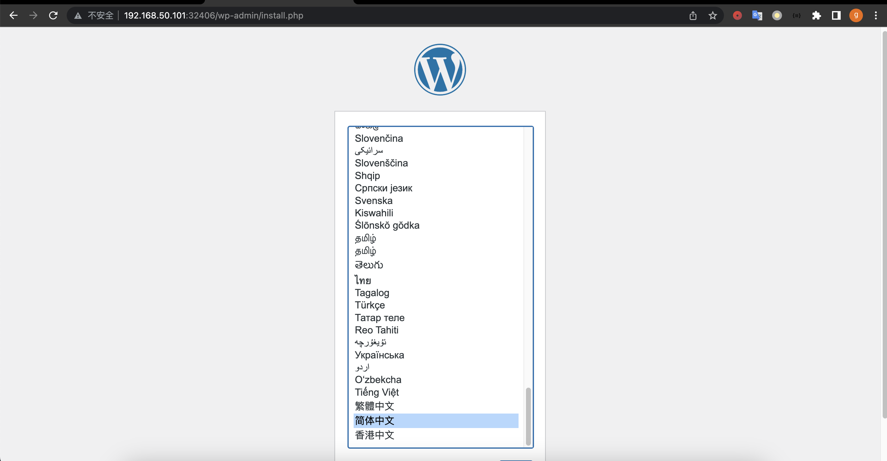
* 配置站点信息
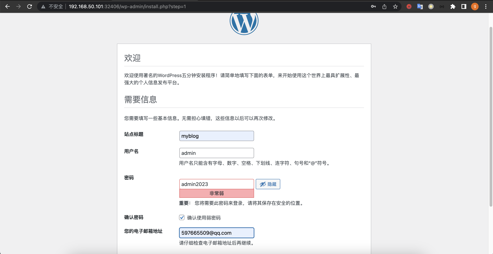
* 安装成功
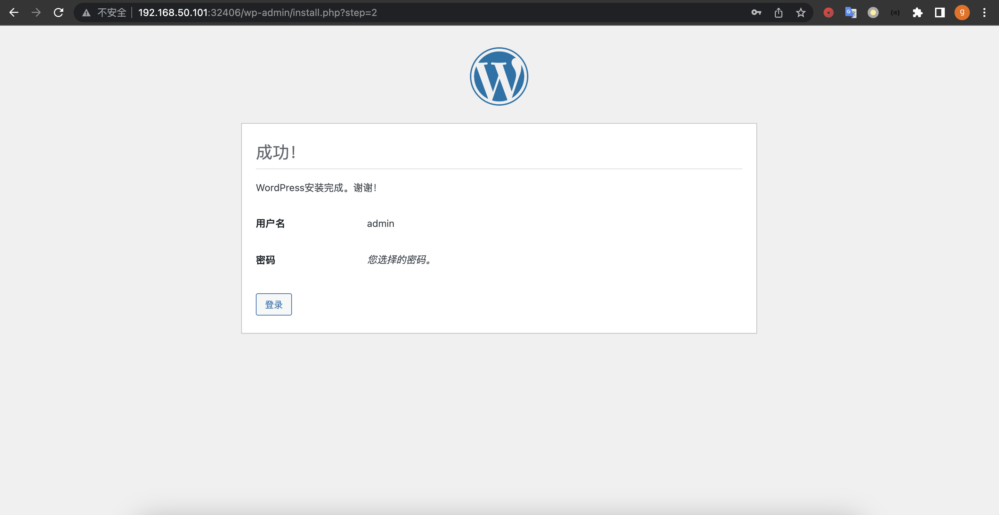
* 访问站点
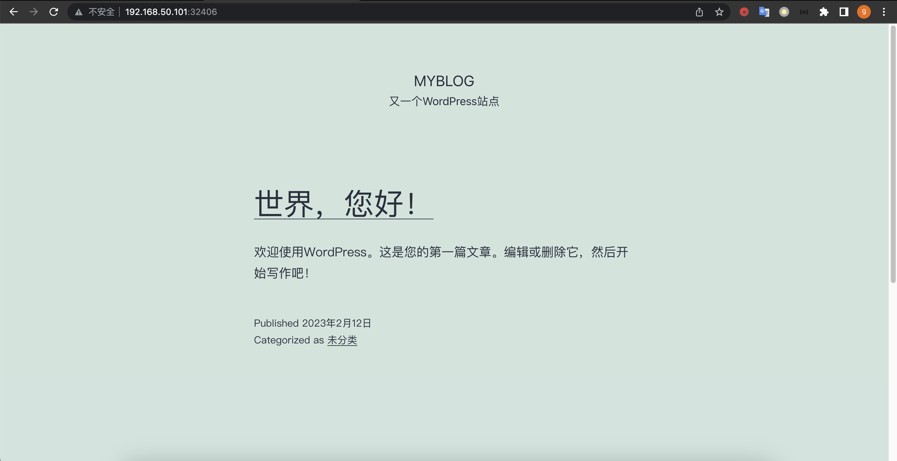

## 1.2 换成使用Operator编排运行mysql，实例数为1+
### 1.2.1 安装helm
```bash
root@k8s-master1:~# wget https://get.helm.sh/helm-v3.11.1-linux-amd64.tar.gz
root@k8s-master1:~# tar -xzvf helm-v3.11.1-linux-amd64.tar.gz 
linux-amd64/
linux-amd64/helm
linux-amd64/LICENSE
linux-amd64/README.md
root@k8s-master1:~# mv linux-amd64/helm /usr/local/bin/helm
root@k8s-master1:~# helm help
The Kubernetes package manager

Common actions for Helm:

- helm search:    search for charts
- helm pull:      download a chart to your local directory to view
- helm install:   upload the chart to Kubernetes
- helm list:      list releases of charts

Environment variables:

| Name                               | Description                                                                                       |
|------------------------------------|---------------------------------------------------------------------------------------------------|
| $HELM_CACHE_HOME                   | set an alternative location for storing cached files.                                             |
| $HELM_CONFIG_HOME                  | set an alternative location for storing Helm configuration.                                       |
| $HELM_DATA_HOME                    | set an alternative location for storing Helm data.                                                |
| $HELM_DEBUG                        | indicate whether or not Helm is running in Debug mode                                             |
| $HELM_DRIVER                       | set the backend storage driver. Values are: configmap, secret, memory, sql.                       |
| $HELM_DRIVER_SQL_CONNECTION_STRING | set the connection string the SQL storage driver should use.                                      |
| $HELM_MAX_HISTORY                  | set the maximum number of helm release history.                                                   |
| $HELM_NAMESPACE                    | set the namespace used for the helm operations.                                                   |
| $HELM_NO_PLUGINS                   | disable plugins. Set HELM_NO_PLUGINS=1 to disable plugins.                                        |
| $HELM_PLUGINS                      | set the path to the plugins directory                                                             |
| $HELM_REGISTRY_CONFIG              | set the path to the registry config file.                                                         |
| $HELM_REPOSITORY_CACHE             | set the path to the repository cache directory                                                    |
| $HELM_REPOSITORY_CONFIG            | set the path to the repositories file.                                                            |
| $KUBECONFIG                        | set an alternative Kubernetes configuration file (default "~/.kube/config")                       |
| $HELM_KUBEAPISERVER                | set the Kubernetes API Server Endpoint for authentication                                         |
| $HELM_KUBECAFILE                   | set the Kubernetes certificate authority file.                                                    |
| $HELM_KUBEASGROUPS                 | set the Groups to use for impersonation using a comma-separated list.                             |
| $HELM_KUBEASUSER                   | set the Username to impersonate for the operation.                                                |
| $HELM_KUBECONTEXT                  | set the name of the kubeconfig context.                                                           |
| $HELM_KUBETOKEN                    | set the Bearer KubeToken used for authentication.                                                 |
| $HELM_KUBEINSECURE_SKIP_TLS_VERIFY | indicate if the Kubernetes API server's certificate validation should be skipped (insecure)       |
| $HELM_KUBETLS_SERVER_NAME          | set the server name used to validate the Kubernetes API server certificate                        |
| $HELM_BURST_LIMIT                  | set the default burst limit in the case the server contains many CRDs (default 100, -1 to disable)|

Helm stores cache, configuration, and data based on the following configuration order:

- If a HELM_*_HOME environment variable is set, it will be used
- Otherwise, on systems supporting the XDG base directory specification, the XDG variables will be used
- When no other location is set a default location will be used based on the operating system

By default, the default directories depend on the Operating System. The defaults are listed below:

| Operating System | Cache Path                | Configuration Path             | Data Path               |
|------------------|---------------------------|--------------------------------|-------------------------|
| Linux            | $HOME/.cache/helm         | $HOME/.config/helm             | $HOME/.local/share/helm |
| macOS            | $HOME/Library/Caches/helm | $HOME/Library/Preferences/helm | $HOME/Library/helm      |
| Windows          | %TEMP%\helm               | %APPDATA%\helm                 | %APPDATA%\helm          |

Usage:
  helm [command]

Available Commands:
  completion  generate autocompletion scripts for the specified shell
  create      create a new chart with the given name
  dependency  manage a chart's dependencies
  env         helm client environment information
  get         download extended information of a named release
  help        Help about any command
  history     fetch release history
  install     install a chart
  lint        examine a chart for possible issues
  list        list releases
  package     package a chart directory into a chart archive
  plugin      install, list, or uninstall Helm plugins
  pull        download a chart from a repository and (optionally) unpack it in local directory
  push        push a chart to remote
  registry    login to or logout from a registry
  repo        add, list, remove, update, and index chart repositories
  rollback    roll back a release to a previous revision
  search      search for a keyword in charts
  show        show information of a chart
  status      display the status of the named release
  template    locally render templates
  test        run tests for a release
  uninstall   uninstall a release
  upgrade     upgrade a release
  verify      verify that a chart at the given path has been signed and is valid
  version     print the client version information

Flags:
      --burst-limit int                 client-side default throttling limit (default 100)
      --debug                           enable verbose output
  -h, --help                            help for helm
      --kube-apiserver string           the address and the port for the Kubernetes API server
      --kube-as-group stringArray       group to impersonate for the operation, this flag can be repeated to specify multiple groups.
      --kube-as-user string             username to impersonate for the operation
      --kube-ca-file string             the certificate authority file for the Kubernetes API server connection
      --kube-context string             name of the kubeconfig context to use
      --kube-insecure-skip-tls-verify   if true, the Kubernetes API server's certificate will not be checked for validity. This will make your HTTPS connections insecure
      --kube-tls-server-name string     server name to use for Kubernetes API server certificate validation. If it is not provided, the hostname used to contact the server is used
      --kube-token string               bearer token used for authentication
      --kubeconfig string               path to the kubeconfig file
  -n, --namespace string                namespace scope for this request
      --registry-config string          path to the registry config file (default "/root/.config/helm/registry/config.json")
      --repository-cache string         path to the file containing cached repository indexes (default "/root/.cache/helm/repository")
      --repository-config string        path to the file containing repository names and URLs (default "/root/.config/helm/repositories.yaml")

Use "helm [command] --help" for more information about a command.
```
### 1.2.2 安装mysql-operator
```bash
## 添加Charts仓库
root@k8s-master1:~# helm repo add mysql-operator https://mysql.github.io/mysql-operator/
"mysql-operator" has been added to your repositories
## 搜索mysql operator版本
root@k8s-master1:~# helm search repo mysql-operator
NAME                              	CHART VERSION	APP VERSION 	DESCRIPTION                                       
mysql-operator/mysql-operator     	2.0.8        	8.0.32-2.0.8	MySQL Operator Helm Chart for deploying MySQL I...
mysql-operator/mysql-innodbcluster	2.0.8        	8.0.32      	MySQL InnoDB Cluster Helm Chart for deploying M...
## 安装Operator
root@k8s-master1:~# helm install mysql-operator mysql-operator/mysql-operator --namespace mysql-operator --create-namespace
NAME: mysql-operator
LAST DEPLOYED: Fri Feb 17 00:12:30 2023
NAMESPACE: mysql-operator
STATUS: deployed
REVISION: 1
TEST SUITE: None
NOTES:
Create an MySQL InnoDB Cluster by executing:
1. When using a source distribution / git clone: `helm install [cluster-name] -n [ns-name] ~/helm/mysql-innodbcluster`
2. When using the Helm repo from ArtifactHub
2.1 With self signed certificates
    export NAMESPACE="your-namespace"
    # in case the namespace doesn't exist, please pass --create-namespace
    helm install my-mysql-innodbcluster mysql-operator/mysql-innodbcluster -n $NAMESPACE \
        --version 2.0.8 \
        --set credentials.root.password=">-0URS4F3P4SS" \
        --set tls.useSelfSigned=true

2.2 When you have own CA and TLS certificates
        export NAMESPACE="your-namespace"
        export CLUSTER_NAME="my-mysql-innodbcluster"
        export CA_SECRET="$CLUSTER_NAME-ca-secret"
        export TLS_SECRET="$CLUSTER_NAME-tls-secret"
        export ROUTER_TLS_SECRET="$CLUSTER_NAME-router-tls-secret"
        # Path to ca.pem, server-cert.pem, server-key.pem, router-cert.pem and router-key.pem
        export CERT_PATH="/path/to/your/ca_and_tls_certificates"

        kubectl create namespace $NAMESPACE

        kubectl create secret generic $CA_SECRET \
            --namespace=$NAMESPACE --dry-run=client --save-config -o yaml \
            --from-file=ca.pem=$CERT_PATH/ca.pem \
        | kubectl apply -f -

        kubectl create secret tls $TLS_SECRET \
            --namespace=$NAMESPACE --dry-run=client --save-config -o yaml \
            --cert=$CERT_PATH/server-cert.pem --key=$CERT_PATH/server-key.pem \
        | kubectl apply -f -

        kubectl create secret tls $ROUTER_TLS_SECRET \
            --namespace=$NAMESPACE --dry-run=client --save-config -o yaml \
            --cert=$CERT_PATH/router-cert.pem --key=$CERT_PATH/router-key.pem \
        | kubectl apply -f -

        helm install my-mysql-innodbcluster mysql-operator/mysql-innodbcluster -n $NAMESPACE \
        --version 2.0.8 \
        --set credentials.root.password=">-0URS4F3P4SS" \
        --set tls.useSelfSigned=false \
        --set tls.caSecretName=$CA_SECRET \
        --set tls.serverCertAndPKsecretName=$TLS_SECRET \
        --set tls.routerCertAndPKsecretName=$ROUTER_TLS_SECRET
## 创建用户名和密码的secret
root@k8s-master1:~# kubectl create secret generic mysql-cluster01-passwd \
        --from-literal=rootUser=root \
        --from-literal=rootHost=% \
        --from-literal=rootPassword="Ygx@2023"
secret/mysql-cluster01-passwd created
## 定义InnoDBCluster资源
root@k8s-master1:~# vi mysql-cluster01-default.yaml
apiVersion: mysql.oracle.com/v2
kind: InnoDBCluster
metadata:
  name: mysql-cluster01
spec:
  # 使用创建的secret
  secretName: mysql-cluster01-passwd
  tlsUseSelfSigned: true
  # MySQL实例个数
  instances: 3
  # MySQL Router配置
  router:
    instances: 1
  # 数据持久化配置
  datadirVolumeClaimTemplate:
    accessModes: 
      - ReadWriteOnce
    resources:
      requests:
        # 定义存储大小
        storage: 40Gi
    # 定义存储类
    storageClassName: nfs-csi
## 使用kubectl创建资源
root@k8s-master1:~# kubectl apply -f mysql-cluster01-default.yaml 
innodbcluster.mysql.oracle.com/mysql-cluster01 created
## 实时查看资源的状态
root@k8s-master1:~# kubectl get innodbcluster --watch
## 过一段时间后，可以看到资源已经ONLINE状态:
root@k8s-master1:~# kubectl get innodbcluster --watch
NAME              STATUS    ONLINE   INSTANCES   ROUTERS   AGE
mysql-cluster01   PENDING   0        3           1         16s
mysql-cluster01   PENDING   0        3           1         2m33s
mysql-cluster01   INITIALIZING   0        3           1         2m33s
mysql-cluster01   INITIALIZING   0        3           1         2m33s
mysql-cluster01   INITIALIZING   0        3           1         2m33s
mysql-cluster01   INITIALIZING   0        3           1         2m33s
mysql-cluster01   INITIALIZING   0        3           1         3m41s
mysql-cluster01   ONLINE_PARTIAL   1        3           1         3m41s
mysql-cluster01   ONLINE_PARTIAL   1        3           1         4m3s
mysql-cluster01   ONLINE_PARTIAL   2        3           1         4m7s
mysql-cluster01   ONLINE           2        3           1         7m5s
mysql-cluster01   ONLINE           3        3           1         7m9s
```
### 1.2.3 使用mysql shell进行连接测试
```bash
root@k8s-master1:~# kubectl run --rm -it myshell \
--image=mysql/mysql-operator \
-- mysqlsh root@mysql-cluster01-instances \
--sql \
--password=Ygx@2023
If you don't see a command prompt, try pressing enter.

 MySQL  mysql-cluster01-instances:33060+ ssl  SQL > show databases;
+-------------------------------+
| Database                      |
+-------------------------------+
| information_schema            |
| mysql                         |
| mysql_innodb_cluster_metadata |
| performance_schema            |
| sys                           |
+-------------------------------+
5 rows in set (0.0016 sec)
```
### 1.2.4 创建wordpress需要用的数据库和账号
```bash
root@k8s-master1:~# kubectl run --rm -it myshell --image=mysql/mysql-operator -- mysqlsh root@mysql-cluster01 --sql --password=Ygx@2023
If you don't see a command prompt, try pressing enter.

 MySQL  mysql-cluster01:33060+ ssl  SQL > create database wordpress;
Query OK, 1 row affected (0.0085 sec)
 MySQL  mysql-cluster01:33060+ ssl  SQL >create user 'wordpress'@'%' identified with mysql_native_password BY 'Wordpress@2023';
Query OK, 0 rows affected (0.0082 sec)
 MySQL  mysql-cluster01:33060+ ssl  SQL > grant all privileges on wordpress.* to 'wordpress'@'%' with grant option;
Query OK, 0 rows affected (0.0053 sec)
 MySQL  mysql-cluster01:33060+ ssl  SQL >  flush privileges;
```
### 1.2.5 部署wordpress
```bash
## 进入到mysql资源编排目录
root@k8s-master1:~# cd learning-k8s/wordpress/mysql
## 修改mysql secret为设置的账号和密码
root@k8s-master1:~/learning-k8s/wordpress/mysql# vi 01-secret-mysql.yaml
apiVersion: v1
kind: Secret
metadata:
  creationTimestamp: null
  name: mysql-user-pass
data:
  database.name: d29yZHByZXNz
  root.password: WWdjQDIwMjM=
  user.name: d29yZHByZXNz
  user.password: V29yZHByZXNzQDIwMjM=
## 创建secret
root@k8s-master1:~/learning-k8s/wordpress/mysql# k apply -f 01-secret-mysql.yaml 
secret/mysql-user-pass created
## 查看secret
root@k8s-master1:~/learning-k8s/wordpress/mysql# k get secrets 
NAME                          TYPE     DATA   AGE
mysql-cluster01-backup        Opaque   2      26m
mysql-cluster01-passwd        Opaque   3      32m
mysql-cluster01-privsecrets   Opaque   2      26m
mysql-cluster01-router        Opaque   2      26m
mysql-user-pass               Opaque   4      32s
## 修改wordpress deploy编排资源文件
root@k8s-master1:~/learning-k8s/wordpress/wordpress# vi 03-deployment-wordpress.yam
apiVersion: apps/v1
kind: Deployment
metadata:
  labels:
    app: wordpress
  name: wordpress
spec:
  replicas: 1
  selector:
    matchLabels:
      app: wordpress
  template:
    metadata:
      labels:
        app: wordpress
    spec:
      containers:
      - image: wordpress:5.8-fpm
        name: wordpress
        env:
        - name: WORDPRESS_DB_HOST
          value: mysql-cluster01
        - name: WORDPRESS_DB_USER
          valueFrom:
            secretKeyRef:
              name: mysql-user-pass
              key: user.name
        - name: WORDPRESS_DB_PASSWORD
          valueFrom:
            secretKeyRef:
              name: mysql-user-pass
              key: user.password
        - name: WORDPRESS_DB_NAME
          valueFrom:
            secretKeyRef:
              name: mysql-user-pass
              key: database.name
        volumeMounts:
        - name: wordpress-app-data
          mountPath: /var/www/html/
      volumes:
      - name: wordpress-app-data
        persistentVolumeClaim:
          claimName: wordpress-app-data
## 部署wordpress
root@k8s-master1:~/learning-k8s/wordpress# kubectl apply -f wordpress/
## 查看资源创建状态
root@k8s-master1:~/learning-k8s/wordpress# kubectl get pod,svc 
NAME                                         READY   STATUS    RESTARTS   AGE
pod/mysql-cluster01-0                        2/2     Running   0          31m
pod/mysql-cluster01-1                        2/2     Running   0          31m
pod/mysql-cluster01-2                        2/2     Running   0          31m
pod/mysql-cluster01-router-8f6b88566-xp8gx   1/1     Running   0          24m
pod/wordpress-695749c74-26x2m                1/1     Running   0          71s

NAME                                TYPE        CLUSTER-IP       EXTERNAL-IP   PORT(S)                                                  AGE
service/kubernetes                  ClusterIP   10.96.0.1        <none>        443/TCP                                                  23d
service/mysql-cluster01             ClusterIP   10.97.193.180    <none>        3306/TCP,33060/TCP,6446/TCP,6448/TCP,6447/TCP,6449/TCP   31m
service/mysql-cluster01-instances   ClusterIP   None             <none>        3306/TCP,33060/TCP,33061/TCP                             31m
service/wordpress                   ClusterIP   10.102.164.179   <none>        9000/TCP  
## 修改 nginx service 配置
root@k8s-master1:~/learning-k8s/wordpress# cd nginx/
root@k8s-master1:~/learning-k8s/wordpress/nginx# vi 02-service-nginx.yaml 
apiVersion: v1
kind: Service
metadata:
  labels:
    app: nginx
  name: nginx
spec:
  ports:
  - name: http-80
    port: 80
    protocol: TCP
    targetPort: 80
  selector:
    app: nginx
  type: NodePort
  externalIPs:
  - 192.168.50.100
## 部署nginx
root@k8s-master1:~/learning-k8s/wordpress# kubectl apply -f nginx/
configmap/nginx-conf created
service/nginx created
deployment.apps/nginx created
## 查看部署的资源
root@k8s-master1:~/learning-k8s/wordpress# kubectl get pod,svc,cm
NAME                                         READY   STATUS    RESTARTS   AGE
pod/mysql-cluster01-0                        2/2     Running   0          39m
pod/mysql-cluster01-1                        2/2     Running   0          39m
pod/mysql-cluster01-2                        2/2     Running   0          39m
pod/mysql-cluster01-router-8f6b88566-xp8gx   1/1     Running   0          32m
pod/nginx-5b9c7b4c8f-2jdfk                   1/1     Running   0          31s
pod/wordpress-695749c74-26x2m                1/1     Running   0          9m16s

NAME                                TYPE        CLUSTER-IP       EXTERNAL-IP      PORT(S)                                                  AGE
service/kubernetes                  ClusterIP   10.96.0.1        <none>           443/TCP                                                  23d
service/mysql-cluster01             ClusterIP   10.97.193.180    <none>           3306/TCP,33060/TCP,6446/TCP,6448/TCP,6447/TCP,6449/TCP   39m
service/mysql-cluster01-instances   ClusterIP   None             <none>           3306/TCP,33060/TCP,33061/TCP                             39m
service/nginx                       NodePort    10.104.116.12    192.168.50.100   80:30147/TCP                                             31s
service/wordpress                   ClusterIP   10.102.164.179   <none>           9000/TCP                                                 9m16s

NAME                                 DATA   AGE
configmap/kube-root-ca.crt           1      23d
configmap/mysql-cluster01-initconf   8      39m
configmap/nginx-conf                 1      31s
```
### 1.2.6 访问wordpres
* 安装首页
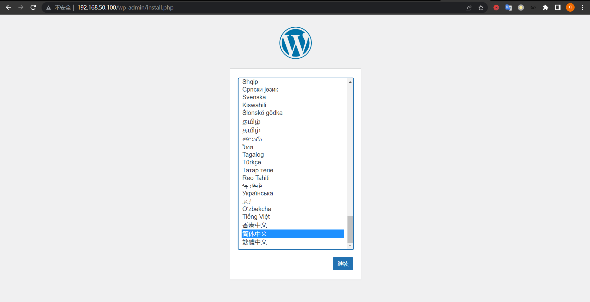
* 博客配置
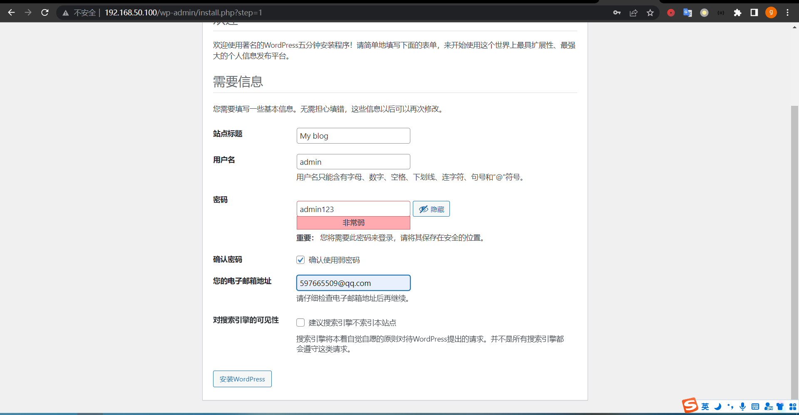
* 访问首页
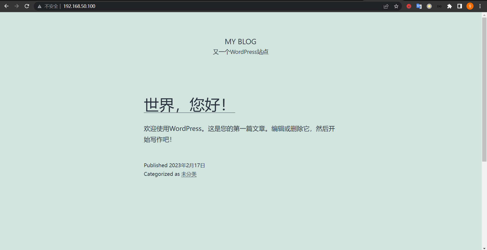

## 1.3 将mysql以传统模型的主从复制的形式运行于Kubernetes外部，让运行在Kubernetes集群上的wordpress去访问外部的MySQL服务
### 1.3.1 安装mysql服务
* 192.168.50.211 mysql-node1
* 192.168.50.212 mysql-node2
* 操作命令需要在每个节点执行，这里只展示一个节点
```bash
## 设置时钟同步
root@mysql-node1:~# apt install chrony -y
root@mysql-node1:~# systemctl enable chrony.service 
root@mysql-node1:~# systemctl status chrony.service
## 下载yaml源配置包
root@mysql-node1:~# wget https://repo.mysql.com//mysql-apt-config_0.8.24-1_all.deb
## 安装yaml源配置包
root@mysql-node1:~# dpkg -i mysql-apt-config_0.8.24-1_all.deb
## 检查更新
root@mysql-node1:~# apt update
## 查看 mysql-server版本
root@mysql-node1:~# apt-cache madison mysql-server
mysql-server | 8.0.32-1ubuntu22.04 | http://repo.mysql.com/apt/ubuntu jammy/mysql-8.0 amd64 Packages
mysql-server | 8.0.32-0ubuntu0.22.04.2 | http://archive.ubuntu.com/ubuntu jammy-updates/main amd64 Packages
mysql-server | 8.0.32-0ubuntu0.22.04.2 | http://archive.ubuntu.com/ubuntu jammy-security/main amd64 Packages
mysql-server | 8.0.32-0buntu0.22.04.1 | http://archive.ubuntu.com/ubuntu jammy-updates/main amd64 Packages
mysql-server | 8.0.28-0ubuntu4 | http://archive.ubuntu.com/ubuntu jammy/main amd64 Packages
mysql-community | 8.0.32-1ubuntu22.04 | http://repo.mysql.com/apt/ubuntu jammy/mysql-8.0 Sources
## 安装mysql server
root@mysql-node1:~# apt install mysql-server -y
```
### 1.3.2 配置mysql主从集群
```bash
## 配置主数据库服务器
root@mysql-node1:~# vi /etc/mysql/mysql.conf.d/mysqld.cnf
[mysqld]
pid-file	= /var/run/mysqld/mysqld.pid
socket		= /var/run/mysqld/mysqld.sock
datadir		= /var/lib/mysql
log-error	= /var/log/mysql/error.log
server-id = 1
log-bin		= /var/log/mysql/mysql-bin.log
tmpdir 		= /tmp
binlog_format 	= ROW
max_binlog_size = 800M
sync_binlog 	= 1
expire-logs-days = 5
slow_query_log = 1
slow_query_log_file = /var/lib/mysql/mysqld-slow.log
## 重启主节点mysql
root@mysql-node1:~# systemctl restart mysql
## 查看mysql状态
root@mysql-node1:~# systemctl status mysql
## 主节点创建同步账号
root@mysql-node1:~# mysql -uroot -pygc@2023
mysql> CREATE USER rsync@'%' IDENTIFIED BY 'rsync@2023';
Query OK, 0 rows affected (0.01 sec)

mysql> GRANT REPLICATION SLAVE on *.* to rsync@'%';
Query OK, 0 rows affected (0.01 sec)

mysql> SHOW GRANTS FOR rsync@'%';
+-----------------------------------------------+
| Grants for rsync@%                            |
+-----------------------------------------------+
| GRANT REPLICATION SLAVE ON *.* TO `rsync`@`%` |
+-----------------------------------------------+
1 row in set (0.00 sec)

mysql> FLUSH PRIVILEGES;
Query OK, 0 rows affected (0.01 sec)

mysql> exit
Bye
## 配置从数据库节点
root@mysql-node2:~# vi /etc/mysql/mysql.conf.d/mysqld.cnf
[mysqld]
pid-file        = /var/run/mysqld/mysqld.pid
socket          = /var/run/mysqld/mysqld.sock
datadir         = /var/lib/mysql
log-error       = /var/log/mysql/error.log
log_bin         = /var/log/mysql/mysql-bin.log
server-id       = 2
read_only       = 1
tmpdir          = /tmp
binlog_format   = ROW
max_binlog_size = 800M
sync_binlog     = 1
expire-logs-days = 5
slow_query_log  = 2
## 重启从节点mysql
root@mysql-node2:~# systemctl restart mysql
## 查看mysql状态
root@mysql-node2:~# systemctl status mysql
## 查看主服务器状态
root@mysql-node1:~# mysql -uroot -pygc@2023
mysql> SHOW MASTER STATUS\G
*************************** 1. row ***************************
             File: mysql-bin.000001
         Position: 829
     Binlog_Do_DB: 
 Binlog_Ignore_DB: 
Executed_Gtid_Set: 
1 row in set (0.00 sec)
## 从服务器连接主服务器
root@mysql-node2:~# mysql -uroot -pygc@2023
## 停止从属线程 
mysql> STOP SLAVE;
Query OK, 0 rows affected, 2 warnings (0.00 sec)
## 设置从服务器以复制主服务器
mysql> CHANGE MASTER TO MASTER_HOST='192.168.50.211', MASTER_USER='rsync', MASTER_PASSWORD='rsync@2023', MASTER_LOG_FILE='mysql-bin.000001', MASTER_LOG_POS=829;
Query OK, 0 rows affected, 8 warnings (0.02 sec)
## 现在激活从服务器
mysql> START SLAVE;
Query OK, 0 rows affected, 1 warning (0.02 sec)
## 查询验证从服务器状态
mysql> SHOW SLAVE STATUS\G;
*************************** 1. row ***************************
               Slave_IO_State: Waiting for source to send event
                  Master_Host: 192.168.50.211
                  Master_User: rsync
                  Master_Port: 3306
                Connect_Retry: 60
              Master_Log_File: mysql-bin.000001
          Read_Master_Log_Pos: 829
               Relay_Log_File: mysql-node2-relay-bin.000002
                Relay_Log_Pos: 326
        Relay_Master_Log_File: mysql-bin.000001
             Slave_IO_Running: Yes
            Slave_SQL_Running: Yes
              Replicate_Do_DB: 
          Replicate_Ignore_DB: 
           Replicate_Do_Table: 
       Replicate_Ignore_Table: 
      Replicate_Wild_Do_Table: 
  Replicate_Wild_Ignore_Table: 
                   Last_Errno: 0
                   Last_Error: 
                 Skip_Counter: 0
          Exec_Master_Log_Pos: 829
              Relay_Log_Space: 542
              Until_Condition: None
               Until_Log_File: 
                Until_Log_Pos: 0
           Master_SSL_Allowed: No
           Master_SSL_CA_File: 
           Master_SSL_CA_Path: 
              Master_SSL_Cert: 
            Master_SSL_Cipher: 
               Master_SSL_Key: 
        Seconds_Behind_Master: 0
Master_SSL_Verify_Server_Cert: No
                Last_IO_Errno: 0
                Last_IO_Error: 
               Last_SQL_Errno: 0
               Last_SQL_Error: 
  Replicate_Ignore_Server_Ids: 
             Master_Server_Id: 1
                  Master_UUID: e3775ba5-aea1-11ed-928d-0050563cbeee
             Master_Info_File: mysql.slave_master_info
                    SQL_Delay: 0
          SQL_Remaining_Delay: NULL
      Slave_SQL_Running_State: Replica has read all relay log; waiting for more updates
           Master_Retry_Count: 86400
                  Master_Bind: 
      Last_IO_Error_Timestamp: 
     Last_SQL_Error_Timestamp: 
               Master_SSL_Crl: 
           Master_SSL_Crlpath: 
           Retrieved_Gtid_Set: 
            Executed_Gtid_Set: 
                Auto_Position: 0
         Replicate_Rewrite_DB: 
                 Channel_Name: 
           Master_TLS_Version: 
       Master_public_key_path: 
        Get_master_public_key: 0
            Network_Namespace: 
1 row in set, 1 warning (0.00 sec)
## 主服务器上创建wordpress数据库
root@mysql-node1:~# mysql -uroot -pygc@2023
mysql> CREATE DATABASE wordpress;
Query OK, 1 row affected (0.02 sec)

mysql> SHOW DATABASES;
+--------------------+
| Database           |
+--------------------+
| information_schema |
| mysql              |
| performance_schema |
| sys                |
| wordpress          |
+--------------------+
5 rows in set (0.00 sec)
## 查看从服务器数据库
root@mysql-node2:~# mysql -uroot -pygc@2023
mysql> SHOW DATABASES;
+--------------------+
| Database           |
+--------------------+
| information_schema |
| mysql              |
| performance_schema |
| sys                |
| wordpress          |
+--------------------+
5 rows in set (0.00 sec)
## 创建wordpress 数据库和账号
root@mysql-node1:~# mysql -uroot -pygc@2023
mysql> create user 'wordpress'@'%' identified with mysql_native_password BY 'Wordpress@2023';
Query OK, 0 rows affected (0.02 sec)

mysql> grant all privileges on wordpress.* to 'wordpress'@'%' with grant option;
Query OK, 0 rows affected (0.00 sec)
```
### 1.3.3 安装wordpress
```bash
## 清理1.2中创建的资源
root@k8s-master1:~# cd learning-k8s/wordpress/
root@k8s-master1:~/learning-k8s/wordpress# k delete -f nginx/
configmap "nginx-conf" deleted
service "nginx" deleted
deployment.apps "nginx" deleted
root@k8s-master1:~/learning-k8s/wordpress# k delete -f wordpress/
service "wordpress" deleted
persistentvolumeclaim "wordpress-app-data" deleted
deployment.apps "wordpress" deleted
root@k8s-master1:~/learning-k8s/wordpress# cd mysql
root@k8s-master1:~/learning-k8s/wordpress/mysql# k delete -f 01-secret-mysql.yaml 
secret "mysql-user-pass" deleted
root@k8s-master1:~/learning-k8s/wordpress/mysql# cd
root@k8s-master1:~# ls
cri-dockerd_0.3.0.3-0.ubuntu-jammy_amd64.deb  helm-v3.11.1-linux-amd64.tar.gz  learning-k8s  linux-amd64  mysql-cluster01-default.yaml  snap
root@k8s-master1:~# k delete -f mysql-cluster01-default.yaml 
innodbcluster.mysql.oracle.com "mysql-cluster01" deleted
## 编辑mysql secret yaml
root@k8s-master1:~# cd learning-k8s/wordpress/mysql
root@k8s-master1:~/learning-k8s/wordpress/mysql# vi 01-secret-mysql.yaml
apiVersion: v1
kind: Secret
metadata:
  creationTimestamp: null
  name: mysql-user-pass
data:
  database.name: d29yZHByZXNz
  root.password: WWdjQDIwMjM=
  user.name: d29yZHByZXNz
  user.password: V29yZHByZXNzQDIwMjM=
## 应用资源文件
root@k8s-master1:~/learning-k8s/wordpress/mysql# k apply -f 01-secret-mysql.yaml 
secret/mysql-user-pass created
root@k8s-master1:~/learning-k8s/wordpress/mysql# k get secret
NAME              TYPE     DATA   AGE
mysql-user-pass   Opaque   4      48s
## 编辑mysql service 资源编排文件
root@k8s-master1:~/learning-k8s/wordpress/mysql# vi 03-service-mysql.yaml 
apiVersion: v1
kind: Endpoints
metadata:
  name: mysql
subsets:
- addresses:
  - ip: 192.168.50.211
  ports:
  - name: mysql
    port: 3306
    protocol: TCP

---
apiVersion: v1
kind: Service
metadata:
  labels:
    app: mysql
  name: mysql
spec:
  ports:
  - name: mysql
    port: 3306
    protocol: TCP
    targetPort: 3306
  type: ClusterIP
## 应用yaml文件
root@k8s-master1:~/learning-k8s/wordpress/mysql# k apply -f 03-service-mysql.yaml
## 查看创建的资源
root@k8s-master1:~/learning-k8s/wordpress/mysql# k get svc,ep
NAME                 TYPE        CLUSTER-IP     EXTERNAL-IP   PORT(S)    AGE
service/kubernetes   ClusterIP   10.96.0.1      <none>        443/TCP    24d
service/mysql        ClusterIP   10.102.69.33   <none>        3306/TCP   8m44s

NAME                   ENDPOINTS             AGE
endpoints/kubernetes   192.168.50.201:6443   24d
endpoints/mysql        192.168.50.211:3306   8m44s
## 部署wordpress
root@k8s-master1:~/learning-k8s/wordpress/mysql# cd ..
root@k8s-master1:~/learning-k8s/wordpress# k apply -f wordpress/
service/wordpress created
persistentvolumeclaim/wordpress-app-data created
deployment.apps/wordpress created
## 查看创建的资源
root@k8s-master1:~/learning-k8s/wordpress# k get pod,svc,pvc
NAME                            READY   STATUS    RESTARTS   AGE
pod/wordpress-8c8989d67-vlhpk   1/1     Running   0          98s

NAME                 TYPE        CLUSTER-IP       EXTERNAL-IP   PORT(S)    AGE
service/kubernetes   ClusterIP   10.96.0.1        <none>        443/TCP    24d
service/mysql        ClusterIP   10.102.69.33     <none>        3306/TCP   12m
service/wordpress    ClusterIP   10.103.211.169   <none>        9000/TCP   98s

NAME                                       STATUS   VOLUME                                     CAPACITY   ACCESS MODES   STORAGECLASS   AGE
persistentvolumeclaim/wordpress-app-data   Bound    pvc-778a6849-4db0-476d-b220-71665896a8fb   10Gi       RWX            nfs-csi        98s
## 修改nginx service yaml文件
root@k8s-master1:~/learning-k8s/wordpress# vi nginx/02-service-nginx.yaml
apiVersion: v1
kind: Service
metadata:
  labels:
    app: nginx
  name: nginx
spec:
  ports:
  - name: http-80
    port: 80
    protocol: TCP
    targetPort: 80
  selector:
    app: nginx
  type: NodePort
  externalIPs:
  - 192.168.50.100
## 部署nginx
root@k8s-master1:~/learning-k8s/wordpress# k apply -f nginx/
## 查看创建的资源
root@k8s-master1:~/learning-k8s/wordpress# k get pod,svc,cm
NAME                            READY   STATUS    RESTARTS   AGE
pod/nginx-5b9c7b4c8f-lzfjf      1/1     Running   0          13s
pod/wordpress-8c8989d67-vlhpk   1/1     Running   0          4m13s

NAME                 TYPE        CLUSTER-IP       EXTERNAL-IP      PORT(S)        AGE
service/kubernetes   ClusterIP   10.96.0.1        <none>           443/TCP        24d
service/mysql        ClusterIP   10.102.69.33     <none>           3306/TCP       14m
service/nginx        NodePort    10.104.3.162     192.168.50.100   80:30669/TCP   13s
service/wordpress    ClusterIP   10.103.211.169   <none>           9000/TCP       4m13s

NAME                         DATA   AGE
configmap/kube-root-ca.crt   1      24d
configmap/nginx-conf         1      13s
```
* wordpress安装首页
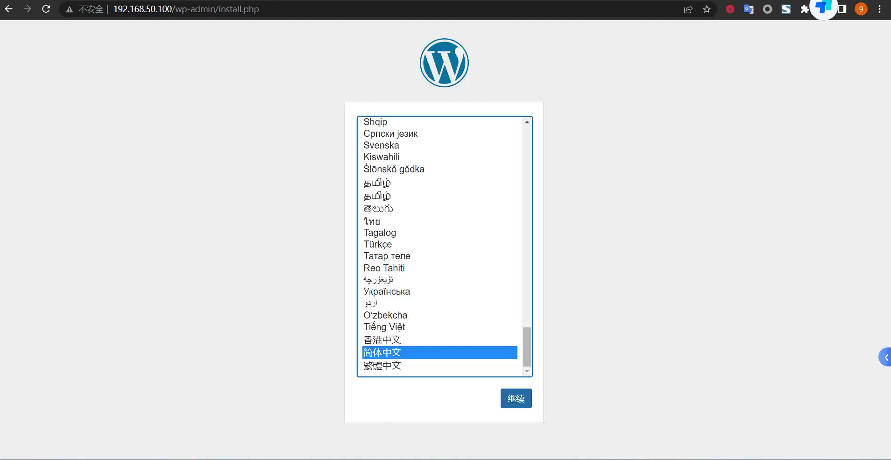
* wordpress配置页面
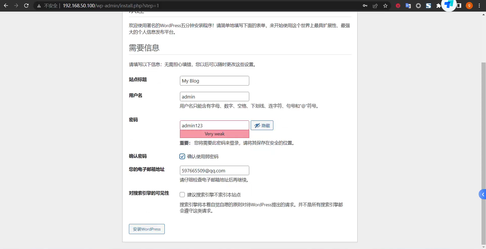
* 安装完成
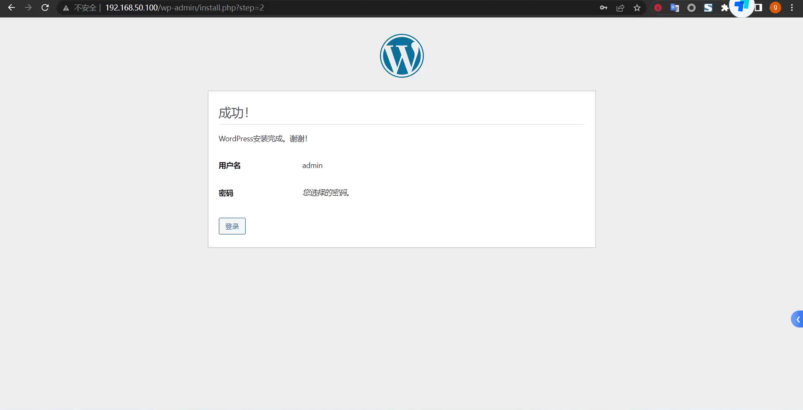
* 访问测试

# 2.wordpress实例扩展至多个，测试应用是否工作正常；
```bash
## 修改 wordpress 副本数量为3
root@k8s-master1:~/learning-k8s/wordpress# vi wordpress/03-deployment-wordpress.yaml
root@k8s-master1:~/learning-k8s/wordpress/wordpress# vi 03-deployment-wordpress.yaml 
apiVersion: apps/v1
kind: Deployment
metadata:
  labels:
    app: wordpress
  name: wordpress
spec:
  replicas: 3
  selector:
    matchLabels:
      app: wordpress
  template:
    metadata:
      labels:
        app: wordpress
    spec:
      containers:
      - image: wordpress:6.1.1-fpm
        name: wordpress
        env:
        - name: WORDPRESS_DB_HOST
          value: mysql
        - name: WORDPRESS_DB_USER
          valueFrom:
            secretKeyRef:
              name: mysql-user-pass
              key: user.name
        - name: WORDPRESS_DB_PASSWORD
          valueFrom:
            secretKeyRef:
              name: mysql-user-pass
              key: user.password
        - name: WORDPRESS_DB_NAME
          valueFrom:
            secretKeyRef:
              name: mysql-user-pass
              key: database.name
        volumeMounts:
        - name: wordpress-app-data
          mountPath: /var/www/html/
      volumes:
      - name: wordpress-app-data
        persistentVolumeClaim:
          claimName: wordpress-app-data
## 应用变更的yaml文件
root@k8s-master1:~/learning-k8s/wordpress# k apply -f wordpress/
service/wordpress unchanged
persistentvolumeclaim/wordpress-app-data unchanged
deployment.apps/wordpress configured
## 查看deploy
root@k8s-master1:~/learning-k8s/wordpress# k get deploy 
NAME        READY   UP-TO-DATE   AVAILABLE   AGE
nginx       1/1     1            1           16m
wordpress   2/3     3            2           20m
## 查看pod
root@k8s-master1:~/learning-k8s/wordpress# k get pod
NAME                        READY   STATUS    RESTARTS   AGE
nginx-5b9c7b4c8f-lzfjf      1/1     Running   0          16m
wordpress-8c8989d67-dmj5w   1/1     Running   0          63s
wordpress-8c8989d67-ntt75   1/1     Running   0          63s
wordpress-8c8989d67-vlhpk   1/1     Running   0          20m
```
* 创建新文章的页面，多次刷新页面正常显示
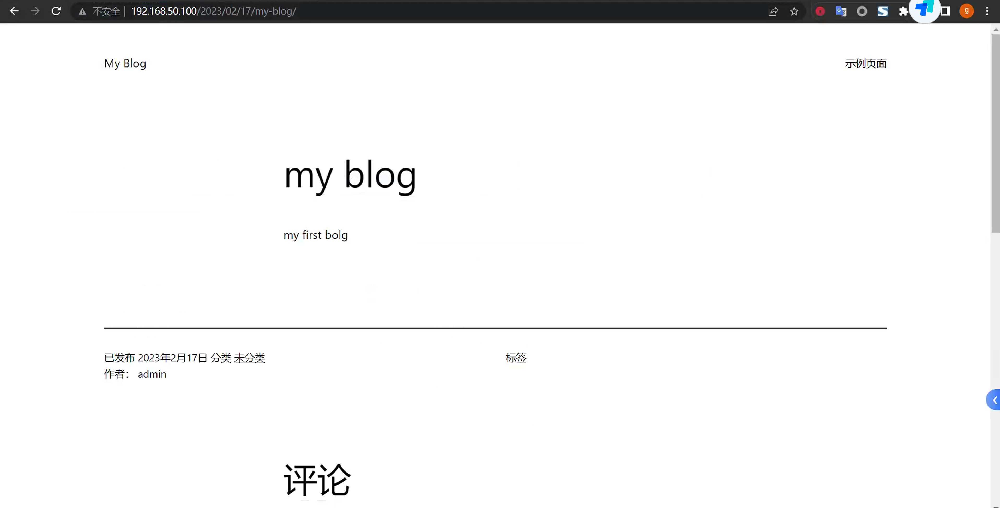

# 3. Nginx实例扩展至多个，测试应用是否工作正常；额外为nginx添加https虚拟主机
## 3.1 扩展nginx实例
```bash
## 修改nginx副本为5个
root@k8s-master1:~/learning-k8s/wordpress# vi nginx/03-deployment-nginx.yaml
apiVersion: apps/v1
kind: Deployment
metadata:
  labels:
    app: nginx
  name: nginx
spec:
  replicas: 5
  selector:
    matchLabels:
      app: nginx
  strategy:
    rollingUpdate:
      maxSurge: 1
      maxUnavailable: 0
  template:
    metadata:
      labels:
        app: nginx
    spec:
      volumes:
      - name: ngxconf
        configMap:
          name: nginx-conf
      - name: wordpress-app-data
        persistentVolumeClaim:
          claimName: wordpress-app-data
      containers:
      - image: nginx:1.20-alpine
        name: nginx
        volumeMounts:
        - name: ngxconf
          mountPath: /etc/nginx/conf.d/
        - name: wordpress-app-data
          mountPath: /var/www/html/
## 应用变更的yaml文件
root@k8s-master1:~/learning-k8s/wordpress# k apply -f nginx/
configmap/nginx-conf configured
service/nginx unchanged
deployment.apps/nginx configured
## 查看deploy
root@k8s-master1:~/learning-k8s/wordpress# k get deploy nginx
NAME    READY   UP-TO-DATE   AVAILABLE   AGE
nginx   5/5     5            5           4h30m

## 查看pod 
root@k8s-master1:~/learning-k8s/wordpress# k get pod -l app=nginx -o wide
NAME                     READY   STATUS    RESTARTS   AGE     IP            NODE        NOMINATED NODE   READINESS GATES
nginx-5b9c7b4c8f-bbzwh   1/1     Running   0          106s    10.244.1.12   k8s-node1   <none>           <none>
nginx-5b9c7b4c8f-fjhkg   1/1     Running   0          106s    10.244.3.18   k8s-node3   <none>           <none>
nginx-5b9c7b4c8f-lzfjf   1/1     Running   0          4h31m   10.244.1.10   k8s-node1   <none>           <none>
nginx-5b9c7b4c8f-qg4mc   1/1     Running   0          106s    10.244.2.11   k8s-node2   <none>           <none>
nginx-5b9c7b4c8f-vbm9p   1/1     Running   0          106s    10.244.2.12   k8s-node2   <none>           <none>
```
* 测试 wordpress，刷新浏览器多次页正常


## 3.2 配置https证书
```
## 生成IP 自签名证书
root@k8s-master1:~# mkdir ssl
root@k8s-master1:~# cd ssl/
root@k8s-master1:~/ssl# openssl req \
-newkey rsa:2048 \
-x509 \
-nodes \
-keyout file.key \
-new \
-out file.crt \
-subj /CN=Hostname \
-reqexts SAN \
-extensions SAN \
-config <(cat /etc/ssl/openssl.cnf \
    <(printf '[SAN]\nsubjectAltName=DNS:hostname,IP:192.168.50.100')) \
-sha256 \
-days 3650
## 创建secret
root@k8s-master1:~/ssl# k create secret tls wordpress-ssl --key file.key --cert file.crt
secret/wordpress-ssl created
## 修改nginx configmap资源编排文件
root@k8s-master1:~/learning-k8s/wordpress# cd nginx/
root@k8s-master1:~/learning-k8s/wordpress/nginx# vi 01-configmap-nginx-conf.yaml
apiVersion: v1
data:
  nginx.conf: |
    server {
            listen 80;
            listen 443 ssl;

            server_name 192.168.50.100;
            ssl_certificate /etc/ssl/tls.crt;
            ssl_certificate_key /etc/ssl/tls.key;

            index index.php index.html index.htm;

            root /var/www/html;

            location ~ /.well-known/acme-challenge {
                    allow all;
                    root /var/www/html;
            }

            location / {
                    try_files $uri $uri/ /index.php$is_args$args;
            }

            location ~ \.php$ {
                    try_files $uri =404;
                    fastcgi_split_path_info ^(.+\.php)(/.+)$;
                    fastcgi_pass wordpress:9000;
                    fastcgi_index index.php;
                    include fastcgi_params;
                    fastcgi_param SCRIPT_FILENAME $document_root$fastcgi_script_name;
                    fastcgi_param PATH_INFO $fastcgi_path_info;
            }

            location ~ /\.ht {
                    deny all;
            }

            location = /favicon.ico {
                    log_not_found off; access_log off;
            }
            location = /robots.txt {
                    log_not_found off; access_log off; allow all;
            }
            location ~* \.(css|gif|ico|jpeg|jpg|js|png)$ {
                    expires max;
                    log_not_found off;
            }
    }
kind: ConfigMap
metadata:
  creationTimestamp: null
  name: nginx-conf
## 修改nginx service资源编排文件
root@k8s-master1:~/learning-k8s/wordpress/nginx# vi 02-service-nginx.yaml
apiVersion: v1
kind: Service
metadata:
  labels:
    app: nginx
  name: nginx
spec:
  ports:
  - name: http-80
    port: 80
    protocol: TCP
    targetPort: 80
  - name: https-443
    port: 443
    protocol: TCP
    targetPort: 443
  selector:
    app: nginx
  type: NodePort
  externalIPs:
  - 192.168.50.100
## 修改nginx deployment资源编排文件
root@k8s-master1:~/learning-k8s/wordpress/nginx# vi 03-deployment-nginx.yaml
apiVersion: apps/v1
kind: Deployment
metadata:
  labels:
    app: nginx
  name: nginx
spec:
  replicas: 5
  selector:
    matchLabels:
      app: nginx
  strategy:
    rollingUpdate:
      maxSurge: 1
      maxUnavailable: 0
  template:
    metadata:
      labels:
        app: nginx
    spec:
      volumes:
      - name: ngxconf
        configMap:
          name: nginx-conf
      - name: wordpress-app-data
        persistentVolumeClaim:
          claimName: wordpress-app-data
      - name: wordpress-ssl
        secret:
          secretName: wordpress-ssl
      containers:
      - image: nginx:1.20-alpine
        name: nginx
        volumeMounts:
        - name: ngxconf
          mountPath: /etc/nginx/conf.d/
        - name: wordpress-app-data
          mountPath: /var/www/html/
        - name: wordpress-ssl
          mountPath: /etc/ssl/
          readOnly: true
## 应用nginx 资源编排文件
root@k8s-master1:~/learning-k8s/wordpress# k apply -f nginx/
configmap/nginx-conf configured
service/nginx configured
deployment.apps/nginx configured
## 查看资源状态
root@k8s-master1:~/learning-k8s/wordpress# k get pod,svc,cm
NAME                            READY   STATUS    RESTARTS   AGE
pod/nginx-6c77845b45-fbl7g      1/1     Running   0          28s
pod/nginx-6c77845b45-fs2jl      1/1     Running   0          24s
pod/nginx-6c77845b45-ht2vn      1/1     Running   0          22s
pod/nginx-6c77845b45-kmj4h      1/1     Running   0          26s
pod/nginx-6c77845b45-xxn56      1/1     Running   0          25s
pod/wordpress-8c8989d67-dmj5w   1/1     Running   0          4h53m
pod/wordpress-8c8989d67-ntt75   1/1     Running   0          4h53m
pod/wordpress-8c8989d67-vlhpk   1/1     Running   0          5h13m

NAME                 TYPE        CLUSTER-IP       EXTERNAL-IP      PORT(S)                      AGE
service/kubernetes   ClusterIP   10.96.0.1        <none>           443/TCP                      24d
service/mysql        ClusterIP   10.102.69.33     <none>           3306/TCP                     5h23m
service/nginx        NodePort    10.104.3.162     192.168.50.100   80:30669/TCP,443:32622/TCP   5h9m
service/wordpress    ClusterIP   10.103.211.169   <none>           9000/TCP                     5h13m

NAME                         DATA   AGE
configmap/kube-root-ca.crt   1      24d
configmap/nginx-conf         1      5h9m
```
* 浏览器访问测试

  * https可以正常访问
  * 浏览器刷新多次页面正常
* 查看证书信息
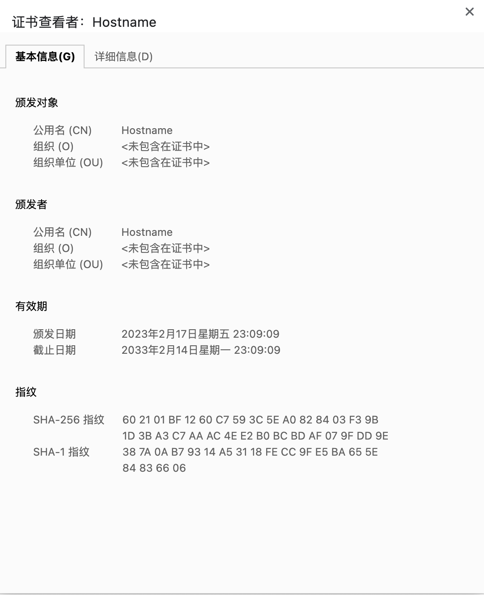
  * 浏览器查看证书为自签证书
  * 自签证书和签发提供的参数一致
