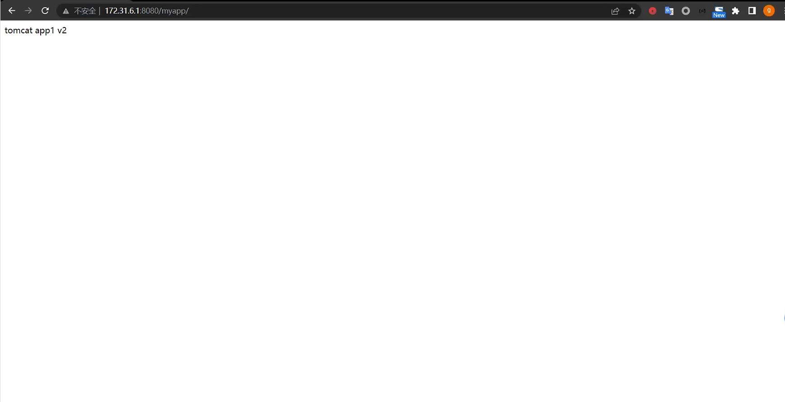
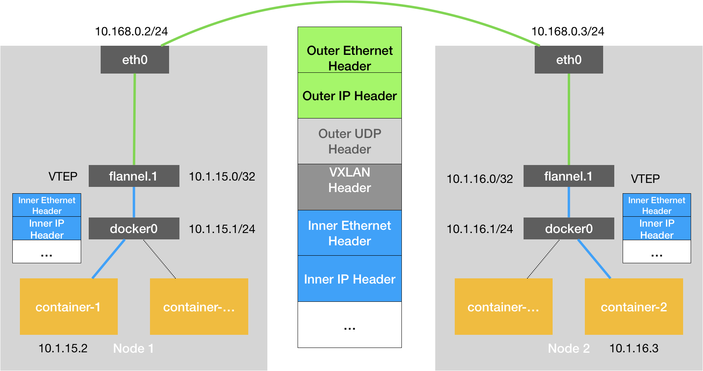
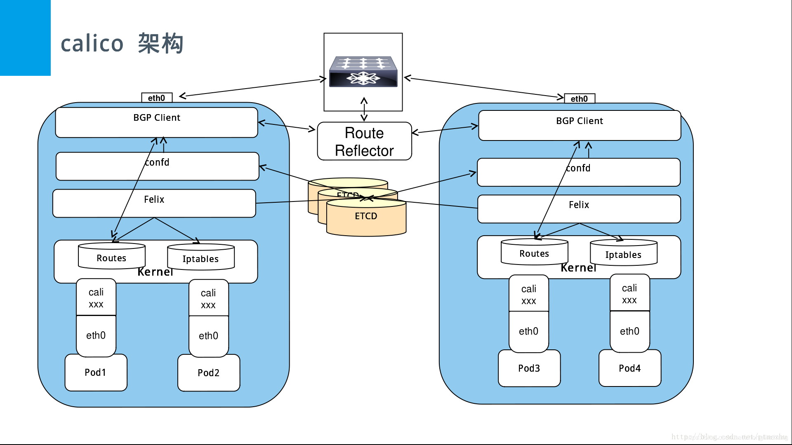
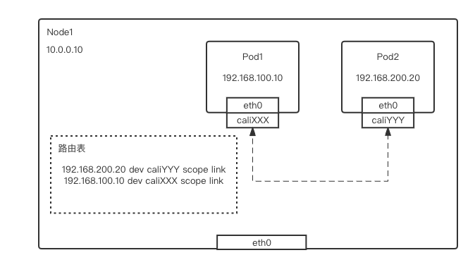
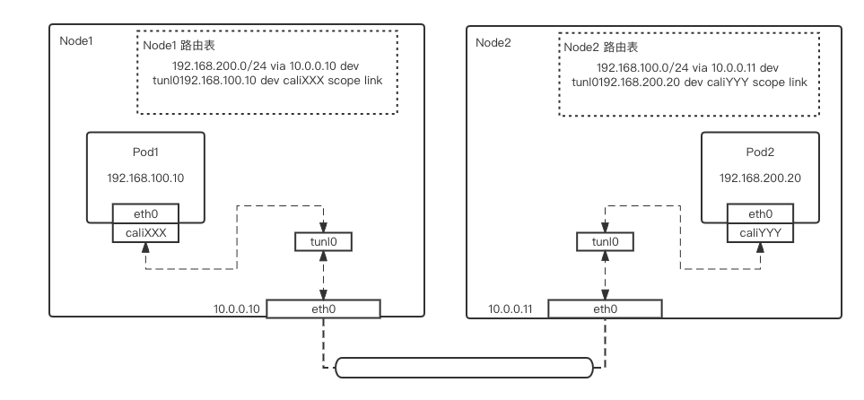
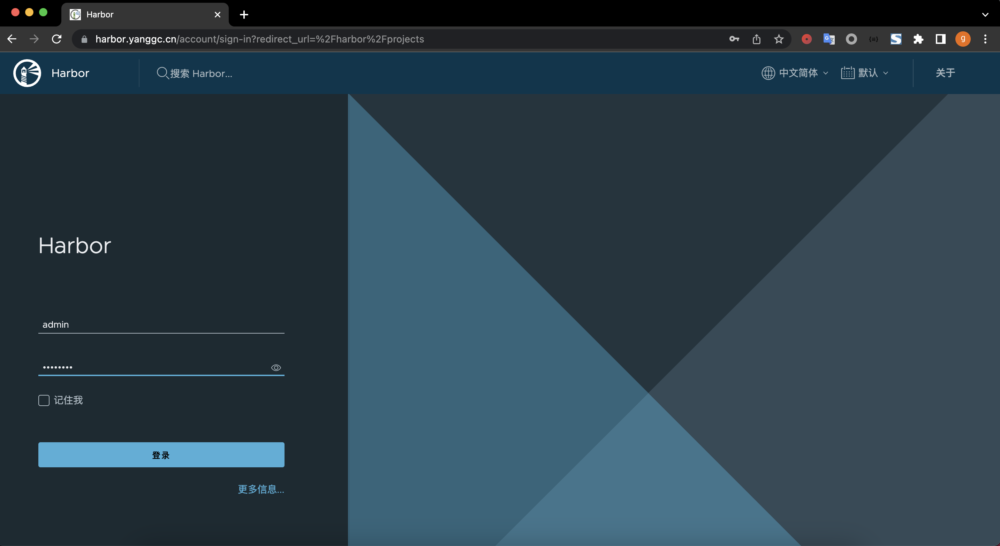
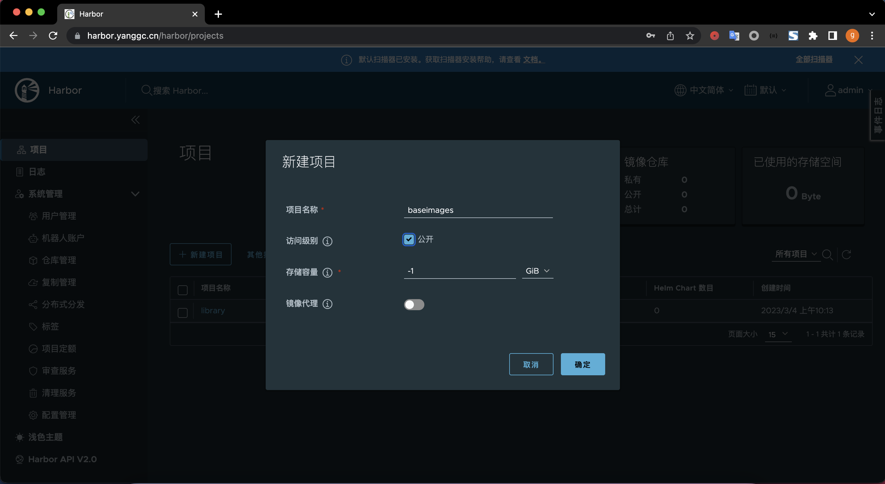
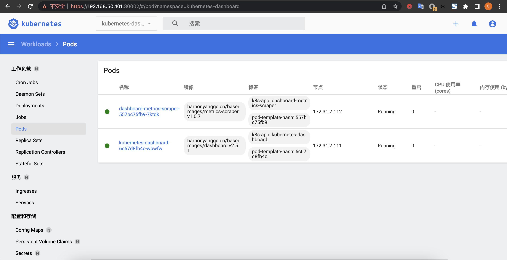

# 1. 总结 Underlay 和 Overlay 网络的的区别及优缺点
## 1.1 Overlay 网络
### 1.1.1 Overlay网络简介
* Overlay叫叠加网络也叫覆盖网络，指的是在物理网络的基础之上叠加实现新的虚拟网络，即可使网络的中的容器可以相互通信。
* 优点是对物理网络的兼容性比较好，可以实现pod的夸宿主机子网通信。
* calico与flannel等网络插件都支持overlay网络。
* 缺点是有额外的封装与解封性能开销。
* 目前私有云使用比较多。
### 1.1.2 overlay设备简介
* VTEP(VXLAN Tunnel Endpoint vxlan隧道端点),VTEP是VXLAN网络的边缘设备，是VXLAN隧道的起点和终点，VXLAN对用户原始数据帧的封装和解封装均在VTEP上进行,用于VXLAN报文的封装和解封装,VTEP与物理网络相连,VXLAN报文中源IP地址为本节点的VTEP地址，VXLAN报文中目的IP地址为对端节点的VTEP地址，一对VTEP地址就对应着一个VXLAN隧道，服务器上的虚拟交换机(隧道flannel.1就是VTEP)，比如一个虚拟机网络中的多个vxlan就需要多个VTEP对不同网络的报文进行封装与解封装。
* VNI（VXLAN Network Identifier）：VXLAN网络标识VNI类似VLAN ID,用于区分VXLAN段,不同VXLAN段的虚拟机不能直接二层相互通信,一个VNI表示一个租户,即使多个终端用户属于同一个VNI,也表示一个租户。
* NVGRE：Network Virtualization using Generic Routing Encapsulation，主要支持者是Microsoft，与VXLAN不同的是，NVGRE没有采用标准传输协议（TCP/UDP），而是借助通用路由封装协议（GRE），NVGRE使用GRE头部的第24位作为租户网络标识符（TNI）， 与VXLAN一样可以支持1777216个vlan。
### 1.1.3 overlay通信简介

* VM A发送L2 帧与VM请求与VM B通信。
* 源宿主机VTEP添加或者封装VXLAN、UDP及IP头部报文。
* 网络层设备将封装后的报文通过标准的报文在三层网络进行转发到目标主机。
* 目标宿主机VTEP删除或者解封装VXLAN、UDP及IP头部。
* 将原始L2帧发送给目标VM。

## 1.2 Underlay 网络
### 1.2.1 Underlay 网络简介
* Underlay网络就是传统IT基础设施网络，由交换机和路由器等设备组成，借助以太网协议、路由协议和VLAN协议等驱动，它还是Overlay网络的底层网络，为Overlay网络提供数据通信服务。容器网络中的Underlay网络是指借助驱动程序将宿主机的底层网络接口直接暴露给容器使用的一种网络构建技术，较为常见的解决方案有MAC VLAN、IP VLAN和直接路由等。
* Underlay依赖于物理网络进行跨主机通信。
### 1.2.2 underlay实现模式
* Mac Vlan模式
  * MAC VLAN：支持在同一个以太网接口上虚拟出多个网络接口(子接口)，每个虚拟接口都拥有唯一的MAC地址并可配置网卡子接口IP。
* IP VLAN模式
  * IP VLAN类似于MAC VLAN，它同样创建新的虚拟网络接口并为每个接口分配唯一的IP地址，不同之处在于，每个虚拟接口将共享使用物理接口的MAC地址。


### 1.2.3 MAC Vlan工作模式
* Private(私有)模式
  * 在Private模式下，同一个宿主机下的容器不能通信，即使通过交换机再把数据报文转发回来也不行。
* VEPA模式
  * 虚拟以太端口汇聚器（Virtual Ethernet Port Aggregator，简称VEPA），在这种模式下，macvlan内的容器不能直接接收在同一个物理网卡的容器的请求数据包，但是可以经过交换机的(端口回流)再转发回来可以实现通信。
* passthru(直通)模式
  * Passthru模式下该macvlan只能创建一个容器，当运行一个容器后再创建其他容器则会报错。
* bridge模式
  * 在bridge这种模式下，使用同一个宿主机网络的macvlan容器可以直接实现通信，推荐使用此模式。
### 1.2.4 underlay架构图


## 1.3 总结

* Overlay建立在Underlay网络之上，设备之间可以通过逻辑链路，按照需求完成互联形成Overlay拓扑
* Underlay网络中，互联的设备可以是各类型交换机、路由器、负载均衡设备、防火墙等，但网络的各个设备之间必须通过路由协议来确保之间IP的连通性
* 在Overlay网络中，流量从源传输到目的可通过多条路径，从而实现负载分担，最大化利用线路的带宽。
* Underlay网络中新增或变更业务需要对现有底层网络连接进行修改，重新配置耗时严重
# 2. 在 kubernetes 集群实现 underlay 网络
## 2.1 k8s 环境准备-安装运行时
```bash
## 在包括master及node节点在内的每一个节点安装docker或containerd运行时，先安装必要的一些系统工具，只展示master节点
root@k8s-master1:~# apt-get update
root@k8s-master1:~# apt -y install apt-transport-https ca-certificates curl software-properties-common
## 安装GPG证书
root@k8s-master1:~# curl -fsSL http://mirrors.aliyun.com/docker-ce/linux/ubuntu/gpg | sudo apt-key add -
Warning: apt-key is deprecated. Manage keyring files in trusted.gpg.d instead (see apt-key(8)).
OK
## 写入软件源信息
root@k8s-master1:~# add-apt-repository "deb [arch=amd64] http://mirrors.aliyun.com/docker-ce/linux/ubuntu $(lsb_release -cs) stable"
## 更新软件
root@k8s-master1:~# apt update
## 查看docker可安装的版本
root@k8s-master1:~# apt-cache madison docker-ce docker-ce-cli
 docker-ce | 5:23.0.1-1~ubuntu.22.04~jammy | http://mirrors.aliyun.com/docker-ce/linux/ubuntu jammy/stable amd64 Packages
 docker-ce | 5:23.0.0-1~ubuntu.22.04~jammy | http://mirrors.aliyun.com/docker-ce/linux/ubuntu jammy/stable amd64 Packages
 docker-ce | 5:20.10.23~3-0~ubuntu-jammy | http://mirrors.aliyun.com/docker-ce/linux/ubuntu jammy/stable amd64 Packages
 docker-ce | 5:20.10.22~3-0~ubuntu-jammy | http://mirrors.aliyun.com/docker-ce/linux/ubuntu jammy/stable amd64 Packages
 docker-ce | 5:20.10.21~3-0~ubuntu-jammy | http://mirrors.aliyun.com/docker-ce/linux/ubuntu jammy/stable amd64 Packages
 docker-ce | 5:20.10.20~3-0~ubuntu-jammy | http://mirrors.aliyun.com/docker-ce/linux/ubuntu jammy/stable amd64 Packages
 docker-ce | 5:20.10.19~3-0~ubuntu-jammy | http://mirrors.aliyun.com/docker-ce/linux/ubuntu jammy/stable amd64 Packages
 docker-ce | 5:20.10.18~3-0~ubuntu-jammy | http://mirrors.aliyun.com/docker-ce/linux/ubuntu jammy/stable amd64 Packages
 docker-ce | 5:20.10.17~3-0~ubuntu-jammy | http://mirrors.aliyun.com/docker-ce/linux/ubuntu jammy/stable amd64 Packages
 docker-ce | 5:20.10.16~3-0~ubuntu-jammy | http://mirrors.aliyun.com/docker-ce/linux/ubuntu jammy/stable amd64 Packages
 docker-ce | 5:20.10.15~3-0~ubuntu-jammy | http://mirrors.aliyun.com/docker-ce/linux/ubuntu jammy/stable amd64 Packages
 docker-ce | 5:20.10.14~3-0~ubuntu-jammy | http://mirrors.aliyun.com/docker-ce/linux/ubuntu jammy/stable amd64 Packages
 docker-ce | 5:20.10.13~3-0~ubuntu-jammy | http://mirrors.aliyun.com/docker-ce/linux/ubuntu jammy/stable amd64 Packages
docker-ce-cli | 5:23.0.1-1~ubuntu.22.04~jammy | http://mirrors.aliyun.com/docker-ce/linux/ubuntu jammy/stable amd64 Packages
docker-ce-cli | 5:23.0.0-1~ubuntu.22.04~jammy | http://mirrors.aliyun.com/docker-ce/linux/ubuntu jammy/stable amd64 Packages
docker-ce-cli | 5:20.10.23~3-0~ubuntu-jammy | http://mirrors.aliyun.com/docker-ce/linux/ubuntu jammy/stable amd64 Packages
docker-ce-cli | 5:20.10.22~3-0~ubuntu-jammy | http://mirrors.aliyun.com/docker-ce/linux/ubuntu jammy/stable amd64 Packages
docker-ce-cli | 5:20.10.21~3-0~ubuntu-jammy | http://mirrors.aliyun.com/docker-ce/linux/ubuntu jammy/stable amd64 Packages
docker-ce-cli | 5:20.10.20~3-0~ubuntu-jammy | http://mirrors.aliyun.com/docker-ce/linux/ubuntu jammy/stable amd64 Packages
docker-ce-cli | 5:20.10.19~3-0~ubuntu-jammy | http://mirrors.aliyun.com/docker-ce/linux/ubuntu jammy/stable amd64 Packages
docker-ce-cli | 5:20.10.18~3-0~ubuntu-jammy | http://mirrors.aliyun.com/docker-ce/linux/ubuntu jammy/stable amd64 Packages
docker-ce-cli | 5:20.10.17~3-0~ubuntu-jammy | http://mirrors.aliyun.com/docker-ce/linux/ubuntu jammy/stable amd64 Packages
docker-ce-cli | 5:20.10.16~3-0~ubuntu-jammy | http://mirrors.aliyun.com/docker-ce/linux/ubuntu jammy/stable amd64 Packages
docker-ce-cli | 5:20.10.15~3-0~ubuntu-jammy | http://mirrors.aliyun.com/docker-ce/linux/ubuntu jammy/stable amd64 Packages
docker-ce-cli | 5:20.10.14~3-0~ubuntu-jammy | http://mirrors.aliyun.com/docker-ce/linux/ubuntu jammy/stable amd64 Packages
docker-ce-cli | 5:20.10.13~3-0~ubuntu-jammy | http://mirrors.aliyun.com/docker-ce/linux/ubuntu jammy/stable amd64 Packages
## 安装docker
root@k8s-master1:~# apt install -y docker-ce docker-ce-cli
## 启动docker并加入开机自启动
root@k8s-master1:~# systemctl start docker && systemctl enable docker
Synchronizing state of docker.service with SysV service script with /lib/systemd/systemd-sysv-install.
Executing: /lib/systemd/systemd-sysv-install enable docker
## 参数优化，配置镜像加速并使用systemd
root@k8s-master1:~# mkdir -p /etc/docker
root@k8s-master1:~# tee /etc/docker/daemon.json <<-'EOF'
{
"exec-opts": ["native.cgroupdriver=systemd"],
"registry-mirrors": ["https://9916w1ow.mirror.aliyuncs.com"]
}
EOF
{
"exec-opts": ["native.cgroupdriver=systemd"],
"registry-mirrors": ["https://9916w1ow.mirror.aliyuncs.com"]
}
## 重启docker使配置生效
root@k8s-master1:~# systemctl daemon-reload && sudo systemctl restart docker
## 查看docker 配置信息
root@k8s-master1:~# docker info
Client:
 Context:    default
 Debug Mode: false
 Plugins:
  buildx: Docker Buildx (Docker Inc.)
    Version:  v0.10.2
    Path:     /usr/libexec/docker/cli-plugins/docker-buildx
  compose: Docker Compose (Docker Inc.)
    Version:  v2.16.0
    Path:     /usr/libexec/docker/cli-plugins/docker-compose
  scan: Docker Scan (Docker Inc.)
    Version:  v0.23.0
    Path:     /usr/libexec/docker/cli-plugins/docker-scan

Server:
 Containers: 0
  Running: 0
  Paused: 0
  Stopped: 0
 Images: 0
 Server Version: 23.0.1
 Storage Driver: overlay2
  Backing Filesystem: extfs
  Supports d_type: true
  Using metacopy: false
  Native Overlay Diff: true
  userxattr: false
 Logging Driver: json-file
 Cgroup Driver: systemd
 Cgroup Version: 2
 Plugins:
  Volume: local
  Network: bridge host ipvlan macvlan null overlay
  Log: awslogs fluentd gcplogs gelf journald json-file local logentries splunk syslog
 Swarm: inactive
 Runtimes: io.containerd.runc.v2 runc
 Default Runtime: runc
 Init Binary: docker-init
 containerd version: 2456e983eb9e37e47538f59ea18f2043c9a73640
 runc version: v1.1.4-0-g5fd4c4d
 init version: de40ad0
 Security Options:
  apparmor
  seccomp
   Profile: builtin
  cgroupns
 Kernel Version: 5.15.0-53-generic
 Operating System: Ubuntu 22.04.1 LTS
 OSType: linux
 Architecture: x86_64
 CPUs: 2
 Total Memory: 3.799GiB
 Name: k8s-master1
 ID: 600e6b98-14e5-4119-93c4-fcf86e3c0e5e
 Docker Root Dir: /var/lib/docker
 Debug Mode: false
 Registry: https://index.docker.io/v1/
 Experimental: false
 Insecure Registries:
  127.0.0.0/8
 Registry Mirrors:
  https://9916w1ow.mirror.aliyuncs.com/
 Live Restore Enabled: false
```
## 2.2 安装cri-dockerd-二进制
```bash
## 下载二进制安装包
root@k8s-master1:~# wget https://github.com/Mirantis/cri-dockerd/releases/download/v0.3.1/cri-dockerd-0.3.1.amd64.tgz
## 解压安装包
root@k8s-node3:~# tar xvf cri-dockerd-0.3.1.amd64.tgz
cri-dockerd/
cri-dockerd/cri-dockerd
## 拷贝二进制文件到可执行目录
root@k8s-master1:~# cp cri-dockerd/cri-dockerd /usr/local/bin/
## 编写cri-docker.service
root@k8s-master1:~# vim /lib/systemd/system/cri-docker.service
[Unit]
Description=CRI Interface for Docker Application Container Engine
Documentation=https://docs.mirantis.com
After=network-online.target firewalld.service docker.service
Wants=network-online.target
Requires=cri-docker.socket

[Service]
Type=notify
ExecStart=/usr/local/bin/cri-dockerd --network-plugin=cni --pod-infra-container-image=registry.aliyuncs.com/google_containers/pause:3.9
ExecReload=/bin/kill -s HUP $MAINPID
TimeoutSec=0
RestartSec=2
Restart=always
StartLimitBurst=3
StartLimitInterval=60s
LimitNOFILE=infinity
LimitNPROC=infinity
LimitCORE=infinity
TasksMax=infinity
Delegate=yes
KillMode=process

[Install]
WantedBy=multi-user.target
## 配置cri-docker.socket文件
root@k8s-master1:~# vim /etc/systemd/system/cri-docker.socket
[Unit]
Description=CRI Docker Socket for the API
PartOf=cri-docker.service

[Socket]
ListenStream=%t/cri-dockerd.sock
SocketMode=0660
SocketUser=root
SocketGroup=docker

[Install]
WantedBy=sockets.target
## 启动服务
root@k8s-master1:~# systemctl daemon-reload && systemctl restart cri-docker && systemctl enable cri-docker && systemctl enable --now cri-docker.socket
## 查看cri-docker启动状态
root@k8s-master1:~# systemctl status cri-docker
● cri-docker.service - CRI Interface for Docker Application Container Engine
     Loaded: loaded (/lib/systemd/system/cri-docker.service; enabled; vendor preset: enabled)
     Active: active (running) since Wed 2023-03-01 16:16:29 UTC; 3min 41s ago
TriggeredBy: ● cri-docker.socket
       Docs: https://docs.mirantis.com
   Main PID: 50596 (cri-dockerd)
      Tasks: 7
     Memory: 9.2M
        CPU: 57ms
     CGroup: /system.slice/cri-docker.service
             └─50596 /usr/local/bin/cri-dockerd --network-plugin=cni --pod-infra-container-image=registry.aliyuncs.com/google_containers/pause:3>

Mar 01 16:16:29 k8s-master1 cri-dockerd[50596]: time="2023-03-01T16:16:29Z" level=info msg="The binary conntrack is not installed, this can caus>
Mar 01 16:16:29 k8s-master1 cri-dockerd[50596]: time="2023-03-01T16:16:29Z" level=info msg="The binary conntrack is not installed, this can caus>
Mar 01 16:16:29 k8s-master1 cri-dockerd[50596]: time="2023-03-01T16:16:29Z" level=info msg="Loaded network plugin cni"
Mar 01 16:16:29 k8s-master1 cri-dockerd[50596]: time="2023-03-01T16:16:29Z" level=info msg="Docker cri networking managed by network plugin cni"
Mar 01 16:16:29 k8s-master1 cri-dockerd[50596]: time="2023-03-01T16:16:29Z" level=info msg="Docker Info: &{ID:600e6b98-14e5-4119-93c4-fcf86e3c0e>
Mar 01 16:16:29 k8s-master1 cri-dockerd[50596]: time="2023-03-01T16:16:29Z" level=info msg="Setting cgroupDriver systemd"
Mar 01 16:16:29 k8s-master1 cri-dockerd[50596]: time="2023-03-01T16:16:29Z" level=info msg="Docker cri received runtime config &RuntimeConfig{Ne>
Mar 01 16:16:29 k8s-master1 cri-dockerd[50596]: time="2023-03-01T16:16:29Z" level=info msg="Starting the GRPC backend for the Docker CRI interfa>
Mar 01 16:16:29 k8s-master1 cri-dockerd[50596]: time="2023-03-01T16:16:29Z" level=info msg="Start cri-dockerd grpc backend"
Mar 01 16:16:29 k8s-master1 systemd[1]: Started CRI Interface for Docker Application Container Engine.
```
## 2.3 安装kubeadm
```bash
## 使用阿里云源
root@k8s-master1:~# apt-get update && apt-get install -y apt-transport-https
root@k8s-master1:~# curl https://mirrors.aliyun.com/kubernetes/apt/doc/apt-key.gpg | apt-key add -
root@k8s-master1:~# cat <<EOF >/etc/apt/sources.list.d/kubernetes.list
deb https://mirrors.aliyun.com/kubernetes/apt/ kubernetes-xenial main
EOF
## 检查更新
root@k8s-master1:~# apt update
## 查看可kubeadm安装的版本
root@k8s-master1:~# apt-cache madison kubeadm
## 安装kubeadm
root@k8s-master1:~# apt-get install -y kubelet=1.24.10-00 kubeadm=1.24.10-00 kubectl=1.24.10-00
## 验证版本
root@k8s-master1:~# kubeadm version
kubeadm version: &version.Info{Major:"1", Minor:"24", GitVersion:"v1.24.10", GitCommit:"5c1d2d4295f9b4eb12bfbf6429fdf989f2ca8a02", GitTreeState:"clean", BuildDate:"2023-01-18T19:13:52Z", GoVersion:"go1.19.5", Compiler:"gc", Platform:"linux/amd64"}
```
## 2.4 初始化集群-镜像准备
```bash
## 查看需要下载的镜像
root@k8s-master1:~# kubeadm config images list --kubernetes-version v1.24.10
registry.k8s.io/kube-apiserver:v1.24.10
registry.k8s.io/kube-controller-manager:v1.24.10
registry.k8s.io/kube-scheduler:v1.24.10
registry.k8s.io/kube-proxy:v1.24.10
registry.k8s.io/pause:3.7
registry.k8s.io/etcd:3.5.6-0
registry.k8s.io/coredns/coredns:v1.8.6
## 用脚本提前下载好镜像
root@k8s-master1:~# vim images-download.sh
#!/bin/bash
docker pull registry.cn-hangzhou.aliyuncs.com/google_containers/kube-apiserver:v1.24.10
docker pull registry.cn-hangzhou.aliyuncs.com/google_containers/kube-controller-manager:v1.24.10
docker pull registry.cn-hangzhou.aliyuncs.com/google_containers/kube-scheduler:v1.24.10
docker pull registry.cn-hangzhou.aliyuncs.com/google_containers/kube-proxy:v1.24.10
docker pull registry.cn-hangzhou.aliyuncs.com/google_containers/pause:3.7
docker pull registry.cn-hangzhou.aliyuncs.com/google_containers/etcd:3.5.6-0
docker pull registry.cn-hangzhou.aliyuncs.com/google_containers/coredns:1.8.6
root@k8s-master1:~# bash images-download.sh
## 初始化kubernetes
root@k8s-master1:~#kubeadm init --apiserver-advertise-address=172.31.7.101 \
--apiserver-bind-port=6443 \
--kubernetes-version=v1.24.10 \
--pod-network-cidr=10.200.0.0/16 \
--service-cidr=172.31.5.0/24 \
--service-dns-domain=cluster.local \
--image-repository=registry.cn-hangzhou.aliyuncs.com/google_containers \
--ignore-preflight-errors=swap \
--cri-socket unix:///var/run/cri-dockerd.sock
Your Kubernetes control-plane has initialized successfully!

To start using your cluster, you need to run the following as a regular user:

  mkdir -p $HOME/.kube
  sudo cp -i /etc/kubernetes/admin.conf $HOME/.kube/config
  sudo chown $(id -u):$(id -g) $HOME/.kube/config

Alternatively, if you are the root user, you can run:

  export KUBECONFIG=/etc/kubernetes/admin.conf

You should now deploy a pod network to the cluster.
Run "kubectl apply -f [podnetwork].yaml" with one of the options listed at:
  https://kubernetes.io/docs/concepts/cluster-administration/addons/

Then you can join any number of worker nodes by running the following on each as root:

kubeadm join 172.31.7.101:6443 --token 4yotz6.z82cvf91f4epjeri \
	--discovery-token-ca-cert-hash sha256:c8166b9f94e544a792715c13e619c80a2c6b284b585f3ca1cf6e380e3b756395

## 添加node节点
root@k8s-node1:~# kubeadm join 172.31.7.101:6443 --token 4yotz6.z82cvf91f4epjeri \
        --discovery-token-ca-cert-hash sha256:c8166b9f94e544a792715c13e619c80a2c6b284b585f3ca1cf6e380e3b756395 \
        --cri-socket unix:///var/run/cri-dockerd.sock
root@k8s-node2:~# kubeadm join 172.31.7.101:6443 --token 4yotz6.z82cvf91f4epjeri \
        --discovery-token-ca-cert-hash sha256:c8166b9f94e544a792715c13e619c80a2c6b284b585f3ca1cf6e380e3b756395 \
        --cri-socket unix:///var/run/cri-dockerd.sock
root@k8s-node3:~# kubeadm join 172.31.7.101:6443 --token 4yotz6.z82cvf91f4epjeri \
        --discovery-token-ca-cert-hash sha256:c8166b9f94e544a792715c13e619c80a2c6b284b585f3ca1cf6e380e3b756395 \
        --cri-socket unix:///var/run/cri-dockerd.sock
## 配置master kubectl配置
root@k8s-master1:~# mkdir -p $HOME/.kube
root@k8s-master1:~# cp -i /etc/kubernetes/admin.conf $HOME/.kube/config
root@k8s-master1:~# chown $(id -u):$(id -g) $HOME/.kube/config
root@k8s-master1:~# kubectl get node
NAME          STATUS     ROLES           AGE     VERSION
k8s-master1   NotReady   control-plane   4m34s   v1.24.10
k8s-node1     NotReady   <none>          96s     v1.24.10
k8s-node2     NotReady   <none>          65s     v1.24.10
k8s-node3     NotReady   <none>          57s     v1.24.10
## 分发kubeconfig认证文件
root@k8s-node1:~# mkdir -p $HOME/.kube
root@k8s-node2:~# mkdir -p $HOME/.kube
root@k8s-node3:~# mkdir -p $HOME/.kube
root@k8s-master1:~# scp /root/.kube/config 172.31.7.102:/root/.kube/
root@k8s-master1:~# scp /root/.kube/config 172.31.7.103:/root/.kube/
root@k8s-master1:~# scp /root/.kube/config 172.31.7.104:/root/.kube/
## node 节点执行kubectl命令验证
root@k8s-node1:~# kubectl get node
NAME          STATUS     ROLES           AGE     VERSION
k8s-master1   NotReady   control-plane   8m40s   v1.24.10
k8s-node1     NotReady   <none>          5m42s   v1.24.10
k8s-node2     NotReady   <none>          5m11s   v1.24.10
k8s-node3     NotReady   <none> 
root@k8s-node2:~# kubectl get node
NAME          STATUS     ROLES           AGE     VERSION
k8s-master1   NotReady   control-plane   8m47s   v1.24.10
k8s-node1     NotReady   <none>          5m49s   v1.24.10
k8s-node2     NotReady   <none>          5m18s   v1.24.10
k8s-node3     NotReady   <none>          5m10s   v1.24.10
root@k8s-node3:~# kubectl get node
NAME          STATUS     ROLES           AGE     VERSION
k8s-master1   NotReady   control-plane   8m50s   v1.24.10
k8s-node1     NotReady   <none>          5m52s   v1.24.10
k8s-node2     NotReady   <none>          5m21s   v1.24.10
k8s-node3     NotReady   <none>          5m13s   v1.24.10
```
## 2.5 安装helm
```bash
root@k8s-master1:~# cd /usr/local/src/
## 下载二进制安装包
root@k8s-master1:/usr/local/src# wget https://get.helm.sh/helm-v3.9.0-linux-amd64.tar.gz
## 解压
root@k8s-master1:/usr/local/src# tar xvf helm-v3.9.0-linux-amd64.tar.gz
linux-amd64/
linux-amd64/helm
linux-amd64/LICENSE
linux-amd64/README.md
## 将二进制文件放到可执行目录
root@k8s-master1:/usr/local/src# mv linux-amd64/helm /usr/local/bin/
## 检查helm命令
root@k8s-master1:/usr/local/src# helm --help
```
## 2.6 部署网络组件hybridnet
```bash
## 添加helm源
root@k8s-master1:~# helm repo add hybridnet https://alibaba.github.io/hybridnet/
"hybridnet" has been added to your repositories
root@k8s-master1:~# helm repo update
## 配置overlay pod网络(使用kubeadm初始化时指定的pod网络)，如果不指定--set init.cidr=10.200.0.0/16默认会使用100.64.0.0/16
root@k8s-master1:~# helm install hybridnet hybridnet/hybridnet -n kube-system --set init.cidr=10.200.0.0/16
W0302 15:36:36.475030   76486 warnings.go:70] spec.template.spec.nodeSelector[beta.kubernetes.io/os]: deprecated since v1.14; use "kubernetes.io/os" instead
W0302 15:36:36.475055   76486 warnings.go:70] spec.template.metadata.annotations[scheduler.alpha.kubernetes.io/critical-pod]: non-functional in v1.16+; use the "priorityClassName" field instead
NAME: hybridnet
LAST DEPLOYED: Thu Mar  2 15:36:35 2023
NAMESPACE: kube-system
STATUS: deployed
REVISION: 1
TEST SUITE: None
## 查看pod状态
root@k8s-master1:~# kubectl get pod -A
NAMESPACE     NAME                                  READY   STATUS              RESTARTS   AGE
kube-system   calico-typha-6f55876f98-759g8         0/1     ContainerCreating   0          26s
kube-system   calico-typha-6f55876f98-g5xxw         0/1     ContainerCreating   0          26s
kube-system   calico-typha-6f55876f98-p8mpv         0/1     ContainerCreating   0          26s
kube-system   coredns-7f74c56694-tn96x              0/1     Pending             0          19m
kube-system   coredns-7f74c56694-vh4j4              0/1     Pending             0          19m
kube-system   etcd-k8s-master1                      1/1     Running             0          19m
kube-system   hybridnet-daemon-842r7                0/2     Init:0/1            0          26s
kube-system   hybridnet-daemon-89x9b                0/2     Init:0/1            0          26s
kube-system   hybridnet-daemon-d4kmt                0/2     Init:0/1            0          26s
kube-system   hybridnet-daemon-mtgpc                0/2     Init:0/1            0          26s
kube-system   hybridnet-manager-6574dcc5fb-8mk8f    0/1     Pending             0          26s
kube-system   hybridnet-manager-6574dcc5fb-qmwnv    0/1     Pending             0          26s
kube-system   hybridnet-manager-6574dcc5fb-scckm    0/1     Pending             0          26s
kube-system   hybridnet-webhook-76dc57b4bf-fr8dn    0/1     Pending             0          29s
kube-system   hybridnet-webhook-76dc57b4bf-nj749    0/1     Pending             0          29s
kube-system   hybridnet-webhook-76dc57b4bf-rvmld    0/1     Pending             0          29s
kube-system   kube-apiserver-k8s-master1            1/1     Running             0          19m
kube-system   kube-controller-manager-k8s-master1   1/1     Running             0          19m
kube-system   kube-proxy-79t6w                      1/1     Running             0          16m
kube-system   kube-proxy-h8bgh                      1/1     Running             0          16m
kube-system   kube-proxy-jdphq                      1/1     Running             0          15m
kube-system   kube-proxy-qtsw2                      1/1     Running             0          19m
kube-system   kube-scheduler-k8s-master1            1/1     Running             0          19m
## 查看pod事件
# root@k8s-master1:~# kubectl describe pod hybridnet-manager-6574dcc5fb-8mk8f -n kube-system
Events:
  Type     Reason            Age   From               Message
  ----     ------            ----  ----               -------
  Warning  FailedScheduling  2m5s  default-scheduler  0/4 nodes are available: 4 node(s) didn't match Pod's node affinity/selector. preemption: 0/4 nodes are available: 4 Preemption is not helpful for scheduling.
## 给节点打标签
root@k8s-master1:~# kubectl label node k8s-node1 node-role.kubernetes.io/master=
node/k8s-node1 labeled
root@k8s-master1:~# kubectl label node k8s-node2 node-role.kubernetes.io/master=
node/k8s-node2 labeled
root@k8s-master1:~# kubectl label node k8s-node3 node-role.kubernetes.io/master=
node/k8s-node3 labeled
## 查看pod
root@k8s-master1:~# kubectl get pod -A
NAMESPACE     NAME                                  READY   STATUS    RESTARTS        AGE
kube-system   calico-typha-6f55876f98-759g8         1/1     Running   0               9m30s
kube-system   calico-typha-6f55876f98-g5xxw         1/1     Running   0               9m30s
kube-system   calico-typha-6f55876f98-p8mpv         1/1     Running   0               9m30s
kube-system   coredns-7f74c56694-tn96x              1/1     Running   0               28m
kube-system   coredns-7f74c56694-vh4j4              1/1     Running   0               28m
kube-system   etcd-k8s-master1                      1/1     Running   0               28m
kube-system   hybridnet-daemon-842r7                2/2     Running   1 (6m55s ago)   9m30s
kube-system   hybridnet-daemon-89x9b                2/2     Running   1 (6m42s ago)   9m30s
kube-system   hybridnet-daemon-d4kmt                2/2     Running   1 (6m57s ago)   9m30s
kube-system   hybridnet-daemon-mtgpc                2/2     Running   1 (2m18s ago)   9m30s
kube-system   hybridnet-manager-6574dcc5fb-8mk8f    1/1     Running   0               9m30s
kube-system   hybridnet-manager-6574dcc5fb-qmwnv    1/1     Running   0               9m30s
kube-system   hybridnet-manager-6574dcc5fb-scckm    1/1     Running   0               9m30s
kube-system   hybridnet-webhook-76dc57b4bf-fr8dn    1/1     Running   0               9m33s
kube-system   hybridnet-webhook-76dc57b4bf-nj749    1/1     Running   0               9m33s
kube-system   hybridnet-webhook-76dc57b4bf-rvmld    1/1     Running   0               9m33s
kube-system   kube-apiserver-k8s-master1            1/1     Running   0               28m
kube-system   kube-controller-manager-k8s-master1   1/1     Running   0               28m
kube-system   kube-proxy-79t6w                      1/1     Running   0               25m
kube-system   kube-proxy-h8bgh                      1/1     Running   0               25m
kube-system   kube-proxy-jdphq                      1/1     Running   0               25m
kube-system   kube-proxy-qtsw2                      1/1     Running   0               28m
kube-system   kube-scheduler-k8s-master1            1/1     Running   0               28m
```
## 2.7 创建underlay网络并与node节点关联
```bash
## 为node主机添加underlay network标签
root@k8s-master1:~# kubectl label node k8s-node1 network=underlay-nethost
node/k8s-node1 labeled
root@k8s-master1:~# kubectl label node k8s-node2 network=underlay-nethost
node/k8s-node2 labeled
root@k8s-master1:~# kubectl label node k8s-node3 network=underlay-nethost
node/k8s-node3 labeled
## 创建underlay网络
root@k8s-master1:~# cd underlay-cases-files/
root@k8s-master1:~/underlay-cases-files# kubectl apply -f 1.create-underlay-network.yaml 
network.networking.alibaba.com/underlay-network1 created
subnet.networking.alibaba.com/underlay-network1 created
## 验证网络
root@k8s-master1:~/underlay-cases-files# kubectl get network
NAME                NETID   TYPE       MODE   V4TOTAL   V4USED   V4AVAILABLE   LASTALLOCATEDV4SUBNET   V6TOTAL   V6USED   V6AVAILABLE   LASTALLOCATEDV6SUBNET
init                4       Overlay           65534     2        65532         init                    0         0        0             
underlay-network1   0       Underlay          254       0        254           underlay-network1       0         0        0 
```
## 2.8 创建pod并使用overlay网络
```bash
## 创建namaspace
root@k8s-master1:~/underlay-cases-files# kubectl create ns myserver
namespace/myserver created
## 修改case 中的配置
root@k8s-master1:~/underlay-cases-files# vi 2.tomcat-app1-overlay.yaml
    spec:
      nodeName: k8s-node2
## 创建测试pod和service
root@k8s-master1:~/underlay-cases-files# kubectl apply -f 2.tomcat-app1-overlay.yaml
deployment.apps/myserver-tomcat-app1-deployment-overlay created
service/myserver-tomcat-app1-service-overlay created
## 查看pod和service
root@k8s-master1:~/underlay-cases-files# kubectl get pod,svc -o wide -n myserver
NAME                                                          READY   STATUS    RESTARTS   AGE   IP            NODE        NOMINATED NODE   READINESS GATES
pod/myserver-tomcat-app1-deployment-overlay-f8dbf4964-hhl96   1/1     Running   0          58s   10.200.0.16   k8s-node2   <none>           <none>

NAME                                           TYPE       CLUSTER-IP     EXTERNAL-IP   PORT(S)        AGE     SELECTOR
service/myserver-tomcat-app1-service-overlay   NodePort   172.31.5.109   <none>        80:30003/TCP   9m36s   app=myserver-tomcat-app1-overlay-selector
## 验证overlay pod通信
root@k8s-master1:~/underlay-cases-files# kubectl exec -it myserver-tomcat-app1-deployment-overlay-f8dbf4964-hhl96 bash -n myserver
kubectl exec [POD] [COMMAND] is DEPRECATED and will be removed in a future version. Use kubectl exec [POD] -- [COMMAND] instead.
[root@myserver-tomcat-app1-deployment-overlay-f8dbf4964-hhl96 /]# ping yanggc.cn
PING yanggc.cn (8.140.5.202) 56(84) bytes of data.
64 bytes from 8.140.5.202 (8.140.5.202): icmp_seq=1 ttl=127 time=11.4 ms
64 bytes from 8.140.5.202 (8.140.5.202): icmp_seq=2 ttl=127 time=11.1 ms
64 bytes from 8.140.5.202 (8.140.5.202): icmp_seq=3 ttl=127 time=11.4 ms
^C
--- yanggc.cn ping statistics ---
3 packets transmitted, 3 received, 0% packet loss, time 2003ms
rtt min/avg/max/mdev = 11.140/11.326/11.433/0.132 ms
```
## 2.9 创建pod并使用underlay网络
```bash
## underlay pod可以与overlaypod共存(混合使用)
root@k8s-master1:~/underlay-cases-files# kubectl apply -f 3.tomcat-app1-underlay.yaml 
deployment.apps/myserver-tomcat-app1-deployment-underlay created
service/myserver-tomcat-app1-service-underlay created
## 查看创建的pod和service
root@k8s-master1:~/underlay-cases-files# kubectl get pod,svc -o wide -n myserver
NAME                                                            READY   STATUS    RESTARTS   AGE     IP            NODE        NOMINATED NODE   READINESS GATES
pod/myserver-tomcat-app1-deployment-overlay-f8dbf4964-hhl96     1/1     Running   0          7m10s   10.200.0.16   k8s-node2   <none>           <none>
pod/myserver-tomcat-app1-deployment-underlay-5f7dd46d56-c4lzp   1/1     Running   0          96s     172.31.6.1    k8s-node1   <none>           <none>

NAME                                            TYPE        CLUSTER-IP     EXTERNAL-IP   PORT(S)        AGE   SELECTOR
service/myserver-tomcat-app1-service-overlay    NodePort    172.31.5.109   <none>        80:30003/TCP   15m   app=myserver-tomcat-app1-overlay-selector
service/myserver-tomcat-app1-service-underlay   ClusterIP   172.31.5.209   <none>        80/TCP         96s   app=myserver-tomcat-app1-underlay-selector
```
* 访问pod IP


## 2.10 通过service IP访问Pod
```bash
## 查看service信息
root@k8s-master1:~/underlay-cases-files# kubectl get svc -o wide -n myserver
NAME                                    TYPE        CLUSTER-IP     EXTERNAL-IP   PORT(S)        AGE     SELECTOR
myserver-tomcat-app1-service-overlay    NodePort    172.31.5.109   <none>        80:30003/TCP   20m     app=myserver-tomcat-app1-overlay-selector
myserver-tomcat-app1-service-underlay   ClusterIP   172.31.5.209   <none>        80/TCP         6m31s   app=myserver-tomcat-app1-underlay-selector
## windows10 以管理员身份运行cmd添加路由
route add 172.31.5.0 MASK 255.255.255.0 -p 172.31.7.102
```
* 访问service ip

# 3. 总结网络组件 flannel vxlan模式的网络通信流程
* 由CoreOS开源的针对k8s的网络服务，其目的为 解决kubernetes集群中各主机上的pod相互通信的 问题，其借助于etcd维护网络IP地址分配，并为每一 个node服务器分配一个不同的IP地址段。
## 3.1 Flannel的工作原理
* Flannel 实质上就是一种 Overlay 网络，也就是将 TCP 数据包装在另一种网络包里面进行路由转发和通信，目前已经支持 UDP、VxLAN、AWS VPC 和 GCE 路由等数据转发方式。
* Flannel会在每一个宿主机上运行名为 flanneld 代理，其负责为宿主机预先分配一个子网，并为 Pod 分配IP地址。Flannel 使用Kubernetes 或 etcd 来存储网络配置、分配的子网和主机公共IP等信息。数据包则通过 VXLAN、UDP 或 host-gw 这些类型的后端机制进行转发。
* Flannel 规定宿主机下各个Pod属于同一个子网，不同宿主机下的Pod属于不同的子网。
## 3.2 Flannel 工作模式
* 支持3种实现：UDP、VxLAN、host-gw，
  * UDP 模式：使用设备 flannel.0 进行封包解包，不是内核原生支持，频繁地内核态用户态切换，性能非常差；
  * VxLAN 模式：使用 flannel.1 进行封包解包，内核原生支持，性能较强；
  * host-gw 模式：无需 flannel.1 这样的中间设备，直接宿主机当作子网的下一跳地址，性能最强；
* host-gw的性能损失大约在10%左右，而其他所有基于VxLAN“隧道”机制的网络方案，性能损失在20%~30%左右。
## 3.3 flannel vxlan模式
* VxLAN，即Virtual Extensible LAN（虚拟可扩展局域网），是Linux本身支持的一网种网络虚拟化技术。VxLAN可以完全在内核态实现封装和解封装工作，从而通过“隧道”机制，构建出 Overlay 网络（Overlay Network）
* VxLAN的设计思想是： 在现有的三层网络之上，“覆盖”一层虚拟的、由内核VxLAN模块负责维护的二层网络，使得连接在这个VxLAN二层网络上的“主机”（虚拟机或容器都可以），可以像在同一个局域网（LAN）里那样自由通信。 为了能够在二层网络上打通“隧道”，VxLAN会在宿主机上设置一个特殊的网络设备作为“隧道”的两端，叫VTEP：VxLAN Tunnel End Point（虚拟隧道端点） 原理如下：

```bash
1) 源容器container-1 向目标容器container-2发送数据,根据容器内的默认路由,数据首先发送给Node1的docker0网桥
2) Node1 docker0网桥接收到数据后,宿主机查询路由表,pod相关的路由都是交由flannel.1网卡,将其转发给flannel.1虚拟网卡处理
3) flannel.1是一个vtep,flannel.1接收到数据后,查询etcd数据库,获取目标pod网段对应的主机Node2地址,Node2的flannel.1网卡的mac地址 vxlan vnid等信息.然后对数据进行udp封装如下:

udp头封装:
source port >1024, target port 8472

udp内部封装:
  vxlan封装: vxlan vnid等信息
  original layer 2 frame封装: source {源 flannel.1网卡mac地址} target{目标flannel.1网卡的mac地址}

完成以上udp封装后,将数据转发给宿主机Node1的eth0网卡

4）宿主机Node1 eth0接收到来自flannel.1的udp包,还需要将其封装成正常的通信用的数据包,为它加上通用的ip头和二层头,这项工作在由linux内核来完成.

Ethernet Header的信息:
source:{源宿主机Node1网卡的MAC地址}
target:{目标宿主机Node2网卡的MAC地址}

IP Header的信息:
source:{源宿主机Node1网卡的IP地址}
target:{目标宿主机Node2网卡的IP地址}

通过此次封装,一个真正可用的数据包就封装完成.可以通过物理网络传输了.

5) 目标宿主机Node2的eth0接收到数据后,对数据包进行拆封,拆到udp层后,将其转发给8472端口(flannel.1监听中)的flannel进程
6) 目标宿主机Node2的flannel.1拆除udp头和vxlan头获取到内部的原始数据帧,在原始数据帧内部,解析出源容器container-1 ip和目标容器container-2 ip,重新封装成通用的数据包,查询路由表,转发给docker0网桥
7）最后,docker0网桥将数据送达目标容器container-2内的veth0网卡,完成容器之间的数据通信
```
# 4. 总结网络组件calico IPIP模式的网络通信流程
* `Calico` 是一套开源的网络和网络安全方案，用于容器、虚拟机、宿主机之前的网络连接，可以用在kubernetes、OpenShift、DockerEE、OpenStrack等PaaS或IaaS平台上。
## 4.1 Calico 组件概述

- `Felix`：calico的核心组件，运行在每个节点上。主要的功能有`接口管理`、`路由规则`、`ACL规则`和`状态报告`
    - `接口管理`：Felix为内核编写一些接口信息，以便让内核能正确的处理主机endpoint的流量。特别是主机之间的ARP请求和处理ip转发。
    - `路由规则`：Felix负责主机之间路由信息写到linux内核的FIB（Forwarding Information Base）转发信息库，保证数据包可以在主机之间相互转发。
    - `ACL规则`：Felix负责将ACL策略写入到linux内核中，保证主机endpoint的为有效流量不能绕过calico的安全措施。
    - `状态报告`：Felix负责提供关于网络健康状况的数据。特别是，它报告配置主机时出现的错误和问题。这些数据被写入etcd，使其对网络的其他组件和操作人员可见。
- `Etcd`：保证数据一致性的数据库，存储集群中节点的所有路由信息。为保证数据的可靠和容错建议至少三个以上etcd节点。
- `Orchestrator plugin`：协调器插件负责允许kubernetes或OpenStack等原生云平台方便管理Calico，可以通过各自的API来配置Calico网络实现无缝集成。如kubernetes的cni网络插件。
- `Bird`：BGP客户端，Calico在每个节点上的都会部署一个BGP客户端，它的作用是将Felix的路由信息读入内核，并通过BGP协议在集群中分发。当Felix将路由插入到Linux内核FIB中时，BGP客户端将获取这些路由并将它们分发到部署中的其他节点。这可以确保在部署时有效地路由流量。
- `BGP Router Reflector`：大型网络仅仅使用 BGP client 形成 mesh 全网互联的方案就会导致规模限制，所有节点需要 N^2 个连接，为了解决这个规模问题，可以采用 `BGP 的 Router Reflector` 的方法，使所有 BGP Client 仅与特定 RR 节点互联并做路由同步，从而大大减少连接数。
- `Calicoctl`： calico 命令行管理工具。
## 4.2 Calico 网络模式

- `BGP 边界网关协议（Border Gateway Protocol, BGP）`：是互联网上一个核心的去中心化自治路由协议。BGP不使用传统的内部网关协议（IGP）的指标。
    - `Route Reflector 模式（RR）（路由反射）`：Calico 维护的网络在默认是（Node-to-Node Mesh）全互联模式，Calico集群中的节点之间都会相互建立连接，用于路由交换。但是随着集群规模的扩大，mesh模式将形成一个巨大服务网格，连接数成倍增加。这时就需要使用 Route Reflector（路由器反射）模式解决这个问题。
- `IPIP模式`：把 IP 层封装到 IP 层的一个 tunnel。作用其实基本上就相当于一个基于IP层的网桥！一般来说，普通的网桥是基于mac层的，根本不需 IP，而这个 ipip 则是通过两端的路由做一个 tunnel，把两个本来不通的网络通过点对点连接起来。
## 4.3 calico IPIP模式的网络通信流程
* 同节点通信

```bash
Pod1 访问 Pod2 的通信过程
发包过程:
1) Pod1流量通过 veth-pair 网卡,即从 pod1 的 eth0->主机侧的 caliXXX,进入主机网络栈中
2) 根据目的 IP,流量在路由表中匹配到 Pod2 的路由规则
3) 流量从 caliYYY 网卡进入 Pod2 容器网络栈,完成发包动作

回包过程:
1) Pod2 流量通过 veth-pair 网卡,即从 pod2 的 eth0->主机侧的 caliYYY,进入主机网络栈中
2) 根据目的 IP,流量在路由表中匹配到 Pod1 的路由规则
3) 流量从 caliXXX 网卡进入 Pod1 容器网络栈,完成回包动作
```
* 跨节点通信

```bash
Pod1 访问 Pod2 的通信过程
发包过程：
1) Pod1 流量通过 veth-pair 网卡,即从 pod1 的 eth0->主机侧的 caliXXX，进入主机网络栈中
  src: pod1IP
  dst: pod2IP
2) 根据目的 IP,流量在路由表中匹配到将流量转发到 tunl0 网卡上的路由规则
  src: pod1IP
  dst: pod2IP
3) 流量从 tunl0 进行 IPIP 封装（即封装一个 IP 头部）,通过 eth0 物理网卡发出
  src: Node1IP
  dst: Node2IP
4) 流量从 Node2 的 eth0 网卡进入 Node2 的主机网络栈
  src: Node1IP
  dst: Node2IP
5) 流量进入 tunl0 进行 IPIP 解包
  src: pod1IP
  dst: pod2IP
6) 流量从 caliYYY 网卡进入 Pod2 容器网络栈，完成发包动作
  src: pod1IP
  dst: pod2IP
回包过程：
1) Pod2 流量通过 veth-pair 网卡,即从 pod2 的 eth0->主机侧的 caliYYY，进入主机网络栈中
  src: pod2IP
  dst: pod1IP
2) 根据目的 IP，流量在路由表中匹配到将流量转发到 tunl0 网卡上的路由规则
  src: pod2IP
  dst: pod1IP
3) 流量从 tunl0 进行 IPIP 封装（即封装一个 IP 头部），通过 eth0 物理网卡发出
  src: Node2IP
  dst: Node1IP
4) 流量从 Node1 的 eth0 网卡进入 Node1 的主机网络栈
  src: Node2IP
  dst: Node1IP
5) 流量进入 tunl0 进行 IPIP 解包
  src: pod2IP
  dst: pod1IP
6) 流量从 caliXXX 网卡进入 Pod1 容器网络栈，完成回包动作
  src: pod2IP
  dst: pod1IP
```
# 扩展
## 5. 基于二进制实现高可用的 K8S 集群环境
### 5.1 服务器列表
| 类型            | 主机IP         | 主机名               | VIP          |
|:--------------|:-------------|:------------------|:-------------|
| master1,etcd1 | 172.31.7.101 | master1.yanggc.cn | 172.31.7.188 |
| master2,etcd2 | 172.31.7.102 | master2.yanggc.cn | 172.31.7.188 |
| master3,etcd3 | 172.31.7.103 | master3.yanggc.cn | 172.31.7.188 |
| harbor1       | 172.31.7.104 | harbor1.yanggc.cn |  |
| haproxy1      | 172.31.7.109 | ha1.yanggc.cn     |  |
| node1         | 172.31.7.111 | node1.yanggc.cn   |  |
| node2         | 172.31.7.112 | node2.yanggc.cn   |  |
| node3         | 172.31.7.113 | node3.yanggc.cn   |  |

### 5.2 安装harbor
```bash
## 切换到docker安装目录
root@harbor1:~# cd /usr/local/src/
## 解压安装包
root@harbor1:/usr/local/src# tar -xzvf docker-20.10.19-binary-install.tar.gz
./
./docker.socket
./containerd.service
./docker.service
./sysctl.conf
./limits.conf
./docker-compose-Linux-x86_64_1.28.6
./daemon.json
./docker-20.10.19.tgz
./docker-install.sh
## 安装docker
root@harbor1:/usr/local/src# bash docker-install.sh
当前系统是Ubuntu 22.04.1 LTS \n \l,即将开始系统初始化、配置docker-compose与安装docker
docker/
docker/docker-proxy
docker/docker-init
docker/containerd
docker/containerd-shim
docker/dockerd
docker/runc
docker/ctr
docker/docker
docker/containerd-shim-runc-v2
正在启动docker server并设置为开机自启动!
Created symlink /etc/systemd/system/multi-user.target.wants/containerd.service → /lib/systemd/system/containerd.service.
Created symlink /etc/systemd/system/multi-user.target.wants/docker.service → /lib/systemd/system/docker.service.
Created symlink /etc/systemd/system/sockets.target.wants/docker.socket → /lib/systemd/system/docker.socket.
docker server安装完成,欢迎进入docker世界!
## 验证安装
root@harbor1:/usr/local/src# docker info
Client:
 Context:    default
 Debug Mode: false

Server:
 Containers: 0
  Running: 0
  Paused: 0
  Stopped: 0
 Images: 0
 Server Version: 20.10.19
 Storage Driver: overlay2
  Backing Filesystem: extfs
  Supports d_type: true
  Native Overlay Diff: true
  userxattr: false
 Logging Driver: json-file
 Cgroup Driver: systemd
 Cgroup Version: 2
 Plugins:
  Volume: local
  Network: bridge host ipvlan macvlan null overlay
  Log: awslogs fluentd gcplogs gelf journald json-file local logentries splunk syslog
 Swarm: inactive
 Runtimes: io.containerd.runc.v2 io.containerd.runtime.v1.linux runc
 Default Runtime: runc
 Init Binary: docker-init
 containerd version: 9cd3357b7fd7218e4aec3eae239db1f68a5a6ec6
 runc version: v1.1.4-0-g5fd4c4d1
 init version: de40ad0
 Security Options:
  apparmor
  seccomp
   Profile: default
  cgroupns
 Kernel Version: 5.15.0-53-generic
 Operating System: Ubuntu 22.04.1 LTS
 OSType: linux
 Architecture: x86_64
 CPUs: 2
 Total Memory: 3.799GiB
 Name: harbor1
 ID: FOJN:CJJ2:GVZM:22ND:OVOP:O53E:XW76:FT2N:4UWZ:ZN3C:AGDU:MADC
 Docker Root Dir: /var/lib/docker
 Debug Mode: false
 Registry: https://index.docker.io/v1/
 Labels:
 Experimental: false
 Insecure Registries:
  harbor.magedu.com
  harbor.myserver.com
  172.31.7.105
  127.0.0.0/8
 Registry Mirrors:
  https://9916w1ow.mirror.aliyuncs.com/
 Live Restore Enabled: false
 Product License: Community Engine
## 创建harbor安装目录
root@harbor1:~# mkdir /apps
## 进入安装目录
root@harbor1:~# cd /apps/
## 解压harbor
root@harbor1:/apps# tar -xzf harbor-offline-installer-v2.6.3.tgz
## 创建证书目录
root@harbor1:/apps# cd harbor/
root@harbor1:/apps/harbor# mkdir certs
root@harbor1:/apps/harbor# cd certs/
## 解压证书并重命名
root@harbor1:/apps/harbor/certs# unzip harbor.yanggc.cn.zip
Archive:  harbor.yanggc.cn.zip
 extracting: full_chain.pem
 extracting: private.key
root@harbor1:/apps/harbor/certs# mv full_chain.pem harbor.yanggc.cn.crt
root@harbor1:/apps/harbor/certs# mv private.key harbor.yanggc.cn.key
## 修改harbor配置字文件
root@harbor1:/apps/harbor/certs# cd ..
root@harbor1:/apps/harbor# cp harbor.yml.tmpl harbor.yml
root@harbor1:/apps/harbor# vi harbor.yml
hostname: harbor.yanggc.cn

http:
  port: 80

https:
  port: 443
  certificate: /apps/harbor/certs/harbor.yanggc.cn.crt
  private_key: /apps/harbor/certs/harbor.yanggc.cn.key

harbor_admin_password: 12345678

data_volume: /data/harbor
## 挂载一块数据盘到/data/harbor
root@harbor1:~# mkfs.xfs /dev/sdb
meta-data=/dev/sdb               isize=512    agcount=4, agsize=67108864 blks
         =                       sectsz=512   attr=2, projid32bit=1
         =                       crc=1        finobt=1, sparse=1, rmapbt=0
         =                       reflink=1    bigtime=0 inobtcount=0
data     =                       bsize=4096   blocks=268435456, imaxpct=5
         =                       sunit=0      swidth=0 blks
naming   =version 2              bsize=4096   ascii-ci=0, ftype=1
log      =internal log           bsize=4096   blocks=131072, version=2
         =                       sectsz=512   sunit=0 blks, lazy-count=1
realtime =none                   extsz=4096   blocks=0, rtextents=0
root@harbor1:~# mkdir /data/harbor -p
root@harbor1:~# vi /etc/fstab
/dev/sdb /data/harbor xfs defaults 0 0
root@harbor1:~# mount -a
root@harbor1:~# df -h
Filesystem                         Size  Used Avail Use% Mounted on
tmpfs                              389M  1.6M  388M   1% /run
/dev/mapper/ubuntu--vg-ubuntu--lv   57G  9.0G   46G  17% /
tmpfs                              1.9G     0  1.9G   0% /dev/shm
tmpfs                              5.0M     0  5.0M   0% /run/lock
/dev/sda2                          2.0G  127M  1.7G   7% /boot
tmpfs                              389M  4.0K  389M   1% /run/user/0
/dev/sdb                           1.0T  7.2G 1017G   1% /data/harbor
## 查看harbor安装帮助
root@harbor1:/apps/harbor# ./install.sh --help

Note: Please set hostname and other necessary attributes in harbor.yml first. DO NOT use localhost or 127.0.0.1 for hostname, because Harbor needs to be accessed by external clients.
Please set --with-notary if needs enable Notary in Harbor, and set ui_url_protocol/ssl_cert/ssl_cert_key in harbor.yml bacause notary must run under https.
Please set --with-trivy if needs enable Trivy in Harbor
Please set --with-chartmuseum if needs enable Chartmuseum in Harbor
## 安装harbor，打开安全扫描和chart支持
root@harbor1:/apps/harbor# ./install.sh --with-trivy --with-chartmuseum
Creating network "harbor_harbor" with the default driver
Creating network "harbor_harbor-chartmuseum" with the default driver
Creating harbor-log ... done
Creating redis         ... done
Creating harbor-portal ... done
Creating registry      ... done
Creating registryctl   ... done
Creating chartmuseum   ... done
Creating harbor-db     ... done
Creating trivy-adapter ... done
Creating harbor-core   ... done
Creating harbor-jobservice ... done
Creating nginx             ... done
✔ ----Harbor has been installed and started successfully.----
## 宿主机添加hosts解析
192.168.50.104 harbor.yanggc.cn
```
* 访问harbor

* 创建baseimages项目


### 5.3 配置高可用负载均衡
```bash
## 安装keepalived和haproxy
root@haproxy1:~# apt install keepalived haproxy -y
## 拷贝配置文件模板
root@haproxy1:~# cp /usr/share/doc/keepalived/samples/keepalived.conf.vrrp /etc/keepalived/keepalived.conf
## 修改配置
root@haproxy1:~# vi /etc/keepalived/keepalived.conf
! Configuration File for keepalived

global_defs {
   notification_email {
     acassen
   }
   notification_email_from Alexandre.Cassen@firewall.loc
   smtp_server 192.168.200.1
   smtp_connect_timeout 30
   router_id LVS_DEVEL
}

vrrp_instance VI_1 {
    state MASTER
    interface eth0
    garp_master_delay 10
    smtp_alert
    virtual_router_id 51
    priority 100
    advert_int 1
    authentication {
        auth_type PASS
        auth_pass 1111
    }
    virtual_ipaddress {
        172.31.7.188 dev eth0 label eth0:0
        172.31.7.189 dev eth0 label eth0:1
        172.31.7.190 dev eth0 label eth0:2
        172.31.7.191 dev eth0 label eth0:3
        172.31.7.192 dev eth0 label eth0:4
    }
}
## 重启keepalived
root@haproxy1:~# systemctl restart keepalived
## 查看网卡
root@haproxy1:~# ifconfig
eth0:0: flags=4163<UP,BROADCAST,RUNNING,MULTICAST>  mtu 1500
        inet 172.31.7.188  netmask 255.255.255.255  broadcast 0.0.0.0
        ether 00:0c:29:50:96:93  txqueuelen 1000  (Ethernet)

eth0:1: flags=4163<UP,BROADCAST,RUNNING,MULTICAST>  mtu 1500
        inet 172.31.7.189  netmask 255.255.255.255  broadcast 0.0.0.0
        ether 00:0c:29:50:96:93  txqueuelen 1000  (Ethernet)

eth0:2: flags=4163<UP,BROADCAST,RUNNING,MULTICAST>  mtu 1500
        inet 172.31.7.190  netmask 255.255.255.255  broadcast 0.0.0.0
        ether 00:0c:29:50:96:93  txqueuelen 1000  (Ethernet)

eth0:3: flags=4163<UP,BROADCAST,RUNNING,MULTICAST>  mtu 1500
        inet 172.31.7.191  netmask 255.255.255.255  broadcast 0.0.0.0
        ether 00:0c:29:50:96:93  txqueuelen 1000  (Ethernet)

eth0:4: flags=4163<UP,BROADCAST,RUNNING,MULTICAST>  mtu 1500
        inet 172.31.7.192  netmask 255.255.255.255  broadcast 0.0.0.0
        ether 00:0c:29:50:96:93  txqueuelen 1000  (Ethernet)
## 在harbor服务器ping测试
root@harbor1:~# ping 172.31.7.188 -c3
PING 172.31.7.188 (172.31.7.188) 56(84) bytes of data.
64 bytes from 172.31.7.188: icmp_seq=1 ttl=64 time=1.31 ms
64 bytes from 172.31.7.188: icmp_seq=2 ttl=64 time=0.471 ms
64 bytes from 172.31.7.188: icmp_seq=3 ttl=64 time=0.771 ms

--- 172.31.7.188 ping statistics ---
3 packets transmitted, 3 received, 0% packet loss, time 2034ms
rtt min/avg/max/mdev = 0.471/0.849/1.305/0.344 ms
root@harbor1:~# ping 172.31.7.189 -c3
PING 172.31.7.189 (172.31.7.189) 56(84) bytes of data.
64 bytes from 172.31.7.189: icmp_seq=1 ttl=64 time=1.03 ms
64 bytes from 172.31.7.189: icmp_seq=2 ttl=64 time=1.25 ms
64 bytes from 172.31.7.189: icmp_seq=3 ttl=64 time=1.21 ms

--- 172.31.7.189 ping statistics ---
3 packets transmitted, 3 received, 0% packet loss, time 2004ms
rtt min/avg/max/mdev = 1.030/1.164/1.250/0.096 ms
root@harbor1:~# ping 172.31.7.190 -c3
PING 172.31.7.190 (172.31.7.190) 56(84) bytes of data.
64 bytes from 172.31.7.190: icmp_seq=1 ttl=64 time=1.50 ms
64 bytes from 172.31.7.190: icmp_seq=2 ttl=64 time=0.637 ms
64 bytes from 172.31.7.190: icmp_seq=3 ttl=64 time=0.625 ms

--- 172.31.7.190 ping statistics ---
3 packets transmitted, 3 received, 0% packet loss, time 2007ms
rtt min/avg/max/mdev = 0.625/0.919/1.496/0.407 ms
root@harbor1:~# ping 172.31.7.191 -c3
PING 172.31.7.191 (172.31.7.191) 56(84) bytes of data.
64 bytes from 172.31.7.191: icmp_seq=1 ttl=64 time=1.59 ms
64 bytes from 172.31.7.191: icmp_seq=2 ttl=64 time=0.694 ms
64 bytes from 172.31.7.191: icmp_seq=3 ttl=64 time=0.540 ms

--- 172.31.7.191 ping statistics ---
3 packets transmitted, 3 received, 0% packet loss, time 2013ms
rtt min/avg/max/mdev = 0.540/0.939/1.585/0.460 ms
root@harbor1:~# ping 172.31.7.192 -c3
PING 172.31.7.192 (172.31.7.192) 56(84) bytes of data.
64 bytes from 172.31.7.192: icmp_seq=1 ttl=64 time=1.39 ms
64 bytes from 172.31.7.192: icmp_seq=2 ttl=64 time=1.01 ms
64 bytes from 172.31.7.192: icmp_seq=3 ttl=64 time=0.545 ms

--- 172.31.7.192 ping statistics ---
3 packets transmitted, 3 received, 0% packet loss, time 2008ms
rtt min/avg/max/mdev = 0.545/0.982/1.387/0.344 ms
## 加入开机自启动
root@haproxy1:~# systemctl enable keepalived
Synchronizing state of keepalived.service with SysV service script with /lib/systemd/systemd-sysv-install.
Executing: /lib/systemd/systemd-sysv-install enable keepalived
## 配置haproxy
root@haproxy1:~# vi /etc/haproxy/haproxy.cfg
listen k8s_api_nodes_6443
    bind 172.31.7.188:6443
    mode tcp
    #balance leastconn
    server 172.31.7.101  172.31.7.101:6443  check inter 2000 fall 3 rise 5
    server 172.31.7.102  172.31.7.102:6443  check inter 2000 fall 3 rise 5
    server 172.31.7.103  172.31.7.103:6443  check inter 2000 fall 3 rise 5
## 重启haproxy
root@haproxy1:~# systemctl  restart  haproxy.service
## 查看haproxy监听端口
root@haproxy1:~# ss -tnlp
State       Recv-Q      Send-Q           Local Address:Port           Peer Address:Port      Process
LISTEN      0           4096              172.31.7.188:6443                0.0.0.0:*          users:(("haproxy",pid=2285,fd=6))
LISTEN      0           4096             127.0.0.53%lo:53                  0.0.0.0:*          users:(("systemd-resolve",pid=836,fd=14))
LISTEN      0           128                    0.0.0.0:22                  0.0.0.0:*          users:(("sshd",pid=910,fd=3))
LISTEN      0           128                       [::]:22                     [::]:*          users:(("sshd",pid=910,fd=4))
## 将haproxy加入开机自启动
root@haproxy1:~# systemctl  enable  haproxy.service
Synchronizing state of haproxy.service with SysV service script with /lib/systemd/systemd-sysv-install.
Executing: /lib/systemd/systemd-sysv-install enable haproxy
```
### 5.4 基础环境准备
* 使用haproxy1节点做部署节点
#### 5.4.1 安装ansible
```bash
## 安装pip和git
root@haproxy1:~# apt install python3-pip git -y
## 使用中科大源安装ansible
root@haproxy1:~# pip3 install ansible -i https://mirrors.ustc.edu.cn/pypi/web/simple
## 查看ansible版本
root@haproxy1:~# ansible --version
ansible [core 2.14.3]
  config file = None
  configured module search path = ['/root/.ansible/plugins/modules', '/usr/share/ansible/plugins/modules']
  ansible python module location = /usr/local/lib/python3.10/dist-packages/ansible
  ansible collection location = /root/.ansible/collections:/usr/share/ansible/collections
  executable location = /usr/local/bin/ansible
  python version = 3.10.6 (main, Nov 14 2022, 16:10:14) [GCC 11.3.0] (/usr/bin/python3)
  jinja version = 3.0.3
  libyaml = True
```
#### 5.4.2 配置免秘钥登录
```bash
## 生成密钥对
root@haproxy1:~# ssh-keygen
## 安装sshpass命令用于同步公钥到各k8s服务器
root@haproxy1:~# apt install sshpass -y
## 创建分发公钥脚本
root@haproxy1:~# vi scp-key.sh
#!/bin/bash
#目标主机地址
IP="
172.31.7.101
172.31.7.102
172.31.7.103
172.31.7.111
172.31.7.112
172.31.7.113
"
for node in ${IP};do
  sshpass -p 123456 ssh-copy-id  ${node}  -o StrictHostKeyChecking=no
  if [ $? -eq 0 ];then
      echo "${node} 秘钥copy完成"
  else
      echo "${node} 秘钥copy失败"
  fi
done
## 执行脚本
root@haproxy1:~# bash scp-key.sh
## 各master及node节点配置harbor域名解析
root@haproxy1:~# ssh 172.31.7.113 "echo "172.31.7.104 harbor.yanggc.cn" >>/etc/hosts"
root@haproxy1:~# ssh 172.31.7.112 "echo "172.31.7.104 harbor.yanggc.cn" >>/etc/hosts"
root@haproxy1:~# ssh 172.31.7.111 "echo "172.31.7.104 harbor.yanggc.cn" >>/etc/hosts"
root@haproxy1:~# ssh 172.31.7.103 "echo "172.31.7.104 harbor.yanggc.cn" >>/etc/hosts"
root@haproxy1:~# ssh 172.31.7.102 "echo "172.31.7.104 harbor.yanggc.cn" >>/etc/hosts"
root@haproxy1:~# ssh 172.31.7.101 "echo "172.31.7.104 harbor.yanggc.cn" >>/etc/hosts"
```
#### 5.4.3 安装kubeasz
```bash
## 指定kubeasz版本
root@haproxy1:~# export release=3.2.0
## 下载安装包
root@haproxy1:~# wget https://github.com/easzlab/kubeasz/releases/download/${release}/ezdown
## 添加可执行权限
root@haproxy1:~# chmod  a+x ezdown
root@haproxy1:~# vi ezdown
# default settings, can be overridden by cmd line options, see usage
DOCKER_VER=20.10.9
KUBEASZ_VER=3.2.0
K8S_BIN_VER=v1.23.1
EXT_BIN_VER=1.0.0
SYS_PKG_VER=0.4.2
HARBOR_VER=v2.1.3
REGISTRY_MIRROR=CN
## 下载kubeasz代码、二进制、默认容器镜像
root@haproxy1:~# ./ezdown -D
2023-03-04 03:55:00 INFO Action successed: download_all
## 查看下载的文件
root@haproxy1:/etc/kubeasz# ll  /etc/kubeasz/down/
total 1192960
drwxr-xr-x  3 root   root        4096 Mar  4 03:55 ./
drwxrwxr-x 12 root   root        4096 Mar  4 03:57 ../
-rw-------  1 root   root   384354816 Mar  4 03:50 calico_v3.19.3.tar
-rw-------  1 root   root    46967296 Mar  4 03:51 coredns_1.8.6.tar
-rw-------  1 root   root   224458240 Mar  4 03:51 dashboard_v2.4.0.tar
drwxrwxr-x  2 ubuntu ubuntu      4096 Mar  4 03:52 docker/
-rw-r--r--  1 root   root    63350495 Oct  4  2021 docker-20.10.9.tgz
-rw-------  1 root   root    70554112 Mar  4 03:53 flannel_v0.15.1.tar
-rw-------  1 root   root   106171392 Mar  4 03:51 k8s-dns-node-cache_1.21.1.tar
-rw-------  1 root   root   179055104 Mar  4 03:55 kubeasz_3.2.0.tar
-rw-------  1 root   root    34463744 Mar  4 03:53 metrics-scraper_v1.0.7.tar
-rw-------  1 root   root    65683968 Mar  4 03:53 metrics-server_v0.5.2.tar
-rw-------  1 root   root    45085184 Mar  4 03:54 nfs-provisioner_v4.0.2.tar
-rw-------  1 root   root      692736 Mar  4 03:54 pause_3.6.tar
-rw-------  1 root   root      692736 Mar  4 03:54 pause.tar
```
#### 5.4.4 生成ansible hosts文件
```bash
root@haproxy1:~# cd /etc/kubeasz/
root@haproxy1:/etc/kubeasz# ./ezctl new k8s-01
2023-03-04 03:57:37 DEBUG generate custom cluster files in /etc/kubeasz/clusters/k8s-01
2023-03-04 03:57:37 DEBUG set versions
2023-03-04 03:57:37 DEBUG cluster k8s-01: files successfully created.
2023-03-04 03:57:37 INFO next steps 1: to config '/etc/kubeasz/clusters/k8s-01/hosts'
2023-03-04 03:57:37 INFO next steps 2: to config '/etc/kubeasz/clusters/k8s-01/config.yml'
## 编辑ansible hosts文件
root@haproxy1:/etc/kubeasz# vi /etc/kubeasz/clusters/k8s-01/hosts
# 'etcd' cluster should have odd member(s) (1,3,5,...)
[etcd]
172.31.7.101
172.31.7.102
172.31.7.103

# master node(s)
[kube_master]
172.31.7.101
172.31.7.102

# work node(s)
[kube_node]
172.31.7.111
172.31.7.112
# [optional] harbor server, a private docker registry
# 'NEW_INSTALL': 'true' to install a harbor server; 'false' to integrate with existed one
[harbor]
#192.168.1.8 NEW_INSTALL=false

# [optional] loadbalance for accessing k8s from outside
[ex_lb]
#192.168.1.6 LB_ROLE=backup EX_APISERVER_VIP=192.168.1.250 EX_APISERVER_PORT=8443
#192.168.1.7 LB_ROLE=master EX_APISERVER_VIP=192.168.1.250 EX_APISERVER_PORT=8443

# [optional] ntp server for the cluster
[chrony]
#192.168.1.1

[all:vars]
# --------- Main Variables ---------------
# Secure port for apiservers
SECURE_PORT="6443"

# Cluster container-runtime supported: docker, containerd
CONTAINER_RUNTIME="docker"

# Network plugins supported: calico, flannel, kube-router, cilium, kube-ovn
CLUSTER_NETWORK="calico"

# Service proxy mode of kube-proxy: 'iptables' or 'ipvs'
PROXY_MODE="ipvs"

# K8S Service CIDR, not overlap with node(host) networking
SERVICE_CIDR="10.100.0.0/16"

# Cluster CIDR (Pod CIDR), not overlap with node(host) networking
CLUSTER_CIDR="10.200.0.0/16"

# NodePort Range
NODE_PORT_RANGE="30000-60000"

# Cluster DNS Domain
CLUSTER_DNS_DOMAIN="yanggc.local"

# -------- Additional Variables (don't change the default value right now) ---
# Binaries Directory
bin_dir="/usr/local/bin"

# Deploy Directory (kubeasz workspace)
base_dir="/etc/kubeasz"

# Directory for a specific cluster
cluster_dir="{{ base_dir }}/clusters/k8s-01"

# CA and other components cert/key Directory
ca_dir="/etc/kubernetes/ssl"


## 编辑config.yml 文件
root@haproxy1:/etc/kubeasz# vi /etc/kubeasz/clusters/k8s-01/config.yml
############################
# prepare
############################
# 可选离线安装系统软件包 (offline|online)
INSTALL_SOURCE: "online"

# 可选进行系统安全加固 github.com/dev-sec/ansible-collection-hardening
OS_HARDEN: false

# 设置时间源服务器【重要：集群内机器时间必须同步】
ntp_servers:
  - "ntp1.aliyun.com"
  - "time1.cloud.tencent.com"
  - "0.cn.pool.ntp.org"

# 设置允许内部时间同步的网络段，比如"10.0.0.0/8"，默认全部允许
local_network: "0.0.0.0/0"


############################
# role:deploy
############################
# default: ca will expire in 100 years
# default: certs issued by the ca will expire in 50 years
CA_EXPIRY: "876000h"
CERT_EXPIRY: "438000h"

# kubeconfig 配置参数
CLUSTER_NAME: "cluster1"
CONTEXT_NAME: "context-{{ CLUSTER_NAME }}"

# k8s version
K8S_VER: "1.23.1"

############################
# role:etcd
############################
# 设置不同的wal目录，可以避免磁盘io竞争，提高性能
ETCD_DATA_DIR: "/var/lib/etcd"
ETCD_WAL_DIR: ""


############################
# role:runtime [containerd,docker]
############################
# ------------------------------------------- containerd
# [.]启用容器仓库镜像
ENABLE_MIRROR_REGISTRY: true

# [containerd]基础容器镜像
SANDBOX_IMAGE: "easzlab/pause:3.6"

# [containerd]容器持久化存储目录
CONTAINERD_STORAGE_DIR: "/var/lib/containerd"

# ------------------------------------------- docker
# [docker]容器存储目录
DOCKER_STORAGE_DIR: "/var/lib/docker"

# [docker]开启Restful API
ENABLE_REMOTE_API: false

# [docker]信任的HTTP仓库
INSECURE_REG: '["127.0.0.1/8","harbor.yanggc.cn","172.31.7.104"]'


############################
# role:kube-master
############################
# k8s 集群 master 节点证书配置，可以添加多个ip和域名（比如增加公网ip和域名）
MASTER_CERT_HOSTS:
  - "172.31.7.188"
  - "api.yanggc.cn"
  #- "www.test.com"

# node 节点上 pod 网段掩码长度（决定每个节点最多能分配的pod ip地址）
# 如果flannel 使用 --kube-subnet-mgr 参数，那么它将读取该设置为每个节点分配pod网段
# https://github.com/coreos/flannel/issues/847
NODE_CIDR_LEN: 24


############################
# role:kube-node
############################
# Kubelet 根目录
KUBELET_ROOT_DIR: "/var/lib/kubelet"

# node节点最大pod 数
MAX_PODS: 200

# 配置为kube组件（kubelet,kube-proxy,dockerd等）预留的资源量
# 数值设置详见templates/kubelet-config.yaml.j2
KUBE_RESERVED_ENABLED: "no"

# k8s 官方不建议草率开启 system-reserved, 除非你基于长期监控，了解系统的资源占用状况；
# 并且随着系统运行时间，需要适当增加资源预留，数值设置详见templates/kubelet-config.yaml.j2
# 系统预留设置基于 4c/8g 虚机，最小化安装系统服务，如果使用高性能物理机可以适当增加预留
# 另外，集群安装时候apiserver等资源占用会短时较大，建议至少预留1g内存
SYS_RESERVED_ENABLED: "no"

# haproxy balance mode
BALANCE_ALG: "roundrobin"


############################
# role:network [flannel,calico,cilium,kube-ovn,kube-router]
############################
# ------------------------------------------- flannel
# [flannel]设置flannel 后端"host-gw","vxlan"等
FLANNEL_BACKEND: "vxlan"
DIRECT_ROUTING: false

# [flannel] flanneld_image: "quay.io/coreos/flannel:v0.10.0-amd64"
flannelVer: "v0.15.1"
flanneld_image: "easzlab/flannel:{{ flannelVer }}"

# [flannel]离线镜像tar包
flannel_offline: "flannel_{{ flannelVer }}.tar"

# ------------------------------------------- calico
# [calico]设置 CALICO_IPV4POOL_IPIP=“off”,可以提高网络性能，条件限制详见 docs/setup/calico.md
CALICO_IPV4POOL_IPIP: "Always"

# [calico]设置 calico-node使用的host IP，bgp邻居通过该地址建立，可手工指定也可以自动发现
IP_AUTODETECTION_METHOD: "can-reach={{ groups['kube_master'][0] }}"

# [calico]设置calico 网络 backend: brid, vxlan, none
CALICO_NETWORKING_BACKEND: "brid"

# [calico]更新支持calico 版本: [v3.3.x] [v3.4.x] [v3.8.x] [v3.15.x]
calico_ver: "v3.19.3"

# [calico]calico 主版本
calico_ver_main: "{{ calico_ver.split('.')[0] }}.{{ calico_ver.split('.')[1] }}"

# [calico]离线镜像tar包
calico_offline: "calico_{{ calico_ver }}.tar"

# ------------------------------------------- cilium
# [cilium]CILIUM_ETCD_OPERATOR 创建的 etcd 集群节点数 1,3,5,7...
ETCD_CLUSTER_SIZE: 1

# [cilium]镜像版本
cilium_ver: "v1.4.1"

# [cilium]离线镜像tar包
cilium_offline: "cilium_{{ cilium_ver }}.tar"

# ------------------------------------------- kube-ovn
# [kube-ovn]选择 OVN DB and OVN Control Plane 节点，默认为第一个master节点
OVN_DB_NODE: "{{ groups['kube_master'][0] }}"

# [kube-ovn]离线镜像tar包
kube_ovn_ver: "v1.5.3"
kube_ovn_offline: "kube_ovn_{{ kube_ovn_ver }}.tar"

# ------------------------------------------- kube-router
# [kube-router]公有云上存在限制，一般需要始终开启 ipinip；自有环境可以设置为 "subnet"
OVERLAY_TYPE: "full"

# [kube-router]NetworkPolicy 支持开关
FIREWALL_ENABLE: "true"

# [kube-router]kube-router 镜像版本
kube_router_ver: "v0.3.1"
busybox_ver: "1.28.4"

# [kube-router]kube-router 离线镜像tar包
kuberouter_offline: "kube-router_{{ kube_router_ver }}.tar"
busybox_offline: "busybox_{{ busybox_ver }}.tar"


############################
# role:cluster-addon
############################
# coredns 自动安装
dns_install: "no"
corednsVer: "1.8.6"
ENABLE_LOCAL_DNS_CACHE: fale
dnsNodeCacheVer: "1.21.1"
# 设置 local dns cache 地址
LOCAL_DNS_CACHE: "169.254.20.10"

# metric server 自动安装
metricsserver_install: "no"
metricsVer: "v0.5.2"

# dashboard 自动安装
dashboard_install: "no"
dashboardVer: "v2.4.0"
dashboardMetricsScraperVer: "v1.0.7"

# ingress 自动安装
ingress_install: "no"
ingress_backend: "traefik"
traefik_chart_ver: "10.3.0"

# prometheus 自动安装
prom_install: "no"
prom_namespace: "monitor"
prom_chart_ver: "12.10.6"

# nfs-provisioner 自动安装
nfs_provisioner_install: "no"
nfs_provisioner_namespace: "kube-system"
nfs_provisioner_ver: "v4.0.2"
nfs_storage_class: "managed-nfs-storage"
nfs_server: "192.168.1.10"
nfs_path: "/data/nfs"

############################
# role:harbor
############################
# harbor version，完整版本号
HARBOR_VER: "v2.1.3"
HARBOR_DOMAIN: "harbor.yourdomain.com"
HARBOR_TLS_PORT: 8443

# if set 'false', you need to put certs named harbor.pem and harbor-key.pem in directory 'down'
HARBOR_SELF_SIGNED_CERT: false

# install extra component
HARBOR_WITH_NOTARY: false
HARBOR_WITH_TRIVY: false
HARBOR_WITH_CLAIR: false
HARBOR_WITH_CHARTMUSEUM: true
```
### 5.5 部署k8s集群
#### 5.5.1 步骤1-基础环境初始化
```bash
root@haproxy1:/etc/kubeasz# ./ezctl help setup
Usage: ezctl setup <cluster> <step>
available steps:
    01  prepare            to prepare CA/certs & kubeconfig & other system settings
    02  etcd               to setup the etcd cluster
    03  container-runtime  to setup the container runtime(docker or containerd)
    04  kube-master        to setup the master nodes
    05  kube-node          to setup the worker nodes
    06  network            to setup the network plugin
    07  cluster-addon      to setup other useful plugins
    90  all                to run 01~07 all at once
    10  ex-lb              to install external loadbalance for accessing k8s from outside
    11  harbor             to install a new harbor server or to integrate with an existed one

examples: ./ezctl setup test-k8s 01  (or ./ezctl setup test-k8s prepare)
	  ./ezctl setup test-k8s 02  (or ./ezctl setup test-k8s etcd)
          ./ezctl setup test-k8s all
          ./ezctl setup test-k8s 04 -t restart_master
## 系统设置初始化
root@haproxy1:/etc/kubeasz# ./ezctl setup k8s-01 01
```
#### 5.5.2 步骤2-部署etcd集群
```bash
## 部署etcd集群
root@haproxy1:/etc/kubeasz# ./ezctl setup k8s-01 02
## 登录到etc节点
root@haproxy1:/etc/kubeasz# ssh 172.31.7.101
## 验证各etcd节点服务状态
root@k8s-master1:~# export NODE_IPS="172.31.7.101 172.31.7.102 172.31.7.103"
root@k8s-master1:~# for ip in ${NODE_IPS}; do   ETCDCTL_API=3 /usr//local/bin/etcdctl --endpoints=https://${ip}:2379    --cacert=/etc/kubernetes/ssl/ca.pem   --cert=/etc/kubernetes/ssl/etcd.pem  --key=/etc/kubernetes/ssl/etcd-key.pem endpoint health; done
https://172.31.7.101:2379 is healthy: successfully committed proposal: took = 7.492414ms
https://172.31.7.102:2379 is healthy: successfully committed proposal: took = 11.867456ms
https://172.31.7.103:2379 is healthy: successfully committed proposal: took = 9.065236ms
```
#### 5.5.3 配置harbor客户端证书
```bash
## #将证书从harbor节点scp到部署节点，稍后从部署节点分发证书
root@haproxy1:/etc/kubeasz# mkdir -pv /etc/docker/certs.d/harbor.yanggc.cn/
mkdir: created directory '/etc/docker/certs.d'
mkdir: created directory '/etc/docker/certs.d/harbor.yanggc.cn/'
root@harbor1:~# scp /apps/harbor/certs/harbor.yanggc.cn.crt root@172.31.7.109:/etc/kubeasz/roles/docker/files
root@harbor1:~# scp /apps/harbor/certs/harbor.yanggc.cn.crt root@172.31.7.109:/etc/docker/certs.d/harbor.yanggc.cn/
```
#### 5.5.4 自动分发-harbor客户端证书到各master及node节点
```bash
root@haproxy1:/etc/kubeasz# vim roles/docker/tasks/main.yml
 30 - block:
 31     - name: 准备docker相关目录
 32       file: name={{ item }} state=directory
 33       with_items:
 34       - "{{ bin_dir }}"
 35       - "/etc/docker"
 36       - "/etc/bash_completion.d"
 37       - "/etc/docker/certs.d/harbor.yanggc.cn"
 80     - name: docker证书分发
 81       copy: src=harbor.yanggc.cn.crt dest=/etc/docker/certs.d/harbor.yanggc.cn/harbor.yanggc.cn.crt mode=0644
 82
 83     - name: 添加域名解析
 84       shell: "echo '172.31.7.104 harbor.yanggc.cn' >>/etc/hosts"
## 执行运行时部署
root@haproxy1:/etc/kubeasz# ./ezctl setup k8s-01 03
```
#### 5.5.5 部署master节点
```bash
## 登录docker harbor
root@haproxy1:/etc/kubeasz# echo "172.31.7.104 harbor.yanggc.cn" >>/etc/hosts
root@haproxy1:/etc/kubeasz# docker login harbor.yanggc.cn
Username: admin
Password:
WARNING! Your password will be stored unencrypted in /root/.docker/config.json.
Configure a credential helper to remove this warning. See
https://docs.docker.com/engine/reference/commandline/login/#credentials-store

Login Succeeded

## 下载pause镜像，并传到本地搭建的harbor
root@haproxy1:/etc/kubeasz# docker pull registry.cn-hangzhou.aliyuncs.com/zhangshijie/pause:3.9
3.9: Pulling from zhangshijie/pause
61fec91190a0: Pull complete
Digest: sha256:3ec9d4ec5512356b5e77b13fddac2e9016e7aba17dd295ae23c94b2b901813de
Status: Downloaded newer image for registry.cn-hangzhou.aliyuncs.com/zhangshijie/pause:3.9
registry.cn-hangzhou.aliyuncs.com/zhangshijie/pause:3.9
root@haproxy1:/etc/kubeasz# docker tag registry.cn-hangzhou.aliyuncs.com/zhangshijie/pause:3.9 harbor.yanggc.cn/baseimages/pause:3.9
root@haproxy1:/etc/kubeasz# docker push harbor.yanggc.cn/baseimages/pause:3.9
The push refers to repository [harbor.yanggc.cn/baseimages/pause]
e3e5579ddd43: Pushed
3.9: digest: sha256:3ec9d4ec5512356b5e77b13fddac2e9016e7aba17dd295ae23c94b2b901813de size: 527
## 修改containerd pause镜像地址
root@haproxy1:/etc/kubeasz# vim clusters/k8s-01/config.yml
# [containerd]基础容器镜像
SANDBOX_IMAGE: "harbor.yanggc.cn/baseimages/pause:3.9"
## 部署master节点
root@haproxy1:/etc/kubeasz# ./ezctl setup k8s-01 04
## 验证master节点安装
root@haproxy1:/etc/kubeasz#  kubectl get node
NAME           STATUS                     ROLES    AGE   VERSION
172.31.7.101   Ready,SchedulingDisabled   master   31s   v1.23.1
172.31.7.102   Ready,SchedulingDisabled   master   31s   v1.23.1
```
#### 5.5.6 部署node节点
```bash
## 部署node节点
root@haproxy1:/etc/kubeasz# ./ezctl setup k8s-01 05
## 验证node节点安装
root@haproxy1:/etc/kubeasz# kubectl get node
NAME           STATUS                     ROLES    AGE   VERSION
172.31.7.101   Ready,SchedulingDisabled   master   31m   v1.23.1
172.31.7.102   Ready,SchedulingDisabled   master   31m   v1.23.1
172.31.7.111   Ready                      node     27m   v1.23.1
172.31.7.112   Ready                      node     27m   v1.23.1
```
#### 5.5.7 部署网络服务
```bash
## 部署网络服务
root@haproxy1:/etc/kubeasz# ./ezctl setup k8s-01 06
## 验证calico
root@k8s-master1:~# calicoctl  node status
Calico process is running.

IPv4 BGP status
+--------------+-------------------+-------+----------+-------------+
| PEER ADDRESS |     PEER TYPE     | STATE |  SINCE   |    INFO     |
+--------------+-------------------+-------+----------+-------------+
| 172.31.7.102 | node-to-node mesh | up    | 05:53:39 | Established |
| 172.31.7.111 | node-to-node mesh | up    | 05:53:38 | Established |
| 172.31.7.112 | node-to-node mesh | up    | 05:53:38 | Established |
+--------------+-------------------+-------+----------+-------------+

IPv6 BGP status
No IPv6 peers found.
```
### 5.6 添加master节点
```bash
## 添加一个master节点
root@haproxy1:/etc/kubeasz# ./ezctl  add-master k8s-01 172.31.7.103
## 查看节点
root@haproxy1:/etc/kubeasz# kubectl get node
NAME           STATUS                     ROLES    AGE     VERSION
172.31.7.101   Ready,SchedulingDisabled   master   46m     v1.23.1
172.31.7.102   Ready,SchedulingDisabled   master   46m     v1.23.1
172.31.7.103   Ready,SchedulingDisabled   master   2m27s   v1.23.1
172.31.7.111   Ready                      node     42m     v1.23.1
172.31.7.112   Ready                      node     42m     v1.23.1
```
### 5.7 添加node节点
```bash
## 添加一个node节点
root@haproxy1:/etc/kubeasz# ./ezctl  add-node k8s-01 172.31.7.113
## 查看节点
root@haproxy1:/etc/kubeasz# kubectl  get node
NAME           STATUS                     ROLES    AGE   VERSION
172.31.7.101   Ready,SchedulingDisabled   master   62m   v1.23.1
172.31.7.102   Ready,SchedulingDisabled   master   62m   v1.23.1
172.31.7.103   Ready,SchedulingDisabled   master   18m   v1.23.1
172.31.7.111   Ready                      node     59m   v1.23.1
172.31.7.112   Ready                      node     59m   v1.23.1
172.31.7.113   Ready                      node     11m   v1.23.1
```
### 5.8 部署coredns
```bash
root@k8s-master1:~# cd coredns-v1.8.6/
## 部署coredns
root@k8s-master1:~/coredns-v1.8.6# kubectl apply -f coredns-1.8.6.yaml
serviceaccount/coredns created
clusterrole.rbac.authorization.k8s.io/system:coredns created
clusterrolebinding.rbac.authorization.k8s.io/system:coredns created
configmap/coredns created
deployment.apps/coredns created
service/kube-dns created
## 测试域名解析
root@k8s-master1:~/coredns-v1.8.6# kubectl run --rm -it busybox --image=busybox sh
/ # nslookup kubernetes.default.svc.yanggc.local
Server:		10.100.0.2
Address:	10.100.0.2:53

Name:	kubernetes.default.svc.yanggc.local
Address: 10.100.0.1
```
### 5.9 部署官方dashboard
```bash
## 上传镜像到本地harbor
root@haproxy1:~# docker pull kubernetesui/dashboard:v2.5.1
v2.5.1: Pulling from kubernetesui/dashboard
d1d01ae59b08: Pull complete
a25bff2a339f: Pull complete
Digest: sha256:cc746e7a0b1eec0db01cbabbb6386b23d7af97e79fa9e36bb883a95b7eb96fe2
Status: Downloaded newer image for kubernetesui/dashboard:v2.5.1
docker.io/kubernetesui/dashboard:v2.5.1
root@haproxy1:~# docker tag kubernetesui/dashboard:v2.5.1 harbor.yanggc.cn/baseimages/dashboard:v2.5.1
root@haproxy1:~# docker push harbor.yanggc.cn/baseimages/dashboard:v2.5.1
The push refers to repository [harbor.yanggc.cn/baseimages/dashboard]
e98b3744f758: Pushed
dab46c9f5775: Pushed
v2.5.1: digest: sha256:0c82e96241aa683fe2f8fbdf43530e22863ac8bfaddb0d7d30b4e3a639d4e8c5 size: 736
root@haproxy1:~# docker pull kubernetesui/metrics-scraper:v1.0.7
v1.0.7: Pulling from kubernetesui/metrics-scraper
Digest: sha256:36d5b3f60e1a144cc5ada820910535074bdf5cf73fb70d1ff1681537eef4e172
Status: Image is up to date for kubernetesui/metrics-scraper:v1.0.7
docker.io/kubernetesui/metrics-scraper:v1.0.7
root@haproxy1:~# docker tag kubernetesui/metrics-scraper:v1.0.7 harbor.yanggc.cn/baseimages/metrics-scraper:v1.0.7
root@haproxy1:~# docker push harbor.yanggc.cn/baseimages/metrics-scraper:v1.0.7
The push refers to repository [harbor.yanggc.cn/baseimages/metrics-scraper]
7813555162f0: Pushed
10d0ebb29e3a: Pushed
v1.0.7: digest: sha256:76eb73afa0198ac457c760887ed7ebfa2f58adc09205bd9667b3f76652077a71 size: 736
## 部署dashboard
root@k8s-master1:~# cd dashboard-v2.5.1/
root@k8s-master1:~/dashboard-v2.5.1# sed -e 's/harbor.linuxarchitect.io/harbor.yanggc.cn/g' -i dashboard-v2.5.1.yaml
root@k8s-master1:~/dashboard-v2.5.1# kubectl apply -f dashboard-v2.5.1.yaml
namespace/kubernetes-dashboard created
serviceaccount/kubernetes-dashboard created
service/kubernetes-dashboard created
secret/kubernetes-dashboard-certs created
secret/kubernetes-dashboard-csrf created
secret/kubernetes-dashboard-key-holder created
configmap/kubernetes-dashboard-settings created
role.rbac.authorization.k8s.io/kubernetes-dashboard created
clusterrole.rbac.authorization.k8s.io/kubernetes-dashboard created
rolebinding.rbac.authorization.k8s.io/kubernetes-dashboard created
clusterrolebinding.rbac.authorization.k8s.io/kubernetes-dashboard created
deployment.apps/kubernetes-dashboard created
service/dashboard-metrics-scraper created
deployment.apps/dashboard-metrics-scraper created
## 查看pod
root@k8s-master1:~/dashboard-v2.5.1# kubectl get pod -n kubernetes-dashboard
NAME                                         READY   STATUS    RESTARTS   AGE
dashboard-metrics-scraper-557bc75fb9-7ktdk   1/1     Running   0          54s
kubernetes-dashboard-6c67d8fb4c-wbwfw        1/1     Running   0          54s
## 创建登录账户并授权
root@k8s-master1:~/dashboard-v2.5.1# kubectl apply -f admin-user.yaml
serviceaccount/admin-user created
clusterrolebinding.rbac.authorization.k8s.io/admin-user created

## 获取token
root@k8s-master1:~/dashboard-v2.5.1# kubectl  get secret -A | grep admin
kubernetes-dashboard   admin-user-token-88jb6                           kubernetes.io/service-account-token   3      62s
root@k8s-master1:~/dashboard-v2.5.1# kubectl -n kubernetes-dashboard describe secret admin-user-token-88jb
Name:         admin-user-token-88jb6
Namespace:    kubernetes-dashboard
Labels:       <none>
Annotations:  kubernetes.io/service-account.name: admin-user
              kubernetes.io/service-account.uid: 313165fb-d12a-43ae-aba2-8e0657847ffd

Type:  kubernetes.io/service-account-token

Data
====
ca.crt:     1302 bytes
namespace:  20 bytes
token:      eyJhbGciOiJSUzI1NiIsImtpZCI6IjhKNGRlNW82aG5oR1dCOU5OczUxYUdfSmxwMC03MjUxaGhoWnYxdWJhUm8ifQ.eyJpc3MiOiJrdWJlcm5ldGVzL3NlcnZpY2VhY2NvdW50Iiwia3ViZXJuZXRlcy5pby9zZXJ2aWNlYWNjb3VudC9uYW1lc3BhY2UiOiJrdWJlcm5ldGVzLWRhc2hib2FyZCIsImt1YmVybmV0ZXMuaW8vc2VydmljZWFjY291bnQvc2VjcmV0Lm5hbWUiOiJhZG1pbi11c2VyLXRva2VuLTg4amI2Iiwia3ViZXJuZXRlcy5pby9zZXJ2aWNlYWNjb3VudC9zZXJ2aWNlLWFjY291bnQubmFtZSI6ImFkbWluLXVzZXIiLCJrdWJlcm5ldGVzLmlvL3NlcnZpY2VhY2NvdW50L3NlcnZpY2UtYWNjb3VudC51aWQiOiIzMTMxNjVmYi1kMTJhLTQzYWUtYWJhMi04ZTA2NTc4NDdmZmQiLCJzdWIiOiJzeXN0ZW06c2VydmljZWFjY291bnQ6a3ViZXJuZXRlcy1kYXNoYm9hcmQ6YWRtaW4tdXNlciJ9.dUC_apmUPGXZjvyaJe3DwnLupfUja_dtaHuP8P5Q8F0jDXpiM-wH1rEIoH8VDIapYcdPw_-NvUlgYQp68aXbpae83vpfK8gGGY6RqtLH0le6y1focefeWMxP-JriSy5FK1J56bxyTlnXg8RKp_1ElS7z_3-6BmUrK687QuABAbyhZHY13DcEBUfgclKWMAugTwp_XsAKWLiQXO7AOAdC_ymYdcyzh4liiXBJoYMnBfq66JkKnE3NN9IYofVR0LjvmljE8b08Nma8zd-5_XTxiMkPU7kE7TE7tVFMi41XZzzU1L5vqVh8RvKB-qp1hMQWhFH0KstyPyoKbJ6RHcdRfw
```
* 登录dashboard
