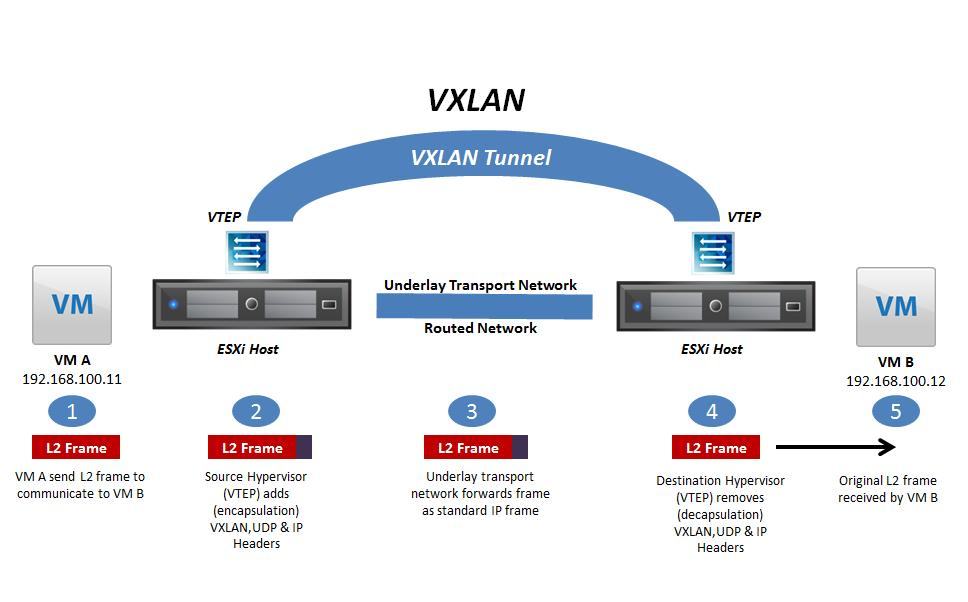
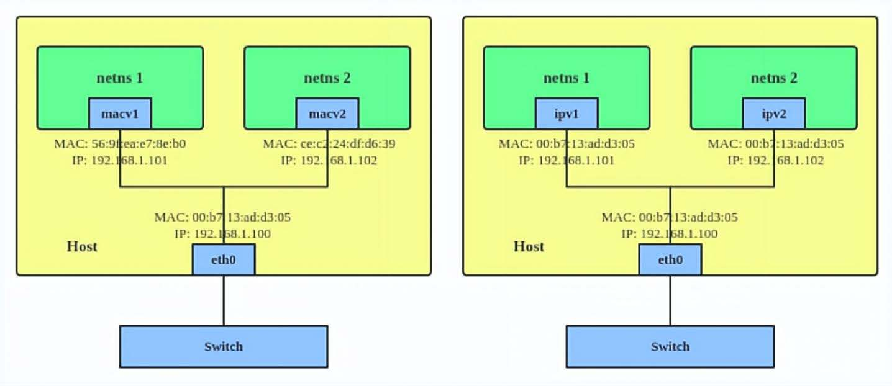
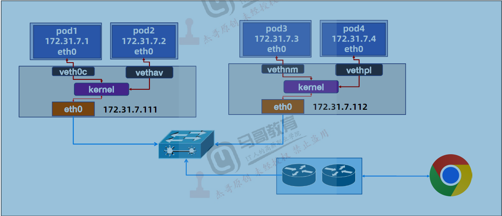
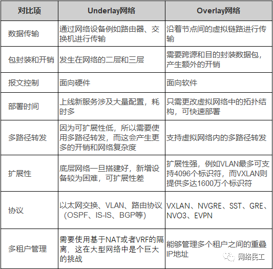

# 1. 总结 Underlay 和 Overlay 网络的的区别及优缺点
## 1.1 Overlay 网络
### 1.1.1 Overlay网络简介
* Overlay叫叠加网络也叫覆盖网络，指的是在物理网络的基础之上叠加实现新的虚拟网络，即可使网络的中的容器可以相互通信。
* 优点是对物理网络的兼容性比较好，可以实现pod的夸宿主机子网通信。
* calico与flannel等网络插件都支持overlay网络。
* 缺点是有额外的封装与解封性能开销。
* 目前私有云使用比较多。
### 1.1.2 overlay设备简介
* VTEP(VXLAN Tunnel Endpoint vxlan隧道端点),VTEP是VXLAN网络的边缘设备，是VXLAN隧道的起点和终点，VXLAN对用户原始数据帧的封装和解封装均在VTEP上进行,用于VXLAN报文的封装和解封装,VTEP与物理网络相连,VXLAN报文中源IP地址为本节点的VTEP地址，VXLAN报文中目的IP地址为对端节点的VTEP地址，一对VTEP地址就对应着一个VXLAN隧道，服务器上的虚拟交换机(隧道flannel.1就是VTEP)，比如一个虚拟机网络中的多个vxlan就需要多个VTEP对不同网络的报文进行封装与解封装。
* VNI（VXLAN Network Identifier）：VXLAN网络标识VNI类似VLAN ID,用于区分VXLAN段,不同VXLAN段的虚拟机不能直接二层相互通信,一个VNI表示一个租户,即使多个终端用户属于同一个VNI,也表示一个租户。
* NVGRE：Network Virtualization using Generic Routing Encapsulation，主要支持者是Microsoft，与VXLAN不同的是，NVGRE没有采用标准传输协议（TCP/UDP），而是借助通用路由封装协议（GRE），NVGRE使用GRE头部的第24位作为租户网络标识符（TNI）， 与VXLAN一样可以支持1777216个vlan。
### 1.1.3 overlay通信简介

* VM A发送L2 帧与VM请求与VM B通信。
* 源宿主机VTEP添加或者封装VXLAN、UDP及IP头部报文。
* 网络层设备将封装后的报文通过标准的报文在三层网络进行转发到目标主机。
* 目标宿主机VTEP删除或者解封装VXLAN、UDP及IP头部。
* 将原始L2帧发送给目标VM。

## 1.2 Underlay 网络
### 1.2.1 Underlay 网络简介
* Underlay网络就是传统IT基础设施网络，由交换机和路由器等设备组成，借助以太网协议、路由协议和VLAN协议等驱动，它还是Overlay网络的底层网络，为Overlay网络提供数据通信服务。容器网络中的Underlay网络是指借助驱动程序将宿主机的底层网络接口直接暴露给容器使用的一种网络构建技术，较为常见的解决方案有MAC VLAN、IP VLAN和直接路由等。
* Underlay依赖于物理网络进行跨主机通信。
### 1.2.2 underlay实现模式
* Mac Vlan模式
  * MAC VLAN：支持在同一个以太网接口上虚拟出多个网络接口(子接口)，每个虚拟接口都拥有唯一的MAC地址并可配置网卡子接口IP。
* IP VLAN模式
  * IP VLAN类似于MAC VLAN，它同样创建新的虚拟网络接口并为每个接口分配唯一的IP地址，不同之处在于，每个虚拟接口将共享使用物理接口的MAC地址。


### 1.2.3 MAC Vlan工作模式
* Private(私有)模式
  * 在Private模式下，同一个宿主机下的容器不能通信，即使通过交换机再把数据报文转发回来也不行。
* VEPA模式
  * 虚拟以太端口汇聚器（Virtual Ethernet Port Aggregator，简称VEPA），在这种模式下，macvlan内的容器不能直接接收在同一个物理网卡的容器的请求数据包，但是可以经过交换机的(端口回流)再转发回来可以实现通信。
* passthru(直通)模式
  * Passthru模式下该macvlan只能创建一个容器，当运行一个容器后再创建其他容器则会报错。
* bridge模式
  * 在bridge这种模式下，使用同一个宿主机网络的macvlan容器可以直接实现通信，推荐使用此模式。
### 1.2.4 underlay架构图


## 1.3 总结

* Overlay建立在Underlay网络之上，设备之间可以通过逻辑链路，按照需求完成互联形成Overlay拓扑
* Underlay网络中，互联的设备可以是各类型交换机、路由器、负载均衡设备、防火墙等，但网络的各个设备之间必须通过路由协议来确保之间IP的连通性
* 在Overlay网络中，流量从源传输到目的可通过多条路径，从而实现负载分担，最大化利用线路的带宽。
* Underlay网络中新增或变更业务需要对现有底层网络连接进行修改，重新配置耗时严重
# 2. 在 kubernetes 集群实现 underlay 网络
## 2.1 k8s 环境准备-安装运行时
```bash
## 在包括master及node节点在内的每一个节点安装docker或containerd运行时，先安装必要的一些系统工具，只展示master节点
root@k8s-master1:~# apt-get update
root@k8s-master1:~# apt -y install apt-transport-https ca-certificates curl software-properties-common
## 安装GPG证书
root@k8s-master1:~# curl -fsSL http://mirrors.aliyun.com/docker-ce/linux/ubuntu/gpg | sudo apt-key add -
Warning: apt-key is deprecated. Manage keyring files in trusted.gpg.d instead (see apt-key(8)).
OK
## 写入软件源信息
root@k8s-master1:~# add-apt-repository "deb [arch=amd64] http://mirrors.aliyun.com/docker-ce/linux/ubuntu $(lsb_release -cs) stable"
## 更新软件
root@k8s-master1:~# apt update
## 查看docker可安装的版本
root@k8s-master1:~# apt-cache madison docker-ce docker-ce-cli
 docker-ce | 5:23.0.1-1~ubuntu.22.04~jammy | http://mirrors.aliyun.com/docker-ce/linux/ubuntu jammy/stable amd64 Packages
 docker-ce | 5:23.0.0-1~ubuntu.22.04~jammy | http://mirrors.aliyun.com/docker-ce/linux/ubuntu jammy/stable amd64 Packages
 docker-ce | 5:20.10.23~3-0~ubuntu-jammy | http://mirrors.aliyun.com/docker-ce/linux/ubuntu jammy/stable amd64 Packages
 docker-ce | 5:20.10.22~3-0~ubuntu-jammy | http://mirrors.aliyun.com/docker-ce/linux/ubuntu jammy/stable amd64 Packages
 docker-ce | 5:20.10.21~3-0~ubuntu-jammy | http://mirrors.aliyun.com/docker-ce/linux/ubuntu jammy/stable amd64 Packages
 docker-ce | 5:20.10.20~3-0~ubuntu-jammy | http://mirrors.aliyun.com/docker-ce/linux/ubuntu jammy/stable amd64 Packages
 docker-ce | 5:20.10.19~3-0~ubuntu-jammy | http://mirrors.aliyun.com/docker-ce/linux/ubuntu jammy/stable amd64 Packages
 docker-ce | 5:20.10.18~3-0~ubuntu-jammy | http://mirrors.aliyun.com/docker-ce/linux/ubuntu jammy/stable amd64 Packages
 docker-ce | 5:20.10.17~3-0~ubuntu-jammy | http://mirrors.aliyun.com/docker-ce/linux/ubuntu jammy/stable amd64 Packages
 docker-ce | 5:20.10.16~3-0~ubuntu-jammy | http://mirrors.aliyun.com/docker-ce/linux/ubuntu jammy/stable amd64 Packages
 docker-ce | 5:20.10.15~3-0~ubuntu-jammy | http://mirrors.aliyun.com/docker-ce/linux/ubuntu jammy/stable amd64 Packages
 docker-ce | 5:20.10.14~3-0~ubuntu-jammy | http://mirrors.aliyun.com/docker-ce/linux/ubuntu jammy/stable amd64 Packages
 docker-ce | 5:20.10.13~3-0~ubuntu-jammy | http://mirrors.aliyun.com/docker-ce/linux/ubuntu jammy/stable amd64 Packages
docker-ce-cli | 5:23.0.1-1~ubuntu.22.04~jammy | http://mirrors.aliyun.com/docker-ce/linux/ubuntu jammy/stable amd64 Packages
docker-ce-cli | 5:23.0.0-1~ubuntu.22.04~jammy | http://mirrors.aliyun.com/docker-ce/linux/ubuntu jammy/stable amd64 Packages
docker-ce-cli | 5:20.10.23~3-0~ubuntu-jammy | http://mirrors.aliyun.com/docker-ce/linux/ubuntu jammy/stable amd64 Packages
docker-ce-cli | 5:20.10.22~3-0~ubuntu-jammy | http://mirrors.aliyun.com/docker-ce/linux/ubuntu jammy/stable amd64 Packages
docker-ce-cli | 5:20.10.21~3-0~ubuntu-jammy | http://mirrors.aliyun.com/docker-ce/linux/ubuntu jammy/stable amd64 Packages
docker-ce-cli | 5:20.10.20~3-0~ubuntu-jammy | http://mirrors.aliyun.com/docker-ce/linux/ubuntu jammy/stable amd64 Packages
docker-ce-cli | 5:20.10.19~3-0~ubuntu-jammy | http://mirrors.aliyun.com/docker-ce/linux/ubuntu jammy/stable amd64 Packages
docker-ce-cli | 5:20.10.18~3-0~ubuntu-jammy | http://mirrors.aliyun.com/docker-ce/linux/ubuntu jammy/stable amd64 Packages
docker-ce-cli | 5:20.10.17~3-0~ubuntu-jammy | http://mirrors.aliyun.com/docker-ce/linux/ubuntu jammy/stable amd64 Packages
docker-ce-cli | 5:20.10.16~3-0~ubuntu-jammy | http://mirrors.aliyun.com/docker-ce/linux/ubuntu jammy/stable amd64 Packages
docker-ce-cli | 5:20.10.15~3-0~ubuntu-jammy | http://mirrors.aliyun.com/docker-ce/linux/ubuntu jammy/stable amd64 Packages
docker-ce-cli | 5:20.10.14~3-0~ubuntu-jammy | http://mirrors.aliyun.com/docker-ce/linux/ubuntu jammy/stable amd64 Packages
docker-ce-cli | 5:20.10.13~3-0~ubuntu-jammy | http://mirrors.aliyun.com/docker-ce/linux/ubuntu jammy/stable amd64 Packages
## 安装docker
root@k8s-master1:~# apt install -y docker-ce docker-ce-cli
## 启动docker并加入开机自启动
root@k8s-master1:~# systemctl start docker && systemctl enable docker
Synchronizing state of docker.service with SysV service script with /lib/systemd/systemd-sysv-install.
Executing: /lib/systemd/systemd-sysv-install enable docker
## 参数优化，配置镜像加速并使用systemd
root@k8s-master1:~# mkdir -p /etc/docker
root@k8s-master1:~# tee /etc/docker/daemon.json <<-'EOF'
{
"exec-opts": ["native.cgroupdriver=systemd"],
"registry-mirrors": ["https://9916w1ow.mirror.aliyuncs.com"]
}
EOF
{
"exec-opts": ["native.cgroupdriver=systemd"],
"registry-mirrors": ["https://9916w1ow.mirror.aliyuncs.com"]
}
## 重启docker使配置生效
root@k8s-master1:~# systemctl daemon-reload && sudo systemctl restart docker
## 查看docker 配置信息
root@k8s-master1:~# docker info
Client:
 Context:    default
 Debug Mode: false
 Plugins:
  buildx: Docker Buildx (Docker Inc.)
    Version:  v0.10.2
    Path:     /usr/libexec/docker/cli-plugins/docker-buildx
  compose: Docker Compose (Docker Inc.)
    Version:  v2.16.0
    Path:     /usr/libexec/docker/cli-plugins/docker-compose
  scan: Docker Scan (Docker Inc.)
    Version:  v0.23.0
    Path:     /usr/libexec/docker/cli-plugins/docker-scan

Server:
 Containers: 0
  Running: 0
  Paused: 0
  Stopped: 0
 Images: 0
 Server Version: 23.0.1
 Storage Driver: overlay2
  Backing Filesystem: extfs
  Supports d_type: true
  Using metacopy: false
  Native Overlay Diff: true
  userxattr: false
 Logging Driver: json-file
 Cgroup Driver: systemd
 Cgroup Version: 2
 Plugins:
  Volume: local
  Network: bridge host ipvlan macvlan null overlay
  Log: awslogs fluentd gcplogs gelf journald json-file local logentries splunk syslog
 Swarm: inactive
 Runtimes: io.containerd.runc.v2 runc
 Default Runtime: runc
 Init Binary: docker-init
 containerd version: 2456e983eb9e37e47538f59ea18f2043c9a73640
 runc version: v1.1.4-0-g5fd4c4d
 init version: de40ad0
 Security Options:
  apparmor
  seccomp
   Profile: builtin
  cgroupns
 Kernel Version: 5.15.0-53-generic
 Operating System: Ubuntu 22.04.1 LTS
 OSType: linux
 Architecture: x86_64
 CPUs: 2
 Total Memory: 3.799GiB
 Name: k8s-master1
 ID: 600e6b98-14e5-4119-93c4-fcf86e3c0e5e
 Docker Root Dir: /var/lib/docker
 Debug Mode: false
 Registry: https://index.docker.io/v1/
 Experimental: false
 Insecure Registries:
  127.0.0.0/8
 Registry Mirrors:
  https://9916w1ow.mirror.aliyuncs.com/
 Live Restore Enabled: false
```
## 2.2 安装cri-dockerd-二进制
```bash
## 下载二进制安装包
root@k8s-master1:~# wget https://github.com/Mirantis/cri-dockerd/releases/download/v0.3.1/cri-dockerd-0.3.1.amd64.tgz
## 解压安装包
root@k8s-node3:~# tar xvf cri-dockerd-0.3.1.amd64.tgz
cri-dockerd/
cri-dockerd/cri-dockerd
## 拷贝二进制文件到可执行目录
root@k8s-master1:~# cp cri-dockerd/cri-dockerd /usr/local/bin/
## 编写cri-docker.service
root@k8s-master1:~# vim /lib/systemd/system/cri-docker.service
[Unit]
Description=CRI Interface for Docker Application Container Engine
Documentation=https://docs.mirantis.com
After=network-online.target firewalld.service docker.service
Wants=network-online.target
Requires=cri-docker.socket

[Service]
Type=notify
ExecStart=/usr/local/bin/cri-dockerd --network-plugin=cni --pod-infra-container-image=registry.aliyuncs.com/google_containers/pause:3.9
ExecReload=/bin/kill -s HUP $MAINPID
TimeoutSec=0
RestartSec=2
Restart=always
StartLimitBurst=3
StartLimitInterval=60s
LimitNOFILE=infinity
LimitNPROC=infinity
LimitCORE=infinity
TasksMax=infinity
Delegate=yes
KillMode=process

[Install]
WantedBy=multi-user.target
## 配置cri-docker.socket文件
root@k8s-master1:~# vim /etc/systemd/system/cri-docker.socket
[Unit]
Description=CRI Docker Socket for the API
PartOf=cri-docker.service
[Socket]
ListenStream=%t/cri-dockerd.sock
SocketMode=0660
SocketUser=root
SocketGroup=docker
[Install]
WantedBy=sockets.target
## 启动服务
root@k8s-master1:~# systemctl daemon-reload && systemctl restart cri-docker && systemctl enable cri-docker && systemctl enable --now cri-docker.socket
## 查看cri-docker启动状态
root@k8s-master1:~# systemctl status cri-docker
● cri-docker.service - CRI Interface for Docker Application Container Engine
     Loaded: loaded (/lib/systemd/system/cri-docker.service; enabled; vendor preset: enabled)
     Active: active (running) since Wed 2023-03-01 16:16:29 UTC; 3min 41s ago
TriggeredBy: ● cri-docker.socket
       Docs: https://docs.mirantis.com
   Main PID: 50596 (cri-dockerd)
      Tasks: 7
     Memory: 9.2M
        CPU: 57ms
     CGroup: /system.slice/cri-docker.service
             └─50596 /usr/local/bin/cri-dockerd --network-plugin=cni --pod-infra-container-image=registry.aliyuncs.com/google_containers/pause:3>

Mar 01 16:16:29 k8s-master1 cri-dockerd[50596]: time="2023-03-01T16:16:29Z" level=info msg="The binary conntrack is not installed, this can caus>
Mar 01 16:16:29 k8s-master1 cri-dockerd[50596]: time="2023-03-01T16:16:29Z" level=info msg="The binary conntrack is not installed, this can caus>
Mar 01 16:16:29 k8s-master1 cri-dockerd[50596]: time="2023-03-01T16:16:29Z" level=info msg="Loaded network plugin cni"
Mar 01 16:16:29 k8s-master1 cri-dockerd[50596]: time="2023-03-01T16:16:29Z" level=info msg="Docker cri networking managed by network plugin cni"
Mar 01 16:16:29 k8s-master1 cri-dockerd[50596]: time="2023-03-01T16:16:29Z" level=info msg="Docker Info: &{ID:600e6b98-14e5-4119-93c4-fcf86e3c0e>
Mar 01 16:16:29 k8s-master1 cri-dockerd[50596]: time="2023-03-01T16:16:29Z" level=info msg="Setting cgroupDriver systemd"
Mar 01 16:16:29 k8s-master1 cri-dockerd[50596]: time="2023-03-01T16:16:29Z" level=info msg="Docker cri received runtime config &RuntimeConfig{Ne>
Mar 01 16:16:29 k8s-master1 cri-dockerd[50596]: time="2023-03-01T16:16:29Z" level=info msg="Starting the GRPC backend for the Docker CRI interfa>
Mar 01 16:16:29 k8s-master1 cri-dockerd[50596]: time="2023-03-01T16:16:29Z" level=info msg="Start cri-dockerd grpc backend"
Mar 01 16:16:29 k8s-master1 systemd[1]: Started CRI Interface for Docker Application Container Engine.

```
# 3. 总结网络组件 flannel vxlan
模式的网络通信流程
# 4. 总结网络组件 calico IPIP 模式的网络通信流程

## 扩展
### 1. 基于二进制实现高可用的 K8S 集群环境