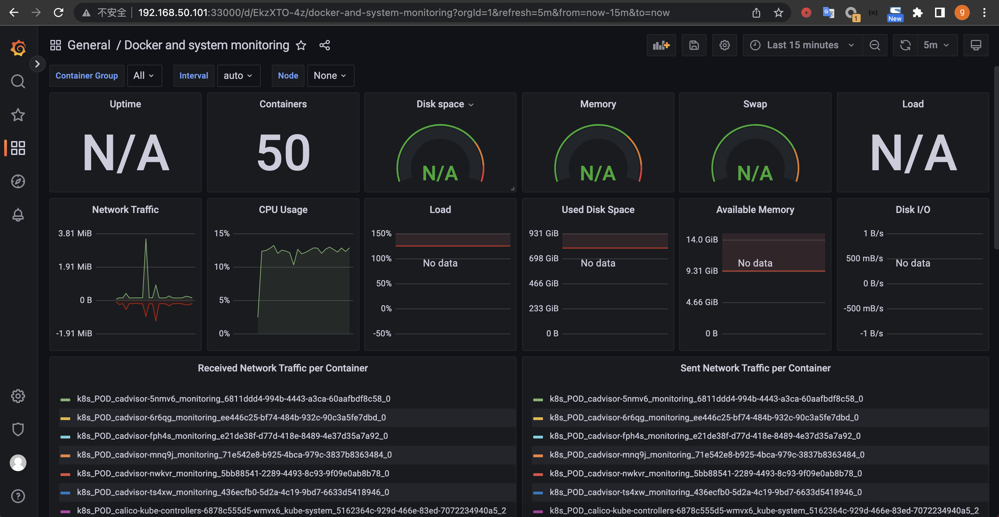
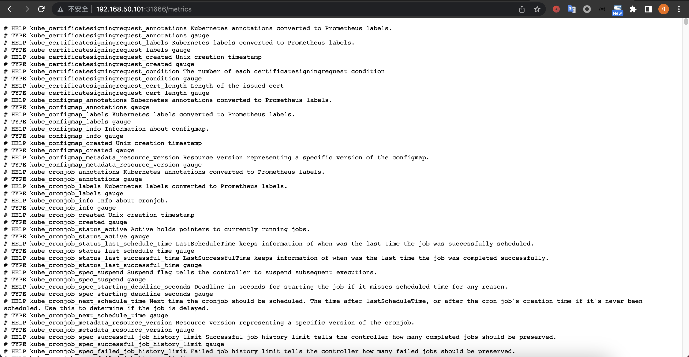

# 1. 基于NetworkPolicy 限制magedu namespace中的所有pod不能跨namespace访问(只能访问当前namespace中的所有pod)。
```bash
## 创建magedu namespace
root@k8s-master1:~# kubectl create namespace magedu
namespace/magedu created
## 在default namespace创建一个nginx1-default应用
root@k8s-master1:~# vi centos7-magedu.yaml
apiVersion: apps/v1
kind: Deployment
metadata:
  labels:
    app: centos7-magedu
  name: centos7-magedu
  namespace: magedu
spec:
  replicas: 1
  selector:
    matchLabels:
      app: centos7-magedu
  template:
    metadata:
      labels:
        app: centos7-magedu
    spec:
      containers:
      - image: centos:centos7.9.2009
        name: centos
        command:
          - sleep
          - "50000000"
root@k8s-master1:~# kubectl apply -f centos7-magedu.yaml
deployment.apps/centos7-magedu created
root@k8s-master1:~# kubectl get pod -n magedu
NAME                              READY   STATUS    RESTARTS   AGE
centos7-magedu-6b95d5bc7b-dt5f4   1/1     Running   0          11s
nginx2-magedu-c8bddb55-9zzg2      1/1     Running   0          61m
## 在magedu namespace创建一个nginx2-magedu应用
root@k8s-master1:~# kubectl  create deploy nginx2-magedu --image=nginx --namespace magedu
deployment.apps/nginx2-magedu created
## 在magedu namespace创建一个centos7-magedu应用
root@k8s-master1:~# kubectl create deploy centos7-magedu --image=centos7 --namespace=magedu
deployment.apps/centos7-magedu created
## 在default namespace创建一个centos7-default应用
root@k8s-master1:~# vi centos7-default.yaml
apiVersion: apps/v1
kind: Deployment
metadata:
  labels:
    app: centos7-default
  name: centos7-default
  namespace: default
spec:
  replicas: 1
  selector:
    matchLabels:
      app: centos7-default
  template:
    metadata:
      labels:
        app: centos7-default
    spec:
      containers:
      - image: centos:centos7.9.2009
        name: centos
        command:
          - sleep
          - "50000000"
root@k8s-master1:~# kubectl apply -f centos7-default.yaml
deployment.apps/centos7-default created
root@k8s-master1:~# kubectl get pod
NAME                              READY   STATUS    RESTARTS   AGE
centos7-default-f65f95564-rvrhg   1/1     Running   0          6s
nginx1-default-d8d6b4cdd-btqhv    1/1     Running   0          60m
## default namespace 访问magedu namespace应用
root@k8s-master1:~# kubectl exec -it centos7-default-f65f95564-rvrhg bash
kubectl exec [POD] [COMMAND] is DEPRECATED and will be removed in a future version. Use kubectl exec [POD] -- [COMMAND] instead.
[root@centos7-default-f65f95564-rvrhg /]# curl 10.100.36.68
<!DOCTYPE html>
<html>
<head>
<title>Welcome to nginx!</title>
<style>
html { color-scheme: light dark; }
body { width: 35em; margin: 0 auto;
font-family: Tahoma, Verdana, Arial, sans-serif; }
</style>
</head>
<body>
<h1>Welcome to nginx!</h1>
<p>If you see this page, the nginx web server is successfully installed and
working. Further configuration is required.</p>

<p>For online documentation and support please refer to
<a href="http://nginx.org/">nginx.org</a>.<br/>
Commercial support is available at
<a href="http://nginx.com/">nginx.com</a>.</p>

<p><em>Thank you for using nginx.</em></p>
</body>
</html>
[root@centos7-default-f65f95564-rvrhg /]# ping 10.100.36.68
PING 10.100.36.68 (10.100.36.68) 56(84) bytes of data.
64 bytes from 10.100.36.68: icmp_seq=1 ttl=63 time=0.198 ms
64 bytes from 10.100.36.68: icmp_seq=2 ttl=63 time=0.095 ms
64 bytes from 10.100.36.68: icmp_seq=3 ttl=63 time=0.185 ms
^C
--- 10.100.36.68 ping statistics ---
3 packets transmitted, 3 received, 0% packet loss, time 2062ms
rtt min/avg/max/mdev = 0.095/0.159/0.198/0.046 ms
## magedu namespace 访问default namespace服务
root@k8s-master1:~# kubectl exec -it centos7-magedu-6b95d5bc7b-dt5f4 bash -n magedu
kubectl exec [POD] [COMMAND] is DEPRECATED and will be removed in a future version. Use kubectl exec [POD] -- [COMMAND] instead.
[root@centos7-magedu-6b95d5bc7b-dt5f4 /]# curl 10.100.36.67
<!DOCTYPE html>
<html>
<head>
<title>Welcome to nginx!</title>
<style>
html { color-scheme: light dark; }
body { width: 35em; margin: 0 auto;
font-family: Tahoma, Verdana, Arial, sans-serif; }
</style>
</head>
<body>
<h1>Welcome to nginx!</h1>
<p>If you see this page, the nginx web server is successfully installed and
working. Further configuration is required.</p>

<p>For online documentation and support please refer to
<a href="http://nginx.org/">nginx.org</a>.<br/>
Commercial support is available at
<a href="http://nginx.com/">nginx.com</a>.</p>

<p><em>Thank you for using nginx.</em></p>
</body>
</html>
[root@centos7-magedu-6b95d5bc7b-dt5f4 /]# ping 10.100.36.67
PING 10.100.36.67 (10.100.36.67) 56(84) bytes of data.
64 bytes from 10.100.36.67: icmp_seq=1 ttl=63 time=0.126 ms
64 bytes from 10.100.36.67: icmp_seq=2 ttl=63 time=0.069 ms
64 bytes from 10.100.36.67: icmp_seq=3 ttl=63 time=0.061 ms
^C
--- 10.100.36.67 ping statistics ---
3 packets transmitted, 3 received, 0% packet loss, time 2045ms
rtt min/avg/max/mdev = 0.061/0.085/0.126/0.029 ms
## 编辑NetworkPolicy yaml文件
root@k8s-master1:~# vi Egress-magedu.yaml
apiVersion: networking.k8s.io/v1
kind: NetworkPolicy
metadata:
  name: egress-access-networkpolicy
  namespace: magedu
spec:
  policyTypes:
  - Egress
  podSelector:
    matchLabels: {}
  egress:
    - to:
      - podSelector:
          matchLabels: {}
## 应用网络策略
root@k8s-master1:~# kubectl get networkpolicy -n magedu
NAME                          POD-SELECTOR   AGE
egress-access-networkpolicy   <none>         19s
## 在default namespace验证
[root@centos7-default-f65f95564-rvrhg /]# curl 10.100.36.68
<!DOCTYPE html>
<html>
<head>
<title>Welcome to nginx!</title>
<style>
html { color-scheme: light dark; }
body { width: 35em; margin: 0 auto;
font-family: Tahoma, Verdana, Arial, sans-serif; }
</style>
</head>
<body>
<h1>Welcome to nginx!</h1>
<p>If you see this page, the nginx web server is successfully installed and
working. Further configuration is required.</p>

<p>For online documentation and support please refer to
<a href="http://nginx.org/">nginx.org</a>.<br/>
Commercial support is available at
<a href="http://nginx.com/">nginx.com</a>.</p>

<p><em>Thank you for using nginx.</em></p>
</body>
</html>
[root@centos7-default-f65f95564-rvrhg /]# ping 10.100.36.68
PING 10.100.36.68 (10.100.36.68) 56(84) bytes of data.
64 bytes from 10.100.36.68: icmp_seq=1 ttl=63 time=0.129 ms
64 bytes from 10.100.36.68: icmp_seq=2 ttl=63 time=0.261 ms
64 bytes from 10.100.36.68: icmp_seq=3 ttl=63 time=0.126 ms
^C
--- 10.100.36.68 ping statistics ---
3 packets transmitted, 3 received, 0% packet loss, time 2053ms
rtt min/avg/max/mdev = 0.126/0.172/0.261/0.062 ms
## 在magedu namespace验证
[root@centos7-magedu-6b95d5bc7b-dt5f4 /]# curl 10.100.36.67
^C
[root@centos7-magedu-6b95d5bc7b-dt5f4 /]# ping 10.100.36.67
PING 10.100.36.67 (10.100.36.67) 56(84) bytes of data.
^C
--- 10.100.36.67 ping statistics ---
2 packets transmitted, 0 received, 100% packet loss, time 1033ms

[root@centos7-magedu-6b95d5bc7b-dt5f4 /]#  curl 10.100.36.68
<!DOCTYPE html>
<html>
<head>
<title>Welcome to nginx!</title>
<style>
html { color-scheme: light dark; }
body { width: 35em; margin: 0 auto;
font-family: Tahoma, Verdana, Arial, sans-serif; }
</style>
</head>
<body>
<h1>Welcome to nginx!</h1>
<p>If you see this page, the nginx web server is successfully installed and
working. Further configuration is required.</p>

<p>For online documentation and support please refer to
<a href="http://nginx.org/">nginx.org</a>.<br/>
Commercial support is available at
<a href="http://nginx.com/">nginx.com</a>.</p>

<p><em>Thank you for using nginx.</em></p>
</body>
</html>
[root@centos7-magedu-6b95d5bc7b-dt5f4 /]# ping 10.100.36.68
PING 10.100.36.68 (10.100.36.68) 56(84) bytes of data.
64 bytes from 10.100.36.68: icmp_seq=1 ttl=63 time=0.163 ms
64 bytes from 10.100.36.68: icmp_seq=2 ttl=63 time=0.098 ms
64 bytes from 10.100.36.68: icmp_seq=3 ttl=63 time=0.084 ms
64 bytes from 10.100.36.68: icmp_seq=4 ttl=63 time=0.094 ms
^C
--- 10.100.36.68 ping statistics ---
4 packets transmitted, 4 received, 0% packet loss, time 3065ms
rtt min/avg/max/mdev = 0.084/0.109/0.163/0.033 ms
[root@centos7-magedu-6b95d5bc7b-dt5f4 /]#
## 网络策略生效后，其它namespace可以访问magedu namespace内的服务，magedu内的pod无妨访问外部的服务

```
# 2. 在kubernetes环境部署zookeeper集群并基于NFS或StorageClass等方式实现创建持久化。
```bash
## 切换到工作目录
root@k8s-master1:~# cd /opt/k8s-data/
## 下载镜像
root@k8s-master1:/opt/k8s-data# docker pull elevy/slim_java:8
## 镜像重命名
root@k8s-master1:/opt/k8s-data# docker tag elevy/slim_java:8 harbor.yanggc.cn/baseimages/slim_java:8
## 推送到本地镜像
root@k8s-master1:/opt/k8s-data# docker push harbor.yanggc.cn/baseimages/slim_java:8
The push refers to repository [harbor.yanggc.cn/baseimages/slim_java]
e053edd72ca6: Pushed
aba783efb1a4: Pushed
5bef08742407: Pushed
8: digest: sha256:817d0af5d4f16c29509b8397784f5d4ec3accb1bfde4e474244ed3be7f41a604 size: 952
## 修改dockerfile 依赖镜像地址
root@k8s-master1:/opt/k8s-data# cd  dockerfile/web/magedu/zookeeper/
FROM harbor.yanggc.cn/baseimages/slim_java:8
## 修改编译脚本镜像地址
root@k8s-master1:/opt/k8s-data/dockerfile/web/magedu/zookeeper# vi build-command.sh

docker build -t harbor.yanggc.cn/magedu/zookeeper:${TAG} .
docker push  harbor.yanggc.cn/magedu/zookeeper:${TAG}
## 编译并上传镜像
root@k8s-master1:/opt/k8s-data/dockerfile/web/magedu/zookeeper# bash build-command.sh v3.4.14
## 测试镜像
root@k8s-master1:/opt/k8s-data/dockerfile/web/magedu/zookeeper#docker run -it --rm harbor.yanggc.cn/magedu/zookeeper:v3.4.14
2023-03-10 14:28:21,418 [myid:] - INFO  [main:ServerCnxnFactory@117] - Using org.apache.zookeeper.server.NIOServerCnxnFactory as server connection factory
2023-03-10 14:28:21,420 [myid:] - INFO  [main:NIOServerCnxnFactory@89] - binding to port 0.0.0.0/0.0.0.0:2181
## 镜像测试没问题
## NFS 服务器创建zookeeper的pv数据目录
root@haproxy1:~# mkdir -p /data/k8sdata/magedu/zookeeper-datadir-1
root@haproxy1:~# mkdir -p /data/k8sdata/magedu/zookeeper-datadir-2
root@haproxy1:~# mkdir -p /data/k8sdata/magedu/zookeeper-datadir-3
## NFS配置共享目录
oot@haproxy1:~# vi /etc/exports
/data/k8sdata *(rw,no_root_squash,no_subtree_check)
## 生效NFS配置
root@haproxy1:~# exportfs -r
## master1测试NFS服务
root@k8s-master1:~# showmount -e 172.31.7.109
Export list for 172.31.7.109:
/data/k8sdata *
## 切换到zookeeper编排目录
root@k8s-master1:~# cd /opt/k8s-data/yaml/magedu/zookeeper/pv
## 创建pv和pvc
root@k8s-master1:/opt/k8s-data/yaml/magedu/zookeeper/pv# kubectl get pvc -n magedu
NAME                      STATUS   VOLUME                   CAPACITY   ACCESS MODES   STORAGECLASS   AGE
zookeeper-datadir-pvc-1   Bound    zookeeper-datadir-pv-1   20Gi       RWO                           18s
zookeeper-datadir-pvc-2   Bound    zookeeper-datadir-pv-2   20Gi       RWO                           18s
zookeeper-datadir-pvc-3   Bound    zookeeper-datadir-pv-3   20Gi       RWO                           18s
## 查看pvc状态
root@k8s-master1:/opt/k8s-data/yaml/magedu/zookeeper/pv# kubectl get pvc -n magedu
NAME                      STATUS   VOLUME                   CAPACITY   ACCESS MODES   STORAGECLASS   AGE
zookeeper-datadir-pvc-1   Bound    zookeeper-datadir-pv-1   20Gi       RWO                           18s
zookeeper-datadir-pvc-2   Bound    zookeeper-datadir-pv-2   20Gi       RWO                           18s
zookeeper-datadir-pvc-3   Bound    zookeeper-datadir-pv-3   20Gi       RWO                           18s
## 修改zookeeper镜像地址
root@k8s-master1:/opt/k8s-data/yaml/magedu/zookeeper/pv# cd ..
root@k8s-master1:/opt/k8s-data/yaml/magedu/zookeeper# vi zookeeper.yaml
harbor.yanggc.cn/magedu/zookeeper:v3.4.14
## 部署zookeeper
root@k8s-master1:/opt/k8s-data/yaml/magedu/zookeeper# kubectl apply -f zookeeper.yaml
service/zookeeper created
service/zookeeper1 created
service/zookeeper2 created
service/zookeeper3 created
deployment.apps/zookeeper1 created
deployment.apps/zookeeper2 created
deployment.apps/zookeeper3 created
## 查看pod和service
root@k8s-master1:/opt/k8s-data/yaml/magedu/zookeeper# kubectl get pod,svc -n magedu -o wide
NAME                             READY   STATUS    RESTARTS   AGE   IP               NODE           NOMINATED NODE   READINESS GATES
pod/zookeeper1-b5579df54-x9rb7   1/1     Running   0          17s   10.200.169.130   172.31.7.112   <none>           <none>
pod/zookeeper2-fdc6f4599-vgbsd   1/1     Running   0          17s   10.200.107.197   172.31.7.113   <none>           <none>
pod/zookeeper3-c8cf99bf6-nxvt2   1/1     Running   0          17s   10.200.36.70     172.31.7.111   <none>           <none>

NAME                 TYPE        CLUSTER-IP       EXTERNAL-IP   PORT(S)                                        AGE   SELECTOR
service/zookeeper    ClusterIP   10.100.103.226   <none>        2181/TCP                                       17s   app=zookeeper
service/zookeeper1   NodePort    10.100.43.149    <none>        2181:32181/TCP,2888:46222/TCP,3888:57282/TCP   17s   app=zookeeper,server-id=1
service/zookeeper2   NodePort    10.100.131.111   <none>        2181:32182/TCP,2888:58802/TCP,3888:59463/TCP   17s   app=zookeeper,server-id=2
service/zookeeper3   NodePort    10.100.236.26    <none>        2181:32183/TCP,2888:36299/TCP,3888:42005/TCP   17s   app=zookeeper,server-id=3
## 登录验证
root@k8s-master1:/opt/k8s-data/yaml/magedu/zookeeper# kubectl -n magedu exec -it zookeeper1-b5579df54-x9rb7 -- /zookeeper/bin/zkServer.sh status
ZooKeeper JMX enabled by default
ZooKeeper remote JMX Port set to 9010
ZooKeeper remote JMX authenticate set to false
ZooKeeper remote JMX ssl set to false
ZooKeeper remote JMX log4j set to true
Using config: /zookeeper/bin/../conf/zoo.cfg
Mode: leader
root@k8s-master1:/opt/k8s-data/yaml/magedu/zookeeper# kubectl -n magedu exec -it zookeeper2-fdc6f4599-vgbsd -- /zookeeper/bin/zkServer.sh status
ZooKeeper JMX enabled by default
ZooKeeper remote JMX Port set to 9010
ZooKeeper remote JMX authenticate set to false
ZooKeeper remote JMX ssl set to false
ZooKeeper remote JMX log4j set to true
Using config: /zookeeper/bin/../conf/zoo.cfg
Mode: follower
root@k8s-master1:/opt/k8s-data/yaml/magedu/zookeeper# kubectl -n magedu exec -it zookeeper3-c8cf99bf6-nxvt2 -- /zookeeper/bin/zkServer.sh status
ZooKeeper JMX enabled by default
ZooKeeper remote JMX Port set to 9010
ZooKeeper remote JMX authenticate set to false
ZooKeeper remote JMX ssl set to false
ZooKeeper remote JMX log4j set to true
Using config: /zookeeper/bin/../conf/zoo.cfg
Mode: follower
## 查看集群节点状态正常
```
# 3. 在Kubernetes环境部署基于StatefulSet运行MySQL一主多从并基于NFS或StorageClass等方式实现数据持久化。
## 3.1 准备基础镜像
```bash
## 下载mysql镜像
root@k8s-master1:~# docker pull mysql:5.7.36
## 镜像重命名
root@k8s-master1:~# docker tag mysql:5.7.36 harbor.yanggc.cn/magedu/mysql:5.7.36
## 推送到本地仓库
root@k8s-master1:~# docker push harbor.yanggc.cn/magedu/mysql:5.7.36
## 下载xtrabackup镜像
root@k8s-master1:~# docker pull zhangshijie/xtrabackup:1.0
## 镜像重命名
root@k8s-master1:~# docker tag zhangshijie/xtrabackup:1.0 harbor.yanggc.cn/magedu/xtrabackup:1.0
## 推送到本地镜像仓库
root@k8s-master1:~# docker push harbor.yanggc.cn/magedu/xtrabackup:1.0
```
## 3.2 创建mysql存储
```bash
## NFS服务器创建mysql存储目录
root@haproxy1:~# mkdir -p /data/k8sdata/magedu/mysql-datadir-{1..6}
## 切换到mysql部署目录
root@k8s-master1:~# cd /opt/k8s-data/yaml/magedu/mysql/
## 创建pv
root@k8s-master1:/opt/k8s-data/yaml/magedu/mysql# kubectl apply -f pv/
persistentvolume/mysql-datadir-1 created
persistentvolume/mysql-datadir-2 created
persistentvolume/mysql-datadir-3 created
persistentvolume/mysql-datadir-4 created
persistentvolume/mysql-datadir-5 created
persistentvolume/mysql-datadir-6 created
## 查看pv
root@k8s-master1:/opt/k8s-data/yaml/magedu/mysql# kubectl get pv
NAME              CAPACITY   ACCESS MODES   RECLAIM POLICY   STATUS      CLAIM   STORAGECLASS   REASON   AGE
mysql-datadir-1   50Gi       RWO            Retain           Available                                   18s
mysql-datadir-2   50Gi       RWO            Retain           Available                                   18s
mysql-datadir-3   50Gi       RWO            Retain           Available                                   18s
mysql-datadir-4   50Gi       RWO            Retain           Available                                   18s
mysql-datadir-5   50Gi       RWO            Retain           Available                                   18s
mysql-datadir-6   50Gi       RWO            Retain           Available                                   18s
```
## 3.3 部署mysql
```bash
## 修改镜像地址
root@k8s-master1:/opt/k8s-data/yaml/magedu/mysql# grep -n image: mysql-statefulset.yaml
19:        image: harbor.yanggc.cn/magedu/mysql:5.7.36
43:        image: harbor.yanggc.cn/magedu/xtrabackup:1.0
67:        image: harbor.yanggc.cn/magedu/mysql:5.7.36
98:        image: harbor.yanggc.cn/magedu/xtrabackup:1.0
## 部署mysql
root@k8s-master1:/opt/k8s-data/yaml/magedu/mysql# kubectl apply -f ./
configmap/mysql created
service/mysql created
service/mysql-read created
statefulset.apps/mysql created
## 查看pod
root@k8s-master1:/opt/k8s-data/yaml/magedu/mysql# kubectl get pod -n magedu
NAME      READY   STATUS    RESTARTS      AGE
mysql-0   2/2     Running   0             94s
mysql-1   2/2     Running   1 (50s ago)   73s
```
## 3.4 验证
```bash
## 扩容副本
root@k8s-master1:/opt/k8s-data/yaml/magedu/mysql# vi mysql-statefulset.yaml
replicas: 3
root@k8s-master1:/opt/k8s-data/yaml/magedu/mysql# kubectl apply -f ./
configmap/mysql unchanged
service/mysql unchanged
service/mysql-read unchanged
statefulset.apps/mysql configured
## 查看pod 
root@k8s-master1:/opt/k8s-data/yaml/magedu/mysql# kubectl get pod -n magedu
NAME      READY   STATUS    RESTARTS        AGE
mysql-0   2/2     Running   0               6m35s
mysql-1   2/2     Running   1 (5m51s ago)   6m14s
mysql-2   2/2     Running   1 (38s ago)     57s
## 查看主节点状态
root@k8s-master1:/opt/k8s-data/yaml/magedu/mysql# kubectl exec -it mysql-0 bash -n magedu
mysql> show master status\G;
*************************** 1. row ***************************
             File: mysql-0-bin.000003
         Position: 154
     Binlog_Do_DB:
 Binlog_Ignore_DB:
Executed_Gtid_Set:
1 row in set (0.00 sec)

ERROR:
No query specified
## 查看从节点状态
root@k8s-master1:/opt/k8s-data/yaml/magedu/mysql# kubectl exec -it mysql-0 bash -n magedu
kubectl exec [POD] [COMMAND] is DEPRECATED and will be removed in a future version. Use kubectl exec [POD] -- [COMMAND] instead.
Defaulted container "mysql" out of: mysql, xtrabackup, init-mysql (init), clone-mysql (init)
root@mysql-0:/# mysql
Welcome to the MySQL monitor.  Commands end with ; or \g.
Your MySQL connection id is 305
Server version: 5.7.36-log MySQL Community Server (GPL)

Copyright (c) 2000, 2021, Oracle and/or its affiliates.

Oracle is a registered trademark of Oracle Corporation and/or its
affiliates. Other names may be trademarks of their respective
owners.

Type 'help;' or '\h' for help. Type '\c' to clear the current input statement.

mysql> show master status\G;
*************************** 1. row ***************************
             File: mysql-0-bin.000003
         Position: 154
     Binlog_Do_DB:
 Binlog_Ignore_DB:
Executed_Gtid_Set:
1 row in set (0.00 sec)

ERROR:
No query specified

mysql> exit
Bye
root@mysql-0:/# exit
root@k8s-master1:/opt/k8s-data/yaml/magedu/mysql# kubectl exec -it mysql-1 bash -n magedu
Defaulted container "mysql" out of: mysql, xtrabackup, init-mysql (init), clone-mysql (init)
root@mysql-1:/# mysql
mysql> show slave status\G;
*************************** 1. row ***************************
               Slave_IO_State: Waiting for master to send event
                  Master_Host: mysql-0.mysql
                  Master_User: root
                  Master_Port: 3306
                Connect_Retry: 10
              Master_Log_File: mysql-0-bin.000003
          Read_Master_Log_Pos: 154
               Relay_Log_File: mysql-1-relay-bin.000002
                Relay_Log_Pos: 322
        Relay_Master_Log_File: mysql-0-bin.000003
             Slave_IO_Running: Yes
            Slave_SQL_Running: Yes
              Replicate_Do_DB:
          Replicate_Ignore_DB:
           Replicate_Do_Table:
       Replicate_Ignore_Table:
      Replicate_Wild_Do_Table:
  Replicate_Wild_Ignore_Table:
                   Last_Errno: 0
                   Last_Error:
                 Skip_Counter: 0
          Exec_Master_Log_Pos: 154
              Relay_Log_Space: 531
              Until_Condition: None
               Until_Log_File:
                Until_Log_Pos: 0
           Master_SSL_Allowed: No
           Master_SSL_CA_File:
           Master_SSL_CA_Path:
              Master_SSL_Cert:
            Master_SSL_Cipher:
               Master_SSL_Key:
        Seconds_Behind_Master: 0
Master_SSL_Verify_Server_Cert: No
                Last_IO_Errno: 0
                Last_IO_Error:
               Last_SQL_Errno: 0
               Last_SQL_Error:
  Replicate_Ignore_Server_Ids:
             Master_Server_Id: 100
                  Master_UUID: ce64c483-bfb1-11ed-8417-82bd94b099cb
             Master_Info_File: /var/lib/mysql/master.info
                    SQL_Delay: 0
          SQL_Remaining_Delay: NULL
      Slave_SQL_Running_State: Slave has read all relay log; waiting for more updates
           Master_Retry_Count: 86400
                  Master_Bind:
      Last_IO_Error_Timestamp:
     Last_SQL_Error_Timestamp:
               Master_SSL_Crl:
           Master_SSL_Crlpath:
           Retrieved_Gtid_Set:
            Executed_Gtid_Set:
                Auto_Position: 0
         Replicate_Rewrite_DB:
                 Channel_Name:
           Master_TLS_Version:
1 row in set (0.00 sec)
root@k8s-master1:/opt/k8s-data/yaml/magedu/mysql# kubectl exec -it mysql-2 bash -n magedu
root@mysql-2:/# mysql
mysql> show slave status\G;
*************************** 1. row ***************************
               Slave_IO_State: Waiting for master to send event
                  Master_Host: mysql-0.mysql
                  Master_User: root
                  Master_Port: 3306
                Connect_Retry: 10
              Master_Log_File: mysql-0-bin.000003
          Read_Master_Log_Pos: 154
               Relay_Log_File: mysql-2-relay-bin.000002
                Relay_Log_Pos: 322
        Relay_Master_Log_File: mysql-0-bin.000003
             Slave_IO_Running: Yes
            Slave_SQL_Running: Yes
              Replicate_Do_DB:
          Replicate_Ignore_DB:
           Replicate_Do_Table:
       Replicate_Ignore_Table:
      Replicate_Wild_Do_Table:
  Replicate_Wild_Ignore_Table:
                   Last_Errno: 0
                   Last_Error:
                 Skip_Counter: 0
          Exec_Master_Log_Pos: 154
              Relay_Log_Space: 531
              Until_Condition: None
               Until_Log_File:
                Until_Log_Pos: 0
           Master_SSL_Allowed: No
           Master_SSL_CA_File:
           Master_SSL_CA_Path:
              Master_SSL_Cert:
            Master_SSL_Cipher:
               Master_SSL_Key:
        Seconds_Behind_Master: 0
Master_SSL_Verify_Server_Cert: No
                Last_IO_Errno: 0
                Last_IO_Error:
               Last_SQL_Errno: 0
               Last_SQL_Error:
  Replicate_Ignore_Server_Ids:
             Master_Server_Id: 100
                  Master_UUID: ce64c483-bfb1-11ed-8417-82bd94b099cb
             Master_Info_File: /var/lib/mysql/master.info
                    SQL_Delay: 0
          SQL_Remaining_Delay: NULL
      Slave_SQL_Running_State: Slave has read all relay log; waiting for more updates
           Master_Retry_Count: 86400
                  Master_Bind:
      Last_IO_Error_Timestamp:
     Last_SQL_Error_Timestamp:
               Master_SSL_Crl:
           Master_SSL_Crlpath:
           Retrieved_Gtid_Set:
            Executed_Gtid_Set:
                Auto_Position: 0
         Replicate_Rewrite_DB:
                 Channel_Name:
           Master_TLS_Version:
1 row in set (0.00 sec)
## 测试复制
## 主库创建ygc数据库
root@k8s-master1:/opt/k8s-data/yaml/magedu/mysql# kubectl exec -it mysql-0 bash -n magedu

root@mysql-0:/# mysql

mysql> create database ygc;
Query OK, 1 row affected (0.00 sec)
## 从库查看数据库同步
root@k8s-master1:/opt/k8s-data/yaml/magedu/mysql# kubectl exec -it mysql-1 bash -n magedu
root@mysql-1:/# mysql

mysql> show databases;
+------------------------+
| Database               |
+------------------------+
| information_schema     |
| mysql                  |
| performance_schema     |
| sys                    |
| xtrabackup_backupfiles |
| ygc                    |
+------------------------+
6 rows in set (0.02 sec)
## 从库上已经同步了已创建的ygc数据库
```
# 4. 在在Kubernetes环境运行java单体服务Jenkins(自己构建镜像或使用官方镜像)、以及实现单Pod中以多容器模式运行基于LNMP的 WordPress(自己构建镜像或使用官方镜像)，数据库使用上一步骤运行在K8S中的MySQL。
## 4.1 运行java单体服务Jenkins
### 4.1.1 构建基础镜像
```bash
## 进入到centos镜像构建目录
root@k8s-master1:~# cd /opt/k8s-data/dockerfile/system/centos/
## 修改脚本镜像地址
root@k8s-master1:/opt/k8s-data/dockerfile/system/centos# sed -e 's/harbor.linuxarchitect.io/harbor.yanggc.cn/g' -i build-command.sh
## 构建centos7镜像
root@k8s-master1:/opt/k8s-data/dockerfile/system/centos# bash build-command.sh
## 切换到jdk镜像构建目录
root@k8s-master1:/opt/k8s-data/dockerfile/system/centos# cd ../../web/pub-images/jdk-1.8.212/
## 修改镜像地址
root@k8s-master1:/opt/k8s-data/dockerfile/web/pub-images/jdk-1.8.212# sed -e 's/harbor.linuxarchitect.io/harbor.yanggc.cn/g' -i build-command.sh Dockerfile
## 构建jdk镜像
root@k8s-master1:/opt/k8s-data/dockerfile/web/pub-images/jdk-1.8.212# bash build-command.sh
## 切换到tomcat镜像构建目录
root@k8s-master1:/opt/k8s-data/dockerfile/web/pub-images/jdk-1.8.212# cd ../tomcat-base-8.5.43/
## 修改镜像地址
root@k8s-master1:/opt/k8s-data/dockerfile/web/pub-images/tomcat-base-8.5.43# sed -e 's/harbor.linuxarchitect.io/harbor.yanggc.cn/g' -i build-command.sh Dockerfile
## 构建tomcat镜像
root@k8s-master1:/opt/k8s-data/dockerfile/web/pub-images/tomcat-base-8.5.43# bash build-command.sh
## 切换到jenkins镜像构建目录
root@k8s-master1:/opt/k8s-data/dockerfile/web/pub-images/tomcat-base-8.5.43# cd ../../magedu/jenkins/
## 修改镜像地址
root@k8s-master1:/opt/k8s-data/dockerfile/web/magedu/jenkins# sed -e 's/harbor.linuxarchitect.io/harbor.yanggc.cn/g' -i build-command.sh Dockerfile
## 构建jenkins镜像
root@k8s-master1:/opt/k8s-data/dockerfile/web/magedu/jenkins# bash build-command.sh
## 测试镜像
root@k8s-master1:/opt/k8s-data/dockerfile/web/magedu/jenkins# docker run -it --rm -p 8080:8080 harbor.yanggc.cn/magedu/jenkins:v2.319.2
*************************************************************
*************************************************************
*************************************************************

Jenkins initial setup is required. An admin user has been created and a password generated.
Please use the following password to proceed to installation:

dcb55d131a6047098fc77a1a639033e7

This may also be found at: /root/.jenkins/secrets/initialAdminPassword

*************************************************************
*************************************************************
*************************************************************
## 用构建的镜像可以正常启动容器，镜像可以正常使用
```
### 4.1.2 创建jenkins存储卷
```bash
## 切换到jenkin编排目录
root@k8s-master1:/opt/k8s-data/dockerfile/web/magedu/jenkins# cd /opt/k8s-data/yaml/magedu/jenkins/
## NFS服务器创建jenkins pv需要使用的目录
root@haproxy1:~# mkdir -p /data/k8sdata/magedu/jenkins-data
root@haproxy1:~# mkdir -p /data/k8sdata/magedu/jenkins-root-data
## 创建pv和pvc
root@k8s-master1:/opt/k8s-data/yaml/magedu/jenkins# kubectl apply -f pv/
persistentvolume/jenkins-datadir-pv created
persistentvolume/jenkins-root-datadir-pv created
persistentvolumeclaim/jenkins-datadir-pvc created
persistentvolumeclaim/jenkins-root-data-pvc created
## 查看pvc
root@k8s-master1:/opt/k8s-data/yaml/magedu/jenkins# kubectl get pvc -n magedu
NAME                    STATUS   VOLUME                    CAPACITY   ACCESS MODES   STORAGECLASS   AGE
data-mysql-0            Bound    mysql-datadir-6           50Gi       RWO                           44m
data-mysql-1            Bound    mysql-datadir-5           50Gi       RWO                           40m
data-mysql-2            Bound    mysql-datadir-1           50Gi       RWO                           35m
jenkins-datadir-pvc     Bound    jenkins-datadir-pv        100Gi      RWO                           39s
jenkins-root-data-pvc   Bound    jenkins-root-datadir-pv   100Gi      RWO                           39s
```
### 4.1.3 部署jenkins
```bash
## 修改镜像地址
root@k8s-master1:/opt/k8s-data/yaml/magedu/jenkins# sed -e 's/harbor.linuxarchitect.io/harbor.yanggc.cn/g' -i jenkins.yaml
## 部署jenkins
root@k8s-master1:/opt/k8s-data/yaml/magedu/jenkins# kubectl apply -f jenkins.yaml
deployment.apps/magedu-jenkins-deployment created
service/magedu-jenkins-service created
## 查看pod
root@k8s-master1:/opt/k8s-data/yaml/magedu/jenkins# kubectl get pod -n magedu
NAME                                        READY   STATUS    RESTARTS      AGE
magedu-jenkins-deployment-db96bdb96-8vjpm   1/1     Running   0             63s
## 通过日志查看jenkins初始密码
root@k8s-master1:/opt/k8s-data/yaml/magedu/jenkins# kubectl logs magedu-jenkins-deployment-db96bdb96-8vjpm -n magedu
*************************************************************
*************************************************************
*************************************************************

Jenkins initial setup is required. An admin user has been created and a password generated.
Please use the following password to proceed to installation:

ef98b7e57dab4468b7d434e516ca1c3b

This may also be found at: /root/.jenkins/secrets/initialAdminPassword

*************************************************************
*************************************************************
*************************************************************

2023-03-11 02:53:34.183+0000 [id=26]	INFO	jenkins.InitReactorRunner$1#onAttained: Completed initialization
```
* 浏览器访问jenkins


## 4.2 单Pod中以多容器模式运行基于LNMP的 WordPress
### 4.2.1  构建镜像
```bash
## 切换到nginx base镜像构建目录
root@k8s-master1:~# cd /opt/k8s-data/dockerfile/web/pub-images/nginx-base
## 修改镜像地址
root@k8s-master1:/opt/k8s-data/dockerfile/web/pub-images/nginx-base# sed -e 's/harbor.linuxarchitect.io/harbor.yanggc.cn/g' -i build-command.sh Dockerfile
## 构建镜像
root@k8s-master1:/opt/k8s-data/dockerfile/web/pub-images/nginx-base# bash build-command.sh
## 切换到nginx-base-wordpress镜像构建目录
root@k8s-master1:/opt/k8s-data/dockerfile/web/pub-images/nginx-base# cd ../nginx-base-wordpress/
## 修改镜像地址
root@k8s-master1:/opt/k8s-data/dockerfile/web/pub-images/nginx-base-wordpress# sed -e 's/harbor.linuxarchitect.io/harbor.yanggc.cn/g' -i build-command.sh Dockerfile
## 构建镜像
root@k8s-master1:/opt/k8s-data/dockerfile/web/pub-images/nginx-base-wordpress# bash build-command.sh
## 切换wordpress构建构建目录
root@k8s-master1:/opt/k8s-data/dockerfile/web/pub-images/nginx-base-wordpress# cd ../../magedu/wordpress/nginx
## 修改镜像地址
root@k8s-master1:/opt/k8s-data/dockerfile/web/magedu/wordpress/nginx# sed -e 's/harbor.linuxarchitect.io/harbor.yanggc.cn/g' -i build-command.sh Dockerfile
## 构建镜像
root@k8s-master1:/opt/k8s-data/dockerfile/web/magedu/wordpress/nginx# bash build-command.sh v1
## 切换到php镜像构建目录
root@k8s-master1:/opt/k8s-data/dockerfile/web/magedu/wordpress/nginx# cd ../php/
## 修改镜像地址
root@k8s-master1:/opt/k8s-data/dockerfile/web/magedu/wordpress/php# sed -e 's/harbor.linuxarchitect.io/harbor.yanggc.cn/g' -i build-command.sh Dockerfile
## 构建景象
root@k8s-master1:/opt/k8s-data/dockerfile/web/magedu/wordpress/php# bash build-command.sh v1
```
### 4.2.2 部署wordpress
```bash
## NFS服务器创建wordpress数据目录
root@haproxy1:~# mkdir -p /data/k8sdata/magedu/wordpress
## 切换到wordpress资源编排目录
root@k8s-master1:~# cd /opt/k8s-data/yaml/magedu/wordpress/
## 修改镜像地址
root@k8s-master1:/opt/k8s-data/yaml/magedu/wordpress# sed -e 's/harbor.linuxarchitect.io/harbor.yanggc.cn/g' -i wordpress.yaml
root@k8s-master1:/opt/k8s-data/yaml/magedu/wordpress# grep -n image: wordpress.yaml
21:        image: harbor.yanggc.cn/magedu/wordpress-nginx:v1
36:        image: harbor.yanggc.cn/magedu/wordpress-php-5.6:v1
## 部署wordpress
root@k8s-master1:/opt/k8s-data/yaml/magedu/wordpress# kubectl apply -f wordpress.yaml
deployment.apps/wordpress-app-deployment created
service/wordpress-app-spec created
## 查看部署的资源
root@k8s-master1:/opt/k8s-data/yaml/magedu/wordpress# kubectl get pod,svc -n magedu
NAME                                            READY   STATUS    RESTARTS      AGE
pod/magedu-jenkins-deployment-db96bdb96-8vjpm   1/1     Running   0             38m
pod/mysql-0                                     2/2     Running   0             81m
pod/mysql-1                                     2/2     Running   1 (80m ago)   81m
pod/mysql-2                                     2/2     Running   1 (75m ago)   75m
pod/wordpress-app-deployment-cb7b45b9d-q7thm    2/2     Running   0             6s

NAME                             TYPE        CLUSTER-IP       EXTERNAL-IP   PORT(S)                      AGE
service/magedu-jenkins-service   NodePort    10.100.207.62    <none>        80:38080/TCP                 38m
service/mysql                    ClusterIP   None             <none>        3306/TCP                     81m
service/mysql-read               ClusterIP   10.100.199.19    <none>        3306/TCP                     81m
service/wordpress-app-spec       NodePort    10.100.188.190   <none>        80:30031/TCP,443:30033/TCP   6s
## 配置wordpress VIP访问
root@haproxy1:~# vi /etc/haproxy/haproxy.cfg
listen wordpress_80
    bind 172.31.7.189:80
    mode tcp
    #balance leastconn
    server 172.31.7.101  172.31.7.101:30031  check inter 2000 fall 3 rise 5
    server 172.31.7.102  172.31.7.102:30031  check inter 2000 fall 3 rise 5
    server 172.31.7.103  172.31.7.103:30031  check inter 2000 fall 3 rise 5
root@haproxy1:~# systemctl reload haproxy
## 宿主机添加hosts解析记录
172.31.7.189 www.mysite.com
```
* 测试访问wordpress

* 测试php解析

* 测试使用域名访问php


### 4.2.3 部署wordpress站点文件
```bash
## 上传wordpress资源文件到NFS服务器
# scp wordpress-5.0.16-zh_CN.tar.gz root@192.168.50.109:/data/k8sdata/magedu/wordpress/
## 解压文件
root@haproxy1:/data/k8sdata/magedu/wordpress# tar -xzvf wordpress-5.0.16-zh_CN.tar.gz
## 把资源文件移动到wordpress部署的根目录
root@haproxy1:/data/k8sdata/magedu/wordpress# mv wordpress/* .
root@haproxy1:/data/k8sdata/magedu/wordpress# rm wordpress wordpress
wordpress/                     wordpress-5.0.16-zh_CN.tar.gz
root@haproxy1:/data/k8sdata/magedu/wordpress# rm wordpress wordpress-5.0.16-zh_CN.tar.gz -rf
## 查看nginx和php的uid
root@k8s-master1:/opt/k8s-data/yaml/magedu/wordpress# kubectl -n magedu exec -it wordpress-app-deployment-cb7b45b9d-q7thm -c wordpress-app-php -- id nginx
uid=2088(nginx) gid=2088(nginx) groups=2088(nginx)
root@k8s-master1:/opt/k8s-data/yaml/magedu/wordpress# kubectl -n magedu exec -it wordpress-app-deployment-cb7b45b9d-q7thm -c wordpress-app-nginx -- id nginx
uid=2088(nginx) gid=2088(nginx) groups=2088(nginx)
## 修改NFS服务器wordpress数据库目录权限
root@haproxy1:/data/k8sdata/magedu# chown 2088.2088 wordpress/ -R
## 创建wordpress站点数据库
```
### 4.2.4 创建wordpress站点数据库
```bash
root@k8s-master1:/opt/k8s-data/yaml/magedu/wordpress# kubectl exec -it mysql-0 bash -n magedu
root@mysql-0:/# mysql

mysql> CREATE DATABASE wordpress;
Query OK, 1 row affected (0.01 sec)

mysql> GRANT ALL PRIVILEGES ON wordpress.* TO "wordpress"@"%" IDENTIFIED BY "wordpress";
Query OK, 0 rows affected, 1 warning (0.03 sec)
```
### 4.2.5 配置wordpress站点
* 访问wordpress首页

* 配置数据库信息

* 配置管理员信息

* 登录管理用户

* 写一个博客

* 访问首页查看


# 5. 基于LimitRange限制magedu namespace中单个container最大1C1G，单个pod最大2C2G，并默认为CPU limit为0.5核、默认内存limit为512M。
```bash
## 编写limitRange配置文件
root@k8s-master1:~# vi LimitRange-magedu.yaml
apiVersion: v1
kind: LimitRange
metadata:
  name: limitrange-magedu
  namespace: magedu
spec:
  limits:
  - type: Container       #限制的资源类型
    max:
      cpu: "1"            #限制单个容器的最大CPU
      memory: "1Gi"       #限制单个容器的最大内存
    default:
      cpu: "500m"         #默认单个容器的CPU限制
      memory: "512Mi"     #默认单个容器的内存限制
    defaultRequest:
      cpu: "500m"         #默认单个容器的CPU创建请求
      memory: "512Mi"     #默认单个容器的内存创建请求
  - type: Pod
    max:
      cpu: "2"            #限制单个Pod的最大CPU
      memory: "2Gi"       #限制单个Pod最大内存
## 应用limitRang
root@k8s-master1:~# kubectl apply -f LimitRange-magedu.yaml
## 查看limitRange
root@k8s-master1:~# kubectl get limitranges  -n magedu
NAME                CREATED AT
limitrange-magedu   2023-03-11T04:34:43Z
## 生成一个nginx 编排的yaml文件
root@k8s-master1:~# kubectl create deploy nginx --image=nginx -n magedu --dry-run=client -o yaml >nginx.yaml
## 编辑yaml文件
root@k8s-master1:~# vi nginx.yaml
apiVersion: apps/v1
kind: Deployment
metadata:
  labels:
    app: nginx
  name: nginx
  namespace: magedu
spec:
  replicas: 1
  selector:
    matchLabels:
      app: nginx
  template:
    metadata:
      labels:
        app: nginx
    spec:
      containers:
      - image: nginx
        name: nginx
## 部署修改后的nginx编排文件
root@k8s-master1:~# kubectl apply -f nginx.yaml
deployment.apps/nginx created
## 查看pod
root@k8s-master1:~# kubectl get pod -n magedu
NAME                                        READY   STATUS    RESTARTS   AGE
magedu-jenkins-deployment-db96bdb96-8vjpm   1/1     Running   0          111m
nginx-85b98978db-td9ph                      1/1     Running   0          41s
## 查看pod的资源限制
root@k8s-master1:~# kubectl describe pod nginx-85b98978db-td9ph -n magedu
Containers:
  nginx:
    Container ID:   docker://da2172e0e052a670543e79916cea35fb5412798114f2dea3c0fdf92d10a416b4
    Image:          nginx
    Image ID:       docker-pullable://nginx@sha256:aa0afebbb3cfa473099a62c4b32e9b3fb73ed23f2a75a65ce1d4b4f55a5c2ef2
    Port:           <none>
    Host Port:      <none>
    State:          Running
      Started:      Sat, 11 Mar 2023 04:44:30 +0000
    Ready:          True
    Restart Count:  0
    Limits:
      cpu:     500m
      memory:  512Mi
    Requests:
      cpu:        500m
      memory:     512Mi
    Environment:  <none>
## 修改应用的resource配置，使其不符合limitRange配置
root@k8s-master1:~# vi nginx.yaml
apiVersion: apps/v1
kind: Deployment
metadata:
  labels:
    app: nginx
  name: nginx
  namespace: magedu
spec:
  replicas: 1
  selector:
    matchLabels:
      app: nginx
  template:
    metadata:
      labels:
        app: nginx
    spec:
      containers:
      - image: nginx
        name: nginx
        resources:
          requests:
            memory: "200Mi"
            cpu: "250m"
          limits:
            memory: "1200Mi"
            cpu: "500m"
## 应用配置
root@k8s-master1:~# kubectl apply -f nginx.yaml
deployment.apps/nginx created
## 查看deployment状态
root@k8s-master1:~# kubectl get deploy -n magedu
NAME                        READY   UP-TO-DATE   AVAILABLE   AGE
magedu-jenkins-deployment   1/1     1            1           126m
nginx                       0/1     0            0           23s
## 查看deploym状态
root@k8s-master1:~# kubectl get deploy nginx -o yaml -n magedu
status:
  conditions:
  - lastTransitionTime: "2023-03-11T04:59:21Z"
    lastUpdateTime: "2023-03-11T04:59:21Z"
    message: Created new replica set "nginx-7f8f4f9dcb"
    reason: NewReplicaSetCreated
    status: "True"
    type: Progressing
  - lastTransitionTime: "2023-03-11T04:59:21Z"
    lastUpdateTime: "2023-03-11T04:59:21Z"
    message: Deployment does not have minimum availability.
    reason: MinimumReplicasUnavailable
    status: "False"
    type: Available
  - lastTransitionTime: "2023-03-11T04:59:21Z"
    lastUpdateTime: "2023-03-11T04:59:21Z"
    message: 'pods "nginx-7f8f4f9dcb-wbck7" is forbidden: maximum memory usage per
      Container is 1Gi, but limit is 1200Mi'
    reason: FailedCreate
    status: "True"
    type: ReplicaFailure
  observedGeneration: 1
  unavailableReplicas: 1
## 修改nginx资源编排，使其单个pod超过limitRange限制
root@k8s-master1:~# vi nginx.yaml
apiVersion: apps/v1
kind: Deployment
metadata:
  labels:
    app: nginx
  name: nginx
  namespace: magedu
spec:
  replicas: 1
  selector:
    matchLabels:
      app: nginx
  template:
    metadata:
      labels:
        app: nginx
    spec:
      containers:
      - image: nginx
        name: nginx
        resources:
          requests:
            memory: "200Mi"
            cpu: "250m"
          limits:
            memory: "500Mi"
            cpu: "800m"
      - image: redis
        name: redis
        resources:
          requests:
            memory: "200Mi"
            cpu: "250m"
          limits:
            memory: "500Mi"
            cpu: "800m"
      - image: tomcat
        name: tomcat
        resources:
          requests:
            memory: "200Mi"
            cpu: "250m"
          limits:
            memory: "500Mi"
            cpu: "800m"
## 创建应用
root@k8s-master1:~# kubectl apply -f nginx.yaml
deployment.apps/nginx created
## 查看deployment
root@k8s-master1:~# kubectl get deploy -n magedu
NAME                        READY   UP-TO-DATE   AVAILABLE   AGE
magedu-jenkins-deployment   1/1     1            1           134m
nginx                       0/1     0            0           9s
## 查看deployment状态
root@k8s-master1:~# kubectl get deploy nginx -o yaml -n magedu
status:
  conditions:
  - lastTransitionTime: "2023-03-11T05:07:04Z"
    lastUpdateTime: "2023-03-11T05:07:04Z"
    message: Created new replica set "nginx-778f79884d"
    reason: NewReplicaSetCreated
    status: "True"
    type: Progressing
  - lastTransitionTime: "2023-03-11T05:07:04Z"
    lastUpdateTime: "2023-03-11T05:07:04Z"
    message: Deployment does not have minimum availability.
    reason: MinimumReplicasUnavailable
    status: "False"
    type: Available
  - lastTransitionTime: "2023-03-11T05:07:04Z"
    lastUpdateTime: "2023-03-11T05:07:04Z"
    message: 'pods "nginx-778f79884d-vlqf6" is forbidden: maximum cpu usage per Pod
      is 2, but limit is 2400m'
    reason: FailedCreate
    status: "True"
    type: ReplicaFailure
  observedGeneration: 1
  unavailableReplicas: 1
```

# 6. 基于ResourceQuota限制magedu namespace中最多可分配CPU 192C，内存512G。
```bash
## 编写ResourceQuota配置文件
root@k8s-master1:~# vi ResourceQuota-magedu.yaml
apiVersion: v1
kind: ResourceQuota
metadata:
  name: quota-magedu
  namespace: magedu
spec:
  hard:
    limits.cpu: "192"
    limits.memory: 512Gi
## 应用ResourceQuota配置文件
root@k8s-master1:~# kubectl apply -f ResourceQuota-magedu.yaml
resourcequota/quota-magedu created
## 查看ResourceQuota
root@k8s-master1:~# kubectl get resourcequotas -n magedu

NAME           AGE   REQUEST   LIMIT
quota-magedu   11s             limits.cpu: 0/192, limits.memory: 0/512Gi
## 编辑一个nginx应用，使其超过resourcequotas限制
root@k8s-master1:~#  vi nginx.yaml
apiVersion: apps/v1
kind: Deployment
metadata:
  labels:
    app: nginx
  name: nginx
  namespace: magedu
spec:
  replicas: 1
  selector:
    matchLabels:
      app: nginx
  template:
    metadata:
      labels:
        app: nginx
    spec:
      containers:
      - image: nginx
        name: nginx
        resources:
          requests:
            memory: "200Mi"
            cpu: "250m"
          limits:
            memory: "500Mi"
            cpu: "193"
## 部署应用
root@k8s-master1:~# kubectl apply -f nginx.yaml
deployment.apps/nginx created
## 查看deployment
root@k8s-master1:~# kubectl get deploy -n magedu
NAME                        READY   UP-TO-DATE   AVAILABLE   AGE
magedu-jenkins-deployment   1/1     1            1           141m
nginx                       0/1     0            0           10s
## 查看应用状态
root@k8s-master1:~# kubectl get deploy nginx -o yaml -n magedu
status:
  conditions:
  - lastTransitionTime: "2023-03-11T05:14:24Z"
    lastUpdateTime: "2023-03-11T05:14:24Z"
    message: Created new replica set "nginx-7fb6f9b749"
    reason: NewReplicaSetCreated
    status: "True"
    type: Progressing
  - lastTransitionTime: "2023-03-11T05:14:24Z"
    lastUpdateTime: "2023-03-11T05:14:24Z"
    message: Deployment does not have minimum availability.
    reason: MinimumReplicasUnavailable
    status: "False"
    type: Available
  - lastTransitionTime: "2023-03-11T05:14:24Z"
    lastUpdateTime: "2023-03-11T05:14:24Z"
    message: 'pods "nginx-7fb6f9b749-nxrgb" is forbidden: exceeded quota: quota-magedu,
      requested: limits.cpu=193, used: limits.cpu=0, limited: limits.cpu=192'
    reason: FailedCreate
    status: "True"
    type: ReplicaFailure
  observedGeneration: 1
  unavailableReplicas: 1
```
# 7. 基于Operator在Kubernetes环境部署prometheus监控环境(prometheus-server、cAdvisor、grafana、node-exporter等)。
```bash
## 下载prometheus operator代码
root@k8s-master1:~# git clone -b release-0.11 https://github.com/prometheus-operator/kube-prometheus.git
## 查看不能下载的镜像
root@k8s-master1:~/kube-prometheus# grep image: manifests/ -R | grep "k8s.gcr.io"
manifests/kubeStateMetrics-deployment.yaml:        image: k8s.gcr.io/kube-state-metrics/kube-state-metrics:v2.5.0
manifests/prometheusAdapter-deployment.yaml:        image: k8s.gcr.io/prometheus-adapter/prometheus-adapter:v0.9.1
## 从dockerhub下载相关镜像并推送到本地harbor
root@k8s-master1:~/kube-prometheus# docker pull bitnami/kube-state-metrics:2.5.0
2.5.0: Pulling from bitnami/kube-state-metrics
3b5e91f25ce6: Pull complete
f4edd0de0a59: Pull complete
29c2ee9f0667: Pull complete
1c11a2150f85: Pull complete
1af4156b1895: Pull complete
b1846fa756d9: Pull complete
Digest: sha256:5241a94a2680e40b10c1168d4980f66536cb8451a516dc29d351cd7b04e61203
Status: Downloaded newer image for bitnami/kube-state-metrics:2.5.0
docker.io/bitnami/kube-state-metrics:2.5.0
root@k8s-master1:~/kube-prometheus# docker tag bitnami/kube-state-metrics:2.5.0 harbor.yanggc.cn/baseimages/kube-state-metrics:2.5.0
root@k8s-master1:~/kube-prometheus# docker push harbor.yanggc.cn/baseimages/kube-state-metrics:2.5.0
The push refers to repository [harbor.yanggc.cn/baseimages/kube-state-metrics]
8c945a3cca19: Pushed
ed0e9008e164: Pushed
529acdee5da6: Pushed
22bd32907ca2: Pushed
cb455b8ae029: Pushed
d745f418fc70: Pushed
2.5.0: digest: sha256:5241a94a2680e40b10c1168d4980f66536cb8451a516dc29d351cd7b04e61203 size: 1577
root@k8s-master1:~/kube-prometheus# docker pull willdockerhub/prometheus-adapter:v0.9.1
v0.9.1: Pulling from willdockerhub/prometheus-adapter
v0.9.1: Pulling from willdockerhub/prometheus-adapter
ec52731e9273: Pull complete
328505386212: Pull complete
Digest: sha256:d025d1a109234c28b4a97f5d35d759943124be8885a5bce22a91363025304e9d
Status: Downloaded newer image for willdockerhub/prometheus-adapter:v0.9.1
docker.io/willdockerhub/prometheus-adapter:v0.9.1
root@k8s-master1:~/kube-prometheus# docker tag willdockerhub/prometheus-adapter:v0.9.1 harbor.yanggc.cn/baseimages/prometheus-adapter:v0.9.1
root@k8s-master1:~/kube-prometheus# docker push harbor.yanggc.cn/baseimages/prometheus-adapter:v0.9.1
The push refers to repository [harbor.yanggc.cn/baseimages/prometheus-adapter]
53fec7bf54e1: Pushed
c0d270ab7e0d: Pushed
v0.9.1: digest: sha256:2e5612ba2ed7f3cc1447bb8f00f3e0a8e35eb32cc6a0fc111abb13bf4a35144e size: 739
## 修改yaml文件中的镜像地址
root@k8s-master1:~/kube-prometheus# sed -i 's;k8s.gcr.io/kube-state-metrics/kube-state-metrics:v2.5.0;harbor.yanggc.cn/baseimages/kube-state-metrics:2.5.0;g' manifests/kubeStateMetrics-deployment.yaml
root@k8s-master1:~/kube-prometheus# sed -i 's;k8s.gcr.io/prometheus-adapter/prometheus-adapter:v0.9.1;harbor.yanggc.cn/baseimages/prometheus-adapter:v0.9.1;g' manifests/prometheusAdapter-deployment.yaml
root@k8s-master1:~/kube-prometheus# grep -n "harbor.yanggc.cn" -R manifests
manifests/kubeStateMetrics-deployment.yaml:35:        image: harbor.yanggc.cn/baseimages/kube-state-metrics:2.5.0
manifests/prometheusAdapter-deployment.yaml:40:        image: harbor.yanggc.cn/baseimages/prometheus-adapter:v0.9.1
## 创建命名空间和 CRD
root@k8s-master1:~/kube-prometheus# kubectl apply --server-side -f manifests/setup
customresourcedefinition.apiextensions.k8s.io/alertmanagerconfigs.monitoring.coreos.com serverside-applied
customresourcedefinition.apiextensions.k8s.io/alertmanagers.monitoring.coreos.com serverside-applied
customresourcedefinition.apiextensions.k8s.io/podmonitors.monitoring.coreos.com serverside-applied
customresourcedefinition.apiextensions.k8s.io/probes.monitoring.coreos.com serverside-applied
customresourcedefinition.apiextensions.k8s.io/prometheuses.monitoring.coreos.com serverside-applied
customresourcedefinition.apiextensions.k8s.io/prometheusrules.monitoring.coreos.com serverside-applied
customresourcedefinition.apiextensions.k8s.io/servicemonitors.monitoring.coreos.com serverside-applied
customresourcedefinition.apiextensions.k8s.io/thanosrulers.monitoring.coreos.com serverside-applied
namespace/monitoring serverside-applied
## 等待命名空间和 CRD创建完成
root@k8s-master1:~/kube-prometheus# kubectl wait \
        --for condition=Established \
        --all CustomResourceDefinition \
        --namespace=monitoring
customresourcedefinition.apiextensions.k8s.io/alertmanagerconfigs.monitoring.coreos.com condition met
customresourcedefinition.apiextensions.k8s.io/alertmanagers.monitoring.coreos.com condition met
customresourcedefinition.apiextensions.k8s.io/podmonitors.monitoring.coreos.com condition met
customresourcedefinition.apiextensions.k8s.io/probes.monitoring.coreos.com condition met
customresourcedefinition.apiextensions.k8s.io/prometheuses.monitoring.coreos.com condition met
customresourcedefinition.apiextensions.k8s.io/prometheusrules.monitoring.coreos.com condition met
customresourcedefinition.apiextensions.k8s.io/servicemonitors.monitoring.coreos.com condition met
customresourcedefinition.apiextensions.k8s.io/thanosrulers.monitoring.coreos.com condition met
## 部署prometheus operator
root@k8s-master1:~/kube-prometheus# kubectl apply -f manifests/
## 查看monitoring namespace 下的所有pod
root@k8s-master1:~/kube-prometheus# kubectl get pod -n monitoring  -o wide
NAME                                  READY   STATUS    RESTARTS   AGE     IP               NODE           NOMINATED NODE   READINESS GATES
alertmanager-main-0                   2/2     Running   0          22m     10.200.107.206   172.31.7.113   <none>           <none>
alertmanager-main-1                   2/2     Running   0          10m     10.200.169.143   172.31.7.112   <none>           <none>
alertmanager-main-2                   2/2     Running   0          22m     10.200.36.77     172.31.7.111   <none>           <none>
blackbox-exporter-746c64fd88-g4r86    3/3     Running   0          23m     10.200.169.138   172.31.7.112   <none>           <none>
grafana-5fc7f9f55d-44mwx              1/1     Running   0          23m     10.200.169.139   172.31.7.112   <none>           <none>
kube-state-metrics-69f6599f5-vqxfv    3/3     Running   0          23m     10.200.36.75     172.31.7.111   <none>           <none>
node-exporter-4lj4c                   2/2     Running   0          23m     172.31.7.103     172.31.7.103   <none>           <none>
node-exporter-pbh4b                   2/2     Running   0          3m19s   172.31.7.112     172.31.7.112   <none>           <none>
node-exporter-qlscq                   2/2     Running   0          23m     172.31.7.101     172.31.7.101   <none>           <none>
node-exporter-qlxvj                   2/2     Running   0          23m     172.31.7.111     172.31.7.111   <none>           <none>
node-exporter-x5vks                   2/2     Running   0          23m     172.31.7.102     172.31.7.102   <none>           <none>
node-exporter-zlxll                   2/2     Running   0          23m     172.31.7.113     172.31.7.113   <none>           <none>
prometheus-adapter-57f4db6d68-bldkf   1/1     Running   0          23m     10.200.107.205   172.31.7.113   <none>           <none>
prometheus-adapter-57f4db6d68-twclc   1/1     Running   0          23m     10.200.169.140   172.31.7.112   <none>           <none>
prometheus-k8s-0                      2/2     Running   0          22m     10.200.107.207   172.31.7.113   <none>           <none>
prometheus-k8s-1                      2/2     Running   0          22m     10.200.169.142   172.31.7.112   <none>           <none>
prometheus-operator-f59c8b954-7gmtr   2/2     Running   0          23m     10.200.36.76     172.31.7.111   <none>           <none>
## 修改网络策略及svc实现从外网访问prometheus server
root@k8s-master1:~/kube-prometheus# mkdir networkPolicy
root@k8s-master1:~/kube-prometheus# mv manifests/*networkPolicy* networkPolicy/
root@k8s-master1:~/kube-prometheus# kubectl delete -f networkPolicy/
networkpolicy.networking.k8s.io "alertmanager-main" deleted
networkpolicy.networking.k8s.io "blackbox-exporter" deleted
networkpolicy.networking.k8s.io "grafana" deleted
networkpolicy.networking.k8s.io "kube-state-metrics" deleted
networkpolicy.networking.k8s.io "node-exporter" deleted
networkpolicy.networking.k8s.io "prometheus-k8s" deleted
networkpolicy.networking.k8s.io "prometheus-adapter" deleted
networkpolicy.networking.k8s.io "prometheus-operator" deleted
root@k8s-master1:~/kube-prometheus# vim manifests/prometheus-service.yaml
apiVersion: v1
kind: Service
metadata:
  labels:
    app.kubernetes.io/component: prometheus
    app.kubernetes.io/instance: k8s
    app.kubernetes.io/name: prometheus
    app.kubernetes.io/part-of: kube-prometheus
    app.kubernetes.io/version: 2.36.1
  name: prometheus-k8s
  namespace: monitoring
spec:
  ports:
  - name: web
    port: 9090
    targetPort: web
    nodePort: 39090
  - name: reloader-web
    port: 8080
    targetPort: reloader-web
    nodePort: 38080
  selector:
    app.kubernetes.io/component: prometheus
    app.kubernetes.io/instance: k8s
    app.kubernetes.io/name: prometheus
    app.kubernetes.io/part-of: kube-prometheus
  sessionAffinity: ClientIP
root@k8s-master1:~/kube-prometheus# kubectl apply -f manifests/prometheus-service.yaml
service/prometheus-k8s configured
## 修改grafana svc实现从外网访问grafana server
root@k8s-master1:~/kube-prometheus# vim manifests/grafana-service.yaml
apiVersion: v1
kind: Service
metadata:
  labels:
    app.kubernetes.io/component: grafana
    app.kubernetes.io/name: grafana
    app.kubernetes.io/part-of: kube-prometheus
    app.kubernetes.io/version: 8.5.5
  name: grafana
  namespace: monitoring
spec:
  type: NodePort
  ports:
  - name: http
    port: 3000
    targetPort: http
    nodePort: 33000
  selector:
    app.kubernetes.io/component: grafana
    app.kubernetes.io/name: grafana
    app.kubernetes.io/part-of: kube-prometheus
root@k8s-master1:~/kube-prometheus# kubectl apply -f manifests/grafana-service.yaml
service/grafana configured
```
* 访问prometheus

* 访问grafana


# 扩展：
## 8. 手动在kubernetes部署prometheus监控环境(prometheus-server、cAdvisor、grafana、node-exporter等)。
### 8.1 部署cadvisor
```bash
## 切换到本地资源目录
root@k8s-master1:~# cd /usr/local/src/
## 解压prometheus手动部署资源文件
root@k8s-master1:/usr/local/src# unzip prometheus-case-files.zip
## 进入到prometheus资源文件目录
root@k8s-master1:/usr/local/src# cd prometheus-case-files/
## 创建namespace
root@k8s-master1:/usr/local/src/prometheus-case-files# kubectl create ns monitoring
namespace/monitoring created
## 部署cadvisor
root@k8s-master1:/usr/local/src/prometheus-case-files# kubectl apply -f case1-daemonset-deploy-cadvisor.yaml
daemonset.apps/cadvisor created
## 查看pod
root@k8s-master1:/usr/local/src/prometheus-case-files# kubectl get pod -n monitoring
NAME             READY   STATUS    RESTARTS   AGE
cadvisor-5nmv6   1/1     Running   0          3m25s
cadvisor-6r6qg   1/1     Running   0          3m25s
cadvisor-fph4s   1/1     Running   0          3m25s
cadvisor-mnq9j   1/1     Running   0          3m25s
cadvisor-nwkvr   1/1     Running   0          3m25s
cadvisor-ts4xw   1/1     Running   0          3m25s
```
* 访问cadvisor


### 8.2 部署node_exporter
```bash
## 应用node_exporter资源编排文件
root@k8s-master1:/usr/local/src/prometheus-case-files# kubectl apply -f case2-daemonset-deploy-node-exporter.yaml
daemonset.apps/node-exporter created
service/node-exporter created
## 查看pod
root@k8s-master1:/usr/local/src/prometheus-case-files# kubectl get pod -n monitoring -o wide
NAME                  READY   STATUS    RESTARTS   AGE     IP             NODE           NOMINATED NODE   READINESS GATES
cadvisor-5nmv6        1/1     Running   0          9m10s   172.31.7.112   172.31.7.112   <none>           <none>
cadvisor-6r6qg        1/1     Running   0          9m10s   172.31.7.113   172.31.7.113   <none>           <none>
cadvisor-fph4s        1/1     Running   0          9m10s   172.31.7.102   172.31.7.102   <none>           <none>
cadvisor-mnq9j        1/1     Running   0          9m10s   172.31.7.103   172.31.7.103   <none>           <none>
cadvisor-nwkvr        1/1     Running   0          9m10s   172.31.7.111   172.31.7.111   <none>           <none>
cadvisor-ts4xw        1/1     Running   0          9m10s   172.31.7.101   172.31.7.101   <none>           <none>
node-exporter-5t765   1/1     Running   0          2m33s   172.31.7.113   172.31.7.113   <none>           <none>
node-exporter-hp87z   1/1     Running   0          2m33s   172.31.7.103   172.31.7.103   <none>           <none>
node-exporter-m7nwb   1/1     Running   0          2m33s   172.31.7.101   172.31.7.101   <none>           <none>
node-exporter-p87ll   1/1     Running   0          2m33s   172.31.7.112   172.31.7.112   <none>           <none>
node-exporter-vdkhk   1/1     Running   0          2m33s   172.31.7.111   172.31.7.111   <none>           <none>
node-exporter-w8j2c   1/1     Running   0          2m33s   172.31.7.102   172.31.7.102   <none>           <none>
```
* 访问node_exporter


### 8.3 prometheus server
```bash
## NFS服务器创建prometheus server数据目录
root@haproxy1:~# mkdir -p /data/k8sdata/prometheusdata
## 修改目录权限
root@haproxy1:~#  chown 65534.65534 /data/k8sdata/prometheusdata -R
## 创建monitor serviceaccount
root@k8s-master1:/usr/local/src/prometheus-case-files# kubectl create serviceaccount monitor -n monitoring
serviceaccount/monitor created
## 为monitor授予cluster-admin权限
root@k8s-master1:/usr/local/src/prometheus-case-files# kubectl create clusterrolebinding monitor-clusterrolebinding -n monitoring --clusterrole=cluster-admin --serviceaccount=monitoring:monitor
clusterrolebinding.rbac.authorization.k8s.io/monitor-clusterrolebinding create
## 部署prometheus server资源编排文件
root@k8s-master1:/usr/local/src/prometheus-case-files# kubectl apply -f case3-1-prometheus-cfg.yaml
configmap/prometheus-config created
root@k8s-master1:/usr/local/src/prometheus-case-files# kubectl apply -f case3-2-prometheus-deployment.yaml
deployment.apps/prometheus-server created
root@k8s-master1:/usr/local/src/prometheus-case-files# kubectl apply -f case3-3-prometheus-svc.yaml
service/prometheus created
## 查看部署的资源
root@k8s-master1:/usr/local/src/prometheus-case-files# kubectl get pod,svc -n monitoring
NAME                                     READY   STATUS    RESTARTS   AGE
pod/cadvisor-5nmv6                       1/1     Running   0          16m
pod/cadvisor-6r6qg                       1/1     Running   0          16m
pod/cadvisor-fph4s                       1/1     Running   0          16m
pod/cadvisor-mnq9j                       1/1     Running   0          16m
pod/cadvisor-nwkvr                       1/1     Running   0          16m
pod/cadvisor-ts4xw                       1/1     Running   0          16m
pod/node-exporter-5t765                  1/1     Running   0          9m35s
pod/node-exporter-hp87z                  1/1     Running   0          9m35s
pod/node-exporter-m7nwb                  1/1     Running   0          9m35s
pod/node-exporter-p87ll                  1/1     Running   0          9m35s
pod/node-exporter-vdkhk                  1/1     Running   0          9m35s
pod/node-exporter-w8j2c                  1/1     Running   0          9m35s
pod/prometheus-server-855dd68677-wbdxg   1/1     Running   0          54s

NAME                    TYPE       CLUSTER-IP      EXTERNAL-IP   PORT(S)          AGE
service/node-exporter   NodePort   10.100.54.21    <none>        9100:39100/TCP   9m35s
service/prometheus      NodePort   10.100.179.36   <none>        9090:30090/TCP   47s
```

* 访问prometheus


### 8.4 部署grafana server
```bash
## NFS服务器创建grafana server数据目录
root@haproxy1:~# mkdir -p /data/k8sdata/grafana
## 修改目录权限
root@haproxy1:~# chown 472.0 /data/k8sdata/grafana/ -R
## 部署grafana server 资源编排文件
root@k8s-master1:/usr/local/src/prometheus-case-files# kubectl apply -f case4-grafana.yaml
deployment.apps/grafana created
service/grafana created
## 查看创建的资源
root@k8s-master1:/usr/local/src/prometheus-case-files# kubectl get pod,svc -n monitoring
NAME                                     READY   STATUS    RESTARTS   AGE
pod/cadvisor-5nmv6                       1/1     Running   0          20m
pod/cadvisor-6r6qg                       1/1     Running   0          20m
pod/cadvisor-fph4s                       1/1     Running   0          20m
pod/cadvisor-mnq9j                       1/1     Running   0          20m
pod/cadvisor-nwkvr                       1/1     Running   0          20m
pod/cadvisor-ts4xw                       1/1     Running   0          20m
pod/grafana-68568b858b-l5dlm             1/1     Running   0          59s
pod/node-exporter-5t765                  1/1     Running   0          14m
pod/node-exporter-hp87z                  1/1     Running   0          14m
pod/node-exporter-m7nwb                  1/1     Running   0          14m
pod/node-exporter-p87ll                  1/1     Running   0          14m
pod/node-exporter-vdkhk                  1/1     Running   0          14m
pod/node-exporter-w8j2c                  1/1     Running   0          14m
pod/prometheus-server-855dd68677-wbdxg   1/1     Running   0          5m28s

NAME                    TYPE       CLUSTER-IP       EXTERNAL-IP   PORT(S)          AGE
service/grafana         NodePort   10.100.202.124   <none>        3000:33000/TCP   59s
service/node-exporter   NodePort   10.100.54.21     <none>        9100:39100/TCP   14m
service/prometheus      NodePort   10.100.179.36    <none>        9090:30090/TCP   5m21s
```
* 访问grafana server


* grafana添加prome数据源


* grafana导入node模板11074并验证数据


* grafana导入pod模板893并验证数据


### 8.5 部署kube-state-metrics
```bash
## 部署 kube-state-metrics资源编排文件
root@k8s-master1:/usr/local/src/prometheus-case-files#  kubectl apply -f case5-kube-state-metrics-deploy.yaml
deployment.apps/kube-state-metrics created
serviceaccount/kube-state-metrics created
clusterrole.rbac.authorization.k8s.io/kube-state-metrics created
clusterrolebinding.rbac.authorization.k8s.io/kube-state-metrics created
service/kube-state-metrics created
## 查看pod
root@k8s-master1:/usr/local/src/prometheus-case-files#  kubectl get pod -n kube-system | grep kube-state-metrics
kube-state-metrics-7d6bc6767b-xwvzs        1/1     Running   0               11s
```
* 访问kube-state-metrics


* prometheus查看kube-state-metrics抓取状态


* 导入kube-state-metrics模板10856并验证数据
