# 1. 在 K8s 环境基于 daemonset 部署日志收集组件实现 pod 日志收集
## 1.1 基于docker compose部署kafka和elasticsearch
### 1.1.1 部署docker
```bash
## 安装必要的一些系统工具
root@docker1:~# apt-get -y install apt-transport-https ca-certificates curl software-properties-common
## 安装GPG证书
root@docker1:~# curl -fsSL https://mirrors.ustc.edu.cn/docker-ce/linux/ubuntu/gpg | sudo apt-key add -
Warning: apt-key is deprecated. Manage keyring files in trusted.gpg.d instead (see apt-key(8)).
OK
## 写入软件源信息
root@docker1:~# add-apt-repository "deb [arch=amd64] https://mirrors.ustc.edu.cn/docker-ce/linux/ubuntu $(lsb_release -cs) stable"
## 查看docker-ce可安装的版本
root@docker1:~# apt-cache madison docker-ce
 docker-ce | 5:23.0.1-1~ubuntu.22.04~jammy | https://mirrors.ustc.edu.cn/docker-ce/linux/ubuntu jammy/stable amd64 Packages
 docker-ce | 5:23.0.0-1~ubuntu.22.04~jammy | https://mirrors.ustc.edu.cn/docker-ce/linux/ubuntu jammy/stable amd64 Packages
 docker-ce | 5:20.10.23~3-0~ubuntu-jammy | https://mirrors.ustc.edu.cn/docker-ce/linux/ubuntu jammy/stable amd64 Packages
 docker-ce | 5:20.10.22~3-0~ubuntu-jammy | https://mirrors.ustc.edu.cn/docker-ce/linux/ubuntu jammy/stable amd64 Packages
 docker-ce | 5:20.10.21~3-0~ubuntu-jammy | https://mirrors.ustc.edu.cn/docker-ce/linux/ubuntu jammy/stable amd64 Packages
 docker-ce | 5:20.10.20~3-0~ubuntu-jammy | https://mirrors.ustc.edu.cn/docker-ce/linux/ubuntu jammy/stable amd64 Packages
 docker-ce | 5:20.10.19~3-0~ubuntu-jammy | https://mirrors.ustc.edu.cn/docker-ce/linux/ubuntu jammy/stable amd64 Packages
 docker-ce | 5:20.10.18~3-0~ubuntu-jammy | https://mirrors.ustc.edu.cn/docker-ce/linux/ubuntu jammy/stable amd64 Packages
 docker-ce | 5:20.10.17~3-0~ubuntu-jammy | https://mirrors.ustc.edu.cn/docker-ce/linux/ubuntu jammy/stable amd64 Packages
 docker-ce | 5:20.10.16~3-0~ubuntu-jammy | https://mirrors.ustc.edu.cn/docker-ce/linux/ubuntu jammy/stable amd64 Packages
 docker-ce | 5:20.10.15~3-0~ubuntu-jammy | https://mirrors.ustc.edu.cn/docker-ce/linux/ubuntu jammy/stable amd64 Packages
 docker-ce | 5:20.10.14~3-0~ubuntu-jammy | https://mirrors.ustc.edu.cn/docker-ce/linux/ubuntu jammy/stable amd64 Packages
 docker-ce | 5:20.10.13~3-0~ubuntu-jammy | https://mirrors.ustc.edu.cn/docker-ce/linux/ubuntu jammy/stable amd64 Packages
## 安装docekr-ce
root@docker1:~# apt-get -y install docker-ce
## 配置docker参数
{
  "data-root":"/var/lib/docker",
  "storage-driver":"overlay2",
  "insecure-registries":["harbor.yanggc.cn"],
  "registry-mirrors":["https://******.mirror.aliyuncs.com"],##替换为自己的阿里云docker镜像加速器地址
  "exec-opts":["native.cgroupdriver=systemd"],
  "live-restore":false,
  "log-opts":{
      "max-file":"5",
      "max-size":"100m"
  }
}
## 重启docker
root@docker1:~# systemctl restart docker
## 查看docker信息
root@docker1:~# docker info
```
### 1.1.2 部署kafka
```bash
## 创建kafka部署目录
root@docker1:~# mkdir -pv /apps/kafka
mkdir: created directory '/apps'
mkdir: created directory '/apps/kafka'
root@docker1:~# cd /apps/kafka/
## docker-compose.yml配置文件
root@docker1:/apps/kafka# cat docker-compose.yml
version: "3.8"
services:
  kafka1:
    image: 'bitnami/kafka:3.3.1'
    networks:
      - mynetwork
    container_name: kafka11
    user: root
    ports:
      - 9192:9092
      - 9193:9093
    environment:
      ### 通用配置
      # 允许使用kraft，即Kafka替代Zookeeper
      - KAFKA_ENABLE_KRAFT=yes
      # kafka角色，做broker，也要做controller
      - KAFKA_CFG_PROCESS_ROLES=broker,controller
      # 指定供外部使用的控制类请求信息
      - KAFKA_CFG_CONTROLLER_LISTENER_NAMES=CONTROLLER
      # 定义kafka服务端socket监听端口
      - KAFKA_CFG_LISTENERS=PLAINTEXT://:9092,CONTROLLER://:9093
      # 定义安全协议
      - KAFKA_CFG_LISTENER_SECURITY_PROTOCOL_MAP=CONTROLLER:PLAINTEXT,PLAINTEXT:PLAINTEXT
      # 使用Kafka时的集群id，集群内的Kafka都要用这个id做初始化，生成一个UUID即可
      - KAFKA_KRAFT_CLUSTER_ID=LelM2dIFQkiUFvXCEcqRWA
      # 集群地址
      - KAFKA_CFG_CONTROLLER_QUORUM_VOTERS=1@kafka11:9093,2@kafka22:9093,3@kafka33:9093
      # 允许使用PLAINTEXT监听器，默认false，不建议在生产环境使用
      - ALLOW_PLAINTEXT_LISTENER=yes
      # 允许自动创建不存在的topic
      -  KAFKA_AUTO_CREATE_TOPICS_ENABLE=true
      # 设置broker最大内存，和初始内存
      - KAFKA_HEAP_OPTS=-Xmx512M -Xms256M
      # 不允许自动创建主题
      - KAFKA_CFG_AUTO_CREATE_TOPICS_ENABLE=false
      ### broker配置
      # 定义外网访问地址（宿主机ip地址和端口）
      - KAFKA_CFG_ADVERTISED_LISTENERS=PLAINTEXT://192.168.50.120:9192
      # broker.id，必须唯一
      - KAFKA_BROKER_ID=1
    volumes:
      - /apps/kafka/kafka1/kraft:/bitnami/kafka
    #extra_hosts:
      #- "kafka1:云服务器IP"
      #- "kafka2:云服务器IP"
      #- "kafka3:云服务器IP"
  kafka2:
    image: 'bitnami/kafka:3.3.1'
    networks:
      - mynetwork
    container_name: kafka22
    user: root
    ports:
      - 9292:9092
      - 9293:9093
    environment:
      ### 通用配置
      # 允许使用kraft，即Kafka替代Zookeeper
      - KAFKA_ENABLE_KRAFT=yes
      # kafka角色，做broker，也要做controller
      - KAFKA_CFG_PROCESS_ROLES=broker,controller
      # 指定供外部使用的控制类请求信息
      - KAFKA_CFG_CONTROLLER_LISTENER_NAMES=CONTROLLER
      # 定义kafka服务端socket监听端口
      - KAFKA_CFG_LISTENERS=PLAINTEXT://:9092,CONTROLLER://:9093
      # 定义安全协议
      - KAFKA_CFG_LISTENER_SECURITY_PROTOCOL_MAP=CONTROLLER:PLAINTEXT,PLAINTEXT:PLAINTEXT
      # 使用Kafka时的集群id，集群内的Kafka都要用这个id做初始化，生成一个UUID即可
      - KAFKA_KRAFT_CLUSTER_ID=LelM2dIFQkiUFvXCEcqRWA
      # 集群地址
      - KAFKA_CFG_CONTROLLER_QUORUM_VOTERS=1@kafka11:9093,2@kafka22:9093,3@kafka33:9093
      # 允许使用PLAINTEXT监听器，默认false，不建议在生产环境使用
      - ALLOW_PLAINTEXT_LISTENER=yes
      # 允许自动创建不存在的topic
      -  KAFKA_AUTO_CREATE_TOPICS_ENABLE=true
      # 设置broker最大内存，和初始内存
      - KAFKA_HEAP_OPTS=-Xmx512M -Xms256M
      # 不允许自动创建主题
      - KAFKA_CFG_AUTO_CREATE_TOPICS_ENABLE=false
      ### broker配置
      # 定义外网访问地址（宿主机ip地址和端口）
      - KAFKA_CFG_ADVERTISED_LISTENERS=PLAINTEXT://192.168.50.120:9292
      # broker.id，必须唯一
      - KAFKA_BROKER_ID=2
    volumes:
      - /apps/kafka/kafka2/kraft:/bitnami/kafka
  kafka3:
    image: 'bitnami/kafka:3.3.1'
    networks:
      - mynetwork
    container_name: kafka33
    user: root
    ports:
      - 9392:9092
      - 9393:9093
    environment:
      ### 通用配置
      # 允许使用kraft，即Kafka替代Zookeeper
      - KAFKA_ENABLE_KRAFT=yes
      # kafka角色，做broker，也要做controller
      - KAFKA_CFG_PROCESS_ROLES=broker,controller
      # 指定供外部使用的控制类请求信息
      - KAFKA_CFG_CONTROLLER_LISTENER_NAMES=CONTROLLER
      # 定义kafka服务端socket监听端口
      - KAFKA_CFG_LISTENERS=PLAINTEXT://:9092,CONTROLLER://:9093
      # 定义安全协议
      - KAFKA_CFG_LISTENER_SECURITY_PROTOCOL_MAP=CONTROLLER:PLAINTEXT,PLAINTEXT:PLAINTEXT
      # 使用Kafka时的集群id，集群内的Kafka都要用这个id做初始化，生成一个UUID即可
      - KAFKA_KRAFT_CLUSTER_ID=LelM2dIFQkiUFvXCEcqRWA
      # 集群地址
      - KAFKA_CFG_CONTROLLER_QUORUM_VOTERS=1@kafka11:9093,2@kafka22:9093,3@kafka33:9093
      # 允许使用PLAINTEXT监听器，默认false，不建议在生产环境使用
      - ALLOW_PLAINTEXT_LISTENER=yes
      # 允许自动创建不存在的topic
      -  KAFKA_AUTO_CREATE_TOPICS_ENABLE=true
      # 设置broker最大内存，和初始内存
      - KAFKA_HEAP_OPTS=-Xmx512M -Xms256M
      # 不允许自动创建主题
      - KAFKA_CFG_AUTO_CREATE_TOPICS_ENABLE=false
      ### broker配置
      # 定义外网访问地址（宿主机ip地址和端口）
      - KAFKA_CFG_ADVERTISED_LISTENERS=PLAINTEXT://192.168.50.120:9392
      # broker.id，必须唯一
      - KAFKA_BROKER_ID=3
    volumes:
      - /apps/kafka/kafka3/kraft:/bitnami/kafka

networks:
# 自定义服务网络,启动时自动创建
  mynetwork:
    driver: bridge
## 下载镜像
root@docker1:/apps/kafka# docker compose pull
## 启动kafka
root@docker1:/apps/kafka# docker compose up -d
[+] Running 4/4
 ⠿ Network kafka_mynetwork  Created                                                                                                     0.0s
 ⠿ Container kafka22        Started                                                                                                     0.8s
 ⠿ Container kafka33        Started                                                                                                     0.8s
 ⠿ Container kafka11        Started                                                                                                     0.9s
## 查看docker状态
root@docker1:/apps/kafka# docker compose ps
NAME                IMAGE                 COMMAND                  SERVICE             CREATED             STATUS              PORTS
kafka11             bitnami/kafka:3.3.1   "/opt/bitnami/script…"   kafka1              41 seconds ago      Up 40 seconds       0.0.0.0:9192->9092/tcp, 0.0.0.0:9193->9093/tcp
kafka22             bitnami/kafka:3.3.1   "/opt/bitnami/script…"   kafka2              41 seconds ago      Up 40 seconds       0.0.0.0:9292->9092/tcp, 0.0.0.0:9293->9093/tcp
kafka33             bitnami/kafka:3.3.1   "/opt/bitnami/script…"   kafka3              41 seconds ago      Up 40 seconds       0.0.0.0:9392->9092/tcp, 0.0.0.0:9393->9093/tcp 
```
* 使用kafka-tools客户端验证
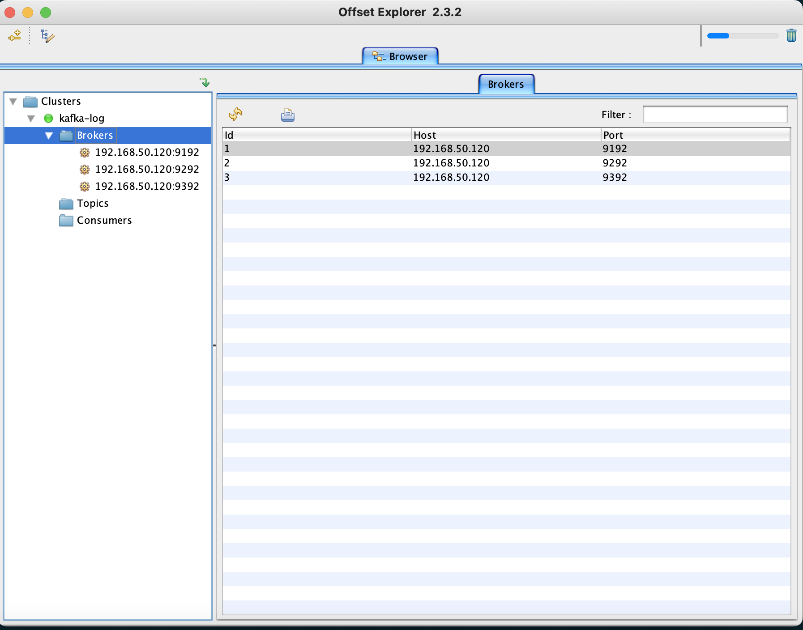
### 1.1.3 部署elasticsearch
```bash
## 创建部署目录
root@docker1:/apps/kafka# mkdir -pv /apps/elasticsearch
mkdir: created directory '/apps/elasticsearch'
root@docker1:/apps/kafka# cd ../elasticsearch/
## docker-compose.yml配置文件
version: "3.9"
services:
  elasticsearch:
    image: elasticsearch:8.6.0
    environment:
      - discovery.type=single-node
      - ES_JAVA_OPTS=-Xms1g -Xmx1g
      - xpack.security.enabled=false
    volumes:
      - /apps/elasticsearch/data:/usr/share/elasticsearch/data
    ports:
      - target: 9200
        published: 9200
    networks:
      - elastic

  kibana:
    image: kibana:8.6.0
    ports:
      - target: 5601
        published: 5601
    depends_on:
      - elasticsearch
    networks:
      - elastic

networks:
  elastic:
    name: elastic
    driver: bridge
## 创建elasticsearch挂在卷目录并修改全新啊
root@docker1:/apps/elasticsearch# mkdir -pv data
root@docker1:/apps/elasticsearch# chown ubuntu. data
## 拉取镜像
root@docker1:/apps/elasticsearch# docker compose pull
## 启动elasticsearch
root@docker1:/apps/elasticsearch# docker compose up -d
[+] Running 3/3
 ⠿ Network elastic                          Created                                                                                     0.0s
 ⠿ Container elasticsearch-elasticsearch-1  Started                                                                                     0.3s
 ⠿ Container elasticsearch-kibana-1         Started                                                                                     0.6s
## 查看docker状态
root@docker1:/apps/elasticsearch# docker compose ps
NAME                            IMAGE                 COMMAND                  SERVICE             CREATED              STATUS              PORTS
elasticsearch-elasticsearch-1   elasticsearch:8.6.0   "/bin/tini -- /usr/l…"   elasticsearch       About a minute ago   Up About a minute   0.0.0.0:9200->9200/tcp, 9300/tcp
elasticsearch-kibana-1          kibana:8.6.0          "/bin/tini -- /usr/l…"   kibana              About a minute ago   Up About a minute   0.0.0.0:5601->5601/tcp
```
* 登录kibana验证
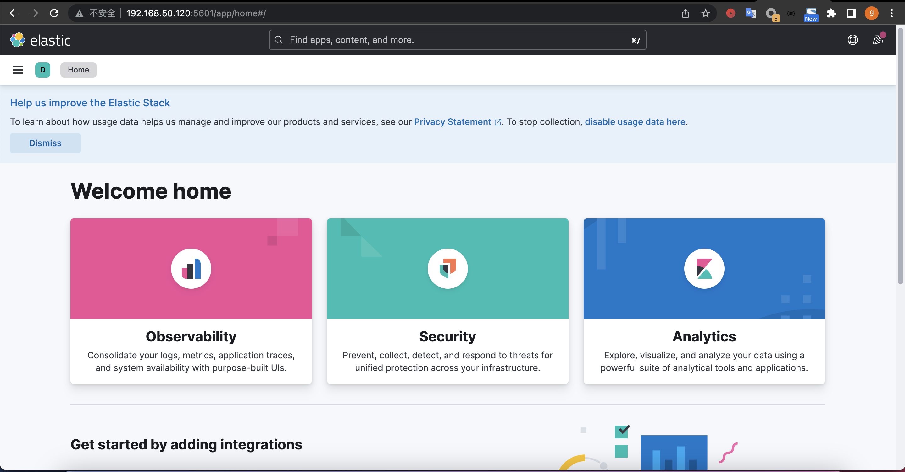
## 1.2 基于daemonset控制器部署logstash
```bash
## 进入到logstash镜像构建目录
root@k8s-master1:~# cd elk-case/1.daemonset-logstash/1.logstash-image-Dockerfile
## 修改镜像地址
root@k8s-master1:~/elk-case/1.daemonset-logstash/1.logstash-image-Dockerfile# sed -e 's/harbor.linuxarchitect.io/harbor.yanggc.cn/g' -i build-command.sh
## 编译镜像并上传到本地harbor
root@k8s-master1:~/elk-case/1.daemonset-logstash/1.logstash-image-Dockerfile# bash build-command.sh
## 编辑logstash daemonset编排yaml文件
root@k8s-master1:~/elk-case/1.daemonset-logstash/1.logstash-image-Dockerfile# cd ../
root@k8s-master1:~/elk-case/1.daemonset-logstash# vi 2.DaemonSet-logstash.yaml
apiVersion: apps/v1
kind: DaemonSet
metadata:
  name: logstash-elasticsearch
  namespace: kube-system
  labels:
    k8s-app: logstash-logging
spec:
  selector:
    matchLabels:
      name: logstash-elasticsearch
  template:
    metadata:
      labels:
        name: logstash-elasticsearch
    spec:
      tolerations:
      # this toleration is to have the daemonset runnable on master nodes
      # remove it if your masters can't run pods
      - key: node-role.kubernetes.io/master
        operator: Exists
        effect: NoSchedule
      containers:
      - name: logstash-elasticsearch
        image: harbor.yanggc.cn/baseimages/logstash:v7.12.1-json-file-log-v1
        env:
        - name: "KAFKA_SERVER"
          value: "192.168.50.120:9192,192.168.50.120:9292,192.168.50.120:9392"
        - name: "TOPIC_ID"
          value: "jsonfile-log-topic"
        - name: "CODEC"
          value: "json"
        volumeMounts:
        - name: varlog #定义宿主机系统日志挂载路径
          mountPath: /var/log #宿主机系统日志挂载点
        - name: varlibdockercontainers #定义容器日志挂载路径,和logstash配置文件中的收集路径保持一直
          mountPath: /var/lib/docker/containers #docker挂载路径
          #mountPath: /var/log/pods #containerd挂载路径,此路径与logstash的日志收集路径必须一致
          readOnly: false
      terminationGracePeriodSeconds: 30
      volumes:
      - name: varlog
        hostPath:
          path: /var/log #宿主机系统日志
      - name: varlibdockercontainers
        hostPath:
          path: /var/lib/docker/containers #docker的宿主机日志路径
## 部署logstash
root@k8s-master1:~/elk-case/1.daemonset-logstash# kubectl apply -f 2.DaemonSet-logstash.yaml
daemonset.apps/logstash-elasticsearch created
## 查看pod
root@k8s-master1:~/elk-case/1.daemonset-logstash# kubectl get pod -l name=logstash-elasticsearch -n kube-system
NAME                           READY   STATUS    RESTARTS   AGE
logstash-elasticsearch-7qzmk   1/1     Running   0          51s
logstash-elasticsearch-9qkn7   1/1     Running   0          51s
logstash-elasticsearch-bqndb   1/1     Running   0          51s
logstash-elasticsearch-dx7qk   1/1     Running   0          51s
logstash-elasticsearch-fcdkf   1/1     Running   0          51s
logstash-elasticsearch-rltvj   1/1     Running   0          51s
```
* kafka客户端查看topic
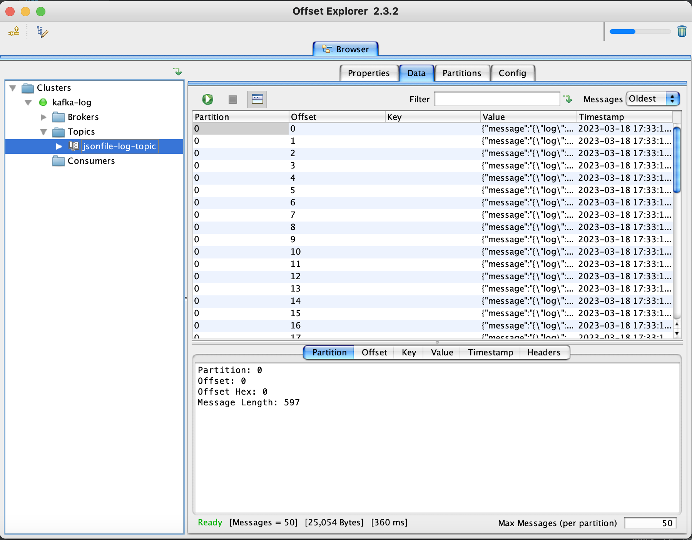

## 1.3 配置logstash消费kafka写入elasticsearch
```bash
## 下载logstash安装包
root@docker1:~# wget https://mirrors.tuna.tsinghua.edu.cn/elasticstack/apt/7.x/pool/main/l/logstash/logstash-7.17.9-amd64.deb
## 安装logstash
root@docker1:~# dpkg -i logstash-7.17.9-amd64.deb
## 编辑配置文件
root@docker1:~# cd /etc/logstash/conf.d/
root@docker1:/etc/logstash/conf.d# vi 3.logsatsh-daemonset-jsonfile-kafka-to-es.conf
input {
  kafka {
    bootstrap_servers => "192.168.50.120:9192,192.168.50.120:9292,192.168.50.120:9392"
    topics => ["jsonfile-log-topic"]
    codec => "json"
  }
}

output {
  #if [fields][type] == "app1-access-log" {
  if [type] == "jsonfile-daemonset-applog" {
    elasticsearch {
      hosts => ["192.168.50.120:9200"]
      index => "jsonfile-daemonset-applog-%{+YYYY.MM.dd}"
    }}

  if [type] == "jsonfile-daemonset-syslog" {
    elasticsearch {
      hosts => ["192.168.50.120:9200"]
      index => "jsonfile-daemonset-syslog-%{+YYYY.MM.dd}"
    }}

}
## 测试配置文件
root@docker1:/etc/logstash/conf.d# /usr/share/logstash/bin/logstash -f ./3.logsatsh-daemonset-jsonfile-kafka-to-es.conf -t
## 前台启动服务
root@docker1:/etc/logstash/conf.d# /usr/share/logstash/bin/logstash -f ./3.logsatsh-daemonset-jsonfile-kafka-to-es.conf
## 写入测试日志到系统日志文件中
root@k8s-master1:/var/log# echo "auth test v1" >>auth.log
root@k8s-master1:/var/log# echo "auth test v2" >>auth.log
```
* 通过elasticsearch插件查看数据
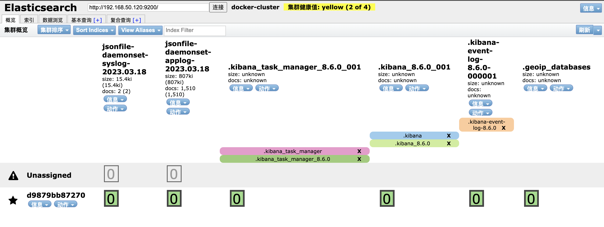
* 通过kibana查看数据
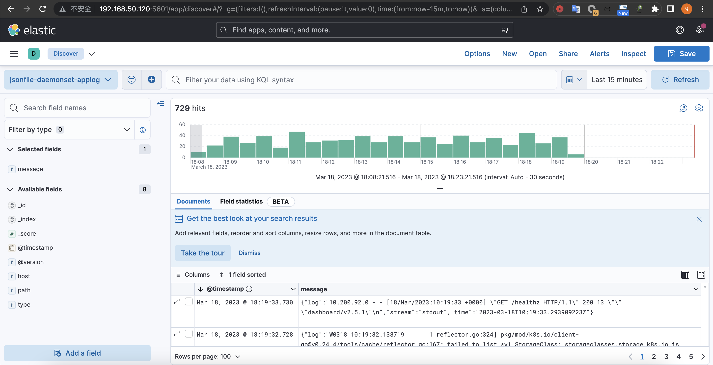
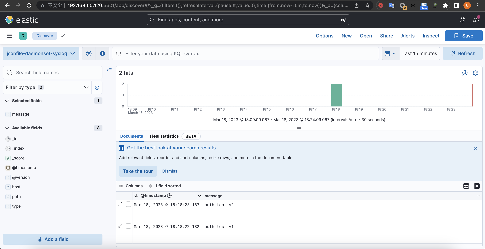
# 2. 在 K8s 环境对 pod 添加 sidecar 容器实现业务日志收集
## 2.1 sidecar收集日志写入kafka
```bash
## 切换到 logstash sidercar镜像编译目录
root@k8s-master1:~/elk-case/1.daemonset-logstash# cd ../2.sidecar-logstash/1.logstash-image-Dockerfile/
## 修改镜像地址
root@k8s-master1:~/elk-case/2.sidecar-logstash/1.logstash-image-Dockerfile# sed -e 's/harbor.linuxarchitect.io/harbor.yanggc.cn/g' -i build-command.sh
## 编译镜像
root@k8s-master1:~/elk-case/2.sidecar-logstash/1.logstash-image-Dockerfile# bash build-command.sh
## 修改应用镜像地址
root@k8s-master1:~/elk-case/2.sidecar-logstash/1.logstash-image-Dockerfile# cd ..
root@k8s-master1:~/elk-case/2.sidecar-logstash# sed -e 's/harbor.linuxarchitect.io/harbor.yanggc.cn/g' -i 2.tomcat-app1.yaml
## 修改kafka地址
root@k8s-master1:~/elk-case/2.sidecar-logstash# sed -e 's/172.31.2.107:9092,172.31.2.108:9092,172.31.2.109:9092/192.168.50.120:9192,192.168.50.120:9292,192.168.50.120:9392/g' -i 2.tomcat-app1.yaml
## 部署应用和应用service
root@k8s-master1:~/elk-case/2.sidecar-logstash# kubectl apply -f 2.tomcat-app1.yaml -f 3.tomcat-service.yaml
## 查看pod和service
root@k8s-master1:~/elk-case/2.sidecar-logstash# kubectl get pod,svc -n magedu
NAME                                                 READY   STATUS    RESTARTS       AGE
pod/magedu-jenkins-deployment-db96bdb96-8vjpm        1/1     Running   1 (169m ago)   7d7h
pod/magedu-tomcat-app1-deployment-65c67788cc-n2dqr   2/2     Running   0              111s
pod/magedu-tomcat-app1-deployment-65c67788cc-xktbc   2/2     Running   0              111s
pod/magedu-tomcat-app1-deployment-65c67788cc-zgvvd   2/2     Running   0              111s

NAME                                 TYPE       CLUSTER-IP      EXTERNAL-IP   PORT(S)        AGE
service/magedu-jenkins-service       NodePort   10.100.207.62   <none>        80:38080/TCP   7d7h
service/magedu-tomcat-app1-service   NodePort   10.100.10.140   <none>        80:40080/TCP   111s
## 访问应用测试
root@k8s-master1:~/elk-case/2.sidecar-logstash# curl 172.31.7.101:40080/myapp/
tomcat app1 v1
```
* kafka客户端查看数据
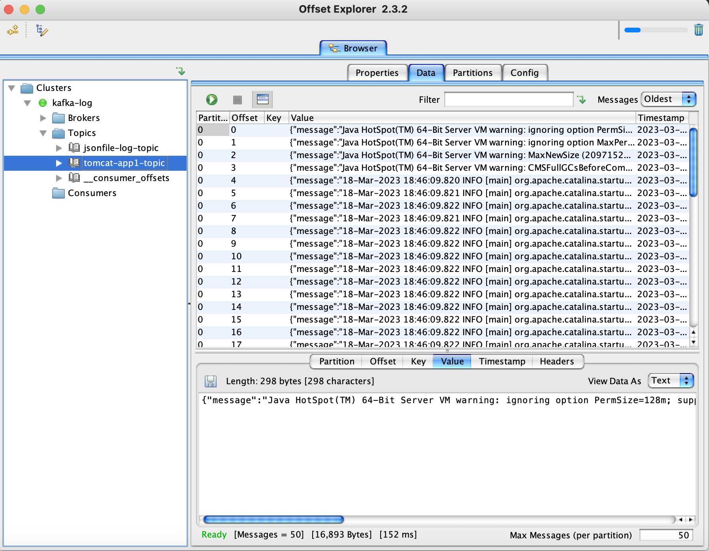
## 2.2 logstash从kafka消费日志写入elasticsearch
```bash
## 编辑logstash配置文件
root@docker1:/etc/logstash/conf.d# vi 4.logsatsh-sidecar-kafka-to-es.conf
input {
  kafka {
    bootstrap_servers => "192.168.50.120:9192,192.168.50.120:9292,192.168.50.120:9392"
    topics => ["tomcat-app1-topic"]
    codec => "json"
  }
}


output {
  if [type] == "app1-sidecar-access-log" {
    elasticsearch {
      hosts => ["192.168.50.120:9200"]
      index => "sidecar-app1-accesslog-%{+YYYY.MM.dd}"
    }
  }

  if [type] == "app1-sidecar-catalina-log" {
    elasticsearch {
      hosts => ["192.168.50.120:9200"]
      index => "sidecar-app1-catalinalog-%{+YYYY.MM.dd}"
    }
  }

}
## 测试配置文件
root@docker1:/etc/logstash/conf.d# /usr/share/logstash/bin/logstash -f ./4.logsatsh-sidecar-kafka-to-es.conf -t
## 前台启动logstash
root@docker1:/etc/logstash/conf.d# /usr/share/logstash/bin/logstash -f ./4.logsatsh-sidecar-kafka-to-es.conf
## 重启应用生成catalina日志
root@k8s-master1:~/elk-case/2.sidecar-logstash/1.logstash-image-Dockerfile# kubectl rollout restart deploy magedu-tomcat-app1-deployment -n magedu
## 请求应用生成access日志
root@k8s-master1:~/elk-case/2.sidecar-logstash/1.logstash-image-Dockerfile# while true;do curl 172.31.7.101:40080/myapp/;sleep 0.5;done
```
* elasticsearch插件查看数据
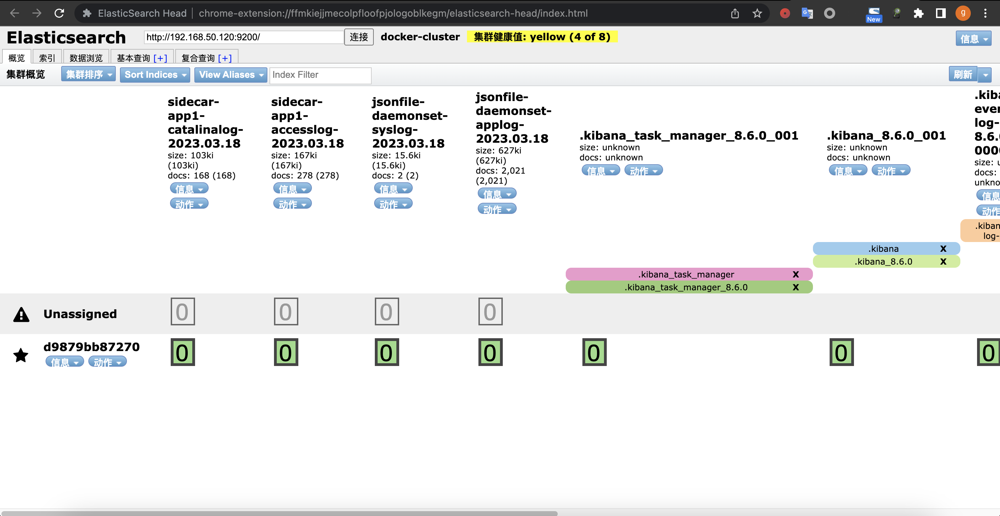
* kibana查看数据
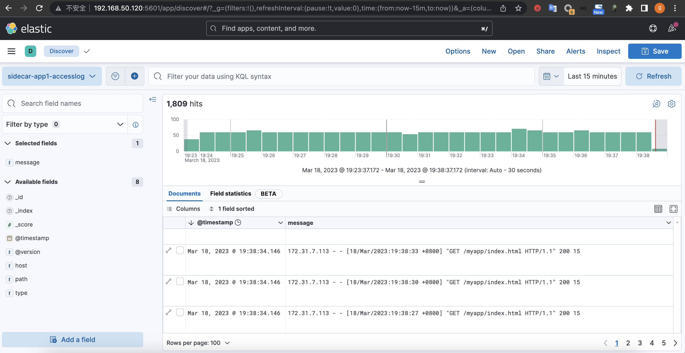
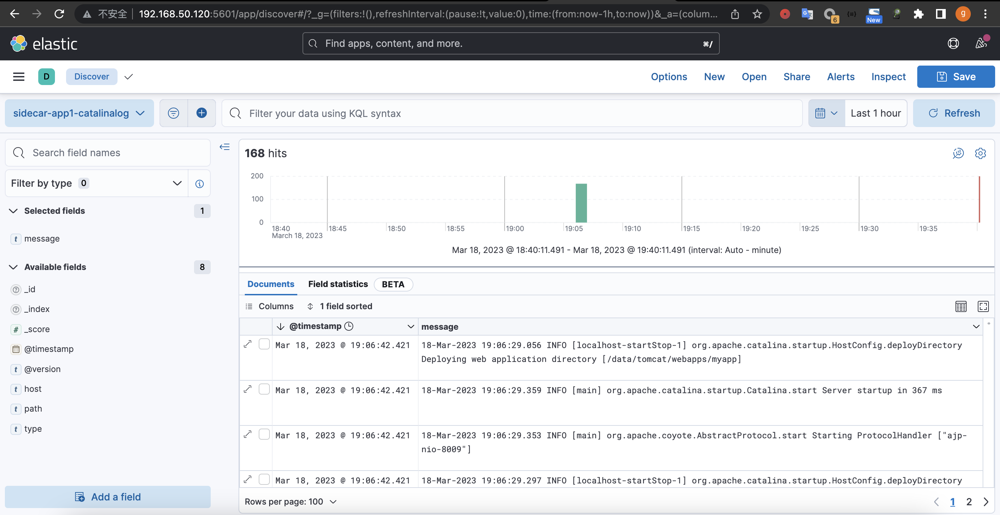
# 3. 在 K8s 环境容器中启动日志收集进程实现业务日志收集
## 3.1 filebeat收集容器内日志写入kafka
```bash
## 进入到filebeat收集容器日志镜像编译目录
root@k8s-master1:~/elk-case/2.sidecar-logstash# cd ../3.container-filebeat-process/1.webapp-filebeat-image-Dockerfile/
## 替换镜像地址
root@k8s-master1:~/elk-case/3.container-filebeat-process/1.webapp-filebeat-image-Dockerfile# sed -e 's/harbor.linuxarchitect.io/harbor.yanggc.cn/g' -i build-command.sh Dockerfile
## 修改filebeat.yml文件
root@k8s-master1:~/elk-case/3.container-filebeat-process/1.webapp-filebeat-image-Dockerfile# vi filebeat.yml
output.kafka:
  hosts: ["192.168.50.120:9192"]
## 编译镜像
root@k8s-master1:~/elk-case/3.container-filebeat-process/1.webapp-filebeat-image-Dockerfile# bash build-command.sh v1
## 修改应用镜像地址
root@k8s-master1:~/elk-case/3.container-filebeat-process/1.webapp-filebeat-image-Dockerfile# cd ..
root@k8s-master1:~/elk-case/3.container-filebeat-process# sed -e 's/harbor.linuxarchitect.io/harbor.yanggc.cn/g' -i 3.tomcat-app1.yaml
## 部署应用和service
root@k8s-master1:~/elk-case/3.container-filebeat-process# kubectl apply -f 3.tomcat-app1.yaml -f 4.tomcat-service.yaml
deployment.apps/magedu-tomcat-app1-filebeat-deployment created
service/magedu-tomcat-app1-filebeat-service created
## 查看创建的资源
root@k8s-master1:~/elk-case/3.container-filebeat-process# kubectl get pod -n magedu
NAME                                                      READY   STATUS    RESTARTS       AGE
magedu-jenkins-deployment-db96bdb96-8vjpm                 1/1     Running   1 (4h1m ago)   7d9h
magedu-tomcat-app1-filebeat-deployment-54fdb99fd4-4jnxm   1/1     Running   0              38s
magedu-tomcat-app1-filebeat-deployment-54fdb99fd4-wrmqk   1/1     Running   0              38s
root@k8s-master1:~/elk-case/3.container-filebeat-process# kubectl get pod,svc -n magedu
NAME                                                          READY   STATUS    RESTARTS       AGE
pod/magedu-jenkins-deployment-db96bdb96-8vjpm                 1/1     Running   1 (4h2m ago)   7d9h
pod/magedu-tomcat-app1-filebeat-deployment-54fdb99fd4-4jnxm   1/1     Running   0              45s
pod/magedu-tomcat-app1-filebeat-deployment-54fdb99fd4-wrmqk   1/1     Running   0              45s

NAME                                          TYPE       CLUSTER-IP       EXTERNAL-IP   PORT(S)        AGE
service/magedu-jenkins-service                NodePort   10.100.207.62    <none>        80:38080/TCP   7d9h
service/magedu-tomcat-app1-filebeat-service   NodePort   10.100.218.175   <none>        80:30092/TCP   45s
## 查看pod进程
root@k8s-master1:~# kubectl get pod -n magedu
NAME                                                     READY   STATUS    RESTARTS        AGE
magedu-jenkins-deployment-db96bdb96-8vjpm                1/1     Running   1 (4h15m ago)   7d9h
magedu-tomcat-app1-filebeat-deployment-9b75cbd85-78shd   1/1     Running   0               2m33s
magedu-tomcat-app1-filebeat-deployment-9b75cbd85-bnjws   1/1     Running   0               2m34s
root@k8s-master1:~# kubectl exec -it magedu-tomcat-app1-filebeat-deployment-9b75cbd85-78shd bash -n magedu
[root@magedu-tomcat-app1-filebeat-deployment-9b75cbd85-78shd /]# ps aux
USER         PID %CPU %MEM    VSZ   RSS TTY      STAT START   TIME COMMAND
root           1  0.0  0.0  11704  2576 ?        Ss   20:11   0:00 /bin/bash /apps/tomcat/bin/run_tomcat.sh
root           7  0.1  1.8 1000228 74296 ?       Sl   20:11   0:00 /usr/share/filebeat/bin/filebeat -e -c /etc/filebeat/filebeat.yml -path.ho
tomcat        36  1.0  2.8 3521956 114812 ?      Sl   20:11   0:02 /usr/local/jdk/bin/java -Djava.util.logging.config.file=/apps/tomcat/conf/
root          37  0.0  0.0   4420   680 ?        S    20:11   0:00 tail -f /etc/hosts
root          86  0.0  0.0  11844  3040 pts/0    Ss   20:14   0:00 bash
root         102  0.0  0.0  51748  3260 pts/0    R+   20:14   0:00 ps aux
## 模拟请求产生日志
root@k8s-master1:~/elk-case/3.container-filebeat-process# while true;do curl 172.31.7.101:30092/myapp/;sleep 0.5;done
## 重启应用生成catalina日志
root@k8s-master1:~# kubectl get deploy -n magedu
NAME                                     READY   UP-TO-DATE   AVAILABLE   AGE
magedu-jenkins-deployment                1/1     1            1           7d9h
magedu-tomcat-app1-filebeat-deployment   2/2     2            2           11m
root@k8s-master1:~# kubectl rollout restart deployment magedu-tomcat-app1-filebeat-deployment -n magedu
```
* kafka客户端查看topic数据
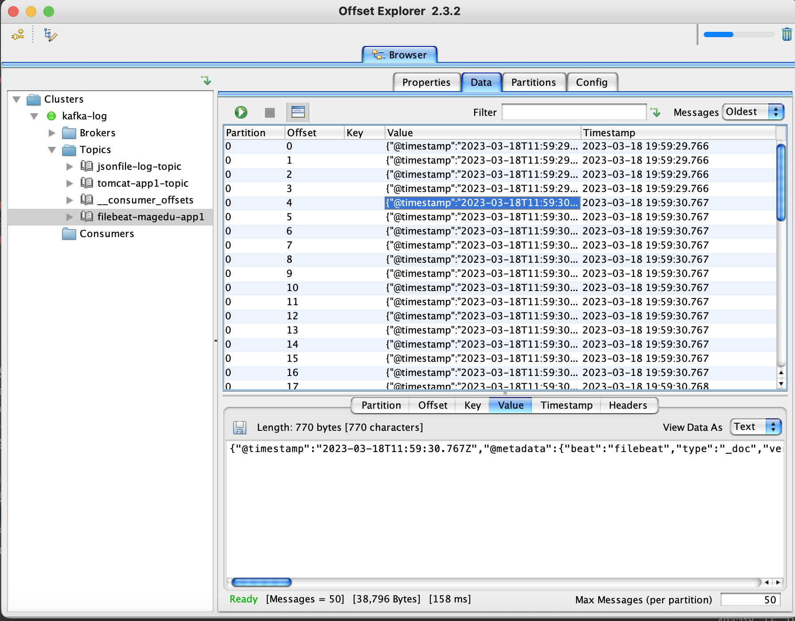

## 3.2 logstash从kafka消费写入elasticsearch
```bash
## 编辑logstash配置文件
root@docker1:/etc/logstash/conf.d# vi 5.logstash-filebeat-process-kafka-to-es.conf
input {
  kafka {
    bootstrap_servers => "192.168.50.120:9192,192.168.50.120:9292,192.168.50.120:9392"
    topics => ["filebeat-magedu-app1"]
    codec => "json"
  }
}


output {
  if [fields][type] == "filebeat-tomcat-catalina" {
    elasticsearch {
      hosts => ["192.168.50.120:9200"]
      index => "filebeat-tomcat-catalina-%{+YYYY.MM.dd}"
    }}

  if [fields][type] == "filebeat-tomcat-accesslog" {
    elasticsearch {
      hosts => ["192.168.50.120:9200"]
      index => "filebeat-tomcat-accesslog-%{+YYYY.MM.dd}"
    }}

}

## 测试配置文件
root@docker1:/etc/logstash/conf.d# /usr/share/logstash/bin/logstash -f ./5.logstash-filebeat-process-kafka-to-es.conf -t
## 前台启动logstash
root@docker1:/etc/logstash/conf.d# /usr/share/logstash/bin/logstash -f ./5.logstash-filebeat-process-kafka-to-es.conf
```
* elasticsearch插件查看数据

* kibana查看数据
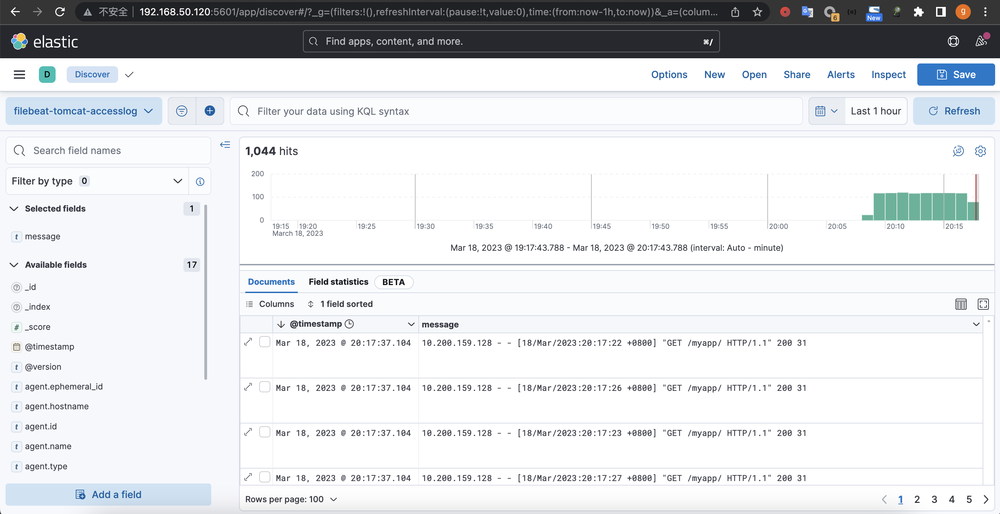
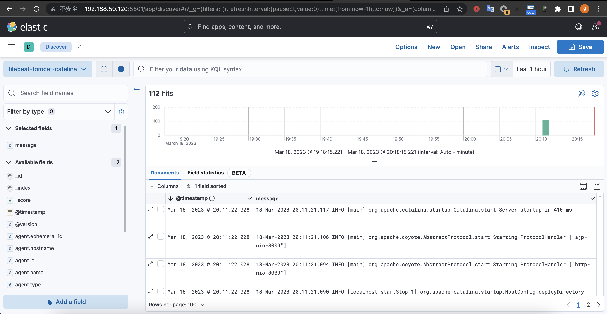

# 4. 通过 prometheus 对 CoreDNS 进行监控并在 grafana 显示监控图形
* 基于上周课部署的coredns和prometheus
* coredns已开启prometheus监控插件
```bash
## 开启prometheus热加载更新配置
root@k8s-master1:~# cd /usr/local/src/prometheus-case-files/
root@k8s-master1:/usr/local/src/prometheus-case-files# vi case3-2-prometheus-deployment.yaml
      containers:
      - name: prometheus
        image: registry.cn-hangzhou.aliyuncs.com/zhangshijie/prometheus:v2.42.0
        imagePullPolicy: IfNotPresent
        command:
          - prometheus
          - --config.file=/etc/prometheus/prometheus.yml
          - --storage.tsdb.path=/prometheus
          - --storage.tsdb.retention=720h
          - --web.enable-lifecycle
## 删除之前创建的prometheus
root@k8s-master1:/usr/local/src/prometheus-case-files# kubectl delete -f case3-2-prometheus-deployment.yaml
deployment.apps "prometheus-server" deleted
## 应用修改后的配置
root@k8s-master1:/usr/local/src/prometheus-case-files# kubectl apply -f case3-2-prometheus-deployment.yaml
deployment.apps/prometheus-server configured
## 查看coredns configmap
root@k8s-master1:/usr/local/src/prometheus-case-files# kubectl get cm coredns -o yaml -n kube-system
apiVersion: v1
data:
  Corefile: |
    .:53 {
        errors
        health {
            lameduck 5s
        }
        ready
        kubernetes yanggc.local. in-addr.arpa ip6.arpa {
            pods insecure
            fallthrough in-addr.arpa ip6.arpa
            ttl 30
        }
        prometheus :9153
        forward . 8.8.8.8 {
            max_concurrent 1000
        }
        cache 30
        loop
        reload
        loadbalance
    }
kind: ConfigMap
metadata:
  annotations:
    kubectl.kubernetes.io/last-applied-configuration: |
      {"apiVersion":"v1","data":{"Corefile":".:53 {\n    errors\n    health {\n        lameduck 5s\n    }\n    ready\n    kubernetes yanggc.local. in-addr.arpa ip6.arpa {\n        pods insecure\n        fallthrough in-addr.arpa ip6.arpa\n        ttl 30\n    }\n    prometheus :9153\n    forward . 8.8.8.8 {\n        max_concurrent 1000\n    }\n    cache 30\n    loop\n    reload\n    loadbalance\n}\n"},"kind":"ConfigMap","metadata":{"annotations":{},"labels":{"addonmanager.kubernetes.io/mode":"EnsureExists"},"name":"coredns","namespace":"kube-system"}}
  creationTimestamp: "2023-03-04T11:31:47Z"
  labels:
    addonmanager.kubernetes.io/mode: EnsureExists
  name: coredns
  namespace: kube-system
  resourceVersion: "10528"
  uid: c872e4db-68be-461b-abab-26145c2fc114
## prometheus configmap加入coredns服务发现
root@k8s-master1:/usr/local/src/prometheus-case-files# vi case3-1-prometheus-cfg.yaml
    - job_name: kube-dns
      honor_labels: true
      kubernetes_sd_configs:
      - role: pod
      relabel_configs:
      - action: keep
        source_labels:
        - __meta_kubernetes_namespace
        - __meta_kubernetes_pod_name
        separator: '/'
        regex: 'kube-system/coredns.+'
      - source_labels:
        - __meta_kubernetes_pod_container_port_name
        action: keep
        regex: metrics
      - source_labels:
        - __meta_kubernetes_pod_name
        action: replace
        target_label: instance
      - action: labelmap
        regex: __meta_kubernetes_pod_label_(.+)
## 重建prometheus
root@k8s-master1:/usr/local/src/prometheus-case-files# kubectl delete -f case3-2-prometheus-deployment.yaml && kubectl apply -f case3-2-prometheus-deployment.yaml
deployment.apps "prometheus-server" deleted
deployment.apps/prometheus-server created
```
* 查看prometheus targets
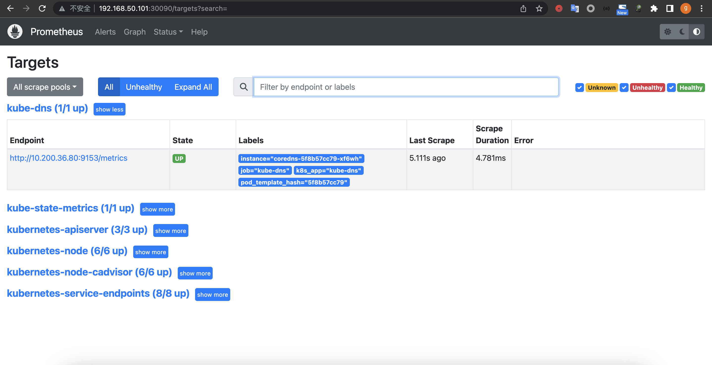
* grafana导入模板14981并验证coredns监控数据
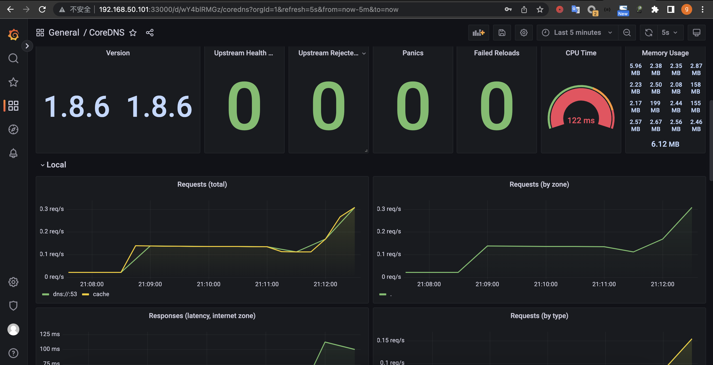
# 5. 对 K8s 集群进行 master 节点扩容、node 节点扩容
```bash
## 查看节点信息
root@haproxy1:/etc/kubeasz# kubectl get node
NAME           STATUS                     ROLES    AGE   VERSION
172.31.7.101   Ready,SchedulingDisabled   master   31m   v1.23.1
172.31.7.102   Ready,SchedulingDisabled   master   31m   v1.23.1
172.31.7.111   Ready                      node     27m   v1.23.1
172.31.7.112   Ready                      node     27m   v1.23.1
## 扩容一个master节点
root@haproxy1:/etc/kubeasz# ./ezctl  add-master k8s-01 172.31.7.103
## 查看节点
root@haproxy1:/etc/kubeasz# kubectl get node
NAME           STATUS                     ROLES    AGE     VERSION
172.31.7.101   Ready,SchedulingDisabled   master   46m     v1.23.1
172.31.7.102   Ready,SchedulingDisabled   master   46m     v1.23.1
172.31.7.103   Ready,SchedulingDisabled   master   2m27s   v1.23.1
172.31.7.111   Ready                      node     42m     v1.23.1
172.31.7.112   Ready                      node     42m     v1.23.1
## 扩容一个node节点
root@haproxy1:/etc/kubeasz# ./ezctl  add-node k8s-01 172.31.7.113
## 查看节点
root@haproxy1:/etc/kubeasz# kubectl  get node
NAME           STATUS                     ROLES    AGE   VERSION
172.31.7.101   Ready,SchedulingDisabled   master   62m   v1.23.1
172.31.7.102   Ready,SchedulingDisabled   master   62m   v1.23.1
172.31.7.103   Ready,SchedulingDisabled   master   18m   v1.23.1
172.31.7.111   Ready                      node     59m   v1.23.1
172.31.7.112   Ready                      node     59m   v1.23.1
172.31.7.113   Ready                      node     11m   v1.23.1
```
# 6. 对 K8s 集群进行小版本升级
```bash
## 查看集群版本
root@k8s-master1:~# kubectl get node
NAME           STATUS                     ROLES    AGE   VERSION
172.31.7.101   Ready,SchedulingDisabled   master   14d   v1.23.1
172.31.7.102   Ready,SchedulingDisabled   master   14d   v1.23.1
172.31.7.103   Ready,SchedulingDisabled   master   14d   v1.23.1
172.31.7.111   Ready                      node     14d   v1.23.1
172.31.7.112   Ready                      node     14d   v1.23.1
172.31.7.113   Ready                      node     14d   v1.23.1
root@k8s-master1:~# kubectl version
Client Version: version.Info{Major:"1", Minor:"23", GitVersion:"v1.23.1", GitCommit:"86ec240af8cbd1b60bcc4c03c20da9b98005b92e", GitTreeState:"clean", BuildDate:"2021-12-16T11:41:01Z", GoVersion:"go1.17.5", Compiler:"gc", Platform:"linux/amd64"}
Server Version: version.Info{Major:"1", Minor:"23", GitVersion:"v1.23.1", GitCommit:"86ec240af8cbd1b60bcc4c03c20da9b98005b92e", GitTreeState:"clean", BuildDate:"2021-12-16T11:34:54Z", GoVersion:"go1.17.5", Compiler:"gc", Platform:"linux/amd64"}
## 下载升级包
root@haproxy1:~# cd /usr/local/src/
root@haproxy1:/usr/local/src# wget https://dl.k8s.io/v1.23.17/kubernetes.tar.gz
root@haproxy1:/usr/local/src# wget https://dl.k8s.io/v1.23.17/kubernetes-client-linux-amd64.tar.gz
root@haproxy1:/usr/local/src# wget https://dl.k8s.io/v1.23.17/kubernetes-server-linux-amd64.tar.gz
root@haproxy1:/usr/local/src# wget https://dl.k8s.io/v1.23.17/kubernetes-node-linux-amd64.tar.gz
## 解压升级包
root@haproxy1:/usr/local/src# tar xf kubernetes.tar.gz
root@haproxy1:/usr/local/src# tar xf kubernetes-server-linux-amd64.tar.gz
root@haproxy1:/usr/local/src# tar xf kubernetes-client-linux-amd64.tar.gz
root@haproxy1:/usr/local/src# tar xf kubernetes-node-linux-amd64.tar.gz
## 备份旧版本二级制文件
root@haproxy1:~# cd /etc/kubeasz/
root@haproxy1:/etc/kubeasz# cp -r bin bin-2.23.1-backup
## 拷贝新版本二进制文件到部署目录
root@haproxy1:/usr/local/src/kubernetes/server/bin# cp kube-apiserver kube-controller-manager kube-scheduler kubelet kube-proxy kubectl /etc/
kubeasz/bin/
## 进入到kubeasz部署目录
root@haproxy1:/usr/local/src/kubernetes/server/bin# cd /etc/kubeasz/
## 查看ezctl命令帮助
root@haproxy1:/etc/kubeasz# ./ezctl --help
Usage: ezctl COMMAND [args]
-------------------------------------------------------------------------------------
Cluster setups:
    list		             to list all of the managed clusters
    checkout    <cluster>            to switch default kubeconfig of the cluster
    new         <cluster>            to start a new k8s deploy with name 'cluster'
    setup       <cluster>  <step>    to setup a cluster, also supporting a step-by-step way
    start       <cluster>            to start all of the k8s services stopped by 'ezctl stop'
    stop        <cluster>            to stop all of the k8s services temporarily
    upgrade     <cluster>            to upgrade the k8s cluster
    destroy     <cluster>            to destroy the k8s cluster
    backup      <cluster>            to backup the cluster state (etcd snapshot)
    restore     <cluster>            to restore the cluster state from backups
    start-aio		             to quickly setup an all-in-one cluster with 'default' settings

Cluster ops:
    add-etcd    <cluster>  <ip>      to add a etcd-node to the etcd cluster
    add-master  <cluster>  <ip>      to add a master node to the k8s cluster
    add-node    <cluster>  <ip>      to add a work node to the k8s cluster
    del-etcd    <cluster>  <ip>      to delete a etcd-node from the etcd cluster
    del-master  <cluster>  <ip>      to delete a master node from the k8s cluster
    del-node    <cluster>  <ip>      to delete a work node from the k8s cluster

Extra operation:
    kcfg-adm    <cluster>  <args>    to manage client kubeconfig of the k8s cluster

Use "ezctl help <command>" for more information about a given command.
## 查看集群列表
root@haproxy1:/etc/kubeasz# ./ezctl list
2023-03-18 13:58:46 INFO list of managed clusters:
==> cluster 1:	k8s-01 (current)
root@haproxy1:/etc/kubeasz#
## 升级集群
root@haproxy1:/etc/kubeasz# ./ezctl upgrade k8s-01
## 升级完成验证
root@haproxy1:/etc/kubeasz# kubectl get node
NAME           STATUS                     ROLES   AGE   VERSION
172.31.7.101   Ready,SchedulingDisabled   node    14d   v1.23.17
172.31.7.102   Ready,SchedulingDisabled   node    14d   v1.23.17
172.31.7.103   Ready,SchedulingDisabled   node    14d   v1.23.17
172.31.7.111   Ready                      node    14d   v1.23.17
172.31.7.112   Ready                      node    14d   v1.23.17
172.31.7.113   Ready                      node    14d   v1.23.17
root@haproxy1:/etc/kubeasz# kubectl version
Client Version: version.Info{Major:"1", Minor:"23", GitVersion:"v1.23.17", GitCommit:"953be8927218ec8067e1af2641e540238ffd7576", GitTreeState:"clean", BuildDate:"2023-02-22T13:34:27Z", GoVersion:"go1.19.6", Compiler:"gc", Platform:"linux/amd64"}
Server Version: version.Info{Major:"1", Minor:"23", GitVersion:"v1.23.17", GitCommit:"953be8927218ec8067e1af2641e540238ffd7576", GitTreeState:"clean", BuildDate:"2023-02-22T13:27:46Z", GoVersion:"go1.19.6", Compiler:"gc", Platform:"linux/amd64"}
```
# 7. 基于 ceph rbd 及 cephfs 持久化 K8s 中 pod 的业务数据
## 7.1 创建初始化rbd
```bash
## 创建新的rbd
bash-4.4$ ceph osd pool create ygc-rbd-pool1 32 32
pool 'ygc-rbd-pool1' created
## 验证存储池
bash-4.4$ ceph osd pool ls
.mgr
replicapool
myfs-metadata
myfs-replicated
ygc-rbd-pool1
## 存储池启用rbd
bash-4.4$ ceph osd pool application enable ygc-rbd-pool1 rbd
enabled application 'rbd' on pool 'ygc-rbd-pool1'
## 初始化rbd
bash-4.4$ rbd pool init -p ygc-rbd-pool1
```
## 7.2 创建image
```bash
## 创建镜像
bash-4.4$ rbd create ygc-img-img1 --size 5G --pool ygc-rbd-pool1 --image-format 2 --image-feature layering
## 验证镜像
bash-4.4$ rbd ls --pool ygc-rbd-pool1
ygc-img-img1
## 验证镜像信息
bash-4.4$ rbd --image ygc-img-img1 --pool ygc-rbd-pool1 info
rbd image 'ygc-img-img1':
	size 5 GiB in 1280 objects
	order 22 (4 MiB objects)
	snapshot_count: 0
	id: 68bf27d7961e
	block_name_prefix: rbd_data.68bf27d7961e
	format: 2
	features: layering
	op_features: 
	flags: 
	create_timestamp: Thu Mar 16 13:34:29 2023
	access_timestamp: Thu Mar 16 13:34:29 2023
	modify_timestamp: Thu Mar 16 13:34:29 2023
```
## 7.3 客户端安装ceph-common
```bash
## 验证ceph 版本
root@k8s-master1:~# apt-cache madison ceph-common
## 各master 与node 节点配置apt 源
root@k8s-master1:~# apt install ceph-common -y
```
## 7.4 创建ceph用户与授权
```bash
## 创建用户并授权
bash-4.4$ ceph auth get-or-create client.chaoge-ygc mon 'allow r' osd 'allow * pool=ygc-rbd-pool1'
[client.chaoge-ygc]
	key = AQAkJBNkFaQ1EBAAIGlG57NrXmlNh1ho+iKunA==
## 验证用户
[client.chaoge-ygc]
	key = AQAkJBNkFaQ1EBAAIGlG57NrXmlNh1ho+iKunA==
	caps mon = "allow r"
	caps osd = "allow * pool=ygc-rbd-pool1"
exported keyring for client.chaoge-ygc
## 导出用户信息至keyring 文件
bash-4.4$ ceph auth get client.chaoge-ygc -o ceph.client.chaoge-ygc.keyring
exported keyring for client.chaoge-ygc

## 拷贝keyring到master节点
root@k8s-master1:~#  kubectl cp rook-ceph/rook-ceph-tools-7c4b8bb9b5-dr7w8:/tmp/ceph.client.chaoge-ygc.keyring ./ceph.client.chaoge-ygc.keyring
## 同步认证文件到k8s 各master 及node 节点
root@k8s-master1:~# cp ceph.client.chaoge-ygc.keyring /etc/ceph/
root@k8s-master1:~# scp ceph.client.chaoge-ygc.keyring 172.31.2.6:/etc/ceph/
root@k8s-master1:~# scp ceph.client.chaoge-ygc.keyring 172.31.2.7:/etc/ceph/
root@k8s-master1:~# scp ceph.client.chaoge-ygc.keyring 172.31.2.8:/etc/ceph/
## 拷贝配置文件到master节点
root@k8s-master1:~# kubectl cp rook-ceph/rook-ceph-tools-7c4b8bb9b5-dr7w8:/etc/ceph/ceph.conf ./ceph.conf
## 同步配置文件到k8s 各master 及node 节点
root@k8s-master1:~# cp ceph.conf /etc/ceph/
root@k8s-master1:~# scp ceph.conf 172.31.2.6:/etc/ceph/
root@k8s-master1:~# scp ceph.conf 172.31.2.7:/etc/ceph/
root@k8s-master1:~# scp ceph.conf 172.31.2.8:/etc/ceph/
## 在k8s node 节点验证用户权限
root@k8s-node1:~# ceph --user chaoge-ygc -s
  cluster:
    id:     b14c452b-3406-4f96-85e1-7556e931a1e8
    health: HEALTH_OK
 
  services:
    mon: 3 daemons, quorum a,b,c (age 5h)
    mgr: b(active, since 3h), standbys: a
    mds: 1/1 daemons up, 1 hot standby
    osd: 3 osds: 3 up (since 5h), 3 in (since 5h)
 
  data:
    volumes: 1/1 healthy
    pools:   5 pools, 129 pgs
    objects: 43 objects, 3.7 MiB
    usage:   84 MiB used, 3.0 TiB / 3 TiB avail
    pgs:     129 active+clean
 
  io:
    client:   1.2 KiB/s rd, 2 op/s rd, 0 op/s wr
## 验证镜像访问权限
root@k8s-node1:~# rbd --id chaoge-ygc ls --pool=ygc-rbd-pool1
ygc-img-img1
```
## 7.5 通过keyring文件挂载rbd
### 7.5.1 通过keyring文件直接挂载-busybox
```bash
## pod yaml 文件
root@k8s-master1:~/ceph-case# cat case1-busybox-keyring.yaml 
apiVersion: v1
kind: Pod
metadata:
  name: busybox
  namespace: default
spec:
  containers:
  - image: busybox 
    command:
      - sleep
      - "3600"
    imagePullPolicy: Always 
    name: busybox
    #restartPolicy: Always
    volumeMounts:
    - name: rbd-data1
      mountPath: /data
  volumes:
    - name: rbd-data1
      rbd:
        monitors:
        - '10.100.135.254:6789'
        - '10.100.100.35:6789'
        - '10.100.232.104:6789'
        pool: ygc-rbd-pool1
        image: ygc-img-img1
        fsType: ext4
        readOnly: false
        user: chaoge-ygc
        keyring: /etc/ceph/ceph.client.chaoge-ygc.keyring
## 创建pod
root@k8s-master1:~/ceph-case# kubectl apply -f case1-busybox-keyring.yaml 
## 查看pod
root@k8s-master1:~/ceph-case# kubectl get pod
NAME      READY   STATUS    RESTARTS   AGE
busybox   1/1     Running   0          41s
## 到pod 验证rbd 是否挂载成功
root@k8s-master1:~/ceph-case# kubectl exec -it busybox sh
/ # df 
Filesystem           1K-blocks      Used Available Use% Mounted on
overlay              100820384  11215096  84965108  12% /
tmpfs                    65536         0     65536   0% /dev
/dev/rbd0              5074592        24   5058184   0% /data
/dev/mapper/ubuntu--vg-ubuntu--lv
                     100820384  11215096  84965108  12% /dev/termination-log
/dev/mapper/ubuntu--vg-ubuntu--lv
                     100820384  11215096  84965108  12% /etc/resolv.conf
/dev/mapper/ubuntu--vg-ubuntu--lv
                     100820384  11215096  84965108  12% /etc/hostname
/dev/mapper/ubuntu--vg-ubuntu--lv
                     100820384  11215096  84965108  12% /etc/hosts
shm                      65536         0     65536   0% /dev/shm
tmpfs                  3880788        12   3880776   0% /var/run/secrets/kubernetes.io/serviceaccount
tmpfs                  1991592         0   1991592   0% /proc/acpi
tmpfs                    65536         0     65536   0% /proc/kcore
tmpfs                    65536         0     65536   0% /proc/keys
tmpfs                    65536         0     65536   0% /proc/timer_list
tmpfs                  1991592         0   1991592   0% /proc/scsi
tmpfs                  1991592         0   1991592   0% /sys/firmware

```
### 7.5.2 通过keyring文件直接挂载-nginx
```bash
## pod yaml 文件
root@k8s-master1:~/ceph-case# cat case2-1-nginx-keyring-deployment.yaml 
apiVersion: apps/v1
kind: Deployment
metadata:
  name: nginx-deployment
spec:
  replicas: 1
  selector:
    matchLabels: #rs or deployment
      app: ng-deploy-80
  template:
    metadata:
      labels:
        app: ng-deploy-80
    spec:
      containers:
      - name: ng-deploy-80
        image: nginx
        #image: mysql:5.6.46 
        env:
          # Use secret in real usage
        - name: MYSQL_ROOT_PASSWORD
          value: magedu123456
        ports:
        - containerPort: 80

        volumeMounts:
        - name: rbd-data1
          mountPath: /usr/share/nginx/html/jike
          #mountPath: /var/lib/mysql
      volumes:
        - name: rbd-data1
          rbd:
            monitors:
            - '10.100.135.254:6789'
            - '10.100.100.35:6789'
            - '10.100.232.104:6789'
            pool: ygc-rbd-pool1
            image: ygc-img-img1
            fsType: ext4
            readOnly: false
            user: chaoge-ygc
            keyring: /etc/ceph/ceph.client.chaoge-ygc.keyring
## 创建pod
root@k8s-master1:~/ceph-case# kubectl apply -f case2-1-nginx-keyring-deployment.yaml 
deployment.apps/nginx-deployment created
## 查看pod
root@k8s-master1:~/ceph-case# kubectl get pod
NAME                                READY   STATUS    RESTARTS   AGE
nginx-deployment-796bf79987-7mtk5   1/1     Running   0          59s
## 到pod 验证rbd 是否挂载成功
root@k8s-master1:~/ceph-case# kubectl exec -it nginx-deployment-796bf79987-7mtk5 -- bash
root@nginx-deployment-796bf79987-7mtk5:/# df -h
Filesystem                         Size  Used Avail Use% Mounted on
overlay                             97G   11G   82G  12% /
tmpfs                               64M     0   64M   0% /dev
/dev/mapper/ubuntu--vg-ubuntu--lv   97G   11G   82G  12% /etc/hosts
shm                                 64M     0   64M   0% /dev/shm
/dev/rbd0                          4.9G   24K  4.9G   1% /usr/share/nginx/html/jike
tmpfs                              3.8G   12K  3.8G   1% /run/secrets/kubernetes.io/serviceaccount
tmpfs                              1.9G     0  1.9G   0% /proc/acpi
tmpfs                              1.9G     0  1.9G   0% /proc/scsi
tmpfs                              1.9G     0  1.9G   0% /sys/firmware
## 在挂载目录下写入一个html文件 
root@nginx-deployment-796bf79987-7mtk5:/# cd /usr/share/nginx/html/jike/
root@nginx-deployment-796bf79987-7mtk5:/usr/share/nginx/html/jike# echo "<h1>welcome to chaoge home</h1>" >> index.html
##service 文件
root@k8s-master1:~/ceph-case# cat case2-2-nginx-service.yaml 
---
kind: Service
apiVersion: v1
metadata:
  labels:
    app: ng-deploy-80-label
  name: ng-deploy-80
spec:
  type: NodePort
  ports:
  - name: http
    port: 80
    protocol: TCP
    targetPort: 80
    nodePort: 30081
  selector:
    app: ng-deploy-80
## 创建service
root@k8s-master1:~/ceph-case# vi case2-2-nginx-service.yaml 
root@k8s-master1:~/ceph-case# kubectl apply -f case2-2-nginx-service.yaml 
service/ng-deploy-80 created
## 查看service
root@k8s-master1:~/ceph-case# kubectl get svc
NAME           TYPE        CLUSTER-IP      EXTERNAL-IP   PORT(S)        AGE
kubernetes     ClusterIP   10.100.0.1      <none>        443/TCP        22h
ng-deploy-80   NodePort    10.100.34.200   <none>        80:30081/TCP   13s
## 访问service
root@k8s-master1:~/ceph-case# curl 172.31.2.1:30081/jike/
<h1>welcome to chaoge home</h1>
## 查看pod调度的节点
root@k8s-master1:~/ceph-case# kubectl get pod -o wide
NAME                                READY   STATUS    RESTARTS   AGE     IP               NODE        NOMINATED NODE   READINESS GATES
nginx-deployment-796bf79987-7mtk5   1/1     Running   0          8m29s   10.200.169.148   k8s-node2   <none>           <none>
## 宿主机验证rbd
root@k8s-node2:~# rbd showmapped
id  pool           namespace  image         snap  device   
0   ygc-rbd-pool1             ygc-img-img1  -     /dev/rbd0
```
### 7.5.3 通过secret挂载rbd
```
## 将key进行base64编码
bash-4.4$ ceph auth print-key client.chaoge-ygc
AQAkJBNkFaQ1EBAAIGlG57NrXmlNh1ho+iKunA==
bash-4.4$ ceph auth print-key client.chaoge-ygc |base64
QVFBa0pCTmtGYVExRUJBQUlHbEc1N05yWG1sTmgxaG8raUt1bkE9PQ==
## secret yaml文件
root@k8s-master1:~/ceph-case# cat case3-secret-client-shijie.yaml 
apiVersion: v1
kind: Secret
metadata:
  name: ceph-secret-chaoge-ygc
type: "kubernetes.io/rbd"
data:
  key: QVFBa0pCTmtGYVExRUJBQUlHbEc1N05yWG1sTmgxaG8raUt1bkE9PQ== 
## 创建secret
root@k8s-master1:~/ceph-case# kubectl apply -f case3-secret-client-shijie.yaml 
secret/ceph-secret-chaoge-ygc created
## 查看secret
root@k8s-master1:~/ceph-case# kubectl get secret
NAME                     TYPE                DATA   AGE
ceph-secret-chaoge-ygc   kubernetes.io/rbd   1      7s
## deployment yaml 文件
root@k8s-master1:~/ceph-case# cat case4-nginx-secret.yaml 
apiVersion: apps/v1
kind: Deployment
metadata:
  name: nginx-deployment
spec:
  replicas: 1
  selector:
    matchLabels: #rs or deployment
      app: ng-deploy-80
  template:
    metadata:
      labels:
        app: ng-deploy-80
    spec:
      containers:
      - name: ng-deploy-80
        image: nginx
        ports:
        - containerPort: 80

        volumeMounts:
        - name: rbd-data1
          mountPath: /usr/share/nginx/html/rbd
      volumes:
        - name: rbd-data1
          rbd:
            monitors:
            - '10.100.135.254:6789'
            - '10.100.100.35:6789'
            - '10.100.232.104:6789'
            pool: ygc-rbd-pool1
            image: ygc-img-img1
            fsType: ext4
            readOnly: false
            user: chaoge-ygc
            secretRef:
              name: ceph-secret-chaoge-ygc
## 创建deployment
root@k8s-master1:~/ceph-case# kubectl apply -f case4-nginx-secret.yaml 
deployment.apps/nginx-deployment created
## 查看pod
root@k8s-master1:~/ceph-case# kubectl get pod -o wide
NAME                                READY   STATUS    RESTARTS   AGE   IP               NODE        NOMINATED NODE   READINESS GATES
nginx-deployment-84b7b5c8c4-2f2q2   1/1     Running   0          24s   10.200.169.149   k8s-node2   <none>           <none>
## pod验证挂载
root@k8s-master1:~/ceph-case# kubectl exec -it nginx-deployment-84b7b5c8c4-2f2q2 -- bash
root@nginx-deployment-84b7b5c8c4-2f2q2:/# df -h
Filesystem                         Size  Used Avail Use% Mounted on
overlay                             97G   11G   82G  12% /
tmpfs                               64M     0   64M   0% /dev
/dev/mapper/ubuntu--vg-ubuntu--lv   97G   11G   82G  12% /etc/hosts
shm                                 64M     0   64M   0% /dev/shm
/dev/rbd0                          4.9G   28K  4.9G   1% /usr/share/nginx/html/rbd
tmpfs                              3.8G   12K  3.8G   1% /run/secrets/kubernetes.io/serviceaccount
tmpfs                              1.9G     0  1.9G   0% /proc/acpi
tmpfs                              1.9G     0  1.9G   0% /proc/scsi
tmpfs                              1.9G     0  1.9G   0% /sys/firmware
## 宿主机验证挂载
root@k8s-node2:~# rbd showmapped
id  pool           namespace  image         snap  device   
0   ygc-rbd-pool1             ygc-img-img1  -     /dev/rbd0
```
### 7.5.4 动态存储卷供给
```bash
## 进入rook csi示例rbd目录
root@k8s-master1:~# cd rook-1.11.1/deploy/examples/csi/rbd
## storageclass yaml文件
root@k8s-master1:~/rook-1.11.1/deploy/examples/csi/rbd# cat storageclass.yaml 
apiVersion: ceph.rook.io/v1
kind: CephBlockPool
metadata:
  name: replicapool
  namespace: rook-ceph # namespace:cluster
spec:
  failureDomain: host
  replicated:
    size: 3
    # Disallow setting pool with replica 1, this could lead to data loss without recovery.
    # Make sure you're *ABSOLUTELY CERTAIN* that is what you want
    requireSafeReplicaSize: true
    # gives a hint (%) to Ceph in terms of expected consumption of the total cluster capacity of a given pool
    # for more info: https://docs.ceph.com/docs/master/rados/operations/placement-groups/#specifying-expected-pool-size
    #targetSizeRatio: .5
---
apiVersion: storage.k8s.io/v1
kind: StorageClass
metadata:
  name: rook-ceph-block
# Change "rook-ceph" provisioner prefix to match the operator namespace if needed
provisioner: rook-ceph.rbd.csi.ceph.com
parameters:
  # clusterID is the namespace where the rook cluster is running
  # If you change this namespace, also change the namespace below where the secret namespaces are defined
  clusterID: rook-ceph # namespace:cluster

  # If you want to use erasure coded pool with RBD, you need to create
  # two pools. one erasure coded and one replicated.
  # You need to specify the replicated pool here in the `pool` parameter, it is
  # used for the metadata of the images.
  # The erasure coded pool must be set as the `dataPool` parameter below.
  #dataPool: ec-data-pool
  pool: replicapool

  # (optional) mapOptions is a comma-separated list of map options.
  # For krbd options refer
  # https://docs.ceph.com/docs/master/man/8/rbd/#kernel-rbd-krbd-options
  # For nbd options refer
  # https://docs.ceph.com/docs/master/man/8/rbd-nbd/#options
  # mapOptions: lock_on_read,queue_depth=1024

  # (optional) unmapOptions is a comma-separated list of unmap options.
  # For krbd options refer
  # https://docs.ceph.com/docs/master/man/8/rbd/#kernel-rbd-krbd-options
  # For nbd options refer
  # https://docs.ceph.com/docs/master/man/8/rbd-nbd/#options
  # unmapOptions: force

   # (optional) Set it to true to encrypt each volume with encryption keys
   # from a key management system (KMS)
   # encrypted: "true"

   # (optional) Use external key management system (KMS) for encryption key by
   # specifying a unique ID matching a KMS ConfigMap. The ID is only used for
   # correlation to configmap entry.
   # encryptionKMSID: <kms-config-id>

  # RBD image format. Defaults to "2".
  imageFormat: "2"

  # RBD image features
  # Available for imageFormat: "2". Older releases of CSI RBD
  # support only the `layering` feature. The Linux kernel (KRBD) supports the
  # full complement of features as of 5.4
  # `layering` alone corresponds to Ceph's bitfield value of "2" ;
  # `layering` + `fast-diff` + `object-map` + `deep-flatten` + `exclusive-lock` together
  # correspond to Ceph's OR'd bitfield value of "63". Here we use
  # a symbolic, comma-separated format:
  # For 5.4 or later kernels:
  #imageFeatures: layering,fast-diff,object-map,deep-flatten,exclusive-lock
  # For 5.3 or earlier kernels:
  imageFeatures: layering

  # The secrets contain Ceph admin credentials. These are generated automatically by the operator
  # in the same namespace as the cluster.
  csi.storage.k8s.io/provisioner-secret-name: rook-csi-rbd-provisioner
  csi.storage.k8s.io/provisioner-secret-namespace: rook-ceph # namespace:cluster
  csi.storage.k8s.io/controller-expand-secret-name: rook-csi-rbd-provisioner
  csi.storage.k8s.io/controller-expand-secret-namespace: rook-ceph # namespace:cluster
  csi.storage.k8s.io/node-stage-secret-name: rook-csi-rbd-node
  csi.storage.k8s.io/node-stage-secret-namespace: rook-ceph # namespace:cluster
  # Specify the filesystem type of the volume. If not specified, csi-provisioner
  # will set default as `ext4`. Note that `xfs` is not recommended due to potential deadlock
  # in hyperconverged settings where the volume is mounted on the same node as the osds.
  csi.storage.k8s.io/fstype: ext4
# uncomment the following to use rbd-nbd as mounter on supported nodes
# **IMPORTANT**: CephCSI v3.4.0 onwards a volume healer functionality is added to reattach
# the PVC to application pod if nodeplugin pod restart.
# Its still in Alpha support. Therefore, this option is not recommended for production use.
#mounter: rbd-nbd
allowVolumeExpansion: true
reclaimPolicy: Delete
## 创建存储类
root@k8s-master1:~/rook-1.11.1/deploy/examples/csi/rbd# kubectl apply -f storageclass.yaml 
## 查看存储类
root@k8s-master1:~/rook-1.11.1/deploy/examples/csi/rbd# kubectl get storageclass
NAME              PROVISIONER                     RECLAIMPOLICY   VOLUMEBINDINGMODE   ALLOWVOLUMEEXPANSION   AGE
rook-ceph-block   rook-ceph.rbd.csi.ceph.com      Delete          Immediate           true                   88s
rook-cephfs       rook-ceph.cephfs.csi.ceph.com   Delete          Immediate           true                   5h22m
rook-nfs          rook-ceph.nfs.csi.ceph.com      Delete          Immediate           true                   5h21m
## pvc yaml文件
root@k8s-master1:~/ceph-case# cat case7-mysql-pvc.yaml 
apiVersion: v1
kind: PersistentVolumeClaim
metadata:
  name: mysql-data-pvc
spec:
  accessModes:
    - ReadWriteOnce
  storageClassName: rook-ceph-block
  resources:
    requests:
      storage: '5Gi'
## 创建pvc
root@k8s-master1:~/ceph-case# kubectl apply -f case7-mysql-pvc.yaml 
persistentvolumeclaim/mysql-data-pvc created
## 查看pvc,pv
root@k8s-master1:~/ceph-case# kubectl get pvc
NAME             STATUS   VOLUME                                     CAPACITY   ACCESS MODES   STORAGECLASS      AGE
mysql-data-pvc   Bound    pvc-5023b606-401f-42fb-a1e1-2d6f95585e08   5Gi        RWO            rook-ceph-block   2m20s
root@k8s-master1:~/ceph-case# kubectl get pv
NAME                                       CAPACITY   ACCESS MODES   RECLAIM POLICY   STATUS   CLAIM                    STORAGECLASS      REASON   AGE
pvc-5023b606-401f-42fb-a1e1-2d6f95585e08   5Gi        RWO            Delete           Bound    default/mysql-data-pvc   rook-ceph-block            3m10s
## ceph 验证是否自动创建image
bash-4.4$ rbd ls --pool replicapool
csi-vol-8ff48152-1944-4950-a7eb-d0102ebaf713
## 单机mysql yaml编排文件
root@k8s-master1:~/ceph-case# cat case8-mysql-single.yaml 
apiVersion: apps/v1
kind: Deployment
metadata:
  name: mysql
spec:
  selector:
    matchLabels:
      app: mysql
  strategy:
    type: Recreate
  template:
    metadata:
      labels:
        app: mysql
    spec:
      containers:
      - image: mysql:5.6.46
        name: mysql
        env:
          # Use secret in real usage
        - name: MYSQL_ROOT_PASSWORD
          value: magedu123456
        ports:
        - containerPort: 3306
          name: mysql
        volumeMounts:
        - name: mysql-persistent-storage
          mountPath: /var/lib/mysql
      volumes:
      - name: mysql-persistent-storage
        persistentVolumeClaim:
          claimName: mysql-data-pvc 


---
kind: Service
apiVersion: v1
metadata:
  labels:
    app: mysql-service-label 
  name: mysql-service
spec:
  type: NodePort
  ports:
  - name: http
    port: 3306
    protocol: TCP
    targetPort: 3306
    nodePort: 33306
  selector:
    app: mysql
root@k8s-master1:~/ceph-case# cat case8-mysql-single.yaml 
apiVersion: apps/v1
kind: Deployment
metadata:
  name: mysql
spec:
  selector:
    matchLabels:
      app: mysql
  strategy:
    type: Recreate
  template:
    metadata:
      labels:
        app: mysql
    spec:
      containers:
      - image: mysql:5.6.46
        name: mysql
        env:
          # Use secret in real usage
        - name: MYSQL_ROOT_PASSWORD
          value: magedu123456
        ports:
        - containerPort: 3306
          name: mysql
        volumeMounts:
        - name: mysql-persistent-storage
          mountPath: /var/lib/mysql
      volumes:
      - name: mysql-persistent-storage
        persistentVolumeClaim:
          claimName: mysql-data-pvc 


---
kind: Service
apiVersion: v1
metadata:
  labels:
    app: mysql-service-label 
  name: mysql-service
spec:
  type: NodePort
  ports:
  - name: http
    port: 3306
    protocol: TCP
    targetPort: 3306
    nodePort: 30306
  selector:
    app: mysql
## 创建MySQL
root@k8s-master1:~/ceph-case# kubectl apply -f case8-mysql-single.yaml
## 查看pod和service
root@k8s-master1:~/ceph-case# kubectl get pod,svc
NAME                         READY   STATUS    RESTARTS   AGE
pod/mysql-86b69d54b5-hvsfn   1/1     Running   0          2m25s

NAME                    TYPE        CLUSTER-IP      EXTERNAL-IP   PORT(S)          AGE
service/kubernetes      ClusterIP   10.100.0.1      <none>        443/TCP          23h
service/mysql-service   NodePort    10.100.60.216   <none>        3306:30306/TCP   110s
## 验证mysql 挂载
root@k8s-master1:~/ceph-case# kubectl exec -it mysql-86b69d54b5-hvsfn -- bash
root@mysql-86b69d54b5-hvsfn:/# df -h
Filesystem                         Size  Used Avail Use% Mounted on
overlay                             97G   11G   81G  12% /
tmpfs                               64M     0   64M   0% /dev
/dev/mapper/ubuntu--vg-ubuntu--lv   97G   11G   81G  12% /etc/hosts
shm                                 64M     0   64M   0% /dev/shm
/dev/rbd1                          4.9G  116M  4.8G   3% /var/lib/mysql
tmpfs                              3.8G   12K  3.8G   1% /run/secrets/kubernetes.io/serviceaccount
tmpfs                              1.9G     0  1.9G   0% /proc/acpi
tmpfs                              1.9G     0  1.9G   0% /proc/scsi
tmpfs                              1.9G     0  1.9G   0% /sys/firmware
## 验证mysql 访问
root@k8s-master1:~/ceph-case# apt install mysql-client -y
root@k8s-master1:~/ceph-case# mysql -h172.31.2.1 -P30306 -uroot -pmagedu123456 
mysql: [Warning] Using a password on the command line interface can be insecure.
Welcome to the MySQL monitor.  Commands end with ; or \g.
Your MySQL connection id is 1
Server version: 5.6.46 MySQL Community Server (GPL)

Copyright (c) 2000, 2023, Oracle and/or its affiliates.

Oracle is a registered trademark of Oracle Corporation and/or its
affiliates. Other names may be trademarks of their respective
owners.

Type 'help;' or '\h' for help. Type '\c' to clear the current input statement.

mysql> 
```
### 7.5.5 cephfs 存储类使用
```bash
## cephfs存储类
root@k8s-master1:~# cd rook-1.11.1/deploy/examples/csi/cephfs
root@k8s-master1:~/rook-1.11.1/deploy/examples/csi/cephfs# cat storageclass.yaml 
apiVersion: storage.k8s.io/v1
kind: StorageClass
metadata:
  name: rook-cephfs
# Change "rook-ceph" provisioner prefix to match the operator namespace if needed
provisioner: rook-ceph.cephfs.csi.ceph.com # driver:namespace:operator
parameters:
  # clusterID is the namespace where the rook cluster is running
  # If you change this namespace, also change the namespace below where the secret namespaces are defined
  clusterID: rook-ceph # namespace:cluster

  # CephFS filesystem name into which the volume shall be created
  fsName: myfs

  # Ceph pool into which the volume shall be created
  # Required for provisionVolume: "true"
  pool: myfs-replicated

  # The secrets contain Ceph admin credentials. These are generated automatically by the operator
  # in the same namespace as the cluster.
  csi.storage.k8s.io/provisioner-secret-name: rook-csi-cephfs-provisioner
  csi.storage.k8s.io/provisioner-secret-namespace: rook-ceph # namespace:cluster
  csi.storage.k8s.io/controller-expand-secret-name: rook-csi-cephfs-provisioner
  csi.storage.k8s.io/controller-expand-secret-namespace: rook-ceph # namespace:cluster
  csi.storage.k8s.io/node-stage-secret-name: rook-csi-cephfs-node
  csi.storage.k8s.io/node-stage-secret-namespace: rook-ceph # namespace:cluster

  # (optional) The driver can use either ceph-fuse (fuse) or ceph kernel client (kernel)
  # If omitted, default volume mounter will be used - this is determined by probing for ceph-fuse
  # or by setting the default mounter explicitly via --volumemounter command-line argument.
  # mounter: kernel
reclaimPolicy: Delete
allowVolumeExpansion: true
mountOptions:
  # uncomment the following line for debugging
  #- debug
## 创建存储类
root@k8s-master1:~/rook-1.11.1/deploy/examples/csi/cephfs# kubectl apply -f storageclass.yaml 
## cephfs pvc yaml
root@k8s-master1:~/rook-1.11.1/deploy/examples/csi/cephfs# cat pvc.yaml 
---
apiVersion: v1
kind: PersistentVolumeClaim
metadata:
  name: cephfs-pvc
spec:
  accessModes:
    - ReadWriteMany
  resources:
    requests:
      storage: 10Gi
  storageClassName: rook-cephfs
## 创建pvc
root@k8s-master1:~/rook-1.11.1/deploy/examples/csi/cephfs# kubectl get pvc,pv
NAME                               STATUS   VOLUME                                     CAPACITY   ACCESS MODES   STORAGECLASS   AGE
persistentvolumeclaim/cephfs-pvc   Bound    pvc-5fd0d29c-b72c-4f29-880c-602db501b269   10Gi       RWX            rook-cephfs    11s

NAME                                                        CAPACITY   ACCESS MODES   RECLAIM POLICY   STATUS   CLAIM                STORAGECLASS   REASON   AGE
persistentvolume/pvc-5fd0d29c-b72c-4f29-880c-602db501b269   10Gi       RWX            Delete           Bound    default/cephfs-pvc   rook-cephfs             11s

## deployment yaml文件
root@k8s-master1:~/ceph-case# cat case9-nginx-cephfs.yaml 
apiVersion: apps/v1
kind: Deployment
metadata:
  name: nginx-deployment
spec:
  replicas: 2
  selector:
    matchLabels: #rs or deployment
      app: ng-deploy-80
  template:
    metadata:
      labels:
        app: ng-deploy-80
    spec:
      containers:
      - name: ng-deploy-80
        image: nginx
        ports:
        - containerPort: 80

        volumeMounts:
        - name: magedu-staticdata-cephfs 
          mountPath: /usr/share/nginx/html/cephfs
      volumes:
        - name: magedu-staticdata-cephfs
          persistentVolumeClaim:
            claimName: cephfs-pvc

---
kind: Service
apiVersion: v1
metadata:
  labels:
    app: ng-deploy-80-service-label
  name: ng-deploy-80-service
spec:
  type: NodePort
  ports:
  - name: http
    port: 80
    protocol: TCP
    targetPort: 80
    nodePort: 32380
  selector:
    app: ng-deploy-80
## 创建deploym
root@k8s-master1:~/ceph-case# kubectl apply -f case9-nginx-cephfs.yaml
## 查看pod和svc
root@k8s-master1:~/ceph-case# kubectl get pod,svc
NAME                                    READY   STATUS    RESTARTS   AGE
pod/nginx-deployment-867d745c5d-sg4md   1/1     Running   0          46s
pod/nginx-deployment-867d745c5d-xppfm   1/1     Running   0          46s

NAME                           TYPE        CLUSTER-IP      EXTERNAL-IP   PORT(S)        AGE
service/kubernetes             ClusterIP   10.100.0.1      <none>        443/TCP        24h
service/ng-deploy-80-service   NodePort    10.100.53.206   <none>        80:32380/TCP   46s
## pod 验证挂载
root@k8s-master1:~/ceph-case# kubectl exec -it nginx-deployment-867d745c5d-sg4md -- bash
root@nginx-deployment-867d745c5d-sg4md:/# df -h
Filesystem                                                                                                                                                 Size  Used Avail Use% Mounted on
overlay                                                                                                                                                     97G   11G   82G  12% /
tmpfs                                                                                                                                                       64M     0   64M   0% /dev
/dev/mapper/ubuntu--vg-ubuntu--lv                                                                                                                           97G   11G   82G  12% /etc/hosts
shm                                                                                                                                                         64M     0   64M   0% /dev/shm
tmpfs                                                                                                                                                      3.8G   12K  3.8G   1% /run/secrets/kubernetes.io/serviceaccount
10.100.135.254:6789,10.100.100.35:6789,10.100.232.104:6789:/volumes/csi/csi-vol-98258bc8-5d6e-474e-a148-0195b4885729/de1fcb83-9ef3-4a52-ac6d-946388a878d1   10G     0   10G   0% /usr/share/nginx/html/cephfs
tmpfs                                                                                                                                                      1.9G     0  1.9G   0% /proc/acpi
tmpfs                                                                                                                                                      1.9G     0  1.9G   0% /proc/scsi
tmpfs                                                                                                                                                      1.9G     0  1.9G   0% /sys/firmware
## pod 多副本验证
root@k8s-master1:~/ceph-case# vi case9-nginx-cephfs.yaml
replicas: 4
## 应用yaml文件
root@k8s-master1:~/ceph-case# kubectl apply -f case9-nginx-cephfs.yaml 
deployment.apps/nginx-deployment configured
service/ng-deploy-80-service unchanged
## 查看pod
root@k8s-master1:~/ceph-case# kubectl get pod -o wide
NAME                                READY   STATUS    RESTARTS   AGE     IP               NODE        NOMINATED NODE   READINESS GATES
nginx-deployment-867d745c5d-554ms   1/1     Running   0          70s     10.200.169.152   k8s-node2   <none>           <none>
nginx-deployment-867d745c5d-sg4md   1/1     Running   0          4m55s   10.200.36.83     k8s-node1   <none>           <none>
nginx-deployment-867d745c5d-vfdns   1/1     Running   0          70s     10.200.107.210   k8s-node3   <none>           <none>
nginx-deployment-867d745c5d-xppfm   1/1     Running   0          4m55s   10.200.169.151   k8s-node2   <none>           <none>

## 节点验证
root@k8s-node1:~# df -h | grep pvc
10.100.135.254:6789,10.100.100.35:6789,10.100.232.104:6789:/volumes/csi/csi-vol-98258bc8-5d6e-474e-a148-0195b4885729/de1fcb83-9ef3-4a52-ac6d-946388a878d1   10G     0   10G   0% /var/lib/kubelet/pods/f05470aa-6e11-4e7e-9fce-e06e1fb00d58/volumes/kubernetes.io~csi/pvc-5fd0d29c-b72c-4f29-880c-602db501b269/mount
## cephfs共享验证
root@k8s-master1:~/ceph-case# kubectl exec -it nginx-deployment-867d745c5d-sg4md -- bash
root@nginx-deployment-867d745c5d-sg4md:~# cd /usr/share/nginx/html/cephfs
## 共享目录写入index.html
root@nginx-deployment-867d745c5d-sg4md:/usr/share/nginx/html/cephfs# echo "<h1>hell ceph</h1>" >> index.html
## 访问每个pod的nginx
root@k8s-master1:~/ceph-case# curl 10.200.169.152/cephfs/
<h1>hell ceph</h1>
root@k8s-master1:~/ceph-case# curl 10.200.36.83/cephfs/
<h1>hell ceph</h1>
root@k8s-master1:~/ceph-case# curl 10.200.107.210/cephfs/
<h1>hell ceph</h1>
root@k8s-master1:~/ceph-case# curl 10.200.169.151/cephfs/
<h1>hell ceph</h1>
```