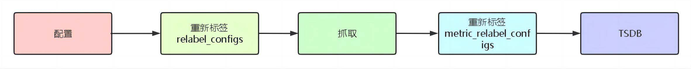

# 1. 总结prometheus服务发现实现过程
## 1.1 服务发现原理
* Prometheus是基于Pull模式的监控系统,无法使用的static_configs的方式静态的定义监控目标
* 为了监控动态目标,需要一个中间的代理人(服务注册中心)
* 代理人掌握着当前所有监控目标的访问信息
* Prometheus向这个代理人询问有哪些监控目标控,就能找到监控的动态目标,这种模式被称为服务发现
## 1.2 服务发现实现过程
* prometheus服务发现模块专门负责发现需要监控的目标采集点(target)信息
* 数据采集模块从服务发现模块订阅该信息，获取到target信息后，其中就包含协议(scheme)、主机地址:端口(instance)、请求路径(metrics_path)、请求参数(params)等
* 然后数据采集模块就可以基于这些信息构建出一个完整的Http Request请求，定时通过pull http协议不断的去目标采集点(target)拉取监控样本数据(sample)
* 最后，将采集到监控样本数据交由TSDB模块进行数据存储。
## 1.3 prometheus常用的服务发现类型
* kubernetes_sd_configs: #基于Kubernetes API实现的服务
发现，让prometheus动态发现kubernetes中被监控的目标 
* static_configs: #静态服务发现，基于prometheus配置文件
指定的监控目标 
* dns_sd_configs: #DNS 服务发现监控目标 
* consul_sd_configs: #Consul 服务发现，基于consul服务动
态发现监控目标 
* file_sd_configs: #基于指定的文件实现服务发现，基于指定
的文件发现监控目标
* prometheus支持的服务发现模式[官网链接](ttps://prometheus.io/docs/prometheus/latest/configuration/configuration/#configuration-file)
## 1.4 kubernetes服务发现过程
* kubernetes的服务发现机制是基于dns的,所有的service都注册到api-server最终存储到etcd中,任何组件想要访问其它服务的话都需要从api-server中获取, 因此etcd中存储有所有元数据
* prometheus要发现kubernetes中的服务, 需要通过list-watch机制从api-server中获取即可, 获取之后prometheus会缓存在自己的内存中.
# 2. 总结prometheus标签重写relabel_configs
* promethues的relabeling（重新修改标签）功能很强大，它能够在抓取到目标实例之前把目标实例的元数据标签动态重新修改，动态添加或者覆盖标签
* prometheus从Kubernetes API动态发现目标(targer)之后，在被发现的target实例中，都包含一些原始的Metadata标签信息，常见默认的标签有：
  * __address__：以<host>:<port> 格式显示目标targets的地址
  * __scheme__：采集的目标服务地址的Scheme形式，HTTP或
者HTTPS
  * __metrics_path__：采集的目标服务的访问路径
* prometheus支持对发现的目标进行label修改，在两个阶段可以重新标记

  * relabel_configs ： 在对target进行数据采集之前（比如在采集数据之前重新定义标签信息，如目的IP、目的端口等信息），可以使用relabel_configs添加、修改或删除一些标签、也可以只采集特定目标或过滤目标。
  * metric_relabel_configs：在对target进行数据采集之后，即如果是已经抓取到指标数据时，可以使用metric_relabel_configs做最后的重新标记和过滤。
* label类型：
  * source_labels：源标签，没有经过relabel处理之前的标签名字
  * target_label：通过action处理之后的新的标签名字
  * regex：给定的值或正则表达式匹配，匹配源标签的值
  * replacement：通过分组替换后标签（target_label）对应的/()/() $1:$2
* action简介:
  * replace: #替换标签值，根据regex正则匹配到源标签的值，使用replacement来引用表达式匹配的分组。
  * keep: #满足regex正则条件的实例进行采集，把source_labels中没有匹配到regex正则内容的Target实例丢掉，即只采集匹配成功的实例。
  * drop: #满足regex正则条件的实例不采集，把source_labels中匹配到regex正则内容的Target实例丢掉，即只采集没有匹配到的实例。
  * labelmap: #匹配regex所有标签名称,然后复制匹配标签的值进行分组，可以通过replacement分组引用（${1},${2},…）替代
  * labelkeep: 匹配regex所有标签名称,其它不匹配的标签都将从标签集中删除
  * labeldrop: 匹配regex所有标签名称,其它匹配的标签都将从标签集中删除
  * hashmod: 使用hashmod计算source_labels的Hash值并进行对比，基于自定义的模数取模，以实现对目标进行分类、重新赋值等功能 
# 3. kubernetes环境中部署prometheus并基于kubernetes_sd_config实现pod、node、endpoint等监控目标动态发现

# 4. kubernetes环境外部署prometheus并基于kubernetes_sd_config实现pod、node、endpoint等监控目标动态发现

# 扩展： 
## 1.基于HPA控制器对pod副本实现弹性伸缩