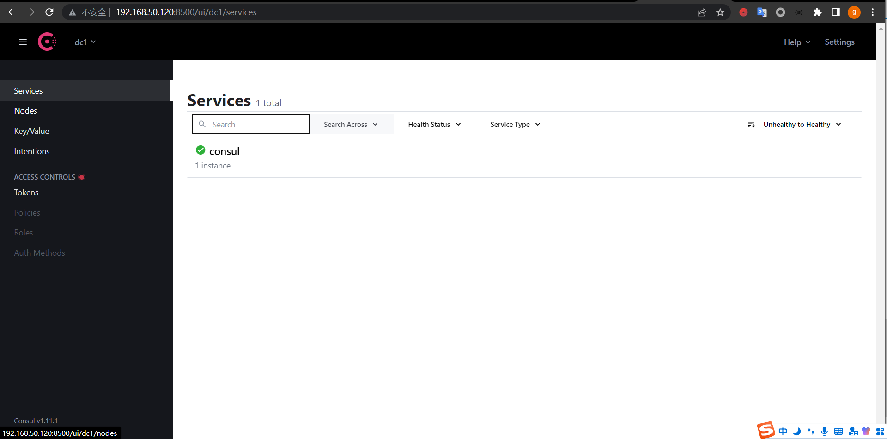
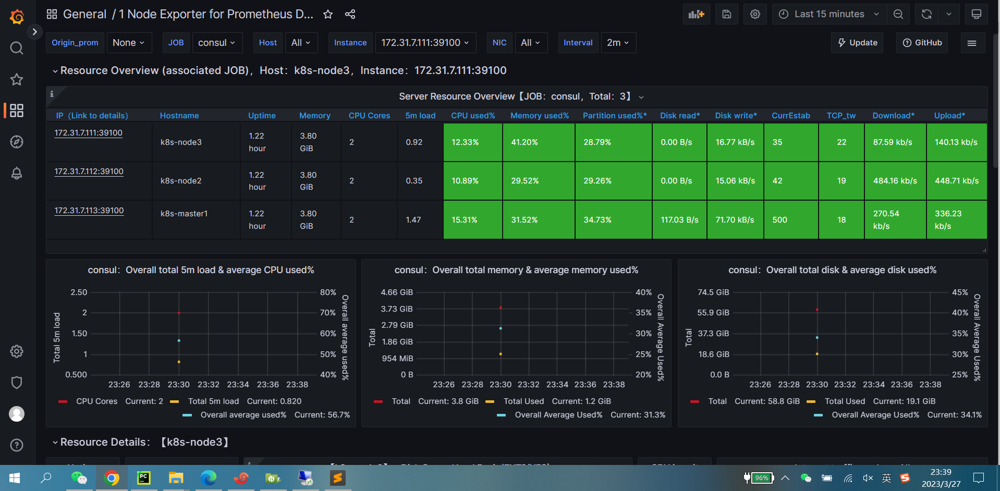

# 1.Prometheus 基于consul实现服务发现，并总结服务发现过程
## 1.1 consul服务发现过程
* 1. 服务通过consul api接口注册到consul服务中
* 2. Prometheus通过与Consul的交互可以获取到相应target实例的访问信息
* 3. prometheus通过获取的target信息进行数据抓取
## 1.2 prometheus基于consul实现服务发现
```bash
## 基于docker compose部署consul
root@docker1:~# cd docker-compose-deploy-single-consul/
## 下载镜像
root@docker1:~/docker-compose-deploy-single-consul# docker compose pull
## 启动consul服务
root@docker1:~/docker-compose-deploy-single-consul# docker compose up -d
## 查看服务状态
oot@docker1:~/docker-compose-deploy-single-consul# docker compose ps
NAME                IMAGE               COMMAND                  SERVICE             CREATED             STATUS              PORTS
consul-server       consul:latest       "docker-entrypoint.s…"   consul1             40 seconds ago      Up 39 seconds       8300-8302/tcp, 8301-8302/udp, 8600/tcp, 8600/udp, 0.0.0.0:8500->8500/tcp

```
* 访问consul界面

```bash
## 配置prometheus基于consul实现监控目标发现
root@haproxy1:~# cd /apps/prometheus
root@haproxy1:/apps/prometheus# vi prometheus.yml
  - job_name: consul
    honor_labels: true
    metrics_path: /metrics
    scheme: http
    consul_sd_configs: 
    - server: 172.31.7.120:8500
      services: [] #发现的目标服务名称，空为所有服务，可以写servicea,servcieb,servicec
    relabel_configs: 
    - source_labels: ['__meta_consul_tags']
      target_label: 'product' 
    - source_labels: ['__meta_consul_dc']
      target_label: 'idc' 
    - source_labels: ['__meta_consul_service']
      regex: "consul"
      action: drop
## 检查配置文件
root@haproxy1:/apps/prometheus# ./promtool check config prometheus.yml 
Checking prometheus.yml
 SUCCESS: prometheus.yml is valid prometheus config file syntax
## 重新加载prometheus配置
root@haproxy1:/apps/prometheus# curl -X POST 127.0.0.1:9090/-/reload
## 向consul中注册服务
root@haproxy1:~# curl -X PUT -d '{"id": "node-exporter111","name": "node-exporter111","address": "172.31.7.111","port":39100,"tags": ["node-exporter"],"checks": [{"http": "http://172.31.7.111:39100/","interval": "5s"}]}' http://172.31.7.120:8500/v1/agent/service/register
root@haproxy1:~# curl -X PUT -d '{"id": "node-exporter112","name": "node-exporter112","address": "172.31.7.112","port":39100,"tags": ["node-exporter"],"checks": [{"http": "http://172.31.7.112:39100/","interval": "5s"}]}' http://172.31.7.120:8500/v1/agent/service/register
root@haproxy1:~# curl -X PUT -d '{"id": "node-exporter113","name": "node-exporter113","address": "172.31.7.113","port":39100,"tags": ["node-exporter"],"checks": [{"http": "http://172.31.7.113:39100/","interval": "5s"}]}' http://172.31.7.120:8500/v1/agent/service/register
```
* consul查看服务信息

* prometheus查看target

* grafana导入11074查看dashboard


# 2.Prometheus监控JAVA服务(Tomcat)、Redis、MySQL、HAProxy
# 3.总结prometheus基于exporter进行指标数据采集的流程
# 4.Prometheus集合AlertManager实现邮件、钉钉、微信告警
# 5.基于钉钉告警模板与企业微信告警模板实现自定义告警内容

# 扩展：
## 1.prometheus监控Nginx及Ingress Controller