# 1.Prometheus 基于consul实现服务发现，并总结服务发现过程
## 1.1 consul服务发现过程
* 1. 服务通过consul api接口注册到consul服务中
* 2. Prometheus通过与Consul的交互可以获取到相应target实例的访问信息
* 3. prometheus通过获取的target信息进行数据抓取
## 1.2 prometheus基于consul实现服务发现
```bash
## 基于docker compose部署consul
root@docker1:~# cd docker-compose-deploy-single-consul/
## 下载镜像
root@docker1:~/docker-compose-deploy-single-consul# docker compose pull
## 启动consul服务
root@docker1:~/docker-compose-deploy-single-consul# docker compose up -d
## 查看服务状态
oot@docker1:~/docker-compose-deploy-single-consul# docker compose ps
NAME                IMAGE               COMMAND                  SERVICE             CREATED             STATUS              PORTS
consul-server       consul:latest       "docker-entrypoint.s…"   consul1             40 seconds ago      Up 39 seconds       8300-8302/tcp, 8301-8302/udp, 8600/tcp, 8600/udp, 0.0.0.0:8500->8500/tcp

```
* 访问consul界面
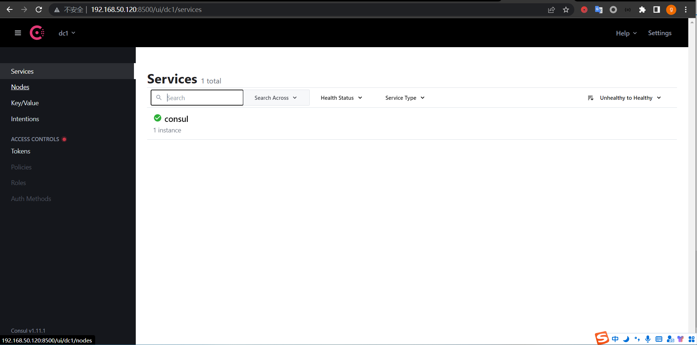
```bash
## 配置prometheus基于consul实现监控目标发现
root@haproxy1:~# cd /apps/prometheus
root@haproxy1:/apps/prometheus# vi prometheus.yml
  - job_name: consul
    honor_labels: true
    metrics_path: /metrics
    scheme: http
    consul_sd_configs: 
    - server: 172.31.7.120:8500
      services: [] #发现的目标服务名称，空为所有服务，可以写servicea,servcieb,servicec
    relabel_configs: 
    - source_labels: ['__meta_consul_tags']
      target_label: 'product' 
    - source_labels: ['__meta_consul_dc']
      target_label: 'idc' 
    - source_labels: ['__meta_consul_service']
      regex: "consul"
      action: drop
## 检查配置文件
root@haproxy1:/apps/prometheus# ./promtool check config prometheus.yml 
Checking prometheus.yml
 SUCCESS: prometheus.yml is valid prometheus config file syntax
## 重新加载prometheus配置
root@haproxy1:/apps/prometheus# curl -X POST 127.0.0.1:9090/-/reload
## 向consul中注册服务
root@haproxy1:~# curl -X PUT -d '{"id": "node-exporter111","name": "node-exporter111","address": "172.31.7.111","port":39100,"tags": ["node-exporter"],"checks": [{"http": "http://172.31.7.111:39100/","interval": "5s"}]}' http://172.31.7.120:8500/v1/agent/service/register
root@haproxy1:~# curl -X PUT -d '{"id": "node-exporter112","name": "node-exporter112","address": "172.31.7.112","port":39100,"tags": ["node-exporter"],"checks": [{"http": "http://172.31.7.112:39100/","interval": "5s"}]}' http://172.31.7.120:8500/v1/agent/service/register
root@haproxy1:~# curl -X PUT -d '{"id": "node-exporter113","name": "node-exporter113","address": "172.31.7.113","port":39100,"tags": ["node-exporter"],"checks": [{"http": "http://172.31.7.113:39100/","interval": "5s"}]}' http://172.31.7.120:8500/v1/agent/service/register
```
* consul查看服务信息
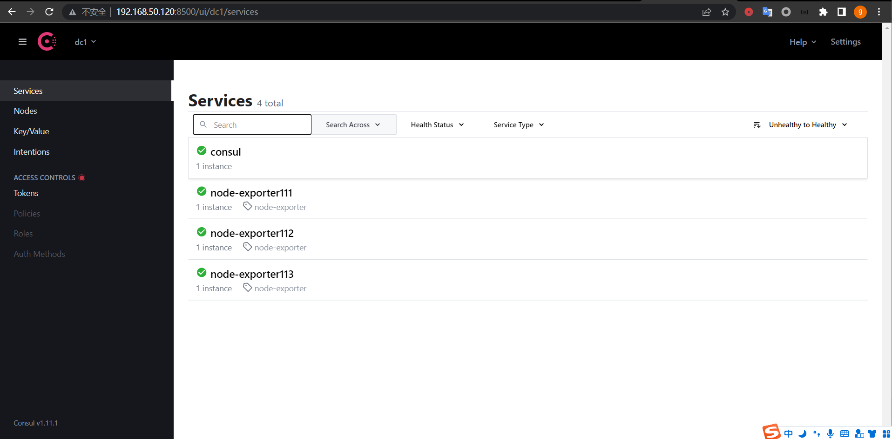
* prometheus查看target
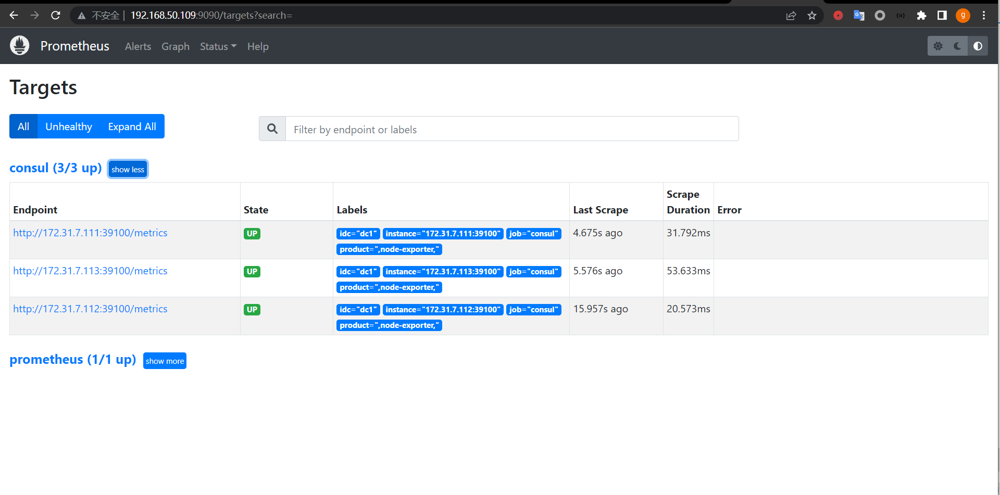
* grafana导入11074查看dashboard
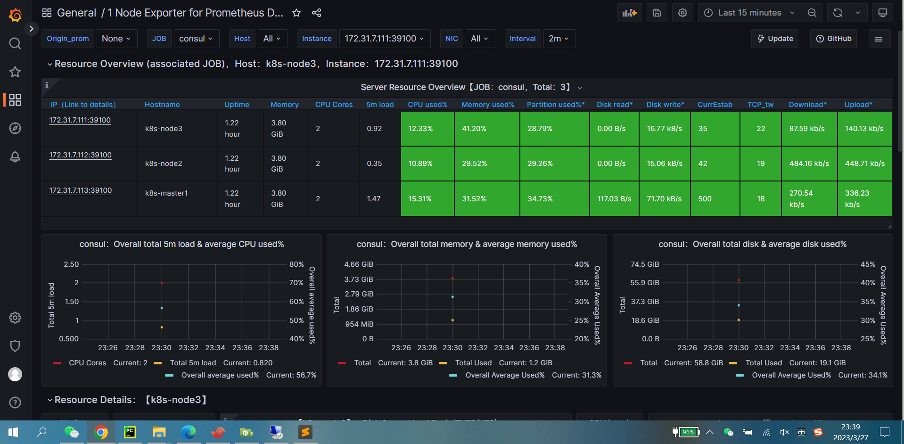

# 2.Prometheus监控JAVA服务(Tomcat)、Redis、MySQL、HAProxy
## 2.1 prometheus监控java服务(tomcat)
```bash
## 进入到本地资目录
root@k8s-master1:~# cd /usr/local/src/
## 解压prometheus监控压缩包
root@k8s-master1:/usr/local/src# unzip 1.prometheus-case-files.zip
## 进入到tomcat镜像构建目录
root@k8s-master1:/usr/local/src# cd 1.prometheus-case-files/app-monitor-case/tomcat/
root@k8s-master1:/usr/local/src/1.prometheus-case-files/app-monitor-case/tomcat# cd tomcat-image/
## 更换镜像地址
root@k8s-master1:/usr/local/src/1.prometheus-case-files/app-monitor-case/tomcat/tomcat-image# sed -e 's/harbor.linuxarchitect.io/harbor.yanggc.cn/g' -i build-command.sh
## 编译镜像
root@k8s-master1:/usr/local/src/1.prometheus-case-files/app-monitor-case/tomcat/tomcat-image# bash build-command.sh
## 测试镜像
root@k8s-master1:/usr/local/src/1.prometheus-case-files/app-monitor-case/tomcat/tomcat-image# docker run -it --rm -p 9080:8080 harbor.yanggc.cn/magedu/tomcat-app1:v1
```
* tomcat访问测试
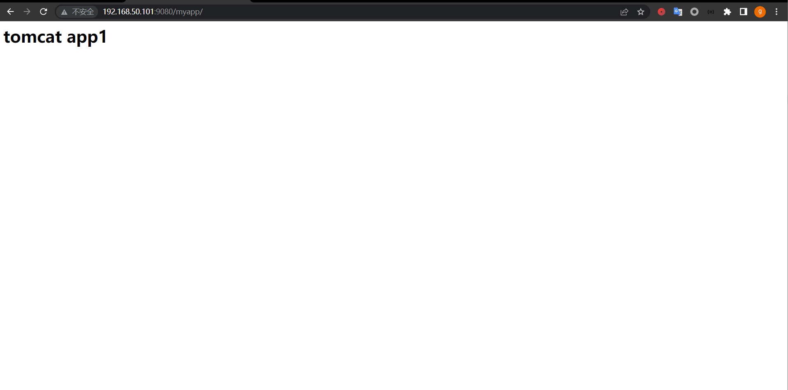
```bash
## 更换tomcat资源编排yaml中的镜像
root@k8s-master1:/usr/local/src/1.prometheus-case-files/app-monitor-case/tomcat/tomcat-image# cd ../yaml/
## 部署tomcat和service
root@k8s-master1:/usr/local/src/1.prometheus-case-files/app-monitor-case/tomcat/yaml# kubectl apply -f ./
deployment.apps/tomcat-deployment created
service/tomcat-service created
## 查看部署的资源
root@k8s-master1:/usr/local/src/1.prometheus-case-files/app-monitor-case/tomcat/yaml# kubectl get pod,svc
NAME                                     READY   STATUS    RESTARTS      AGE
pod/php-apache-7d774bb9d9-7jgz2          1/1     Running   2 (21m ago)   5d
pod/tomcat-deployment-7c7d578ccc-jqk7m   1/1     Running   0             21s

NAME                     TYPE        CLUSTER-IP       EXTERNAL-IP   PORT(S)        AGE
service/kubernetes       ClusterIP   10.100.0.1       <none>        443/TCP        24d
service/php-apache       ClusterIP   10.100.24.49     <none>        80/TCP         5d
service/tomcat-service   NodePort    10.100.253.138   <none>        80:31080/TCP   21s
```
* 浏览器访问tomcat
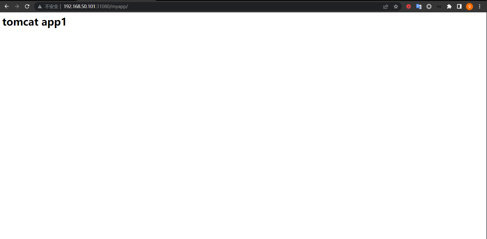
```bash
## 配置prometheus采集tomcat数据
root@haproxy1:~# vi /apps/prometheus/prometheus.yml 
  - job_name: "tomcat-monitor-metrics"
    static_configs:
    - targets: ["172.31.7.101:31080"]
## 重新加载prometheus配置  
root@haproxy1:~# curl -X POST 127.0.0.1:9090/-/reload
                                  
```
* prometheus查看target
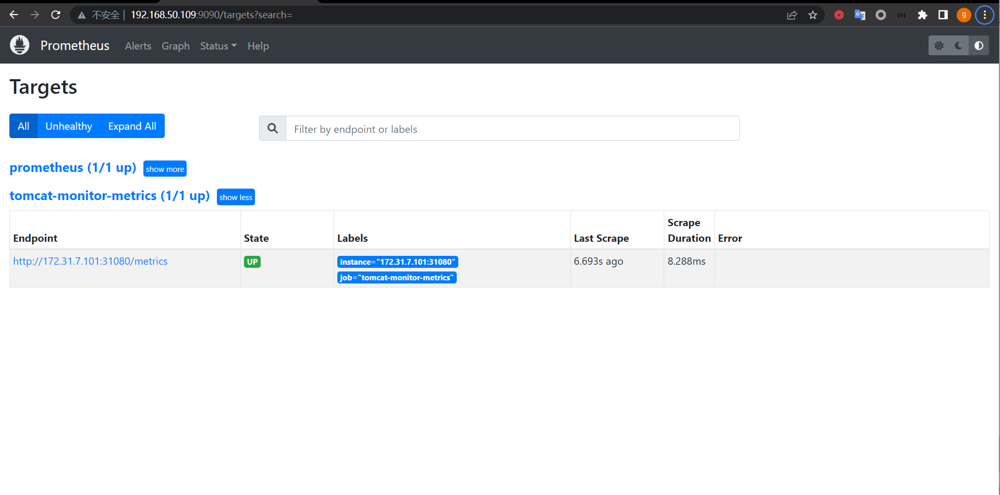
* grafana导入[dashboard](https://raw.githubusercontent.com/nlighten/tomcat_exporter/master/dashboard/example.json)
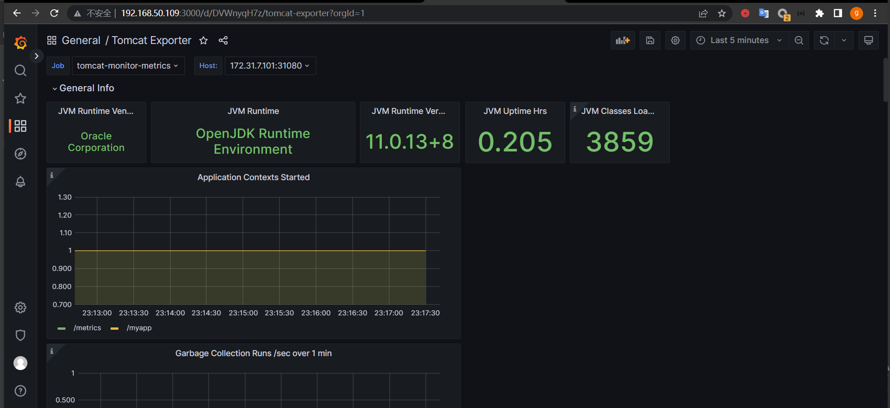
## 2.2 prometheus 监控redis
```bash
## 部署redis服务
root@k8s-master1:/usr/local/src/1.prometheus-case-files/app-monitor-case/tomcat/yaml# cd ../../redis/
root@k8s-master1:/usr/local/src/1.prometheus-case-files/app-monitor-case/redis# kubectl apply -f yaml/
deployment.apps/redis created
service/redis-exporter-service created
service/redis-redis-service created
## 查看部署的资源
root@k8s-master1:/usr/local/src/1.prometheus-case-files/app-monitor-case/redis# kubectl get pod,svc -n magedu 
NAME                                            READY   STATUS    RESTARTS      AGE
pod/magedu-jenkins-deployment-db96bdb96-8vjpm   1/1     Running   5 (38m ago)   17d
pod/magedu-nginx-deployment-748c55bb6b-m95qh    2/2     Running   6 (39m ago)   6d
pod/redis-79f976c795-jn6w4                      2/2     Running   0             43s

NAME                             TYPE       CLUSTER-IP       EXTERNAL-IP   PORT(S)                      AGE
service/magedu-jenkins-service   NodePort   10.100.207.62    <none>        80:38080/TCP                 17d
service/magedu-nginx-service     NodePort   10.100.136.118   <none>        80:30092/TCP,443:30093/TCP   6d
service/redis-exporter-service   NodePort   10.100.64.183    <none>        9121:31082/TCP               43s
service/redis-redis-service      NodePort   10.100.24.5      <none>        6379:31081/TCP               43s
## 配置prometheus采集redis数据
root@haproxy1:~# vi /apps/prometheus/prometheus.yml 
  - job_name: "redis-monitor-metrics"
    static_configs:
    - targets: ["172.31.7.101:31082"]
## prometheus重新加载配置
root@haproxy1:~# curl -X POST 127.0.0.1:9090/-/reload
```
* 查看prometheus target
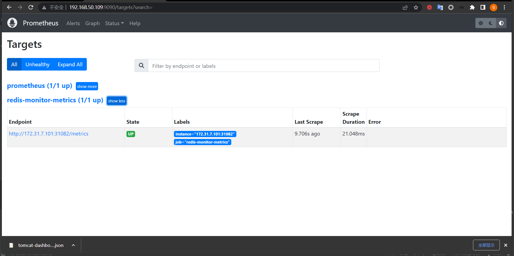
* grafana导入14615模板验证
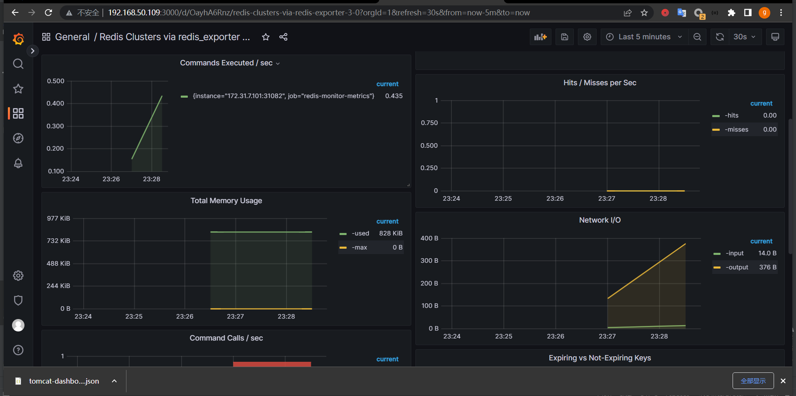
* grafana导入自定义模板验证
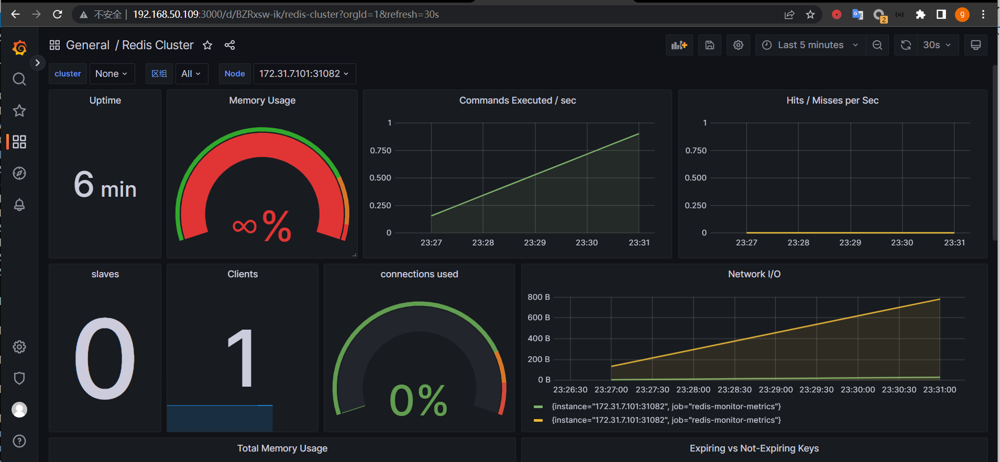
## 2.3 prometheus监控mysql
```bash
## 编写docker compose 部署mysql和mysql exporter yaml文件
root@docker1:~# mkdir mysql
root@docker1:~# cd mysql/
root@docker1:~/mysql# vi docker-compose.yml
version: '3'
services:
  mysql:
    image: mysql:5.7
    ports:
      - "3306:3306"
    environment:
      - MYSQL_ROOT_PASSWORD=password
      - MYSQL_DATABASE=database
  mysqlexporter:
    image: prom/mysqld-exporter
    ports:
      - "9104:9104"
    environment:
      - DATA_SOURCE_NAME=root:password@(mysql:3306)/database
```
* 验证mysql exporter metrics
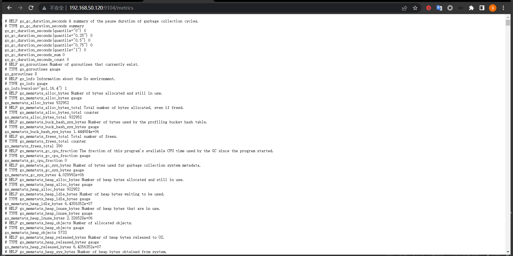
```bash
## 配置prometheus采集mysql数据
root@haproxy1:~# vi /apps/prometheus/prometheus.yml
  - job_name: mysql-monitor-172.31.7.120
    static_configs:
    - targets: ['172.31.7.120:9104']
## 重新加载prometheus配置
root@haproxy1:~# curl -X POST 127.0.0.1:9090/-/reload
```
* prometheus target验证
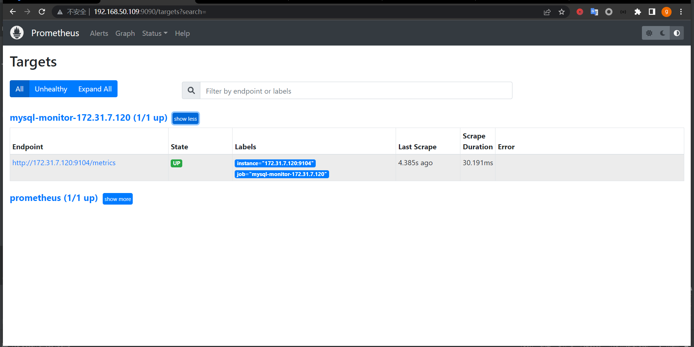
* grafana 导入13106模板验证
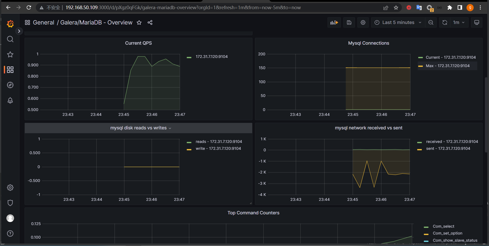
# 3.总结prometheus基于exporter进行指标数据采集的流程
## 3.1 prometheus采集exporter数据采集流程
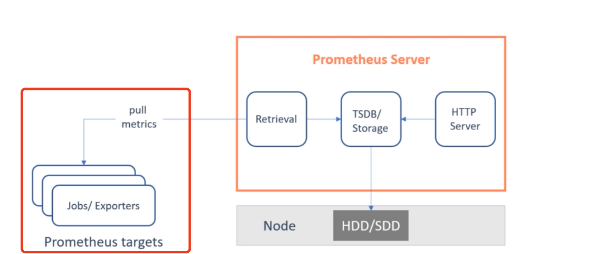
* Exporter 是一个采集监控数据并通过 Prometheus 监控规范对外提供数据的组件，它负责从目标系统（Your 服务）搜集数据，并将其转化为 Prometheus 支持的格式
* Prometheus 会周期性地调用 Exporter 提供的 metrics 数据接口来获取数据
## 3.2 Exporter分类
* 直接采集：这一类Exporter直接内置了对Prometheus监控的支持，比如cAdvisor，Kubernetes，Etcd，Gokit等，都直接内置了用于向Prometheus暴露监控数据的端点
* 间接采集：间接采集，原有监控目标并不直接支持Prometheus，因此我们需要通过Prometheus提供的Client Library编写该监控目标的监控采集程序。例如： Mysql Exporter，JMX Exporter，Consul Exporter等。
# 4.Prometheus集合AlertManager实现邮件、钉钉、微信告警
## 4.1 安装alertmanager
```bash
## 下载alertmanager
root@haproxy1:~# cd /apps/
root@haproxy1:/apps# wget https://ghproxy.com/github.com/prometheus/alertmanager/releases/download/v0.25.0/alertmanager-0.25.0.linux-amd64.tar.gz
## 解压安装包
root@haproxy1:/apps# tar xf alertmanager-0.25.0.linux-amd64.tar.gz
## 为alertmanager做一个软连方便后续管理
root@haproxy1:/apps# ln -s alertmanager-0.25.0.linux-amd64 alertmanager
## 创建service文件
root@haproxy1:/apps# vim /etc/systemd/system/alertmanager.service
[Unit]
Description=Prometheus alertmanager
After=network.target

[Service]
ExecStart=/apps/alertmanager/alertmanager --config.file="/apps/alertmanager/alertmanager.yml"

[Install]
WantedBy=multi-user.target
## 启动服务并加入开机启动项
root@haproxy1:/apps# systemctl daemon-reload && systemctl restart alertmanager && systemctl enable alertmanager
Created symlink /etc/systemd/system/multi-user.target.wants/alertmanager.service → /etc/systemd/system/alertmanager.service.
## 查看服务状态
root@haproxy1:/apps# systemctl status alertmanager
```
* 浏览器访问alertmanager
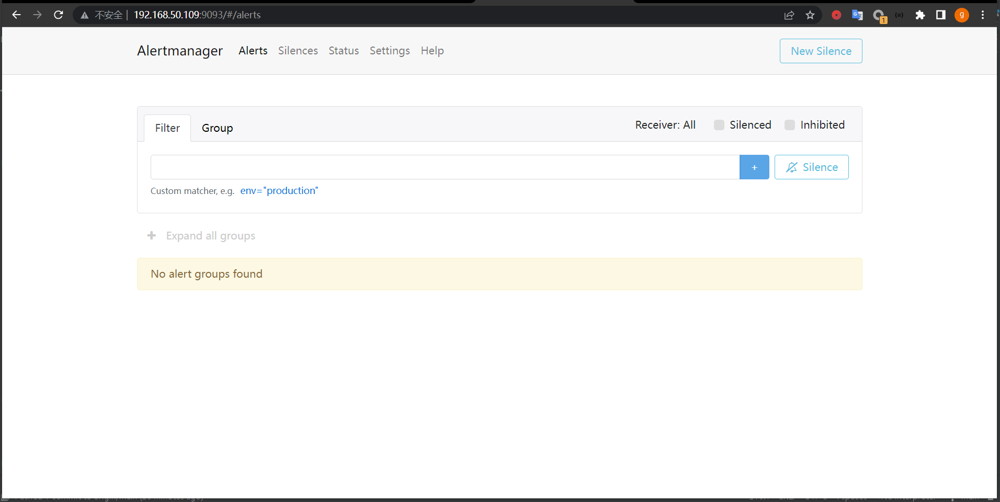
## 4.2 邮件告警
```bash
## 配置alertmanager邮箱告警
root@haproxy1:/apps# cd alertmanager
root@haproxy1:/apps/alertmanager# vi alertmanager.yml
global:
  resolve_timeout: 2m
  smtp_from: "alert@yanggc.cn"
  smtp_smarthost: 'smtp.exmail.qq.com:465'
  smtp_auth_username: "alert@yanggc.cn"
  smtp_auth_password: "******"
  smtp_require_tls: false

route:
  group_by: ['alertname']
  group_wait: 10s
  group_interval: 1m
  repeat_interval: 3m
  receiver: 'mail'

receivers:
  - name: 'mail'
    email_configs:
    - to: 'yangguangchao@yanggc.cn'
      send_resolved: true
## 检查配置文件
root@haproxy1:/apps/alertmanager# ./amtool check-config alertmanager.yml 
Checking 'alertmanager.yml'  SUCCESS
Found:
 - global config
 - route
 - 0 inhibit rules
 - 1 receivers
 - 0 templates
## 重新加载alertmanager配置
root@haproxy1:/apps/alertmanager# curl -lvs -X POST "http://localhost:9093/-/reload"
## 配置prometheus alertmanager和rule_files
root@haproxy1:/apps/alertmanager# cd ../prometheus/
root@haproxy1:/apps/prometheus# vi prometheus.yml
global:

alerting:
  alertmanagers:
    - static_configs:
        - targets:
          - 127.0.0.1:9093

rule_files:
  - rules/*.yml

scrape_configs:
  - job_name: "prometheus"

    static_configs:
      - targets: ["localhost:9090"]

  - job_name: 'kubernetes-apiservers-monitor' 
    kubernetes_sd_configs: 
    - role: endpoints
      api_server: https://172.31.7.101:6443
      tls_config: 
        insecure_skip_verify: true  
      bearer_token_file: /apps/prometheus/k8s.token 
    scheme: https 
    tls_config: 
      insecure_skip_verify: true 
    bearer_token_file: /apps/prometheus/k8s.token 
    relabel_configs: 
    - source_labels: [__meta_kubernetes_namespace, __meta_kubernetes_service_name, __meta_kubernetes_endpoint_port_name] 
      action: keep 
      regex: default;kubernetes;https 
    - source_labels: [__address__]
      regex: '(.*):6443'
      replacement: '${1}:9100'
      target_label: __address__
      action: replace
    - source_labels: [__scheme__]
      regex: https
      replacement: http
      target_label: __scheme__
      action: replace

  - job_name: 'kubernetes-nodes-monitor' 
    scheme: http 
    tls_config: 
      insecure_skip_verify: true 
    bearer_token_file: /apps/prometheus/k8s.token 
    kubernetes_sd_configs: 
    - role: node 
      api_server: https://172.31.7.101:6443 
      tls_config: 
        insecure_skip_verify: true 
      bearer_token_file: /apps/prometheus/k8s.token 
    relabel_configs: 
      - source_labels: [__address__] 
        regex: '(.*):10250' 
        replacement: '${1}:9100' 
        target_label: __address__ 
        action: replace 
      - source_labels: [__meta_kubernetes_node_label_failure_domain_beta_kubernetes_io_region] 
        regex: '(.*)' 
        replacement: '${1}' 
        action: replace 
        target_label: LOC 
      - source_labels: [__meta_kubernetes_node_label_failure_domain_beta_kubernetes_io_region] 
        regex: '(.*)' 
        replacement: 'NODE' 
        action: replace 
        target_label: Type 
      - source_labels: [__meta_kubernetes_node_label_failure_domain_beta_kubernetes_io_region] 
        regex: '(.*)' 
        replacement: 'K8S-test' 
        action: replace 
        target_label: Env 
      - action: labelmap 
        regex: __meta_kubernetes_node_label_(.+) 

  - job_name: 'kube-cadvisor'
    kubernetes_sd_configs:
    - api_server: https://172.31.7.101:6443 
      role: node
      bearer_token_file: /apps/prometheus/k8s.token
      tls_config:
        insecure_skip_verify: true    
    bearer_token_file: /apps/prometheus/k8s.token
    tls_config:
      insecure_skip_verify: true 
    scheme: https
    relabel_configs:
    - action: labelmap
      regex: __meta_kubernetes_node_label_(.+)
    - target_label: __address__
      replacement: 172.31.7.101:6443
    - source_labels: [__meta_kubernetes_node_name]
      regex: (.+)
      target_label: __metrics_path__
      replacement: /api/v1/nodes/${1}/proxy/metrics/cadvisor
## 配置prometheus告警规则
root@haproxy1:/apps/prometheus# mkdir rules
root@haproxy1:/apps/prometheus# cd rules/
root@haproxy1:/apps/prometheus/rules# vi server_rules.yml
groups:
  - name: alertmanager_pod.rules
    rules:
    - alert: Pod_all_cpu_usage
      expr: (sum by(name)(rate(container_cpu_usage_seconds_total{image!=""}[5m]))*100) > 1
      for: 10s
      labels:
        severity: critical
        service: pods
        type: pod-cpu
        project: myserver
      annotations:
        description: 容器 {{ $labels.name }} CPU 资源利用率大于 10% , (current value is {{ $value }})
        summary: Dev CPU 负载告警

    - alert: Pod_all_memory_usage  
      #expr: sort_desc(avg by(name)(irate(container_memory_usage_bytes{name!=""}[5m]))*100) > 10  #内存大于10%
      expr: sort_desc(avg by(name)(irate(container_memory_usage_bytes{name!=""}[5m]))*1000) > 1  #内存大于10%
      for: 10s
      labels:
        severity: critical
        service: pods
        type: pod-memory
        project: myserver
      annotations:
        description: 容器 {{ $labels.name }} Memory 资源利用率大于 2G , (current value is {{ $value }})
        summary: Dev Memory 负载告警

    - alert: Pod_all_network_receive_usage
      expr: sum by (name)(irate(container_network_receive_bytes_total{container_name="POD"}[1m])) > 1
      for: 10s
      labels:
        severity: critical
        service: pods
        type: pod-network-receive
        project: myserver
      annotations:
        description: 容器 {{ $labels.name }} network_receive 资源利用率大于 50M , (current value is {{ $value }})

    - alert: node内存可用大小 
      expr: node_memory_MemFree_bytes > 1 #故意写错的
      for: 10s
      labels:
        severity: critical
        project: node
      annotations:
        description: node节点 {{ $labels.name }} 的可用内存大于1字节，当前值 {{ $value }}

    - alert: 磁盘容量
      expr: 100-(node_filesystem_free_bytes{fstype=~"ext4|xfs"}/node_filesystem_size_bytes {fstype=~"ext4|xfs"}*100) > 5  #磁盘容量利用率大于80%
      for: 2s
      labels:
        severity: critical
      annotations:
        summary: "{{$labels.mountpoint}} 磁盘分区使用率过高！"
        description: "{{$labels.mountpoint }} 磁盘分区使用大于5%(目前使用:{{$value}}%)"

    - alert: 磁盘容量
      expr: 100-(node_filesystem_free_bytes{fstype=~"ext4|xfs"}/node_filesystem_size_bytes {fstype=~"ext4|xfs"}*100) > 3 #磁盘容量利用率大于60%
      for: 2s
      labels:
        severity: warning
      annotations:
        summary: "{{$labels.mountpoint}} 磁盘分区使用率过高！"
        description: "{{$labels.mountpoint }} 磁盘分区使用大于3%(目前使用:{{$value}}%)"
## 重新加载prometheus配置
root@haproxy1:/apps/prometheus/rules# curl -X POST 127.0.0.1:9090/-/reload
## 查看当前告警
root@haproxy1:/apps/prometheus/rules# cd /apps/alertmanager/
root@haproxy1:/apps/alertmanager# ./amtool alert --alertmanager.url=http://127.0.0.1:9093
Alertname             Starts At                Summary           State   
磁盘容量                  2023-03-30 14:32:05 UTC  /boot 磁盘分区使用率过高！  active  
磁盘容量                  2023-03-30 14:32:05 UTC  / 磁盘分区使用率过高！      active  
磁盘容量                  2023-03-30 14:32:05 UTC  /boot 磁盘分区使用率过高！  active  
```
* prometheus alert查看
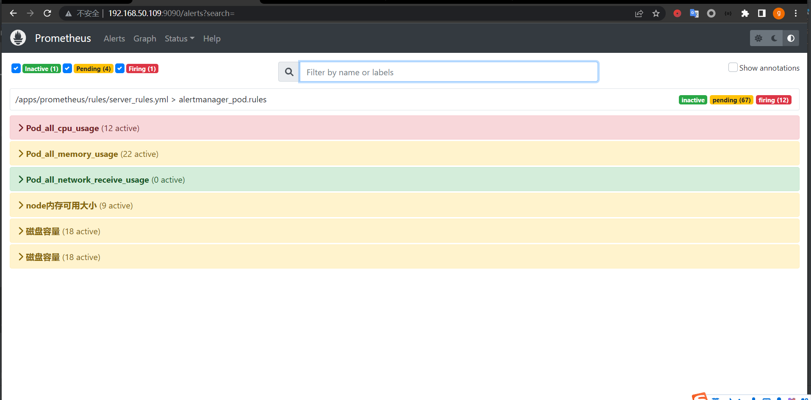
* alertmanager alert查看
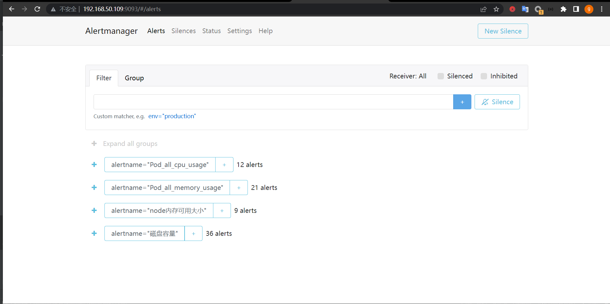
* 报警邮件查看
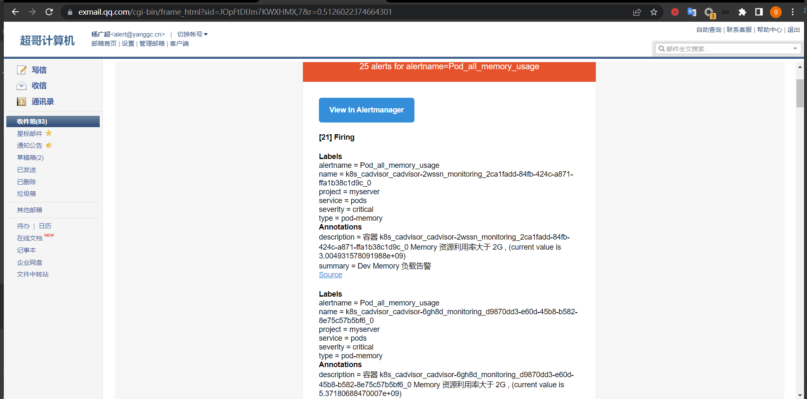
* 常用prometheus告警rules
  * [node roles](rules/node.yml)
  * [mysql roles](rules/mysql.yml)
  * [nginx rules](rules/nginx.yml)

## 4.3 钉钉告警
### 4.3.1 钉钉添加告警机器人
* 1. 群管理找到机器人管理
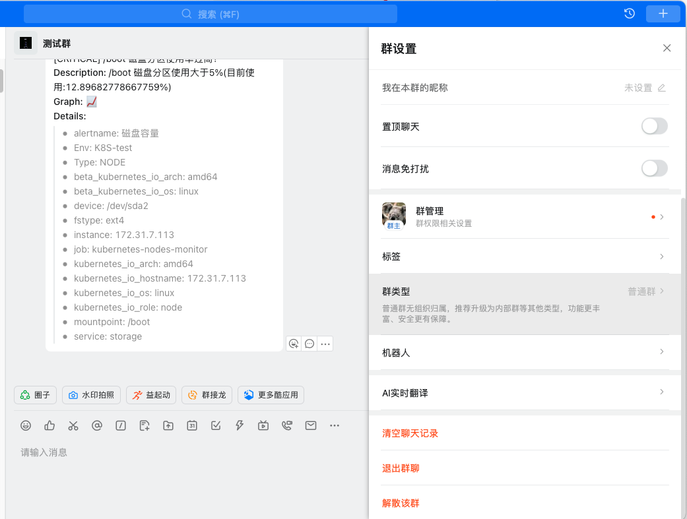
* 2. 机器人管理添加机器人

* 3. 添加自定义机器人
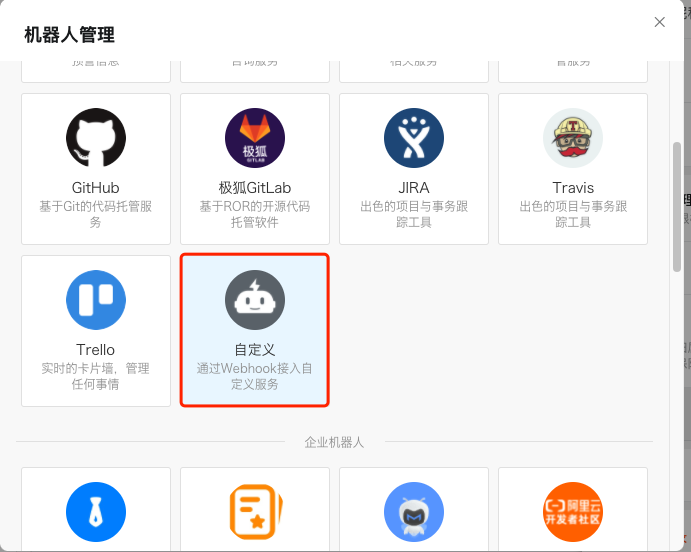
* 4. 添加机器人
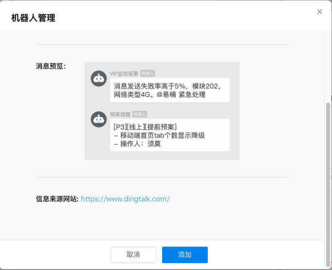
* 5. 输入机器人名字和安全设置自定义关键词
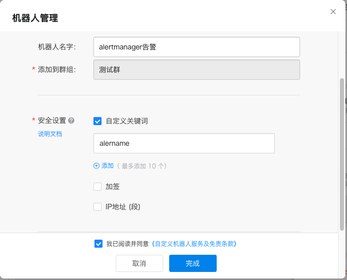
* 6. 复制机器人webhook地址
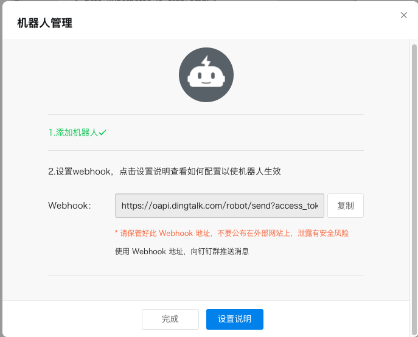
### 4.3.2 alertmanager配置钉钉告警
```bash
## 脚本测试钉钉机器人接口
root@haproxy1:~# mkdir dingtalk
root@haproxy1:~# cd dingtalk/
root@haproxy1:~/dingtalk# vi dingding-keywords.sh
#!/bin/bash
source /etc/profile
MESSAGE=$1
/usr/bin/curl -X "POST" 'https://oapi.dingtalk.com/robot/send?access_token=***' \
-H 'Content-Type: application/json' \
-d '{"msgtype": "text",
     "text": {
         "content": "'${MESSAGE}'"
     }
}'

root@haproxy1:~/dingtalk# bash dingding-keywords.sh "alertname=node,instaince=172.31.7.101"
{"errcode":0,"errmsg":"ok"}
```
* 查看钉钉


```bash
## 下载prometheus-webhook-dingtalk安装包
root@haproxy1:~# cd /apps/
root@haproxy1:/apps# wget https://ghproxy.com/github.com/timonwong/prometheus-webhook-dingtalk/releases/download/v2.1.0/prometheus-webhook-dingtalk-2.1.0.linux-amd64.tar.gz
## 解压安装包
root@haproxy1:/apps# tar -xf prometheus-webhook-dingtalk-2.1.0.linux-amd64.tar.gz
## 软连一个目录
root@haproxy1:/apps# ln -s prometheus-webhook-dingtalk-2.1.0.linux-amd64 prometheus-webhook-dingtalk
## 修改配置文件
root@haproxy1:/apps# cd prometheus-webhook-dingtalk
root@haproxy1:/apps/prometheus-webhook-dingtalk# cp config.example.yml config.yml 
root@haproxy1:/apps/prometheus-webhook-dingtalk# vi config.yml
targets:
  alertname:
    url: https://oapi.dingtalk.com/robot/send?access_token=***
## 配置service文件
root@haproxy1:/apps/prometheus-webhook-dingtalk# vim /etc/systemd/system/prometheus-webhook-dingtalk.service
[Unit]
Description=prometheus-webhook-dingtalk
After=network-online.target

[Service]
Restart=on-failure
ExecStart=/apps/prometheus-webhook-dingtalk/prometheus-webhook-dingtalk --config.file=/apps/prometheus-webhook-dingtalk/config.yml --web.enable-ui --web.enable-lifecycle

[Install]
WantedBy=multi-user.target
## 启动服务
root@haproxy1:/apps/prometheus-webhook-dingtalk# systemctl daemon-reload && systemctl start prometheus-webhook-dingtalk
## 检查服务监听端口
root@haproxy1:/apps/prometheus-webhook-dingtalk# ss -tnl | grep 8060
LISTEN 0      4096               *:8060             *:*  
## alertmanager添加钉钉告警通道
root@haproxy1:~# cd /apps/alertmanager
root@haproxy1:/apps/alertmanager# vi alertmanager.yml
global:
  resolve_timeout: 3m
  smtp_from: "alert@yanggc.cn"
  smtp_smarthost: 'smtp.exmail.qq.com:465'
  smtp_auth_username: "alert@yanggc.cn"
  smtp_auth_password: "***"
  smtp_require_tls: false

route:
  group_by: ['alertname']
  group_wait: 10s
  group_interval: 3m
  repeat_interval: 5m
  receiver: 'dingding'

receivers:
  - name: 'mail'
    email_configs:
    - to: 'yangguangchao@yanggc.cn'
      send_resolved: true

  - name: 'dingding'
    webhook_configs:
    - url: 'http://localhost:8060/dingtalk/alertname/send'
## 重新加载alertmanager配置
root@haproxy1:/apps/alertmanager# curl -X POST 127.0.0.1:9093/-/reload
```
* alertmanager查看配置
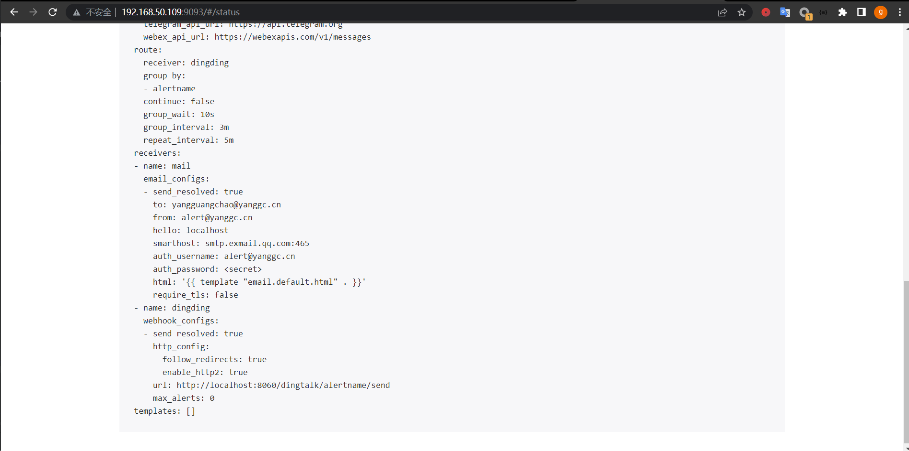
* 钉钉查看告警信息
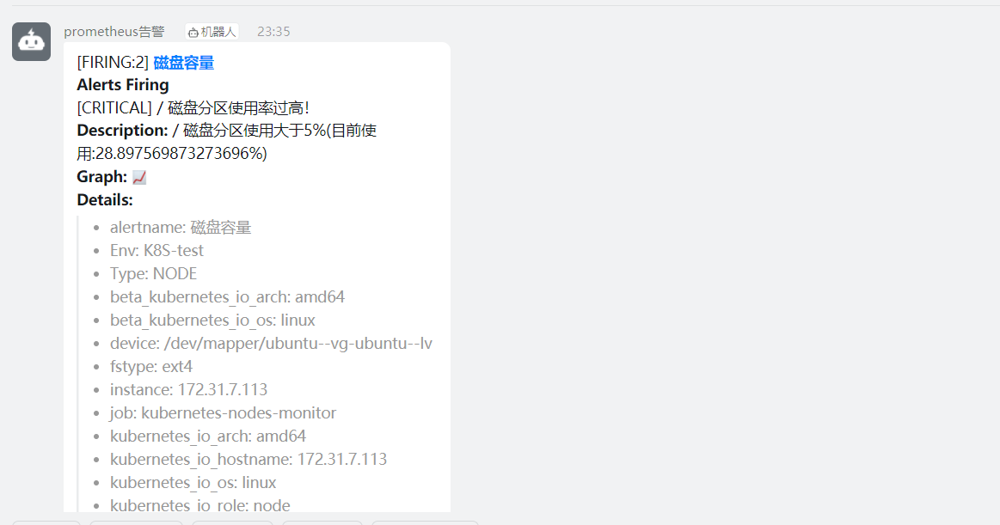
## 4.4 微信告警
### 4.4.1 添加微信告警应用
* 1. 扫码登录微信企业管理后天
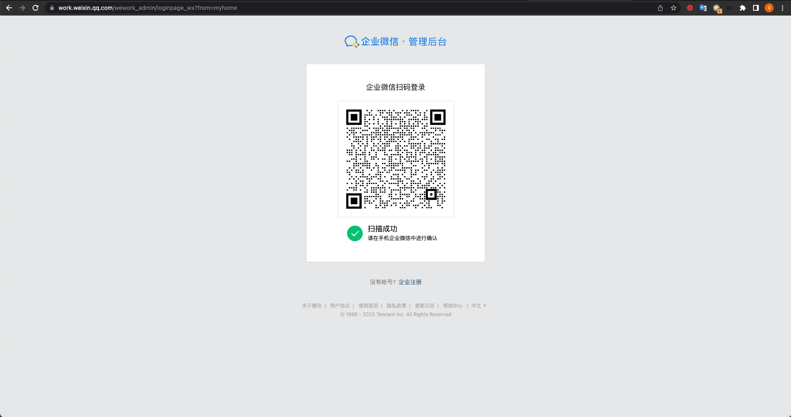  

* 2. 应用管理中创建应用
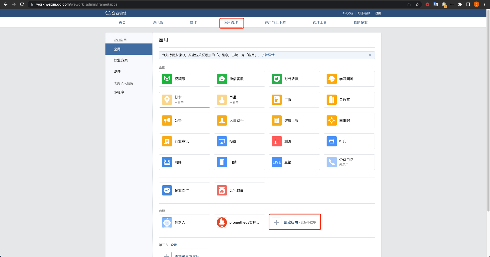  

* 3. 填写应用信息
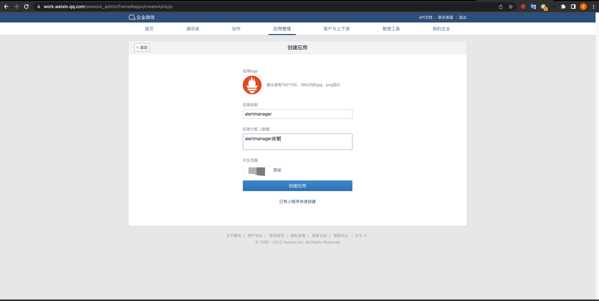  

* 4. 网页授权及JS-SDK配置可信域名
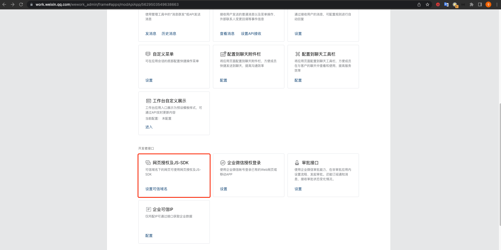  

* 5. 填写域名信息  

  

* 6. 配置企业可信IP  

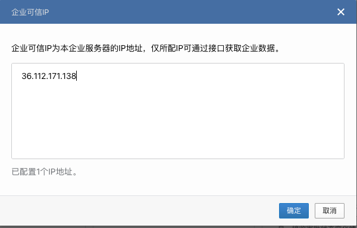  

* 7. 查看secret  

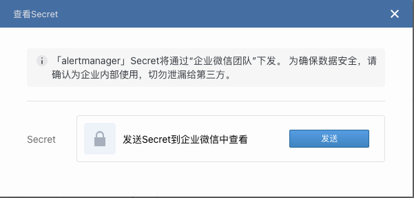  

* 8. 我的企业中查看企业ID  

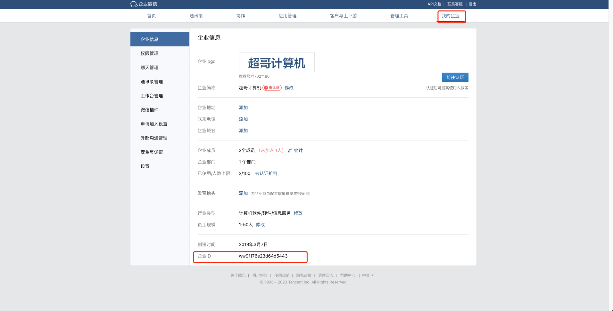  

```bash
## 验证微信域名验证
~ > curl https://yanggc.cn/WW_verify_cnl8He3s0L9MHOe8.txt
cnl8He3s0L9MHOe8
## 查看公网IP
~ > curl cip.cc
IP	: 36.112.171.138
地址	: 中国  浙江  电信

数据二	: 北京市 | 电信

数据三	: 中国北京北京市 | 电信

URL	: http://www.cip.cc/36.112.171.138
```
### 4.4.2 alertmanager配置微信告警
```bash
## alertmanager添加微信告警配置
root@haproxy1:/apps/alertmanager# vi alertmanager.yml
global:
  resolve_timeout: 3m
  smtp_from: "alert@yanggc.cn"
  smtp_smarthost: 'smtp.exmail.qq.com:465'
  smtp_auth_username: "alert@yanggc.cn"
  smtp_auth_password: "***"
  smtp_require_tls: false

route:
  group_by: ['alertname']
  group_wait: 10s
  group_interval: 3m
  repeat_interval: 5m
  receiver: 'wechat'

receivers:
  - name: 'mail'
    email_configs:
    - to: 'yangguangchao@yanggc.cn'
      send_resolved: true

  - name: 'dingding'
    webhook_configs:
    - url: 'http://localhost:8060/dingtalk/alertname/send'
      send_resolved: true

  - name: 'wechat'
    wechat_configs:
    - corp_id: ww9f176e23d64d5443
      to_user: '@all'
      agent_id: 1000002
      api_secret: ***
      send_resolved: true
## 重新加载alertmanager配置
root@haproxy1:/apps/alertmanager# curl -X POST 127.0.0.1:9093/-/reload
```
* 企业微信查看告警
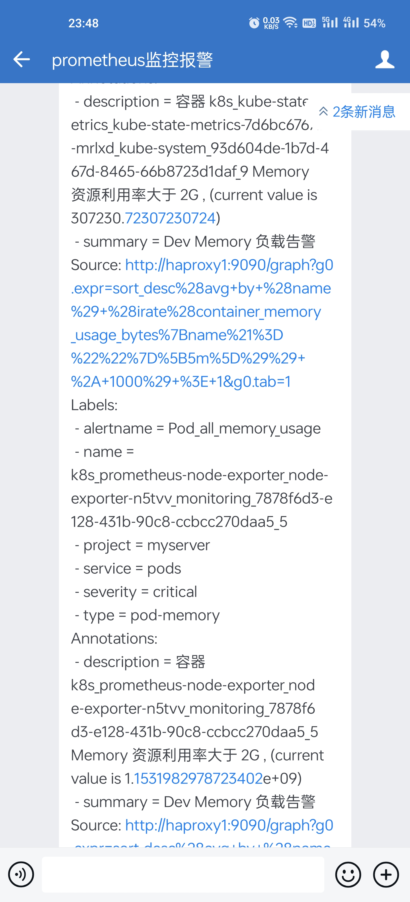
## 4.5 告警路由
* 将service:node相关的报警发送到微信
* 将service:pod先关的告警发送到邮箱
* 将service:storage相关的发送送到钉钉
```bash
## 修改prometheus rule的label配置
root@haproxy1:/apps/alertmanager# cd ../prometheus/rules/
root@haproxy1:/apps/prometheus/rules# vi server_rules.yml
groups:
  - name: alertmanager_pod.rules
    rules:
    - alert: Pod_all_cpu_usage
      expr: (sum by(name)(rate(container_cpu_usage_seconds_total{image!=""}[5m]))*100) > 1
      for: 10s
      labels:
        severity: critical
        service: pods
        type: pod-cpu
        project: myserver
      annotations:
        description: 容器 {{ $labels.name }} CPU 资源利用率大于 10% , (current value is {{ $value }})
        summary: Dev CPU 负载告警

    - alert: Pod_all_memory_usage  
      #expr: sort_desc(avg by(name)(irate(container_memory_usage_bytes{name!=""}[5m]))*100) > 10  #内存大于10%
      expr: sort_desc(avg by(name)(irate(container_memory_usage_bytes{name!=""}[5m]))*1000) > 1  #内存大于10%
      for: 10s
      labels:
        severity: critical
        service: pods
        type: pod-memory
        project: myserver
      annotations:
        description: 容器 {{ $labels.name }} Memory 资源利用率大于 2G , (current value is {{ $value }})
        summary: Dev Memory 负载告警

    - alert: Pod_all_network_receive_usage
      expr: sum by (name)(irate(container_network_receive_bytes_total{container_name="POD"}[1m])) > 1
      for: 10s
      labels:
        severity: critical
        service: pods
        type: pod-network-receive
        project: myserver
      annotations:
        description: 容器 {{ $labels.name }} network_receive 资源利用率大于 50M , (current value is {{ $value }})

    - alert: node内存可用大小 
      expr: node_memory_MemFree_bytes > 1 #故意写错的
      for: 10s
      labels:
        severity: critical
        service: node
        project: node
      annotations:
        description: node节点 {{ $labels.name }} 的可用内存大于1字节，当前值 {{ $value }}

    - alert: 磁盘容量
      expr: 100-(node_filesystem_free_bytes{fstype=~"ext4|xfs"}/node_filesystem_size_bytes {fstype=~"ext4|xfs"}*100) > 5  #磁盘容量利用率大于80%
      for: 2s
      labels:
        severity: critical
        service: storage
      annotations:
        summary: "{{$labels.mountpoint}} 磁盘分区使用率过高！"
        description: "{{$labels.mountpoint }} 磁盘分区使用大于5%(目前使用:{{$value}}%)"

    - alert: 磁盘容量
      expr: 100-(node_filesystem_free_bytes{fstype=~"ext4|xfs"}/node_filesystem_size_bytes {fstype=~"ext4|xfs"}*100) > 3 #磁盘容量利用率大于60%
      for: 2s
      labels:
        severity: warning
        service: storage
      annotations:
        summary: "{{$labels.mountpoint}} 磁盘分区使用率过高！"
        description: "{{$labels.mountpoint }} 磁盘分区使用大于3%(目前使用:{{$value}}%)"
## 配置alertmanager告警路由
root@haproxy1:/apps/prometheus/rules# cd ../../alertmanager
root@haproxy1:/apps/alertmanager# vi alertmanager.yml 
global:
  resolve_timeout: 3m
  smtp_from: "alert@yanggc.cn"
  smtp_smarthost: 'smtp.exmail.qq.com:465'
  smtp_auth_username: "alert@yanggc.cn"
  smtp_auth_password: "***"
  smtp_require_tls: false

route:
  group_by: ['alertname']
  group_wait: 10s
  group_interval: 3m
  repeat_interval: 5m
  receiver: 'mail'
  routes:
    - receiver: 'wechat'
      group_wait: 2s
      match_re:
        service: node
    - receiver: 'dingding'
      group_wait: 2s
      match_re:
        service: storage

receivers:
  - name: 'mail'
    email_configs:
    - to: 'yangguangchao@yanggc.cn'
      send_resolved: true

  - name: 'dingding'
    webhook_configs:
    - url: 'http://localhost:8060/dingtalk/alertname/send'
      send_resolved: true

  - name: 'wechat'
    wechat_configs:
    - corp_id: ww9f176e23d64d5443
      to_user: '@all'
      agent_id: 1000002
      api_secret: ***
      send_resolved: true
## 重新加载prometheus和alertmanager配置
root@haproxy1:/apps/alertmanager# curl -X POST 127.0.0.1:9090/-/reload
root@haproxy1:/apps/alertmanager# curl -X POST 127.0.0.1:9093/-/reload
```
* 邮箱告警推送
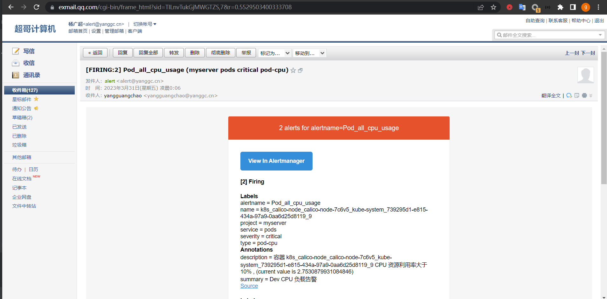
* 微信告警推送
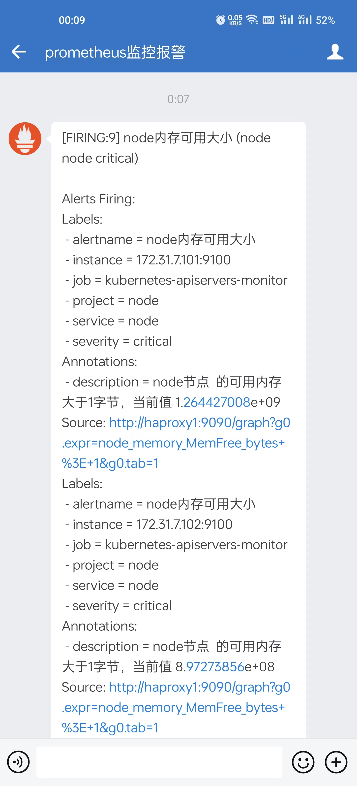
* 钉钉告警推送
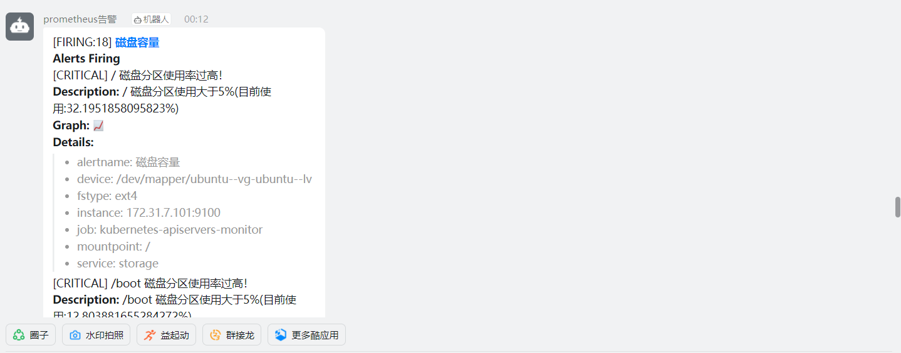


# 5.基于钉钉告警模板与企业微信告警模板实现自定义告警内容
```bash
## 创建微信告警模板
root@haproxy1:~# cd /apps/alertmanager
root@haproxy1:/apps/alertmanager# vi wechat.templ
{{ define "wechat.default.message" }}
{{- if gt (len .Alerts.Firing) 0 -}}
{{- range $index, $alert := .Alerts -}}
{{- if eq $index 0 -}}
**********告警通知**********
告警类型: {{ $alert.Labels.alertname }}
告警级别: {{ $alert.Labels.severity }}
{{- end }}
=====================
告警主题: {{ $alert.Annotations.summary }}
告警详情: {{ $alert.Annotations.description }}
故障时间: {{ $alert.StartsAt.Local.Format "2006-01-02 15:04:05" }}
{{ if gt (len $alert.Labels.instance) 0 -}}故障实例: {{ $alert.Labels.instance }}{{- end -}}
{{- end }}
{{- end }}

{{- if gt (len .Alerts.Resolved) 0 -}}
{{- range $index, $alert := .Alerts -}}
{{- if eq $index 0 -}}
**********恢复通知**********
告警类型: {{ $alert.Labels.alertname }}
告警级别: {{ $alert.Labels.severity }}
{{- end }}
=====================
告警主题: {{ $alert.Annotations.summary }}
告警详情: {{ $alert.Annotations.description }}
故障时间: {{ $alert.StartsAt.Local.Format "2006-01-02 15:04:05" }}
恢复时间: {{ $alert.EndsAt.Local.Format "2006-01-02 15:04:05" }}
{{ if gt (len $alert.Labels.instance) 0 -}}故障实例: {{ $alert.Labels.instance }}{{- end -}}
{{- end }}
{{- end }}
{{- end }}
## alertmanager使用wechat模板
root@haproxy1:/apps/alertmanager# vi alertmanager.yml
templates:
  - /apps/alertmanager/wechat.templ
## 重新加载alertmanager配置
root@haproxy1:/apps/alertmanager# curl -X POST 127.0.0.1:9093/-/reload
## 钉钉告警模板
root@haproxy1:/apps/alertmanager# cd ../prometheus-webhook-dingtalk
root@haproxy1:/apps/prometheus-webhook-dingtalk# vi template.yaml
{{ define "dingding.to.message" }}

{{- if gt (len .Alerts.Firing) 0 -}}
{{- range $index, $alert := .Alerts -}}

=========  **监控告警** =========  

**告警程序:**     Alertmanager   
**告警类型:**    {{ $alert.Labels.alertname }}   
**告警级别:**    {{ $alert.Labels.severity }} 级   
**告警状态:**    {{ .Status }}   
**故障主机:**    {{ $alert.Labels.instance }} {{ $alert.Labels.device }}   
**告警主题:**    {{ .Annotations.summary }}   
**告警详情:**    {{ $alert.Annotations.message }}{{ $alert.Annotations.description}}   
**主机标签:**    {{ range .Labels.SortedPairs  }}  </br> [{{ .Name }}: {{ .Value | markdown | html }} ] 
{{- end }} </br>

**故障时间:**    {{ ($alert.StartsAt.Add 28800e9).Format "2006-01-02 15:04:05" }}  
========= = end =  =========  
{{- end }}
{{- end }}

{{- if gt (len .Alerts.Resolved) 0 -}}
{{- range $index, $alert := .Alerts -}}

========= 告警恢复 =========  
**告警程序:**     Alertmanager   
**告警主题:**    {{ $alert.Annotations.summary }}  
**告警主机:**    {{ .Labels.instance }}   
**告警类型:**    {{ .Labels.alertname }}  
**告警级别:**    {{ $alert.Labels.severity }} 级   
**告警状态:**    {{   .Status }}  
**告警详情:**    {{ $alert.Annotations.message }}{{ $alert.Annotations.description}}  
**故障时间:**    {{ ($alert.StartsAt.Add 28800e9).Format "2006-01-02 15:04:05" }}  
**恢复时间:**    {{ ($alert.EndsAt.Add 28800e9).Format "2006-01-02 15:04:05" }}  

========= = **end** =  =========
{{- end }}
{{- end }}
{{- end }}
## prometheus-webhook-dingtalk使用模板
root@haproxy1:/apps/prometheus-webhook-dingtalk# vi config.yml
templates:
  - /apps/prometheus-webhook-dingtalk/template.yaml


targets:
  alertname:
    url: https://oapi.dingtalk.com/robot/send?access_token=***
    message:
      text: '{{ template "dingding.to.message" . }}'
## 重新加载配置
root@haproxy1:/apps/prometheus-webhook-dingtalk# curl -X POST 127.0.0.1:8060/-/reload
OK
```
* 微信告警使用模版
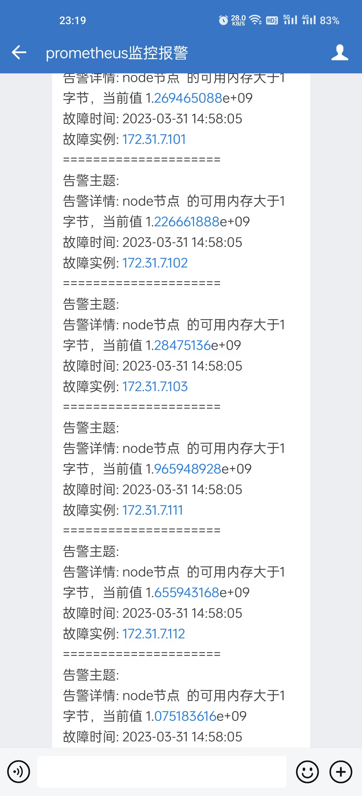
* 钉钉告警使用模板
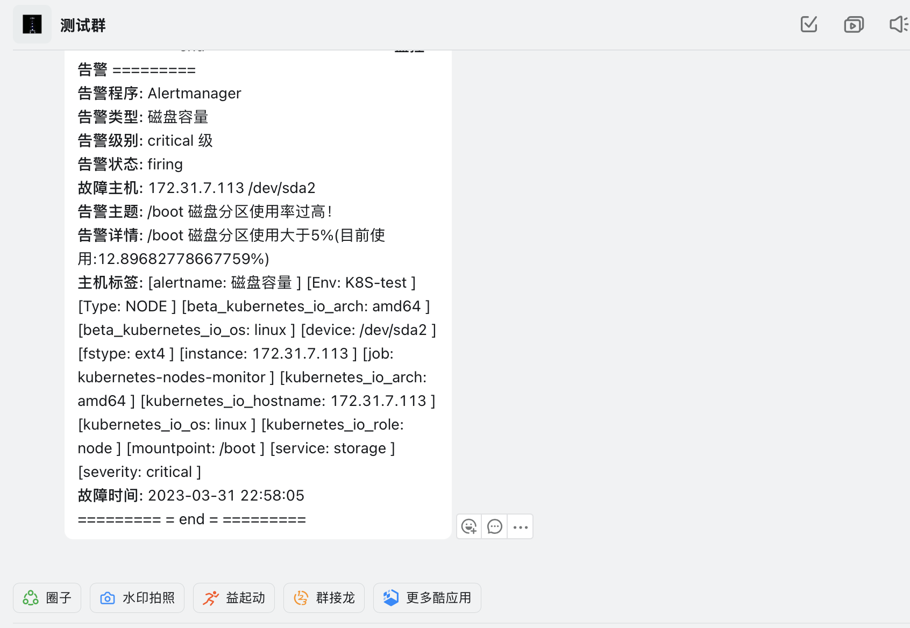
# 扩展：
## 1.prometheus监控Nginx及Ingress Controller
```bash
## 修改ingress资源编排文件,暴露指标采集接口10254
root@k8s-master1:~# cd /usr/local/src/
root@k8s-master1:/usr/local/src# vi 1.ingress-nginx-controller-v1.2.0_deployment.yaml
apiVersion: v1
kind: Namespace
metadata:
  labels:
    app.kubernetes.io/instance: ingress-nginx
    app.kubernetes.io/name: ingress-nginx
  name: ingress-nginx
---
apiVersion: v1
automountServiceAccountToken: true
kind: ServiceAccount
metadata:
  labels:
    app.kubernetes.io/component: controller
    app.kubernetes.io/instance: ingress-nginx
    app.kubernetes.io/name: ingress-nginx
    app.kubernetes.io/part-of: ingress-nginx
    app.kubernetes.io/version: 1.2.0
  name: ingress-nginx
  namespace: ingress-nginx
---
apiVersion: v1
kind: ServiceAccount
metadata:
  labels:
    app.kubernetes.io/component: admission-webhook
    app.kubernetes.io/instance: ingress-nginx
    app.kubernetes.io/name: ingress-nginx
    app.kubernetes.io/part-of: ingress-nginx
    app.kubernetes.io/version: 1.2.0
  name: ingress-nginx-admission
  namespace: ingress-nginx
---
apiVersion: rbac.authorization.k8s.io/v1
kind: Role
metadata:
  labels:
    app.kubernetes.io/component: controller
    app.kubernetes.io/instance: ingress-nginx
    app.kubernetes.io/name: ingress-nginx
    app.kubernetes.io/part-of: ingress-nginx
    app.kubernetes.io/version: 1.2.0
  name: ingress-nginx
  namespace: ingress-nginx
rules:
- apiGroups:
  - ""
  resources:
  - namespaces
  verbs:
  - get
- apiGroups:
  - ""
  resources:
  - configmaps
  - pods
  - secrets
  - endpoints
  verbs:
  - get
  - list
  - watch
- apiGroups:
  - ""
  resources:
  - services
  verbs:
  - get
  - list
  - watch
- apiGroups:
  - networking.k8s.io
  resources:
  - ingresses
  verbs:
  - get
  - list
  - watch
- apiGroups:
  - networking.k8s.io
  resources:
  - ingresses/status
  verbs:
  - update
- apiGroups:
  - networking.k8s.io
  resources:
  - ingressclasses
  verbs:
  - get
  - list
  - watch
- apiGroups:
  - ""
  resourceNames:
  - ingress-controller-leader
  resources:
  - configmaps
  verbs:
  - get
  - update
- apiGroups:
  - ""
  resources:
  - configmaps
  verbs:
  - create
- apiGroups:
  - ""
  resources:
  - events
  verbs:
  - create
  - patch
---
apiVersion: rbac.authorization.k8s.io/v1
kind: Role
metadata:
  labels:
    app.kubernetes.io/component: admission-webhook
    app.kubernetes.io/instance: ingress-nginx
    app.kubernetes.io/name: ingress-nginx
    app.kubernetes.io/part-of: ingress-nginx
    app.kubernetes.io/version: 1.2.0
  name: ingress-nginx-admission
  namespace: ingress-nginx
rules:
- apiGroups:
  - ""
  resources:
  - secrets
  verbs:
  - get
  - create
---
apiVersion: rbac.authorization.k8s.io/v1
kind: ClusterRole
metadata:
  labels:
    app.kubernetes.io/instance: ingress-nginx
    app.kubernetes.io/name: ingress-nginx
    app.kubernetes.io/part-of: ingress-nginx
    app.kubernetes.io/version: 1.2.0
  name: ingress-nginx
rules:
- apiGroups:
  - ""
  resources:
  - configmaps
  - endpoints
  - nodes
  - pods
  - secrets
  - namespaces
  verbs:
  - list
  - watch
- apiGroups:
  - ""
  resources:
  - nodes
  verbs:
  - get
- apiGroups:
  - ""
  resources:
  - services
  verbs:
  - get
  - list
  - watch
- apiGroups:
  - networking.k8s.io
  resources:
  - ingresses
  verbs:
  - get
  - list
  - watch
- apiGroups:
  - ""
  resources:
  - events
  verbs:
  - create
  - patch
- apiGroups:
  - networking.k8s.io
  resources:
  - ingresses/status
  verbs:
  - update
- apiGroups:
  - networking.k8s.io
  resources:
  - ingressclasses
  verbs:
  - get
  - list
  - watch
---
apiVersion: rbac.authorization.k8s.io/v1
kind: ClusterRole
metadata:
  labels:
    app.kubernetes.io/component: admission-webhook
    app.kubernetes.io/instance: ingress-nginx
    app.kubernetes.io/name: ingress-nginx
    app.kubernetes.io/part-of: ingress-nginx
    app.kubernetes.io/version: 1.2.0
  name: ingress-nginx-admission
rules:
- apiGroups:
  - admissionregistration.k8s.io
  resources:
  - validatingwebhookconfigurations
  verbs:
  - get
  - update
---
apiVersion: rbac.authorization.k8s.io/v1
kind: RoleBinding
metadata:
  labels:
    app.kubernetes.io/component: controller
    app.kubernetes.io/instance: ingress-nginx
    app.kubernetes.io/name: ingress-nginx
    app.kubernetes.io/part-of: ingress-nginx
    app.kubernetes.io/version: 1.2.0
  name: ingress-nginx
  namespace: ingress-nginx
roleRef:
  apiGroup: rbac.authorization.k8s.io
  kind: Role
  name: ingress-nginx
subjects:
- kind: ServiceAccount
  name: ingress-nginx
  namespace: ingress-nginx
---
apiVersion: rbac.authorization.k8s.io/v1
kind: RoleBinding
metadata:
  labels:
    app.kubernetes.io/component: admission-webhook
    app.kubernetes.io/instance: ingress-nginx
    app.kubernetes.io/name: ingress-nginx
    app.kubernetes.io/part-of: ingress-nginx
    app.kubernetes.io/version: 1.2.0
  name: ingress-nginx-admission
  namespace: ingress-nginx
roleRef:
  apiGroup: rbac.authorization.k8s.io
  kind: Role
  name: ingress-nginx-admission
subjects:
- kind: ServiceAccount
  name: ingress-nginx-admission
  namespace: ingress-nginx
---
apiVersion: rbac.authorization.k8s.io/v1
kind: ClusterRoleBinding
metadata:
  labels:
    app.kubernetes.io/instance: ingress-nginx
    app.kubernetes.io/name: ingress-nginx
    app.kubernetes.io/part-of: ingress-nginx
    app.kubernetes.io/version: 1.2.0
  name: ingress-nginx
roleRef:
  apiGroup: rbac.authorization.k8s.io
  kind: ClusterRole
  name: ingress-nginx
subjects:
- kind: ServiceAccount
  name: ingress-nginx
  namespace: ingress-nginx
---
apiVersion: rbac.authorization.k8s.io/v1
kind: ClusterRoleBinding
metadata:
  labels:
    app.kubernetes.io/component: admission-webhook
    app.kubernetes.io/instance: ingress-nginx
    app.kubernetes.io/name: ingress-nginx
    app.kubernetes.io/part-of: ingress-nginx
    app.kubernetes.io/version: 1.2.0
  name: ingress-nginx-admission
roleRef:
  apiGroup: rbac.authorization.k8s.io
  kind: ClusterRole
  name: ingress-nginx-admission
subjects:
- kind: ServiceAccount
  name: ingress-nginx-admission
  namespace: ingress-nginx
---
apiVersion: v1
data:
  allow-snippet-annotations: "true"
kind: ConfigMap
metadata:
  labels:
    app.kubernetes.io/component: controller
    app.kubernetes.io/instance: ingress-nginx
    app.kubernetes.io/name: ingress-nginx
    app.kubernetes.io/part-of: ingress-nginx
    app.kubernetes.io/version: 1.2.0
  name: ingress-nginx-controller
  namespace: ingress-nginx
---
apiVersion: v1
kind: Service
metadata:
  labels:
    app.kubernetes.io/component: controller
    app.kubernetes.io/instance: ingress-nginx
    app.kubernetes.io/name: ingress-nginx
    app.kubernetes.io/part-of: ingress-nginx
    app.kubernetes.io/version: 1.2.0
  name: ingress-nginx-controller
  namespace: ingress-nginx
spec:
  ipFamilies:
  - IPv4
  ipFamilyPolicy: SingleStack
  ports:
  - appProtocol: http
    name: http
    port: 80
    protocol: TCP
    targetPort: http
  - appProtocol: https
    name: https
    port: 443
    protocol: TCP
    targetPort: https
  selector:
    app.kubernetes.io/component: controller
    app.kubernetes.io/instance: ingress-nginx
    app.kubernetes.io/name: ingress-nginx
  type: NodePort
---
apiVersion: v1
kind: Service
metadata:
  labels:
    app.kubernetes.io/component: controller
    app.kubernetes.io/instance: ingress-nginx
    app.kubernetes.io/name: ingress-nginx
    app.kubernetes.io/part-of: ingress-nginx
    app.kubernetes.io/version: 1.2.0
  name: ingress-nginx-controller-admission
  namespace: ingress-nginx
spec:
  ports:
  - appProtocol: https
    name: https-webhook
    port: 443
    targetPort: webhook
  selector:
    app.kubernetes.io/component: controller
    app.kubernetes.io/instance: ingress-nginx
    app.kubernetes.io/name: ingress-nginx
  type: ClusterIP
---
apiVersion: apps/v1
kind: Deployment
metadata:
  labels:
    app.kubernetes.io/component: controller
    app.kubernetes.io/instance: ingress-nginx
    app.kubernetes.io/name: ingress-nginx
    app.kubernetes.io/part-of: ingress-nginx
    app.kubernetes.io/version: 1.2.0
  name: ingress-nginx-controller
  namespace: ingress-nginx
spec:
  minReadySeconds: 0
  revisionHistoryLimit: 10
  selector:
    matchLabels:
      app.kubernetes.io/component: controller
      app.kubernetes.io/instance: ingress-nginx
      app.kubernetes.io/name: ingress-nginx
  template:
    metadata:
      annotations:
        prometheus.io/port: "10254"
        prometheus.io/scrape: "true"
      labels:
        app.kubernetes.io/component: controller
        app.kubernetes.io/instance: ingress-nginx
        app.kubernetes.io/name: ingress-nginx
    spec:
      containers:
      - args:
        - /nginx-ingress-controller
        - --election-id=ingress-controller-leader
        - --controller-class=k8s.io/ingress-nginx
        - --ingress-class=nginx
        - --configmap=$(POD_NAMESPACE)/ingress-nginx-controller
        - --validating-webhook=:8443
        - --validating-webhook-certificate=/usr/local/certificates/cert
        - --validating-webhook-key=/usr/local/certificates/key
        env:
        - name: POD_NAME
          valueFrom:
            fieldRef:
              fieldPath: metadata.name
        - name: POD_NAMESPACE
          valueFrom:
            fieldRef:
              fieldPath: metadata.namespace
        - name: LD_PRELOAD
          value: /usr/local/lib/libmimalloc.so
        image: registry.cn-hangzhou.aliyuncs.com/zhangshijie/ingress-nginx:v1.2.0
        imagePullPolicy: IfNotPresent
        lifecycle:
          preStop:
            exec:
              command:
              - /wait-shutdown
        livenessProbe:
          failureThreshold: 5
          httpGet:
            path: /healthz
            port: 10254
            scheme: HTTP
          initialDelaySeconds: 10
          periodSeconds: 10
          successThreshold: 1
          timeoutSeconds: 1
        name: controller
        ports:
        - containerPort: 80
          name: http
          protocol: TCP
        - containerPort: 443
          name: https
          protocol: TCP
        - containerPort: 8443
          name: webhook
          protocol: TCP
        - containerPort: 10254
          name: prometheus
          protocol: TCP
        readinessProbe:
          failureThreshold: 3
          httpGet:
            path: /healthz
            port: 10254
            scheme: HTTP
          initialDelaySeconds: 10
          periodSeconds: 10
          successThreshold: 1
          timeoutSeconds: 1
        resources:
          requests:
            cpu: 100m
            memory: 90Mi
        securityContext:
          allowPrivilegeEscalation: true
          capabilities:
            add:
            - NET_BIND_SERVICE
            drop:
            - ALL
          runAsUser: 101
        volumeMounts:
        - mountPath: /usr/local/certificates/
          name: webhook-cert
          readOnly: true
      dnsPolicy: ClusterFirst
      nodeSelector:
        kubernetes.io/os: linux
      serviceAccountName: ingress-nginx
      terminationGracePeriodSeconds: 300
      volumes:
      - name: webhook-cert
        secret:
          secretName: ingress-nginx-admission
---
apiVersion: batch/v1
kind: Job
metadata:
  labels:
    app.kubernetes.io/component: admission-webhook
    app.kubernetes.io/instance: ingress-nginx
    app.kubernetes.io/name: ingress-nginx
    app.kubernetes.io/part-of: ingress-nginx
    app.kubernetes.io/version: 1.2.0
  name: ingress-nginx-admission-create
  namespace: ingress-nginx
spec:
  template:
    metadata:
      labels:
        app.kubernetes.io/component: admission-webhook
        app.kubernetes.io/instance: ingress-nginx
        app.kubernetes.io/name: ingress-nginx
        app.kubernetes.io/part-of: ingress-nginx
        app.kubernetes.io/version: 1.2.0
      name: ingress-nginx-admission-create
    spec:
      containers:
      - args:
        - create
        - --host=ingress-nginx-controller-admission,ingress-nginx-controller-admission.$(POD_NAMESPACE).svc
        - --namespace=$(POD_NAMESPACE)
        - --secret-name=ingress-nginx-admission
        env:
        - name: POD_NAMESPACE
          valueFrom:
            fieldRef:
              fieldPath: metadata.namespace
        image: registry.cn-hangzhou.aliyuncs.com/zhangshijie/kube-webhook-certgen:v1.1.1
        imagePullPolicy: IfNotPresent
        name: create
        securityContext:
          allowPrivilegeEscalation: false
      nodeSelector:
        kubernetes.io/os: linux
      restartPolicy: OnFailure
      securityContext:
        fsGroup: 2000
        runAsNonRoot: true
        runAsUser: 2000
      serviceAccountName: ingress-nginx-admission
---
apiVersion: batch/v1
kind: Job
metadata:
  labels:
    app.kubernetes.io/component: admission-webhook
    app.kubernetes.io/instance: ingress-nginx
    app.kubernetes.io/name: ingress-nginx
    app.kubernetes.io/part-of: ingress-nginx
    app.kubernetes.io/version: 1.2.0
  name: ingress-nginx-admission-patch
  namespace: ingress-nginx
spec:
  template:
    metadata:
      labels:
        app.kubernetes.io/component: admission-webhook
        app.kubernetes.io/instance: ingress-nginx
        app.kubernetes.io/name: ingress-nginx
        app.kubernetes.io/part-of: ingress-nginx
        app.kubernetes.io/version: 1.2.0
      name: ingress-nginx-admission-patch
    spec:
      containers:
      - args:
        - patch
        - --webhook-name=ingress-nginx-admission
        - --namespace=$(POD_NAMESPACE)
        - --patch-mutating=false
        - --secret-name=ingress-nginx-admission
        - --patch-failure-policy=Fail
        env:
        - name: POD_NAMESPACE
          valueFrom:
            fieldRef:
              fieldPath: metadata.namespace
        image: registry.cn-hangzhou.aliyuncs.com/zhangshijie/kube-webhook-certgen:v1.1.1
        imagePullPolicy: IfNotPresent
        name: patch
        securityContext:
          allowPrivilegeEscalation: false
      nodeSelector:
        kubernetes.io/os: linux
      restartPolicy: OnFailure
      securityContext:
        fsGroup: 2000
        runAsNonRoot: true
        runAsUser: 2000
      serviceAccountName: ingress-nginx-admission
---
apiVersion: networking.k8s.io/v1
kind: IngressClass
metadata:
  labels:
    app.kubernetes.io/component: controller
    app.kubernetes.io/instance: ingress-nginx
    app.kubernetes.io/name: ingress-nginx
    app.kubernetes.io/part-of: ingress-nginx
    app.kubernetes.io/version: 1.2.0
  name: nginx
spec:
  controller: k8s.io/ingress-nginx
---
apiVersion: admissionregistration.k8s.io/v1
kind: ValidatingWebhookConfiguration
metadata:
  labels:
    app.kubernetes.io/component: admission-webhook
    app.kubernetes.io/instance: ingress-nginx
    app.kubernetes.io/name: ingress-nginx
    app.kubernetes.io/part-of: ingress-nginx
    app.kubernetes.io/version: 1.2.0
  name: ingress-nginx-admission
webhooks:
- admissionReviewVersions:
  - v1
  clientConfig:
    service:
      name: ingress-nginx-controller-admission
      namespace: ingress-nginx
      path: /networking/v1/ingresses
  failurePolicy: Fail
  matchPolicy: Equivalent
  name: validate.nginx.ingress.kubernetes.io
  rules:
  - apiGroups:
    - networking.k8s.io
    apiVersions:
    - v1
    operations:
    - CREATE
    - UPDATE
    resources:
    - ingresses
  sideEffects: None
## 部署ingress
root@k8s-master1:/usr/local/src# kubectl apply -f 1.ingress-nginx-controller-v1.2.0_deployment.yaml
## 查看部署的资源
root@k8s-master1:/usr/local/src# kubectl get pod,svc -n ingress-nginx
NAME                                            READY   STATUS      RESTARTS   AGE
pod/ingress-nginx-admission-create-fzrlq        0/1     Completed   0          37s
pod/ingress-nginx-admission-patch-c5t2p         0/1     Completed   1          37s
pod/ingress-nginx-controller-6d44dcd7dc-l229x   1/1     Running     0          37s

NAME                                         TYPE        CLUSTER-IP      EXTERNAL-IP   PORT(S)                      AGE
service/ingress-nginx-controller             NodePort    10.100.50.5     <none>        80:58706/TCP,443:36419/TCP   37s
service/ingress-nginx-controller-admission   ClusterIP   10.100.101.36   <none>        443/TCP                      37s
## 访问指标接口测试
root@k8s-master1:/usr/local/src# kubectl get pod -n ingress-nginx  -o wide
NAME                                        READY   STATUS      RESTARTS   AGE     IP             NODE           NOMINATED NODE   READINESS GATES
ingress-nginx-admission-create-fzrlq        0/1     Completed   0          3m47s   10.200.36.68   172.31.7.111   <none>           <none>
ingress-nginx-admission-patch-c5t2p         0/1     Completed   1          3m47s   10.200.36.69   172.31.7.111   <none>           <none>
ingress-nginx-controller-6d44dcd7dc-l229x   1/1     Running     0          3m47s   10.200.36.67   172.31.7.111   <none>           <none>
root@k8s-master1:/usr/local/src# curl 10.200.36.67:10254/metrics
# HELP go_gc_cycles_automatic_gc_cycles_total Count of completed GC cycles generated by the Go runtime.
# TYPE go_gc_cycles_automatic_gc_cycles_total counter
go_gc_cycles_automatic_gc_cycles_total 8
# HELP go_gc_cycles_forced_gc_cycles_total Count of completed GC cycles forced by the application.
# TYPE go_gc_cycles_forced_gc_cycles_total counter
go_gc_cycles_forced_gc_cycles_total 0
# HELP go_gc_cycles_total_gc_cycles_total Count of all completed GC cycles.
# TYPE go_gc_cycles_total_gc_cycles_total counter
go_gc_cycles_total_gc_cycles_total 8
# HELP go_gc_duration_seconds A summary of the pause duration of garbage collection cycles.
# TYPE go_gc_duration_seconds summary
go_gc_duration_seconds{quantile="0"} 1.2869e-05
go_gc_duration_seconds{quantile="0.25"} 3.9587e-05
go_gc_duration_seconds{quantile="0.5"} 8.5863e-05
go_gc_duration_seconds{quantile="0.75"} 0.000129467
go_gc_duration_seconds{quantile="1"} 0.000435428
go_gc_duration_seconds_sum 0.000897687
go_gc_duration_seconds_count 8
# HELP go_gc_heap_allocs_by_size_bytes_total Distribution of heap allocations by approximate size. Note that this does not include tiny objects as defined by /gc/heap/tiny/allocs:objects, only tiny blocks.
# TYPE go_gc_heap_allocs_by_size_bytes_total histogram
go_gc_heap_allocs_by_size_bytes_total_bucket{le="8.999999999999998"} 7438
go_gc_heap_allocs_by_size_bytes_total_bucket{le="24.999999999999996"} 84629
go_gc_heap_allocs_by_size_bytes_total_bucket{le="64.99999999999999"} 163254
go_gc_heap_allocs_by_size_bytes_total_bucket{le="144.99999999999997"} 178116
go_gc_heap_allocs_by_size_bytes_total_bucket{le="320.99999999999994"} 193987
go_gc_heap_allocs_by_size_bytes_total_bucket{le="704.9999999999999"} 198122
go_gc_heap_allocs_by_size_bytes_total_bucket{le="1536.9999999999998"} 200375
go_gc_heap_allocs_by_size_bytes_total_bucket{le="3200.9999999999995"} 201177
go_gc_heap_allocs_by_size_bytes_total_bucket{le="6528.999999999999"} 202053
go_gc_heap_allocs_by_size_bytes_total_bucket{le="13568.999999999998"} 202190
go_gc_heap_allocs_by_size_bytes_total_bucket{le="27264.999999999996"} 202263
go_gc_heap_allocs_by_size_bytes_total_bucket{le="+Inf"} 202307
go_gc_heap_allocs_by_size_bytes_total_sum 2.5983672e+07
go_gc_heap_allocs_by_size_bytes_total_count 202307
# HELP go_gc_heap_allocs_bytes_total Cumulative sum of memory allocated to the heap by the application.
# TYPE go_gc_heap_allocs_bytes_total counter
go_gc_heap_allocs_bytes_total 2.5983672e+07
# HELP go_gc_heap_allocs_objects_total Cumulative count of heap allocations triggered by the application. Note that this does not include tiny objects as defined by /gc/heap/tiny/allocs:objects, only tiny blocks.
# TYPE go_gc_heap_allocs_objects_total counter
go_gc_heap_allocs_objects_total 202307
# HELP go_gc_heap_frees_by_size_bytes_total Distribution of freed heap allocations by approximate size. Note that this does not include tiny objects as defined by /gc/heap/tiny/allocs:objects, only tiny blocks.
# TYPE go_gc_heap_frees_by_size_bytes_total histogram
go_gc_heap_frees_by_size_bytes_total_bucket{le="8.999999999999998"} 3866
go_gc_heap_frees_by_size_bytes_total_bucket{le="24.999999999999996"} 63417
go_gc_heap_frees_by_size_bytes_total_bucket{le="64.99999999999999"} 124994
go_gc_heap_frees_by_size_bytes_total_bucket{le="144.99999999999997"} 133840
go_gc_heap_frees_by_size_bytes_total_bucket{le="320.99999999999994"} 146032
go_gc_heap_frees_by_size_bytes_total_bucket{le="704.9999999999999"} 148665
go_gc_heap_frees_by_size_bytes_total_bucket{le="1536.9999999999998"} 150336
go_gc_heap_frees_by_size_bytes_total_bucket{le="3200.9999999999995"} 150852
go_gc_heap_frees_by_size_bytes_total_bucket{le="6528.999999999999"} 151548
go_gc_heap_frees_by_size_bytes_total_bucket{le="13568.999999999998"} 151604
go_gc_heap_frees_by_size_bytes_total_bucket{le="27264.999999999996"} 151637
go_gc_heap_frees_by_size_bytes_total_bucket{le="+Inf"} 151663
go_gc_heap_frees_by_size_bytes_total_sum 1.8004488e+07
go_gc_heap_frees_by_size_bytes_total_count 151663
# HELP go_gc_heap_frees_bytes_total Cumulative sum of heap memory freed by the garbage collector.
# TYPE go_gc_heap_frees_bytes_total counter
go_gc_heap_frees_bytes_total 1.8004488e+07
# HELP go_gc_heap_frees_objects_total Cumulative count of heap allocations whose storage was freed by the garbage collector. Note that this does not include tiny objects as defined by /gc/heap/tiny/allocs:objects, only tiny blocks.
# TYPE go_gc_heap_frees_objects_total counter
go_gc_heap_frees_objects_total 151663
# HELP go_gc_heap_goal_bytes Heap size target for the end of the GC cycle.
# TYPE go_gc_heap_goal_bytes gauge
go_gc_heap_goal_bytes 8.242288e+06
# HELP go_gc_heap_objects_objects Number of objects, live or unswept, occupying heap memory.
# TYPE go_gc_heap_objects_objects gauge
go_gc_heap_objects_objects 50644
# HELP go_gc_heap_tiny_allocs_objects_total Count of small allocations that are packed together into blocks. These allocations are counted separately from other allocations because each individual allocation is not tracked by the runtime, only their block. Each block is already accounted for in allocs-by-size and frees-by-size.
# TYPE go_gc_heap_tiny_allocs_objects_total counter
go_gc_heap_tiny_allocs_objects_total 19854
# HELP go_gc_pauses_seconds_total Distribution individual GC-related stop-the-world pause latencies.
# TYPE go_gc_pauses_seconds_total histogram
go_gc_pauses_seconds_total_bucket{le="-5e-324"} 0
go_gc_pauses_seconds_total_bucket{le="9.999999999999999e-10"} 0
go_gc_pauses_seconds_total_bucket{le="9.999999999999999e-09"} 0
go_gc_pauses_seconds_total_bucket{le="1.2799999999999998e-07"} 0
go_gc_pauses_seconds_total_bucket{le="1.2799999999999998e-06"} 3
go_gc_pauses_seconds_total_bucket{le="1.6383999999999998e-05"} 6
go_gc_pauses_seconds_total_bucket{le="0.00016383999999999998"} 15
go_gc_pauses_seconds_total_bucket{le="0.0020971519999999997"} 16
go_gc_pauses_seconds_total_bucket{le="0.020971519999999997"} 16
go_gc_pauses_seconds_total_bucket{le="0.26843545599999996"} 16
go_gc_pauses_seconds_total_bucket{le="+Inf"} 16
go_gc_pauses_seconds_total_sum NaN
go_gc_pauses_seconds_total_count 16
# HELP go_goroutines Number of goroutines that currently exist.
# TYPE go_goroutines gauge
go_goroutines 99
# HELP go_info Information about the Go environment.
# TYPE go_info gauge
go_info{version="go1.17.6"} 1
# HELP go_memory_classes_heap_free_bytes Memory that is completely free and eligible to be returned to the underlying system, but has not been. This metric is the runtime's estimate of free address space that is backed by physical memory.
# TYPE go_memory_classes_heap_free_bytes gauge
go_memory_classes_heap_free_bytes 16384
# HELP go_memory_classes_heap_objects_bytes Memory occupied by live objects and dead objects that have not yet been marked free by the garbage collector.
# TYPE go_memory_classes_heap_objects_bytes gauge
go_memory_classes_heap_objects_bytes 7.979184e+06
# HELP go_memory_classes_heap_released_bytes Memory that is completely free and has been returned to the underlying system. This metric is the runtime's estimate of free address space that is still mapped into the process, but is not backed by physical memory.
# TYPE go_memory_classes_heap_released_bytes gauge
go_memory_classes_heap_released_bytes 1.507328e+06
# HELP go_memory_classes_heap_stacks_bytes Memory allocated from the heap that is reserved for stack space, whether or not it is currently in-use.
# TYPE go_memory_classes_heap_stacks_bytes gauge
go_memory_classes_heap_stacks_bytes 2.031616e+06
# HELP go_memory_classes_heap_unused_bytes Memory that is reserved for heap objects but is not currently used to hold heap objects.
# TYPE go_memory_classes_heap_unused_bytes gauge
go_memory_classes_heap_unused_bytes 1.0484e+06
# HELP go_memory_classes_metadata_mcache_free_bytes Memory that is reserved for runtime mcache structures, but not in-use.
# TYPE go_memory_classes_metadata_mcache_free_bytes gauge
go_memory_classes_metadata_mcache_free_bytes 13984
# HELP go_memory_classes_metadata_mcache_inuse_bytes Memory that is occupied by runtime mcache structures that are currently being used.
# TYPE go_memory_classes_metadata_mcache_inuse_bytes gauge
go_memory_classes_metadata_mcache_inuse_bytes 2400
# HELP go_memory_classes_metadata_mspan_free_bytes Memory that is reserved for runtime mspan structures, but not in-use.
# TYPE go_memory_classes_metadata_mspan_free_bytes gauge
go_memory_classes_metadata_mspan_free_bytes 22880
# HELP go_memory_classes_metadata_mspan_inuse_bytes Memory that is occupied by runtime mspan structures that are currently being used.
# TYPE go_memory_classes_metadata_mspan_inuse_bytes gauge
go_memory_classes_metadata_mspan_inuse_bytes 124576
# HELP go_memory_classes_metadata_other_bytes Memory that is reserved for or used to hold runtime metadata.
# TYPE go_memory_classes_metadata_other_bytes gauge
go_memory_classes_metadata_other_bytes 5.610208e+06
# HELP go_memory_classes_os_stacks_bytes Stack memory allocated by the underlying operating system.
# TYPE go_memory_classes_os_stacks_bytes gauge
go_memory_classes_os_stacks_bytes 0
# HELP go_memory_classes_other_bytes Memory used by execution trace buffers, structures for debugging the runtime, finalizer and profiler specials, and more.
# TYPE go_memory_classes_other_bytes gauge
go_memory_classes_other_bytes 715108
# HELP go_memory_classes_profiling_buckets_bytes Memory that is used by the stack trace hash map used for profiling.
# TYPE go_memory_classes_profiling_buckets_bytes gauge
go_memory_classes_profiling_buckets_bytes 1.458116e+06
# HELP go_memory_classes_total_bytes All memory mapped by the Go runtime into the current process as read-write. Note that this does not include memory mapped by code called via cgo or via the syscall package. Sum of all metrics in /memory/classes.
# TYPE go_memory_classes_total_bytes gauge
go_memory_classes_total_bytes 2.0530184e+07
# HELP go_memstats_alloc_bytes Number of bytes allocated and still in use.
# TYPE go_memstats_alloc_bytes gauge
go_memstats_alloc_bytes 7.979184e+06
# HELP go_memstats_alloc_bytes_total Total number of bytes allocated, even if freed.
# TYPE go_memstats_alloc_bytes_total counter
go_memstats_alloc_bytes_total 2.5983672e+07
# HELP go_memstats_buck_hash_sys_bytes Number of bytes used by the profiling bucket hash table.
# TYPE go_memstats_buck_hash_sys_bytes gauge
go_memstats_buck_hash_sys_bytes 1.458116e+06
# HELP go_memstats_frees_total Total number of frees.
# TYPE go_memstats_frees_total counter
go_memstats_frees_total 171517
# HELP go_memstats_gc_cpu_fraction The fraction of this program's available CPU time used by the GC since the program started.
# TYPE go_memstats_gc_cpu_fraction gauge
go_memstats_gc_cpu_fraction 0
# HELP go_memstats_gc_sys_bytes Number of bytes used for garbage collection system metadata.
# TYPE go_memstats_gc_sys_bytes gauge
go_memstats_gc_sys_bytes 5.610208e+06
# HELP go_memstats_heap_alloc_bytes Number of heap bytes allocated and still in use.
# TYPE go_memstats_heap_alloc_bytes gauge
go_memstats_heap_alloc_bytes 7.979184e+06
# HELP go_memstats_heap_idle_bytes Number of heap bytes waiting to be used.
# TYPE go_memstats_heap_idle_bytes gauge
go_memstats_heap_idle_bytes 1.523712e+06
# HELP go_memstats_heap_inuse_bytes Number of heap bytes that are in use.
# TYPE go_memstats_heap_inuse_bytes gauge
go_memstats_heap_inuse_bytes 9.027584e+06
# HELP go_memstats_heap_objects Number of allocated objects.
# TYPE go_memstats_heap_objects gauge
go_memstats_heap_objects 50644
# HELP go_memstats_heap_released_bytes Number of heap bytes released to OS.
# TYPE go_memstats_heap_released_bytes gauge
go_memstats_heap_released_bytes 1.507328e+06
# HELP go_memstats_heap_sys_bytes Number of heap bytes obtained from system.
# TYPE go_memstats_heap_sys_bytes gauge
go_memstats_heap_sys_bytes 1.0551296e+07
# HELP go_memstats_last_gc_time_seconds Number of seconds since 1970 of last garbage collection.
# TYPE go_memstats_last_gc_time_seconds gauge
go_memstats_last_gc_time_seconds 1.680277217514755e+09
# HELP go_memstats_lookups_total Total number of pointer lookups.
# TYPE go_memstats_lookups_total counter
go_memstats_lookups_total 0
# HELP go_memstats_mallocs_total Total number of mallocs.
# TYPE go_memstats_mallocs_total counter
go_memstats_mallocs_total 222161
# HELP go_memstats_mcache_inuse_bytes Number of bytes in use by mcache structures.
# TYPE go_memstats_mcache_inuse_bytes gauge
go_memstats_mcache_inuse_bytes 2400
# HELP go_memstats_mcache_sys_bytes Number of bytes used for mcache structures obtained from system.
# TYPE go_memstats_mcache_sys_bytes gauge
go_memstats_mcache_sys_bytes 16384
# HELP go_memstats_mspan_inuse_bytes Number of bytes in use by mspan structures.
# TYPE go_memstats_mspan_inuse_bytes gauge
go_memstats_mspan_inuse_bytes 124576
# HELP go_memstats_mspan_sys_bytes Number of bytes used for mspan structures obtained from system.
# TYPE go_memstats_mspan_sys_bytes gauge
go_memstats_mspan_sys_bytes 147456
# HELP go_memstats_next_gc_bytes Number of heap bytes when next garbage collection will take place.
# TYPE go_memstats_next_gc_bytes gauge
go_memstats_next_gc_bytes 8.242288e+06
# HELP go_memstats_other_sys_bytes Number of bytes used for other system allocations.
# TYPE go_memstats_other_sys_bytes gauge
go_memstats_other_sys_bytes 715108
# HELP go_memstats_stack_inuse_bytes Number of bytes in use by the stack allocator.
# TYPE go_memstats_stack_inuse_bytes gauge
go_memstats_stack_inuse_bytes 2.031616e+06
# HELP go_memstats_stack_sys_bytes Number of bytes obtained from system for stack allocator.
# TYPE go_memstats_stack_sys_bytes gauge
go_memstats_stack_sys_bytes 2.031616e+06
# HELP go_memstats_sys_bytes Number of bytes obtained from system.
# TYPE go_memstats_sys_bytes gauge
go_memstats_sys_bytes 2.0530184e+07
# HELP go_sched_goroutines_goroutines Count of live goroutines.
# TYPE go_sched_goroutines_goroutines gauge
go_sched_goroutines_goroutines 99
# HELP go_sched_latencies_seconds Distribution of the time goroutines have spent in the scheduler in a runnable state before actually running.
# TYPE go_sched_latencies_seconds histogram
go_sched_latencies_seconds_bucket{le="-5e-324"} 0
go_sched_latencies_seconds_bucket{le="9.999999999999999e-10"} 1318
go_sched_latencies_seconds_bucket{le="9.999999999999999e-09"} 1318
go_sched_latencies_seconds_bucket{le="1.2799999999999998e-07"} 1986
go_sched_latencies_seconds_bucket{le="1.2799999999999998e-06"} 2747
go_sched_latencies_seconds_bucket{le="1.6383999999999998e-05"} 2827
go_sched_latencies_seconds_bucket{le="0.00016383999999999998"} 2893
go_sched_latencies_seconds_bucket{le="0.0020971519999999997"} 2914
go_sched_latencies_seconds_bucket{le="0.020971519999999997"} 2914
go_sched_latencies_seconds_bucket{le="0.26843545599999996"} 2914
go_sched_latencies_seconds_bucket{le="+Inf"} 2914
go_sched_latencies_seconds_sum NaN
go_sched_latencies_seconds_count 2914
# HELP go_threads Number of OS threads created.
# TYPE go_threads gauge
go_threads 15
# HELP nginx_ingress_controller_admission_config_size The size of the tested configuration
# TYPE nginx_ingress_controller_admission_config_size gauge
nginx_ingress_controller_admission_config_size{controller_class="k8s.io/ingress-nginx",controller_namespace="ingress-nginx",controller_pod="ingress-nginx-controller-6d44dcd7dc-l229x"} 0
# HELP nginx_ingress_controller_admission_render_duration The processing duration of ingresses rendering by the admission controller (float seconds)
# TYPE nginx_ingress_controller_admission_render_duration gauge
nginx_ingress_controller_admission_render_duration{controller_class="k8s.io/ingress-nginx",controller_namespace="ingress-nginx",controller_pod="ingress-nginx-controller-6d44dcd7dc-l229x"} 0
# HELP nginx_ingress_controller_admission_render_ingresses The length of ingresses rendered by the admission controller
# TYPE nginx_ingress_controller_admission_render_ingresses gauge
nginx_ingress_controller_admission_render_ingresses{controller_class="k8s.io/ingress-nginx",controller_namespace="ingress-nginx",controller_pod="ingress-nginx-controller-6d44dcd7dc-l229x"} 0
# HELP nginx_ingress_controller_admission_roundtrip_duration The complete duration of the admission controller at the time to process a new event (float seconds)
# TYPE nginx_ingress_controller_admission_roundtrip_duration gauge
nginx_ingress_controller_admission_roundtrip_duration{controller_class="k8s.io/ingress-nginx",controller_namespace="ingress-nginx",controller_pod="ingress-nginx-controller-6d44dcd7dc-l229x"} 0
# HELP nginx_ingress_controller_admission_tested_duration The processing duration of the admission controller tests (float seconds)
# TYPE nginx_ingress_controller_admission_tested_duration gauge
nginx_ingress_controller_admission_tested_duration{controller_class="k8s.io/ingress-nginx",controller_namespace="ingress-nginx",controller_pod="ingress-nginx-controller-6d44dcd7dc-l229x"} 0
# HELP nginx_ingress_controller_admission_tested_ingresses The length of ingresses processed by the admission controller
# TYPE nginx_ingress_controller_admission_tested_ingresses gauge
nginx_ingress_controller_admission_tested_ingresses{controller_class="k8s.io/ingress-nginx",controller_namespace="ingress-nginx",controller_pod="ingress-nginx-controller-6d44dcd7dc-l229x"} 0
# HELP nginx_ingress_controller_build_info A metric with a constant '1' labeled with information about the build.
# TYPE nginx_ingress_controller_build_info gauge
nginx_ingress_controller_build_info{build="a2514768cd282c41f39ab06bda17efefc4bd233a",controller_class="k8s.io/ingress-nginx",controller_namespace="ingress-nginx",controller_pod="ingress-nginx-controller-6d44dcd7dc-l229x",release="v1.2.0",repository="https://github.com/kubernetes/ingress-nginx"} 1
# HELP nginx_ingress_controller_config_hash Running configuration hash actually running
# TYPE nginx_ingress_controller_config_hash gauge
nginx_ingress_controller_config_hash{controller_class="k8s.io/ingress-nginx",controller_namespace="ingress-nginx",controller_pod="ingress-nginx-controller-6d44dcd7dc-l229x"} 5.553091972844738e+18
# HELP nginx_ingress_controller_config_last_reload_successful Whether the last configuration reload attempt was successful
# TYPE nginx_ingress_controller_config_last_reload_successful gauge
nginx_ingress_controller_config_last_reload_successful{controller_class="k8s.io/ingress-nginx",controller_namespace="ingress-nginx",controller_pod="ingress-nginx-controller-6d44dcd7dc-l229x"} 1
# HELP nginx_ingress_controller_config_last_reload_successful_timestamp_seconds Timestamp of the last successful configuration reload.
# TYPE nginx_ingress_controller_config_last_reload_successful_timestamp_seconds gauge
nginx_ingress_controller_config_last_reload_successful_timestamp_seconds{controller_class="k8s.io/ingress-nginx",controller_namespace="ingress-nginx",controller_pod="ingress-nginx-controller-6d44dcd7dc-l229x"} 1.680277206e+09
# HELP nginx_ingress_controller_leader_election_status Gauge reporting status of the leader election, 0 indicates follower, 1 indicates leader. 'name' is the string used to identify the lease
# TYPE nginx_ingress_controller_leader_election_status gauge
nginx_ingress_controller_leader_election_status{controller_class="k8s.io/ingress-nginx",controller_namespace="ingress-nginx",controller_pod="ingress-nginx-controller-6d44dcd7dc-l229x",name="ingress-controller-leader"} 1
# HELP nginx_ingress_controller_nginx_process_connections current number of client connections with state {active, reading, writing, waiting}
# TYPE nginx_ingress_controller_nginx_process_connections gauge
nginx_ingress_controller_nginx_process_connections{controller_class="k8s.io/ingress-nginx",controller_namespace="ingress-nginx",controller_pod="ingress-nginx-controller-6d44dcd7dc-l229x",state="active"} 1
nginx_ingress_controller_nginx_process_connections{controller_class="k8s.io/ingress-nginx",controller_namespace="ingress-nginx",controller_pod="ingress-nginx-controller-6d44dcd7dc-l229x",state="reading"} 0
nginx_ingress_controller_nginx_process_connections{controller_class="k8s.io/ingress-nginx",controller_namespace="ingress-nginx",controller_pod="ingress-nginx-controller-6d44dcd7dc-l229x",state="waiting"} 0
nginx_ingress_controller_nginx_process_connections{controller_class="k8s.io/ingress-nginx",controller_namespace="ingress-nginx",controller_pod="ingress-nginx-controller-6d44dcd7dc-l229x",state="writing"} 1
# HELP nginx_ingress_controller_nginx_process_connections_total total number of connections with state {accepted, handled}
# TYPE nginx_ingress_controller_nginx_process_connections_total counter
nginx_ingress_controller_nginx_process_connections_total{controller_class="k8s.io/ingress-nginx",controller_namespace="ingress-nginx",controller_pod="ingress-nginx-controller-6d44dcd7dc-l229x",state="accepted"} 31
nginx_ingress_controller_nginx_process_connections_total{controller_class="k8s.io/ingress-nginx",controller_namespace="ingress-nginx",controller_pod="ingress-nginx-controller-6d44dcd7dc-l229x",state="handled"} 31
# HELP nginx_ingress_controller_nginx_process_cpu_seconds_total Cpu usage in seconds
# TYPE nginx_ingress_controller_nginx_process_cpu_seconds_total counter
nginx_ingress_controller_nginx_process_cpu_seconds_total{controller_class="k8s.io/ingress-nginx",controller_namespace="ingress-nginx",controller_pod="ingress-nginx-controller-6d44dcd7dc-l229x"} 0.25
# HELP nginx_ingress_controller_nginx_process_num_procs number of processes
# TYPE nginx_ingress_controller_nginx_process_num_procs gauge
nginx_ingress_controller_nginx_process_num_procs{controller_class="k8s.io/ingress-nginx",controller_namespace="ingress-nginx",controller_pod="ingress-nginx-controller-6d44dcd7dc-l229x"} 6
# HELP nginx_ingress_controller_nginx_process_oldest_start_time_seconds start time in seconds since 1970/01/01
# TYPE nginx_ingress_controller_nginx_process_oldest_start_time_seconds gauge
nginx_ingress_controller_nginx_process_oldest_start_time_seconds{controller_class="k8s.io/ingress-nginx",controller_namespace="ingress-nginx",controller_pod="ingress-nginx-controller-6d44dcd7dc-l229x"} 1.680277205e+09
# HELP nginx_ingress_controller_nginx_process_read_bytes_total number of bytes read
# TYPE nginx_ingress_controller_nginx_process_read_bytes_total counter
nginx_ingress_controller_nginx_process_read_bytes_total{controller_class="k8s.io/ingress-nginx",controller_namespace="ingress-nginx",controller_pod="ingress-nginx-controller-6d44dcd7dc-l229x"} 0
# HELP nginx_ingress_controller_nginx_process_requests_total total number of client requests
# TYPE nginx_ingress_controller_nginx_process_requests_total counter
nginx_ingress_controller_nginx_process_requests_total{controller_class="k8s.io/ingress-nginx",controller_namespace="ingress-nginx",controller_pod="ingress-nginx-controller-6d44dcd7dc-l229x"} 30
# HELP nginx_ingress_controller_nginx_process_resident_memory_bytes number of bytes of memory in use
# TYPE nginx_ingress_controller_nginx_process_resident_memory_bytes gauge
nginx_ingress_controller_nginx_process_resident_memory_bytes{controller_class="k8s.io/ingress-nginx",controller_namespace="ingress-nginx",controller_pod="ingress-nginx-controller-6d44dcd7dc-l229x"} 1.9163136e+08
# HELP nginx_ingress_controller_nginx_process_virtual_memory_bytes number of bytes of memory in use
# TYPE nginx_ingress_controller_nginx_process_virtual_memory_bytes gauge
nginx_ingress_controller_nginx_process_virtual_memory_bytes{controller_class="k8s.io/ingress-nginx",controller_namespace="ingress-nginx",controller_pod="ingress-nginx-controller-6d44dcd7dc-l229x"} 1.378287616e+09
# HELP nginx_ingress_controller_nginx_process_write_bytes_total number of bytes written
# TYPE nginx_ingress_controller_nginx_process_write_bytes_total counter
nginx_ingress_controller_nginx_process_write_bytes_total{controller_class="k8s.io/ingress-nginx",controller_namespace="ingress-nginx",controller_pod="ingress-nginx-controller-6d44dcd7dc-l229x"} 40960
# HELP nginx_ingress_controller_ssl_certificate_info Hold all labels associated to a certificate
# TYPE nginx_ingress_controller_ssl_certificate_info gauge
nginx_ingress_controller_ssl_certificate_info{class="k8s.io/ingress-nginx",host="_",identifier="-99275780516663832393163573401203754800",issuer_common_name="Kubernetes Ingress Controller Fake Certificate",issuer_organization="Acme Co",namespace="",public_key_algorithm="RSA",secret_name="",serial_number="99275780516663832393163573401203754800"} 1
# HELP nginx_ingress_controller_ssl_expire_time_seconds Number of seconds since 1970 to the SSL Certificate expire.\n			An example to check if this certificate will expire in 10 days is: "nginx_ingress_controller_ssl_expire_time_seconds < (time() + (10 * 24 * 3600))"
# TYPE nginx_ingress_controller_ssl_expire_time_seconds gauge
nginx_ingress_controller_ssl_expire_time_seconds{class="k8s.io/ingress-nginx",host="_",namespace="ingress-nginx",secret_name=""} 1.711813205e+09
# HELP nginx_ingress_controller_success Cumulative number of Ingress controller reload operations
# TYPE nginx_ingress_controller_success counter
nginx_ingress_controller_success{controller_class="k8s.io/ingress-nginx",controller_namespace="ingress-nginx",controller_pod="ingress-nginx-controller-6d44dcd7dc-l229x"} 1
# HELP process_cpu_seconds_total Total user and system CPU time spent in seconds.
# TYPE process_cpu_seconds_total counter
process_cpu_seconds_total 0.33
# HELP process_max_fds Maximum number of open file descriptors.
# TYPE process_max_fds gauge
process_max_fds 1.048576e+06
# HELP process_open_fds Number of open file descriptors.
# TYPE process_open_fds gauge
process_open_fds 37
# HELP process_resident_memory_bytes Resident memory size in bytes.
# TYPE process_resident_memory_bytes gauge
process_resident_memory_bytes 4.194304e+07
# HELP process_start_time_seconds Start time of the process since unix epoch in seconds.
# TYPE process_start_time_seconds gauge
process_start_time_seconds 1.68027720511e+09
# HELP process_virtual_memory_bytes Virtual memory size in bytes.
# TYPE process_virtual_memory_bytes gauge
process_virtual_memory_bytes 7.62195968e+08
# HELP process_virtual_memory_max_bytes Maximum amount of virtual memory available in bytes.
# TYPE process_virtual_memory_max_bytes gauge
process_virtual_memory_max_bytes 1.8446744073709552e+19
# HELP promhttp_metric_handler_requests_in_flight Current number of scrapes being served.
# TYPE promhttp_metric_handler_requests_in_flight gauge
promhttp_metric_handler_requests_in_flight 1
# HELP promhttp_metric_handler_requests_total Total number of scrapes by HTTP status code.
# TYPE promhttp_metric_handler_requests_total counter
promhttp_metric_handler_requests_total{code="200"} 0
promhttp_metric_handler_requests_total{code="500"} 0
promhttp_metric_handler_requests_total{code="503"} 0
## 配置prometheus采集ingress数据
root@haproxy1:~# cd /apps/prometheus
root@haproxy1:/apps/prometheus# vi prometheus.yml
  - job_name: 'ingress-nginx'
    scheme: https
    tls_config:
      insecure_skip_verify: true                    # 跳过服务器证书验证，当然也可以用 ca_file 配置服务器证书
    bearer_token_file: /apps/prometheus/k8s.token   # 文件中存有 ServiceAccount token
    kubernetes_sd_configs:                          # 服务发现配置
      - api_server: https://172.31.7.101:6443                # K8S API 地址
        role: pod
        tls_config:                                 # 这部分跟上面差不多
          insecure_skip_verify: true
        bearer_token_file: /apps/prometheus/k8s.token
        namespaces: ##指定采集的namespace信息
          names:
          - ingress-nginx
    relabel_configs:
    - source_labels: [__meta_kubernetes_pod_annotation_prometheus_io_scrape]
      action: keep
      regex: 'true'
    # 如果定义了 `prometheus.io/port` 注解，则用它覆盖 Pod 定义中的端口号
    - source_labels: [__meta_kubernetes_pod_annotation_prometheus_io_port]
      action: replace
      regex: (\d+)
      replacement: $1
      target_label: __meta_kubernetes_pod_container_port_number
    # 动态构建 K8S proxy API 地址
    - source_labels: [__meta_kubernetes_namespace, __meta_kubernetes_pod_name, __meta_kubernetes_pod_container_port_number]
      action: replace
      regex: (.+);(.+);(.+)
      replacement: api/v1/namespaces/$1/pods/$2:$3/proxy/metrics
      target_label: __metrics_path__
    # 通过 `prometheus.io/path` 注解自定义抓取路径
    - source_labels: [__metrics_path__, __meta_kubernetes_pod_annotation_prometheus_io_path]
      action: replace
      regex: (.+)/metrics;/?(.+)
      replacement: $1/$2
      target_label: __metrics_path__
    # Host 和 Port 是确定的
    - source_labels: []
      action: replace
      regex: ""
      replacement: 172.31.7.101:6443
      target_label: __address__
    # 将一些元信息注入到 metrics 标签中
    - action: labelmap
      regex: __meta_kubernetes_pod_label_(.+)
    - source_labels: [__meta_kubernetes_namespace]
      action: replace
      target_label: k8s_namespace
    - source_labels: [__meta_kubernetes_pod_name]
      action: replace
      target_label: k8s_pod_name
## 重新加载prometheus配置
root@haproxy1:/apps/prometheus# curl -X POST 127.0.0.1:9090/-/reload
## 创建测试应用app1和app2
root@haproxy1:~#  kubectl create deploy app1 --image=nginx
root@haproxy1:~#  kubectl create deploy app2 --image=nginx
## 创建测试应用service app1和app2
root@haproxy1:~# kubectl create service clusterip  app1 --tcp=80:80
root@haproxy1:~# kubectl create service clusterip  app2 --tcp=80:80
## 创建测试应用ingress app1和app2
root@haproxy1:~# kubectl create ingress app1 --rule="app1.ygc.com/=app1:80" --class=nginx
root@haproxy1:~# kubectl create ingress app1 --rule="app1.ygc.com/=app1:80" --class=nginx
## 在节点上绑定hosts
root@haproxy1:~# kubectl get svc -n ingress-nginx
‘NAME                                 TYPE        CLUSTER-IP      EXTERNAL-IP   PORT(S)                      AGE
ingress-nginx-controller             NodePort    10.100.50.5     <none>        80:58706/TCP,443:36419/TCP   105m
ingress-nginx-controller-admission   ClusterIP   10.100.101.36   <none>        443/TCP
10.100.50.5 app1.ygc.com app2.ygc.com
## 节点通过域名循环请求测试应用
root@k8s-master1:/usr/local/src# while true;do curl app1.ygc.com;sleep 0.2;done
root@k8s-master1:~# while true;do curl app2.ygc.com;sleep 0.1;done
```
* 查看prometheus target
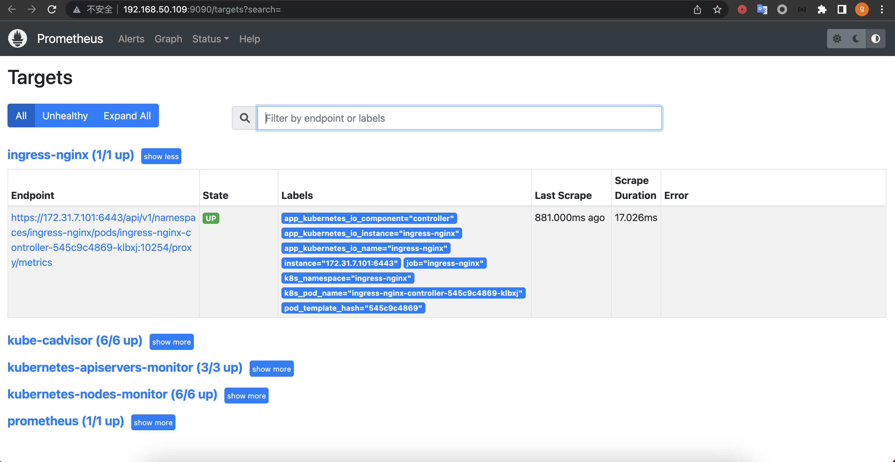
* grafana 导入9614模板查看数据
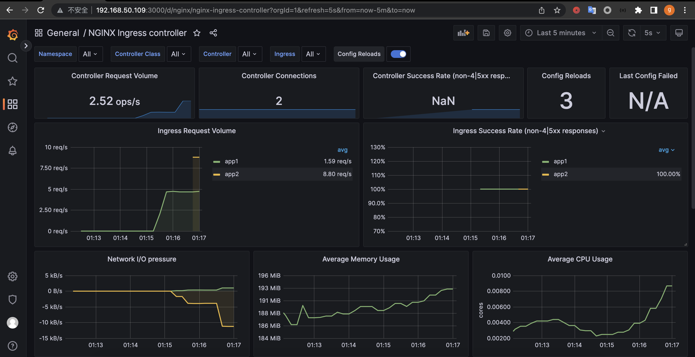