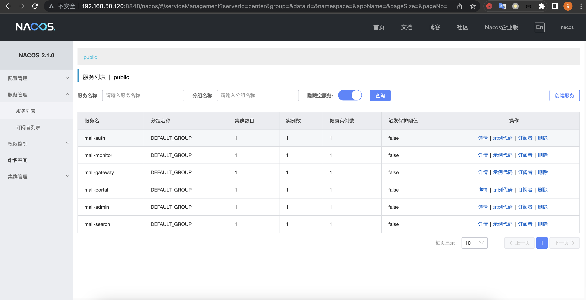
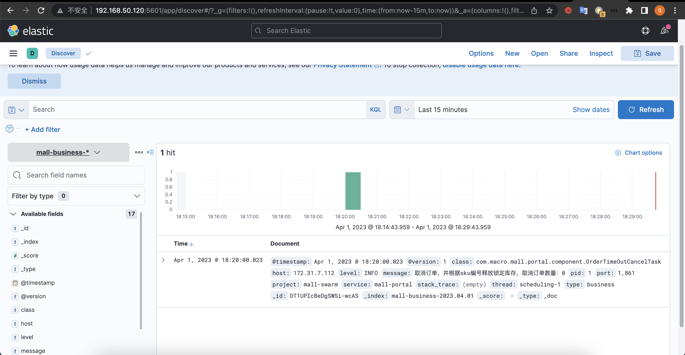
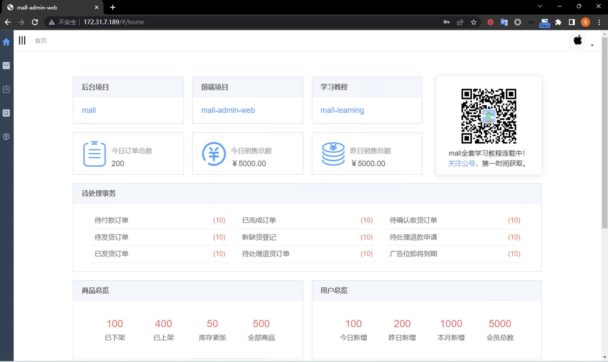

# 1. 部署 mall-swarm 项目所需要的 MySQL、Redis、RabbitMQ、Nacos 等中间件
## 1.1 中间件部署
```bash
## 克隆代码
root@docker1:~# mkdir mall
root@docker1:~# cd mall/
root@docker1:~/mall# git clone https://github.com/macrozheng/mall-swarm.git
## 拷贝中间件的部署文件
root@docker1:~/mall# cd
root@docker1:~# mkdir middware
root@docker1:~# cd middware/
root@docker1:~/middware# cp /root/mall/mall-swarm/document/docker/docker-compose-env.yml docker-compose.yml
root@docker1:~/middware# cp /root/mall/mall-swarm/document/docker/nginx.conf nginx.conf
root@docker1:~/middware# cp ../mall/mall-swarm/document/elk/logstash.conf .
## 创建mysql数据目录
root@docker1:~# mkdir -pv /mydata/mysql/data/db
## 创建redis数据目录
root@docker1:~# mkdir -pv /mydata/redis/data
## 创建nginx数据目录
root@docker1:~# mkdir -pv /mydata/nginx/html /mydata/nginx/log
## 创建rabbitmq数据目录并修改权限
root@docker1:~# mkdir -pv /mydata/rabbitmq/data 
## 创建elasticsearch目录并修改权限
root@docker1:~# mkdir -pv /mydata/elasticsearch/plugins /mydata/elasticsearch/data
root@docker1:~# chown -R 777 /mydata/elasticsearch
## 创建MongoDB数据目录
root@docker1:~# mkdir -pv /mydata/mongo/db
## 修改docker-compose文件
root@docker1:~/middware# vi docker-compose.yml
version: '3'
services:
  mysql:
    image: mysql:5.7
    container_name: mysql
    command: mysqld --character-set-server=utf8mb4 --collation-server=utf8mb4_unicode_ci
    restart: always
    environment:
      MYSQL_ROOT_PASSWORD: root #设置root帐号密码
    ports:
      - 3306:3306
    volumes:
      - /mydata/mysql/data/db:/var/lib/mysql #数据文件挂载
  redis:
    image: redis:7
    container_name: redis
    command: redis-server --appendonly yes
    volumes:
      - /mydata/redis/data:/data #数据文件挂载
    ports:
      - 6379:6379
  nginx:
    image: nginx:1.22
    container_name: nginx
    volumes:
      - ./nginx.conf:/etc/nginx/nginx.conf #配置文件挂载
      - /mydata/nginx/html:/usr/share/nginx/html #静态资源根目录挂载
      - /mydata/nginx/log:/var/log/nginx #日志文件挂载
    ports:
      - 80:80
  rabbitmq:
    image: rabbitmq:3.9-management
    container_name: rabbitmq
    volumes:
      - /mydata/rabbitmq/data:/var/lib/rabbitmq #数据文件挂载
    ports:
      - 5672:5672
      - 15672:15672
  elasticsearch:
    image: elasticsearch:7.17.3
    container_name: elasticsearch
    user: root
    environment:
      - "cluster.name=elasticsearch" #设置集群名称为elasticsearch
      - "discovery.type=single-node" #以单一节点模式启动
      - "ES_JAVA_OPTS=-Xms512m -Xmx1024m" #设置使用jvm内存大小
    volumes:
      - /mydata/elasticsearch/plugins:/usr/share/elasticsearch/plugins #插件文件挂载
      - /mydata/elasticsearch/data:/usr/share/elasticsearch/data #数据文件挂载
    ports:
      - 9200:9200
      - 9300:9300
  logstash:
    image: logstash:7.17.3
    container_name: logstash
    environment:
      - TZ=Asia/Shanghai
    volumes:
      - ./logstash.conf:/usr/share/logstash/pipeline/logstash.conf #挂载logstash的配置文件
    depends_on:
      - elasticsearch #kibana在elasticsearch启动之后再启动
    links:
      - elasticsearch:es #可以用es这个域名访问elasticsearch服务
    ports:
      - 4560:4560
      - 4561:4561
      - 4562:4562
      - 4563:4563
  kibana:
    image: kibana:7.17.3
    container_name: kibana
    links:
      - elasticsearch:es #可以用es这个域名访问elasticsearch服务
    depends_on:
      - elasticsearch #kibana在elasticsearch启动之后再启动
    environment:
      - "elasticsearch.hosts=http://es:9200" #设置访问elasticsearch的地址
    ports:
      - 5601:5601
  mongo:
    image: mongo:4
    container_name: mongo
    volumes:
      - /mydata/mongo/db:/data/db #数据文件挂载
    ports:
      - 27017:27017
  nacos-registry:
    image: nacos/nacos-server:v2.1.0
    container_name: nacos-registry
    environment:
      - "MODE=standalone"
    ports:
      - 8848:8848
  minio:
    image: minio/minio
    container_name: minio
    command: server /data --console-address ":9001" #指定数据目录及console运行端口启动
    volumes:
      - /mydata/minio/data:/data #数据目录挂载
    environment:
      - "MINIO_ROOT_USER=minioadmin"
      - "MINIO_ROOT_PASSWORD=minioadmin"
    ports:
      - 9090:9000
      - 9001:9001
## 拉取镜像
root@docker1:~/middware# docker compose pull
## 启动中间件服务
root@docker1:~/middware# docker compose up -d
## 查看服务状态
root@docker1:~/middware# docker compose ps
```
## 1.2 中间件初始化
### 1.2.2 myql初始化
```bash
## 将 sql 文件拷贝到 mysql 容器根目录
root@docker1:~/middware# cd
root@docker1:~# docker cp mall/mall-swarm/document/sql/mall.sql mysql:/
## 进入 mysql 容器
root@docker1:~# docker exec -it mysql /bin/bash
## 连接mysql
bash-4.2# mysql -uroot -proot --default-character-set=utf8
## 创建远程访问用户
mysql> grant all privileges on *.* to 'reader' @'%' identified by '123456';
Query OK, 0 rows affected, 1 warning (0.00 sec)
## 创建 mall 数据库
mysql> create database mall character set utf8;
## 使用 mall 数据库
mysql> use mall;
## 导入 mall.sql 脚本
mysql> source /mall.sql;
## 查看创建的数据库表
mysql> show tables;
+-----------------------------------------+
| Tables_in_mall                          |
+-----------------------------------------+
| cms_help                                |
| cms_help_category                       |
| cms_member_report                       |
| cms_prefrence_area                      |
| cms_prefrence_area_product_relation     |
| cms_subject                             |
| cms_subject_category                    |
| cms_subject_comment                     |
| cms_subject_product_relation            |
| cms_topic                               |
| cms_topic_category                      |
| cms_topic_comment                       |
| oms_cart_item                           |
| oms_company_address                     |
| oms_order                               |
| oms_order_item                          |
| oms_order_operate_history               |
| oms_order_return_apply                  |
| oms_order_return_reason                 |
| oms_order_setting                       |
| pms_album                               |
| pms_album_pic                           |
| pms_brand                               |
| pms_comment                             |
| pms_comment_replay                      |
| pms_feight_template                     |
| pms_member_price                        |
| pms_product                             |
| pms_product_attribute                   |
| pms_product_attribute_category          |
| pms_product_attribute_value             |
| pms_product_category                    |
| pms_product_category_attribute_relation |
| pms_product_full_reduction              |
| pms_product_ladder                      |
| pms_product_operate_log                 |
| pms_product_vertify_record              |
| pms_sku_stock                           |
| sms_coupon                              |
| sms_coupon_history                      |
| sms_coupon_product_category_relation    |
| sms_coupon_product_relation             |
| sms_flash_promotion                     |
| sms_flash_promotion_log                 |
| sms_flash_promotion_product_relation    |
| sms_flash_promotion_session             |
| sms_home_advertise                      |
| sms_home_brand                          |
| sms_home_new_product                    |
| sms_home_recommend_product              |
| sms_home_recommend_subject              |
| ums_admin                               |
| ums_admin_login_log                     |
| ums_admin_permission_relation           |
| ums_admin_role_relation                 |
| ums_growth_change_history               |
| ums_integration_change_history          |
| ums_integration_consume_setting         |
| ums_member                              |
| ums_member_level                        |
| ums_member_login_log                    |
| ums_member_member_tag_relation          |
| ums_member_product_category_relation    |
| ums_member_receive_address              |
| ums_member_rule_setting                 |
| ums_member_statistics_info              |
| ums_member_tag                          |
| ums_member_task                         |
| ums_menu                                |
| ums_permission                          |
| ums_resource                            |
| ums_resource_category                   |
| ums_role                                |
| ums_role_menu_relation                  |
| ums_role_permission_relation            |
| ums_role_resource_relation              |
+-----------------------------------------+
76 rows in set (0.00 sec)
## master节点连接测试
root@k8s-master1:~# mysql -uroot -proot -h172.31.7.120
```

### 1.2.2 elasticsearch初始化
* 需要安装中文分词器 IKAnalyzer，mall-swarm 项目会用，并重新启动。 
* 注意下载与 Elasticsearch 对应的版本，下载地址: https://github.com/medcl/elasticsearch-analysis-ik/releases
```bash
## 下载插件
root@docker1:~# cd /mydata/elasticsearch/plugins
root@docker1:/mydata/elasticsearch/plugins# wget https://github.com/medcl/elasticsearch-analysis-ik/releases/download/v7.17.3/elasticsearch-analysis-ik-7.17.3.zip
## 解压压缩包
root@docker1:/mydata/elasticsearch/plugins# unzip elasticsearch-analysis-ik-7.17.3.zip -d analysis-ik
## 移除不需要的压缩包
root@docker1:/mydata/elasticsearch/plugins# mv elasticsearch-analysis-ik-7.17.3.zip /tmp/
## 目录修改权限
root@docker1:/mydata/elasticsearch/plugins# chmod 777 -R /mydata/elasticsearch
## 重启elasticsearch
root@docker1:/mydata/elasticsearch/plugins# docker restart elasticsearch
elasticsearch
root@docker1:/mydata/elasticsearch/plugins# docker logs elasticsearch
```
* 通过浏览器插件查看elasticsearch


### 1.2.3 logsatsh初始化
* 旧版本需要安装 json_lines 插件，并重新启动，新版本已内置无需安装
```bash
## 进入logstash容器
root@docker1:/mydata/elasticsearch/plugins# cd
root@docker1:~# docker exec -it logstash /bin/bash
## 验证插件安装
logstash@a49fa5ad3785:~$ logstash-plugin list | grep logstash-codec-json_lines
OpenJDK 64-Bit Server VM warning: Option UseConcMarkSweepGC was deprecated in version 9.0 and will likely be removed in a future release.
logstash-codec-json_lines
logstash@a49fa5ad3785:~$ exit
exit
```
### 1.2.4 rabbitmq初始化
* 1.默认登录账户及密码为 guest

* 2.创建 mall 用户
  * mall 用户密码为 mall，权限为 admin

* 3.创建一个新的虚拟 vhost 名称为/mall

* 4.授予 mall 用户读写 vhost 权限
  * 选择mall用户
  
  * 授权vhosts
  
  * 验证权限
  
### 1.2.5 minio初始化
* 已配置默认使用的 USER 与 PASSWORD 均为 minioadmin
```bash
environment:
- "MINIO_ROOT_USER=minioadmin"
- "MINIO_ROOT_PASSWORD=minioadmin"
```
* 创建存储桶名称为 mall

### 1.2.6 nacos初始化
* 登录nacos

* 允许 prometheus 收集 caocs 指标数据
```bash
## 进入nacos容器
root@docker1:~/middware# docker exec -it nacos-registry bash
## 修改配置文件
[root@63a765cfa9f1 nacos]#  vim /home/nacos/conf/application.properties
 47 management.endpoints.web.exposure.include=*
## 重启nacos
root@docker1:~/middware# docker restart nacos-registry
nacos-registry
## 配置prometheus抓取nacos数据
root@haproxy1:~# vi /apps/prometheus/prometheus.yml
  - job_name: "nacos"
    metrics_path: '/nacos/actuator/prometheus'
    static_configs:
      - targets:
        - 172.31.7.120:8848
        labels:
          project_name: "nacos"
root@haproxy1:~# curl -X POST 127.0.0.1:9090/-/reload 
```
* prometheus 查看nacos target

* nacos查看metric数据指标


### 1.2.7 重启所有服务并验证无异常
```bash
## 重启中间件所有服务
root@docker1:~/middware# docker compose restar
## 查看所有服务
root@docker1:~/middware# docker compose ps
```
# 2. 修改 mall-swarm 项目配置文件中的中间件地址为当前环境的地址
## 2.1 修改配置文件 
* mall-swarm使用nacos作为配置中心，只需要修改导入nacos配置文件
```bash
## 批量替换配置文件
root@docker1:~# cd mall/mall-swarm/config/
root@docker1:~/mall/mall-swarm/config# sed -e 's/db:3306/172.31.7.120:3306/g' -e 's/192.168.3.101:9090/172.31.7.120:9090/g' -e 's/host: logstash/host: 172.31.7.120/g' -e 's/host: redis/host: 172.31.7.120/g' -e 's/host: mongo/host: 172.31.7.120/g' -e 's/host: rabbit/host: 172.31.7.120/g' -e 's/uris: es:9200/uris: 172.31.7.120:9200/g' -e 's/mall-gateway:8201/mall-gateway-service:8201/g' -i admin/mall-admin-prod.yaml gateway/mall-gateway-prod.yaml portal/mall-portal-prod.yaml search/mall-search-prod.yaml

```
## 2.2 将配置文件添加到Nacos中
* 1.添加后台管理配置

* 2.添加网关服务配置

* 3.添加移动端商城系统服务配置

* 4.添加商品搜索系统服务配置

# 3. 基于 maven+JDK 1.8 编译 mall-swarm 项目
## 3.1 构建镜像开启 docker 的远程 API
```bash
## 克隆项目
root@haproxy1:~# mkdir mall-yaml-case-files
root@haproxy1:~# cd mall-yaml-case-files/
root@haproxy1:~/mall-yaml-case-files# git clone https://github.com/macrozheng/mall-swarm.git
## 构建镜像开启 docker 的远程 API
root@haproxy1:~/mall-yaml-case-files# cd mall-swarm/
root@haproxy1:~/mall-yaml-case-files/mall-swarm# vi pom.xml
<docker.host>http://172.31.7.109:2375</docker.host>
## docker开启远程构建api
root@haproxy1:~/mall-yaml-case-files/mall-swarm# vi /etc/systemd/system/docker.service
ExecStart=/opt/kube/bin/dockerd -H unix:///var/run/docker.sock -H tcp://0.0.0.0:2375
## 重启docker
root@haproxy1:~/mall-yaml-case-files/mall-swarm# systemctl daemon-reload
root@haproxy1:~/mall-yaml-case-files/mall-swarm# systemctl restart docker
## 查看监听端口
root@haproxy1:~/mall-yaml-case-files/mall-swarm# ss -tnlp | grep 2375
LISTEN 0      4096               *:2375             *:*    users:(("dockerd",pid=2670,fd=9))
```
## 3.2 执行代码编译及镜像构建
```bash
## 安装jdk8
root@haproxy1:~/mall-yaml-case-files/mall-swarm# apt install openjdk-8-jdk
## 验证jdk8安装
root@haproxy1:~/mall-yaml-case-files/mall-swarm# java -version
openjdk version "1.8.0_362"
OpenJDK Runtime Environment (build 1.8.0_362-8u362-ga-0ubuntu1~22.04-b09)
OpenJDK 64-Bit Server VM (build 25.362-b09, mixed mode)
## 下载maven安装包
root@haproxy1:~/mall-yaml-case-files/mall-swarm# cd /apps/
root@haproxy1:/apps# wget https://mirrors.ustc.edu.cn/apache/maven/maven-3/3.6.3/binaries/apache-maven-3.6.3-bin.tar.gz
## 解压压缩包
root@haproxy1:/apps# tar xf apache-maven-3.6.3-bin.tar.gz
## 为maven创建软连
root@haproxy1:/apps# ln -sv /apps/apache-maven-3.6.3 /apps/maven
## 配置环境变量
root@haproxy1:/apps# vim /etc/profile
export PATH=/apps/maven/bin/:$PATH
## 生效环境变量
root@haproxy1:/apps# source /etc/profile
## 执行mvn命令验证安装
root@haproxy1:/apps# mvn --version
## 下载基础镜像
root@haproxy1:/apps# docker pull java:8
## 执行镜像构建
root@haproxy1:/apps# cd /root/mall-yaml-case-files/mall-swarm/
root@haproxy1:~/mall-yaml-case-files/mall-swarm# mvn clean install package -Dmaven.test.skip=true
[INFO] ------------------------------------------------------------------------
[INFO] Reactor Summary for mall-swarm 1.0-SNAPSHOT:
[INFO]
[INFO] mall-swarm ......................................... SUCCESS [  7.423 s]
[INFO] mall-common ........................................ SUCCESS [ 57.292 s]
[INFO] mall-mbg ........................................... SUCCESS [ 59.602 s]
[INFO] mall-demo .......................................... SUCCESS [ 18.439 s]
[INFO] mall-admin ......................................... SUCCESS [ 24.096 s]
[INFO] mall-search ........................................ SUCCESS [ 17.079 s]
[INFO] mall-portal ........................................ SUCCESS [  7.420 s]
[INFO] mall-monitor ....................................... SUCCESS [ 10.203 s]
[INFO] mall-gateway ....................................... SUCCESS [  6.540 s]
[INFO] mall-auth .......................................... SUCCESS [  8.338 s]
[INFO] ------------------------------------------------------------------------
[INFO] BUILD SUCCESS
[INFO] ------------------------------------------------------------------------
[INFO] Total time:  03:44 min
[INFO] Finished at: 2023-04-01T15:40:30+08:00
[INFO] ------------------------------------------------------------------------
```
## 3.3 将镜像上传到镜像仓库
```bash
## 编写一个批量上传镜像的脚本
root@haproxy1:~# vi mall-swarm-push-image.sh
#!/bin/bash
images=`docker image ls| grep mall| awk '{print $1":"$2}'`
for i in $images;do
    old_image="$i"
    new_image="harbor.yanggc.cn/magedu/"`echo "$old_image"|awk -F'/' '{print $2}'`
    echo "docker tag $old_image $new_image"
    docker tag $old_image $new_image
    echo "docker push $new_image"
    docker push $new_image
done
## 执行脚本
root@haproxy1:~# bash mall-swarm-push-image.sh
```
# 4. 在 k8s 运行 mall-swarm 项目
## 4.1 部署mall-swarm 项目
```bash
## 替换镜像地址
root@haproxy1:~# cd mall-yaml-case-files/mall-swarm/document/k8s/
root@haproxy1:~/mall-yaml-case-files/mall-swarm/document/k8s# sed -e 's/image: macrodocker/image: harbor.yanggc.cn\/magedu/g' -i *-deployment.yaml
## 验证镜像替换
root@haproxy1:~/mall-yaml-case-files/mall-swarm/document/k8s#  grep "image:" ./* -R
./mall-admin-deployment.yaml:          image: harbor.yanggc.cn/magedu/mall-admin:1.0-SNAPSHOT
./mall-auth-deployment.yaml:          image: harbor.yanggc.cn/magedu/mall-auth:1.0-SNAPSHOT
./mall-gateway-deployment.yaml:          image: harbor.yanggc.cn/magedu/mall-gateway:1.0-SNAPSHOT
./mall-monitor-deployment.yaml:          image: harbor.yanggc.cn/magedu/mall-monitor:1.0-SNAPSHOT
./mall-portal-deployment.yaml:          image: harbor.yanggc.cn/magedu/mall-portal:1.0-SNAPSHOT
./mall-search-deployment.yaml:          image: harbor.yanggc.cn/magedu/mall-search:1.0-SNAPSHOT
## 替换nacos服务发现地址
root@haproxy1:~/mall-yaml-case-files/mall-swarm/document/k8s# sed -e 's/192.168.3.101/172.31.7.120/g' -i *-deployment.yaml
## 验证替换
root@haproxy1:~/mall-yaml-case-files/mall-swarm/document/k8s# grep -B 1 -R '172.31.7.120' .
## 部署mall-swarm服务
root@haproxy1:~/mall-yaml-case-files/mall-swarm/document/k8s# kubectl apply -f .
## 查看部署资源
root@haproxy1:~/mall-yaml-case-files/mall-swarm/document/k8s# kubectl get pod,svc
NAME                                           READY   STATUS    RESTARTS        AGE
pod/mall-admin-deployment-6595b48c99-9mlnb     1/1     Running   0               6m18s
pod/mall-auth-deployment-6c5b8f9796-kdmsx      1/1     Running   0               6m18s
pod/mall-gateway-deployment-768d49f8d8-lstmw   1/1     Running   0               6m17s
pod/mall-monitor-deployment-db5b5ddb7-9gtm5    1/1     Running   0               6m17s
pod/mall-portal-deployment-6798757d96-frjt9    1/1     Running   5 (2m17s ago)   6m17s
pod/mall-search-deployment-5468d46b8-4mx5t     1/1     Running   0               6m17s

NAME                           TYPE        CLUSTER-IP       EXTERNAL-IP   PORT(S)          AGE
service/kubernetes             ClusterIP   10.100.0.1       <none>        443/TCP          27d
service/mall-admin-service     ClusterIP   10.100.207.79    <none>        8080/TCP         6m18s
service/mall-auth-service      ClusterIP   10.100.35.219    <none>        8401/TCP         6m18s
service/mall-gateway-service   NodePort    10.100.48.211    <none>        8201:30201/TCP   6m17s
service/mall-monitor-service   ClusterIP   10.100.193.168   <none>        8101/TCP         6m17s
service/mall-portal-service    ClusterIP   10.100.196.181   <none>        8085/TCP         6m17s
service/mall-search-service    ClusterIP   10.100.20.183    <none>        8081/TCP         6m17s
service/php-apache             ClusterIP   10.100.24.49     <none>        80/TCP           8d
```
## 4.2 访问 mall-monitor-service(Spring Boot Admin)
```bash
## 修改mall-monitor-service type为NodePort
root@haproxy1:~/mall-yaml-case-files/mall-swarm/document/k8s# vi mall-monitor-service.yaml
apiVersion: v1
kind: Service
metadata:
  name: mall-monitor-service
  namespace: default
spec:
  type: NodePort
  selector:
    app: mall-monitor
  ports:
    - name: http
      protocol: TCP
      port: 8101
      targetPort: 8101
## 应用配置
root@haproxy1:~/mall-yaml-case-files/mall-swarm/document/k8s# kubectl apply -f mall-monitor-service.yaml
## 查看service的端口信息
root@haproxy1:~/mall-yaml-case-files/mall-swarm/document/k8s# kubectl get svc
NAME                   TYPE        CLUSTER-IP       EXTERNAL-IP   PORT(S)          AGE
kubernetes             ClusterIP   10.100.0.1       <none>        443/TCP          27d
mall-admin-service     ClusterIP   10.100.207.79    <none>        8080/TCP         14m
mall-auth-service      ClusterIP   10.100.35.219    <none>        8401/TCP         14m
mall-gateway-service   NodePort    10.100.48.211    <none>        8201:30201/TCP   14m
mall-monitor-service   NodePort    10.100.193.168   <none>        8101:47275/TCP   14m
mall-portal-service    ClusterIP   10.100.196.181   <none>        8085/TCP         14m
mall-search-service    ClusterIP   10.100.20.183    <none>        8081/TCP         14m
php-apache             ClusterIP   10.100.24.49     <none>        80/TCP
## 查看mall-monitor的密码
root@haproxy1:~/mall-yaml-case-files/mall-swarm/document/k8s# vi /root/mall-yaml-case-files/mall-swarm/mall-monitor/src/main/resources/application.yml
    user:
      name: macro
      password: 123456
```
* mall-monitor查看应用信息

* mall-monitor查看应墙

## 4.3 查看nacos服务列表

## 4.4 访问 mall-gateway-service
```bash
## 配置haproxy反向代理
root@haproxy1:~/mall-yaml-case-files/mall-swarm/document/k8s# cd
root@haproxy1:~# vi /etc/haproxy/haproxy.cfg
listen mall-80
    bind 172.31.7.188:80
    mode tcp
    #balance leastconn
    server 172.31.7.101  172.31.7.101:30201  check inter 2000 fall 3 rise 5
    server 172.31.7.102  172.31.7.102:30201  check inter 2000 fall 3 rise 5
    server 172.31.7.103  172.31.7.103:30201  check inter 2000 fall 3 rise 5
## 重启haproxy
root@haproxy1:~# systemctl restart haproxy.service
## 宿主机配置hosts
172.31.7.188 api.ygc.cn
```
* 浏览器访问http://api.ygc.cn/doc.html#/home

# 5. 编译前端服务 mall-admin-web
## 5.1 安装npm
```bash
## 下载nodejs 二进制压缩包
root@haproxy1:~# wget https://registry.npmmirror.com/-/binary/node/v12.14.0/node-v12.14.0-linux-x64.tar.gz
## 解压压缩包
root@haproxy1:~# cd /usr/local/src/
root@haproxy1:/usr/local/src# tar -xf ~/node-v12.14.0-linux-x64.tar.gz
## node目录做一个软连
root@haproxy1:/usr/local/src# ln -s node-v12.14.0-linux-x64 node
## 配置环境变量
root@haproxy1:/usr/local/src# vim /etc/profile
export PATH=/usr/local/src/node/bin:$PATH
## 应用环境变量
root@haproxy1:/usr/local/src# source /etc/profile
## 测试node安装
root@haproxy1:/usr/local/src# npm version
{
  npm: '6.13.4',
  ares: '1.15.0',
  brotli: '1.0.7',
  cldr: '35.1',
  http_parser: '2.8.0',
  icu: '64.2',
  llhttp: '1.1.4',
  modules: '72',
  napi: '5',
  nghttp2: '1.39.2',
  node: '12.14.0',
  openssl: '1.1.1d',
  tz: '2019c',
  unicode: '12.1',
  uv: '1.33.1',
  v8: '7.7.299.13-node.16',
  zlib: '1.2.11'
}
root@haproxy1:/usr/local/src# node -v
v12.14.0
root@haproxy1:/usr/local/src# npx -v
6.13.4
```
## 5.2 clone 源代码并执行编译
```bash
## 克隆代码
root@haproxy1:~# git clone https://github.com/macrozheng/mall-admin-web.git
root@haproxy1:~# cd mall-admin-web/
## 修改前端监听地址
root@haproxy1:~/mall-admin-web# vim config/index.js
 16     host: '0.0.0.0', // can be overwritten by process.env.HOST
 17     port: 8090, // can be overwritten by process.env.PORT, if port is in use, a free one will be determined
## 修改后端api地址
root@haproxy1:~/mall-admin-web# vim config/dev.env.js
  7   BASE_API: '"https://admin-api.macrozheng.com"'
## 修改npm镜像源
root@haproxy1:~/mall-admin-web# npm config set registry https://registry.npm.taobao.org
## 验证镜像源配置
root@haproxy1:~/mall-admin-web# npm config list
; cli configs
metrics-registry = "https://registry.npm.taobao.org/"
scope = ""
user-agent = "npm/6.13.4 node/v12.14.0 linux x64"

; userconfig /root/.npmrc
registry = "https://registry.npm.taobao.org/"

; node bin location = /usr/local/src/node-v12.14.0-linux-x64/bin/node
; cwd = /root/mall-admin-web
; HOME = /root
; "npm config ls -l" to show all defaults.
## 安装依赖包
root@haproxy1:~/mall-admin-web# apt install python2.7
root@haproxy1:~/mall-admin-web# ln -s /usr/bin/python2.7 /usr/bin/python2
root@haproxy1:~/mall-admin-web# npm install -g npm-install-peers
root@haproxy1:~/mall-admin-web# SASS_BINARY_SITE=https://npm.taobao.org/mirrors/node-sass/  npm install --unsafe-perm node-sass
root@haproxy1:~/mall-admin-web# npm install --unsafe-perm
```
## 5.3 运行测试环境
### 5.3.1 使用开源项目api
```bash
## 运行测试环境
root@haproxy1:~/mall-admin-web# npm run dev

使用官方后端:
admin macro123
```
* 访问mall-admin-web登录界面

* 访问mall-admin-web管理页面

### 5.3.2 使用本地k8s部署的api
```bash
## 修改api为haproxy代理后的地址
root@haproxy1:~/mall-admin-web# vi config/dev.env.js
  7   BASE_API: '"http://172.31.7.188/mall-admin"'
## 运行测试环境
root@haproxy1:~/mall-admin-web# npm run dev
```
* 访问mall-admin-web登录界面

* 访问mall-admin-web管理页面

## 5.4 执行代码构建
```bash
## 执行编译命令
root@haproxy1:~/mall-admin-web# npm run build
## 拷贝编译好的静态文件到nginx服务器目录
root@haproxy1:~/mall-admin-web# cd dist/
root@haproxy1:~/mall-admin-web/dist# scp -r * 172.31.7.120:/mydata/nginx/html/
## 宿主机绑定hosts
~ > sudo vi /etc/hosts
192.168.50.120  admin.ygc.cn
```
* 浏览器访问mall-admin-web


## 5.5 kibana 验证 mall 日志
* 查看debug日志

* 查看business日志
  

# 6. 构建前端服务 mall-admin-web 镜像，并在 K8S 运行前端服务 mall-admin-web 服务
## 6.1 部署skywalking
```bash
## 克隆代码
root@docker1:~# git clone https://github.com/apache/skywalking.git
## 修改docker-compose.yml
root@docker1:~/skywalking/docker# vi docker-compose.yml
version: '3.8'
services:
  elasticsearch2:
    image: docker.elastic.co/elasticsearch/elasticsearch-oss:${ES_VERSION}
    container_name: elasticsearch2
    ports:
      - "9400:9200"
    healthcheck:
      test: [ "CMD-SHELL", "curl --silent --fail localhost:9200/_cluster/health || exit 1" ]
      interval: 30s
      timeout: 10s
      retries: 3
      start_period: 10s
    environment:
      - discovery.type=single-node
      - bootstrap.memory_lock=true
      - "ES_JAVA_OPTS=-Xms512m -Xmx512m"
    ulimits:
      memlock:
        soft: -1
        hard: -1

  oap:
    image: ${OAP_IMAGE}
    container_name: oap
    depends_on:
      elasticsearch2:
        condition: service_healthy
    links:
      - elasticsearch2
    ports:
      - "11800:11800"
      - "12800:12800"
    healthcheck:
      test: [ "CMD-SHELL", "/skywalking/bin/swctl ch" ]
      interval: 30s
      timeout: 10s
      retries: 3
      start_period: 10s
    environment:
      SW_STORAGE: elasticsearch
      SW_STORAGE_ES_CLUSTER_NODES: elasticsearch2:9200
      SW_HEALTH_CHECKER: default
      SW_TELEMETRY: prometheus
      JAVA_OPTS: "-Xms2048m -Xmx2048m"

  ui:
    image: ${UI_IMAGE}
    container_name: ui
    depends_on:
      oap:
        condition: service_healthy
    links:
      - oap
    ports:
      - "8080:8080"
    environment:
      SW_OAP_ADDRESS: http://oap:12800
      SW_ZIPKIN_ADDRESS: http://oap:9412
## 修改镜像地址
root@docker1:~/skywalking/docker# vi .env
ES_VERSION=7.4.2
OAP_IMAGE=apache/skywalking-oap-server:latest
UI_IMAGE=apache/skywalking-ui:latest
## 下载镜像
root@docker1:~/skywalking/docker# docker compose pull
## 启动服务
root@docker1:~/skywalking/docker# docker compose up -d
## 查看服务
root@docker1:~/skywalking/docker# docker compose ps
```
* 浏览器访问skywalking

## 6.2 镜像构建
```bash
## 进入到编译资源目录
root@haproxy1:~# cd /opt/mall/4.mall-admin-web-dockerfile-and-yaml/dockerfile/
## 解压dockerfile资源压缩包
root@haproxy1:/opt/mall/4.mall-admin-web-dockerfile-and-yaml/dockerfile# unzip mall-admin-web-and-dockerfile.zip
## 拷贝编译资源到mall-web-admin编译目录~/mall-admin-web/
root@haproxy1:/opt/mall/4.mall-admin-web-dockerfile-and-yaml/dockerfile# cd mall-admin-web/
root@haproxy1:/opt/mall/4.mall-admin-web-dockerfile-and-yaml/dockerfile/mall-admin-web# cp -r docker-images ~/mall-admin-web/
## 进入到编译目录
root@haproxy1:/opt/mall/4.mall-admin-web-dockerfile-and-yaml/dockerfile/mall-admin-web# cd  ~/mall-admin-web/docker-images/
## 替换镜像地址
root@haproxy1:~/mall-admin-web/docker-images# sed -e 's/harbor.linuxarchitect.io/harbor.yanggc.cn/g' -i build-command.sh
## 修改编译脚本
root@haproxy1:~/mall-admin-web/docker-images# vi build-command.sh
#!/bin/bash
TAG=$1
rm -rf ./dist/*
mkdir -p ./dist
cp -r ../dist/* ./dist/
docker build -t harbor.yanggc.cn/magedu/mall-admin-web:$TAG .
docker push harbor.yanggc.cn/magedu/mall-admin-web:$TAG
## 修改Dockerfile配置
root@haproxy1:~/mall-admin-web/docker-images# vi Dockerfile
FROM ubuntu:20.04

RUN rm -rf /etc/localtime && ln -sv /usr/share/zoneinfo/Asia/Shanghai /etc/localtime && apt update && apt  install iproute2  ntpdate tcpdump telnet traceroute  gcc openssh-server lrzsz tree  openssl libssl-dev libpcre3 libpcre3-dev zlib1g-dev  iotop unzip zip make libgetopt-argvfile-perl vim -y

ADD openresty-1.21.4.1.tar.gz /usr/local/src/
RUN cd /usr/local/src/openresty-1.21.4.1/ && ./configure --prefix=/apps/openresty \
  --with-luajit \
  --with-pcre \
  --with-http_iconv_module \
  --with-http_realip_module \
  --with-http_sub_module \
  --with-http_stub_status_module  \
  --with-stream \
  --with-stream_ssl_module && make && make install

RUN mkdir /apps/openresty/nginx/conf/conf.d -pv && mkdir /data
ADD skywalking-nginx-lua-0.6.0 /data/skywalking-nginx-lua-0.6.0
ADD nginx.conf /apps/openresty/nginx/conf/nginx.conf
ADD conf.d /apps/openresty/nginx/conf/conf.d
COPY dist /apps/openresty/nginx/html
CMD ["/apps/openresty/nginx/sbin/nginx"]

## 修改nginx配置
root@haproxy1:~/mall-admin-web/docker-images# vi conf.d/myserver.conf
 19         require("skywalking.client"):startBackendTimer("http://172.31.7.120:12800")
 33         server_name   mall.ygc.cn;
## 编译镜像
root@haproxy1:~/mall-admin-web/docker-images# bash build-command.sh v1 
```
## 6.3 部署 mall-admin-web
```bash
## 修改镜像地址
root@haproxy1:~# cd /opt/mall/4.mall-admin-web-dockerfile-and-yaml/yaml/
root@haproxy1:/opt/mall/4.mall-admin-web-dockerfile-and-yaml/yaml# sed -e 's/harbor.linuxarchitect.io/harbor.yanggc.cn/g' -i mall-admin-web-deployment.yaml
## 部署 mall-admin-web
root@haproxy1:/opt/mall/4.mall-admin-web-dockerfile-and-yaml/yaml# kubectl apply -f .
deployment.apps/magedu-mall-web-admin-deployment created
service/magedu-mall-web-admin-service created
## 查看部署的资源
root@haproxy1:/opt/mall/4.mall-admin-web-dockerfile-and-yaml/yaml# kubectl get svc,pod
NAME                                    TYPE        CLUSTER-IP       EXTERNAL-IP   PORT(S)                      AGE
service/kubernetes                      ClusterIP   10.100.0.1       <none>        443/TCP                      28d
service/magedu-mall-web-admin-service   NodePort    10.100.108.59    <none>        80:32080/TCP,443:32091/TCP   30s
service/mall-admin-service              ClusterIP   10.100.207.79    <none>        8080/TCP                     4h21m
service/mall-auth-service               ClusterIP   10.100.35.219    <none>        8401/TCP                     4h21m
service/mall-gateway-service            NodePort    10.100.48.211    <none>        8201:30201/TCP               4h21m
service/mall-monitor-service            NodePort    10.100.193.168   <none>        8101:47275/TCP               4h21m
service/mall-portal-service             ClusterIP   10.100.196.181   <none>        8085/TCP                     4h21m
service/mall-search-service             ClusterIP   10.100.20.183    <none>        8081/TCP                     4h21m
service/php-apache                      ClusterIP   10.100.24.49     <none>        80/TCP                       8d

NAME                                                   READY   STATUS    RESTARTS        AGE
pod/magedu-mall-web-admin-deployment-bb7dcdf9b-w9696   1/1     Running   0               30s
pod/mall-admin-deployment-6595b48c99-9mlnb             1/1     Running   0               4h21m
pod/mall-auth-deployment-6c5b8f9796-kdmsx              1/1     Running   0               4h21m
pod/mall-gateway-deployment-768d49f8d8-gg4b8           1/1     Running   0               99m
pod/mall-monitor-deployment-db5b5ddb7-9gtm5            1/1     Running   0               4h21m
pod/mall-portal-deployment-6798757d96-frjt9            1/1     Running   5 (4h17m ago)   4h21m
pod/mall-search-deployment-5468d46b8-4mx5t             1/1     Running   0               4h21m

## 配置负载均衡
root@haproxy1:/opt/mall/4.mall-admin-web-dockerfile-and-yaml/yaml# vi /etc/haproxy/haproxy.cfg
listen mall-admin-web-80
    bind 172.31.7.189:80
    mode tcp
    #balance leastconn
    server 172.31.7.101  172.31.7.101:32080  check inter 2000 fall 3 rise 5
    server 172.31.7.102  172.31.7.102:32080  check inter 2000 fall 3 rise 5
    server 172.31.7.103  172.31.7.103:32080  check inter 2000 fall 3 rise 5
## 重启负载均衡
root@haproxy1:/opt/mall/4.mall-admin-web-dockerfile-and-yaml/yaml# systemctl restart haproxy
```
* nodeport访问mall-admin-web

* 负载均衡访问mall-admin-web

* 负载均衡绑定域名访问mall-admin-web


## 6.4 mall-admin-web使用k8s部署的api
```bash
## 修改正式环境api地址
root@haproxy1:~/mall-admin-web/docker-images# vi ../config/prod.env.js
  4   BASE_API: '"http://172.31.7.188/mall-admin"'
## 重新编译项目
root@haproxy1:~/mall-admin-web/docker-images# cd ../
root@haproxy1:~/mall-admin-web# npm run build
## 构建镜像
root@haproxy1:~/mall-admin-web# cd docker-images/
root@haproxy1:~/mall-admin-web/docker-images# bash build-command.sh v2
## 修改mall-admin-web yaml文件地址
root@haproxy1:/opt/mall/4.mall-admin-web-dockerfile-and-yaml/yaml# vi mall-admin-web-deployment.yaml
21         image: harbor.yanggc.cn/magedu/mall-admin-web:v2
## 重新应用yaml文件
root@haproxy1:/opt/mall/4.mall-admin-web-dockerfile-and-yaml/yaml# kubectl apply -f .
deployment.apps/magedu-mall-web-admin-deployment configured
service/magedu-mall-web-admin-service unchanged
## 查看pod状态
root@haproxy1:/opt/mall/4.mall-admin-web-dockerfile-and-yaml/yaml# kubectl get pod
NAME                                                READY   STATUS    RESTARTS        AGE
magedu-mall-web-admin-deployment-6655db4c59-kb9dc   1/1     Running   0               26s
mall-admin-deployment-6595b48c99-9mlnb              1/1     Running   0               5h2m
mall-auth-deployment-6c5b8f9796-kdmsx               1/1     Running   0               5h2m
mall-gateway-deployment-768d49f8d8-gg4b8            1/1     Running   0               140m
mall-monitor-deployment-db5b5ddb7-9gtm5             1/1     Running   0               5h2m
mall-portal-deployment-6798757d96-frjt9             1/1     Running   5 (4h58m ago)   5h2m
mall-search-deployment-5468d46b8-4mx5t              1/1     Running   0               5h2m
```
* 浏览器使用域名访问并用开发模式查看api地址


## 6.5 skywalking验证
* 浏览器刷新几次mall-admin-web页面，查看skywalking

* skywalking查看endpoint
